# SYNAPSE — Changelog & detailed capability

The full version-by-version history and per-tool capability detail. The [README](README.md) keeps the artist-facing essentials; this is the deep record.

## v5.32.0 — the render path is bounded

*2026-07-18: the render freeze is closed. The confirmed chokepoint — every render tool funneling through `_handle_render` → `executeInMainThreadWithResult` (no timeout) → `node.render()`, freezing the whole UI for the length of the render — is now bounded on the WS path, and the BLACKBOX crash-recovery harness ships alongside it. **4,571 tests passing** (+34; 4 known local-only `test_bridge_endpoint` live-sidecar isolation failures tracked separately, CI green) · Houdini 22.0.368.*

**THE BOUNDED RENDER PATH (`server/render_session.py`, `_handle_render_bounded` in `handlers_render.py`):** the WS path renders through a session registry — single-flight tokens, poll-based status, a 60s token flow — instead of an unbounded main-thread block. **`server/foreground_guard.py`** adds the XPU foreground guard: an OptiX cache-warmth gate that refuses to launch a cold-cache XPU render inline (a cold OptiX cache is what turns a bounded render into a multi-minute freeze). Panel + `/mcp` paths are guard-only by design. The husk offload alternative was REFUTED live on Indie (`Unable to load render plugin: karma` — architecture proven, license blocks pixels). External watcher: `scripts/render_watch.ps1` (tested). Operator card: `docs/render-freeze-operator-card.md`. CRUCIBLE findings F1–F8 applied; post-fix gates closed 2026-07-18 (Gate 1: 168✓).

**BLACKBOX (`scripts/blackbox_recover.py`, `blackbox_mine.py`):** crash-recovery harness for silent Claude-CLI deaths — capsules everything in-flight at death, with `--detect` wired as a SessionStart hook so the next session opens knowing what the last one was doing. Local capsules (`harness/state/recovery/`) stay untracked. Operator card: `docs/blackbox-operator-card.md`.

## v5.31.0 — the supervisor surface is real

*2026-07-17: the panel Joe runs now tells the truth about its own work. Two audit windows that were previously missing or fake — the render receipt and the session-fidelity readout — are live and honesty-guarded. **4,537 tests passing, 0 failures** (+22) · Houdini 22.0.368 · verified offscreen (hython), live end-to-end owed.*

Completes `docs/reviews/panel-design-capability-audit-2026-07-17.md`: the audit found the panel faithful on invocation (the 5 engines, the 115-tool palette) but thin on the AUDIT surface that IS SYNAPSE's thesis. The supervisor asks three questions of any agent action — *did we get it · what changed · can we get back*. Two now have honest windows.

**M2 — THE REAL RENDER RECEIPT ("did we get it"; `panel/render_receipt.py`, `face_review.py`):** the Review face showed a *fake* receipt — a chat line labeled "verdict" beside a hardwired `BL-007` "EXR not written" FAIL that fired on every render. Gone. In its place: RETINA T0 is run **in the panel** (pure-python, off the Qt thread) against the render's real manifest + on-disk products, and the result is a tri-state receipt — pass / fail / inconclusive — that **cannot fake green**. A crucible proved it across real cases: missing product → red, husk-no-op / `.done`-missing → honest fail, unreadable → amber, no manifest → "no receipt yet" (grey, never green). An ast source-pin fails the build if `fail`/`inconclusive` ever maps to the green token. Pure-panel, read-only: the render handler is untouched, no sidecar/state is written, and the persisted-receipt seam (Q2) stays a separate, human-ratified item.

**M4 — THE FIDELITY READOUT ("what changed"; `panel/integrity_readout.py`, `session_integrity.py`):** the IntegrityBlock (fidelity, scene-hash delta, anchors) was extracted into the session tracker and read by *nothing* in the installed panel — CLAUDE.md's "fidelity = 1.0 or stop" guarantee had no window. Now the Work face shows an honest session-fidelity readout: no operations → "no operations tracked yet" (never a false green 100%), any violation → amber, 3+ → red. The near-miss is closed — a 1/100 violation reads "99%", never a lying "100%". Same ast source-pin discipline. A new Qt-free `SessionIntegrityTracker.summary()` keeps the honesty-critical aggregation testable under stock CI (the panel's Qt tests skip there).

**HONESTY BY CONSTRUCTION.** Both widgets isolate their color decision in one pure function that names the green token only from a genuine all-clear, and both are pinned by Qt-free source-pins — the panel's Qt tests skip under stock CI, so the pins are what actually guard the honesty. Pure-panel throughout: no bridge, handler, or state touched; `tokens.py` untouched (the accent stays caged); zero `hou` in the panel paths. Each mile built on an isolated branch, verified by the panel-design warden (G3 + the 420px floor) + an adversarial crucible, merged only on an explicit human gate. Verified via hython-offscreen (the widgets build + render every state with the correct tokens) + the full suite, **and live in a running H22.0.368 session** (2026-07-17): the panel modules + honesty logic confirmed in the real interpreter, and `compute_receipt` proven honest across **182 real render manifests** on disk — green exactly once (the one render whose pixels survived), 25 inconclusive, 156 fail, discriminating by actual disk state. The one link the bridge can't drive — the receipt *visually* appearing in the panel on the artist's own render — is the single-glance confirmation left to the seat.

## v5.30.0 — the provider seam, typed (IToolProvider)

*2026-07-17: the MCP provider seam gets its contract written down. SYNAPSE has always had a mount point for tool sources — its own 115 tools today, foreign Houdini MCPs tomorrow — but `providers.get()` returned `Any`. Now the contract is typed and tested. **4,515 tests passing, 0 failures** (+3) · Houdini 22.0.368 · a foundation release, zero behavior change.*

**M1 — TYPE THE PROVIDER CONTRACT (`cognitive/interfaces.py`, `providers/__init__.py`):** the seam existed and was already honored (`ApexMCPProvider` implements `list_tools`/`call_tool`); it was simply never written down. Adds `@runtime_checkable IToolProvider` — `id` + `list_tools() -> list[ToolDef]` + `call_tool(name, args) -> Envelope` — typed from the **observed shape of the real implementation**, not a sketch (the sketch guessed `provider_id`; the class actually uses `id` — runtime truth beats priors, caught before a line was bent). `get()` narrows `Any -> IToolProvider`, annotation-only (lazy via `__future__` + `TYPE_CHECKING`, no runtime import, no behavior change). The provider satisfies it **unmodified** — asserted by a contract test that *bites*: a non-conforming stub is rejected, not decorative.

**THE FOUNDATION, NOT THE MOUNTING.** This is M1 of a six-move plan (`docs/SYNAPSE_MCP_SEAM_BLUEPRINT.md`). It does **not** mount foreign MCPs or retire native tools yet (M2–M6) — it makes those possible without a rewrite: the day a better tool ships, it becomes a provider and a precedence table decides, on evidence. A cross-check of the shipped H22.0.368 install confirmed there is **no first-party MCP surface yet** — so the real APEX-MCP endpoint stays mocked (`endpoint="mock"`) until SideFX actually ships it (task 1.7 stays shut).

**LANDED UNDER GOVERNANCE:** built on an isolated branch (master untouched until merge), verified across three independent lenses — an admissibility gate (scope confined to 5 files, zero state writes, `apex_mcp.py` unmodified), an adversarial crucible (full suite green, the Protocol proven to bite, zero `hou` in the cognitive layer, `get()` annotation-only), and a local-install cross-reference — then merged only on an explicit human gate. Ratified nothing beyond M1; M2–M6 / task 1.7 / gate-0.1 untouched.

## v5.29.0 — RETINA T1: the scoped-delta proof engine is live

*One arc, 2026-07-17: the perception co-processor's classical-CV tier lands — the render receipt can now **prove containment**, not just confirm a frame exists. Plus the two silent-wrong H22 twins killed and the Rulebook's charter. **4,512 tests passing, 0 failures** (+76 over v5.28.0) · Houdini 22.0.368 · the proof engine for "only the crystal's pixels changed."*

**RETINA M2 — T1, THE PROOF ENGINE (`retina/t1.py`, `retina/ingest.py`, `retina/events.py`):** T0 answered "did the frame happen?"; T1 answers "did we get *only* what we asked for?" — the scoped-delta proof made real. A worker in its own venv (`opencv-python-headless==5.0.0.93` abi3 + OpenImageIO 3.1.15, exact-pinned) ingests before/after EXRs (linear float32 for metrics, `$OCIO` read-only-protected, ID/Raw AOVs untransformed) and computes a 7-metric classical kit + the scoped-delta primitives: **change_mask ∩ id_matte → containment + ssim_outside.** Verified independently by the assay on real pixels — SSIM 1.0 on identical, the change mask *localizing* a known delta, containment passing when contained and failing on leak. Schema-sibling with T0 (shared `retina/events.py`); **zero `cv2` in the Houdini host, zero `hou` in the worker** — the eye never destabilizes the hand. This is the tier that turns "SYNAPSE swapped the crystal to Dark_Glass and only the crystal's pixels changed" from a claim into a receipt.

**THE CRUCIBLE, TWICE:** M2's first build passed its own suite but crashed on garbage-*typed* manifest fields (a corrupted on-disk manifest → unhandled `TypeError`, not an honest verdict) — the crucible caught it (correctly de-scoping the flood/cancel cases as M3-worker concerns that don't exist yet), forced a Pass-3, and the fix is type-tolerant + regression-pinned: a malformed field is now inconclusive, never a vacuous pass, never a traceback. The forge-builds / crucible-attacks separation caught its fourth plausible-looking lie of the H22 cycle. And **M1b** closed T0's own honesty tail (all-products-missing now reports inconclusive, not a vacuous pass).

**THE TWO SILENT-WRONG TWINS, DEAD (PL-M1):** the last two places SYNAPSE was quietly false on H22, both live-probe-verified on the running 22.0.368:
- **C-MTLX** — `mtlxstandard_volume` is table-absent on 22.0.368; the destruction recipe *raised* at `createNode` the moment an artist instantiated it. Repointed to `mtlxvolume` (the probe **decided** the substitute: parms `vdf`/`edf` = the volume-shader analog, not the `mtlxvolumematerial` binder), frozen by a conformance fixture over the emitted-spelling surface.
- **C-U5** — `lop_knowledge.py` served H21 Solaris CONTEXT truth on an H22 host (per-shape lights that no longer exist, an `assignmaterial` parm that drifted, `plane` marked absent when it now exists). Given the major-aware resolver its sibling `wiring.py` already had, plus a re-probed `lop_solaris_knowledge_22.json` (renamed instancer family in, stale lights out) and fail-loud-across-majors. The assay confirmed the live traps: `createNode('instancer')→copytopoints` alias, punycode light parms on `::2.0/::3.0`.

**THE RULEBOOK — MILE 0 (`SYNAPSE_RULEBOOK.md`, `rulebook/`):** the charter of SYNAPSE's Core Specification — contract knowledge (scattered across audits, protocols, commit messages, tests) unified into one indexed, CI-enforced structure. Mile 0 ships the skeleton, an empty-but-valid manifest, and five meta-tests (schema · binding · surface-integrity · amendment-lock · phantom-lint) — each crucible-proven to genuinely bite. The defining property: a `ratified` rule with no green test binding **fails CI**. "Runtime truth beats priors" stops living in memory and becomes law.

**THE GOVERNANCE LAYER — three papers, one thesis:** the proof-leg blueprint (the mile plan), the proof-strategy blueprint (the supervisor-layer re-aim — measure by what SYNAPSE can *prove*, not how fast it builds), and the sprawl-governance fix (`PL-M<n>` / `RBK-M<n>` ladder disambiguation + one SSOT per ruling). The strategy's crucible-forced correction: the supervisor layer is ~90% built and mostly *unwired* — the three seams (ledger · render-receipt · undo) are the current work.

**HONESTY LEDGER:** T1 verdicts are threshold-tolerances, never equalities (Commandment 7 extends to thresholds); `qc_profiles.toml` ships the blueprint's illustrative defaults labeled "NOT tuned production thresholds"; the OIIO ingest leg's live-verify is owed at S-LIVE (disclosed, not hidden). Bounded M2 crucible findings deposited as `RETINA.M3-worker-hardening` (JSONL atomicity · path-containment · live OIIO verify — ride M3's disk-outbox worker). Mechanism specifics beyond the RETINA blueprint's §5 remain NDA-only; the scoped-delta system claim stays CIP-queued.

## v5.28.0 — RETINA T0: the render receipt's first tier is live

*One arc, 2026-07-16→17: the perception co-processor's foundation tier lands — the frame gets a file-level receipt, verified against a running Houdini. **4,436 tests passing, 0 failures** (+47 over v5.27.0) · Houdini 22.0.368 · the first working perception code, T0 file-truth.*

**WHAT T0 DOES:** given a render SYNAPSE asked for, T0 answers "did the frame actually happen, as declared" — products written and non-zero, the `.done` completion sentinel present, product count matching, resolution and AOV list matching the manifest, and the expectation fingerprint round-tripped. It kills the BL-007 class (a render silently not written, missing AOVs, wrong resolution passing as success). The `retina/` worker tree lives at the repo root, **outside the host process** by construction — zero `hou`, zero `cv2` at M1 — with a pure-Python multi-part-aware EXR header reader; the whole tier is testable against synthetic manifests without Houdini running.

**THE PERCEPTION TRUTH CATALOG (`harness/notes/perception_truth_22.0.368.json`) — truth cycle ⑤, live-probed:** the render/readback surface, verified on the running 22.0.368, not inferred:
- **Karma object-ID AOV** — `karmarendersettings.primid=1` → source `ray:primid` → EXR part `primid`, channel `primid.id`, **float32**, with confirmed **CPU + XPU parity** (the flagship scoped-delta proof's matte source). Not a bare render-var — the probe found the real mechanism, which the HDK never documented.
- **The sentinel timing, measured** — EXR pixels written → `husk_postframe` **+5ms** → `husk_postrender` +7ms → ROP-level postrender **+212ms** (at USD-generation time, before husk finishes). Confirms the HDK cross-reference's design correction: `.done` rides the husk-level param, never the ROP-level script.
- **Copernicus buffer→numpy** round-trip verified (bottom-left row origin confirmed); **multi-part EXR** with data-driven per-AOV pixel types (beauty `C` = half, `primid` = float32 — never assume half); and the **free receipt** — `driver:parameters:` / `husk_metadata` attributes pass straight into EXR metadata, so the manifest fingerprint travels *inside the frame it notarizes* (`synapse_retina_fingerprint`).
- **Bonus finding:** Houdini Indie headless-husk **writes real pixels** on 22.0.368 — the H21 "Indie silently no-ops husk" trap is stale for this build (independently corroborates the drop-week reconfirm).

**THE CRUCIBLE EARNED ITS KEEP — A DEAD SENTINEL, CAUGHT:** M1's first build passed its own 4,431-test suite — and its `.done` sentinel was **dead on the live husk path.** It fired only under `__name__ == "__main__"`, but husk executes `--postframe-script` files with `__name__ == "builtins"` (the assayer live-proved it), so on a real render no `.done` ever dropped → T0 would have **false-failed every honest render**: the render receipt lying about real renders, the single most on-the-nose bug a receipt system could ship. The crucible caught it (the forge's own tests never exercised the husk invocation surface), forced a Pass-3, and the fix is live-proven: a real Karma render now drops a real `.done` with a fingerprint that round-trips through the EXR header. This is the third time in the H22 cycle the forge-builds/crucible-attacks separation stopped a plausible-looking lie before it merged (W.1b, and now M1).

**HONESTY, AS THE POINT:** T0's rule is that a check must never claim what it couldn't verify — an unreadable resolution returns *inconclusive*, never *pass*. One bounded gap remains and ships disclosed, not hidden: when *all* products are missing, the resolution/fingerprint *per-check* booleans still report `pass=True` (the detail strings are honest — "no readable product to check…"; the event-level verdict correctly `fail`s, so no false GREEN ships), deposited as the ratified one-line follow-up `RETINA.M1b-t0-sibling-honesty`.

**SEQUENCING:** the M1 host hooks (manifest writer + sentinel) are additive on the render-submit path and restore every ROP parm in the existing `finally` (ROP byte-identical after render), so they land safely before the queued render port wave golden-pins that path. M2 (the OpenCV worker venv + T1 deterministic pixels) is next.

## v5.27.0 — RETINA: the render receipt begins (blueprint administered, M0)

*One arc, 2026-07-16 (late): the governing document for the perception co-processor committed, reconciled, and cross-referenced — the foundation mile of the render receipt. No perception code ships here by design (that starts at M1, T0 file-truth); M0 is the contract, the boundary pin, and the verified groundwork. **4,389 tests passing, 0 failures** (+2, the boundary pin) · Houdini 22.0.368 · a documentation-and-boundary release on the v5.23 pattern.*

**THE DIRECTION — `docs/SYNAPSE_RETINA_BLUEPRINT.md`:** v5.26.0 keeps receipts on every mutation and every cook event; the *frame itself* was the last unreceipted claim in the product. RETINA notarizes it — a tiered verification ladder (T0 file-truth → T1 deterministic OpenCV → T2 ONNX → T3 cost-gated VLM) over a disk-outbox worker in its own venv, completing *receipts, not magic* for what the work **looks like**. The flagship primitive is the **scoped-delta proof**: verify that an AI's material swap changed *only* the pixels it claimed, by intersecting the before/after change mask with the target prim's ID matte. "SYNAPSE swapped the crystal to Dark_Glass — and proved that the only pixels that changed belong to the crystal."

**RECONCILED CLEAN (`docs/reviews/retina-reconciliation-2026-07-16.md`):** unlike two earlier external documents this cycle (a blueprint that re-specified shipped work, and a memo that was refuted), the RETINA blueprint survived contact with the repo intact — internally consistent with v5.26.0, self-labeling its inferences. One INFERENCE corrected (the H22 host Python is 3.13.10 with a dual cp311+cp313 vendor tree, not py3.11 — impact nil, the abi3 OpenCV worker wheel spans both ABIs regardless); two closed for free by today's live evidence (`Usd.GetVersion()` → (0,26,5) from the CTO-01 probe; the `opencv-python-headless` 5.0.0.93 cp37-abi3-win_amd64 wheel re-verified live on PyPI by exact filename).

**THE BOUNDARY PIN, BEFORE ANY PERCEPTION CODE (`tests/test_retina_boundary.py`):** the blueprint's P5 — the eye never destabilizes the hand — becomes a collection-time lint: **zero `cv2` imports in the Houdini host process, ever**, mirroring the existing zero-`hou` cognitive-boundary lint from the opposite direction. It lands in M0, before a line of perception code exists, with a twin test keeping the future `retina/` worker tree honest about staying *outside* host scope.

**TWO OFFICIAL-DOC CROSS-REFERENCES, both with teeth:**
- **HDK pass — a design flaw caught on paper.** SideFX's own usdrender docs say the ROP Post-Frame/Post-Render scripts fire at USD-*generation* time, explicitly not when husk has finished pixels — so the blueprint's `.done` sentinel as first drafted would have fired *before the pixels existed*, making the render receipt's file-truth tier lie about the very thing it verifies. Corrected at INFERENCE stage: the sentinel rides `husk --postframe-script` instead. The HDK also confirmed the ID-AOV token is *not* documented (probe-aimed, not guessed), that husk writes multi-part EXR with data-driven per-AOV formats (T0/T1 design facts), and — a free gift — that `driver:parameters:` attributes pass straight into EXR metadata, so the manifest fingerprint can travel *inside the frame it notarizes*.
- **HAPI pass — one strategic footnote, honestly null otherwise.** Houdini Engine already ships a semver'd image-readback contract (`HAPI_RenderCOPToImage` → `HAPI_ExtractImageToMemory`, 8.0→9.0), which upgrades the blueprint's §10 ask from "please invent this" to "please port the contract you already ship." HAPI is disqualified as any RETINA runtime (license seat, pixels-over-IPC, ABI coupling, oracle circularity, no Karma/EXR readback). Its poll-only completion model confirms the sentinel must be self-authored — and its migration changelog became a *fourth* independent official surface with zero trace of the refuted memo's phantom symbols.

**QUEUED:** the six RETINA miles (M0–M5) enter the flywheel as truth cycle ⑤, ratified and gated on the shipped port-wave discipline. M1 (the perception-truth catalog + manifest/sentinel hooks + T0 file-truth) is in active development against the just-verified live catalog. Mechanism specifics beyond the blueprint's §5 are NDA-only; the scoped-delta system claim is queued for CIP review before any external mechanism-level discussion.

## v5.26.0 — H22 live-verified: the whole transition proven against a running Houdini

*One arc, 2026-07-16 (afternoon→evening): the live SYNAPSE bridge came up on the real 22.0.368, and everything that had been verified headless-provisional all day got re-proven against a running Houdini — plus the two remaining silent breaks landed. **4,387 tests passing, 0 failures** (+73 over v5.25.0's floor) · tool count unchanged at 115 · Houdini 22.0.368 / Python 3.13.10 / USD 0.26.5 / PySide 6.8.3, with H21 dual-build preserved.*

**THE LIVE-BRIDGE RECONFIRM (`docs/reviews/h22-live-reconfirm-2026-07-16.md`):** an orchestrated session drove the real WS bridge (read-only introspection parallel; scene-mutating behavioral probes strictly sequential + scratch-isolated on the single shared scene). **32 verdicts flipped PROVISIONAL-headless → VERIFIED-LIVE** (every merged cycle's critical contract, the quarantine re-pins, the full pdg surface); 6 → REFUTED-LIVE; 1 honest STILL-UNKNOWN (an H21 A/B that's physically impossible now that H21 is uninstalled). Highlights:
- **`hou.secure` GUI caveat retired:** on a live GUI session with a working `hou.qt` calibration control (which resolves live but not headless), `hou.secure` still does not — it is a genuine phantom, not GUI-lazy, so the auth resolver correctly does not adopt it. The one quarantine verdict headless could never settle is now settled.
- **CTO-01 passed live:** the memory-evolution USD round-trip — SYNAPSE's only in-process `fidelity == 1.0` exact-equality gate against live `pxr` — returns **1.0** on USD 0.26.5 through the native path. The USD reorg (`pxr.Ndr` removed, `ZipFile` relocated) did not break the moat. Memory waves unblocked.
- **W.4's fix shape was live-proven, not guessed:** Copernicus solver blocks do NOT bind implicitly on H22 (`hou.OperationFailed` on an unbound pair); `blockpath` moved to `block_begin`; both relative and absolute binding verified cooking.

**THE LAST SILENT BREAK — W.4 solver blocks (SB-3):** SYNAPSE's four COP solver builders (`create_solver`, `growth_propagation`, `reaction_diffusion`, `wetmap`) were writing `blockpath` on `block_end`, where H22 removed it — so every solver they built silently failed to cook. Re-authored to bind `block_begin.blockpath` (live-verified), plus the alias-no-op class (`limit`→canonical `clamp`, stylize `quantize`→the live parm surface) with `bound`/`levels_applied` honesty flags so nothing silently no-ops. Assayer built a solver through the patched handler on the live bridge and confirmed it cooks bound / raises unbound.

**SOLARIS WIRING NOW WORKS ON H22 — the U.1-H22 fold (SB-2):** the validator half of the earlier set-dressing fix. W.3 made SYNAPSE *emit* the H22 canonical LOP names (`paintinstances`, `copytopoints`), but `wiring.py` still loaded the H21 catalog — so on H22 it raised `WiringError` on the very nodes it now emits and trusted stale input indices (`Cop/light` went 3→8 inputs; the mask moved 2→7). Shipped a major-aware resolver (mirroring the existing per-major symbol-table pattern) + a freshly-regenerated `connectivity_22.json`; the crucible verified it live on **both majors** (H22 hython → 22 catalog/mask@7; H21.0.773 hython → 21 catalog/mask@2/`WiringError` on the H22 names). Highest-blast-radius surface in the codebase — full adversarial pipeline, no shortcuts.

**A NEW VENDOR-ARCHITECT LENS — the `sidefx-cto` agent:** a read-only advisory agent that reads a Houdini major the way SideFX's own architect would — for the non-obvious second-order changes the domain scouts miss (deprecation trajectory, rename intent, backend-precision drift, cross-domain blast radius, licensing shifts, fragile-success, the unannounced symbol delta). Its first pass produced six findings (one honest null lens, reported as such) and five deposited candidates — including CTO-01, the memory round-trip gap that this release then closed live.

**AN EXTERNAL "SideFX MEMO" ADJUDICATED, NOT EXECUTED (`docs/intake/adjudication-sidefx-h22-memo.md`):** a pasted document addressed directly at the agent, instructing catalog rebuilds and a test run, was run through the intake protocol instead of obeyed. Four of five checkable claims were refuted (it cited SYNAPSE's own already-known-stale test count back at it; it instructed "scrap Cop2" when a commit an hour earlier deliberately preserved Cop2 as still-live on H22; two node/library names were unverifiable across three official SideFX doc surfaces — HOM, HDK, HAPI — the HDK changelog still publishing no H22 entry). The one real signal (Copernicus expanded) was confirmed against SideFX's own docs and recorded honestly as "real capability, marketing framing."

**COPERNICUS EXPANSION SPEC'D + RATIFIED (`docs/SYNAPSE_COPERNICUS_EXPANSION.md`):** the generative/terrain/neural gaps got a live-probed, crucible-checked build spec — the scaffold-rebuild cluster (C.4), neural COP nodes with their model/GPU preflight honesty (C.3), and heightfield/terrain exposure (C.10), all ratified and sequenced behind this release. Build is the next cycle; the spec grounds every node/parm claim in a live probe.

**Also:** six crucible-caught follow-ups deposited across the merged cycles (a genuine `lop_knowledge.py` twin of the wiring major-blindness; resolver hardening notes; solver honesty-flag gaps) — every one `ratified:false` for the human gate; the adversarial pass earning its cost again (W.1b needed a Pass-3 earlier in the day when its "loud drift" was caught ⅓-implemented). Nothing merged on any agent's self-report; every cycle is post-merge suite-re-verified with the branch code confirmed resident (the editable-install shadowing trap is real).

## v5.25.0 — H22 has landed: drop-week runbook, CTO roadmap, first two waves merged

*One arc, 2026-07-15/16: Houdini 22.0.368 dropped, was installed, and — for the first time — SYNAPSE ran its own port machinery against it and merged real product code. H21.0.671 is uninstalled; H22 is now the only live target. **4,314 tests passing, 0 failures** (+39 over the 4,275 floor) · tool count unchanged at 115 · Houdini 22.0.368 / Python 3.13.10 / USD 0.26.5 / PySide 6.8.3.*

**THE DROP (`docs/reviews/h22-drop-execution-2026-07-15.md`):** the H22 symbol table regenerated dual-build alongside H21's (35,903 symbols); an API-delta probe against SYNAPSE's own emitters found **zero removed symbols referenced anywhere** (+3,055 / −407 symbols, 2 node renames); the vendor tree gained a **cp313 ABI** alongside cp311 (gate-0.1's drop-day contingency — `_VENDOR_PYS = {(3,11),(3,13)}`) so the brain's dependencies import clean under H22's own Python; the panel installed + `hconfig`-verified into the OneDrive-redirected pref dir.

**THE DROP-WEEK RUNBOOK — blueprint §9, steps 1–9, all nine artifacts produced:**
- 🔬 **ABI verdict** — cp313 ≠ cp311 confirmed gate-0.1 re-opened, and its contingency already executed; the compiled-extension list `[INFERENCE]`-resolved to exactly `pydantic_core` + `jiter`.
- 🚫 **Quarantine re-pin** — the four H21-quarantined phantoms (`hou.pdg`, `hou.secure`, `hou.lopNetworks`, `hou.updateGraphTick`) re-probed on H22: all four stay absent. `hou.secure`'s verdict carries an honest GUI-session caveat (headless can't distinguish "absent" from "GUI-only lazy") — one live-bridge touch is still owed.
- 🔌 **Connectivity sweep** — 288 node types re-probed on H22, diffed against the frozen H21 catalog: **+9 / −3 / 3 changed**, including a `Cop/light` input-index reshuffle (3→8 inputs) that would silently mis-wire any H21-remembered index.
- 🎨 **COP audit** — all 21 registered COP tools re-validated: 11 unchanged, 10 behavior-changed (with exact parm-level evidence), 0 gone. Legacy COP2 survives on H22 — nothing falls off a cliff.
- 🖥️ **Qt/panel smoke** — PASS under PySide 6.8.3 offscreen; fonts, letter-spacing, and the G3 accessibility audit all held (one pre-existing WARN: 13 of 22 interactive targets under the 26px touch-target floor).
- 📰 **Release-notes adjudication** — SideFX shipped **no** first-party MCP/agent surface in H22, but keynote-announced a rigging-scoped preview ("APEX Script Comfort Package") for a later release. SYNAPSE's differentiators (in-process perception, undo-wrapped mutation, provenance, substrate memory) remain unclaimed by anything shipped.
- 🌀 **PDG perception re-audit** — all four hard-won H21 event-bridge truths hold unchanged on H22 (raw-callable registration, no `PyEventHandler` constructor, worker-thread events, `workItemId` not `workItem`) — the render-farm bridge needs zero changes.

**DOC-INTEL, TWO WAVES — 77 candidates, phantom-guarded, tier-disciplined:** wave 1 (Solaris/COPs/HOM, 42 candidates, 37 probe-VERIFIED) and wave 2 (TOPs-ML/Karma-render/breaking-changes, 35 candidates, 21 symbol-table-VERIFIED) scouted the official H22 docs through a SYNAPSE-dev lens, catching 8 confirmed-absent phantom symbols — including **one error in SideFX's own documentation** (`pdg.GraphContext.workItemById` doesn't exist; the real form is `pdg.Graph.workItemById`).

**THE CTO ROADMAP (`docs/reviews/h22-cto-roadmap-2026-07-16.md`) — the single prioritized plan:** a three-lens judge panel (artist-value, risk, competitive-moat) plus a completeness critic synthesized every drop-week finding into one document. **The load-bearing thesis:** SYNAPSE's port-wave machinery captures parity goldens that byte-pin a tool's *current* behavior as its contract — so a silent break that reaches its wave unfixed becomes permanent spec. Five silent-break fix cycles were identified and ratified ahead of the waves that would otherwise freeze them.

**A LAYOUT RULING RESOLVED BY EVIDENCE, NOT MEMORY:** a follow-up probe found the H22 what's-new notes and a shipped `opalias` entry proving `Lop/layout` **renamed** to `Lop/paintinstances` (41/42 parms carried over) and `Lop/instancer` renamed to `Lop/copytopoints` (39/41 parms) — **not removed**, correcting an earlier hypothesis that the sibling `pointinstancer` (an unrelated *new* H22 node) was the rename target. A second probe **refuted** the long-standing H21 trap that Houdini Indie's `husk` silently no-ops: on H22, Indie renders for real and is a first-class licensed `husk` tier.

**TWO FIX CYCLES BUILT, VERIFIED, AND MERGED TO MASTER** (gatewarden-admitted → forge-built in an isolated worktree → assayer-probed against live H22 → crucible hostile pass → human-merged):

- 🩹 **`cops_read_layer_info` / `cops_analyze_render`** no longer silently return `planes:[]` on Copernicus nodes — `hou.CopNode.planes()` was removed on H22 and both call sites were try/except-guarded, so an artist asking "what layers does my comp have" got a clean, empty, wrong answer. Migrated to the verified `cable()` / `ImageLayer` replacement surface; the legacy Cop2Node path is preserved byte-for-byte so H21-era networks keep working; the corpus recipe teaching the old API was fixed in the same commit.
- 🔌 **The first Dispatcher-ported tool wave** — 11 read-only scene tools (`ping`, `health`, `doctor`, `scene_info`, `get_selection`, `get_parm`, and the four `inspect_*` tools, plus `write_report`) moved off the legacy `TOOL_DISPATCH → send_command → WS` path onto an in-process passthrough, following the Inspector/Scout precedent (the WS handler stays the execution primitive — wrap, don't reimplement). 29 new parity tests assert identical wire payloads and byte-for-byte response envelopes against the legacy path for every ported tool.

**A REAL RISK CAUGHT BEFORE IT SHIPS FURTHER:** the pilot wave's hostile pass found that its timeout-budget math is safe for read-only tools today but will **breach** the moment a longer-running tool (render, batch cook) ports through the same pattern — cancelling a legacy transparent retry mid-flight and leaking pending-command state. Flagged, ratified as its own fix cycle, and gating every future wave with a >30s command timeout.

**HONEST ABOUT WHAT'S STILL OPEN:** a full live-bridge reconfirmation pass (every probe above ran headless, against H22 hython, with the WebSocket bridge down) is still owed before any "PROVISIONAL" verdict becomes final. Nine new-capability candidates — reversible USD authoring, neural Copernicus segmentation/depth, PDG warm-service telemetry, real render-pass orchestration — are deposited and ratification-gated, deliberately held: this cycle's stated priority is making the receipts honest before the port waves freeze them, not shipping new surface. Three ratified fix cycles (karma-relationship reads, COP solver-block re-authoring, the remaining set-dressing spelling migration) and the remaining nine port sub-waves are queued next.

## v5.24.0 — the H22 drop-harness, reconciled · five Phase-0 hardening gaps

*One arc, 2026-07-14: a new dispatch blueprint (`SYNAPSE_H22_DROP_HARNESS v1.0`) arrived describing a fresh "Phase 0" — but it was authored **above the code**: ~90% of what it specified had already shipped in Leg 0, and two of its instructions would have broken the working gate. It was **reconciled, not executed** — every task mapped to disk, the conflicts resolved, and only the genuinely-missing pieces built. **No artist-facing behavior changed.** **4,275 tests passing, 0 failures** (**+48 new here**; the ratchet floor — stale at 4,118 since it was never advanced for the interim K-track RAG work — is re-derived to the real green count) · tool count unchanged at 115 · Houdini 21.0.671 · **MODE A still holds**.*

**RECONCILE, DON'T EXECUTE (`docs/H22_PHASE0_RECONCILIATION.md`):**
- The blueprint re-specified work Leg 0 already shipped as paper (`PREFLIGHT_GATE`, `BENCHMARK_DESIGN`, `PORT_WAVE_MANIFEST`, `SCENE_GROUNDING_CONTRACT`) plus scaffolding. A read-only reconnaissance mapped every P0 task to disk **before a single write**.
- **Two conflicts caught before they landed:** (1) the blueprint's *"commit a `mode:A` `drop.json` at repo root"* fights the tested gate — `run.ts` decides MODE by the **existence** of `harness/state/drop.json` (no `mode` field, never committed); committing one would have false-armed the post-drop pipeline. Kept the tested gate; added a read-only `assert_mode_b` guard instead. (2) the blueprint named `check_no_rigging_drift` as a candidate node-name scanner — it is an **allowlist** checker, and no candidate-scan existed anywhere. Built the scan correctly rather than mis-targeting the wrong function.
- **Two items already settled, not re-opened:** Gate 0.1 was ruled **Sidecar** (2026-07-10); the G6 benchmark is designed and gated behind its own human-merge — building the meter now would jump that gate.

**FIVE PHASE-0 HARDENING GAPS (each with an adversarial test; +48 tests):**
- 🚦 **Mode guard** — `harness/verify/mode_gate.py::assert_mode_b`, a read-only Python mirror of `run.ts`'s existence-gate; validates the real `drop.json` schema and refuses MODE-B work until H22 actually ships. It **never writes `drop.json`** — that stays the human trigger.
- 🧭 **U.1 H22 re-sweep spec** — `harness/notes/SYNAPSE_U1_H22_RESWEEP.md`: the one thing the existing drop probes can't see. They are seeded from node types SYNAPSE already emits, so brand-new H22 families (splats, sparse fluids) are invisible; the spec adds a full-category inventory diff, feeding `flywheel_queue` as `ratified:false` candidates — human-gated like every cycle.
- 🚧 **Scope fence, hardened** — `check_no_rigging_drift` now also scans emitted node types for H22 rigging **phrases** (Rig Builder, ML Deformer, Muscle Transfer, splat rig/capture, …) with word-boundary matching, so splat **geometry** stays in scope while splat **rig/capture** stays out. The guardrail name is test-frozen; the extension is additive and its list is kept separate from the exact-token allowlist.
- 🎨 **Theme-source adapter** — `python/synapse/panel/designsystem/theme_source.py`: one seam for the host color-scheme read, so H22's new Theme Editor can be swapped in behind it without touching the token table. The `hcs` backend is **byte-identical** to the former inline read (13/13 pinned hexes match); `qml_theme` is a stub that raises until H22 introspection.
- 📸 **Perception baseline capture** — `host/capture_perception_baseline.py` + a pure `build_perception_baseline()` envelope over the PDG event channel: the "before photo" that writes a well-formed **empty** baseline headless, so the post-drop perception diff has a clean left side. Zero `hou` at import; the cognitive/host boundary stays intact.

**HONEST ABOUT WHAT'S NOT DONE:** the three human gates remain — the merge (done this release), the `drop.json` write (H22 drop day), and the counsel placement of the IP evidentiary entry (drafted in the reconciliation memo, **never self-authored** into the repo). **MODE A holds; nothing H22-live was built.**

## v5.23.0 — one Moneta · honest claims · the H22 blueprint harness

*One arc, 2026-07-12: a documentation-integrity + H22-prep release — **no product code changed**; the public claim surface got more honest and the H22 gap-closure blueprint got its executor harness. **4,118 tests passing** (the badge stopped overstating) · tool count unchanged at 115 · Houdini 21.0.671.*

**ONE MONETA (C3 correction) — the docs now match the code:**
- The H22 blueprint's C3 rider claimed *"Moneta is the Nuke host, not a memory service."* The shipped code disagrees: `python/synapse/memory/moneta_store.py` + `SYNAPSE_MEMORY_BACKEND=moneta` ship Moneta **as** SYNAPSE's memory substrate (keyword recall live, vector staged in shadow). Enforcing the rider would have made the README contradict the code — the v2 reconcile pass caught it before any doc surgery.
- **Ruling (`docs/reviews/h22-c3-moneta-decision.md`):** one Moneta. The memory engine keeps the name (from Juno *Moneta*, "she who reminds"); the planned Nuke inside-out host is a separate, differently-named product. Corrected rider = SYNAPSE's cognitive *state* is deterministic USD/LIVRPS, never vector similarity (Non-Goal 6). Applied across 10 files — agent charters, workflows, the README portfolio line, and the blueprint → **v2.1** inline correction (original C3 preserved beneath it).

**HONEST PUBLIC SURFACE (G7):**
- Test badge `4,186` → **`4,118`** — the ratchet floor at `harness/verify/suite_baseline.json`, re-derived not copied (`4,186` was a stale release-era number).
- README now states the **local-first, single-user** security posture plainly: the MCP surface enforces Origin validation (DNS-rebinding protection) + supports Bearer auth, `SYNAPSE_DEPLOY_MODE` defaults to `local` (`python/synapse/mcp/server.py:695-720`).
- Three Leg-0 spec citation fixes (paths that didn't resolve; a mis-cited docstring) — surfaced by the harness's own adversarial re-verify pass.

**THE H22 BLUEPRINT HARNESS (dev-facing — `docs/` + `.claude/` + `harness/`):**
- The H22 gap-closure blueprint (**v2.1**) is committed to `docs/SYNAPSE_H22_GAP_BLUEPRINT.md` — it was never in-repo before, only its executor playbook was.
- `harness/SPEC.md` — the reconciliation authority: a **G1–G9 / P1–P7 ↔ in-repo-artifact crosswalk** + the two-engine architecture (the `run.ts` headless grinder and the interactive `.claude/workflows` blueprint executor, joined at a deliberate human seam).
- `.claude/workflows/h22-relay.js` — the cross-leg meta-relay: **one command** that orients on gate state, drives the current-MODE spine, and **halts at every human gate** (`drop.json`, merge, ratify). It ran its own acceptance pass (`MODE_A_VERIFIED`, 14 agents) and its self-verification caught + closed 4 doc-drift items.
- Its ground-truth sweep **refuted a blueprint premise** — the "no pre-flight admission gate exists" claim: the gate substantially already exists (`python/synapse/host/graph_builder.py:112-120` re-validates unconditionally before any mutation). G9 *hardens* it; it doesn't build it.

**RECONCILE-ONLY:** the H22 harness was already ~95% built (v1, commits `3c2076b`..`42f32ba`); a 10-reader reconnaissance confirmed all four Phase-0 specs, the 10-agent / 6-workflow team, and P7→G9 + §10 intake already matched blueprint v2. This release adds the genuine v2 delta and rebuilds nothing.

## v5.22.0 — the honest envelope · evidence-based anchors · drop-day runbook

*One arc, 2026-07-10: the audit trail stopped lying by omission — live `/synapse` mutations now leave path-qualified, observe-only IntegrityBlocks in the shared process trail, the `/mcp` anchor flags upgraded from self-attested to evidence-derived, composition validation broadened beyond references — and the H22 drop got its one-page runbook, five days out. **4,186 tests passing** · **tool count unchanged at 115** · every `hou.*`/`pxr.*` API emitted in this release live-verified via a headless hython dir() probe against 21.0.671 BEFORE implementation (the committed symbol table is blind to `hou` submodule members — the probe closed that gap).*

**THE HONEST ENVELOPE — live-path IntegrityBlocks (`server/integrity_envelope.py` + wiring in `server/handlers.py` / `server/main_thread.py` / `panel/bridge_adapter.py`):**
- Until now only the `/mcp` path (`LosslessExecutionBridge`) left IntegrityBlock records — live `/synapse` WS mutations were **invisible** to `operation_stats()` / `recent_operations()` / the §16 advisor. Every mutating live op now leaves a **path-qualified, observe-only** IntegrityBlock in the shared process trail: `execution_path="live"`, cheap topo scene hashes bracketing the op, and per-anchor **applicability flags** — consent/composition/undo recorded **not-applicable, never faked True**. Honesty over theater.
- `IntegrityBlock` gains `execution_path` + `*_applicable` fields (defaults reduce EXACTLY to the old four-way conjunction — every existing `/mcp` construction site unchanged); `anchors_hold` honors N/A semantics; `record_external_block()` thread-safe additive API; `get_process_bridge()` gate-less process singleton shared by the panel, the in-process `/mcp` adapter, and the live envelope. Nested dispatches through the in-process adapter suppress the envelope (a bridge-routed op already leaves its own block — no double-counting).
- **Adversarially hardened before landing:** a fixed 1.0 s capture bound (`SYNAPSE_ENVELOPE_CAPTURE_TIMEOUT` override) replaced an adaptive draft rule that could hold the C5 mutation lock 8–16 s per op; `SYNAPSE_LIVE_ENVELOPE` kill switch (env, default on) with an end-to-end test; captures skip when the main thread is already stalled (queuing another doomed wake would burn the timeout inside the lock); envelope hops **never** feed the stall detector or the C6 dispatch-wait histogram (`record_stall=False` / `record_wait=False` — the still-owed T1 latency attribution instrument stays clean); a skip set exempts pure off-main-thread commands (`add_memory`, `decide`, `write_report`, …). A capture miss is an honest `hash_unavailable` sentinel, never a fidelity hit. The D1 single-user consent posture is untouched (`tests/test_phase0b_consent_posture.py`). Pinned by `tests/test_live_integrity_envelope.py`.

**EVIDENCE-BASED ANCHOR FLAGS (`shared/bridge.py`):**
- `undo_group_active` and `main_thread_executed` were **self-attested** — assigned True by the code path that intended them, never measured. Now derived from EVIDENCE at execution time: `hou.undos.areEnabled()`/`undoLabels()` snapshots around the undo group + real thread identity in the executing frame. fidelity=1.0 upgrades from "didn't throw" to "verified".
- Adversarial lenses **converged on the same false-violation mode** — cook-induced hash shifts misread as uncaptured mutations — hardened to CTO-pinned semantics before landing: a scene-hash shift alone is NEVER a violation verdict (cookCount/geo-intrinsic hash components aren't authored-change evidence), and undo-stack depth is corroborating only (eviction at `hou.undos.memoryUsageLimit` keeps captured mutations flat — flat depth is INCONCLUSIVE: anchor kept, at most one warning per bridge instance). The ONLY hard violation: undos measured DISABLED while the topology component (child sessionIds — the sole authored-change proxy) shifted; disabled with nothing authored is vacuously satisfied (reads under a `disabler()` scope no longer fail). The same evidence overrides the entered-wrap presumption on the exception path. PDG deferred cooks stopped self-attesting: undo recorded not-applicable (cooks aren't undo-wrapped; recovery is `dirtyAllTasks`) and the thread anchor measured inside the hdefereval-marshalled frame. Pinned by the Finding-1 evidence suites in `tests/test_bridge_multiclient.py`.

**BROADENED COMPOSITION VALIDATION (`shared/bridge.py`):**
- `_verify_composition` covered only reference arcs. **Payload arcs** now get the self-cycle hard check (INTERNAL arcs only — an external arc targeting the prim's own path in another layer is the legal export-then-payload-back round-trip) plus an ADVISORY resolution probe (raw-path lookups can't anchor relative paths to the introducing layer, so a miss logs, never fails — and never FindOrOpens from disk inside the undo group); **inherit/specialize self-cycles** caught via a cheap list-op read with `Usd.PrimCompositionQuery` statics as the guarded fallback (`GetDirectInherits` live-verified on H21.0.671; `GetDirectSpecializes` hasattr-guarded — an absent optional API debug-skips, never hard-fails), the sweep size-gated by the same operator-tunable prim threshold as the stage hash.
- **Conservative by design:** legal USD flexibility never hard-fails — inheriting a nonexistent class prim composes to nothing (legal), variants stay deliberately out of hard-validation scope. The INT-3 fail-closed outer guard is preserved: a validation that cannot COMPLETE reports failure, not success. Pinned by `tests/test_composition_validation.py`.

**BRIDGE FIXES (banked as commits ahead of the arc):**
- **Bounded PDG cook poll** (`6da0ec4`): `cook_timeout` kwarg + 1800 s backstop on the async PDG bridge — on expiry `cancelCook()` + dirty the generated tasks (on-disk cache files preserved), `delta_hash="pdg_timeout"`. Kills the unbounded-poll hang.
- **Time-sample-complete structural hashing** (`b26372c`): animated USD attributes now digest **every authored time sample** (`GetTimeSamples()` + `Get(t)`, dir()-confirmed on 21.0.671) in the structural stage signature — an animation edit can no longer slip past the scene-change detector.

**H22 DROP-DAY RUNBOOK (`docs/studio/DROP_DAY.md`):**
- One page, **11 ordered steps**, human gates marked. Drop day = **verification, not surgery** — the risk was front-loaded onto H21: Mode-B rehearsal PASSED 2026-07-02, cp312+cp313 wheels pre-cached, gate-0.1 DECIDED **sidecar** 2026-07-10 (built first post-release cycle; the drop-day contingency is the UPGRADE.md Step-2a re-vendor). H22 ships **2026-07-15**.

**DOC HONESTY:**
- CLAUDE.md §1 core guarantee **path-qualified** (`010df48`) — names both safety surfaces instead of implying universal bridge interception.
- §2 router reality note: `MOERouter` (`shared/router.py`) is a **panel-side classifier**; live `/synapse` dispatch uses `TieredRouter` (`python/synapse/routing/router.py`) — a tiered cascade, not MOE.
- `DEPLOYMENT.md` env-var table gains the two new envelope vars (`SYNAPSE_LIVE_ENVELOPE`, `SYNAPSE_ENVELOPE_CAPTURE_TIMEOUT`).

## v5.21.0 — diagnostic truth · the self-protecting harness · studio-readiness verdict

*One arc, 2026-07-07: the harness learned to protect its own green, select its own red, and prove its fixes are real — then used that machinery to land a fifth truth class: what a Houdini scene observably DOES when poked. **4,118 tests passing** · full-suite ratchet floor enforced every sprint · studio-readiness verdict READY (solo posture) · all live-verified on Houdini 21.0.671.*

**DIAGNOSTIC TRUTH — the D track (cook/runtime truth):**
- New cycle class from the ODFORCE intake (`harness/notes/SYNAPSE_ODFORCE_HARNESS.md` — four filters, evidence rule, human-ratification ladder; the scour's 13 candidates adjudicated down to ONE track): **what the scene observably does when poked** — dirty-propagation, recook triggers, time-dependence, callback runtime errors. The one capability impossible without in-process truth: no external LLM holds live cook flags.
- **Mile 1 — cook-API confirmation probe** (`host/introspect_cook_api.py`): every `hou.*` symbol on the track's critical path dir()-confirmed against live 21.0.671. First run caught the spec's own candidate list as **H18-era phantoms** — the cook surface lives on `hou.OpNode` (H19.5 Node split), the event enum is lowercase `hou.nodeEventType`. 12 confirmed / 9 quarantined into `verified_cook_api_21.0.671.json` (its own check-side authority, never spliced into the scout symbol table).
- **Mile 2 — perturbation catalog** (`host/introspect_cook_truth.py`): frozen tiny graphs per context (SOP/LOP/COP/DOP), perturbation trials (parm / rewire / time-dependence), every trial undo-wrapped + residue-verified. 9 trials, 0 gaps → `cook_truth_21.json`. **First catalog divergence on run #1:** a COP rewire observably dirties the *upstream* blur too — Copernicus dirty-propagation differs from SOP/LOP semantics. Cataloged, deterministic, golden-reproducible.
- **Per-context goldens green under live hython** — every cataloged trial reproduces exactly. Staged next (D.3–D.5, armed in the queue): the review sweep + the two CROWN artist handlers — `synapse_explain_recook` ("why did/will this recook?") and `synapse_diagnose_callback` (replay an errored callback under capture).
- **H22-ready by construction**: catalog filenames resolve major-agnostically (a `cook_truth_22.json` needs zero check edits — test-pinned); a 21-stamped catalog under live H22 hython goes stale-loud, so H22's cook-behavior changes become a **diffable re-probe on day one**. A broken/license-starved hython is "staleness UNVERIFIABLE" red, never a silent pass.
- Dormancy engineering (crucible-hardened): two-stage human gating — flipping `D.0` `ratified` arms the probe miles; the committed catalog arms the build miles, as an **AND** (the catalog can never out-rank the ratification anchor — the crucible reproduced the original OR being bypassable by a hand-dropped file, fixed + test-pinned). TOPs surface quarantined by a merge-base diff guard on every D task.

**THE SELF-PROTECTING HARNESS — protect green → select red → prove real:**
- **The green ratchet** (`check_suite_baseline`, guardrail #5): every sprint runs the FULL suite and ratchets against a committed floor — failures only down, passes only up. A change that greens its own target while reddening other tests fails deterministically, before the LLM evaluator. Caught its own wiring regression on first run. Floor anchored at `merge-base(master, HEAD)` (a sprint's own commit can't lower its bar — crucible must-fix) + agent-deny on the floor file.
- **The red-driver** (`run.ts --drive`): reads the studio-readiness verdict, refreshes it against the repo first, keys on the POSTURE-SCOPED blockers set (accepted trade-offs are structurally un-drivable), and narrows the queue to the next blocking-red. Solo idles correctly; human-gated security criticals surface GATED, never auto-authored.
- **Fix-is-real probes**: presence-gate checks must name a committed behavioral probe (self-hosting meta-conformance test). `eval_backbone`'s probe proves the fake-hou residency guard actually FIRES (isolated child pytest exits 4 on a rogue planter) — gutting the guard reddens the probe even though the marker leg stays green.
- **Fake-`hou` residency guard**: `tests/conftest.py` now plants ONE canonical superset `hou` before collection; a `pytest_collection_finish` hook fails the run if any module replaces it. The 7 unconditional module-level planters converted; the collection-order fragility that produced false-green evals is structurally dead.

**STUDIO-READINESS + MEMORY (S track closure):**
- Capstone verdict **READY (solo posture)**, blockers none, open hygiene none — the three security criticals (policy/consent/RBAC) stay honestly RED as *named, posture-scoped* accepted trade-offs that snap back to hard blockers under a studio/farm posture.
- Memory recall is **recency-aware across all three backends** (JSONL / Moneta / SQLite — ranking parity preserved; an earlier single-backend fix was caught by the adversarial verifier before merge) and AI-authored decisions are stamped `source=ai` (provenance honesty).
- PDG farm safety: failure rollback preserves on-disk caches by default (`remove_files` is opt-in); scout's symbol-table version gate enforces in external processes.

## v5.20.0 — the H22 release train · utility flywheel · panel v9

*Three merged arcs (PRs #38/#41/#42, 2026-07-02): the runway to Houdini 22 (ships 2026-07-15) with the drop-day API-delta probe that immediately caught 15 phantoms in our own emitters; the first turn of the self-improving UTILITY FLYWHEEL; and the panel's v9 type-led redesign. **3,994 tests passing** · G3 pass ×2 · Mode-A identity diff empty · Mode-B trigger rehearsed · CRUCIBLE adversarial pass clean.*

**UTILITY FLYWHEEL — cycle U.1, wiring truth (PR #41):**
- The recursion-bounded self-improvement loop lands in `harness/`: **EXPLORE** (live-probe → committed ground truth) → **REVIEW** (diff code against it, deposit findings to the Ledger, queue evidenced next cycles) → **SCAFFOLD** (wire the truth into the live path + pin it). New cycle classes require human ratification.
- `host/introspect_connectivity.py` → 282-type connectivity catalog (input labels, arity, outputs; byte-stable); `core/wiring.py::wire_by_label` (catalog-backed, fail-loud) adopted at the solver sites; `graph_validator` P3e slot-semantic checks on the live propose path; 147-site review sweep (0 critical); 3 golden-miswire fixtures the validator must reject; U.2–U.4 queued with evidence.
- Meta-finding fixed at the runner: worktree gates now pin `PYTHONPATH` so they can never silently test the main checkout through a dev-machine editable install.

**Panel v9 — "in Houdini's skin" (PR #42):**
- Type-led redesign per the ratified comp: bundled **Space Grotesk / Space Mono** (OFL) with flagged native fallback; per-role tracking via `QFont.setLetterSpacing`; comp greys land only as seeded-pipeline fallbacks (text ramp stays contrast-SOLVED).
- The rail's **author token is now the engine+model menu** — five engines (Claude / Gemini / Nemotron / Ollama `glm-5:cloud` / Custom endpoint) stay reachable + observable; the pill bar leaves the chrome; picks persist. Tokens-only meter (never estimates). Underline DIRECT/WORK tabs; 132px composer with embedded SEND; Work-face cook bar (reduced-motion static), 21px verdict, credit grid, acts row; 440/492px reading measures in wide docks.
- CRUCIBLE adversarial rerun: **zero production breaks** across headless fallback, font-bundle-missing, stub-leak both orders, double cold-Qt audit, min-pane/wide-dock geometry, unconfigured-Custom surfacing, Ollama-down degradation, malformed-settings reopen ×4; +3 pins.

**H22 release train (PR #38):**

*H22 day-0 compatibility (WS1):*
- **Task 0.2 built + proven** — `scripts/h22_api_delta.py` diffs symbol table + emitted-node-type catalog + punycode encodings against committed H21 baselines → `.claude/probe_delta.json` (`check_probe_clean` contract). Identity diff on 21.0.671 is EMPTY (785 aliases byte-matched) — the drop-day machine is proven before the drop.
- **The probe ate its own dogfood:** 6 phantom camera punycode entries (live camera parms are plain camelCase — `focalLength`, `fStop`, …) and 9 phantom node-type spellings purged with live-verified replacements (`rigidsolver`→`rbdbulletsolver` in SOP chains, `oceanflat`→`oceansource`, vellum trio → `vellumconstraints` presets…), plus two live-probed swapped solver-input wirings fixed.
- Dual-build plumbing: `SYNAPSE_TEST_HOUDINI_BUILD` test axis, per-major symbol tables (scout + doctor keyed on the running major, H21 file never overwritten), pref-dir derivation via `hou.homeHoudiniDirectory()` with a regression guard.
- Gate-0.1 evidence: sidecar IPC measured (p50 ≈ 0.1 ms — latency is a non-discriminator); re-vendor runbook (UPGRADE.md Step 2a); cp312+cp313 wheels pre-cached; `drop.json.example` + Mode-B rehearsal (which found and fixed a mutating `--dry` run and a phantom `pxr.__version__` in the capture one-liner — the real API is `Usd.GetVersion()`).

**MCP coexistence (WS2, per the ratified `SYNAPSE_H22_BOUNDARY.md`):**
- D-H22-1/2/4 scaffolds: `providers/apex_mcp` truth-contract envelope (observed/claimed/args_digest, fail-loud, mock endpoint until the shipped-surface probe passes), `science/mcp_surface_probe.py`, scout `domain="apex"` federation (explicit opt-in; no local APEX corpus). Harness 0.8/0.9 checks flip TRUE; no new MCP tools (registry 115, stdio 123).
- Multi-client hardening: hash-guarded rollback (never pops a foreign/artist undo block), `external_change_detected` attribution, stall-detector recovery probe, doctor port audit, `docs/MCP_COEXISTENCE.md` (keep-all + differentiate by receipts).

**Panel (WS3):**
- **Thinking-block fix** — the SSE parser turned `thinking` blocks into empty text blocks that 400 on replay; fable-5 tool loops were exposed. Thinking now round-trips. Sonnet 5 row added (default unchanged pending live smoke).
- **Ollama engine** (`glm-5:cloud`, `/api/tags` discovery) and **Custom engine** (base_url/model/key env via Configure dialog; unknown-id floor surfaced, never silent). Provider+model picks persist across sessions.

**Loop closures (WS4):** `deposit_fn` seam closed (probe verdicts reach the durable Ledger, live sessions only); DOC-1 scout pin; `prov_live_verify.py` rescued.

---

## v5.19.0 — graph-synthesis build half + Solaris production wiring

*Mile 3 of the graph-synthesis relay closes the loop: a validated proposal is now BUILT into live nodes under one undo group, with build-failure rollback — plus a live-probe-grounded correction of how SYNAPSE wires Solaris networks. All verified on Houdini 21.0.671. 3,820 tests passing.*

**Graph synthesis — the build half (`host/graph_builder.py`):**
- `instantiate(proposal_id)` turns a VALIDATED parked proposal into real nodes: reject unknown id (zero mutation) → UNCONDITIONAL TOCTOU re-validate (a node deleted since propose halts, zero mutation) → ONE `hou.undos.group` (create NEW topologically → set parms NEW-only → connect → read-back per the truth contract) → best-effort provenance seam.
- **Build-failure rollback:** if the build raises mid-way (a wire type the validator deferred to build-time `setInput`, or a TOCTOU `createNode` failure), it destroys the partial NEW nodes inside the undo group → zero net mutation → returns a structured `FAILED`, not an uncaught exception with orphan nodes.
- Verified end-to-end on **live interactive Houdini 21.0.671** — build + single Ctrl+Z undo + reject + TOCTOU-halt + forced-failure rollback all pass (`harness/notes/mile3_live_result.json`). The full propose → validate → build pipeline is now complete.

**Solaris production wiring (corpus + code):**
- **Corpus** — a verified "Production Reference Patterns" section (Component Builder, `rendersettings`/`usdrender_rop` render terminal, layered assembly, generic-`light` lighting) + fixed a LIVRPS strength inversion. The composition-strength rule is live-probed: merge/sublayer **higher input index = stronger** (opposite of raw USD `subLayerPaths`).
- **Code** — 4 runtime wiring bugs fixed: phantom per-shape lights (`rectlight`/`spherelight`/`disklight` are absent on 21.0.671) purged to the generic `light` node; `reference` reordered into the geometry tier (before material assign); `assemble_chain` no longer places a low-order node after a higher-order tail; `build_graph` now surfaces order-dependent merge/sublayer ambiguities instead of silently trusting the model's input indices.

Every Mile and fix was adversarially reviewed by multi-agent panels. The FINAL design contracts (`graph_proposal.py`, `interfaces.py`) are untouched.

---

## v5.18.0 — graph-synthesis validation pipeline

*The AI now validates a whole proposed network against the live scene before any node is built — Mile 2 of the ARCHITECT → FORGE → FORGE-Evaluator → human-merge relay. **Validation only; the build step lands in Mile 3.** All checks verified on live Houdini 21.0.671. 3,803 tests passing.*

**Whole-graph validation — `cognitive/graph_validator.py` (pure, zero `hou`, mock-tested off-Houdini):**
- **P3 connections** — arity (variadic-safe), wire-type compatibility for typed categories (VOP/MAT/CHOP), slot-label advisories, and an **occupied-input guard that HALTS** rather than degrade to a pass — a false pass would sever the artist's live wiring.
- **P4 structural** — acyclicity (DAG), duplicate `friendly_name` collision, `node_category` ↔ `network_type` consistency (unknown network types skipped, no false reject).
- **P5 context** — every existing node path resolves (clean error, never a crash), the parent network must exist, and new-vs-existing name collisions are caught.
- `live_phases_enabled` default flipped **False → True** (Mile 2 is done); the two Mile-1 tests pin it `False` to preserve their symbol-only semantics — not weakening them.

**Live host oracles — `host/*` (hou-backed, every symbol `dir()`-confirmed on 21.0.671):**
- **`ConnectivityOracle`** (`graph_oracle.py`) — read-only node introspection (arity, occupied inputs, type resolution), verified against real types (`box=(0,1)`, `xform=(1,1)`, `merge=(0,9999)`, occupied `input0=True`). `input_labels` degrades to `[]` (type-level labels are absent in 21.0.671 — instance-only); `types_compatible` defers wire-type enforcement to Mile-3 build time, where `hou.Node.setInput()` rejects natively.
- **`HouExistenceOracle`** (`existence_adapter.py`) — node-type / parameter existence via `hou.nodeType` + `parmTemplateGroup().find`. This **replaced a scout-backed design**: the §2.6 preflight proved scout can't answer node-type existence (it indexes dotted `hou.*` API symbols, not bare node-type names, so it false-negatives real types — `box → False`). Human-ratified deviation; scout stays the cognitive-layer pre-grounding tool.

**Verification.** FORGE-Evaluator gate PASS (boundary + DoD + phantom + mutation); 5 definition-of-done tests green; `--mile 1` and `--mile 2` both PASS; and the whole pipeline verified end-to-end against **live interactive Houdini 21.0.671** — 6 scenarios, `all_pass=true` (`harness/notes/mile2_live_e2e_result.json`). The frozen contracts (`graph_proposal.py`, `interfaces.py`) are byte-identical to before. Adversarially reviewed by two multi-agent panels (6-lens diff review + 4-lens loop-closure).

**Next (Mile 3):** the build half — `graph_builder.instantiate` turns a validated proposal into real nodes under one undo group, with an unconditional TOCTOU re-check. Carried forward: build-time wire-type + parent-type enforcement and the production wiring seam — full ledger in `harness/notes/mile2_loop_closure.md`.

---

## v5.17.2 — open-source readiness

*Docs, license, and CI polish from a rubric-driven audit — no code changes. Same 3,796 tests.*

**Adoption / contributor on-ramp:**
- **License is now GitHub-detectable as MIT.** Split the patent notice out of `LICENSE` into a separate `PATENTS` file (every term preserved) so GitHub detects pure MIT instead of `NOASSERTION` — the single biggest adoption blocker. Follows the portfolio license-split template.
- **`CONTRIBUTING.md`** added — points new contributors at the pure-Python, zero-`hou` `cognitive/` layer (lint-enforced via `test_cognitive_boundary.py`) as the easiest entry point; no Houdini license required.
- **README** — an "Architecture at a glance" quick-reference up top (the inside-out idea, first), a **Dependencies** section naming the optional **Moneta** memory backend + how to enable it (`SYNAPSE_MEMORY_BACKEND`), a troubleshooting **table**, and install **"you should see" checkpoints** with time tags.
- **CI** now runs the suite on **macOS + Linux** (Python 3.11 + 3.14), with a live status badge.

---

## v5.17.1 — patch: the set_usd_attribute fix actually fires + metrics thread-safety

*Follow-up to v5.17.0 from an independent cross-cutting review (the review that did not get to run before merge). 3,796 tests passing.*

**Fixes:**
- **`set_usd_attribute` now actually applies.** v5.17.0 corrected the raw-vs-punycode USD parameter names, but the public tool + render recipes send the payload key `attribute_name`, which was never aliased to the handler's `usd_attribute` param — so the call raised *before* the corrected name could run. Aliased it; the fix now reaches the prim end-to-end.
- **Live metrics can no longer crash Houdini.** The hwebserver metrics aggregator (new in v5.17.0) read the `hou` scene graph **off the main thread** every ~2s — `hou` isn't thread-safe, a real segfault risk. Scene collection is now marshalled onto the main thread with a short best-effort timeout (skipped, never blocking, when Houdini is busy).
- Aggregator lifecycle: a failed server start no longer orphans the metrics daemon thread.

---

## v5.17.0 — H22 prep hardening + Solaris live-grounding + latency observability

*All work verified on Houdini 21.0.671 (live bridge). The H22 readiness is **forward-looking prep** — not H22-verified. 113 tools · 3,785 tests passing.*

**H22 prep hardening (forward-looking — fixes that land now on H21, de-risk the H22 drop):**
- **PDG cook unblocked — a real live bug fixed.** The perception bridge called `pdg.PyEventHandler(fn)` — a phantom constructor that **crashes on first warm** on H21 — replaced with the verified `gc.addEventHandler(fn, pdg.EventType.…)` idiom. The "Spike 3.3 crash, fix pending" rows in the README/roadmap are now **FIXED**, not pending.
- **Single-sourced the UsdLux punycode + MaterialX node-type encodings.** Every `xn__…` parm name now resolves through one source (`core/usd_punycode.py`) corrected to **live-probed** values — killing the `vya`/`kya` color divergence and the duplicate spotlight cone-shaping literals, with a `parmTuple` fallback for vector/color parms.
- **Scout corpus de-poisoned.** The `rag/` corpus was teaching **phantom light encodings the code had already fixed**; corrected, composition docs indexed, and a stale-cache freshness bug fixed so the corpus rebuilds + `activate()`s on the MCP path instead of serving a stale snapshot.
- **Phantom-API gate fails closed.** Scout's drift-policy now defaults to `refuse` — an unverifiable symbol is rejected, not silently emitted (the H22 phantom-API landmine).
- **COP/Copernicus survival probe** with a legible H22 failure instead of a silent one; **vendor-ABI legibility** — a non-3.11 interpreter now raises a named warning, and the daemon escalates a vendored-SDK ABI `ImportError` into a readable `RuntimeError` (the SDK is Python 3.11 / win_amd64 ABI-locked; H22 ships a new Python).
- Introspector lazy-submodule fix (force-imports `hou.qt`/`hou.secure` so they're captured), asyncio forward-compat (drops the deprecated `set_event_loop_policy` for direct selector-loop selection), and fully-scoped PySide6 Qt enums (H22 Qt enum scoping). Plus H22-harness plumbing: `--settings` auth override restored and path args quoted.

**Solaris live-grounding (probed against live Houdini 21.0.671 through the bridge):**
- **`set_usd_attribute` name-space bug fixed — light params were silently never set.** Recipes fed **punycode parm names** to a handler that authors the **raw USD attribute** on the prim, so `GetAttribute("xn__…")` was invalid and the write **silently no-opped** — the light's exposure/color/temperature never landed. Now routed through raw `inputs:*` USD names (build-stable → H22-safe); punycode stays only on the `set_parm` path. A real correctness win.
- **Geometry/shaping encodings corrected to live-probed values** — `radius`/`width`/`height`/`length` and the cone-shaping attrs were phantom in **both** the code and the corpus; re-probed against live and pinned.
- New **`set_usd_primvar` handler** (`UsdGeom.PrimvarsAPI`), a **Solaris set-dressing recipe** (`solaris_scatter_instances`), and a **production-rules guardrail catalog** (the 7 Solaris rules, single-sourced so encodings can't drift). **Tool count 112 → 113.**

**Latency observability (instrumentation + de-risking — *not* a speedup):**
- A live-measured investigation found the dominant cost is the **LLM turn (~95%)**; Houdini ops run **1–70 ms** — **refuting** the long-assumed "2 s Houdini floor." The takeaway is visibility, not a faster number.
- **The live path had zero latency attribution before.** Added a main-thread direct-path metric + an hwebserver `MetricsAggregator`, and surfaced every new histogram on the **Prometheus** endpoint — you can now *see* where the time goes.
- **Audit fsync moved off the hot path.** `FloorGate` provenance `fsync` is now offloaded from the dispatch thread (still audit-durable) — ~3.5 ms/mutating-op off the live path.
- **Opt-in, off-by-default** R1 scene-hash size-gate + `scene_hash_ms` instrumentation (no behavior change unless you turn it on), and a **panel pre-flight** that makes a heavy inline `execute_python` GUI freeze **attributable** instead of silent.

---

## v5.16.0 — Panel polish + latency × Solaris convergence

**Panel (artist-facing):**
- Multi-provider engine selector — **Claude · Gemini · NVIDIA Nemotron** — plus a model picker (Opus 4.8 / Sonnet 4.6 / Haiku 4.5 / Fable 5 on Claude). Raw-stdlib HTTP adapters under `panel/providers/`; no SDK added to Houdini's Python.
- Native typography — inherits Houdini's UI font + size; surface tokens contrast-solved (WCAG AA) against the live host grey.
- **`Aa` font control scopes to content only** — scales the dialogue + your prompt, starting at the host UI size; chrome stays pinned so the layout never jumps.
- **Connect button** in the rail — one click force-starts the bridge server (no more dropping into Houdini's Python Shell).
- "Main menu" button to exit the Build-HDA form; more breathing room around the wordmark; Pentagram spacing rhythm.

**Latency × Solaris (one-shot build convergence):**
- **Prompt caching** — the ~18k-token tool block + system are cache-read across turns instead of re-prefilled every turn (live-verified against the API).
- A single declarative `synapse_solaris_build_graph(template)` call now builds a whole render-ready Solaris scene: schema unblocked (`required:[]`), 3 dark templates exposed, the system prompt reconciled to steer to it, and the autonomous worker permitted to emit it (operator-approved).
- Phantom `houdini_inspect_node` → real `synapse_inspect_node`; Solaris builds get a 30s client budget so a successful one-shot no longer false-fails; sequential-turn count is now measured on disk.
- Full first-principles review + verified backlog: [`docs/LATENCY_SOLARIS_REVIEW.md`](docs/LATENCY_SOLARIS_REVIEW.md).

---

## Current capability + roadmap

### What's shipping today

| Layer | State |
|---|---|
| **Artist copilot panel** (chat → in-Houdini build, multi-provider engine selector — Claude · Gemini · Nemotron · Ollama · Custom — `/` command palette over 115 tools, live observability) | Shipping (v9.1: single CHAT surface, consent auto-surfaces). Every mutation undo-wrapped + main-thread-safe (inline in the handlers); "make a box" → node verified in graphical Houdini 21.0.671 (2026-06-01). |
| **Multi-provider chat engine** (`panel/providers/`) | Shipping. Five stream providers — Anthropic, Gemini (REST + faithful nested-arg repair), NVIDIA Nemotron (OpenAI-compatible NIM, reasoning-off `<think>` filter), Ollama (local), Custom (any OpenAI-compatible endpoint) — all raw stdlib `http.client`, **no SDK** added to Houdini's Python; selected via `registry.build_provider(provider_id, model=…)`. Keys resolve from the gitignored repo-root `.env` (`host.auth._load_dotenv`) or system env. |
| Cognitive substrate (Dispatcher + `AgentToolError` + cognitive/host split) | Shipping. Zero-hou boundary enforced by lint. |
| Agent SDK loop (Anthropic, cancel-event-aware, serializable tool errors) | Shipping. Mocked end-to-end tests green. |
| Daemon lifecycle (boot gate, auth resolver, dialog suppression, bootstrap locks) | Shipping. Windows `WindowsSelectorEventLoopPolicy` + `PYTHONNOUSERSITE` + no-runtime-pip all baked. |
| `TurnHandle` async result envelope (Spike 2.4) | Shipping. `submit_turn` returns a handle immediately; `submit_turn_blocking` for headless / non-main-thread callers. Deadlock-pinned by 31 unit tests + regression class. |
| Vendored Anthropic SDK | Shipping. 15 MB at `python/synapse/_vendor/`, Python 3.11 / win\_amd64 ABI lock. |
| **Perception channel — `TopsEventBridge`** (Spike 3.1) | Scaffolded. 47 tests (basic + hostile), standalone only. **Spike 3.3 prestage recon (2026-05-30) caught 4 event-model bugs before any live build** — phantom `event.workItem`, underived `workitem.complete`, `pdg.Node.name`-not-`.path()`, and a **`pdg.PyEventHandler(callback)` no-constructor crash on first `warm()`**. The constructor crash is **FIXED in v5.17.0** (replaced with the `addEventHandler` idiom in both `shared/bridge.py` and `host/tops_bridge.py`); the remaining event-model fixes land at Spike 3.3 M1. See `docs/sprint3/spike_3_3_recon.md`. |
| **Perception channel — `SceneLoadBridge`** (Spike 3.2) | Scaffolded. 24 tests (basic + hostile). Composes a `TopsEventBridge`; auto-warm on `hou.hipFile.AfterLoad`. Prestage confirmed the main-thread delivery and flagged the `AfterMerge` blind spot + a scene-clear dead-context teardown risk (recon doc §2). |
| **Tools ported through the Dispatcher** | **1** — `synapse_inspect_stage` (flat `/stage` AST). |
| **Tools still on the Sprint 2 WebSocket path** | **114** — registry tools working in production, awaiting port (104 → 108 with the v5.9.0 SCOUT→FORGE additions, → 111 with the Solaris Compose Tier below, → 112 with v5.17.0's `set_usd_primvar` handler, → 114 within v5.20.0's registry-115). (Plus 6 group-info knowledge tools that don't need porting — they serve local content without Houdini.) |
| **Provenance & audit** — Tier-0 Floor hook + agent.usd Ledger | Shipping (v5.11.0). Every *mutating* op on the live `/synapse` handler path leaves a durable provenance record (`FloorGate` via `registry.invoke` across all 3 handler sites; bounded FIFO rotation). The **agent.usd Ledger** gives curated verdicts a canonical home — per-record JSON files (source of truth) + a composed `agent.usd` read-projection; the markdown Ledger backfills **lossless** (29 parsed, 0 fields dropped, mutation-pinned by a source-vs-parse oracle). |
| **Autonomous-worker tool allowlist** (security) | Shipping (v5.11.0). The panel worker is filtered by policy — read-only + `inform`-gated tools allowed; `execute_python` / `execute_vex` / `delete_node` / render **denied** by default (fail-closed); `SYNAPSE_WORKER_TOOL_MODE=unrestricted` opt-out. Closes the unfiltered-tool-access gap a CTO review flagged. |
| **Autonomy task provenance** | Shipping (v5.11.0). `create_task` + verification wired into `autonomous_render`, closing the loop to the already-live `suspend_all_tasks` consumer (which iterated an always-empty tasks group). A liveness recon proved only 2 of 5 dormant `agent.usd` writers had a real emit point — the other 3 stay deferred rather than fake their activation. |
| **Self-healing bridge** (resilience) | Shipping (v5.11.0). The WS server publishes its real bound port to `~/.synapse/bridge.json`; every client resolves *that* (freshest-wins, `9999` fallback) so a stale-port collision can never strand the bridge. **Verified live end-to-end** — `ping`→`pong`, the panel loads, and a box created *through* the bridge cooked to 8 points / 6 faces while the Floor hook recorded the mutation (`origin=handler, ok`). |
| **Memory durability** (crash-safety) | Shipping (v5.12.0). The memory-loss chain is dead: a wrong/changed encryption key loads *degraded* and **refuses to save** (the old path silently wiped months of ciphertext on the next write), saves are crash-atomic (`tmp+fsync+os.replace`, one `.bak` generation), and the key is escrowed (`encryption.key.bak` + a fingerprint sidecar that catches key drift on an empty store). |
| **Freeze-safety chain** (resilience) | Shipping (v5.12.0). The panel's 1 s heartbeat arms one process-wide watchdog: a frozen main thread is detected in 5 s; sustained ≥30 s, the circuit breaker force-opens and `EmergencyProtocol.trigger_emergency_halt` fires through any *active* bridge. Timed-out mutations are **abandoned, not zombied** — a payload the caller gave up on never executes late. |
| **Per-tool timeout discipline** (correctness) | Shipping (v5.12.0). One canonical budget table (`synapse/core/timeouts.py`) for every client — the panel no longer cuts off 120–600 s renders at 35 s, and a client-side timeout reports *"still running — do not retry"* instead of silently **re-dispatching the same mutation**. Cross-client mutations serialize through one lock; renders no longer block the main thread polling output files. |
| **Truth contract** (result honesty) | Shipping (v5.13.0). *A tool result may not claim an outcome the handler did not observe* — enforced registry-wide by an AST conformance pin over all 117 handlers (`tests/test_m1_truth_contract.py`; exact-pin ledgers fail loud in **both** directions: a new fiction must be fixed, a landed fix must retire its ledger entry). Recipes/plans propose-or-execute and **stop on first failure** with honest step accounting; the autonomy evaluator scores unverifiable frames as failures (a black sequence can no longer "pass at 1.0"); scaffolds say `scaffolded`. |
| **Pipeline citizenship** (paths · frames · color) | Shipping (v5.13.0). Tokens stay unexpanded in parms; an explicit `frame=N` render reads, polls, **and writes** at *that* frame (the playhead-overwrite is dead); resolver URIs (`asset:`/`shot:`) pass through marked *unverified* instead of being isfile-rejected; RenderProduct names expand **per-frame at cook** (a farm sequence no longer overwrites one file); previews are color-managed (`hoiiotool` + `$OCIO` → sRGB → `-g auto`, the transform recorded in every result — `color_managed` is never claimed on a fallback). |
| **Show config + display policy** | Shipping (v5.13.0). Per-show conventions in `show.json` (resolution, output roots, frame padding, naming/versioning, color) resolved env > `$HIP` > `$JOB` > built-in defaults — zero behavior change unconfigured; `naming.versioning: increment` gives comparable `vNNN` reruns. USD edits land *visibly*: a new LOP tip takes the display flag when it extends the display chain, or the result says `needs_rewire` honestly — `reference_usd` no longer creates disconnected islands. |
| **Operability** (logs · doctor · telemetry) | Shipping (v5.14.0). Rotating `~/.synapse/logs/synapse.log`; telemetry flushed periodically **and** inside the freeze chain's escalation — a frozen session finally leaves evidence (`freeze_dump_*.json`). `synapse_doctor` runs 7 honest checks (version stamp, log file, telemetry freshness, memory-key fingerprint vs store sidecar, symbol-table build stamp, bridge endpoint, Houdini) and `bundle:true` zips the scattered artifacts with a hard secrets denylist. Reports only checks it actually ran. |
| **Config & docs conformance** (CI-pinned truth) | Shipping (v5.14.0). Every `SYNAPSE_*` env var is documented in DEPLOYMENT.md's 26-row reference — a new undocumented read **fails CI** with its file:line (and a stale row fails the reverse direction). EGRESS.md answers what-leaves-the-building (one endpoint, three lanes, the plaintext-recall caveat) and a new remote-egress call site fails CI until it's documented. UPGRADE.md is the per-build runbook — a stale symbol table now makes scout verdicts say **why** they're unverified and turns the panel footer loud. |
| **Bounded autonomy** (kill switch) | Shipping (v5.14.0). `max_iterations` clamps at 10; every run carries a wall-clock bound (default = the canonical 600 s client budget) and reports `stop_reason` honestly with partial progress. `synapse_render_farm_cancel` reaches **both** the running farm and the live autonomous driver — on the read-only fast path, because a mutating-classified cancel would deadlock behind the very render it cancels (the C5 lock is held for the whole sequence). |

The port pattern is mechanical and documented in `docs/crucible_protocol.md` + the `spike(1)` commit message. Every legacy tool gets:

1. A pure-Python function under `synapse.cognitive.tools.<name>` (zero `hou` imports).
2. A schema dict (description + JSON Schema) registered alongside the function.
3. The WS adapter branch in `mcp_server.py` swapped from `synapse_inspect_stage`-style direct dispatch to `dispatcher.execute('<name>', kwargs)`.

### H22 readiness — the autonomous self-verifying harness

`harness/` is a long-running loop that grinds the Houdini-22 preparedness checklist so drop day is **verification, not surgery**. Per task: a fresh Generator (WIP=1, hard context reset) implements one item in an isolated git worktree; `checks.py` runs deterministic facts (hython cooks, `synapse_doctor`, the APEX probe — never an LLM's say-so); an adversarial Evaluator returns a parseable JSON verdict. PASS banks the worktree for **your** merge; FAIL writes a repair ticket and loops, capped at `MAX_ROUNDS` before the task is flagged for a human. It commits in worktrees only — **never merges to main** — and runs headless on the **Claude Max subscription** (zero API credits). Proven end-to-end on H21: task `0.3` ran Generator → `checks.py` → Evaluator → atomic worktree commit, master untouched.

Two modes, one switch. **Mode A** (now, on H21) grinds Phase 0 (`0.1`–`0.7`); **Mode B** arms the post-drop `1.x/2.x/3.x` pipeline the instant a human writes `harness/state/drop.json` with H22's three numbers (Python · USD · PySide). Three human gates are never auto-crossed: the **sidecar-vs-abi3** survival architecture (decision brief in `harness/notes/`), the **drop trigger**, and the **merge to main**.

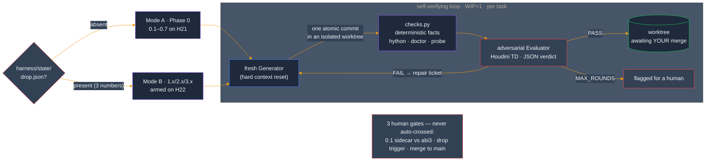

Standing it up surfaced + fixed real product hygiene under full-suite gating: hardcoded `C:\Users\User\SYNAPSE` fallbacks in the panel bootstraps (plus an off-by-one repo-root derivation the hardcode was masking), a single-sourced `VERSION`, and a staged demo scaffold. The `ui/` → `panel/` consolidation is fully mapped and deferred — the live UI source of truth is already `panel/`.

### Verified capability — what actually cooks (per-context audit)

A *read-the-handlers* audit (the real dispatch path, not the README's own claims) confirms the truth contract holds: across ~95 tools the scaffolds **self-report** (`"cooked": false` + a note) instead of faking success.

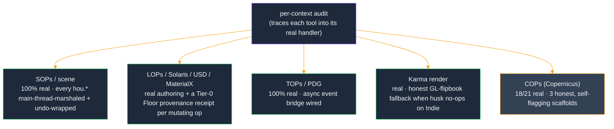

The honest gaps are small and named: 3 COPs generators are placeholders (`reaction_diffusion`, `pixel_sort`, `bake_textures` — they build the graph but don't cook); everything else cooks for real. Provenance receipts fire at the Tier-0 Floor hook on **every** mutating op (the curated `agent.usd` Ledger is the separate, backfilled tier).

### v5.14.0 — Studio-operable: the N-seats milestone

M3 closes the hardening report: the engine was already honest (M1) and pipeline-fluent (M2) — this milestone makes it **operable by people who didn't build it**. The recurring theme is evidence: a frozen session dumps its telemetry before dying, a stale phantom-API gate says so in the panel footer instead of one console line, a doctor reports only checks it actually ran, and the docs that answer a studio's first three questions (what leaves the building? whose key? what breaks on upgrade?) are **CI-pinned against drift** — a new env var, egress site, or renamed artifact fails the suite until the doc catches up.

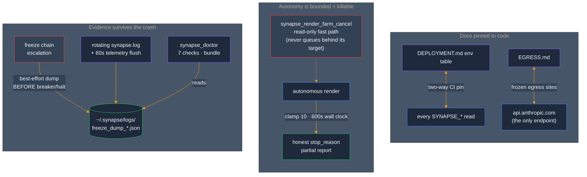

Two findings came back sharper than the report wrote them: the kill-switch gap wasn't just missing retention — a naively-registered cancel would have **deadlocked behind the C5 mutation lock** the running render holds for its entire sequence (the cancel rides the read-only fast path for exactly that reason); and seat B on shared storage doesn't see an error — it sees **silent amnesia** (empty recalls, refused saves), which is why the doctor's key-fingerprint check and the show-scoped `SYNAPSE_ENCRYPTION_KEY` provisioning docs exist. The full hardening run: **suite 3,415 → 3,612**, every wave full-suite-gated, ledger in `docs/HARDENING_RUN_2026-06-10.md`. (SEC-1/RBAC remains the explicit gate before any non-local deploy mode — a decision recorded, not work skipped.)

### v5.13.0 — Production hardening: the truth contract + pipeline citizenship

A VFX-production hardening review (`docs/SYNAPSE_VFX_PRODUCTION_HARDENING_2026-06-09.md`) named the worst failure class for an agent-driven system: **confident fiction** — a tool reporting success for work it did not do, could not do, or could not know it did, which the LLM then consumes as ground truth and compounds. Twelve fictions were catalogued; two milestones killed them under reproduce-before-fix discipline (read-only verification fleets → file-disjoint implementation waves, every wave full-suite-gated) — suite 3,415 → 3,567, ledger in `docs/HARDENING_RUN_2026-06-10.md`.

**M1 — stop the fictions:** recipe execution is propose-or-execute (never "Executed" over an untouched scene); the autonomy contract is pinned end-to-end against the live registry (the flagship unattended tool used to die at step 1 *and* evaluate every good render as failed); the compose tier self-marshals + owns its undo groups; `houdini_render` restores the artist's output-path tokens byte-identically; COPs scaffolds say `scaffolded`; the scheduler fails loudly on farm types it can't configure; APEX recipes shed 17 phantom node types for the introspected-catalog names. **M2 — pipeline citizen:** cook-and-verify with stage readback in the last uncooked USD mutators; one `_safe_node_name()`/`_expand_frame_tokens()` for derived names and frame tokens; the flipbook fallback writes a `_glpreview` sidecar, never the beauty path; the render farm restores the artist's settings baseline after every batch; plus the path/color/show-config/display work in the table above.

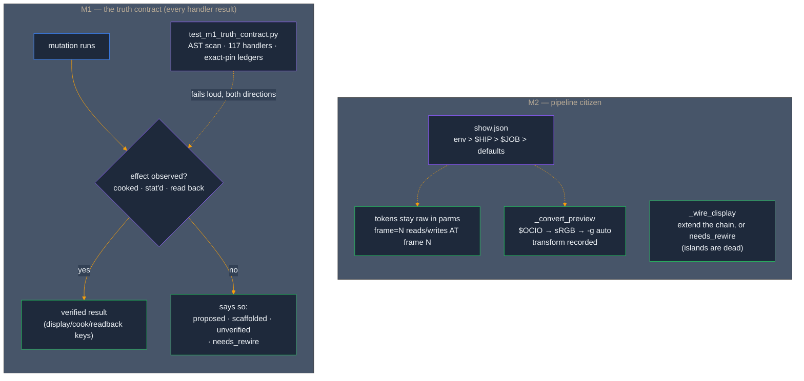

The discipline matched the subject: a system being cured of unverified claims shouldn't be hardened on unverified claims. Every [F]-tagged finding was **reproduced before it was fixed** (three were *worse* than reported, one was partially refuted and re-scoped), every fix landed with its pin, and the conformance test enforces the contract on every future handler. Live-verification residuals (per-frame `productName` under husk, display-chain behavior on a real stage) are explicitly ledgered for the next bridge session — recorded as owed, not assumed.

### v5.12.0 — CTO remediation: durability, lifecycle honesty, freeze safety

A two-day adversarial CTO review (8 reviewers → per-finding verification → `docs/SYNAPSE_CTO_REVIEW_2026-06-09.md`) fed a remediation harness that landed **9 prioritized fixes + the freeze-chain wiring** under reproduce→fix→reproduce-clean discipline — suite 3,377 → 3,415, green at every commit, every verdict in the Ledger.

The headline was **memory durability**: the live store is Fernet-encrypted under one key file, loaded with skip-on-failure, and was rewritten by a truncating save — so one stale key env-var would silently and permanently destroy months of accreted memory on the next write. That chain is dead (degraded-load guard → atomic backed-up saves → key escrow + fingerprint). The rest of the slice: zombie mutations (timed-out main-thread payloads executing *after* the client was told to retry) are abandoned; two concurrent clients can no longer interleave mutation sequences on the shared undo stack; PDG cook failures report real errors instead of a `NameError`; the panel's Stop and timeout messages stopped lying; and the `~2 s` dispatch floor finally has a measurement instrument (`synapse_dispatch_wait_ms`) instead of folklore.

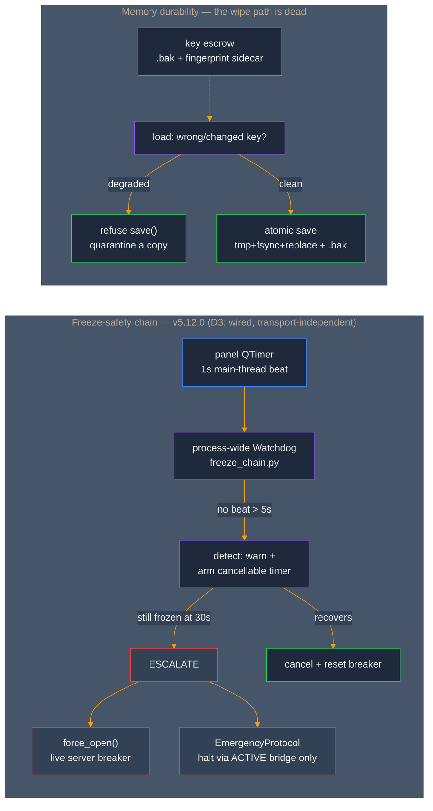

The wiring is **topology-true, not theater**: the live transport (hwebserver) has no resilience layer and the fallback WS server is built with resilience off — so a literal "panel calls `server.heartbeat()`" would have armed nothing. The chain owns its own process-wide watchdog, opens the breaker *when a resilient server exists* (and says so honestly when one doesn't), and the halt only ever fires through an **already-active** bridge — escalation never constructs one.

### v5.11.0 — Two-tier provenance: the Floor hook + the agent.usd Ledger

Every action SYNAPSE takes is now recorded, on two tiers, on the path that actually runs. **Tier-0** is the **Floor hook**: a single `FloorGate` that every command-handler invocation routes through (`CommandHandlerRegistry.invoke()` across all three live sites — direct `handle`, batch sub-ops, and the autonomy adapter), writing one durable, atomic provenance record per *mutating* op (read-only ops are skipped) to `.synapse/provenance/` under a bounded FIFO cap. **Tier-1** is the **agent.usd Ledger**: the curated verdicts that used to live only in markdown now have a canonical home — one immutable `<kind>_<ts>_<sha8>.json` per record (the source of truth) composed into an `agent.usd` `/SYNAPSE/agent/ledger/` read-projection. The markdown Ledger backfills **losslessly** — a source-vs-parse oracle is mutation-pinned: drop the field catch-all and 33 tokens vanish, failing the test.

This is **audit, not admission control** — Tier-0 records what happened; it never gates. (The bridge's consent / `IntegrityBlock` layer is the `/mcp` audit path; finding §0.8 established it is *not* on the live `/synapse` transport — so the docs no longer claim it is.) Two adjacent landings shipped alongside: an **autonomous-worker tool allowlist** (the panel worker can no longer reach `execute_python` / `execute_vex` / destructive tools by default — fail-closed, env opt-out) and **autonomy task provenance** (`autonomous_render` now feeds the already-live `suspend_all_tasks` consumer, closing a real producer→consumer loop).

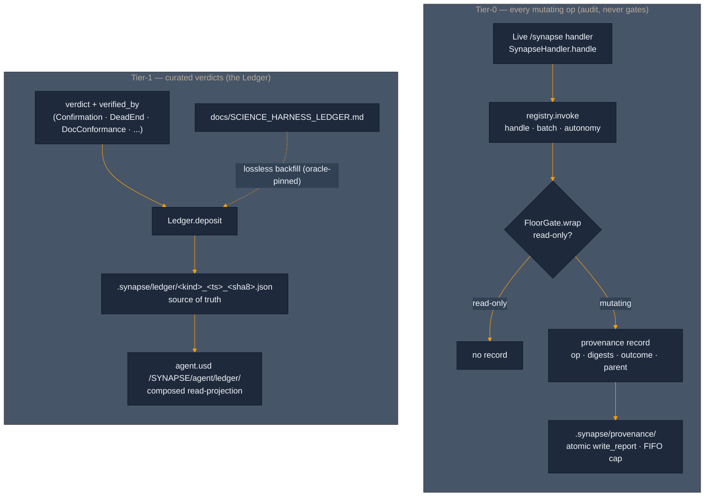

**Honest by construction.** A 5-agent liveness recon checked every proposed emit point *before* wiring — and found 3 of the 5 dormant `agent.usd` writers had no live producer (the MOE router runs only in tests, agent handoffs don't exist on the live path, and the bridge's `IntegrityBlock` self-asserts its anchors). Those stay **deferred**, recorded in the RFC, rather than wired to dormant code to manufacture the *appearance* of activation.

### Self-healing bridge — verified end-to-end

The MCP/WS bridge had a recurring failure: a stale Houdini holding `:9999` with a dead server left the live session's WS server failing over to a port the clients couldn't find. The server *already* tracked its real bound port (`_actual_port`); the gap was that every client was hardcoded to 9999. The fix makes the port **discoverable** — on bind, the server atomically publishes `{host, port, pid, ts}` to a home-anchored sidecar (`~/.synapse/bridge.json`, `$SYNAPSE_BRIDGE_FILE` override); every client resolves *that*, freshest-writer-wins, with a hard fallback to `9999` / `$SYNAPSE_PORT` so a no-sidecar environment behaves byte-for-byte as before. A stale-port collision can never silently strand the bridge again.

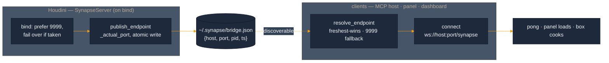

**Proven live (2026-06-07).** End-to-end through the running bridge: `synapse_ping` → `{"pong":true}`; the panel built in-process (real `SynapsePanel`, all three faces `Direct · Work · Review`, v5.11.0); and a box created *via the bridge* cooked to **8 points / 6 faces / 1×1×1** — with the Floor hook's provenance record landing for each mutation (`create_node … origin=handler, outcome=ok`). The whole stack, confirmed in one live scene.

### v5.9.0 — SCOUT → FORGE: 7 verified capabilities

A read-only **SCOUT** recon cross-referenced the Houdini 21.0.671 capability surface against the live tool registry, surfaced 7 opportunities, and **V1-verified every one against the exact target build** (21.0.671 `hython`) before any code was written. A **FORGE** MOE agent team then built and unit-tested them, with **CRUCIBLE** adversarial review gating the merge. Registry **104 → 108 tools**:

- `houdini_set_payload_loadstate` — USD payload load/unload + activation
- `houdini_create_point_instancer` — `UsdGeom.PointInstancer` authoring
- `houdini_shot_render_ready` — shot-template composite orchestrator
- `cops_create_copnet` — modern Copernicus `copnet` (distinct from the legacy `cop2net` the existing COPs tools build on)
- `houdini_reference_usd` + `karma_visible`/`purpose`/`kind` — non-clobbering Karma-visibility metadata on import (completes the BL-008 advisory-only partial)
- `houdini_modify_usd_prim` + `instanceable`
- branch-aware, path-keyed upstream Karma-LOP discovery in the render walk

Plus bridge/panel hardening: read-only tool failures surface as JSON-RPC errors instead of success-with-`isError`, and the panel resolves the Anthropic key through the canonical auth layer with an actionable "set it + relaunch" message.

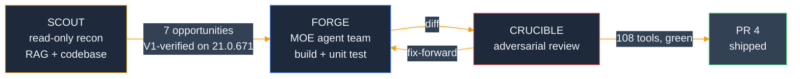

Behavioral verification (Karma cook of `copnet`, EXR landing, USD editableStage round-trips) is deferred to a live 21.0.671 session.

### Solaris Compose Tier — 3 write/compose tools (PR #6)

The write/compose counterpart to the read-side inspector. Three MCP tools, every operation undo-wrapped + main-thread-safe, all `dir()`-confirmed-live on 21.0.671. Registry **108 → 111**:

- `synapse_solaris_shotsetup_karma_xpu` — builds a render-strongest department `sublayer` stack + camera + Karma `engine=xpu` render settings, with `synapse:*` provenance and an authored output path.
- `synapse_matlib_bind` — binds a MaterialX material to a prim set via `assignmaterial`, then verifies each binding with `ComputeBoundMaterial` and reports unmatched/unbound prims.
- `synapse_assess_render_ready` — read-only render-readiness report (rendersettings, camera, composition errors, materials bound, output path, AOVs, XPU compatibility), naming the offending prim per failed clause.

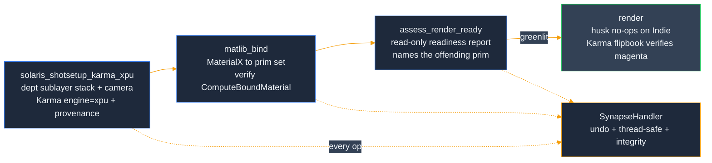

Five real bugs the SCOUT→FORGE discipline caught (the `usdrender` phantom, `sublayer` strongest-first ordering, `editableStage()`-outside-cook, the `productName` parm not authoring the prim, and an MRO name collision), plus the **BL-007 / BL-008 [REAL] close** — an end-to-end render confirm surfaced that **husk silently no-ops on Houdini Indie**, so the gold-standard EXR is license-blocked and the bound emissive material was verified via a Karma-interactive flipbook (magenta, not gray) instead. 49 standalone tests; see `forge/backlog/human_review.json` (BL-012…BL-017) and `scripts/verify_compose_render.py`.

---

### Memory substrate — Moneta vector engine (PR #14)

The inside-out thesis applied to memory. SYNAPSE's scene/decision memory carried two unreconciled stores (a JSONL entry store and a markdown scene-memory file), a metrics gauge wired to a dead accessor, and empty session stubs — a divergence *class*, not a bug list. **Moneta** — a vector-native memory engine (`deposit` / `query` / `signal_attention` / consolidation, with time-decay and durability) — is introduced behind the unchanged `MemoryStore` interface so that divergence becomes **structurally impossible**: there is one store, and `count()` reads the engine's live entity count.

It ships **shadow-first and flag-gated, default-off** (`SYNAPSE_MEMORY_BACKEND` = `jsonl` | `moneta` | `shadow`). Each SYNAPSE `Memory` is serialized whole into a Moneta deposit payload (byte-for-byte round-trip); a deterministic, dependency-free `HashEmbedder` (PYTHONHASHSEED-independent, swappable for a semantic model later) embeds the content; decision / show-tier / gate-source memories map to a `protected_floor` so pinned memories resist decay. Keyword search is **bit-identical** to the JSONL store (parity-by-construction); the shadow path dual-writes and diffs reads into a `ParityReport`, so cutover is justified by evidence, not hope.

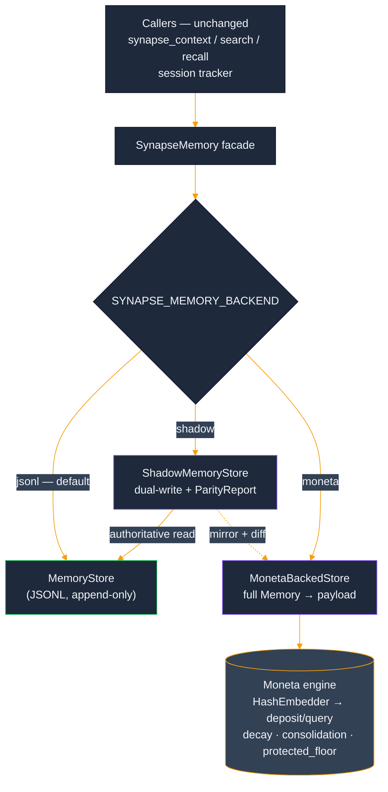

A four-agent **CRUCIBLE** fan-out attacked the backend and found two real defects — a protected-quota silent demotion and a corrupt-snapshot startup-killer — both fixed and pinned. A second ARCHITECT→FORGE→CRUCIBLE pass then closed the **FC4 single-writer gap by construction**: a serialization `RLock` makes the adapter thread-safe (the engine's swap-and-pop index can no longer be corrupted by concurrent deposit/iterate/prune), and because the adapter makes zero `hou.*` calls the lock is never held across the main-thread hop — so it can't deadlock the async server. Proven standalone by a concurrency stress suite; the destructive `run_sleep_pass` is now auditable (returns/logs exactly what it pruned). The production default-on flip is still staged (flag stays `jsonl`), but no longer blocked on live thread-safety verification. Full acceptance/falsifier status and the cutover procedure live in [`docs/MONETA_SYNAPSE_SHIP_REPORT.md`](docs/MONETA_SYNAPSE_SHIP_REPORT.md).

The memory store's bespoke `python/synapse/memory/evolution.py` (the charmander→charizard USD evolution) is superseded by Moneta's consolidation — it stays **dormant** under the `moneta` backend (pinned by `test_moneta_backend_never_fires_evolution`) and still fires under the default `jsonl`; physical removal is deferred to the cutover. (Distinct from `shared/evolution.py`, the MOE-orchestrator subsystem, which is unchanged.)

> **On the name "Moneta":** the vector-memory engine wired in here ([repo](https://github.com/JosephOIbrahim/Moneta)) is a Python library; it is a *distinct project* from the similarly-named "Moneta (Nuke)" entry in the Portfolio thesis above (a planned DCC host). They historically share a working name but are not the same codebase.

---

### Sprint 3 progress — Mile 4 of 6 closed (Mile 5 prestaged)

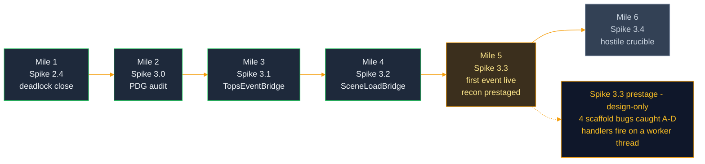

**Mile 1 — Spike 2.4 deadlock closure.** The live Crucible baseline at end of Sprint 3 Day 1 surfaced a deadlock at the daemon ↔ main-thread boundary: synchronous `submit_turn` parked Houdini's main thread on a result queue while the daemon thread's `hdefereval` dispatch waited for that same main thread to pump Qt events. Spike 2.4 closes it by changing `submit_turn` to return immediately with a `TurnHandle` — a `threading.Event`-backed Future analog. The caller decides when (and on which thread) to wait. Main thread stays free to pump Qt events; daemon thread keeps the agent loop; `hdefereval` lambdas execute because main is responsive.

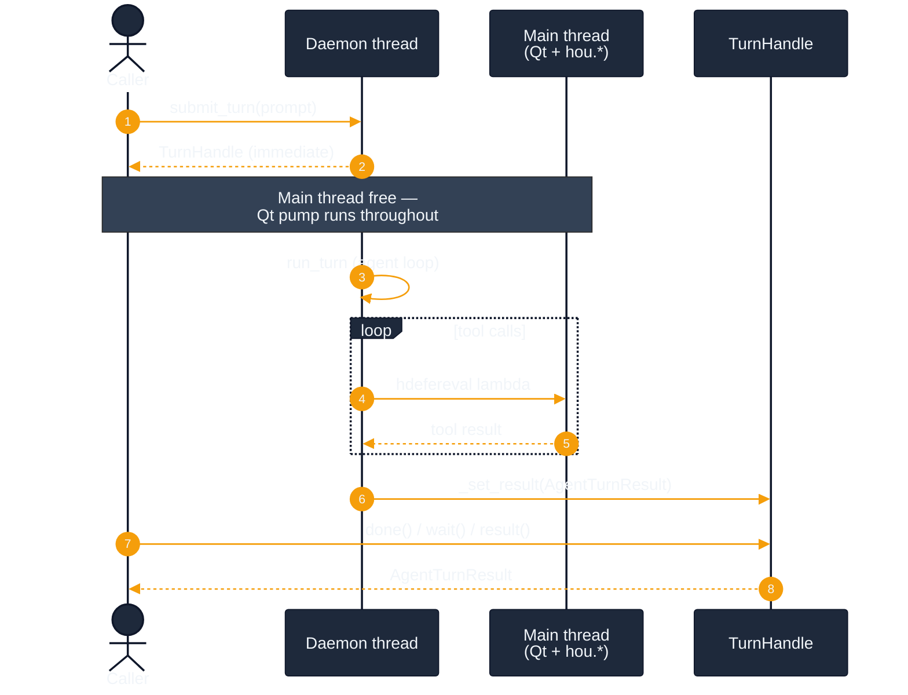

**Mile 2 — Spike 3.0 PDG API audit.** The `pdg` module surface in Houdini 21.0.671 has known divergences from prior versions and from external-LLM training data. Mile 2 ran `dir()` introspection against live Houdini, captured the empirical surface in `docs/sprint3/spike_3_0_pdg_api_audit.md`, and refuted six wrong references in the early sketch — every `hou.pdg.*` path missing, `hou.hipFile.addEventCallback` returning `None` (not a removable handle), `pdg.PyEventCallback` being the wrong name. Each of those would have crashed first contact with Houdini if Spike 3.1 had coded against the sketch verbatim.

**Mile 3 — Spike 3.1 `TopsEventBridge` (Phase A).** In-process PDG event bridge. `warm(top_node)` registers a `pdg.PyEventHandler` against the TOP network's live `pdg.GraphContext` (acquired via `top_node.getPDGGraphContext()`, never class-instantiated — that's for fresh graphs). Surfaces 7 audit-verified event types: `CookStart`, `CookComplete`, `CookError`, `CookWarning`, `WorkItemAdd`, `WorkItemStateChange`, `WorkItemResult`. Threading defensive: handler reads `pdg.*` properties only, no `hou.*` calls inside. 47 tests across basic happy paths and an 8-case hostile suite (handler leak, double-bridge independence, callback-raising-mid-event, topnet-deleted-mid-subscription, multi-event-type-no-loss).

**Mile 4 — Spike 3.2 `SceneLoadBridge` (Phase B).** Auto-warm wire from `hou.hipFile.AfterLoad` to `TopsEventBridge`. Composes (not inherits) — constructor takes a `TopsEventBridge` instance and orchestrates its `cool_all` / `warm_all` cycle on each scene load. Mile 4's empirical scene-load audit (`docs/sprint3/spike_3_2_scene_load_audit.md`) captured all four hipFile events firing on `MainThread`, so the AfterLoad handler is a direct synchronous call — no `hdefereval`. 24 tests across basic happy paths and a 10-case hostile suite. One fix-forward cycle during CRUCIBLE: case 6 (unsubscribe-during-handler) surfaced a real defect — `warm_all` kept iterating after `unsubscribe` returned, leaving stale subs. Reconcile step added at end of `_on_after_load`: if `_subscribed` flipped to `False` mid-handler, run `cool_all` again. The hostile test pinned the contract; the fix held it.

**Mile 5 (prestage) — Spike 3.3 `dir()` recon.** Before any build, a design-only prestage ran the dir()-over-docs discipline against live 21.0.671 and produced `docs/sprint3/spike_3_3_recon.md` — a 13-agent synthesis workflow + adversarial completeness review, then one operator-authorized scratch cook to resolve the single unknowable-from-`dir()` crux. It **resolved the thread-of-delivery question**: PDG event handlers fire on a **worker thread** (the exact opposite of `hou.hipFile`, which fires on main), so the perception handler must be `pdg.*`-only + non-blocking-enqueue or it reintroduces the Spike 2.4 deadlock. And it **caught four bugs in the already-scaffolded bridges** before they could reach a live cook: **A** — `event.workItem` is phantom, so payload is silently empty; **B** — there is no `WorkItemComplete` enum, so `workitem.complete` must be derived from `WorkItemStateChange` + `currentState == CookedSuccess` (and a *static* generator emits neither — the gate demo needs a real processor); **C** — `pdg.Node` has `.name`, not `.path()`; **D** — `pdg.PyEventHandler(callback)` has no constructor, so the scaffold's handler factory hard-crashes on the first `warm()` (the correct API is a raw callable passed to `addEventHandler`, which returns the wrapper). Zero production code was touched; build starts at M1.

**Workflow — the three-role pattern.** Phase A and Phase B both ran the same MOE shape internally:


ARCHITECT writes the design doc and never the code. FORGE implements against the spec and writes basic happy-path tests. CRUCIBLE writes hostile tests and never the implementation; when a hostile test surfaces a real defect, FORGE fixes the implementation rather than CRUCIBLE weakening the test (Commandment 7). Each role's authority is constitutionally restricted; phase boundaries gate the merge.

### Sprint 3 — load-bearing commits

```
87c4db9  Spike 3.2    SceneLoadBridge hostile suite (CRUCIBLE) + fix-forward
4cba649  Spike 3.2    SceneLoadBridge scaffold (FORGE)
ef7d5ae  Spike 3.2    SceneLoadBridge design (ARCHITECT)
9e4cc42  Spike 3.2    scene-load audit findings landed (Mile 4 audit)
a476386  Spike 3.2    scene-load API audit infrastructure
2f46590  CI repair    bump checkout/setup-python (Node.js 20 deprecation)
fcd1077  CI repair    gate test_live_capture body behind __main__
bb2713b  Spike 3.1    TopsEventBridge hostile suite (CRUCIBLE)
89da296  Spike 3.1    TopsEventBridge scaffold (FORGE)
2aa03d9  Spike 3.1    TopsEventBridge design (ARCHITECT)
07946dc  Spike 3.0    PDG API audit findings (Mile 2 audit)
6bf2f07  Spike 3.0    PDG API audit infrastructure
b1d3163  Spike 2.4    close daemon↔main-thread deadlock via TurnHandle
6e08dae  Spike 2.4    add TurnHandle (Future-shaped result envelope)
```

Sprint 2 Week 1 (`5e6fc0c`) shipped the first tool (`synapse_inspect_stage`) end-to-end through the still-outside-in WebSocket path. Sprint 3 built the inside-out substrate alongside it — one spike at a time, with an audit-first discipline (live `dir()` introspection in Houdini 21.0.671 before any code lands) and a human-in-the-loop Crucible protocol (`docs/crucible_protocol.md`) for the parts bash cannot drive. Tagged at `v5.5.0` (`4faaa3a`).

### Sprint 3 — what's next

```
Spike 3.3    First TOPS event surface live              [Mile 5 — needs GUI]
             workitem.complete → agent perception
             real .hip + real TOP cook through the bridge
Spike 3.4    Hostile TOPS Crucible                      [Mile 6]
             event flood, malformed events, cancellation
```

Mile 5 is the first time a real `pdg.Event` reaches the agent's perception layer through the two-bridge wiring in graphical Houdini. End-to-end timing target: under 50ms from `cookComplete` to `perception_callback` invocation (in-process should be sub-ms; budget is for safety margin). Mile 6 turns the heat up — event flood (10K events / 1s), malformed events (missing fields surface as typed parse errors), cancellation mid-cook with no orphaned callbacks.

Mile 5 cannot run from bash. It needs Joe at the GUI driving a real cook against the scaffolded bridges.

---
