# SYNAPSE — Changelog & detailed capability

The full version-by-version history and per-tool capability detail. The [README](README.md) keeps the artist-facing essentials; this is the deep record.

## v5.18.0 — graph-synthesis validation pipeline

*The AI now validates a whole proposed network against the live scene before any node is built — Mile 2 of the ARCHITECT → FORGE → FORGE-Evaluator → human-merge relay. **Validation only; the build step lands in Mile 3.** All checks verified on live Houdini 21.0.671. 3,803 tests passing.*

**Whole-graph validation — `cognitive/graph_validator.py` (pure, zero `hou`, mock-tested off-Houdini):**
- **P3 connections** — arity (variadic-safe), wire-type compatibility for typed categories (VOP/MAT/CHOP), slot-label advisories, and an **occupied-input guard that HALTS** rather than degrade to a pass — a false pass would sever the artist's live wiring.
- **P4 structural** — acyclicity (DAG), duplicate `friendly_name` collision, `node_category` ↔ `network_type` consistency (unknown network types skipped, no false reject).
- **P5 context** — every existing node path resolves (clean error, never a crash), the parent network must exist, and new-vs-existing name collisions are caught.
- `live_phases_enabled` default flipped **False → True** (Mile 2 is done); the two Mile-1 tests pin it `False` to preserve their symbol-only semantics — not weakening them.

**Live host oracles — `host/*` (hou-backed, every symbol `dir()`-confirmed on 21.0.671):**
- **`ConnectivityOracle`** (`graph_oracle.py`) — read-only node introspection (arity, occupied inputs, type resolution), verified against real types (`box=(0,1)`, `xform=(1,1)`, `merge=(0,9999)`, occupied `input0=True`). `input_labels` degrades to `[]` (type-level labels are absent in 21.0.671 — instance-only); `types_compatible` defers wire-type enforcement to Mile-3 build time, where `hou.Node.setInput()` rejects natively.
- **`HouExistenceOracle`** (`existence_adapter.py`) — node-type / parameter existence via `hou.nodeType` + `parmTemplateGroup().find`. This **replaced a scout-backed design**: the §2.6 preflight proved scout can't answer node-type existence (it indexes dotted `hou.*` API symbols, not bare node-type names, so it false-negatives real types — `box → False`). Human-ratified deviation; scout stays the cognitive-layer pre-grounding tool.

**Verification.** FORGE-Evaluator gate PASS (boundary + DoD + phantom + mutation); 5 definition-of-done tests green; `--mile 1` and `--mile 2` both PASS; and the whole pipeline verified end-to-end against **live interactive Houdini 21.0.671** — 6 scenarios, `all_pass=true` (`harness/notes/mile2_live_e2e_result.json`). The frozen contracts (`graph_proposal.py`, `interfaces.py`) are byte-identical to before. Adversarially reviewed by two multi-agent panels (6-lens diff review + 4-lens loop-closure).

**Next (Mile 3):** the build half — `graph_builder.instantiate` turns a validated proposal into real nodes under one undo group, with an unconditional TOCTOU re-check. Carried forward: build-time wire-type + parent-type enforcement and the production wiring seam — full ledger in `harness/notes/mile2_loop_closure.md`.

---

## v5.17.2 — open-source readiness

*Docs, license, and CI polish from a rubric-driven audit — no code changes. Same 3,796 tests.*

**Adoption / contributor on-ramp:**
- **License is now GitHub-detectable as MIT.** Split the patent notice out of `LICENSE` into a separate `PATENTS` file (every term preserved) so GitHub detects pure MIT instead of `NOASSERTION` — the single biggest adoption blocker. Follows the portfolio license-split template.
- **`CONTRIBUTING.md`** added — points new contributors at the pure-Python, zero-`hou` `cognitive/` layer (lint-enforced via `test_cognitive_boundary.py`) as the easiest entry point; no Houdini license required.
- **README** — an "Architecture at a glance" quick-reference up top (the inside-out idea, first), a **Dependencies** section naming the optional **Moneta** memory backend + how to enable it (`SYNAPSE_MEMORY_BACKEND`), a troubleshooting **table**, and install **"you should see" checkpoints** with time tags.
- **CI** now runs the suite on **macOS + Linux** (Python 3.11 + 3.14), with a live status badge.

---

## v5.17.1 — patch: the set_usd_attribute fix actually fires + metrics thread-safety

*Follow-up to v5.17.0 from an independent cross-cutting review (the review that did not get to run before merge). 3,796 tests passing.*

**Fixes:**
- **`set_usd_attribute` now actually applies.** v5.17.0 corrected the raw-vs-punycode USD parameter names, but the public tool + render recipes send the payload key `attribute_name`, which was never aliased to the handler's `usd_attribute` param — so the call raised *before* the corrected name could run. Aliased it; the fix now reaches the prim end-to-end.
- **Live metrics can no longer crash Houdini.** The hwebserver metrics aggregator (new in v5.17.0) read the `hou` scene graph **off the main thread** every ~2s — `hou` isn't thread-safe, a real segfault risk. Scene collection is now marshalled onto the main thread with a short best-effort timeout (skipped, never blocking, when Houdini is busy).
- Aggregator lifecycle: a failed server start no longer orphans the metrics daemon thread.

---

## v5.17.0 — H22 prep hardening + Solaris live-grounding + latency observability

*All work verified on Houdini 21.0.671 (live bridge). The H22 readiness is **forward-looking prep** — not H22-verified. 113 tools · 3,785 tests passing.*

**H22 prep hardening (forward-looking — fixes that land now on H21, de-risk the H22 drop):**
- **PDG cook unblocked — a real live bug fixed.** The perception bridge called `pdg.PyEventHandler(fn)` — a phantom constructor that **crashes on first warm** on H21 — replaced with the verified `gc.addEventHandler(fn, pdg.EventType.…)` idiom. The "Spike 3.3 crash, fix pending" rows in the README/roadmap are now **FIXED**, not pending.
- **Single-sourced the UsdLux punycode + MaterialX node-type encodings.** Every `xn__…` parm name now resolves through one source (`core/usd_punycode.py`) corrected to **live-probed** values — killing the `vya`/`kya` color divergence and the duplicate spotlight cone-shaping literals, with a `parmTuple` fallback for vector/color parms.
- **Scout corpus de-poisoned.** The `rag/` corpus was teaching **phantom light encodings the code had already fixed**; corrected, composition docs indexed, and a stale-cache freshness bug fixed so the corpus rebuilds + `activate()`s on the MCP path instead of serving a stale snapshot.
- **Phantom-API gate fails closed.** Scout's drift-policy now defaults to `refuse` — an unverifiable symbol is rejected, not silently emitted (the H22 phantom-API landmine).
- **COP/Copernicus survival probe** with a legible H22 failure instead of a silent one; **vendor-ABI legibility** — a non-3.11 interpreter now raises a named warning, and the daemon escalates a vendored-SDK ABI `ImportError` into a readable `RuntimeError` (the SDK is Python 3.11 / win_amd64 ABI-locked; H22 ships a new Python).
- Introspector lazy-submodule fix (force-imports `hou.qt`/`hou.secure` so they're captured), asyncio forward-compat (drops the deprecated `set_event_loop_policy` for direct selector-loop selection), and fully-scoped PySide6 Qt enums (H22 Qt enum scoping). Plus H22-harness plumbing: `--settings` auth override restored and path args quoted.

**Solaris live-grounding (probed against live Houdini 21.0.671 through the bridge):**
- **`set_usd_attribute` name-space bug fixed — light params were silently never set.** Recipes fed **punycode parm names** to a handler that authors the **raw USD attribute** on the prim, so `GetAttribute("xn__…")` was invalid and the write **silently no-opped** — the light's exposure/color/temperature never landed. Now routed through raw `inputs:*` USD names (build-stable → H22-safe); punycode stays only on the `set_parm` path. A real correctness win.
- **Geometry/shaping encodings corrected to live-probed values** — `radius`/`width`/`height`/`length` and the cone-shaping attrs were phantom in **both** the code and the corpus; re-probed against live and pinned.
- New **`set_usd_primvar` handler** (`UsdGeom.PrimvarsAPI`), a **Solaris set-dressing recipe** (`solaris_scatter_instances`), and a **production-rules guardrail catalog** (the 7 Solaris rules, single-sourced so encodings can't drift). **Tool count 112 → 113.**

**Latency observability (instrumentation + de-risking — *not* a speedup):**
- A live-measured investigation found the dominant cost is the **LLM turn (~95%)**; Houdini ops run **1–70 ms** — **refuting** the long-assumed "2 s Houdini floor." The takeaway is visibility, not a faster number.
- **The live path had zero latency attribution before.** Added a main-thread direct-path metric + an hwebserver `MetricsAggregator`, and surfaced every new histogram on the **Prometheus** endpoint — you can now *see* where the time goes.
- **Audit fsync moved off the hot path.** `FloorGate` provenance `fsync` is now offloaded from the dispatch thread (still audit-durable) — ~3.5 ms/mutating-op off the live path.
- **Opt-in, off-by-default** R1 scene-hash size-gate + `scene_hash_ms` instrumentation (no behavior change unless you turn it on), and a **panel pre-flight** that makes a heavy inline `execute_python` GUI freeze **attributable** instead of silent.

---

## v5.16.0 — Panel polish + latency × Solaris convergence

**Panel (artist-facing):**
- Multi-provider engine selector — **Claude · Gemini · NVIDIA Nemotron** — plus a model picker (Opus 4.8 / Sonnet 4.6 / Haiku 4.5 / Fable 5 on Claude). Raw-stdlib HTTP adapters under `panel/providers/`; no SDK added to Houdini's Python.
- Native typography — inherits Houdini's UI font + size; surface tokens contrast-solved (WCAG AA) against the live host grey.
- **`Aa` font control scopes to content only** — scales the dialogue + your prompt, starting at the host UI size; chrome stays pinned so the layout never jumps.
- **Connect button** in the rail — one click force-starts the bridge server (no more dropping into Houdini's Python Shell).
- "Main menu" button to exit the Build-HDA form; more breathing room around the wordmark; Pentagram spacing rhythm.

**Latency × Solaris (one-shot build convergence):**
- **Prompt caching** — the ~18k-token tool block + system are cache-read across turns instead of re-prefilled every turn (live-verified against the API).
- A single declarative `synapse_solaris_build_graph(template)` call now builds a whole render-ready Solaris scene: schema unblocked (`required:[]`), 3 dark templates exposed, the system prompt reconciled to steer to it, and the autonomous worker permitted to emit it (operator-approved).
- Phantom `houdini_inspect_node` → real `synapse_inspect_node`; Solaris builds get a 30s client budget so a successful one-shot no longer false-fails; sequential-turn count is now measured on disk.
- Full first-principles review + verified backlog: [`docs/LATENCY_SOLARIS_REVIEW.md`](docs/LATENCY_SOLARIS_REVIEW.md).

---

## Current capability + roadmap

### What's shipping today

| Layer | State |
|---|---|
| **Artist copilot panel** (chat → in-Houdini build, multi-provider engine selector — Claude · Gemini · Nemotron — `/` command palette over 113 tools, live observability) | Shipping. Every mutation undo-wrapped + main-thread-safe (inline in the handlers); "make a box" → node verified in graphical Houdini 21.0.671 (2026-06-01). |
| **Multi-provider chat engine** (`panel/providers/`) | Shipping. Three stream providers — Anthropic, Gemini (REST + faithful nested-arg repair), NVIDIA Nemotron (OpenAI-compatible NIM, reasoning-off `<think>` filter) — all raw stdlib `http.client`, **no SDK** added to Houdini's Python; selected via `registry.build_provider(provider_id, model=…)`. Keys resolve from the gitignored repo-root `.env` (`host.auth._load_dotenv`) or system env. |
| Cognitive substrate (Dispatcher + `AgentToolError` + cognitive/host split) | Shipping. Zero-hou boundary enforced by lint. |
| Agent SDK loop (Anthropic, cancel-event-aware, serializable tool errors) | Shipping. Mocked end-to-end tests green. |
| Daemon lifecycle (boot gate, auth resolver, dialog suppression, bootstrap locks) | Shipping. Windows `WindowsSelectorEventLoopPolicy` + `PYTHONNOUSERSITE` + no-runtime-pip all baked. |
| `TurnHandle` async result envelope (Spike 2.4) | Shipping. `submit_turn` returns a handle immediately; `submit_turn_blocking` for headless / non-main-thread callers. Deadlock-pinned by 31 unit tests + regression class. |
| Vendored Anthropic SDK | Shipping. 15 MB at `python/synapse/_vendor/`, Python 3.11 / win\_amd64 ABI lock. |
| **Perception channel — `TopsEventBridge`** (Spike 3.1) | Scaffolded. 47 tests (basic + hostile), standalone only. **Spike 3.3 prestage recon (2026-05-30) caught 4 event-model bugs before any live build** — phantom `event.workItem`, underived `workitem.complete`, `pdg.Node.name`-not-`.path()`, and a **`pdg.PyEventHandler(callback)` no-constructor crash on first `warm()`**. The constructor crash is **FIXED in v5.17.0** (replaced with the `addEventHandler` idiom in both `shared/bridge.py` and `host/tops_bridge.py`); the remaining event-model fixes land at Spike 3.3 M1. See `docs/sprint3/spike_3_3_recon.md`. |
| **Perception channel — `SceneLoadBridge`** (Spike 3.2) | Scaffolded. 24 tests (basic + hostile). Composes a `TopsEventBridge`; auto-warm on `hou.hipFile.AfterLoad`. Prestage confirmed the main-thread delivery and flagged the `AfterMerge` blind spot + a scene-clear dead-context teardown risk (recon doc §2). |
| **Tools ported through the Dispatcher** | **1** — `synapse_inspect_stage` (flat `/stage` AST). |
| **Tools still on the Sprint 2 WebSocket path** | **112** — registry tools working in production, awaiting port (104 → 108 with the v5.9.0 SCOUT→FORGE additions, → 111 with the Solaris Compose Tier below, → 112 with v5.17.0's `set_usd_primvar` handler). (Plus 6 group-info knowledge tools that don't need porting — they serve local content without Houdini.) |
| **Provenance & audit** — Tier-0 Floor hook + agent.usd Ledger | Shipping (v5.11.0). Every *mutating* op on the live `/synapse` handler path leaves a durable provenance record (`FloorGate` via `registry.invoke` across all 3 handler sites; bounded FIFO rotation). The **agent.usd Ledger** gives curated verdicts a canonical home — per-record JSON files (source of truth) + a composed `agent.usd` read-projection; the markdown Ledger backfills **lossless** (29 parsed, 0 fields dropped, mutation-pinned by a source-vs-parse oracle). |
| **Autonomous-worker tool allowlist** (security) | Shipping (v5.11.0). The panel worker is filtered by policy — read-only + `inform`-gated tools allowed; `execute_python` / `execute_vex` / `delete_node` / render **denied** by default (fail-closed); `SYNAPSE_WORKER_TOOL_MODE=unrestricted` opt-out. Closes the unfiltered-tool-access gap a CTO review flagged. |
| **Autonomy task provenance** | Shipping (v5.11.0). `create_task` + verification wired into `autonomous_render`, closing the loop to the already-live `suspend_all_tasks` consumer (which iterated an always-empty tasks group). A liveness recon proved only 2 of 5 dormant `agent.usd` writers had a real emit point — the other 3 stay deferred rather than fake their activation. |
| **Self-healing bridge** (resilience) | Shipping (v5.11.0). The WS server publishes its real bound port to `~/.synapse/bridge.json`; every client resolves *that* (freshest-wins, `9999` fallback) so a stale-port collision can never strand the bridge. **Verified live end-to-end** — `ping`→`pong`, the panel loads, and a box created *through* the bridge cooked to 8 points / 6 faces while the Floor hook recorded the mutation (`origin=handler, ok`). |
| **Memory durability** (crash-safety) | Shipping (v5.12.0). The memory-loss chain is dead: a wrong/changed encryption key loads *degraded* and **refuses to save** (the old path silently wiped months of ciphertext on the next write), saves are crash-atomic (`tmp+fsync+os.replace`, one `.bak` generation), and the key is escrowed (`encryption.key.bak` + a fingerprint sidecar that catches key drift on an empty store). |
| **Freeze-safety chain** (resilience) | Shipping (v5.12.0). The panel's 1 s heartbeat arms one process-wide watchdog: a frozen main thread is detected in 5 s; sustained ≥30 s, the circuit breaker force-opens and `EmergencyProtocol.trigger_emergency_halt` fires through any *active* bridge. Timed-out mutations are **abandoned, not zombied** — a payload the caller gave up on never executes late. |
| **Per-tool timeout discipline** (correctness) | Shipping (v5.12.0). One canonical budget table (`synapse/core/timeouts.py`) for every client — the panel no longer cuts off 120–600 s renders at 35 s, and a client-side timeout reports *"still running — do not retry"* instead of silently **re-dispatching the same mutation**. Cross-client mutations serialize through one lock; renders no longer block the main thread polling output files. |
| **Truth contract** (result honesty) | Shipping (v5.13.0). *A tool result may not claim an outcome the handler did not observe* — enforced registry-wide by an AST conformance pin over all 117 handlers (`tests/test_m1_truth_contract.py`; exact-pin ledgers fail loud in **both** directions: a new fiction must be fixed, a landed fix must retire its ledger entry). Recipes/plans propose-or-execute and **stop on first failure** with honest step accounting; the autonomy evaluator scores unverifiable frames as failures (a black sequence can no longer "pass at 1.0"); scaffolds say `scaffolded`. |
| **Pipeline citizenship** (paths · frames · color) | Shipping (v5.13.0). Tokens stay unexpanded in parms; an explicit `frame=N` render reads, polls, **and writes** at *that* frame (the playhead-overwrite is dead); resolver URIs (`asset:`/`shot:`) pass through marked *unverified* instead of being isfile-rejected; RenderProduct names expand **per-frame at cook** (a farm sequence no longer overwrites one file); previews are color-managed (`hoiiotool` + `$OCIO` → sRGB → `-g auto`, the transform recorded in every result — `color_managed` is never claimed on a fallback). |
| **Show config + display policy** | Shipping (v5.13.0). Per-show conventions in `show.json` (resolution, output roots, frame padding, naming/versioning, color) resolved env > `$HIP` > `$JOB` > built-in defaults — zero behavior change unconfigured; `naming.versioning: increment` gives comparable `vNNN` reruns. USD edits land *visibly*: a new LOP tip takes the display flag when it extends the display chain, or the result says `needs_rewire` honestly — `reference_usd` no longer creates disconnected islands. |
| **Operability** (logs · doctor · telemetry) | Shipping (v5.14.0). Rotating `~/.synapse/logs/synapse.log`; telemetry flushed periodically **and** inside the freeze chain's escalation — a frozen session finally leaves evidence (`freeze_dump_*.json`). `synapse_doctor` runs 7 honest checks (version stamp, log file, telemetry freshness, memory-key fingerprint vs store sidecar, symbol-table build stamp, bridge endpoint, Houdini) and `bundle:true` zips the scattered artifacts with a hard secrets denylist. Reports only checks it actually ran. |
| **Config & docs conformance** (CI-pinned truth) | Shipping (v5.14.0). Every `SYNAPSE_*` env var is documented in DEPLOYMENT.md's 26-row reference — a new undocumented read **fails CI** with its file:line (and a stale row fails the reverse direction). EGRESS.md answers what-leaves-the-building (one endpoint, three lanes, the plaintext-recall caveat) and a new remote-egress call site fails CI until it's documented. UPGRADE.md is the per-build runbook — a stale symbol table now makes scout verdicts say **why** they're unverified and turns the panel footer loud. |
| **Bounded autonomy** (kill switch) | Shipping (v5.14.0). `max_iterations` clamps at 10; every run carries a wall-clock bound (default = the canonical 600 s client budget) and reports `stop_reason` honestly with partial progress. `synapse_render_farm_cancel` reaches **both** the running farm and the live autonomous driver — on the read-only fast path, because a mutating-classified cancel would deadlock behind the very render it cancels (the C5 lock is held for the whole sequence). |

The port pattern is mechanical and documented in `docs/crucible_protocol.md` + the `spike(1)` commit message. Every legacy tool gets:

1. A pure-Python function under `synapse.cognitive.tools.<name>` (zero `hou` imports).
2. A schema dict (description + JSON Schema) registered alongside the function.
3. The WS adapter branch in `mcp_server.py` swapped from `synapse_inspect_stage`-style direct dispatch to `dispatcher.execute('<name>', kwargs)`.

### H22 readiness — the autonomous self-verifying harness

`harness/` is a long-running loop that grinds the Houdini-22 preparedness checklist so drop day is **verification, not surgery**. Per task: a fresh Generator (WIP=1, hard context reset) implements one item in an isolated git worktree; `checks.py` runs deterministic facts (hython cooks, `synapse_doctor`, the APEX probe — never an LLM's say-so); an adversarial Evaluator returns a parseable JSON verdict. PASS banks the worktree for **your** merge; FAIL writes a repair ticket and loops, capped at `MAX_ROUNDS` before the task is flagged for a human. It commits in worktrees only — **never merges to main** — and runs headless on the **Claude Max subscription** (zero API credits). Proven end-to-end on H21: task `0.3` ran Generator → `checks.py` → Evaluator → atomic worktree commit, master untouched.

Two modes, one switch. **Mode A** (now, on H21) grinds Phase 0 (`0.1`–`0.7`); **Mode B** arms the post-drop `1.x/2.x/3.x` pipeline the instant a human writes `harness/state/drop.json` with H22's three numbers (Python · USD · PySide). Three human gates are never auto-crossed: the **sidecar-vs-abi3** survival architecture (decision brief in `harness/notes/`), the **drop trigger**, and the **merge to main**.

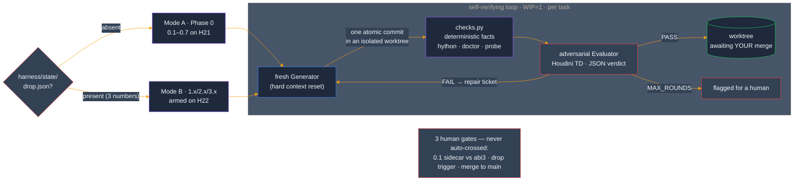

Standing it up surfaced + fixed real product hygiene under full-suite gating: hardcoded `C:\Users\User\SYNAPSE` fallbacks in the panel bootstraps (plus an off-by-one repo-root derivation the hardcode was masking), a single-sourced `VERSION`, and a staged demo scaffold. The `ui/` → `panel/` consolidation is fully mapped and deferred — the live UI source of truth is already `panel/`.

### Verified capability — what actually cooks (per-context audit)

A *read-the-handlers* audit (the real dispatch path, not the README's own claims) confirms the truth contract holds: across ~95 tools the scaffolds **self-report** (`"cooked": false` + a note) instead of faking success.

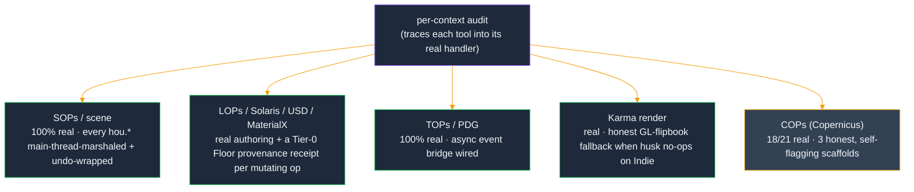

The honest gaps are small and named: 3 COPs generators are placeholders (`reaction_diffusion`, `pixel_sort`, `bake_textures` — they build the graph but don't cook); everything else cooks for real. Provenance receipts fire at the Tier-0 Floor hook on **every** mutating op (the curated `agent.usd` Ledger is the separate, backfilled tier).

### v5.14.0 — Studio-operable: the N-seats milestone

M3 closes the hardening report: the engine was already honest (M1) and pipeline-fluent (M2) — this milestone makes it **operable by people who didn't build it**. The recurring theme is evidence: a frozen session dumps its telemetry before dying, a stale phantom-API gate says so in the panel footer instead of one console line, a doctor reports only checks it actually ran, and the docs that answer a studio's first three questions (what leaves the building? whose key? what breaks on upgrade?) are **CI-pinned against drift** — a new env var, egress site, or renamed artifact fails the suite until the doc catches up.

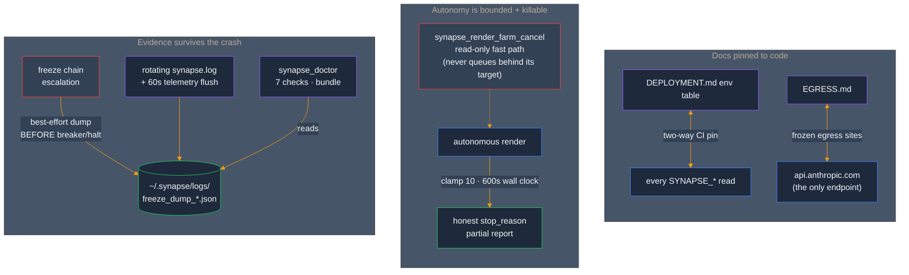

Two findings came back sharper than the report wrote them: the kill-switch gap wasn't just missing retention — a naively-registered cancel would have **deadlocked behind the C5 mutation lock** the running render holds for its entire sequence (the cancel rides the read-only fast path for exactly that reason); and seat B on shared storage doesn't see an error — it sees **silent amnesia** (empty recalls, refused saves), which is why the doctor's key-fingerprint check and the show-scoped `SYNAPSE_ENCRYPTION_KEY` provisioning docs exist. The full hardening run: **suite 3,415 → 3,612**, every wave full-suite-gated, ledger in `docs/HARDENING_RUN_2026-06-10.md`. (SEC-1/RBAC remains the explicit gate before any non-local deploy mode — a decision recorded, not work skipped.)

### v5.13.0 — Production hardening: the truth contract + pipeline citizenship

A VFX-production hardening review (`docs/SYNAPSE_VFX_PRODUCTION_HARDENING_2026-06-09.md`) named the worst failure class for an agent-driven system: **confident fiction** — a tool reporting success for work it did not do, could not do, or could not know it did, which the LLM then consumes as ground truth and compounds. Twelve fictions were catalogued; two milestones killed them under reproduce-before-fix discipline (read-only verification fleets → file-disjoint implementation waves, every wave full-suite-gated) — suite 3,415 → 3,567, ledger in `docs/HARDENING_RUN_2026-06-10.md`.

**M1 — stop the fictions:** recipe execution is propose-or-execute (never "Executed" over an untouched scene); the autonomy contract is pinned end-to-end against the live registry (the flagship unattended tool used to die at step 1 *and* evaluate every good render as failed); the compose tier self-marshals + owns its undo groups; `houdini_render` restores the artist's output-path tokens byte-identically; COPs scaffolds say `scaffolded`; the scheduler fails loudly on farm types it can't configure; APEX recipes shed 17 phantom node types for the introspected-catalog names. **M2 — pipeline citizen:** cook-and-verify with stage readback in the last uncooked USD mutators; one `_safe_node_name()`/`_expand_frame_tokens()` for derived names and frame tokens; the flipbook fallback writes a `_glpreview` sidecar, never the beauty path; the render farm restores the artist's settings baseline after every batch; plus the path/color/show-config/display work in the table above.

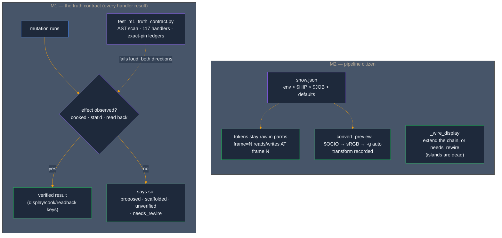

The discipline matched the subject: a system being cured of unverified claims shouldn't be hardened on unverified claims. Every [F]-tagged finding was **reproduced before it was fixed** (three were *worse* than reported, one was partially refuted and re-scoped), every fix landed with its pin, and the conformance test enforces the contract on every future handler. Live-verification residuals (per-frame `productName` under husk, display-chain behavior on a real stage) are explicitly ledgered for the next bridge session — recorded as owed, not assumed.

### v5.12.0 — CTO remediation: durability, lifecycle honesty, freeze safety

A two-day adversarial CTO review (8 reviewers → per-finding verification → `docs/SYNAPSE_CTO_REVIEW_2026-06-09.md`) fed a remediation harness that landed **9 prioritized fixes + the freeze-chain wiring** under reproduce→fix→reproduce-clean discipline — suite 3,377 → 3,415, green at every commit, every verdict in the Ledger.

The headline was **memory durability**: the live store is Fernet-encrypted under one key file, loaded with skip-on-failure, and was rewritten by a truncating save — so one stale key env-var would silently and permanently destroy months of accreted memory on the next write. That chain is dead (degraded-load guard → atomic backed-up saves → key escrow + fingerprint). The rest of the slice: zombie mutations (timed-out main-thread payloads executing *after* the client was told to retry) are abandoned; two concurrent clients can no longer interleave mutation sequences on the shared undo stack; PDG cook failures report real errors instead of a `NameError`; the panel's Stop and timeout messages stopped lying; and the `~2 s` dispatch floor finally has a measurement instrument (`synapse_dispatch_wait_ms`) instead of folklore.

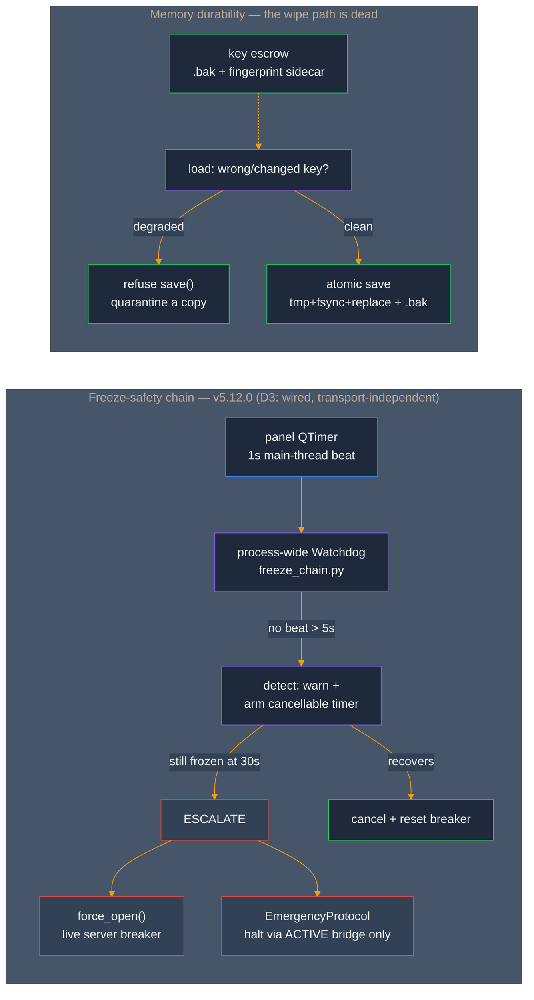

The wiring is **topology-true, not theater**: the live transport (hwebserver) has no resilience layer and the fallback WS server is built with resilience off — so a literal "panel calls `server.heartbeat()`" would have armed nothing. The chain owns its own process-wide watchdog, opens the breaker *when a resilient server exists* (and says so honestly when one doesn't), and the halt only ever fires through an **already-active** bridge — escalation never constructs one.

### v5.11.0 — Two-tier provenance: the Floor hook + the agent.usd Ledger

Every action SYNAPSE takes is now recorded, on two tiers, on the path that actually runs. **Tier-0** is the **Floor hook**: a single `FloorGate` that every command-handler invocation routes through (`CommandHandlerRegistry.invoke()` across all three live sites — direct `handle`, batch sub-ops, and the autonomy adapter), writing one durable, atomic provenance record per *mutating* op (read-only ops are skipped) to `.synapse/provenance/` under a bounded FIFO cap. **Tier-1** is the **agent.usd Ledger**: the curated verdicts that used to live only in markdown now have a canonical home — one immutable `<kind>_<ts>_<sha8>.json` per record (the source of truth) composed into an `agent.usd` `/SYNAPSE/agent/ledger/` read-projection. The markdown Ledger backfills **losslessly** — a source-vs-parse oracle is mutation-pinned: drop the field catch-all and 33 tokens vanish, failing the test.

This is **audit, not admission control** — Tier-0 records what happened; it never gates. (The bridge's consent / `IntegrityBlock` layer is the `/mcp` audit path; finding §0.8 established it is *not* on the live `/synapse` transport — so the docs no longer claim it is.) Two adjacent landings shipped alongside: an **autonomous-worker tool allowlist** (the panel worker can no longer reach `execute_python` / `execute_vex` / destructive tools by default — fail-closed, env opt-out) and **autonomy task provenance** (`autonomous_render` now feeds the already-live `suspend_all_tasks` consumer, closing a real producer→consumer loop).

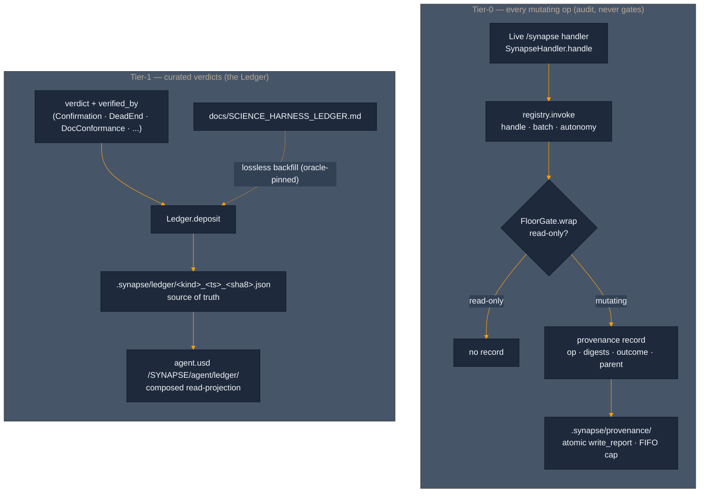

**Honest by construction.** A 5-agent liveness recon checked every proposed emit point *before* wiring — and found 3 of the 5 dormant `agent.usd` writers had no live producer (the MOE router runs only in tests, agent handoffs don't exist on the live path, and the bridge's `IntegrityBlock` self-asserts its anchors). Those stay **deferred**, recorded in the RFC, rather than wired to dormant code to manufacture the *appearance* of activation.

### Self-healing bridge — verified end-to-end

The MCP/WS bridge had a recurring failure: a stale Houdini holding `:9999` with a dead server left the live session's WS server failing over to a port the clients couldn't find. The server *already* tracked its real bound port (`_actual_port`); the gap was that every client was hardcoded to 9999. The fix makes the port **discoverable** — on bind, the server atomically publishes `{host, port, pid, ts}` to a home-anchored sidecar (`~/.synapse/bridge.json`, `$SYNAPSE_BRIDGE_FILE` override); every client resolves *that*, freshest-writer-wins, with a hard fallback to `9999` / `$SYNAPSE_PORT` so a no-sidecar environment behaves byte-for-byte as before. A stale-port collision can never silently strand the bridge again.

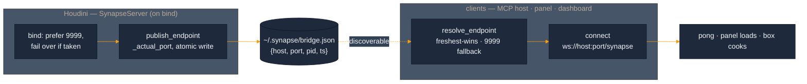

**Proven live (2026-06-07).** End-to-end through the running bridge: `synapse_ping` → `{"pong":true}`; the panel built in-process (real `SynapsePanel`, all three faces `Direct · Work · Review`, v5.11.0); and a box created *via the bridge* cooked to **8 points / 6 faces / 1×1×1** — with the Floor hook's provenance record landing for each mutation (`create_node … origin=handler, outcome=ok`). The whole stack, confirmed in one live scene.

### v5.9.0 — SCOUT → FORGE: 7 verified capabilities

A read-only **SCOUT** recon cross-referenced the Houdini 21.0.671 capability surface against the live tool registry, surfaced 7 opportunities, and **V1-verified every one against the exact target build** (21.0.671 `hython`) before any code was written. A **FORGE** MOE agent team then built and unit-tested them, with **CRUCIBLE** adversarial review gating the merge. Registry **104 → 108 tools**:

- `houdini_set_payload_loadstate` — USD payload load/unload + activation
- `houdini_create_point_instancer` — `UsdGeom.PointInstancer` authoring
- `houdini_shot_render_ready` — shot-template composite orchestrator
- `cops_create_copnet` — modern Copernicus `copnet` (distinct from the legacy `cop2net` the existing COPs tools build on)
- `houdini_reference_usd` + `karma_visible`/`purpose`/`kind` — non-clobbering Karma-visibility metadata on import (completes the BL-008 advisory-only partial)
- `houdini_modify_usd_prim` + `instanceable`
- branch-aware, path-keyed upstream Karma-LOP discovery in the render walk

Plus bridge/panel hardening: read-only tool failures surface as JSON-RPC errors instead of success-with-`isError`, and the panel resolves the Anthropic key through the canonical auth layer with an actionable "set it + relaunch" message.

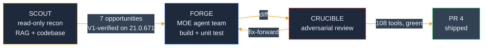

Behavioral verification (Karma cook of `copnet`, EXR landing, USD editableStage round-trips) is deferred to a live 21.0.671 session.

### Solaris Compose Tier — 3 write/compose tools (PR #6)

The write/compose counterpart to the read-side inspector. Three MCP tools, every operation undo-wrapped + main-thread-safe, all `dir()`-confirmed-live on 21.0.671. Registry **108 → 111**:

- `synapse_solaris_shotsetup_karma_xpu` — builds a render-strongest department `sublayer` stack + camera + Karma `engine=xpu` render settings, with `synapse:*` provenance and an authored output path.
- `synapse_matlib_bind` — binds a MaterialX material to a prim set via `assignmaterial`, then verifies each binding with `ComputeBoundMaterial` and reports unmatched/unbound prims.
- `synapse_assess_render_ready` — read-only render-readiness report (rendersettings, camera, composition errors, materials bound, output path, AOVs, XPU compatibility), naming the offending prim per failed clause.

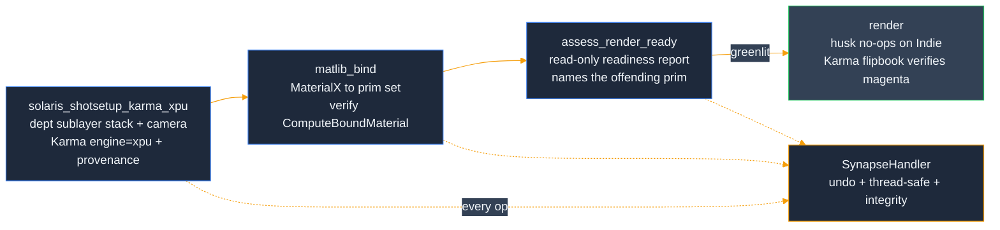

Five real bugs the SCOUT→FORGE discipline caught (the `usdrender` phantom, `sublayer` strongest-first ordering, `editableStage()`-outside-cook, the `productName` parm not authoring the prim, and an MRO name collision), plus the **BL-007 / BL-008 [REAL] close** — an end-to-end render confirm surfaced that **husk silently no-ops on Houdini Indie**, so the gold-standard EXR is license-blocked and the bound emissive material was verified via a Karma-interactive flipbook (magenta, not gray) instead. 49 standalone tests; see `forge/backlog/human_review.json` (BL-012…BL-017) and `scripts/verify_compose_render.py`.

---

### Memory substrate — Moneta vector engine (PR #14)

The inside-out thesis applied to memory. SYNAPSE's scene/decision memory carried two unreconciled stores (a JSONL entry store and a markdown scene-memory file), a metrics gauge wired to a dead accessor, and empty session stubs — a divergence *class*, not a bug list. **Moneta** — a vector-native memory engine (`deposit` / `query` / `signal_attention` / consolidation, with time-decay and durability) — is introduced behind the unchanged `MemoryStore` interface so that divergence becomes **structurally impossible**: there is one store, and `count()` reads the engine's live entity count.

It ships **shadow-first and flag-gated, default-off** (`SYNAPSE_MEMORY_BACKEND` = `jsonl` | `moneta` | `shadow`). Each SYNAPSE `Memory` is serialized whole into a Moneta deposit payload (byte-for-byte round-trip); a deterministic, dependency-free `HashEmbedder` (PYTHONHASHSEED-independent, swappable for a semantic model later) embeds the content; decision / show-tier / gate-source memories map to a `protected_floor` so pinned memories resist decay. Keyword search is **bit-identical** to the JSONL store (parity-by-construction); the shadow path dual-writes and diffs reads into a `ParityReport`, so cutover is justified by evidence, not hope.

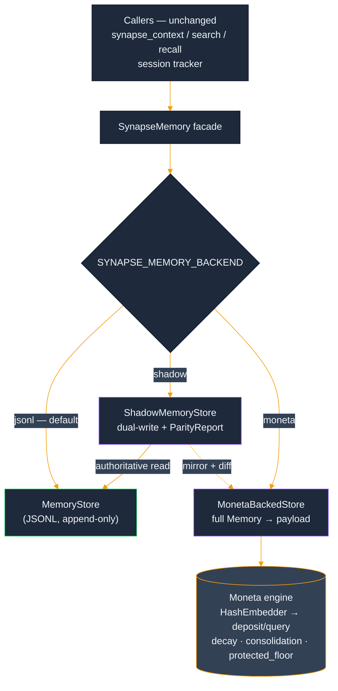

A four-agent **CRUCIBLE** fan-out attacked the backend and found two real defects — a protected-quota silent demotion and a corrupt-snapshot startup-killer — both fixed and pinned. A second ARCHITECT→FORGE→CRUCIBLE pass then closed the **FC4 single-writer gap by construction**: a serialization `RLock` makes the adapter thread-safe (the engine's swap-and-pop index can no longer be corrupted by concurrent deposit/iterate/prune), and because the adapter makes zero `hou.*` calls the lock is never held across the main-thread hop — so it can't deadlock the async server. Proven standalone by a concurrency stress suite; the destructive `run_sleep_pass` is now auditable (returns/logs exactly what it pruned). The production default-on flip is still staged (flag stays `jsonl`), but no longer blocked on live thread-safety verification. Full acceptance/falsifier status and the cutover procedure live in [`docs/MONETA_SYNAPSE_SHIP_REPORT.md`](docs/MONETA_SYNAPSE_SHIP_REPORT.md).

The memory store's bespoke `python/synapse/memory/evolution.py` (the charmander→charizard USD evolution) is superseded by Moneta's consolidation — it stays **dormant** under the `moneta` backend (pinned by `test_moneta_backend_never_fires_evolution`) and still fires under the default `jsonl`; physical removal is deferred to the cutover. (Distinct from `shared/evolution.py`, the MOE-orchestrator subsystem, which is unchanged.)

> **On the name "Moneta":** the vector-memory engine wired in here ([repo](https://github.com/JosephOIbrahim/Moneta)) is a Python library; it is a *distinct project* from the similarly-named "Moneta (Nuke)" entry in the Portfolio thesis above (a planned DCC host). They historically share a working name but are not the same codebase.

---

### Sprint 3 progress — Mile 4 of 6 closed (Mile 5 prestaged)

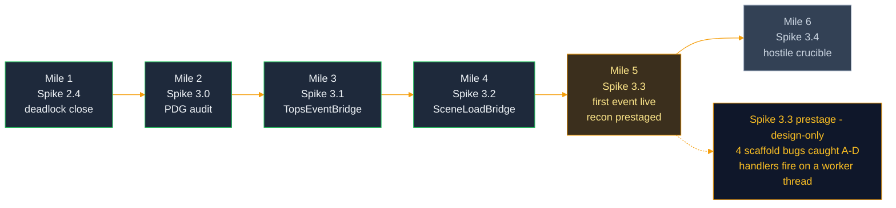

**Mile 1 — Spike 2.4 deadlock closure.** The live Crucible baseline at end of Sprint 3 Day 1 surfaced a deadlock at the daemon ↔ main-thread boundary: synchronous `submit_turn` parked Houdini's main thread on a result queue while the daemon thread's `hdefereval` dispatch waited for that same main thread to pump Qt events. Spike 2.4 closes it by changing `submit_turn` to return immediately with a `TurnHandle` — a `threading.Event`-backed Future analog. The caller decides when (and on which thread) to wait. Main thread stays free to pump Qt events; daemon thread keeps the agent loop; `hdefereval` lambdas execute because main is responsive.

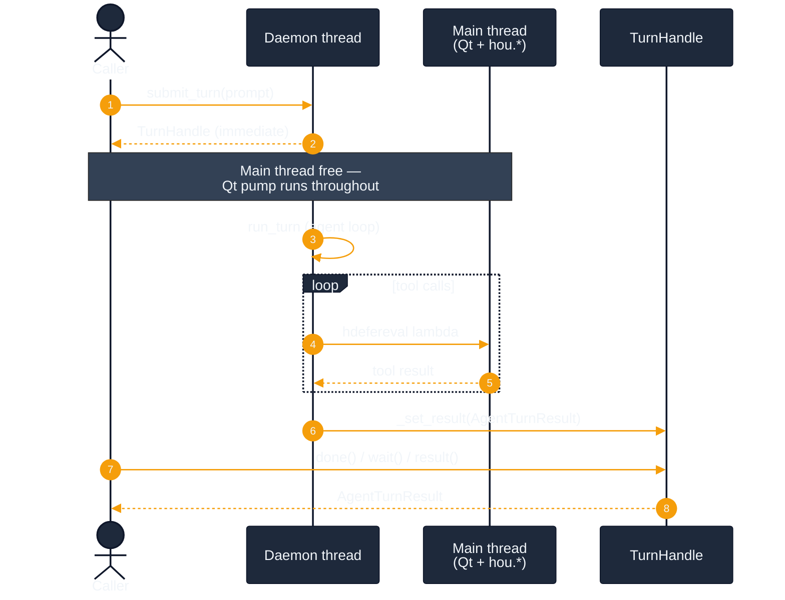

**Mile 2 — Spike 3.0 PDG API audit.** The `pdg` module surface in Houdini 21.0.671 has known divergences from prior versions and from external-LLM training data. Mile 2 ran `dir()` introspection against live Houdini, captured the empirical surface in `docs/sprint3/spike_3_0_pdg_api_audit.md`, and refuted six wrong references in the early sketch — every `hou.pdg.*` path missing, `hou.hipFile.addEventCallback` returning `None` (not a removable handle), `pdg.PyEventCallback` being the wrong name. Each of those would have crashed first contact with Houdini if Spike 3.1 had coded against the sketch verbatim.

**Mile 3 — Spike 3.1 `TopsEventBridge` (Phase A).** In-process PDG event bridge. `warm(top_node)` registers a `pdg.PyEventHandler` against the TOP network's live `pdg.GraphContext` (acquired via `top_node.getPDGGraphContext()`, never class-instantiated — that's for fresh graphs). Surfaces 7 audit-verified event types: `CookStart`, `CookComplete`, `CookError`, `CookWarning`, `WorkItemAdd`, `WorkItemStateChange`, `WorkItemResult`. Threading defensive: handler reads `pdg.*` properties only, no `hou.*` calls inside. 47 tests across basic happy paths and an 8-case hostile suite (handler leak, double-bridge independence, callback-raising-mid-event, topnet-deleted-mid-subscription, multi-event-type-no-loss).

**Mile 4 — Spike 3.2 `SceneLoadBridge` (Phase B).** Auto-warm wire from `hou.hipFile.AfterLoad` to `TopsEventBridge`. Composes (not inherits) — constructor takes a `TopsEventBridge` instance and orchestrates its `cool_all` / `warm_all` cycle on each scene load. Mile 4's empirical scene-load audit (`docs/sprint3/spike_3_2_scene_load_audit.md`) captured all four hipFile events firing on `MainThread`, so the AfterLoad handler is a direct synchronous call — no `hdefereval`. 24 tests across basic happy paths and a 10-case hostile suite. One fix-forward cycle during CRUCIBLE: case 6 (unsubscribe-during-handler) surfaced a real defect — `warm_all` kept iterating after `unsubscribe` returned, leaving stale subs. Reconcile step added at end of `_on_after_load`: if `_subscribed` flipped to `False` mid-handler, run `cool_all` again. The hostile test pinned the contract; the fix held it.

**Mile 5 (prestage) — Spike 3.3 `dir()` recon.** Before any build, a design-only prestage ran the dir()-over-docs discipline against live 21.0.671 and produced `docs/sprint3/spike_3_3_recon.md` — a 13-agent synthesis workflow + adversarial completeness review, then one operator-authorized scratch cook to resolve the single unknowable-from-`dir()` crux. It **resolved the thread-of-delivery question**: PDG event handlers fire on a **worker thread** (the exact opposite of `hou.hipFile`, which fires on main), so the perception handler must be `pdg.*`-only + non-blocking-enqueue or it reintroduces the Spike 2.4 deadlock. And it **caught four bugs in the already-scaffolded bridges** before they could reach a live cook: **A** — `event.workItem` is phantom, so payload is silently empty; **B** — there is no `WorkItemComplete` enum, so `workitem.complete` must be derived from `WorkItemStateChange` + `currentState == CookedSuccess` (and a *static* generator emits neither — the gate demo needs a real processor); **C** — `pdg.Node` has `.name`, not `.path()`; **D** — `pdg.PyEventHandler(callback)` has no constructor, so the scaffold's handler factory hard-crashes on the first `warm()` (the correct API is a raw callable passed to `addEventHandler`, which returns the wrapper). Zero production code was touched; build starts at M1.

**Workflow — the three-role pattern.** Phase A and Phase B both ran the same MOE shape internally:


ARCHITECT writes the design doc and never the code. FORGE implements against the spec and writes basic happy-path tests. CRUCIBLE writes hostile tests and never the implementation; when a hostile test surfaces a real defect, FORGE fixes the implementation rather than CRUCIBLE weakening the test (Commandment 7). Each role's authority is constitutionally restricted; phase boundaries gate the merge.

### Sprint 3 — load-bearing commits

```
87c4db9  Spike 3.2    SceneLoadBridge hostile suite (CRUCIBLE) + fix-forward
4cba649  Spike 3.2    SceneLoadBridge scaffold (FORGE)
ef7d5ae  Spike 3.2    SceneLoadBridge design (ARCHITECT)
9e4cc42  Spike 3.2    scene-load audit findings landed (Mile 4 audit)
a476386  Spike 3.2    scene-load API audit infrastructure
2f46590  CI repair    bump checkout/setup-python (Node.js 20 deprecation)
fcd1077  CI repair    gate test_live_capture body behind __main__
bb2713b  Spike 3.1    TopsEventBridge hostile suite (CRUCIBLE)
89da296  Spike 3.1    TopsEventBridge scaffold (FORGE)
2aa03d9  Spike 3.1    TopsEventBridge design (ARCHITECT)
07946dc  Spike 3.0    PDG API audit findings (Mile 2 audit)
6bf2f07  Spike 3.0    PDG API audit infrastructure
b1d3163  Spike 2.4    close daemon↔main-thread deadlock via TurnHandle
6e08dae  Spike 2.4    add TurnHandle (Future-shaped result envelope)
```

Sprint 2 Week 1 (`5e6fc0c`) shipped the first tool (`synapse_inspect_stage`) end-to-end through the still-outside-in WebSocket path. Sprint 3 built the inside-out substrate alongside it — one spike at a time, with an audit-first discipline (live `dir()` introspection in Houdini 21.0.671 before any code lands) and a human-in-the-loop Crucible protocol (`docs/crucible_protocol.md`) for the parts bash cannot drive. Tagged at `v5.5.0` (`4faaa3a`).

### Sprint 3 — what's next

```
Spike 3.3    First TOPS event surface live              [Mile 5 — needs GUI]
             workitem.complete → agent perception
             real .hip + real TOP cook through the bridge
Spike 3.4    Hostile TOPS Crucible                      [Mile 6]
             event flood, malformed events, cancellation
```

Mile 5 is the first time a real `pdg.Event` reaches the agent's perception layer through the two-bridge wiring in graphical Houdini. End-to-end timing target: under 50ms from `cookComplete` to `perception_callback` invocation (in-process should be sub-ms; budget is for safety margin). Mile 6 turns the heat up — event flood (10K events / 1s), malformed events (missing fields surface as typed parse errors), cancellation mid-cook with no orphaned callbacks.

Mile 5 cannot run from bash. It needs Joe at the GUI driving a real cook against the scaffolded bridges.

---
