# SYNAPSE — Changelog & detailed capability

The full version-by-version history and per-tool capability detail. The [README](README.md) keeps the artist-facing essentials; this is the deep record.

## Unreleased — backfill: BLOCKS, deterministic scene setups

*Documentation only; nothing that runs changed. The BLOCKS engine landed on master at `87927076` (2026-08-06) and first shipped in **v5.43.0** (`git tag --contains 87927076 -l 'v*' | sort -V | head -1`); the M5b rulings closed on top of it (`harness/notes/receipts/M5b.json`, status green). This changelog never recorded either: at v5.70.1 (`329bd5b3`, the tree before this entry) a case-sensitive `git grep -nE '\bBLOCKS\b|apply_fixture' 329bd5b3 -- CHANGELOG.md` returned nothing while the code shipped. Salvaged from the unmerged `rope/gate-a` branch per `harness/notes/closeout-2026-09-15/PLAN.md` (rope/gate-a, Salvage 1), every claim re-checked against the tree at v5.70.1; what was not re-checked is marked.*

**THE SETUP PROBLEM, STATED HONESTLY.** Asking a model to author a Solaris network is sampling, and a sampler is not a function - the same request produced a different graph every time. BLOCKS moves canonical setups out of generation entirely: a **fixture** is a scene setup stored as data (node types, exact names, wires, positions, parm values), and the operation is *reconcile to the definition*, not *create*. Ask twice and the second call is a no-op.

**THE ENGINE (M5, `87927076`).** `synapse_apply_fixture` / `synapse_remove_fixture`, mounted on a cognitive Dispatcher in `mcp_server.py` (`_BLOCKS_APPLY_TOOL_NAME` / `_BLOCKS_REMOVE_TOOL_NAME`, `mcp_server.py:811-812`; implementation `python/synapse/cognitive/tools/apply_fixture.py`). Six modules under `python/synapse/blocks/` (`__init__`, `canonical`, `fixtures`, `plan`, `runtime`, `transport`): `plan.py` is the pure reconcile diff (no `hou`), `runtime.py` is the only module that touches the host, undo-grouped with post-mutation self-verification. Ruled contract, enforced by code shape rather than convention: ownership is a network box (`BLOCKS_<fixture>`, nodes flat in `/stage`, zero USD `customData` written); collisions short-circuit **before** the mutation block, so the undo group is never entered; delete candidates come only from enumerated box membership - `outside_names` is read in `plan.py` for collision detection only, never inside `build_plan`, and `tests/test_blocks_reconciler.py` pins that source property.

**PROVEN, NOT ASSERTED (F-1..F-7, `harness/blocks/invariants_m5.py`).** Apply on clean reproduces the committed baseline byte-exact (F-1); apply -> remove -> apply gives the same hash (F-2); apply on applied is 0 ops with the hash unchanged (F-3); an artist node outside the box keeps every authored property (F-4), and a display-flag transfer is reported by name, never silent (F-4b); a name clash refuses with the full stage signature byte-identical across the call (F-5). M5b added two: the same fixture built under two different `$HIP` values hashes identically under `c3` (F-6, cross-cwd equality), and an undeclared node the artist dragged into the box survives apply - alive in `/stage`, every authored property unchanged, no longer a member (F-7, ejection safety). **Negative controls run first** (C-1..C-6) - Law 1: an instrument that has not been shown to disagree is not evidence. Oracle: `fixtures/solaris.basic.json`, baseline canonicalizer `c3` (`python/synapse/blocks/canonical.py:75`); the prior `c2` baseline is kept in `superseded_baselines[]` with its reason, not overwritten. Reproduce: `hython harness/blocks/invariants_m5.py`.

**FOUR SILENT FAILURES CAUGHT BY THE HARNESS.** (1) `createNode('domelight')` produces type name `domelight::3.0` - naive literal comparison never converges, so every apply planned delete-and-recreate and F-3 could never have been green; the stable identity is `nameComponents()[2]`. (2) `createNode`, `createNetworkBox` and `setName` all **auto-rename silently** on a clash and raise nothing - which is precisely why the collision gate must precede creation, since detecting a clash afterwards means the scene is already mutated. (3) `NetworkBox.destroy()` defaults to `destroy_contents=False` and **keeps its members**. (4) A String parm's authored value is `unexpandedString()`, not `eval()` - the camera's default primpath `/cameras/$OS` *evaluates* to exactly what the fixture declares, so comparing on `eval()` reports "already correct" and never authors the literal, leaving every check green over an unset value.

**THE EVIDENCE HARNESS THAT PRECEDED IT (AUTORESEARCH, `harness/autoresearch/`).** Three tiers: Claude orchestrates, a local model authors and triages questions through ollama at zero API cost, hython executes probes deterministically. The model may author **questions**; only probes produce **answers**, and proposed missions pass a literal fence (only type names the evidence proved alive) plus schema validation before they can run. As recorded by the M5 leg on 2026-08-06 (not re-probed in this backfill): it confirmed four dead H22 literals with live successors (`graft` -> `graftbranches`/`graftstages`, `usd` -> `inlineusd`, `geometryclipsequence` -> `geoclipsequence`/`valueclip`, `usdrender` -> `usdrender_rop`), caught `karmarenderproperties` **deprecated** one step before it entered the fixture, and found Houdini stamping session node IDs into composed USD as provenance - the `c2` canonicalizer rule, without which cross-session determinism was impossible.

**SEAM DRIFT, RE-VERIFIED AT v5.70.1.** `dispatcher.py` describes "the single entry point"; `mcp_server.py` in fact builds **four** independent Dispatcher singletons - `_inspector_dispatcher` (:632), `_scout_dispatcher` (:750), `_blocks_dispatcher` (:852), `_ported_dispatcher` (:1000) - each `is_testing=True` (`grep -n -A4 "_Dispatcher(" mcp_server.py`). M5 also recorded (SD-2, not re-verified here) that the production main-thread branch on that seam is unwired and main-thread safety on this path comes downstream from the WebSocket `execute_python` handler. BLOCKS follows the established practice and claims nothing more. Recorded rather than silently adapted to.

**RULED AND CLOSED (M5b, `harness/notes/receipts/M5b.json`, status green).** Four rulings from 2026-08-06. R-M5-1: `c3` canonicalizer - any authored path resolving through a Houdini environment variable (`$HIP`, `$HIPNAME`, `$JOB`, `$OS`, `$TEMP`) is session-local, the fixture re-baselined. R-M5-2: keep the display-flag behaviour as shipped - honour the fixture's declared display node, report the transfer by name (the LOP display flag is one exclusive slot, the single place where *match the definition* and *never touch artist nodes* cannot both hold). R-M5-3, an override of what shipped: a node the artist dragged into the box that the fixture does not declare is **ejected, not deleted** (`python/synapse/blocks/runtime.py`, `result['ejected']`; `test_stray_inside_the_box_is_ejected_not_deleted`); `remove_fixture` still deletes members - that is an explicit instruction, a different act. R-M5-4: the h22 symbol table regenerated (now stamped `22.0.400`, the target build). Receipt verdict line: *"solaris.basic reconciled in BLOCKS_solaris_basic - 0 created, 0 deleted, 0 changed (1 ops). 1 node(s) not declared by the fixture were ejected from the box and left in the stage: artist_stray_null."*

**STILL TRUE, AND ONE STALE ROW.** Both tools take a fixture *name* (`apply_fixture.py` signature) - phrase routing (M6, "basic Solaris setup" -> fixture) is not claimed here and was not checked. No USD `customData` (RFC-gated). A second fixture, `fixtures/solaris.spine.json`, exists on master (canonicalizer `recipes-graph-v1+c3`) - its provenance is not covered by this entry. `harness/legs.json` still lists M5b as `"state": "ready"` although its receipt is green; that row is stale and is left for its owner.

## v5.75.2 - The checks that could not lose

*Documentation, harness and release tooling only; nothing that runs changed. `python scripts/product_surface.py --diff v5.75.1 HEAD` returns no product change across `python/`, `installer/` and the seven shipped root modules — and that pathspec is new in this release, because the old one could not see them.*

**A RELEASE CHECK COMPARED FILE TIMESTAMPS GIT DOES NOT PRESERVE.** `harness/verify/hython_verbs.py` asserted the hython verb-sweep artifact was not older than the script that produced it, using `os.path.getmtime` on each. Git records no mtimes, so on a clean clone both files take their checkout time in arbitrary order — the gate was committed one release earlier and would have false-failed on the first machine that was not this one. The sweep now stamps a sha256 of its own source into the artifact and the verifier re-hashes the source on disk. An artifact with no stamp is UNVERIFIABLE and fails, because *which script produced it* is exactly the question. **The referee was then made to lose, six ways, by an agent that did not write it:** a same-length single-byte flip mid-file in the real script, and in an isolated sandbox — stamp absent, null, empty, wrong, wrong build pin, `complete=false`. All exit 1. It also still wins where the old rule lost: mtime inverted 60 seconds with identical content now passes. Two deviations are on the record rather than omitted — the hash is over CRLF-normalised bytes, because `git ls-files --eol` reports `i/lf w/crlf` on three of these files despite `.gitattributes` pinning `eol=lf`, and hashing raw bytes would have reintroduced the same false-failure class; and the frozen baseline was **not** re-frozen, because the would-be baseline differed only by an em-dash inside prose no check reads, and re-freezing over cosmetics is how a gate gets quietly weakened.

**"THE PRODUCT DID NOT CHANGE" WAS PROVED WITH A PATH LIST BLIND TO THE MCP ENTRY POINT.** Every release since v5.70.1 has asserted `git diff --stat v<prev> v<new> -- python installer`, copy-forwarded into each cut's own `compose_assets.py` and quoted in the published notes, in this file and in the `installer-verification.json` that ships as an asset. Nineteen tracked `.py` files live at the repository root, outside both trees; seven are the shipped MCP surface, including `mcp_server.py` — the exact file `.mcp.json` launches. **Measured, not hypothesised:** `c6221f3b` ("asyncio.run() was disabling every MCP tool call under Houdini") moved 65 lines of `mcp_server.py` and nothing under `python/` or `installer/`. The old pathspec returns EMPTY for it. `scripts/product_surface.py` is now the one definition, importable so the next producer reads it instead of retyping it, and it refuses a term that matches no tracked file — an empty diff from a dead term prints exactly like an unchanged tree, and git reports neither. `tests/test_product_surface.py` pins the width in both directions: too narrow loses the entry points again, too wide swallows `harness/` and reports a product change every release. A related divergence is recorded and left alone: `release-5.71.0/compose_assets.py:143` stores a `check` label naming v5.70.0 while `:144` runs v5.70.1, so a published asset names a producer that did not produce its result.

**THE SETUP GUIDE SENT ARTISTS TO THE RELEASE BEFORE THE FIX IT DESCRIBES.** `docs/getting-started/installation.md`, linked from the README's front page, pinned v5.74.0 — the release *before* the memory-store repair the README headlines. The link resolved; it simply handed people a stale installer. Retargeted to `/releases/latest` rather than repinned, because nothing under `scripts/` or `.github/` owns that file and a pinned number there has no keeper. `docs/status.md`, titled "Current status and limits", described v5.67.3 as the latest changes — eight releases stale — and is rewritten current with each claim re-checked against the repo.

**THE README WAS DRAWING A GATE THAT DOES NOT EXIST.** The prompt-flow diagram showed one destructive/not-destructive branch ending in "Asks you first." The panel does not ask. What it has is a default-on, fail-closed DENY layer derived from gate levels (`python/synapse/panel/worker_policy.py`), so a tool the worker may not call is refused with a reason and re-planned, never queued for approval. The diagram now shows three outcomes, and a new paragraph names the denied set. The two-paths section was also on the wrong axis: which path a call takes is decided by **how the client connected**, and the stdio server this repo configures (`.mcp.json` → `mcp_server.py`) forwards over WebSocket to the live handlers and is *not* bridge-routed despite the name, while the panel's own calls *are*. All four routes are named with their files. Emergency halt's scope is corrected from "PDG cooks under `/obj`" to cooking TOP networks under `/tasks`, `/obj`, `/stage` and `/out`, in both the table and the diagram.

**THREE FINDINGS, NO CODE.** `harness/notes/findings/id-hash-collision.md`: `ae34ed96` closed a *producer* of duplicate memory ids, not the mechanism. `models.py:147` builds `created_at` at whole-second resolution and `models.py:157-162` hashes `content:created_at:memory_type`, so two writes of identical content and type inside one second collide deterministically rather than probabilistically. The live store carries 641 distinct content/type keys, 69 of them written more than once, `'Executed: execute_python'` 184 times with a closest repeat of 1.0s — which is the tightest two rows can sit without being one row. **The fix already exists and is off by default:** `store.py:1660-1669` re-hashes the full canonical dict behind `require_durable=True`, which defaults False; promoting it moves zero existing ids and changes no stored format. `harness/notes/findings/mirror-forensics-2026-09-18.md`: the prior audit's 253-primary-only figure is now zero and the mirror is a strict superset, but the four mirror-only records are not four rows — they are the entire v4 studio-lookdev generation, and the primary contains no trace of it, so recall answers "Create a Solaris Network" with the v3 simple-sphere recipe. The eleven `degraded-load` quarantine copies were byte-identical to each other and held no unique record; ten plus `pre-repair` were removed and one kept as the artifact, recovering 14.6 MiB. `harness/notes/findings/collision-dispositions.md`: the two known disagreeing dispositions are in fact four. All three name a decision and take none.

**A 23-AGENT REVIEW OF THE WHOLE SYSTEM** is at `docs/reviews/synapse-review-2026-09-18.md`. Eleven surveyors, one adversarial refuter per dimension that could return CONFIRMED only by reproducing the evidence itself, and a completeness critic. **170 load-bearing claims re-run: 103 CONFIRMED, 62 CORRECTED, 5 REFUTED** — 39% did not survive first contact unchanged, which is the argument for the refuter layer rather than noise. 47 blocker-severity findings. The critic's pick for biggest risk is not the loudest one: nothing that runs automatically can see the runtime the product ships into — CI is ubuntu/macos on 3.11 and 3.14, production is hython on Windows inside Houdini 22.0.400, and there is no Windows leg, no Houdini leg and no scheduled run.

**STILL OPEN.** The id-hash mechanism is ticketed, not fixed — the one-line promotion is the operator's call. The four v4-recipe records remain mirror-only; until they are backfilled, recall returns v3. `CLAUDE.md` still carries in its Identity section the `/mcp` claim the README corrected in this release. The six `passing:` flags in `.synapse/contracts/hython-verbs.yaml` are still `false`, because the full suite has not been run against them.

## v5.75.1 - The tag that was checked

*Backfilled 2026-09-18; this entry did not exist at the time of the release. Remediation for v5.75.0.*

**THE PREDECESSOR WAS TAGGED ON A CI-RED COMMIT.** `scripts/release_ci_gate.py` exists precisely to stop that, and its own docstring already recorded v5.64.0 and v5.65.0 doing it, with v5.65.2 tagged mid-run. v5.75.0 made four. This release moved the tag onto a commit whose CI concluded success on all four required contexts.

**WHAT IT DID NOT DO, STATED PLAINLY.** v5.75.1 itself did not go through `scripts/tag_release.py` — the annotated message `SYNAPSE v5.75.1 -- release-truth gate passed` that the script hardcodes is absent from the tag, and present on every tag from v5.68.0 through v5.74.0. It also shipped **three** assets where its four predecessors shipped four: no `installer-verification.json`, and `qualification_report: null` in the public build report. **The installer an artist downloads was never run against a Houdini install.** That was disclosed in the release notes rather than omitted, and it remains true.

## v5.75.0 - The second write, and the silence around it

*Backfilled 2026-09-18; this entry did not exist at the time of the release. Superseded by v5.75.1, and marked prerelease on 2026-09-18.*

**THE MEMORY DUAL-WRITE THAT DEGRADED THE STORE.** `tracker.handle_memory_add` deposited a rich record, and then `write_memory_entry` deposited the same content again with tags, `hip_file`, `hip_version` and `frame` at dataclass defaults. Both hashed to one id, and `memory_lifecycle._records` correctly refused a store holding one identity with two payloads — for two days, while every health surface reported OK. Producer suppressed at `tracker.py:515`; a backstop added in `MemoryStore.add`; the ungated automatic prune disarmed. Blast radius was five records, all of the canonical Solaris recipe chain.

**THE RELEASE ITSELF WAS THE FAILURE.** It was tagged on a commit whose CI concluded failure, published five seconds after that run started, and carried **zero assets** — the README download button pointed at a release with nothing to download. The drift that reddened it is verifiable in the tagged tree: `VERSION` and `pyproject.toml` read 5.75.0 while `CLAUDE.md` and the README banner still read 5.74.0, both declared surfaces that `scripts/tag_release.py` refuses on. The tag was created on a tree its own gate would have rejected, because the gate was not run.

## v5.74.0 - The page, and the receipt that guards it

*Documentation and tests only; nothing that runs changed. The single file differing under `python/` since v5.73.0 is the version string in `__init__.py`, and the release's own claim gate verifies that before it will allow a tag.*

**THE DIAGRAMS READ ON EITHER THEME.** The three README mermaid blocks were drawn with unstyled nodes. An unstyled node inherits the host theme, so ink and fill were whatever the visitor's GitHub was set to, and on one of the two settings they were hard to read. Every node now declares a dark grey fill (`#333333`), white text (`#FFFFFF`) and a grey outline (`#8C8C8C`). Two limits are deliberate and stated on the receipt rather than omitted: `classDef` styles *nodes*, so edge lines and edge labels still inherit the host theme - pinning them white would make them invisible on a light background - and the two subgraph containers in the developer diagram are left unstyled so their titles stay legible either way.

**THE README IS REBUILT TO THE PROJECT'S OWN CONVENTION.** `CLAUDE.md` has required ADHD-friendly formatting of the README as a standing convention; the file had drifted into prose walls regardless. Short blocks, one idea each, bold only where it anchors. Nothing was cut - the length moved into whitespace.

**THE PAGE NOW HAS A RECEIPT, AND THE RECEIPT CAN FAIL.** `harness/notes/readme_check.py` resolves every diagram node against the declared fill and ink, checks every release-tagged version string on the page against `VERSION`, and checks the tool count against the module the page itself names as its producer - by importing that module, because importing it *is* reading the producer; if the import fails the count is unmeasured, and an unmeasured number fails the receipt loudly rather than passing quietly. The previous version of this script had **exactly one failure channel and none of its numbers were on it**: `ok` came from a quote-and-bracket balance check per diagram and gated `raise SystemExit(0 if ok else 1)`, so an unbalanced block did exit 1 - but everything under its "ASSERTED vs ACTUAL" heading printed and stopped there, the version string compared against nothing and a count checked against a literal `603` baked into the script that the README does not claim. The half that looked like verification could not fail. It carries two negative controls now - a block with no styling, and a block styled white-on-white - and fails if the resolver calls either of them good (Law 1: an instrument not shown to disagree is not evidence). **What the receipt does not prove is on the receipt:** it resolves the *source* and invokes no browser. So the render was measured separately before the tag - all three diagrams rendered in a real browser on both the dark and the light theme, every node's computed fill and text colour read back off the painted SVG, and the two subgraph containers confirmed carrying the host theme exactly as the receipt says they deliberately do. The probe POSTs its own result to a local server that writes the JSON, so no number passes through anyone's hands; it earned that design on its first run, which reported a false mismatch by counting a zero-size placeholder rect mermaid emits per node and that paints nothing. Numbers: `harness/notes/release-5.74.0/render-probe-5.74.0.json`, re-runnable via `render_probe_server.py`. **What remains UNKNOWN (Law 4) is GITHUB's render** - it pins its own mermaid version and theme and renders server-side, so if it changes how it handles `classDef` both checks still pass and neither catches it.

**EIGHT TESTS PIN THE MEMORY SEAM** (`tests/test_memory_seam_defects.py`). Their source is a 1,800-line review in which every "fails today" verdict was a **prediction** - the review executed nothing. A probe pass then ran seven of them and **refuted two**. This file is the survivors, converted from prose into claims that execute. *Group A* - four **strict** xfails, deterministic, failing at HEAD, each run and observed failing before commit per `AGENTS.md` §4 ("a test not seen fail is a decoration"). Strict is the point: they XPASS and turn the suite red the moment someone fixes the defect, which forces the fix to delete the marker, so a defect cannot be repaired silently and cannot regress unnoticed. *Group B* - three permanent green guards pinning facts that are true now and that two independent agents disagreed about: the gate-policy truth table including its documented empty-set vacuity, that `fetch_raw_memories` is an exact set intersection with no distance path, and that the distance threshold is emitted but never compared. These are why the file still earns its place after every Group A defect is fixed. One further test, the concurrent-write race, is **non-strict** - a probabilistic test cannot honestly be made strict. **Pinned is not fixed:** none of the four defects is repaired here. Two of them self-qualify as latent, ungated hazards rather than live production failures (P2 has zero of 33 call sites passing a `str`; P7's id instability is a deliberate, test-pinned FU-1 decision), and the tests say what the probe said rather than upgrading the claim.

**THE PREVIOUS RELEASE'S ASSETS SHIPPED IN THIS CUT.** v5.73.0 was published, marked Latest, and carried **zero assets** - its README download button returned 404 while all four assets sat qualified 19/19 on the build machine. What had never run was the whole release tail: that cut's last invocation was `['build', 'qual', 'suites', 'compose']`, so `commit`, `tag`, `push`, `publish` and `verify` have no line in its log - four were done by hand the next day, and publish by nobody. They are attached now, and three provenance fields were corrected first: `source_revision` and `ci.headSha` named the pre-bump commit (the composer stamps those from `HEAD`, and the second compose pass lives in the `tag` step that cut never ran), and `product_change_since_v5.70.0` named three different baselines at once - key, `check` string and executed command all disagreeing, none of them the real predecessor - under a note claiming "only the version string" while its own result listed 56 files. The repair rests on evidence rather than assertion: `harness/notes/release-5.73.0/repair_assets.py` re-proves, before it writes anything, that every non-`_vendor` file under `python/synapse/` in the shipped payload is byte-identical to the tag (415 files, 0 differences), then the served installer was re-downloaded and hashed against the qualified hash. `_vendor/` is excluded because the builder vendors it at build time; `RELEASE_CARD.md` lists it as not a surface.

**THREE COMPOSER DEFECTS FIXED FOR THIS CUT,** all of the silent-success kind - none raised, none failed a gate, each produced a report that read as evidence. The baselines are derived from one `PREV` constant, so key, `check` string and command cannot disagree again. The product-delta note is **computed** from the diff instead of asserted over it, so it can no longer contradict its own result. The seat baseline is the six reds v5.73.0 measured rather than the five its composer listed. **That one-short list did not stay inside the harness.** The seat suite gained a genuine sixth red at v5.71.0 (`test_doctor_button.py::test_transport_discovers_only_the_running_owner_and_tracks_reconnection`); `KNOWN` was never raised from five to six, and `new = measured - known` therefore re-manufactured that same test as a NEW regression at v5.72.0 and again at v5.73.0 - one and two releases after it first appeared. All three published `installer-verification.json` assets carry `status: PASS_WITH_NEW_SEAT_RED` and `installed_houdini.status: NEW_RED` over it, and all three say "the other three are named and undiagnosed" where the count is four. A red that is new in three consecutive releases is by construction not new. The error over-claims a regression rather than hiding one, which is the better direction to fail in, but it is a published artifact that is wrong about its own product. Corrected here for v5.74.0; the three published assets are left as the record of what those releases said, with this entry as the correction. Confirmed by fetching each from its public URL, not from a local copy.

**STILL OPEN.** Four memory-seam defects pinned, not fixed. The diagram colours proven declared AND proven rendered by mermaid in a browser, but GitHub's own server-side render still unproven. Six panel seat tests red, none new. The three v5.73.0 readability findings - two named greys nearly one grey, panel type far smaller than its host, 28.6 characters per transcript line - all await a design ruling.

## v5.73.0 - Readable, and the fences that failed

*Six branches. The quiet end of the text ramp is legible for the first time - captions, hints,
metadata, disabled labels and the input placeholder all clear AA on every surface they can land on,
with the placeholder going 3.43:1 to 6.15:1. UI labels finally draw the Medium the bundled face
ships, which the code was discarding for want of a branch. The context breadcrumb drops 15px to
11px, a four-rung inversion caused by five rules emitting points where the sheet uses pixels. On the
repository side three fences were repaired, each found by running it: pre-push swept upstream
release commits into every rebased branch's range; the asset composer read a hardcoded version,
wrote to a path dead since v5.70.1, and guarded with a spelling its templates never emit; and
fillable slots now use a delimiter prose cannot contain. Measured alone, in order: stock 9585 passed, 434 skipped, 625 warnings in 396.48s (0:06:36);
seat 6 failed, 202 passed, 46 warnings in 72.54s (0:01:12); installer units 37 passed, 1 warning in 6.26s; qualification 19 of 19 PASS, exit 0. Stated and unresolved: raising the
quiet end left secondary and tertiary 1.0245:1 apart, so form rather than value has to carry that
rung from here, while disabled was deliberately returned below the floor under WCAG's
inactive-component exemption after the raise collapsed four live state marks to 1.000:1. Full notes: `docs/releases/v5.73.0.md`.*

## v5.72.0 - One scale, one family, and fences that hold

*Seven branches. The panel's type becomes one scale (11/12/15/19, the 10px size deleted and the
readable floor raised to match instead of sitting above fifteen sites that ignored it); actions
become one colour family with weight carrying emphasis; the consent card prints the authored
phrase it already owned rather than an enum tag over it. On the repository side a capability
fence lands: `VERSION`, `harness/state/**` and `harness/verify/*_baseline.json` refuse a commit
without `SYNAPSE_GATE_C=1`, because deny rules match a command's form and `python -c` walks
around them; every cycle now diffs what it really changed against that set in both `run.ts` and
`orchestrate.ps1`. Measured alone, in order: stock 9558 passed, 430 skipped, 625 warnings in 392.28s (0:06:32);
seat 6 failed, 200 passed, 47 warnings in 72.39s (0:01:12) (six, none new, named in
`harness/notes/release-5.71.0/SEAT_REDS.md`); installer units 37 passed, 1 warning in 6.62s;
qualification 19/19 PASS, exit 0. Known
and stated: the commit fence cannot see `git cherry-pick` or `git revert` - git runs no hook
there - so that hole is closed at push instead. Full notes: `docs/releases/v5.72.0.md`.*

## v5.71.0 — The farm, the receipt, and a bridge that says no

*2026-09-15.* Published as **Latest** with a qualified Windows Setup (19/19 PASS, exit 0). Ten
branches merged; the registry goes 128 -> 137 tools.

**Artist-facing.** Durable TOPs render jobs with an artist render workspace (seven farm
tools, `/render`, a footer button). The **Undo Receipt**: every mutating handler already
computed its undo-group label and discarded it — it now travels with the result and
reaches the panel, where a repo-wide grep for `Ctrl+Z|undoable|can be undone` had
returned zero artist-facing strings. The **bridge-down send guard**: a message typed
while the bridge is down is refused at send time with the text kept in the box, instead
of being queued silently and replayed into a later scene. `houdini_layout_network`
(bounded native layout, one undo group, refuses an artist's own boxes).
`synapse_insert_cache` (undoable boundary insertion behind the review gate, shipped dark
behind `SYNAPSE_CACHE_ADVISOR_ENABLED`). Scoped memory on `synapse_decide` / `_recall`.

**Repository.** `scripts/ingest_rulings.py` makes a design ruling land in the decision
board instead of nowhere — ids validated against the roster, unknown ids refuse and write
nothing. An `AuditLog` session-id collision after GC is fixed, with the failing-then-passing
test the original branch never had. The 2026-09-15 branch triage, harness review,
first-principles audit and panel design crit are in the tree.

**Measured alone, in order:** stock 9369 passed, 430 skipped, 625 warnings in 337.48s (0:05:37);
seat suite 6 failed, 200 passed, 45 warnings in 71.97s (0:01:11) (five known + ONE NEW, diagnosed in
`harness/notes/release-5.71.0/SEAT_REDS.md`);
installer unit 37 passed, 1 warning in 6.36s; qualification 19/19 PASS, exit 0. See the
[release notes](docs/releases/v5.71.0.md).

## v5.70.1 — The front door, made readable

*2026-09-15.* Published as **Latest** with a qualified Windows Setup. **Nothing that
runs changed** — the panel, the tools and the installer payload's code are identical
to 5.70.0 apart from the version string in `python/synapse/__init__.py`;
`git diff --stat v5.70.0 v5.70.1 -- python installer` shows that one file. What changed is what an artist reads first: the README rewritten for
scanning (one idea per block; its one number, 128 tools, now names its producer), and
the setup guide's download links, which had pointed at 5.68.0 for three releases.
The harness's own state boards are tracked in the tree instead of living on one
machine; run artifacts are ignored. See the [release notes](docs/releases/v5.70.1.md).

**Disclosed, not fixed:** a message typed while the bridge is down is queued without
a visible signal and replayed when the bridge returns (found by code reading in the
2026-09-15 artist-surface review; `harness/notes/closeout-2026-09-15/`).

## v5.70.0 — Tool names an artist can read

*2026-09-14.* Published as **Latest** with a qualified Windows Setup (19 of 19
installer checks PASS). Unlike 5.69.0 it never needed the Preview channel: the build
toolchain was already provisioned and lock-verified, so the Setup was built and
qualified *before* the banner claimed Latest. `harness/notes/RELEASE_v5.70.0.md`
keeps that record.

The panel's own tool labels destroyed domain words (`USD` became `usd`) and led with
namespaces nobody needs to read. A curated-label map had also been running at
**4 of 8** in silence, keyed against the wrong registry column. Both repaired, and a
guard added that reads the live registry so it cannot rot again. See the
[release notes](docs/releases/v5.70.0.md).

**Also found while cutting this release:** the panel seat suite and the stock suite
share `~/.synapse/logs/synapse.log` and **cannot be run concurrently** — the loser of
the race reports a plausible-looking timing failure. It produced a phantom sixth red
before being caught. Nothing in either suite detects the collision.

## v5.69.0 — The stop controls actually stop

*2026-09-14.* Published as **Latest** with a qualified Windows Setup (19 of 19 installer
checks PASS). It spent its first hour on the Preview channel while the build toolchain
was fetched and verified; `harness/notes/RELEASE_v5.69.0.md` keeps that record. See the
[release notes](docs/releases/v5.69.0.md) for scope, measurements and what is
still unfinished.

**Artist-facing**

- **The emergency halt now fires when another panel tool is running.** The
  re-entry guard in `_run_direct_tool` keyed on *any* live direct-tool call, so
  cancelling a cook and then hitting Emergency halt dropped the halt silently
  while the rail read `Still Emergency halt…` — which reads as *in progress*.
  The guard is now per verb, and a request that is refused says so instead of
  returning in silence. The server side already exempted `emergency_halt` from
  the mutation lock for the same reason.
- **A REVIEW consent card no longer files a rejection that never happened.**
  Clicking REVERT while the worker was streaming tore the card down, stamped
  REJECTED, wrote `GateDecision.REJECTED` against a proposal the bridge had
  already allowed, and said so in the transcript. None of it had happened. The
  card now survives the refusal and settles neutrally when a request does go out.
- **The system-prompt fallback announces itself** instead of substituting
  silently, and **session journal entries carry a date**.

**Records**

- `log_decision` no longer discards out-of-schema payload keys without saying so.
- The v2 baseline CSV has a reconstructed, tested producer; every number in it is
  re-derivable rather than folklore.
- A detector for a LOP catalog stamped on a build the runtime has moved past.

**Tests and harness**

- **The panel seat suite used to hang forever** on a modal dialog under offscreen
  Qt — three tests had never executed on any machine, and anything queued behind
  the file never started. A modal now fails loudly instead of blocking, and the
  directory runs: 201 passed, 5 failed, 76s. The guard documents what it cannot
  cover (`QMenu`, measured inert) rather than implying total protection.
- Recorded: **the suite's skip population is not static.** 21 tests are disabled
  by a symbol missing from an out-of-tree dependency, which no gate here can see.
  See `harness/notes/SUITE_FLOOR_IS_NOT_STABLE.md`.

Suite at the time of writing: **8908 passed, 430 skipped, 0 failed.**

## v5.68.0 — Graph review controls and Windows Setup

*2026-09-13.* Adds the opt-in proposal worker policy and classifies host graph
instantiation for review. Graph evidence covers Houdini 22.0.400 and 22.0.417;
builder/oracle algorithms are unchanged. Brings the existing Windows Setup
implementation into main, refreshes the installer payload, and shortens the
README into a clear starting path. See the [release notes](docs/releases/v5.68.0.md)
for qualification and unfinished work.

## v5.67.4 — Artist guide and architecture diagrams

*2026-09-09.* Reworks the README for quick scanning and progressive detail;
updates setup and first-session instructions to the current panel. Replaces
historical front-page diagrams with the artist workflow, actual execution paths,
three-substrate memory LOOP, checked suggestions and release process. Separates
shipped behavior from optional scaffolds and future predictive/Computer Use work,
and records current GitHub topic metadata. Runtime behavior is unchanged; the
new version requires matching Stage 0 experience qualification. See the
[release notes](docs/releases/v5.67.4.md).

## v5.67.3 — Panel reliability and memory recovery

*2026-09-09.* Ships the visible Connect/Doctor controls, lightning tools icon,
centered shortcuts and hint, complete Ollama model discovery, clearer provider
errors and native history handling. The CTO repairs prevent duplicate dispatch
after uncertain MCP replies, preserve tool evidence and checked vision capability,
retain worker admission across panel reloads, and connect the preferred MCP route
to optional LOOP observation. Interrupted or unreadable journals retain honest
pending recovery; native timeouts remain unknown and worker output is bounded.
The fixed Solaris lookdev verifier now resolves and checks the MaterialX surface
shader. Restart Houdini after updating. See the [release notes](docs/releases/v5.67.3.md)
for qualification and limits; the unpublished render branch remains separate.

## v5.67.2 — Memory LOOP substrate fixes

*2026-09-08.* Connects optional Moneta recall, private Octavius context composition,
Hanish forecast/outcome evidence and durable feedback. Adds bounded outbox
recovery, fixes native WebSocket and panel worker dispatch, preserves backend
owners across panel reloads, and retains explicitly configured source roots.
Adds source-verified Solaris reference intake and includes the Stage 0 fixed
lookdev experience/suggestion scaffold. Observation remains off by default;
artist consent still governs actions. See the [release notes](docs/releases/v5.67.2.md)
for configuration, qualification and limitations.

## v5.65.2 — the loop audited itself and found a lie it had told

*2026-09-06: a record-integrity release; no product code changed. The CTO review loop's second crank ran its SWEEP before the FIND lanes and audited its own backlog. It found B6 marked closed on evidence that could not have been true (the cited merge touched neither file the third clause reads), eight predicates stored clipped at exactly 500 characters and therefore unmeasurable, and all eight silencing their hython probe and reading stale JSON — four of them returning a confident FAIL about a verb rail the B+C wave had already retired. Withdrawn in place, restored whole, and made to report UNKNOWN when the instrument breaks; `harness/cto/check_backlog.py` now refuses both classes and was proven by mutation. Also: the F3 WS-halt pin anchors to the halt call rather than the latch that precedes it (macOS CI flake). Full gate **7613 passed / 0 failed / 357 skipped**. Account: `harness/cto/runs/2026-09-06/SWEEP_REPAIR.md`; notes: `harness/notes/RELEASE_v5.65.2.md`.*

## v5.65.1 — five things Joe saw in the first ten minutes

*2026-09-05 (late): patch on v5.65.0 from Joe's first live look, built as a team wave (`design/joe-five`, merged `33c46028`): the model token is a status light (green live / amber working / grey off, palette colours), TOKEN counts real usage from every provider that reports it (Ollama, Gemini, Nemotron and OpenAI-style endpoints were never parsed before; Ollama verified live), USER and SYNAPSE read in two colours, the profile switch left the UI, and the wordmark has air above it. Full gate **7613 passed / 0 failed / 357 skipped**. Notes: `harness/notes/RELEASE_v5.65.1.md`.*

## v5.65.0 — the panel became the conversation, and the model got its name back

*2026-09-05 (night): the panel direction B + C wave (`design/bc-wave`, merged `90c9fda2`) - verb rail and profile row leave the header for the `/` palette and the overflow, consent cards inline in the chat with a REVERT verb, the `/` palette on the spacing grid at the composer's width, one state sentence that never gives way, the wordmark at 15 px, and the model token `provider/model` always visible top right (LIVE: 414 px, was 0). Two live-found fixes: the floating empty "houdini" window at launch (a parentless retired widget) and the composer clipping its placeholder on tall high-DPI panes. Full gate **7605 passed / 0 failed / 346 skipped**. GUI sign-off in three profiles is Joe's eyes. Full notes with receipts: `harness/notes/RELEASE_v5.65.0.md`.*

## v5.64.0 — the panel landed, and the loop learned to check itself

*2026-09-05 (evening): the Panel PD design wave that v5.63.0 held back is on master (`74dc0219`, 202 files) after a Pentagram-bar audit, a second forge pass and a CRUX round 3 that both referees closed; one owner of rhythm and colour, 107 → 17 spacing sites (all tagged), raw hex 135 → 0. A closure-first CTO review loop (`harness/cto/`) landed nine of its eleven findings the same day: GitHub CI green for the first time since July, the phantom checker walks Houdini namespaces, the Solaris v3 verifier no longer fails on every live stage, backfill dual-write fixed, four recipes off the deprecated `karma` LOP. Full gate **7604 passed / 0 failed / 331 skipped**. GUI sign-off in three profiles is still Joe's eyes. Full notes with receipts: `harness/notes/RELEASE_v5.64.0.md`.*

## v5.63.0 — the swarm shipped the seam, and the referee held the door

*2026-09-05: two Codex swarms on gpt-6-astra, orchestrated from Claude Code. The Solaris Recipes v3 wave (six streams over one frozen seam) merged in full and ships dormant — `run_recipe` exists but is not registered. Of the Panel PD wave only CENSUS merged; LEVER, CAMERA, SWEEP_A and SWEEP_B are carried on `pd/panel-integrate` under the referee's BROKEN verdict. One behaviour change: an explicit unknown `SYNAPSE_WORKER_TOOL_MODE` now fails closed to `strict` (Joe DECIDE 2026-09-04). Full notes with receipts: `harness/notes/RELEASE_v5.63.0.md`. Entries for v5.58.0–v5.62.0 live in `harness/notes/RELEASE_v5.*.md`; this file resumes here.*

## v5.57.0 — the store stops having two owners

*2026-08-22: `get_synapse_memory()` was an unlocked check-then-create, and under load it built one `SynapseMemory` per racing thread — each orphaned copy still holding a Moneta handle on the same storage dir. Now lock-guarded, with the release path fixed. **6,801 passing / 1 failing / 180 skipped** on Windows + Python 3.14.2 at `129598bb` (the one failure is `test_backup_is_taken_and_source_intact`, pre-existing, bisected to `e8b691de` — see Known) · Houdini 22.0.400 · blueprint §4 contract surface untouched.*

**THE DEFECT, MEASURED RATHER THAN ARGUED (`python/synapse/memory/store.py`).** `get_synapse_memory()` read the module global, found it `None`, and constructed — with no lock between the read and the write. Probed on HEAD **without amplification** (no injected sleep, 3/3 runs): 8 barrier-synchronised threads produced **8 distinct `SynapseMemory` objects, 7 orphaned**. Under `SYNAPSE_MEMORY_BACKEND=moneta` the process ended split 7 JSONL / 1 Moneta, with a JSONL loser owning the module global and the Moneta object that *won* the URI lock orphaned **and** atexit-pinned (`moneta_store.py:377-378`) — Moneta unrecoverable for the remainder of the process. `ledger.py:424` had been doing this correctly under `_MONETA_LOCK`, 1,200 lines away in the same package.

**A LOCK, NOT A THIRD AUTHORITY.** The fix adds exactly **one** module-global — `_GLOBAL_LOCK = threading.RLock()` at `store.py:1545` — and nothing else. This was the explicit constraint: the repo already carried two store authorities (`store.py`, `ledger.py`) and v5.56.0's `MemoryPort` per-URI cache is a third owner of Moneta handles; a fourth scalar singleton would have made the count worse while reporting better. `MonetaConfig.ephemeral()` multi-store usage is preserved — a process-global scalar would have forbidden it, and several tests depend on opening more than one store at once.

**`reset_synapse_memory()` LEAKED THE HANDLE IT CLAIMED TO RESET.** It called `save()` but never `close()`, so the next accessor deterministically downgraded `MonetaBackedStore` → `MemoryStore` with `_BACKEND_FALLBACK` reason `init failed: MonetaResourceLockedError` — a silent backend demotion on a routine project switch. Now released properly, pinned by test.

**VERIFIED BY EIGHT MUTATIONS THE REVIEWER WROTE ITSELF.** The adversarial pass did not accept the builder's own red-on-HEAD claim: it authored 8 independent mutations, all of which turn the new tests red, and re-derived the 16-thread race on master source with its own script. It separately confirmed by diff that the change adds exactly one module-global and that it is a lock. 3 files, +507/−9, 10 new tests.

**A VERIFICATION HARNESS, AND CONDUCT LAW FOR AGENTS (`AGENTS.md`, `harness/memory/`).** `AGENTS.md` is new and binding: seven laws, a receipt format, and *absence has a shape* — a read-side absent substrate narrows to the true source with a capability flag, a write-side one keeps a durable outbox and reports UNAVAILABLE, a gate-side one fails closed. Never a fabricated SUCCESS. `harness/memory/` carries the board that produced this release: a live invariant sweep that watches in-flight worktrees from outside (it caught a repo-root-contamination class no leg can see about itself, and twice caught bugs in itself — a `stdout.strip()` that truncated the first porcelain path, and a branch filter that left detached crucible checkouts unpoliced), a merge-base supply packet so no leg reads its own bar off its own branch, and per-role briefing digests.

**THE FLOOR RULE IS NOW WRITTEN DOWN.** A branch is green-equivalent iff it reports the same failing **nodeid set** and `passed` has not fallen — never a bare failure *count*, which lets a branch trade a fixed red for a new one at parity. Also recorded: a **sibling worktree runs exactly −2 passed / +2 skipped** against a main-tree floor at the same commit, because `_find_real_corpus()` cannot reach the gitignored corpus outside the main tree. Systematic, not a flake, and not a regression.

**KNOWN, WITH PROVENANCE.** `tests/test_backfill.py::test_backup_is_taken_and_source_intact` fails and is **not fixed here**. Bisected to `e8b691de`: duplicate-append via the `_jsonl_net` dual-write sink — 7 → 14 lines where the parent gives 7 → 7. Not environmental; an earlier per-write-nonce reading was probed and refuted, which matters because it would have routed the fix to the crypto layer instead of the store layer. The companion red at `454fbeee` (`SYNAPSE_LOOP_LEDGER_DIR` undocumented) **was fixed in v5.56.0** and is verified green here. Separately flagged, not asserted: v5.56.0 removed `approval_token` from `consolidation.py`; an audit this cycle found it was not a human-consent gate but a **plan-binding CAS nonce**, the only guard against a stale consolidation plan mutating a store that moved underneath it.

## v5.56.0 — the memory seam goes live, and the manual evolver retires

*2026-08-20: `MemoryPort` stops being contract-surface-only — it binds a real Moneta handle, wakes scene relations, filters context through PG-DRM and writes settlement deposits. The Pokémon-era manual evolver and its approval-token gate are removed in the same pass. **6,622 passing / 1 failing** with the Moneta substrate wired (the one failure is a Windows path-sanitization test running on macOS, pre-existing) · Houdini 22.0.400 · blueprint §4 contract surface unchanged and still pinned.*

**MEMORYPORT BINDS A REAL SUBSTRATE (`python/synapse/loop/ports.py`).** `query_and_filter` no longer reports UNAVAILABLE-by-design. A port constructed with a `moneta-file://` URI opens a live `MonetaBackedStore`, and three blueprint §3 steps now execute: step 2 `wake_scene_relations` (USD relation predicates; an empty set is a real SUCCESS, per the declared flat-prompt fallback), step 3 `query_and_filter` (PG-DRM), step 9 `deposit_settlement` (HIT/MISS/UNRESOLVABLE with a protected floor). A port built with **no** URI stays honestly UNBOUND and says so — the phantom-API law is intact, and `MemoryPort()` remains zero-arg constructible.

**THE FIVE MONETA LAWS ARE ENFORCED AT THE SEAM, NOT ASSUMED.** *Max 1 handle per storage_uri* — Moneta already owns the lock (`_ACTIVE_URIS`, `api.py:198-204`); SYNAPSE keeps a per-URI **cache** so a second `MemoryPort` on one URI returns the same handle instead of tripping that lock, and translates `MonetaResourceLockedError` into an honest BLOCKED. The law bounds handles *per URI*, not stores per process, so project memory and scene memory still coexist. *No LLM calls* — filtering is exact-token set intersection, pinned structurally by a token-scan test. *No background threads* — nothing spawns; also pinned structurally. *No implicit config* — an unbound port never invents a default store location. *No 4th decay point* — utility is **read** off the Moneta row, never recomputed. Decay is evaluated at exactly three places inside Moneta (`api.py:401`, `attention_log.py:131`, `consolidation.py:161`) over one pure function (`decay.py:48`); a second implementation here would have been the prohibited fourth.

**`protected_floor` IS A FLOOR, NOT A THRESHOLD.** `U_now = max(protected_floor, U_last · e^(−λΔt))`, so utility can never fall *below* the floor, and a filter that drops on `utility < protected_floor` is unreachable dead code. The real knobs are `utility_floor` (drop exhausted entries) and token contamination, both constructor config — deliberately **not** parameters of `query_and_filter`, because §4 pins that signature verbatim and `tests/test_loop_contracts.py` asserts it exactly. The harness probe still reports `contract_holds: true` for all four ports.

**SUBSTRATE PRESENCE IS NOW MEASURED, NOT ASSERTED (`harness/loop/STATE.json`).** All five shelf repos were cloned and import-tested; every entry names the SHA actually inspected. Moneta is **live** (1.2.0rc1 @`c4a6218`, zero-dep import, `smoke_check()` PASS). Hanish imports clean (0.2.0 @`b82e334`) but stays **absent** because `LedgerPort.settle()` is still unwired — its outcome vocabulary is confirmed as two axes, `Terminal{RESOLVED,INVALIDATED,INTERVENED,UNRESOLVABLE}` × `Verdict{HIT,MISS}`, with `Outcome.__post_init__` structurally forbidding a MISS built from absence. SALUS gets a new verdict, **absent-for-purpose**: 0.3.1 @`16e9d5b` installs and self-verifies 5/5, but its surface is a memory wake-predicate engine, not a path/action evaluator — there is no `evaluate_path` counterpart, so installing more does not fix it. Octavius has no importable top-level module at all and needs an undeclared `pxr`. jacobian-monologue imports as `probe`, declares `>=3.12,<3.13`, and its default ranker requires a proprietary file the public repo excludes. A scope mismatch is a different fact from a missing install, and the file now says which is which.

**THE MANUAL EVOLVER IS RETIRED.** THE LOOP v5.1 mandates a decay-driven lifecycle with no manual prune scripts and no interactive evolution stages; `synapse_evolve_memory` plus `apply_consolidation`'s `approval_token` string-gate were exactly that shape. The MCP tool is gone (**129 → 128 registered**, `CLAUDE.md:3` follows, pinned by `tests/test_phase0c_doc1_toolcount.py`), both manual handlers are deleted from `handlers_memory.py` along with their dispatch entry, and `apply_consolidation` was removed **outright** rather than merely de-gated — after the handler deletion it had zero production callers, and an ungated-but-reachable destructive function is worse than none. The pure, read-only `plan_consolidation` / `is_protected` preview half survives. `_handle_sleep_pass` — the decay path, which already carries a real `GateLevel.APPROVE` consent gate rather than a string match — is now the sole mutating memory-lifecycle path. `tests/test_w3_evolve_consolidation.py` is replaced by a retirement guard that fails loudly if any of it returns, following the `TestPromotionRetired` precedent.

**NOT TOUCHED, DELIBERATELY.** The `charmander`/`charmeleon`/`charizard` string constants in `shared/constants.py`, the live `shared/evolution.py`, and the panel display translation tables all stay — they feed the artist-facing status surface and a separate planned redesign, and a broad rename would take ~8 test files with it for no architectural gain. `memory/evolution.py.deprecated` is likewise untouched: `tests/test_moneta_crucible.py` asserts it still exists as a retirement marker. Historical record (changelog, audit reports, science harnesses) was preserved intact.

**HONEST NOTES.** `plan_consolidation` now has no production caller — it is kept as pure preview machinery with a NOTE recording why, and is a live candidate for deletion or re-wiring rather than something to leave drifting. The four `test_prst_network_persistence` failures that stood in the last release were **not** code defects: they needed the Moneta package present, and with `$MONETA_SRC` pointed at the checkout they pass 12/12. `SYNAPSE_LOOP_LEDGER_DIR` and `MONETA_SRC` are now documented in the deployment env table, closing a standing `test_m3_env_conformance` failure. Moneta runs here without USD sublayers because `pxr` is absent on the dev host; real-USD authoring mode is untested on this machine and is recorded as such, not assumed.

## v5.55.0 — the loop's first rung closes clean

*2026-08-20: THE LOOP v5.1 harness opens for real — V0.0 (recipe builds) runs end-to-end and closes with the forge merged, the mission 9/9, and the crucible SOUND-WITH-NITS. **Six version surfaces agree on 5.55.0, verdict=PASS** · Houdini 22.0.400 · blueprint UNRATIFIED until Joe's word.*

**THE LOOP v5.1 GROUNDED (`docs/THE_LOOP_v5.1.md`, 2026-08-19).** Six-repository shelf (Synapse host over Moneta, Hanish, SALUS, Octavius, jacobian-monologue), §5 ladder V0.0–V0.5 never re-sorted, honest-seam rule: absent substrate reports UNAVAILABLE with a reason, never fabricated SUCCESS/BLOCK. Working blueprint only — `gate_blueprint_ratification` still open.

**V0.0 RUN CLOSED (2026-08-20, run `wf_53e745a4-5df`).** Forge (`loop/v0.0-forge`, `9ef3250a`, merged) built the seam `python/synapse/loop/` — ports contract §4 (PortResult NamedTuple, SafetyPort/MemoryPort/LedgerPort/StagePort with params verbatim), deterministic mapper (27/27 truth table, absent evidence blocks), precommit-before-mutation (append+flush+fsync durable ledger). 20 tests pass on plain Python 3.14.2, `needs_hou=false`. Mission: 9/9 goalposts PASS, closure audit 9/9, 8 durable ledger lines, every turn EXPOSED (settlement honestly UNAVAILABLE — Hanish absent). Crucible: 6 adversarial attacks re-run, 0 BROKEN, SOUND-WITH-NITS; three nits carried as ratification fodder (claim "param names verbatim" not "signatures verbatim"; GATE_POLICY([])→ALLOW docstring edge; closure_rate tautology).

**EVIDENCE LANDED, STATE RECONCILED.** `harness/loop/runs/2026-08-20/` (truth, DONE, closure audit), `harness/loop/ledger/v00_precommits.jsonl` (sha256-verified byte-identical worktree→main), `harness/loop/bus/` (forge+mission+crucible receipts). STATE.json: spawned 0→3, v00 closed, gates_closed recorded, nits carried. `gate_contract_ratification` + `gate_blueprint_ratification` still open; substrate installs (Hanish/SALUS/Octavius) never assumed present.

## v5.54.0 — the worker gate closes, and the post-mortem lands

*2026-08-18: first-principles post-mortem + house-cleaning from the last wave, with the panel worker-policy consent gate flipped ON. **Six version surfaces agree on 5.54.0, verdict=PASS** · Houdini 22.0.400 · the changelog gap note below stands (backfill is a separate task).*

**CONSENT POSTURE = ON (Joe DECIDE 2026-08-18, `872054c1`).** The interactive panel worker (an LLM with no human review loop) can no longer self-authorize review/approve/critical-gated ops. `enforce_worker_policy` flips to `True` on the interactive path — the worker-policy allowlist (built from `TOOL_DEFS` + `OPERATION_GATES`, fail-closed on unknown tools) denies `execute_python`/`execute_vex`, `delete_node`, renders, exports, prunes, and PDG cooks. Denial reason text is now path-accurate: gated ops go through the native Houdini UI or a bridge `/mcp` consent-gated call. Post-mortem hardening-path item #2 (D2 second surface) closes the last unguarded panel entry point.

**POST-MORTEM, FIRST PRINCIPLES (`docs/reviews/POSTMORTEM_2026-08-18.md`).** A house-cleaning pass on the last wave → 1/8 swarm scouts landed (9/10 died on provider 429), remaining domains swept directly. The spine is healthy (version chain green on all six surfaces, public-face gate green, 6,932 tests collect clean, panel + Moneta live). Three demo-killers named: **D1** the harness runtime is not pinned (`python` resolves 3.14.2 vs the pinned 3.13 — vendored wheels inactive), **D2** undo guarantees are grouping-only and two safety surfaces have different consent (the flipped gate above is the first action), **D3** the changelog is 13 releases behind and outside the ritual. Eight-item hardening path with owners, plus honest UNKNOWNs (CI state, symbol-table staleness over-claim corrected, Moneta vector recall).

**HOUSE-CLEANING, EXECUTED.** 30 stale merged worktrees removed (12 clean + 18 dirty — every unique receipt preserved to `harness/notes/receipts/` first); 13 probe files relocated out of `docs/` to `harness/notes/h22/probes/` (gitignored, regenerable evidence); `harness/notes/W1_MIGRATION_APPLY2.json` preserved. The worktree fleet is down to the two intentionally-kept worktrees.

## v5.53.0 — the public face stops trailing

*2026-08-18: the REACH blueprint's P1 Truth phase closes — the public face can no longer trail a published release, and the reach matrix names every cell. **Six version surfaces agree on 5.53.0, verdict=PASS** · Houdini 22.0.400 · the changelog gap below is stated, not hidden.*

**THE PUBLIC FACE STOPS TRAILING (R2, `2d2bad15` + `dc4b0367`).** `harness/verify/version_agreement.py` gains a `readme_banner` anchor and a `public_agreement()` gate: the README's claimed version must equal the newest release tag, or the verifier exits red. The release-window asymmetry is deliberate — the public face ahead of the newest tag stays green (bump lands, README syncs, tag is pushed after); a tag ahead of the public face is red. The stale `tags: v5.50.0 is latest` claim live on master surfaced RED and was healed forward by the verifier's own `--fix`. Pinned by `tests/test_reach_public_agreement.py`.

**THE REACH MATRIX NAMES EVERY CELL (R3, `853874a6`).** `harness/reach/reach_matrix_2026-08-18.json` — the (Houdini build × licence tier × OS) grid, every cell runs / fails / UNKNOWN with an evidence trail or an explicit reason. Unmeasured is UNKNOWN, never zero, never an estimate. Today's honest state: one runs cell (22.0.400 × indie × windows), zero fails, 29 UNKNOWN. Contract: `.synapse/contracts/reach-matrix.yaml`, three mechanically-checkable goalposts.

**THE CONTRACT GOALPOSTS RATIFIED (`006c6834`).** The four `passing: false` flags in `reach-public-agreement.yaml` flipped to true after the crucible's SOUND-WITH-NITS verdict and the two nits closed (contract flags + matrix evidence SHA).

**CHANGELOG GAP (honest note).** This entry is the first since v5.41.0 — v5.42.0 through v5.52.0 were released without changelog entries. The release ritual touches the five version-chain files only; the changelog is not part of it. Backfill is a separate task.

## v5.41.0 — the clearance release, and the house gets a broom

*2026-07-31: v5.40.1's deferred list closes and the #1 failure class (phantom APIs) gets a standing housecleaning harness. **5,336 tests passing, 0 failures, 137 skipped** — **+6** against v5.40.1 (5,330; +3 `test_sessionstart_ping.py`, +3 `test_websocket_cancel_reachable.py`), local Windows suite · Houdini 22.0.368 · two review branches deliberately NOT in this release.*

**THE LYING SIGNAL IS GONE (P3.1, `340db86`).** The SessionStart hook reported "bridge connected" without ever pinging — the exact false-positive that armed the v5.40.1 chat-freeze class every session. Health claims now require a real bridge ping. Pinned by `tests/test_sessionstart_ping.py` (3).

**CANCEL REACHES MID-FRAME (P3.3, `9c9bc8e`) — closes v5.40.1's open list.** The `websocket.py:471` serial `for message in websocket:` read loop made cancellation unreachable until a frame ended. The loop is now cancel-aware (`threading.Event` + `recv`), 0.46s deterministic in tests. Pinned by `tests/test_websocket_cancel_reachable.py` (3).

**CI RE-GREENED (P3.2, `9c8fe87`).** `mcp==1.26.0` pinned — the pre-existing `server.list_tools()` drift that reddened every PR since 2026-07-29.

**THE CLEAR HARNESS SHIPS (`8fbabd1` + L1-L4).** The work-clearance harness (`harness/clear/`, `clear-orchestrator`): the 6 untracked latency-relay files committed (L1), the decisions board regenerated fresh — 289 open, C.0 still the human gate (L2), the CHANGELOG backfilled v5.34.0–v5.40.0 from the release commits (L4). Bar: 5 PASS / 3 FAIL honest — the 3 remaining are human gates by design (C.0, husk-Indie, report addendum).

**THE PHANTOM SWEEP HARNESS SHIPS (`harness/phantoms/`).** House-cleaning for phantom APIs across source/docs/corpus: inventory → assay against the introspected h22 symbol-table authority → KEEP/FIX classification (KEEP-biased — a wrongly-erased warning is the worst failure) → ledger + crucible ledger-attack. Read-only by construction; every fix is a human-gated forge dispatch. First-run proof (not in this release, in review): the corpus was re-teaching the `usdrender` phantom in 14 files (the code/corpus-divergence class, live and caught); `hdefereval` was root-caused as the sixth headless-blind module ("only available in a graphical Houdini"). The fix-verify pass rejected 0/6 ledger plans as written — the substring trap that would have minted `configure_usdrender_rop_rop` — which is exactly why verify precedes dispatch.

**IN REVIEW, NOT IN THIS RELEASE.** `clear/l5-phantom-scanner` (pdg/pxr phantom-scanner extension, 24 tests, crucible-attacked) and `fix/corpus-usdrender-rop` (14 commits, 3 attacks, SOUND — corpus no longer teaches `usdrender`). Both await merge gates. The quarantine packet (`harness/phantoms/QUARANTINE-PACKET-2026-07-31.md`) carries the proposed `rulebook/phantoms.json` candidates and the hdefereval allowlist review input.

## v5.40.1 — the chat no longer grips the UI

*2026-07-30: a third inline-main-thread freeze class is closed on the panel/agent-loop path — distinct from the in-process render freeze (v5.33.0's bounded mitigation) and the hdefereval self-deadlock (v5.33.0's deletion). When the local bridge was down, a chat tool call fell back to a Qt AutoConnection that ran the whole handler inline on the GUI thread, so every internal `run_on_main` hit Fast path 2 (inline, no timeout) and Houdini's UI gripped for the handler's full duration — you could not select nodes mid-chat. A lying "connected" SessionStart signal made this fire in everyday sessions. **5,330 tests passing, 0 failures, 137 skipped** — **+14** against v5.40.0 (5,316; +8 in `test_offmain_fallback.py` at `6f354ae`, +6 in `test_context_poll_offmain.py` at `bf74ed7`, the 4 `TestStaleContextGather` cases are contract updates net 0), local Windows suite · `mcp` library drift makes CI red on the runners (pre-existing, since 2026-07-29, `server.list_tools()` dropped) — not this fix · Houdini 22.0.368 · not live-measured (the fix targets exactly the bridge-down state that was live at diagnosis).*

**THE MECHANISM.** `ClaudeWorker` runs on a background QThread; its tool calls go to `try_mcp_tool_call` first. With ws://localhost:9999 down that returns `None`, and the worker fell back to `self.tool_requested.emit(request)` — a Qt signal, AutoConnection — so `ToolExecutor.execute_tool` (a `@Slot`) ran on the main thread, `handler.handle` ran inline, and every internal `run_on_main` hit `main_thread.py:240` Fast path 2 ("caller IS main thread → `fn()` inline, NO timeout"). The GUI stalled for the handler's full duration. The panel's own 10s context-gather poll had the same shape from a Qt slot.

**THE FIX (PR #50, merge `d15d9b2`; both commits preserved).** `6f354ae` — tool dispatch off the main thread: `claude_worker.py` replaces the `tool_requested.emit(request)` fallback with a daemon `threading.Thread(name="synapse.panel.tool.<tool>")` targeting `executor.execute_tool_off_main(request)`. Because the daemon is off main, `run_on_main` inside the handler takes the deferred path (`hdefereval.executeDeferred` + per-tool timeout, interleaved with UI events) — identical to the bridge-up path. Pinned by `tests/test_offmain_fallback.py` (8 tests). `bf74ed7` — context-gather off the main thread (same class): new module-scope `ws_bridge.gather_context_off_main` spawns a daemon thread → `run_on_main(_gather_context_on_main_thread, timeout=2.0, record_stall=False, record_wait=False)` (observe-only — must not pollute the stall detector or the dispatch-wait histogram). `_gather_context_if_stale` no longer gathers inline; it returns the cache and fire-and-forgets a refresh. Pinned by `tests/test_context_poll_offmain.py` (6) + updated `tests/test_chat_panel.py::TestStaleContextGather` (4) to the fire-and-forget contract.

**STILL OPEN (deferred, not this release).** Out-of-process husk/hython for the residual long in-process render — Indie-blocked. The `websocket.py:471` serial `for message in websocket:` read loop — cancel unreachable mid-frame. The 2026-07-27 latency report's §1 first-principles verdict ("T1 LLM turn dominates; Houdini-side is milliseconds") holds for the bridge-up path but is **stale for the bridge-down case this closed** — an addendum is owed; the report is not edited here without a gate. The CI `mcp`-library drift is a separate follow-up (pin `mcp` or update `mcp_server.py:899` to the new decorator API).

*Entries v5.34.0–v5.40.0 reconstructed 2026-07-31 from the release commits (`git tag` → commit message) for the CLEAR L4 changelog-gap line. The v5.33.0 and v5.40.1 entries above/below are the original full release notes; these reconstructions are faithful to each release commit but shorter — the commit is the producer path for every figure.*

## v5.40.0 — the loop closes

*2026-07-29: the harness could find and fix problems but could not remember a finding existed once the receipt was written — 221 rulings addressed to the human sat in files no code ever opened. Now everything waiting on a decision has a reader (`harness/decisions.py` — 289 items, exits 6 past 30 days), a place on screen (`harness/statusline.py` — no cache, subprocess-free, refuses to vouch for a tree it didn't measure), and the instruments underneath stopped lying: the lock has a writer, the board reads verdicts instead of counting files, the orphan-manufacture path in `orchestrate.ps1` is closed and reproduced, and 40 "lost" files came back out of the Claude transcripts — including the three receipts the v5.36.4 pruning declared lost. The one-line proof: the moment the recovered receipts touched disk, the decisions board moved 266 → 289 on its own. Nobody was asked to look. Deliberately still red: `worktree_guard.py` audit exits 5 until the 14 existing orphans are remediated (recovery preceded cleanup; cleanup is human). **5,316 tests passing, 0 failures** · version agrees across all five locations · full notes `docs/RELEASE_NOTES_v5.40.0.md`.*

## v5.39.0 — SYNAPSE can see

*2026-07-28: the viewport capture always worked and the file went nowhere; that gap is closed, proven twice, and it answered a question a whole leg had ruled unanswerable. Asked what it sees, Fable 5 named the SideFX rubber toy from a node called `sopcreate1` — the graph carries nothing about that geometry — plus the rotate handle and the camera framing, all things only pixels hold. Two captures in one turn report what changed (a face falling into shadow; a display-only viewport guide appearing) — nothing was built for this, the worker collects tool results into one message and the attach fires per-result, so two captures pair automatically. This answers what V1 closed: V1-F10 measured renders **deterministic** — pixel-identical across separate husk processes, zero noise — which is the licence for the whole approach (if nothing else moved, the pixels that changed ARE the change; determinism supplies the isolation, vision supplies the identity, and unlike a husk ID pass this works on the viewport). Three fixes; the instructive one is the attach — the refusal reaching the PANEL rather than the model because `glm-5:cloud` absorbed a "not sent" note and answered as if it had looked, and `_execute_tool_block` has two paths, only one wired, `houdini_capture_viewport` is `readOnlyHint=True` so it lands on exactly the one missed. Not claimed: it does not measure (a changed-pixel count still wants OpenCV in the sidecar); the per-object ID mask remains impossible on Karma 22.0.368; determinism is a strong prior, not a property. **5,279 tests passing, 0 failures.** Also lands `docs/PICKING_IT_UP.md`.*

## v5.38.0 — it knows Copernicus, and the economist has a face

*2026-07-28: 81 commits since v5.37.0. The corpus is wired — "does it know Copernicus" went from no to yes: 603 live node types loaded by `knowledge_lookup`, VERIFIED-DOC, pinned to 22.0.368, gated at BUILD TIME so a phantom is never stored rather than filtered on read. Two defects hid inside that wiring and neither came from reasoning: 51 type names span multiple contexts and insertion order let LEGACY cop2 overwrite Copernicus (an artist asking about "blur" would have been answered from the subsystem Copernicus replaced — found only because 603 keys from 659 entries did not add up); and the suite caught the placement (matching node types before keyword lookup broke 8 tests, because merge, wrangle and solver are all live node types). The token face — T.4's freeze lifts: `verdict.py`, `voice_contract.py` and `probe.py` were built and rendering nowhere; the tab exists because V3 made the RAIL smaller, not because the rail was wrong (quota headroom and per-token price are not obtainable from any configured provider, so the designed "18.0k / 200k · .06" cannot be produced; a Voronoi carries the proportion by AREA, and an unmeasured segment claims NO cells). A render can be stopped — R48's "not implementable" refuted by working code; the emergency halt was one step from shipping as a button while returning `ALL_OPERATIONS_HALTED` in 0.0s with the cook still running. Fixes: an empty `ANTHROPIC_API_KEY` no longer shadows the `.env`; a modal dialog shipped at 18:02 and fixed at 18:31 that grabbed the whole UI; five harness defects each found by using the harness. Not claimed: the economist's figures are proxy-measured within ~6% and the panel says so; T.1 is about tool COUNT not tool SIZE; seven MCP tools still disagree with the server about being read-only; nobody has used any of this. **5,279 tests passing, 0 failures.***

## v5.37.0 — the panel, connected

*2026-07-27: six panel changes, each with a control demonstrated FAILING before it was trusted, confirmed live in Houdini before tagging. Five of the six were CONNECTIONS, not additions: the result surface could render credit/flags/paths and nothing produced them — `set_credit`'s one caller passed a ROUTED row its own DECISION filter drops (setters with callers 3 → 6); the recipes — 62 registry recipes fired on regexes matched against free text, reachable, and nothing told an artist the words (palette 95 → 157 entries); the chat measure capped at a fixed 492px so 73% of an 1830px pane sat empty (pixels do not scale with the size control, so raising the text SHRANK the measure in characters); the size control — one `Aa` cycling five hidden steps with a tooltip as the only feedback, now three A's each drawn at the size it sets, live one bright; the wordmark rule "never from weight" citing Cohere — the source says Cohere Text has three weights, an interpretation had hardened into a prohibition that pointed at a source contradicting it. None were missing features. The sixth is the action row: 8px → 13px of vertical air, horizontal untouched (the crowding was vertical and widening the pills would have moved the wrap point for no reason). **5,031 tests passing, 0 failures** · five panel controls pass · version agrees across all five locations · BOM audit clean.*

## v5.36.4 — a pinned-done leg stays done, and pruning is guarded

*2026-07-27: two self-inflicted defects, both found and fixed with demonstrated controls. R127 — a wrong number published: 4,357 "Epoch complete" lines went into the v5.36.3 release notes and PR #49; the committed receipt says 4,795 "Epoch N complete" records. The verifier passed it because it globbed a WORKTREE copy (an earlier draft) while the document cites the committed one — that is R108 inside the check written to prevent exactly this. Corrected in all three places, with the published release body carrying a visible correction note rather than a silent overwrite. R128 — housekeeping destroyed three receipts: pruning worktrees removed H9, C0 and S1's receipts, which existed ONLY there because read-only legs cannot commit; the orchestrator then read them as not-done and re-dispatched finished work (findings survive as rulings with anchors; raw receipts do not). Both fixes carry negative controls, demonstrated failing before being trusted: `_howweknow_verify.py --negative-control` → exit 1 on a planted wrong number; `prune_safety.py` → AT RISK on a planted receipt.*

## v5.36.3 — known limitations now include the MCP inspect_scene hang

*2026-07-27: docs and rulings only. v5.36.2 shipped before R125 landed, so master carried a limitations list missing an entry — `synapse_inspect_scene` does not return over the external MCP surface. The entry states what was actually established: the function itself returns in 0.08s for a 5,764-node scene when called directly, so the fault is in the main-thread marshal under MCP rather than in introspection, and the panel's WebSocket path is unaffected and demonstrated working on that same scene. Also carries R120–R125: no AI floor exists in Houdini 22 (proven absence, refuting the positioning's opening premise and strengthening the position); the routing RSI loop has never run while 4,357 log lines said otherwise; S1-F2's mechanism refuted twice.*

## v5.36.2 — two defects only a live run could find

*2026-07-27: both fixes came from ten minutes in the GUI on SideFX's own `karma_user_guide.hip`, after five days of headless verification found neither — they live in WHERE THE EYE LANDS rather than in what a function returns, so no headless assertion could reach them. The authorship credit attached to the first node chip in a message, and on a structured answer that chip fell inside a markdown table cell; two docstrings described the feature differently, the implementation followed the wrong one, and the standalone note that renders it correctly already existed as a fallback. `_format_list_items` harvested every bullet in the message, deleted them in place, and appended one `<ul>` at the end — three sections collapsed to one list, worse than no formatting. README rewritten with THREE diagrams; the new middle one (what SYNAPSE knows and where that comes from) is the one to read first, making today's most important correction visible at a glance: symbols and node types are H22 and verified against the running build; the retrieval corpus is H21 documentation and labelled as such. That correction is in the notes deliberately — a leg was dispatched to migrate 108 "stale" H21 references and was WRONG: the corpus IS H21 documentation, every reference was accurate, and the migration would have made the corpus lie about its own provenance (killed before it wrote anything). **5,031 tests passing, 0 failed** · three mermaid blocks parse · both panel controls pass in both directions · P1 deliberately unmerged.*

## v5.36.0 — the claim was wrong, and now the numbers are in the repo

*2026-07-27: a demo release. One crash fixed, one central claim refuted and replaced with a measured one, and the evidence committed alongside it. `houdini_network_explain` SEGFAULTED hython on `karma_user_guide.hip` (rc=139, reproducibly, taking the interpreter with it) — fixed by not evaluating: string parms read `rawValue()` instead of `eval()`. Verified on the same scene: 130 `/stage` children, 28 material-assignment LOPs, 1,493 non-default parms, 1.2s, exit 0. `_recurse_inputs` had no visited set: a 22-node diamond emitted 4,094 records at depth 11, on an agent-supplied argument clamped nowhere — visited set + cap of 5. THE CENTRAL CLAIM WAS WRONG: "cost stays flat, even on huge scenes" is a 256× curve (443 → 113,411 tokens, 13 → 25,850 nodes); "sends only what changed" names a delta path that does not exist. The honest replacement is harder: the advantage is REDUCED COVERAGE, not tighter encoding — single-call coverage falls 100/100/73/51/10/11 percent by rung; cost scales with what you ask about, not with the size of your scene. C1's data merged so the README's producer citation resolves. **5,031 tests passing, 0 failed.** P1 deliberately NOT merged — it is a panel redesign and shipping one the night before a demo is how demos break.*

## v5.35.0 — the instruments were the defect

*2026-07-27: Gate 0.1 closes — open since drop week, task number one in the ledger. **4,873 → 4,989 tests, zero failed.** 98 rulings with anchors, twelve of which correct earlier rulings in the same document. The finding was not that the code was broken — it was that the instruments measuring it reported healthy while measuring nothing: a suite asserting against a mock, a coverage metric 100% by construction, a ratchet floor 599 tests stale, and a shipping number that could not be taken because the runner ignored exactly the files that failed.*

## v5.34.0 — five tools nothing could call

*2026-07-25: Gate 0.1 closes; the Solaris family reachable for the first time; three claims corrected. Five tools nothing could call — the tools existed on the surface but no path reached them. (Reconstructed from the v5.34.0 release commit subject; that release's commit body carried no extended notes, so this entry is the subject only — the shortest reconstruction in this block.)*

## v5.33.0 — the main thread never waits on itself

*2026-07-21: a vendor-level self-deadlock class is eliminated at the source and lint-enforced. `hdefereval.executeInMainThreadWithResult` performs **no thread check** — called from Houdini's main thread it enqueues work that only the main thread can drain, then parks the main thread waiting on that queue. Permanent, unrecoverable, every invocation, not a race. **Two** SYNAPSE routes were confirmed to reach it **from the main thread**; separately, **nine** call sites bypassed `run_on_main` altogether — all nine now route through it, whether or not each was ever confirmed main-thread-reachable. **4,642 tests passing, 0 failures, 100 skipped** — **+71** against the previous release (v5.32.1, 4,571) and **+367** against the ratchet floor (`harness/verify/suite_baseline.json`, 4,275); both correct against their own baseline · tool count unchanged at 115 · Houdini 22.0.368 · live-verified on a running session (PID 64396), identity-probed before any repro.*

**THE DEFECT.** The vendor primitive is an unconditional, untimed park. From the main thread it makes main a client of itself and the process wedges forever in `hdefereval._condition.wait()` — nothing in-process can un-wedge it. It also reads its result from module globals, so two concurrent blocking marshals could swap each other's results: silent wrong data, no error. SYNAPSE reached it from main by two confirmed routes — the panel's inline render path and the `/mcp` read-only branch, which marshals the whole dispatch onto main before a handler self-marshals again.

**THE FIX WAS DELETION, NOT CONSTRUCTION.** `server/main_thread.py::run_on_main` was **already immune**: a main-thread caller short-circuits to a direct inline call, and an off-main caller uses the non-blocking `executeDeferred` with a per-call result holder — no module globals, so no result swap. Nine sites bypassed it (`server/handlers_render.py`, `mcp/server.py`, `shared/bridge.py`, `server/api_adapter.py`). **Two of those routes were confirmed to be reachable from the main thread** — the panel's inline render path and the `/mcp` read-only branch — and those two are where the deadlock was actually observed. The other seven were not individually confirmed main-thread-reachable; they were removed because bypassing the safe primitive is the defect *shape*, not because each was a proven deadlock. All nine now route through the primitive the codebase already had. Nothing new was invented; the correct path was simply made the only path.

**THE SILENT-FAILURE PHANTOM.** Three of the nine were calling `hdefereval.executeInMainThread` — a function that **does not exist on H22.0.368**, confirmed against the live runtime (`hd_has_phantom_executeInMainThread : false`). Those three marshals were failing silently. SYNAPSE's #1 documented failure class caught inside its own marshal layer.

**LINT, SO IT CANNOT COME BACK (`tests/test_marshal_lint.py`, `server/marshal_guard.py`):** a line-scoped source lint bans the unsafe primitive repo-wide with an allowlist that fails loudly when stale — a moved line breaks the build rather than quietly re-permitting the call. `forbid_main_thread_block` fails fast at the call site, and `SYNAPSE_MAIN_INLINE_BUDGET_S` reports an over-budget inline main-thread payload as telemetry (`warn` by default; pure observation, zero behavior change). `tests/test_marshal_hostile.py` (809 lines) adds the adversarial suite: main-thread caller, concurrent result-swap race, cook-holds-main, cancel-mid-marshal, client disconnect, watchdog degradation — each proven able to go red, because a guard that cannot fail pins nothing.

**LIVE VERIFICATION ON H22.0.368** — identity-probed first, so this is a real test and not a stale-code false pass:
- **`run_on_main` from the main thread: 0.014 ms, inline, returned.** The identical call shape on the old primitive parks forever.
- **`houdini_capture_viewport` over `/mcp`** — a *confirmed* pre-fix deadlock path — returned twice, `Responding=True` throughout, bridge served the next turn.
- **A deliberate 6s main-thread hold** fired telemetry with exact attribution (`fast_path_2`, 6.0004s against a 5.0s budget), violations 0 (slow work is correctly not a violation), next turn served 22µs later. The payload **completed** — not killed, not lost.
- **~25-call soak** — 5 concurrent read-only, 4 concurrent mutating: every call returned its own payload (**no result swapping**), violations 0, stack dumps 0, zero freezes, scene restored via undo.

**TWO TESTS CHANGED, NEITHER WEAKENED.** `tests/test_host_layer.py` pinned the primitive that was deliberately removed — re-anchored onto `executeDeferred` and split to cover the main-thread fast path, which had no test at all. `tests/test_render_offmain_c11.py` had gone **vacuous**: it detected "inside the main-thread closure" via a fake the code no longer calls, so it passed while pinning nothing — re-anchored onto `run_on_main` and proven able to fail. No assertion relaxed, no skip or xfail added, no case deleted.

**KNOWN LIMITATIONS — what this release does *not* claim.** The main-thread self-deadlock class is gone. Freezing is not.
- **A render on the main thread still holds the UI for its duration.** On main a render cannot be made non-blocking, only made to **complete**. The permanent freeze became a **stall bounded by the render's own duration** — that is the ceiling of an in-process fix. This is **not panel-only**: the panel's Qt slot is the main thread, and `/mcp` marshals its dispatch onto the main thread before the render handler runs, so `_handle_render_bounded` renders inline on both (`server/handlers_render.py:517`; caller-path analysis at `:96-107`). Only the off-main WS `/synapse` path gets the bounded session/token flow. The UI going unresponsive during a render is expected, not a bug; it finishes now instead of never.
- **Cancel is still head-of-line blocked.** `websocket.py:471` dispatches handlers inline in a serial `for message in websocket:` loop, so `cancel` / `emergency_stop` / `status` queue behind the very handler you are trying to cancel. **D3 is PARTIAL, not green.** The fix is moving handler dispatch to a worker pool — a transport concurrency change, declined during release freeze. **This is the #1 follow-up.** Out-of-band recovery only: `scripts/render_watch.ps1`, or kill the process.
- **The watchdog cannot un-wedge a parked main thread.** Its contract is diagnosis plus graceful degradation — it reports and degrades. Nothing in-process can unfreeze a thread already parked in a vendor condition wait or a native modal loop.
- **`/mcp` abandon-then-continue** — a 120s dispatch budget means a longer frame reports failure while the render continues and writes the file; a re-dispatch can double-render. Pre-existing, strictly better than a permanent deadlock, documented not fixed.

**EVIDENCE:** `docs/sprint_freeze/marshal_map.md` (every blocking wait, per thread), `gate_log.md` (gates, rulings, errata), `done_signoff.md` (the eight-item proof: 7 GREEN, 1 PARTIAL), `OPERATOR_CARD.md` (start/stop, healthy vs degraded turn signatures, the two env knobs, four failure modes with recovery).

## v5.32.1 — the freeze is honest (release-week patch)

*2026-07-19: docs-and-metadata patch — no feature changes from v5.32.0. Feature freeze **F3** declared for release week: `SYNAPSE_RELEASE_WEEK.md` lands on master (commit `963d715`) and that commit is the freeze marker. The canonical root `VERSION` file — missed by the v5.32.0 release, still reading 5.31.0 — is reconciled (the reason this patch tag exists: the v5.32.0 tag's tree carries the wrong `VERSION`). `DEMO_SCRIPT.md` refreshed from its Feb-era 23-tool/376-test text to H22.0.368 / 115-tool / bounded-render reality via a 7-agent verified workflow: 3 truth-mappers grounded the rewrite, phantom-check CLEAN (the script's only `hou.*` cite is the deliberate `hou.lopNetworks` phantom example), `demo/synapse_demo.hip` loads clean on hython 22.0.368, crucible passed with 3 minor fixes applied. Release ops: superseded render-WIP stash dropped, 11 stale workflow worktrees pruned, `demo/captures/` created (gitignored).*

## v5.32.0 — the render path is bounded

*2026-07-18: the render freeze is closed. The confirmed chokepoint — every render tool funneling through `_handle_render` → `executeInMainThreadWithResult` (no timeout) → `node.render()`, freezing the whole UI for the length of the render — is now bounded on the WS path, and the BLACKBOX crash-recovery harness ships alongside it. **4,571 tests passing** (+34; 4 known local-only `test_bridge_endpoint` live-sidecar isolation failures tracked separately, CI green) · Houdini 22.0.368.*

**THE BOUNDED RENDER PATH (`server/render_session.py`, `_handle_render_bounded` in `handlers_render.py`):** the WS path renders through a session registry — single-flight tokens, poll-based status, a 60s token flow — instead of an unbounded main-thread block. **`server/foreground_guard.py`** adds the XPU foreground guard: an OptiX cache-warmth gate that refuses to launch a cold-cache XPU render inline (a cold OptiX cache is what turns a bounded render into a multi-minute freeze). Panel + `/mcp` paths are guard-only by design. The husk offload alternative was REFUTED live on Indie (`Unable to load render plugin: karma` — architecture proven, license blocks pixels). External watcher: `scripts/render_watch.ps1` (tested). Operator card: `docs/render-freeze-operator-card.md`. CRUCIBLE findings F1–F8 applied; post-fix gates closed 2026-07-18 (Gate 1: 168✓).

**BLACKBOX (`scripts/blackbox_recover.py`, `blackbox_mine.py`):** crash-recovery harness for silent Claude-CLI deaths — capsules everything in-flight at death, with `--detect` wired as a SessionStart hook so the next session opens knowing what the last one was doing. Local capsules (`harness/state/recovery/`) stay untracked. Operator card: `docs/blackbox-operator-card.md`.

## v5.31.0 — the supervisor surface is real

*2026-07-17: the panel Joe runs now tells the truth about its own work. Two audit windows that were previously missing or fake — the render receipt and the session-fidelity readout — are live and honesty-guarded. **4,537 tests passing, 0 failures** (+22) · Houdini 22.0.368 · verified offscreen (hython), live end-to-end owed.*

Completes `docs/reviews/panel-design-capability-audit-2026-07-17.md`: the audit found the panel faithful on invocation (the 5 engines, the 115-tool palette) but thin on the AUDIT surface that IS SYNAPSE's thesis. The supervisor asks three questions of any agent action — *did we get it · what changed · can we get back*. Two now have honest windows.

**M2 — THE REAL RENDER RECEIPT ("did we get it"; `panel/render_receipt.py`, `face_review.py`):** the Review face showed a *fake* receipt — a chat line labeled "verdict" beside a hardwired `BL-007` "EXR not written" FAIL that fired on every render. Gone. In its place: RETINA T0 is run **in the panel** (pure-python, off the Qt thread) against the render's real manifest + on-disk products, and the result is a tri-state receipt — pass / fail / inconclusive — that **cannot fake green**. A crucible proved it across real cases: missing product → red, husk-no-op / `.done`-missing → honest fail, unreadable → amber, no manifest → "no receipt yet" (grey, never green). An ast source-pin fails the build if `fail`/`inconclusive` ever maps to the green token. Pure-panel, read-only: the render handler is untouched, no sidecar/state is written, and the persisted-receipt seam (Q2) stays a separate, human-ratified item.

**M4 — THE FIDELITY READOUT ("what changed"; `panel/integrity_readout.py`, `session_integrity.py`):** the IntegrityBlock (fidelity, scene-hash delta, anchors) was extracted into the session tracker and read by *nothing* in the installed panel — CLAUDE.md's "fidelity = 1.0 or stop" guarantee had no window. Now the Work face shows an honest session-fidelity readout: no operations → "no operations tracked yet" (never a false green 100%), any violation → amber, 3+ → red. The near-miss is closed — a 1/100 violation reads "99%", never a lying "100%". Same ast source-pin discipline. A new Qt-free `SessionIntegrityTracker.summary()` keeps the honesty-critical aggregation testable under stock CI (the panel's Qt tests skip there).

**HONESTY BY CONSTRUCTION.** Both widgets isolate their color decision in one pure function that names the green token only from a genuine all-clear, and both are pinned by Qt-free source-pins — the panel's Qt tests skip under stock CI, so the pins are what actually guard the honesty. Pure-panel throughout: no bridge, handler, or state touched; `tokens.py` untouched (the accent stays caged); zero `hou` in the panel paths. Each mile built on an isolated branch, verified by the panel-design warden (G3 + the 420px floor) + an adversarial crucible, merged only on an explicit human gate. Verified via hython-offscreen (the widgets build + render every state with the correct tokens) + the full suite, **and live in a running H22.0.368 session** (2026-07-17): the panel modules + honesty logic confirmed in the real interpreter, and `compute_receipt` proven honest across **182 real render manifests** on disk — green exactly once (the one render whose pixels survived), 25 inconclusive, 156 fail, discriminating by actual disk state. The one link the bridge can't drive — the receipt *visually* appearing in the panel on the artist's own render — is the single-glance confirmation left to the seat.

## v5.30.0 — the provider seam, typed (IToolProvider)

*2026-07-17: the MCP provider seam gets its contract written down. SYNAPSE has always had a mount point for tool sources — its own 115 tools today, foreign Houdini MCPs tomorrow — but `providers.get()` returned `Any`. Now the contract is typed and tested. **4,515 tests passing, 0 failures** (+3) · Houdini 22.0.368 · a foundation release, zero behavior change.*

**M1 — TYPE THE PROVIDER CONTRACT (`cognitive/interfaces.py`, `providers/__init__.py`):** the seam existed and was already honored (`ApexMCPProvider` implements `list_tools`/`call_tool`); it was simply never written down. Adds `@runtime_checkable IToolProvider` — `id` + `list_tools() -> list[ToolDef]` + `call_tool(name, args) -> Envelope` — typed from the **observed shape of the real implementation**, not a sketch (the sketch guessed `provider_id`; the class actually uses `id` — runtime truth beats priors, caught before a line was bent). `get()` narrows `Any -> IToolProvider`, annotation-only (lazy via `__future__` + `TYPE_CHECKING`, no runtime import, no behavior change). The provider satisfies it **unmodified** — asserted by a contract test that *bites*: a non-conforming stub is rejected, not decorative.

**THE FOUNDATION, NOT THE MOUNTING.** This is M1 of a six-move plan (`docs/SYNAPSE_MCP_SEAM_BLUEPRINT.md`). It does **not** mount foreign MCPs or retire native tools yet (M2–M6) — it makes those possible without a rewrite: the day a better tool ships, it becomes a provider and a precedence table decides, on evidence. A cross-check of the shipped H22.0.368 install confirmed there is **no first-party MCP surface yet** — so the real APEX-MCP endpoint stays mocked (`endpoint="mock"`) until SideFX actually ships it (task 1.7 stays shut).

**LANDED UNDER GOVERNANCE:** built on an isolated branch (master untouched until merge), verified across three independent lenses — an admissibility gate (scope confined to 5 files, zero state writes, `apex_mcp.py` unmodified), an adversarial crucible (full suite green, the Protocol proven to bite, zero `hou` in the cognitive layer, `get()` annotation-only), and a local-install cross-reference — then merged only on an explicit human gate. Ratified nothing beyond M1; M2–M6 / task 1.7 / gate-0.1 untouched.

## v5.29.0 — RETINA T1: the scoped-delta proof engine is live

*One arc, 2026-07-17: the perception co-processor's classical-CV tier lands — the render receipt can now **prove containment**, not just confirm a frame exists. Plus the two silent-wrong H22 twins killed and the Rulebook's charter. **4,512 tests passing, 0 failures** (+76 over v5.28.0) · Houdini 22.0.368 · the proof engine for "only the crystal's pixels changed."*

**RETINA M2 — T1, THE PROOF ENGINE (`retina/t1.py`, `retina/ingest.py`, `retina/events.py`):** T0 answered "did the frame happen?"; T1 answers "did we get *only* what we asked for?" — the scoped-delta proof made real. A worker in its own venv (`opencv-python-headless==5.0.0.93` abi3 + OpenImageIO 3.1.15, exact-pinned) ingests before/after EXRs (linear float32 for metrics, `$OCIO` read-only-protected, ID/Raw AOVs untransformed) and computes a 7-metric classical kit + the scoped-delta primitives: **change_mask ∩ id_matte → containment + ssim_outside.** Verified independently by the assay on real pixels — SSIM 1.0 on identical, the change mask *localizing* a known delta, containment passing when contained and failing on leak. Schema-sibling with T0 (shared `retina/events.py`); **zero `cv2` in the Houdini host, zero `hou` in the worker** — the eye never destabilizes the hand. This is the tier that turns "SYNAPSE swapped the crystal to Dark_Glass and only the crystal's pixels changed" from a claim into a receipt.

**THE CRUCIBLE, TWICE:** M2's first build passed its own suite but crashed on garbage-*typed* manifest fields (a corrupted on-disk manifest → unhandled `TypeError`, not an honest verdict) — the crucible caught it (correctly de-scoping the flood/cancel cases as M3-worker concerns that don't exist yet), forced a Pass-3, and the fix is type-tolerant + regression-pinned: a malformed field is now inconclusive, never a vacuous pass, never a traceback. The forge-builds / crucible-attacks separation caught its fourth plausible-looking lie of the H22 cycle. And **M1b** closed T0's own honesty tail (all-products-missing now reports inconclusive, not a vacuous pass).

**THE TWO SILENT-WRONG TWINS, DEAD (PL-M1):** the last two places SYNAPSE was quietly false on H22, both live-probe-verified on the running 22.0.368:
- **C-MTLX** — `mtlxstandard_volume` is table-absent on 22.0.368; the destruction recipe *raised* at `createNode` the moment an artist instantiated it. Repointed to `mtlxvolume` (the probe **decided** the substitute: parms `vdf`/`edf` = the volume-shader analog, not the `mtlxvolumematerial` binder), frozen by a conformance fixture over the emitted-spelling surface.
- **C-U5** — `lop_knowledge.py` served H21 Solaris CONTEXT truth on an H22 host (per-shape lights that no longer exist, an `assignmaterial` parm that drifted, `plane` marked absent when it now exists). Given the major-aware resolver its sibling `wiring.py` already had, plus a re-probed `lop_solaris_knowledge_22.json` (renamed instancer family in, stale lights out) and fail-loud-across-majors. The assay confirmed the live traps: `createNode('instancer')→copytopoints` alias, punycode light parms on `::2.0/::3.0`.

**THE RULEBOOK — MILE 0 (`SYNAPSE_RULEBOOK.md`, `rulebook/`):** the charter of SYNAPSE's Core Specification — contract knowledge (scattered across audits, protocols, commit messages, tests) unified into one indexed, CI-enforced structure. Mile 0 ships the skeleton, an empty-but-valid manifest, and five meta-tests (schema · binding · surface-integrity · amendment-lock · phantom-lint) — each crucible-proven to genuinely bite. The defining property: a `ratified` rule with no green test binding **fails CI**. "Runtime truth beats priors" stops living in memory and becomes law.

**THE GOVERNANCE LAYER — three papers, one thesis:** the proof-leg blueprint (the mile plan), the proof-strategy blueprint (the supervisor-layer re-aim — measure by what SYNAPSE can *prove*, not how fast it builds), and the sprawl-governance fix (`PL-M<n>` / `RBK-M<n>` ladder disambiguation + one SSOT per ruling). The strategy's crucible-forced correction: the supervisor layer is ~90% built and mostly *unwired* — the three seams (ledger · render-receipt · undo) are the current work.

**HONESTY LEDGER:** T1 verdicts are threshold-tolerances, never equalities (Commandment 7 extends to thresholds); `qc_profiles.toml` ships the blueprint's illustrative defaults labeled "NOT tuned production thresholds"; the OIIO ingest leg's live-verify is owed at S-LIVE (disclosed, not hidden). Bounded M2 crucible findings deposited as `RETINA.M3-worker-hardening` (JSONL atomicity · path-containment · live OIIO verify — ride M3's disk-outbox worker). Mechanism specifics beyond the RETINA blueprint's §5 remain NDA-only; the scoped-delta system claim stays CIP-queued.

## v5.28.0 — RETINA T0: the render receipt's first tier is live

*One arc, 2026-07-16→17: the perception co-processor's foundation tier lands — the frame gets a file-level receipt, verified against a running Houdini. **4,436 tests passing, 0 failures** (+47 over v5.27.0) · Houdini 22.0.368 · the first working perception code, T0 file-truth.*

**WHAT T0 DOES:** given a render SYNAPSE asked for, T0 answers "did the frame actually happen, as declared" — products written and non-zero, the `.done` completion sentinel present, product count matching, resolution and AOV list matching the manifest, and the expectation fingerprint round-tripped. It kills the BL-007 class (a render silently not written, missing AOVs, wrong resolution passing as success). The `retina/` worker tree lives at the repo root, **outside the host process** by construction — zero `hou`, zero `cv2` at M1 — with a pure-Python multi-part-aware EXR header reader; the whole tier is testable against synthetic manifests without Houdini running.

**THE PERCEPTION TRUTH CATALOG (`harness/notes/perception_truth_22.0.368.json`) — truth cycle ⑤, live-probed:** the render/readback surface, verified on the running 22.0.368, not inferred:
- **Karma object-ID AOV** — `karmarendersettings.primid=1` → source `ray:primid` → EXR part `primid`, channel `primid.id`, **float32**, with confirmed **CPU + XPU parity** (the flagship scoped-delta proof's matte source). Not a bare render-var — the probe found the real mechanism, which the HDK never documented.
- **The sentinel timing, measured** — EXR pixels written → `husk_postframe` **+5ms** → `husk_postrender` +7ms → ROP-level postrender **+212ms** (at USD-generation time, before husk finishes). Confirms the HDK cross-reference's design correction: `.done` rides the husk-level param, never the ROP-level script.
- **Copernicus buffer→numpy** round-trip verified (bottom-left row origin confirmed); **multi-part EXR** with data-driven per-AOV pixel types (beauty `C` = half, `primid` = float32 — never assume half); and the **free receipt** — `driver:parameters:` / `husk_metadata` attributes pass straight into EXR metadata, so the manifest fingerprint travels *inside the frame it notarizes* (`synapse_retina_fingerprint`).
- **Bonus finding:** Houdini Indie headless-husk **writes real pixels** on 22.0.368 — the H21 "Indie silently no-ops husk" trap is stale for this build (independently corroborates the drop-week reconfirm).

**THE CRUCIBLE EARNED ITS KEEP — A DEAD SENTINEL, CAUGHT:** M1's first build passed its own 4,431-test suite — and its `.done` sentinel was **dead on the live husk path.** It fired only under `__name__ == "__main__"`, but husk executes `--postframe-script` files with `__name__ == "builtins"` (the assayer live-proved it), so on a real render no `.done` ever dropped → T0 would have **false-failed every honest render**: the render receipt lying about real renders, the single most on-the-nose bug a receipt system could ship. The crucible caught it (the forge's own tests never exercised the husk invocation surface), forced a Pass-3, and the fix is live-proven: a real Karma render now drops a real `.done` with a fingerprint that round-trips through the EXR header. This is the third time in the H22 cycle the forge-builds/crucible-attacks separation stopped a plausible-looking lie before it merged (W.1b, and now M1).

**HONESTY, AS THE POINT:** T0's rule is that a check must never claim what it couldn't verify — an unreadable resolution returns *inconclusive*, never *pass*. One bounded gap remains and ships disclosed, not hidden: when *all* products are missing, the resolution/fingerprint *per-check* booleans still report `pass=True` (the detail strings are honest — "no readable product to check…"; the event-level verdict correctly `fail`s, so no false GREEN ships), deposited as the ratified one-line follow-up `RETINA.M1b-t0-sibling-honesty`.

**SEQUENCING:** the M1 host hooks (manifest writer + sentinel) are additive on the render-submit path and restore every ROP parm in the existing `finally` (ROP byte-identical after render), so they land safely before the queued render port wave golden-pins that path. M2 (the OpenCV worker venv + T1 deterministic pixels) is next.

## v5.27.0 — RETINA: the render receipt begins (blueprint administered, M0)

*One arc, 2026-07-16 (late): the governing document for the perception co-processor committed, reconciled, and cross-referenced — the foundation mile of the render receipt. No perception code ships here by design (that starts at M1, T0 file-truth); M0 is the contract, the boundary pin, and the verified groundwork. **4,389 tests passing, 0 failures** (+2, the boundary pin) · Houdini 22.0.368 · a documentation-and-boundary release on the v5.23 pattern.*

**THE DIRECTION — `docs/SYNAPSE_RETINA_BLUEPRINT.md`:** v5.26.0 keeps receipts on every mutation and every cook event; the *frame itself* was the last unreceipted claim in the product. RETINA notarizes it — a tiered verification ladder (T0 file-truth → T1 deterministic OpenCV → T2 ONNX → T3 cost-gated VLM) over a disk-outbox worker in its own venv, completing *receipts, not magic* for what the work **looks like**. The flagship primitive is the **scoped-delta proof**: verify that an AI's material swap changed *only* the pixels it claimed, by intersecting the before/after change mask with the target prim's ID matte. "SYNAPSE swapped the crystal to Dark_Glass — and proved that the only pixels that changed belong to the crystal."

**RECONCILED CLEAN (`docs/reviews/retina-reconciliation-2026-07-16.md`):** unlike two earlier external documents this cycle (a blueprint that re-specified shipped work, and a memo that was refuted), the RETINA blueprint survived contact with the repo intact — internally consistent with v5.26.0, self-labeling its inferences. One INFERENCE corrected (the H22 host Python is 3.13.10 with a dual cp311+cp313 vendor tree, not py3.11 — impact nil, the abi3 OpenCV worker wheel spans both ABIs regardless); two closed for free by today's live evidence (`Usd.GetVersion()` → (0,26,5) from the CTO-01 probe; the `opencv-python-headless` 5.0.0.93 cp37-abi3-win_amd64 wheel re-verified live on PyPI by exact filename).

**THE BOUNDARY PIN, BEFORE ANY PERCEPTION CODE (`tests/test_retina_boundary.py`):** the blueprint's P5 — the eye never destabilizes the hand — becomes a collection-time lint: **zero `cv2` imports in the Houdini host process, ever**, mirroring the existing zero-`hou` cognitive-boundary lint from the opposite direction. It lands in M0, before a line of perception code exists, with a twin test keeping the future `retina/` worker tree honest about staying *outside* host scope.

**TWO OFFICIAL-DOC CROSS-REFERENCES, both with teeth:**
- **HDK pass — a design flaw caught on paper.** SideFX's own usdrender docs say the ROP Post-Frame/Post-Render scripts fire at USD-*generation* time, explicitly not when husk has finished pixels — so the blueprint's `.done` sentinel as first drafted would have fired *before the pixels existed*, making the render receipt's file-truth tier lie about the very thing it verifies. Corrected at INFERENCE stage: the sentinel rides `husk --postframe-script` instead. The HDK also confirmed the ID-AOV token is *not* documented (probe-aimed, not guessed), that husk writes multi-part EXR with data-driven per-AOV formats (T0/T1 design facts), and — a free gift — that `driver:parameters:` attributes pass straight into EXR metadata, so the manifest fingerprint can travel *inside the frame it notarizes*.
- **HAPI pass — one strategic footnote, honestly null otherwise.** Houdini Engine already ships a semver'd image-readback contract (`HAPI_RenderCOPToImage` → `HAPI_ExtractImageToMemory`, 8.0→9.0), which upgrades the blueprint's §10 ask from "please invent this" to "please port the contract you already ship." HAPI is disqualified as any RETINA runtime (license seat, pixels-over-IPC, ABI coupling, oracle circularity, no Karma/EXR readback). Its poll-only completion model confirms the sentinel must be self-authored — and its migration changelog became a *fourth* independent official surface with zero trace of the refuted memo's phantom symbols.

**QUEUED:** the six RETINA miles (M0–M5) enter the flywheel as truth cycle ⑤, ratified and gated on the shipped port-wave discipline. M1 (the perception-truth catalog + manifest/sentinel hooks + T0 file-truth) is in active development against the just-verified live catalog. Mechanism specifics beyond the blueprint's §5 are NDA-only; the scoped-delta system claim is queued for CIP review before any external mechanism-level discussion.

## v5.26.0 — H22 live-verified: the whole transition proven against a running Houdini

*One arc, 2026-07-16 (afternoon→evening): the live SYNAPSE bridge came up on the real 22.0.368, and everything that had been verified headless-provisional all day got re-proven against a running Houdini — plus the two remaining silent breaks landed. **4,387 tests passing, 0 failures** (+73 over v5.25.0's floor) · tool count unchanged at 115 · Houdini 22.0.368 / Python 3.13.10 / USD 0.26.5 / PySide 6.8.3, with H21 dual-build preserved.*

**THE LIVE-BRIDGE RECONFIRM (`docs/reviews/h22-live-reconfirm-2026-07-16.md`):** an orchestrated session drove the real WS bridge (read-only introspection parallel; scene-mutating behavioral probes strictly sequential + scratch-isolated on the single shared scene). **32 verdicts flipped PROVISIONAL-headless → VERIFIED-LIVE** (every merged cycle's critical contract, the quarantine re-pins, the full pdg surface); 6 → REFUTED-LIVE; 1 honest STILL-UNKNOWN (an H21 A/B that's physically impossible now that H21 is uninstalled). Highlights:
- **`hou.secure` GUI caveat retired:** on a live GUI session with a working `hou.qt` calibration control (which resolves live but not headless), `hou.secure` still does not — it is a genuine phantom, not GUI-lazy, so the auth resolver correctly does not adopt it. The one quarantine verdict headless could never settle is now settled.
- **CTO-01 passed live:** the memory-evolution USD round-trip — SYNAPSE's only in-process `fidelity == 1.0` exact-equality gate against live `pxr` — returns **1.0** on USD 0.26.5 through the native path. The USD reorg (`pxr.Ndr` removed, `ZipFile` relocated) did not break the moat. Memory waves unblocked.
- **W.4's fix shape was live-proven, not guessed:** Copernicus solver blocks do NOT bind implicitly on H22 (`hou.OperationFailed` on an unbound pair); `blockpath` moved to `block_begin`; both relative and absolute binding verified cooking.

**THE LAST SILENT BREAK — W.4 solver blocks (SB-3):** SYNAPSE's four COP solver builders (`create_solver`, `growth_propagation`, `reaction_diffusion`, `wetmap`) were writing `blockpath` on `block_end`, where H22 removed it — so every solver they built silently failed to cook. Re-authored to bind `block_begin.blockpath` (live-verified), plus the alias-no-op class (`limit`→canonical `clamp`, stylize `quantize`→the live parm surface) with `bound`/`levels_applied` honesty flags so nothing silently no-ops. Assayer built a solver through the patched handler on the live bridge and confirmed it cooks bound / raises unbound.

**SOLARIS WIRING NOW WORKS ON H22 — the U.1-H22 fold (SB-2):** the validator half of the earlier set-dressing fix. W.3 made SYNAPSE *emit* the H22 canonical LOP names (`paintinstances`, `copytopoints`), but `wiring.py` still loaded the H21 catalog — so on H22 it raised `WiringError` on the very nodes it now emits and trusted stale input indices (`Cop/light` went 3→8 inputs; the mask moved 2→7). Shipped a major-aware resolver (mirroring the existing per-major symbol-table pattern) + a freshly-regenerated `connectivity_22.json`; the crucible verified it live on **both majors** (H22 hython → 22 catalog/mask@7; H21.0.773 hython → 21 catalog/mask@2/`WiringError` on the H22 names). Highest-blast-radius surface in the codebase — full adversarial pipeline, no shortcuts.

**A NEW VENDOR-ARCHITECT LENS — the `sidefx-cto` agent:** a read-only advisory agent that reads a Houdini major the way SideFX's own architect would — for the non-obvious second-order changes the domain scouts miss (deprecation trajectory, rename intent, backend-precision drift, cross-domain blast radius, licensing shifts, fragile-success, the unannounced symbol delta). Its first pass produced six findings (one honest null lens, reported as such) and five deposited candidates — including CTO-01, the memory round-trip gap that this release then closed live.

**AN EXTERNAL "SideFX MEMO" ADJUDICATED, NOT EXECUTED (`docs/intake/adjudication-sidefx-h22-memo.md`):** a pasted document addressed directly at the agent, instructing catalog rebuilds and a test run, was run through the intake protocol instead of obeyed. Four of five checkable claims were refuted (it cited SYNAPSE's own already-known-stale test count back at it; it instructed "scrap Cop2" when a commit an hour earlier deliberately preserved Cop2 as still-live on H22; two node/library names were unverifiable across three official SideFX doc surfaces — HOM, HDK, HAPI — the HDK changelog still publishing no H22 entry). The one real signal (Copernicus expanded) was confirmed against SideFX's own docs and recorded honestly as "real capability, marketing framing."

**COPERNICUS EXPANSION SPEC'D + RATIFIED (`docs/SYNAPSE_COPERNICUS_EXPANSION.md`):** the generative/terrain/neural gaps got a live-probed, crucible-checked build spec — the scaffold-rebuild cluster (C.4), neural COP nodes with their model/GPU preflight honesty (C.3), and heightfield/terrain exposure (C.10), all ratified and sequenced behind this release. Build is the next cycle; the spec grounds every node/parm claim in a live probe.

**Also:** six crucible-caught follow-ups deposited across the merged cycles (a genuine `lop_knowledge.py` twin of the wiring major-blindness; resolver hardening notes; solver honesty-flag gaps) — every one `ratified:false` for the human gate; the adversarial pass earning its cost again (W.1b needed a Pass-3 earlier in the day when its "loud drift" was caught ⅓-implemented). Nothing merged on any agent's self-report; every cycle is post-merge suite-re-verified with the branch code confirmed resident (the editable-install shadowing trap is real).

## v5.25.0 — H22 has landed: drop-week runbook, CTO roadmap, first two waves merged

*One arc, 2026-07-15/16: Houdini 22.0.368 dropped, was installed, and — for the first time — SYNAPSE ran its own port machinery against it and merged real product code. H21.0.671 is uninstalled; H22 is now the only live target. **4,314 tests passing, 0 failures** (+39 over the 4,275 floor) · tool count unchanged at 115 · Houdini 22.0.368 / Python 3.13.10 / USD 0.26.5 / PySide 6.8.3.*

**THE DROP (`docs/reviews/h22-drop-execution-2026-07-15.md`):** the H22 symbol table regenerated dual-build alongside H21's (35,903 symbols); an API-delta probe against SYNAPSE's own emitters found **zero removed symbols referenced anywhere** (+3,055 / −407 symbols, 2 node renames); the vendor tree gained a **cp313 ABI** alongside cp311 (gate-0.1's drop-day contingency — `_VENDOR_PYS = {(3,11),(3,13)}`) so the brain's dependencies import clean under H22's own Python; the panel installed + `hconfig`-verified into the OneDrive-redirected pref dir.

**THE DROP-WEEK RUNBOOK — blueprint §9, steps 1–9, all nine artifacts produced:**
- 🔬 **ABI verdict** — cp313 ≠ cp311 confirmed gate-0.1 re-opened, and its contingency already executed; the compiled-extension list `[INFERENCE]`-resolved to exactly `pydantic_core` + `jiter`.
- 🚫 **Quarantine re-pin** — the four H21-quarantined phantoms (`hou.pdg`, `hou.secure`, `hou.lopNetworks`, `hou.updateGraphTick`) re-probed on H22: all four stay absent. `hou.secure`'s verdict carries an honest GUI-session caveat (headless can't distinguish "absent" from "GUI-only lazy") — one live-bridge touch is still owed.
- 🔌 **Connectivity sweep** — 288 node types re-probed on H22, diffed against the frozen H21 catalog: **+9 / −3 / 3 changed**, including a `Cop/light` input-index reshuffle (3→8 inputs) that would silently mis-wire any H21-remembered index.
- 🎨 **COP audit** — all 21 registered COP tools re-validated: 11 unchanged, 10 behavior-changed (with exact parm-level evidence), 0 gone. Legacy COP2 survives on H22 — nothing falls off a cliff.
- 🖥️ **Qt/panel smoke** — PASS under PySide 6.8.3 offscreen; fonts, letter-spacing, and the G3 accessibility audit all held (one pre-existing WARN: 13 of 22 interactive targets under the 26px touch-target floor).
- 📰 **Release-notes adjudication** — SideFX shipped **no** first-party MCP/agent surface in H22, but keynote-announced a rigging-scoped preview ("APEX Script Comfort Package") for a later release. SYNAPSE's differentiators (in-process perception, undo-wrapped mutation, provenance, substrate memory) remain unclaimed by anything shipped.
- 🌀 **PDG perception re-audit** — all four hard-won H21 event-bridge truths hold unchanged on H22 (raw-callable registration, no `PyEventHandler` constructor, worker-thread events, `workItemId` not `workItem`) — the render-farm bridge needs zero changes.

**DOC-INTEL, TWO WAVES — 77 candidates, phantom-guarded, tier-disciplined:** wave 1 (Solaris/COPs/HOM, 42 candidates, 37 probe-VERIFIED) and wave 2 (TOPs-ML/Karma-render/breaking-changes, 35 candidates, 21 symbol-table-VERIFIED) scouted the official H22 docs through a SYNAPSE-dev lens, catching 8 confirmed-absent phantom symbols — including **one error in SideFX's own documentation** (`pdg.GraphContext.workItemById` doesn't exist; the real form is `pdg.Graph.workItemById`).

**THE CTO ROADMAP (`docs/reviews/h22-cto-roadmap-2026-07-16.md`) — the single prioritized plan:** a three-lens judge panel (artist-value, risk, competitive-moat) plus a completeness critic synthesized every drop-week finding into one document. **The load-bearing thesis:** SYNAPSE's port-wave machinery captures parity goldens that byte-pin a tool's *current* behavior as its contract — so a silent break that reaches its wave unfixed becomes permanent spec. Five silent-break fix cycles were identified and ratified ahead of the waves that would otherwise freeze them.

**A LAYOUT RULING RESOLVED BY EVIDENCE, NOT MEMORY:** a follow-up probe found the H22 what's-new notes and a shipped `opalias` entry proving `Lop/layout` **renamed** to `Lop/paintinstances` (41/42 parms carried over) and `Lop/instancer` renamed to `Lop/copytopoints` (39/41 parms) — **not removed**, correcting an earlier hypothesis that the sibling `pointinstancer` (an unrelated *new* H22 node) was the rename target. A second probe **refuted** the long-standing H21 trap that Houdini Indie's `husk` silently no-ops: on H22, Indie renders for real and is a first-class licensed `husk` tier.

**TWO FIX CYCLES BUILT, VERIFIED, AND MERGED TO MASTER** (gatewarden-admitted → forge-built in an isolated worktree → assayer-probed against live H22 → crucible hostile pass → human-merged):

- 🩹 **`cops_read_layer_info` / `cops_analyze_render`** no longer silently return `planes:[]` on Copernicus nodes — `hou.CopNode.planes()` was removed on H22 and both call sites were try/except-guarded, so an artist asking "what layers does my comp have" got a clean, empty, wrong answer. Migrated to the verified `cable()` / `ImageLayer` replacement surface; the legacy Cop2Node path is preserved byte-for-byte so H21-era networks keep working; the corpus recipe teaching the old API was fixed in the same commit.
- 🔌 **The first Dispatcher-ported tool wave** — 11 read-only scene tools (`ping`, `health`, `doctor`, `scene_info`, `get_selection`, `get_parm`, and the four `inspect_*` tools, plus `write_report`) moved off the legacy `TOOL_DISPATCH → send_command → WS` path onto an in-process passthrough, following the Inspector/Scout precedent (the WS handler stays the execution primitive — wrap, don't reimplement). 29 new parity tests assert identical wire payloads and byte-for-byte response envelopes against the legacy path for every ported tool.

**A REAL RISK CAUGHT BEFORE IT SHIPS FURTHER:** the pilot wave's hostile pass found that its timeout-budget math is safe for read-only tools today but will **breach** the moment a longer-running tool (render, batch cook) ports through the same pattern — cancelling a legacy transparent retry mid-flight and leaking pending-command state. Flagged, ratified as its own fix cycle, and gating every future wave with a >30s command timeout.

**HONEST ABOUT WHAT'S STILL OPEN:** a full live-bridge reconfirmation pass (every probe above ran headless, against H22 hython, with the WebSocket bridge down) is still owed before any "PROVISIONAL" verdict becomes final. Nine new-capability candidates — reversible USD authoring, neural Copernicus segmentation/depth, PDG warm-service telemetry, real render-pass orchestration — are deposited and ratification-gated, deliberately held: this cycle's stated priority is making the receipts honest before the port waves freeze them, not shipping new surface. Three ratified fix cycles (karma-relationship reads, COP solver-block re-authoring, the remaining set-dressing spelling migration) and the remaining nine port sub-waves are queued next.

## v5.24.0 — the H22 drop-harness, reconciled · five Phase-0 hardening gaps

*One arc, 2026-07-14: a new dispatch blueprint (`SYNAPSE_H22_DROP_HARNESS v1.0`) arrived describing a fresh "Phase 0" — but it was authored **above the code**: ~90% of what it specified had already shipped in Leg 0, and two of its instructions would have broken the working gate. It was **reconciled, not executed** — every task mapped to disk, the conflicts resolved, and only the genuinely-missing pieces built. **No artist-facing behavior changed.** **4,275 tests passing, 0 failures** (**+48 new here**; the ratchet floor — stale at 4,118 since it was never advanced for the interim K-track RAG work — is re-derived to the real green count) · tool count unchanged at 115 · Houdini 21.0.671 · **MODE A still holds**.*

**RECONCILE, DON'T EXECUTE (`docs/H22_PHASE0_RECONCILIATION.md`):**
- The blueprint re-specified work Leg 0 already shipped as paper (`PREFLIGHT_GATE`, `BENCHMARK_DESIGN`, `PORT_WAVE_MANIFEST`, `SCENE_GROUNDING_CONTRACT`) plus scaffolding. A read-only reconnaissance mapped every P0 task to disk **before a single write**.
- **Two conflicts caught before they landed:** (1) the blueprint's *"commit a `mode:A` `drop.json` at repo root"* fights the tested gate — `run.ts` decides MODE by the **existence** of `harness/state/drop.json` (no `mode` field, never committed); committing one would have false-armed the post-drop pipeline. Kept the tested gate; added a read-only `assert_mode_b` guard instead. (2) the blueprint named `check_no_rigging_drift` as a candidate node-name scanner — it is an **allowlist** checker, and no candidate-scan existed anywhere. Built the scan correctly rather than mis-targeting the wrong function.
- **Two items already settled, not re-opened:** Gate 0.1 was ruled **Sidecar** (2026-07-10); the G6 benchmark is designed and gated behind its own human-merge — building the meter now would jump that gate.

**FIVE PHASE-0 HARDENING GAPS (each with an adversarial test; +48 tests):**
- 🚦 **Mode guard** — `harness/verify/mode_gate.py::assert_mode_b`, a read-only Python mirror of `run.ts`'s existence-gate; validates the real `drop.json` schema and refuses MODE-B work until H22 actually ships. It **never writes `drop.json`** — that stays the human trigger.
- 🧭 **U.1 H22 re-sweep spec** — `harness/notes/SYNAPSE_U1_H22_RESWEEP.md`: the one thing the existing drop probes can't see. They are seeded from node types SYNAPSE already emits, so brand-new H22 families (splats, sparse fluids) are invisible; the spec adds a full-category inventory diff, feeding `flywheel_queue` as `ratified:false` candidates — human-gated like every cycle.
- 🚧 **Scope fence, hardened** — `check_no_rigging_drift` now also scans emitted node types for H22 rigging **phrases** (Rig Builder, ML Deformer, Muscle Transfer, splat rig/capture, …) with word-boundary matching, so splat **geometry** stays in scope while splat **rig/capture** stays out. The guardrail name is test-frozen; the extension is additive and its list is kept separate from the exact-token allowlist.
- 🎨 **Theme-source adapter** — `python/synapse/panel/designsystem/theme_source.py`: one seam for the host color-scheme read, so H22's new Theme Editor can be swapped in behind it without touching the token table. The `hcs` backend is **byte-identical** to the former inline read (13/13 pinned hexes match); `qml_theme` is a stub that raises until H22 introspection.
- 📸 **Perception baseline capture** — `host/capture_perception_baseline.py` + a pure `build_perception_baseline()` envelope over the PDG event channel: the "before photo" that writes a well-formed **empty** baseline headless, so the post-drop perception diff has a clean left side. Zero `hou` at import; the cognitive/host boundary stays intact.

**HONEST ABOUT WHAT'S NOT DONE:** the three human gates remain — the merge (done this release), the `drop.json` write (H22 drop day), and the counsel placement of the IP evidentiary entry (drafted in the reconciliation memo, **never self-authored** into the repo). **MODE A holds; nothing H22-live was built.**

## v5.23.0 — one Moneta · honest claims · the H22 blueprint harness

*One arc, 2026-07-12: a documentation-integrity + H22-prep release — **no product code changed**; the public claim surface got more honest and the H22 gap-closure blueprint got its executor harness. **4,118 tests passing** (the badge stopped overstating) · tool count unchanged at 115 · Houdini 21.0.671.*

**ONE MONETA (C3 correction) — the docs now match the code:**
- The H22 blueprint's C3 rider claimed *"Moneta is the Nuke host, not a memory service."* The shipped code disagrees: `python/synapse/memory/moneta_store.py` + `SYNAPSE_MEMORY_BACKEND=moneta` ship Moneta **as** SYNAPSE's memory substrate (keyword recall live, vector staged in shadow). Enforcing the rider would have made the README contradict the code — the v2 reconcile pass caught it before any doc surgery.
- **Ruling (`docs/reviews/h22-c3-moneta-decision.md`):** one Moneta. The memory engine keeps the name (from Juno *Moneta*, "she who reminds"); the planned Nuke inside-out host is a separate, differently-named product. Corrected rider = SYNAPSE's cognitive *state* is deterministic USD/LIVRPS, never vector similarity (Non-Goal 6). Applied across 10 files — agent charters, workflows, the README portfolio line, and the blueprint → **v2.1** inline correction (original C3 preserved beneath it).

**HONEST PUBLIC SURFACE (G7):**
- Test badge `4,186` → **`4,118`** — the ratchet floor at `harness/verify/suite_baseline.json`, re-derived not copied (`4,186` was a stale release-era number).
- README now states the **local-first, single-user** security posture plainly: the MCP surface enforces Origin validation (DNS-rebinding protection) + supports Bearer auth, `SYNAPSE_DEPLOY_MODE` defaults to `local` (`python/synapse/mcp/server.py:695-720`).
- Three Leg-0 spec citation fixes (paths that didn't resolve; a mis-cited docstring) — surfaced by the harness's own adversarial re-verify pass.

**THE H22 BLUEPRINT HARNESS (dev-facing — `docs/` + `.claude/` + `harness/`):**
- The H22 gap-closure blueprint (**v2.1**) is committed to `docs/SYNAPSE_H22_GAP_BLUEPRINT.md` — it was never in-repo before, only its executor playbook was.
- `harness/SPEC.md` — the reconciliation authority: a **G1–G9 / P1–P7 ↔ in-repo-artifact crosswalk** + the two-engine architecture (the `run.ts` headless grinder and the interactive `.claude/workflows` blueprint executor, joined at a deliberate human seam).
- `.claude/workflows/h22-relay.js` — the cross-leg meta-relay: **one command** that orients on gate state, drives the current-MODE spine, and **halts at every human gate** (`drop.json`, merge, ratify). It ran its own acceptance pass (`MODE_A_VERIFIED`, 14 agents) and its self-verification caught + closed 4 doc-drift items.
- Its ground-truth sweep **refuted a blueprint premise** — the "no pre-flight admission gate exists" claim: the gate substantially already exists (`python/synapse/host/graph_builder.py:112-120` re-validates unconditionally before any mutation). G9 *hardens* it; it doesn't build it.

**RECONCILE-ONLY:** the H22 harness was already ~95% built (v1, commits `3c2076b`..`42f32ba`); a 10-reader reconnaissance confirmed all four Phase-0 specs, the 10-agent / 6-workflow team, and P7→G9 + §10 intake already matched blueprint v2. This release adds the genuine v2 delta and rebuilds nothing.

## v5.22.0 — the honest envelope · evidence-based anchors · drop-day runbook

*One arc, 2026-07-10: the audit trail stopped lying by omission — live `/synapse` mutations now leave path-qualified, observe-only IntegrityBlocks in the shared process trail, the `/mcp` anchor flags upgraded from self-attested to evidence-derived, composition validation broadened beyond references — and the H22 drop got its one-page runbook, five days out. **4,186 tests passing** · **tool count unchanged at 115** · every `hou.*`/`pxr.*` API emitted in this release live-verified via a headless hython dir() probe against 21.0.671 BEFORE implementation (the committed symbol table is blind to `hou` submodule members — the probe closed that gap).*

**THE HONEST ENVELOPE — live-path IntegrityBlocks (`server/integrity_envelope.py` + wiring in `server/handlers.py` / `server/main_thread.py` / `panel/bridge_adapter.py`):**
- Until now only the `/mcp` path (`LosslessExecutionBridge`) left IntegrityBlock records — live `/synapse` WS mutations were **invisible** to `operation_stats()` / `recent_operations()` / the §16 advisor. Every mutating live op now leaves a **path-qualified, observe-only** IntegrityBlock in the shared process trail: `execution_path="live"`, cheap topo scene hashes bracketing the op, and per-anchor **applicability flags** — consent/composition/undo recorded **not-applicable, never faked True**. Honesty over theater.
- `IntegrityBlock` gains `execution_path` + `*_applicable` fields (defaults reduce EXACTLY to the old four-way conjunction — every existing `/mcp` construction site unchanged); `anchors_hold` honors N/A semantics; `record_external_block()` thread-safe additive API; `get_process_bridge()` gate-less process singleton shared by the panel, the in-process `/mcp` adapter, and the live envelope. Nested dispatches through the in-process adapter suppress the envelope (a bridge-routed op already leaves its own block — no double-counting).
- **Adversarially hardened before landing:** a fixed 1.0 s capture bound (`SYNAPSE_ENVELOPE_CAPTURE_TIMEOUT` override) replaced an adaptive draft rule that could hold the C5 mutation lock 8–16 s per op; `SYNAPSE_LIVE_ENVELOPE` kill switch (env, default on) with an end-to-end test; captures skip when the main thread is already stalled (queuing another doomed wake would burn the timeout inside the lock); envelope hops **never** feed the stall detector or the C6 dispatch-wait histogram (`record_stall=False` / `record_wait=False` — the still-owed T1 latency attribution instrument stays clean); a skip set exempts pure off-main-thread commands (`add_memory`, `decide`, `write_report`, …). A capture miss is an honest `hash_unavailable` sentinel, never a fidelity hit. The D1 single-user consent posture is untouched (`tests/test_phase0b_consent_posture.py`). Pinned by `tests/test_live_integrity_envelope.py`.

**EVIDENCE-BASED ANCHOR FLAGS (`shared/bridge.py`):**
- `undo_group_active` and `main_thread_executed` were **self-attested** — assigned True by the code path that intended them, never measured. Now derived from EVIDENCE at execution time: `hou.undos.areEnabled()`/`undoLabels()` snapshots around the undo group + real thread identity in the executing frame. fidelity=1.0 upgrades from "didn't throw" to "verified".
- Adversarial lenses **converged on the same false-violation mode** — cook-induced hash shifts misread as uncaptured mutations — hardened to CTO-pinned semantics before landing: a scene-hash shift alone is NEVER a violation verdict (cookCount/geo-intrinsic hash components aren't authored-change evidence), and undo-stack depth is corroborating only (eviction at `hou.undos.memoryUsageLimit` keeps captured mutations flat — flat depth is INCONCLUSIVE: anchor kept, at most one warning per bridge instance). The ONLY hard violation: undos measured DISABLED while the topology component (child sessionIds — the sole authored-change proxy) shifted; disabled with nothing authored is vacuously satisfied (reads under a `disabler()` scope no longer fail). The same evidence overrides the entered-wrap presumption on the exception path. PDG deferred cooks stopped self-attesting: undo recorded not-applicable (cooks aren't undo-wrapped; recovery is `dirtyAllTasks`) and the thread anchor measured inside the hdefereval-marshalled frame. Pinned by the Finding-1 evidence suites in `tests/test_bridge_multiclient.py`.

**BROADENED COMPOSITION VALIDATION (`shared/bridge.py`):**
- `_verify_composition` covered only reference arcs. **Payload arcs** now get the self-cycle hard check (INTERNAL arcs only — an external arc targeting the prim's own path in another layer is the legal export-then-payload-back round-trip) plus an ADVISORY resolution probe (raw-path lookups can't anchor relative paths to the introducing layer, so a miss logs, never fails — and never FindOrOpens from disk inside the undo group); **inherit/specialize self-cycles** caught via a cheap list-op read with `Usd.PrimCompositionQuery` statics as the guarded fallback (`GetDirectInherits` live-verified on H21.0.671; `GetDirectSpecializes` hasattr-guarded — an absent optional API debug-skips, never hard-fails), the sweep size-gated by the same operator-tunable prim threshold as the stage hash.
- **Conservative by design:** legal USD flexibility never hard-fails — inheriting a nonexistent class prim composes to nothing (legal), variants stay deliberately out of hard-validation scope. The INT-3 fail-closed outer guard is preserved: a validation that cannot COMPLETE reports failure, not success. Pinned by `tests/test_composition_validation.py`.

**BRIDGE FIXES (banked as commits ahead of the arc):**
- **Bounded PDG cook poll** (`6da0ec4`): `cook_timeout` kwarg + 1800 s backstop on the async PDG bridge — on expiry `cancelCook()` + dirty the generated tasks (on-disk cache files preserved), `delta_hash="pdg_timeout"`. Kills the unbounded-poll hang.
- **Time-sample-complete structural hashing** (`b26372c`): animated USD attributes now digest **every authored time sample** (`GetTimeSamples()` + `Get(t)`, dir()-confirmed on 21.0.671) in the structural stage signature — an animation edit can no longer slip past the scene-change detector.

**H22 DROP-DAY RUNBOOK (`docs/studio/DROP_DAY.md`):**
- One page, **11 ordered steps**, human gates marked. Drop day = **verification, not surgery** — the risk was front-loaded onto H21: Mode-B rehearsal PASSED 2026-07-02, cp312+cp313 wheels pre-cached, gate-0.1 DECIDED **sidecar** 2026-07-10 (built first post-release cycle; the drop-day contingency is the UPGRADE.md Step-2a re-vendor). H22 ships **2026-07-15**.

**DOC HONESTY:**
- CLAUDE.md §1 core guarantee **path-qualified** (`010df48`) — names both safety surfaces instead of implying universal bridge interception.
- §2 router reality note: `MOERouter` (`shared/router.py`) is a **panel-side classifier**; live `/synapse` dispatch uses `TieredRouter` (`python/synapse/routing/router.py`) — a tiered cascade, not MOE.
- `DEPLOYMENT.md` env-var table gains the two new envelope vars (`SYNAPSE_LIVE_ENVELOPE`, `SYNAPSE_ENVELOPE_CAPTURE_TIMEOUT`).

## v5.21.0 — diagnostic truth · the self-protecting harness · studio-readiness verdict

*One arc, 2026-07-07: the harness learned to protect its own green, select its own red, and prove its fixes are real — then used that machinery to land a fifth truth class: what a Houdini scene observably DOES when poked. **4,118 tests passing** · full-suite ratchet floor enforced every sprint · studio-readiness verdict READY (solo posture) · all live-verified on Houdini 21.0.671.*

**DIAGNOSTIC TRUTH — the D track (cook/runtime truth):**
- New cycle class from the ODFORCE intake (`harness/notes/SYNAPSE_ODFORCE_HARNESS.md` — four filters, evidence rule, human-ratification ladder; the scour's 13 candidates adjudicated down to ONE track): **what the scene observably does when poked** — dirty-propagation, recook triggers, time-dependence, callback runtime errors. The one capability impossible without in-process truth: no external LLM holds live cook flags.
- **Mile 1 — cook-API confirmation probe** (`host/introspect_cook_api.py`): every `hou.*` symbol on the track's critical path dir()-confirmed against live 21.0.671. First run caught the spec's own candidate list as **H18-era phantoms** — the cook surface lives on `hou.OpNode` (H19.5 Node split), the event enum is lowercase `hou.nodeEventType`. 12 confirmed / 9 quarantined into `verified_cook_api_21.0.671.json` (its own check-side authority, never spliced into the scout symbol table).
- **Mile 2 — perturbation catalog** (`host/introspect_cook_truth.py`): frozen tiny graphs per context (SOP/LOP/COP/DOP), perturbation trials (parm / rewire / time-dependence), every trial undo-wrapped + residue-verified. 9 trials, 0 gaps → `cook_truth_21.json`. **First catalog divergence on run #1:** a COP rewire observably dirties the *upstream* blur too — Copernicus dirty-propagation differs from SOP/LOP semantics. Cataloged, deterministic, golden-reproducible.
- **Per-context goldens green under live hython** — every cataloged trial reproduces exactly. Staged next (D.3–D.5, armed in the queue): the review sweep + the two CROWN artist handlers — `synapse_explain_recook` ("why did/will this recook?") and `synapse_diagnose_callback` (replay an errored callback under capture).
- **H22-ready by construction**: catalog filenames resolve major-agnostically (a `cook_truth_22.json` needs zero check edits — test-pinned); a 21-stamped catalog under live H22 hython goes stale-loud, so H22's cook-behavior changes become a **diffable re-probe on day one**. A broken/license-starved hython is "staleness UNVERIFIABLE" red, never a silent pass.
- Dormancy engineering (crucible-hardened): two-stage human gating — flipping `D.0` `ratified` arms the probe miles; the committed catalog arms the build miles, as an **AND** (the catalog can never out-rank the ratification anchor — the crucible reproduced the original OR being bypassable by a hand-dropped file, fixed + test-pinned). TOPs surface quarantined by a merge-base diff guard on every D task.

**THE SELF-PROTECTING HARNESS — protect green → select red → prove real:**
- **The green ratchet** (`check_suite_baseline`, guardrail #5): every sprint runs the FULL suite and ratchets against a committed floor — failures only down, passes only up. A change that greens its own target while reddening other tests fails deterministically, before the LLM evaluator. Caught its own wiring regression on first run. Floor anchored at `merge-base(master, HEAD)` (a sprint's own commit can't lower its bar — crucible must-fix) + agent-deny on the floor file.
- **The red-driver** (`run.ts --drive`): reads the studio-readiness verdict, refreshes it against the repo first, keys on the POSTURE-SCOPED blockers set (accepted trade-offs are structurally un-drivable), and narrows the queue to the next blocking-red. Solo idles correctly; human-gated security criticals surface GATED, never auto-authored.
- **Fix-is-real probes**: presence-gate checks must name a committed behavioral probe (self-hosting meta-conformance test). `eval_backbone`'s probe proves the fake-hou residency guard actually FIRES (isolated child pytest exits 4 on a rogue planter) — gutting the guard reddens the probe even though the marker leg stays green.
- **Fake-`hou` residency guard**: `tests/conftest.py` now plants ONE canonical superset `hou` before collection; a `pytest_collection_finish` hook fails the run if any module replaces it. The 7 unconditional module-level planters converted; the collection-order fragility that produced false-green evals is structurally dead.

**STUDIO-READINESS + MEMORY (S track closure):**
- Capstone verdict **READY (solo posture)**, blockers none, open hygiene none — the three security criticals (policy/consent/RBAC) stay honestly RED as *named, posture-scoped* accepted trade-offs that snap back to hard blockers under a studio/farm posture.
- Memory recall is **recency-aware across all three backends** (JSONL / Moneta / SQLite — ranking parity preserved; an earlier single-backend fix was caught by the adversarial verifier before merge) and AI-authored decisions are stamped `source=ai` (provenance honesty).
- PDG farm safety: failure rollback preserves on-disk caches by default (`remove_files` is opt-in); scout's symbol-table version gate enforces in external processes.

## v5.20.0 — the H22 release train · utility flywheel · panel v9

*Three merged arcs (PRs #38/#41/#42, 2026-07-02): the runway to Houdini 22 (ships 2026-07-15) with the drop-day API-delta probe that immediately caught 15 phantoms in our own emitters; the first turn of the self-improving UTILITY FLYWHEEL; and the panel's v9 type-led redesign. **3,994 tests passing** · G3 pass ×2 · Mode-A identity diff empty · Mode-B trigger rehearsed · CRUCIBLE adversarial pass clean.*

**UTILITY FLYWHEEL — cycle U.1, wiring truth (PR #41):**
- The recursion-bounded self-improvement loop lands in `harness/`: **EXPLORE** (live-probe → committed ground truth) → **REVIEW** (diff code against it, deposit findings to the Ledger, queue evidenced next cycles) → **SCAFFOLD** (wire the truth into the live path + pin it). New cycle classes require human ratification.
- `host/introspect_connectivity.py` → 282-type connectivity catalog (input labels, arity, outputs; byte-stable); `core/wiring.py::wire_by_label` (catalog-backed, fail-loud) adopted at the solver sites; `graph_validator` P3e slot-semantic checks on the live propose path; 147-site review sweep (0 critical); 3 golden-miswire fixtures the validator must reject; U.2–U.4 queued with evidence.
- Meta-finding fixed at the runner: worktree gates now pin `PYTHONPATH` so they can never silently test the main checkout through a dev-machine editable install.

**Panel v9 — "in Houdini's skin" (PR #42):**
- Type-led redesign per the ratified comp: bundled **Space Grotesk / Space Mono** (OFL) with flagged native fallback; per-role tracking via `QFont.setLetterSpacing`; comp greys land only as seeded-pipeline fallbacks (text ramp stays contrast-SOLVED).
- The rail's **author token is now the engine+model menu** — five engines (Claude / Gemini / Nemotron / Ollama `glm-5:cloud` / Custom endpoint) stay reachable + observable; the pill bar leaves the chrome; picks persist. Tokens-only meter (never estimates). Underline DIRECT/WORK tabs; 132px composer with embedded SEND; Work-face cook bar (reduced-motion static), 21px verdict, credit grid, acts row; 440/492px reading measures in wide docks.
- CRUCIBLE adversarial rerun: **zero production breaks** across headless fallback, font-bundle-missing, stub-leak both orders, double cold-Qt audit, min-pane/wide-dock geometry, unconfigured-Custom surfacing, Ollama-down degradation, malformed-settings reopen ×4; +3 pins.

**H22 release train (PR #38):**

*H22 day-0 compatibility (WS1):*
- **Task 0.2 built + proven** — `scripts/h22_api_delta.py` diffs symbol table + emitted-node-type catalog + punycode encodings against committed H21 baselines → `.claude/probe_delta.json` (`check_probe_clean` contract). Identity diff on 21.0.671 is EMPTY (785 aliases byte-matched) — the drop-day machine is proven before the drop.
- **The probe ate its own dogfood:** 6 phantom camera punycode entries (live camera parms are plain camelCase — `focalLength`, `fStop`, …) and 9 phantom node-type spellings purged with live-verified replacements (`rigidsolver`→`rbdbulletsolver` in SOP chains, `oceanflat`→`oceansource`, vellum trio → `vellumconstraints` presets…), plus two live-probed swapped solver-input wirings fixed.
- Dual-build plumbing: `SYNAPSE_TEST_HOUDINI_BUILD` test axis, per-major symbol tables (scout + doctor keyed on the running major, H21 file never overwritten), pref-dir derivation via `hou.homeHoudiniDirectory()` with a regression guard.
- Gate-0.1 evidence: sidecar IPC measured (p50 ≈ 0.1 ms — latency is a non-discriminator); re-vendor runbook (UPGRADE.md Step 2a); cp312+cp313 wheels pre-cached; `drop.json.example` + Mode-B rehearsal (which found and fixed a mutating `--dry` run and a phantom `pxr.__version__` in the capture one-liner — the real API is `Usd.GetVersion()`).

**MCP coexistence (WS2, per the ratified `SYNAPSE_H22_BOUNDARY.md`):**
- D-H22-1/2/4 scaffolds: `providers/apex_mcp` truth-contract envelope (observed/claimed/args_digest, fail-loud, mock endpoint until the shipped-surface probe passes), `science/mcp_surface_probe.py`, scout `domain="apex"` federation (explicit opt-in; no local APEX corpus). Harness 0.8/0.9 checks flip TRUE; no new MCP tools (registry 115, stdio 123).
- Multi-client hardening: hash-guarded rollback (never pops a foreign/artist undo block), `external_change_detected` attribution, stall-detector recovery probe, doctor port audit, `docs/MCP_COEXISTENCE.md` (keep-all + differentiate by receipts).

**Panel (WS3):**
- **Thinking-block fix** — the SSE parser turned `thinking` blocks into empty text blocks that 400 on replay; fable-5 tool loops were exposed. Thinking now round-trips. Sonnet 5 row added (default unchanged pending live smoke).
- **Ollama engine** (`glm-5:cloud`, `/api/tags` discovery) and **Custom engine** (base_url/model/key env via Configure dialog; unknown-id floor surfaced, never silent). Provider+model picks persist across sessions.

**Loop closures (WS4):** `deposit_fn` seam closed (probe verdicts reach the durable Ledger, live sessions only); DOC-1 scout pin; `prov_live_verify.py` rescued.

---

## v5.19.0 — graph-synthesis build half + Solaris production wiring

*Mile 3 of the graph-synthesis relay closes the loop: a validated proposal is now BUILT into live nodes under one undo group, with build-failure rollback — plus a live-probe-grounded correction of how SYNAPSE wires Solaris networks. All verified on Houdini 21.0.671. 3,820 tests passing.*

**Graph synthesis — the build half (`host/graph_builder.py`):**
- `instantiate(proposal_id)` turns a VALIDATED parked proposal into real nodes: reject unknown id (zero mutation) → UNCONDITIONAL TOCTOU re-validate (a node deleted since propose halts, zero mutation) → ONE `hou.undos.group` (create NEW topologically → set parms NEW-only → connect → read-back per the truth contract) → best-effort provenance seam.
- **Build-failure rollback:** if the build raises mid-way (a wire type the validator deferred to build-time `setInput`, or a TOCTOU `createNode` failure), it destroys the partial NEW nodes inside the undo group → zero net mutation → returns a structured `FAILED`, not an uncaught exception with orphan nodes.
- Verified end-to-end on **live interactive Houdini 21.0.671** — build + single Ctrl+Z undo + reject + TOCTOU-halt + forced-failure rollback all pass (`harness/notes/mile3_live_result.json`). The full propose → validate → build pipeline is now complete.

**Solaris production wiring (corpus + code):**
- **Corpus** — a verified "Production Reference Patterns" section (Component Builder, `rendersettings`/`usdrender_rop` render terminal, layered assembly, generic-`light` lighting) + fixed a LIVRPS strength inversion. The composition-strength rule is live-probed: merge/sublayer **higher input index = stronger** (opposite of raw USD `subLayerPaths`).
- **Code** — 4 runtime wiring bugs fixed: phantom per-shape lights (`rectlight`/`spherelight`/`disklight` are absent on 21.0.671) purged to the generic `light` node; `reference` reordered into the geometry tier (before material assign); `assemble_chain` no longer places a low-order node after a higher-order tail; `build_graph` now surfaces order-dependent merge/sublayer ambiguities instead of silently trusting the model's input indices.

Every Mile and fix was adversarially reviewed by multi-agent panels. The FINAL design contracts (`graph_proposal.py`, `interfaces.py`) are untouched.

---

## v5.18.0 — graph-synthesis validation pipeline

*The AI now validates a whole proposed network against the live scene before any node is built — Mile 2 of the ARCHITECT → FORGE → FORGE-Evaluator → human-merge relay. **Validation only; the build step lands in Mile 3.** All checks verified on live Houdini 21.0.671. 3,803 tests passing.*

**Whole-graph validation — `cognitive/graph_validator.py` (pure, zero `hou`, mock-tested off-Houdini):**
- **P3 connections** — arity (variadic-safe), wire-type compatibility for typed categories (VOP/MAT/CHOP), slot-label advisories, and an **occupied-input guard that HALTS** rather than degrade to a pass — a false pass would sever the artist's live wiring.
- **P4 structural** — acyclicity (DAG), duplicate `friendly_name` collision, `node_category` ↔ `network_type` consistency (unknown network types skipped, no false reject).
- **P5 context** — every existing node path resolves (clean error, never a crash), the parent network must exist, and new-vs-existing name collisions are caught.
- `live_phases_enabled` default flipped **False → True** (Mile 2 is done); the two Mile-1 tests pin it `False` to preserve their symbol-only semantics — not weakening them.

**Live host oracles — `host/*` (hou-backed, every symbol `dir()`-confirmed on 21.0.671):**
- **`ConnectivityOracle`** (`graph_oracle.py`) — read-only node introspection (arity, occupied inputs, type resolution), verified against real types (`box=(0,1)`, `xform=(1,1)`, `merge=(0,9999)`, occupied `input0=True`). `input_labels` degrades to `[]` (type-level labels are absent in 21.0.671 — instance-only); `types_compatible` defers wire-type enforcement to Mile-3 build time, where `hou.Node.setInput()` rejects natively.
- **`HouExistenceOracle`** (`existence_adapter.py`) — node-type / parameter existence via `hou.nodeType` + `parmTemplateGroup().find`. This **replaced a scout-backed design**: the §2.6 preflight proved scout can't answer node-type existence (it indexes dotted `hou.*` API symbols, not bare node-type names, so it false-negatives real types — `box → False`). Human-ratified deviation; scout stays the cognitive-layer pre-grounding tool.

**Verification.** FORGE-Evaluator gate PASS (boundary + DoD + phantom + mutation); 5 definition-of-done tests green; `--mile 1` and `--mile 2` both PASS; and the whole pipeline verified end-to-end against **live interactive Houdini 21.0.671** — 6 scenarios, `all_pass=true` (`harness/notes/mile2_live_e2e_result.json`). The frozen contracts (`graph_proposal.py`, `interfaces.py`) are byte-identical to before. Adversarially reviewed by two multi-agent panels (6-lens diff review + 4-lens loop-closure).

**Next (Mile 3):** the build half — `graph_builder.instantiate` turns a validated proposal into real nodes under one undo group, with an unconditional TOCTOU re-check. Carried forward: build-time wire-type + parent-type enforcement and the production wiring seam — full ledger in `harness/notes/mile2_loop_closure.md`.

---

## v5.17.2 — open-source readiness

*Docs, license, and CI polish from a rubric-driven audit — no code changes. Same 3,796 tests.*

**Adoption / contributor on-ramp:**
- **License is now GitHub-detectable as MIT.** Split the patent notice out of `LICENSE` into a separate `PATENTS` file (every term preserved) so GitHub detects pure MIT instead of `NOASSERTION` — the single biggest adoption blocker. Follows the portfolio license-split template.
- **`CONTRIBUTING.md`** added — points new contributors at the pure-Python, zero-`hou` `cognitive/` layer (lint-enforced via `test_cognitive_boundary.py`) as the easiest entry point; no Houdini license required.
- **README** — an "Architecture at a glance" quick-reference up top (the inside-out idea, first), a **Dependencies** section naming the optional **Moneta** memory backend + how to enable it (`SYNAPSE_MEMORY_BACKEND`), a troubleshooting **table**, and install **"you should see" checkpoints** with time tags.
- **CI** now runs the suite on **macOS + Linux** (Python 3.11 + 3.14), with a live status badge.

---

## v5.17.1 — patch: the set_usd_attribute fix actually fires + metrics thread-safety

*Follow-up to v5.17.0 from an independent cross-cutting review (the review that did not get to run before merge). 3,796 tests passing.*

**Fixes:**
- **`set_usd_attribute` now actually applies.** v5.17.0 corrected the raw-vs-punycode USD parameter names, but the public tool + render recipes send the payload key `attribute_name`, which was never aliased to the handler's `usd_attribute` param — so the call raised *before* the corrected name could run. Aliased it; the fix now reaches the prim end-to-end.
- **Live metrics can no longer crash Houdini.** The hwebserver metrics aggregator (new in v5.17.0) read the `hou` scene graph **off the main thread** every ~2s — `hou` isn't thread-safe, a real segfault risk. Scene collection is now marshalled onto the main thread with a short best-effort timeout (skipped, never blocking, when Houdini is busy).
- Aggregator lifecycle: a failed server start no longer orphans the metrics daemon thread.

---

## v5.17.0 — H22 prep hardening + Solaris live-grounding + latency observability

*All work verified on Houdini 21.0.671 (live bridge). The H22 readiness is **forward-looking prep** — not H22-verified. 113 tools · 3,785 tests passing.*

**H22 prep hardening (forward-looking — fixes that land now on H21, de-risk the H22 drop):**
- **PDG cook unblocked — a real live bug fixed.** The perception bridge called `pdg.PyEventHandler(fn)` — a phantom constructor that **crashes on first warm** on H21 — replaced with the verified `gc.addEventHandler(fn, pdg.EventType.…)` idiom. The "Spike 3.3 crash, fix pending" rows in the README/roadmap are now **FIXED**, not pending.
- **Single-sourced the UsdLux punycode + MaterialX node-type encodings.** Every `xn__…` parm name now resolves through one source (`core/usd_punycode.py`) corrected to **live-probed** values — killing the `vya`/`kya` color divergence and the duplicate spotlight cone-shaping literals, with a `parmTuple` fallback for vector/color parms.
- **Scout corpus de-poisoned.** The `rag/` corpus was teaching **phantom light encodings the code had already fixed**; corrected, composition docs indexed, and a stale-cache freshness bug fixed so the corpus rebuilds + `activate()`s on the MCP path instead of serving a stale snapshot.
- **Phantom-API gate fails closed.** Scout's drift-policy now defaults to `refuse` — an unverifiable symbol is rejected, not silently emitted (the H22 phantom-API landmine).
- **COP/Copernicus survival probe** with a legible H22 failure instead of a silent one; **vendor-ABI legibility** — a non-3.11 interpreter now raises a named warning, and the daemon escalates a vendored-SDK ABI `ImportError` into a readable `RuntimeError` (the SDK is Python 3.11 / win_amd64 ABI-locked; H22 ships a new Python).
- Introspector lazy-submodule fix (force-imports `hou.qt`/`hou.secure` so they're captured), asyncio forward-compat (drops the deprecated `set_event_loop_policy` for direct selector-loop selection), and fully-scoped PySide6 Qt enums (H22 Qt enum scoping). Plus H22-harness plumbing: `--settings` auth override restored and path args quoted.

**Solaris live-grounding (probed against live Houdini 21.0.671 through the bridge):**
- **`set_usd_attribute` name-space bug fixed — light params were silently never set.** Recipes fed **punycode parm names** to a handler that authors the **raw USD attribute** on the prim, so `GetAttribute("xn__…")` was invalid and the write **silently no-opped** — the light's exposure/color/temperature never landed. Now routed through raw `inputs:*` USD names (build-stable → H22-safe); punycode stays only on the `set_parm` path. A real correctness win.
- **Geometry/shaping encodings corrected to live-probed values** — `radius`/`width`/`height`/`length` and the cone-shaping attrs were phantom in **both** the code and the corpus; re-probed against live and pinned.
- New **`set_usd_primvar` handler** (`UsdGeom.PrimvarsAPI`), a **Solaris set-dressing recipe** (`solaris_scatter_instances`), and a **production-rules guardrail catalog** (the 7 Solaris rules, single-sourced so encodings can't drift). **Tool count 112 → 113.**

**Latency observability (instrumentation + de-risking — *not* a speedup):**
- A live-measured investigation found the dominant cost is the **LLM turn (~95%)**; Houdini ops run **1–70 ms** — **refuting** the long-assumed "2 s Houdini floor." The takeaway is visibility, not a faster number.
- **The live path had zero latency attribution before.** Added a main-thread direct-path metric + an hwebserver `MetricsAggregator`, and surfaced every new histogram on the **Prometheus** endpoint — you can now *see* where the time goes.
- **Audit fsync moved off the hot path.** `FloorGate` provenance `fsync` is now offloaded from the dispatch thread (still audit-durable) — ~3.5 ms/mutating-op off the live path.
- **Opt-in, off-by-default** R1 scene-hash size-gate + `scene_hash_ms` instrumentation (no behavior change unless you turn it on), and a **panel pre-flight** that makes a heavy inline `execute_python` GUI freeze **attributable** instead of silent.

---

## v5.16.0 — Panel polish + latency × Solaris convergence

**Panel (artist-facing):**
- Multi-provider engine selector — **Claude · Gemini · NVIDIA Nemotron** — plus a model picker (Opus 4.8 / Sonnet 4.6 / Haiku 4.5 / Fable 5 on Claude). Raw-stdlib HTTP adapters under `panel/providers/`; no SDK added to Houdini's Python.
- Native typography — inherits Houdini's UI font + size; surface tokens contrast-solved (WCAG AA) against the live host grey.
- **`Aa` font control scopes to content only** — scales the dialogue + your prompt, starting at the host UI size; chrome stays pinned so the layout never jumps.
- **Connect button** in the rail — one click force-starts the bridge server (no more dropping into Houdini's Python Shell).
- "Main menu" button to exit the Build-HDA form; more breathing room around the wordmark; Pentagram spacing rhythm.

**Latency × Solaris (one-shot build convergence):**
- **Prompt caching** — the ~18k-token tool block + system are cache-read across turns instead of re-prefilled every turn (live-verified against the API).
- A single declarative `synapse_solaris_build_graph(template)` call now builds a whole render-ready Solaris scene: schema unblocked (`required:[]`), 3 dark templates exposed, the system prompt reconciled to steer to it, and the autonomous worker permitted to emit it (operator-approved).
- Phantom `houdini_inspect_node` → real `synapse_inspect_node`; Solaris builds get a 30s client budget so a successful one-shot no longer false-fails; sequential-turn count is now measured on disk.
- Full first-principles review + verified backlog: [`docs/LATENCY_SOLARIS_REVIEW.md`](docs/LATENCY_SOLARIS_REVIEW.md).

---

## Current capability + roadmap

### What's shipping today

| Layer | State |
|---|---|
| **Artist copilot panel** (chat → in-Houdini build, multi-provider engine selector — Claude · Gemini · Nemotron · Ollama · Custom — `/` command palette over 115 tools, live observability) | Shipping (v9.1: single CHAT surface, consent auto-surfaces). Every mutation undo-wrapped + main-thread-safe (inline in the handlers); "make a box" → node verified in graphical Houdini 21.0.671 (2026-06-01). |
| **Multi-provider chat engine** (`panel/providers/`) | Shipping. Five stream providers — Anthropic, Gemini (REST + faithful nested-arg repair), NVIDIA Nemotron (OpenAI-compatible NIM, reasoning-off `<think>` filter), Ollama (local), Custom (any OpenAI-compatible endpoint) — all raw stdlib `http.client`, **no SDK** added to Houdini's Python; selected via `registry.build_provider(provider_id, model=…)`. Keys resolve from the gitignored repo-root `.env` (`host.auth._load_dotenv`) or system env. |
| Cognitive substrate (Dispatcher + `AgentToolError` + cognitive/host split) | Shipping. Zero-hou boundary enforced by lint. |
| Agent SDK loop (Anthropic, cancel-event-aware, serializable tool errors) | Shipping. Mocked end-to-end tests green. |
| Daemon lifecycle (boot gate, auth resolver, dialog suppression, bootstrap locks) | Shipping. Windows `WindowsSelectorEventLoopPolicy` + `PYTHONNOUSERSITE` + no-runtime-pip all baked. |
| `TurnHandle` async result envelope (Spike 2.4) | Shipping. `submit_turn` returns a handle immediately; `submit_turn_blocking` for headless / non-main-thread callers. Deadlock-pinned by 31 unit tests + regression class. |
| Vendored Anthropic SDK | Shipping. 15 MB at `python/synapse/_vendor/`, Python 3.11 / win\_amd64 ABI lock. |
| **Perception channel — `TopsEventBridge`** (Spike 3.1) | Scaffolded. 47 tests (basic + hostile), standalone only. **Spike 3.3 prestage recon (2026-05-30) caught 4 event-model bugs before any live build** — phantom `event.workItem`, underived `workitem.complete`, `pdg.Node.name`-not-`.path()`, and a **`pdg.PyEventHandler(callback)` no-constructor crash on first `warm()`**. The constructor crash is **FIXED in v5.17.0** (replaced with the `addEventHandler` idiom in both `shared/bridge.py` and `host/tops_bridge.py`); the remaining event-model fixes land at Spike 3.3 M1. See `docs/sprint3/spike_3_3_recon.md`. |
| **Perception channel — `SceneLoadBridge`** (Spike 3.2) | Scaffolded. 24 tests (basic + hostile). Composes a `TopsEventBridge`; auto-warm on `hou.hipFile.AfterLoad`. Prestage confirmed the main-thread delivery and flagged the `AfterMerge` blind spot + a scene-clear dead-context teardown risk (recon doc §2). |
| **Tools ported through the Dispatcher** | **1** — `synapse_inspect_stage` (flat `/stage` AST). |
| **Tools still on the Sprint 2 WebSocket path** | **114** — registry tools working in production, awaiting port (104 → 108 with the v5.9.0 SCOUT→FORGE additions, → 111 with the Solaris Compose Tier below, → 112 with v5.17.0's `set_usd_primvar` handler, → 114 within v5.20.0's registry-115). (Plus 6 group-info knowledge tools that don't need porting — they serve local content without Houdini.) |
| **Provenance & audit** — Tier-0 Floor hook + agent.usd Ledger | Shipping (v5.11.0). Every *mutating* op on the live `/synapse` handler path leaves a durable provenance record (`FloorGate` via `registry.invoke` across all 3 handler sites; bounded FIFO rotation). The **agent.usd Ledger** gives curated verdicts a canonical home — per-record JSON files (source of truth) + a composed `agent.usd` read-projection; the markdown Ledger backfills **lossless** (29 parsed, 0 fields dropped, mutation-pinned by a source-vs-parse oracle). |
| **Autonomous-worker tool allowlist** (security) | Shipping (v5.11.0). The panel worker is filtered by policy — read-only + `inform`-gated tools allowed; `execute_python` / `execute_vex` / `delete_node` / render **denied** by default (fail-closed); `SYNAPSE_WORKER_TOOL_MODE=unrestricted` opt-out. Closes the unfiltered-tool-access gap a CTO review flagged. |
| **Autonomy task provenance** | Shipping (v5.11.0). `create_task` + verification wired into `autonomous_render`, closing the loop to the already-live `suspend_all_tasks` consumer (which iterated an always-empty tasks group). A liveness recon proved only 2 of 5 dormant `agent.usd` writers had a real emit point — the other 3 stay deferred rather than fake their activation. |
| **Self-healing bridge** (resilience) | Shipping (v5.11.0). The WS server publishes its real bound port to `~/.synapse/bridge.json`; every client resolves *that* (freshest-wins, `9999` fallback) so a stale-port collision can never strand the bridge. **Verified live end-to-end** — `ping`→`pong`, the panel loads, and a box created *through* the bridge cooked to 8 points / 6 faces while the Floor hook recorded the mutation (`origin=handler, ok`). |
| **Memory durability** (crash-safety) | Shipping (v5.12.0). The memory-loss chain is dead: a wrong/changed encryption key loads *degraded* and **refuses to save** (the old path silently wiped months of ciphertext on the next write), saves are crash-atomic (`tmp+fsync+os.replace`, one `.bak` generation), and the key is escrowed (`encryption.key.bak` + a fingerprint sidecar that catches key drift on an empty store). |
| **Freeze-safety chain** (resilience) | Shipping (v5.12.0). The panel's 1 s heartbeat arms one process-wide watchdog: a frozen main thread is detected in 5 s; sustained ≥30 s, the circuit breaker force-opens and `EmergencyProtocol.trigger_emergency_halt` fires through any *active* bridge. Timed-out mutations are **abandoned, not zombied** — a payload the caller gave up on never executes late. |
| **Per-tool timeout discipline** (correctness) | Shipping (v5.12.0). One canonical budget table (`synapse/core/timeouts.py`) for every client — the panel no longer cuts off 120–600 s renders at 35 s, and a client-side timeout reports *"still running — do not retry"* instead of silently **re-dispatching the same mutation**. Cross-client mutations serialize through one lock; renders no longer block the main thread polling output files. |
| **Truth contract** (result honesty) | Shipping (v5.13.0). *A tool result may not claim an outcome the handler did not observe* — enforced registry-wide by an AST conformance pin over all 117 handlers (`tests/test_m1_truth_contract.py`; exact-pin ledgers fail loud in **both** directions: a new fiction must be fixed, a landed fix must retire its ledger entry). Recipes/plans propose-or-execute and **stop on first failure** with honest step accounting; the autonomy evaluator scores unverifiable frames as failures (a black sequence can no longer "pass at 1.0"); scaffolds say `scaffolded`. |
| **Pipeline citizenship** (paths · frames · color) | Shipping (v5.13.0). Tokens stay unexpanded in parms; an explicit `frame=N` render reads, polls, **and writes** at *that* frame (the playhead-overwrite is dead); resolver URIs (`asset:`/`shot:`) pass through marked *unverified* instead of being isfile-rejected; RenderProduct names expand **per-frame at cook** (a farm sequence no longer overwrites one file); previews are color-managed (`hoiiotool` + `$OCIO` → sRGB → `-g auto`, the transform recorded in every result — `color_managed` is never claimed on a fallback). |
| **Show config + display policy** | Shipping (v5.13.0). Per-show conventions in `show.json` (resolution, output roots, frame padding, naming/versioning, color) resolved env > `$HIP` > `$JOB` > built-in defaults — zero behavior change unconfigured; `naming.versioning: increment` gives comparable `vNNN` reruns. USD edits land *visibly*: a new LOP tip takes the display flag when it extends the display chain, or the result says `needs_rewire` honestly — `reference_usd` no longer creates disconnected islands. |
| **Operability** (logs · doctor · telemetry) | Shipping (v5.14.0). Rotating `~/.synapse/logs/synapse.log`; telemetry flushed periodically **and** inside the freeze chain's escalation — a frozen session finally leaves evidence (`freeze_dump_*.json`). `synapse_doctor` runs 7 honest checks (version stamp, log file, telemetry freshness, memory-key fingerprint vs store sidecar, symbol-table build stamp, bridge endpoint, Houdini) and `bundle:true` zips the scattered artifacts with a hard secrets denylist. Reports only checks it actually ran. |
| **Config & docs conformance** (CI-pinned truth) | Shipping (v5.14.0). Every `SYNAPSE_*` env var is documented in DEPLOYMENT.md's 26-row reference — a new undocumented read **fails CI** with its file:line (and a stale row fails the reverse direction). EGRESS.md answers what-leaves-the-building (one endpoint, three lanes, the plaintext-recall caveat) and a new remote-egress call site fails CI until it's documented. UPGRADE.md is the per-build runbook — a stale symbol table now makes scout verdicts say **why** they're unverified and turns the panel footer loud. |
| **Bounded autonomy** (kill switch) | Shipping (v5.14.0). `max_iterations` clamps at 10; every run carries a wall-clock bound (default = the canonical 600 s client budget) and reports `stop_reason` honestly with partial progress. `synapse_render_farm_cancel` reaches **both** the running farm and the live autonomous driver — on the read-only fast path, because a mutating-classified cancel would deadlock behind the very render it cancels (the C5 lock is held for the whole sequence). |

The port pattern is mechanical and documented in `docs/crucible_protocol.md` + the `spike(1)` commit message. Every legacy tool gets:

1. A pure-Python function under `synapse.cognitive.tools.<name>` (zero `hou` imports).
2. A schema dict (description + JSON Schema) registered alongside the function.
3. The WS adapter branch in `mcp_server.py` swapped from `synapse_inspect_stage`-style direct dispatch to `dispatcher.execute('<name>', kwargs)`.

### H22 readiness — the autonomous self-verifying harness

`harness/` is a long-running loop that grinds the Houdini-22 preparedness checklist so drop day is **verification, not surgery**. Per task: a fresh Generator (WIP=1, hard context reset) implements one item in an isolated git worktree; `checks.py` runs deterministic facts (hython cooks, `synapse_doctor`, the APEX probe — never an LLM's say-so); an adversarial Evaluator returns a parseable JSON verdict. PASS banks the worktree for **your** merge; FAIL writes a repair ticket and loops, capped at `MAX_ROUNDS` before the task is flagged for a human. It commits in worktrees only — **never merges to main** — and runs headless on the **Claude Max subscription** (zero API credits). Proven end-to-end on H21: task `0.3` ran Generator → `checks.py` → Evaluator → atomic worktree commit, master untouched.

Two modes, one switch. **Mode A** (now, on H21) grinds Phase 0 (`0.1`–`0.7`); **Mode B** arms the post-drop `1.x/2.x/3.x` pipeline the instant a human writes `harness/state/drop.json` with H22's three numbers (Python · USD · PySide). Three human gates are never auto-crossed: the **sidecar-vs-abi3** survival architecture (decision brief in `harness/notes/`), the **drop trigger**, and the **merge to main**.

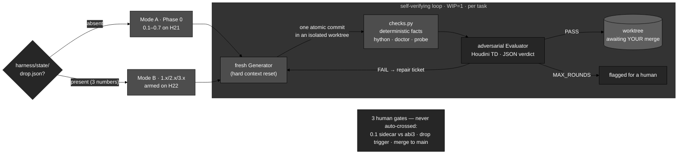
```mermaid
%%{init: {'theme':'base','themeVariables':{'primaryColor':'#4d4d4d','primaryTextColor':'#FFFFFF','primaryBorderColor':'#000000','lineColor':'#000000','textColor':'#FFFFFF','secondaryColor':'#404040','tertiaryColor':'#333333','clusterBkg':'#333333','clusterBorder':'#000000','edgeLabelBackground':'#333333','nodeTextColor':'#FFFFFF'}}}%%
flowchart LR
    DROP{"harness/state/<br/>drop.json?"}:::hot -->|"absent"| AM["Mode A &middot; Phase 0<br/>0.1–0.7 on H21"]:::obs
    DROP -->|"present (3 numbers)"| BM["Mode B &middot; 1.x/2.x/3.x<br/>armed on H22"]:::obs
    AM --> GEN
    BM --> GEN
    subgraph LOOP["self-verifying loop &middot; WIP=1 &middot; per task"]
        GEN["fresh Generator<br/>(hard context reset)"]:::panel -->|"one atomic commit<br/>in an isolated worktree"| CHK["checks.py<br/>deterministic facts<br/>hython &middot; doctor &middot; probe"]:::obs
        CHK --> EVAL["adversarial Evaluator<br/>Houdini TD &middot; JSON verdict"]:::hot
        EVAL -->|"FAIL → repair ticket"| GEN
        EVAL -->|"PASS"| WT[("worktree<br/>awaiting YOUR merge")]:::ok
        EVAL -->|"MAX_ROUNDS"| HUM["flagged for a human"]:::hot
    end
    LOOP ~~~ GATES["3 human gates — never auto-crossed:<br/>0.1 sidecar vs abi3 &middot; drop trigger &middot; merge to main"]:::hot
    classDef panel fill:#4d4d4d,stroke:#000000,color:#FFFFFF
    classDef obs fill:#4d4d4d,stroke:#000000,color:#FFFFFF
    classDef hot fill:#262626,stroke:#000000,color:#FFFFFF
    classDef ok fill:#5e5e5e,stroke:#000000,color:#FFFFFF
```

Standing it up surfaced + fixed real product hygiene under full-suite gating: hardcoded `C:\Users\User\SYNAPSE` fallbacks in the panel bootstraps (plus an off-by-one repo-root derivation the hardcode was masking), a single-sourced `VERSION`, and a staged demo scaffold. The `ui/` → `panel/` consolidation is fully mapped and deferred — the live UI source of truth is already `panel/`.

### Verified capability — what actually cooks (per-context audit)

A *read-the-handlers* audit (the real dispatch path, not the README's own claims) confirms the truth contract holds: across ~95 tools the scaffolds **self-report** (`"cooked": false` + a note) instead of faking success.

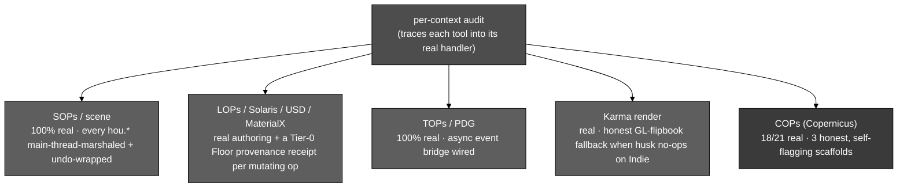
```mermaid
%%{init: {'theme':'base','themeVariables':{'primaryColor':'#4d4d4d','primaryTextColor':'#FFFFFF','primaryBorderColor':'#000000','lineColor':'#000000','textColor':'#FFFFFF','secondaryColor':'#404040','tertiaryColor':'#333333','clusterBkg':'#333333','clusterBorder':'#000000','edgeLabelBackground':'#333333','nodeTextColor':'#FFFFFF'}}}%%
flowchart TB
    A["per-context audit<br/>(traces each tool into its real handler)"]:::obs
    A --> S["SOPs / scene<br/>100% real &middot; every hou.* main-thread-marshaled + undo-wrapped"]:::ok
    A --> U["LOPs / Solaris / USD / MaterialX<br/>real authoring + a Tier-0 Floor provenance receipt per mutating op"]:::ok
    A --> T["TOPs / PDG<br/>100% real &middot; async event bridge wired"]:::ok
    A --> K["Karma render<br/>real &middot; honest GL-flipbook fallback when husk no-ops on Indie"]:::ok
    A --> C["COPs (Copernicus)<br/>18/21 real &middot; 3 honest, self-flagging scaffolds"]:::warn
    classDef obs fill:#4d4d4d,stroke:#000000,color:#FFFFFF
    classDef ok fill:#5e5e5e,stroke:#000000,color:#FFFFFF
    classDef warn fill:#3a3a3a,stroke:#000000,color:#FFFFFF
```

The honest gaps are small and named: 3 COPs generators are placeholders (`reaction_diffusion`, `pixel_sort`, `bake_textures` — they build the graph but don't cook); everything else cooks for real. Provenance receipts fire at the Tier-0 Floor hook on **every** mutating op (the curated `agent.usd` Ledger is the separate, backfilled tier).

### v5.14.0 — Studio-operable: the N-seats milestone

M3 closes the hardening report: the engine was already honest (M1) and pipeline-fluent (M2) — this milestone makes it **operable by people who didn't build it**. The recurring theme is evidence: a frozen session dumps its telemetry before dying, a stale phantom-API gate says so in the panel footer instead of one console line, a doctor reports only checks it actually ran, and the docs that answer a studio's first three questions (what leaves the building? whose key? what breaks on upgrade?) are **CI-pinned against drift** — a new env var, egress site, or renamed artifact fails the suite until the doc catches up.

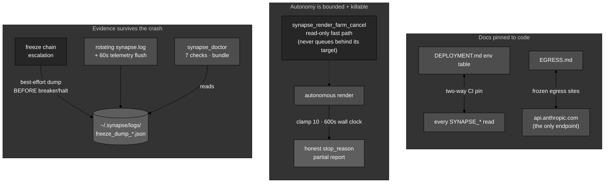
```mermaid
%%{init: {'theme':'base','themeVariables':{'primaryColor':'#4d4d4d','primaryTextColor':'#FFFFFF','primaryBorderColor':'#000000','lineColor':'#000000','textColor':'#FFFFFF','secondaryColor':'#404040','tertiaryColor':'#333333','clusterBkg':'#333333','clusterBorder':'#000000','edgeLabelBackground':'#333333','nodeTextColor':'#FFFFFF'}}}%%
flowchart LR
    subgraph EVID["Evidence survives the crash"]
        BEAT["freeze chain<br/>escalation"]:::hot -->|"best-effort dump<br/>BEFORE breaker/halt"| DUMP[("~/.synapse/logs/<br/>freeze_dump_*.json")]:::ok
        LOG["rotating synapse.log<br/>+ 60s telemetry flush"]:::obs --> DUMP
        DOC["synapse_doctor<br/>7 checks &middot; bundle"]:::obs -->|"reads"| DUMP
    end
    subgraph BOUND["Autonomy is bounded + killable"]
        RUN["autonomous render"]:::panel -->|"clamp 10 &middot; 600s wall clock"| STOP["honest stop_reason<br/>partial report"]:::ok
        KILL["synapse_render_farm_cancel<br/>read-only fast path<br/>(never queues behind its target)"]:::hot -.-> RUN
    end
    subgraph PIN["Docs pinned to code"]
        ENV["DEPLOYMENT.md env table"]:::obs <-->|"two-way CI pin"| SRC["every SYNAPSE_* read"]:::panel
        EGR["EGRESS.md"]:::obs <-->|"frozen egress sites"| API["api.anthropic.com<br/>(the only endpoint)"]:::panel
    end
    EVID ~~~ BOUND
    BOUND ~~~ PIN
    classDef panel fill:#4d4d4d,stroke:#000000,color:#FFFFFF
    classDef obs fill:#4d4d4d,stroke:#000000,color:#FFFFFF
    classDef hot fill:#262626,stroke:#000000,color:#FFFFFF
    classDef ok fill:#5e5e5e,stroke:#000000,color:#FFFFFF
```

Two findings came back sharper than the report wrote them: the kill-switch gap wasn't just missing retention — a naively-registered cancel would have **deadlocked behind the C5 mutation lock** the running render holds for its entire sequence (the cancel rides the read-only fast path for exactly that reason); and seat B on shared storage doesn't see an error — it sees **silent amnesia** (empty recalls, refused saves), which is why the doctor's key-fingerprint check and the show-scoped `SYNAPSE_ENCRYPTION_KEY` provisioning docs exist. The full hardening run: **suite 3,415 → 3,612**, every wave full-suite-gated, ledger in `docs/HARDENING_RUN_2026-06-10.md`. (SEC-1/RBAC remains the explicit gate before any non-local deploy mode — a decision recorded, not work skipped.)

### v5.13.0 — Production hardening: the truth contract + pipeline citizenship

A VFX-production hardening review (`docs/SYNAPSE_VFX_PRODUCTION_HARDENING_2026-06-09.md`) named the worst failure class for an agent-driven system: **confident fiction** — a tool reporting success for work it did not do, could not do, or could not know it did, which the LLM then consumes as ground truth and compounds. Twelve fictions were catalogued; two milestones killed them under reproduce-before-fix discipline (read-only verification fleets → file-disjoint implementation waves, every wave full-suite-gated) — suite 3,415 → 3,567, ledger in `docs/HARDENING_RUN_2026-06-10.md`.

**M1 — stop the fictions:** recipe execution is propose-or-execute (never "Executed" over an untouched scene); the autonomy contract is pinned end-to-end against the live registry (the flagship unattended tool used to die at step 1 *and* evaluate every good render as failed); the compose tier self-marshals + owns its undo groups; `houdini_render` restores the artist's output-path tokens byte-identically; COPs scaffolds say `scaffolded`; the scheduler fails loudly on farm types it can't configure; APEX recipes shed 17 phantom node types for the introspected-catalog names. **M2 — pipeline citizen:** cook-and-verify with stage readback in the last uncooked USD mutators; one `_safe_node_name()`/`_expand_frame_tokens()` for derived names and frame tokens; the flipbook fallback writes a `_glpreview` sidecar, never the beauty path; the render farm restores the artist's settings baseline after every batch; plus the path/color/show-config/display work in the table above.

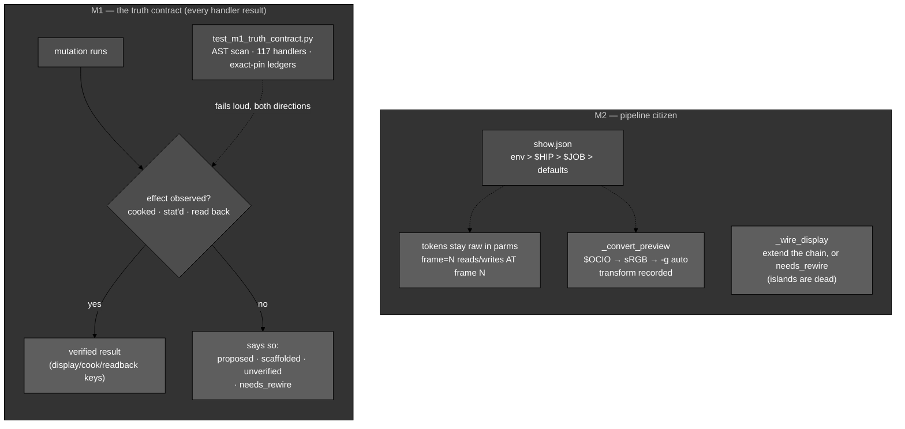
```mermaid
%%{init: {'theme':'base','themeVariables':{'primaryColor':'#4d4d4d','primaryTextColor':'#FFFFFF','primaryBorderColor':'#000000','lineColor':'#000000','textColor':'#FFFFFF','secondaryColor':'#404040','tertiaryColor':'#333333','clusterBkg':'#333333','clusterBorder':'#000000','edgeLabelBackground':'#333333','nodeTextColor':'#FFFFFF'}}}%%
flowchart LR
    subgraph M1["M1 — the truth contract (every handler result)"]
        OP["mutation runs"]:::panel --> VER{"effect observed?<br/>cooked &middot; stat'd &middot; read back"}:::obs
        VER -->|yes| OK["verified result<br/>(display/cook/readback keys)"]:::ok
        VER -->|no| HON["says so:<br/>proposed &middot; scaffolded &middot; unverified<br/>&middot; needs_rewire"]:::ok
        PIN["test_m1_truth_contract.py<br/>AST scan &middot; 117 handlers &middot; exact-pin ledgers"]:::obs -.->|"fails loud, both directions"| VER
    end
    subgraph M2["M2 — pipeline citizen"]
        SHOW["show.json<br/>env &gt; $HIP &gt; $JOB &gt; defaults"]:::obs
        PATHS["tokens stay raw in parms<br/>frame=N reads/writes AT frame N"]:::ok
        COLOR["_convert_preview<br/>$OCIO &rarr; sRGB &rarr; -g auto<br/>transform recorded"]:::ok
        DISP["_wire_display<br/>extend the chain, or needs_rewire<br/>(islands are dead)"]:::ok
        SHOW -.-> PATHS
        SHOW -.-> COLOR
    end
    M1 ~~~ M2
    classDef panel fill:#4d4d4d,stroke:#000000,color:#FFFFFF
    classDef obs fill:#4d4d4d,stroke:#000000,color:#FFFFFF
    classDef ok fill:#5e5e5e,stroke:#000000,color:#FFFFFF
```

The discipline matched the subject: a system being cured of unverified claims shouldn't be hardened on unverified claims. Every [F]-tagged finding was **reproduced before it was fixed** (three were *worse* than reported, one was partially refuted and re-scoped), every fix landed with its pin, and the conformance test enforces the contract on every future handler. Live-verification residuals (per-frame `productName` under husk, display-chain behavior on a real stage) are explicitly ledgered for the next bridge session — recorded as owed, not assumed.

### v5.12.0 — CTO remediation: durability, lifecycle honesty, freeze safety

A two-day adversarial CTO review (8 reviewers → per-finding verification → `docs/SYNAPSE_CTO_REVIEW_2026-06-09.md`) fed a remediation harness that landed **9 prioritized fixes + the freeze-chain wiring** under reproduce→fix→reproduce-clean discipline — suite 3,377 → 3,415, green at every commit, every verdict in the Ledger.

The headline was **memory durability**: the live store is Fernet-encrypted under one key file, loaded with skip-on-failure, and was rewritten by a truncating save — so one stale key env-var would silently and permanently destroy months of accreted memory on the next write. That chain is dead (degraded-load guard → atomic backed-up saves → key escrow + fingerprint). The rest of the slice: zombie mutations (timed-out main-thread payloads executing *after* the client was told to retry) are abandoned; two concurrent clients can no longer interleave mutation sequences on the shared undo stack; PDG cook failures report real errors instead of a `NameError`; the panel's Stop and timeout messages stopped lying; and the `~2 s` dispatch floor finally has a measurement instrument (`synapse_dispatch_wait_ms`) instead of folklore.

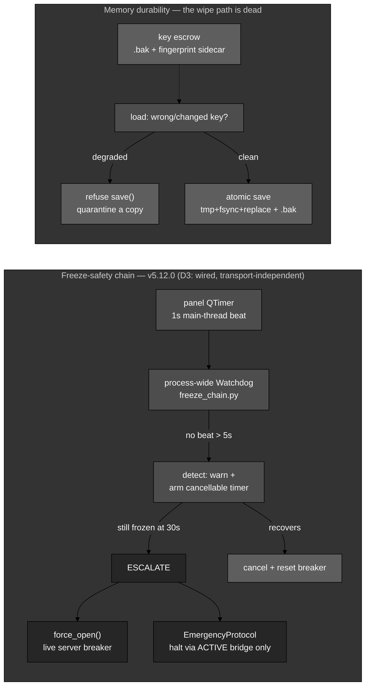
```mermaid
%%{init: {'theme':'base','themeVariables':{'primaryColor':'#4d4d4d','primaryTextColor':'#FFFFFF','primaryBorderColor':'#000000','lineColor':'#000000','textColor':'#FFFFFF','secondaryColor':'#404040','tertiaryColor':'#333333','clusterBkg':'#333333','clusterBorder':'#000000','edgeLabelBackground':'#333333','nodeTextColor':'#FFFFFF'}}}%%
flowchart LR
    subgraph FREEZE["Freeze-safety chain — v5.12.0 (D3: wired, transport-independent)"]
        BEAT["panel QTimer<br/>1s main-thread beat"]:::panel --> WD["process-wide Watchdog<br/>freeze_chain.py"]:::obs
        WD -->|"no beat > 5s"| WARN["detect: warn +<br/>arm cancellable timer"]:::obs
        WARN -->|"still frozen at 30s"| ACT["ESCALATE"]:::hot
        WARN -->|"recovers"| RESET["cancel + reset breaker"]:::ok
        ACT --> CB["force_open()<br/>live server breaker"]:::hot
        ACT --> EH["EmergencyProtocol<br/>halt via ACTIVE bridge only"]:::hot
    end
    subgraph MEM["Memory durability — the wipe path is dead"]
        LOAD["load: wrong/changed key?"]:::obs -->|"degraded"| REFUSE["refuse save()<br/>quarantine a copy"]:::ok
        LOAD -->|clean| SAVE["atomic save<br/>tmp+fsync+replace + .bak"]:::ok
        KEY["key escrow<br/>.bak + fingerprint sidecar"]:::ok -.-> LOAD
    end
    classDef panel fill:#4d4d4d,stroke:#000000,color:#FFFFFF
    classDef obs fill:#4d4d4d,stroke:#000000,color:#FFFFFF
    classDef hot fill:#262626,stroke:#000000,color:#FFFFFF
    classDef ok fill:#5e5e5e,stroke:#000000,color:#FFFFFF
```

The wiring is **topology-true, not theater**: the live transport (hwebserver) has no resilience layer and the fallback WS server is built with resilience off — so a literal "panel calls `server.heartbeat()`" would have armed nothing. The chain owns its own process-wide watchdog, opens the breaker *when a resilient server exists* (and says so honestly when one doesn't), and the halt only ever fires through an **already-active** bridge — escalation never constructs one.

### v5.11.0 — Two-tier provenance: the Floor hook + the agent.usd Ledger

Every action SYNAPSE takes is now recorded, on two tiers, on the path that actually runs. **Tier-0** is the **Floor hook**: a single `FloorGate` that every command-handler invocation routes through (`CommandHandlerRegistry.invoke()` across all three live sites — direct `handle`, batch sub-ops, and the autonomy adapter), writing one durable, atomic provenance record per *mutating* op (read-only ops are skipped) to `.synapse/provenance/` under a bounded FIFO cap. **Tier-1** is the **agent.usd Ledger**: the curated verdicts that used to live only in markdown now have a canonical home — one immutable `<kind>_<ts>_<sha8>.json` per record (the source of truth) composed into an `agent.usd` `/SYNAPSE/agent/ledger/` read-projection. The markdown Ledger backfills **losslessly** — a source-vs-parse oracle is mutation-pinned: drop the field catch-all and 33 tokens vanish, failing the test.

This is **audit, not admission control** — Tier-0 records what happened; it never gates. (The bridge's consent / `IntegrityBlock` layer is the `/mcp` audit path; finding §0.8 established it is *not* on the live `/synapse` transport — so the docs no longer claim it is.) Two adjacent landings shipped alongside: an **autonomous-worker tool allowlist** (the panel worker can no longer reach `execute_python` / `execute_vex` / destructive tools by default — fail-closed, env opt-out) and **autonomy task provenance** (`autonomous_render` now feeds the already-live `suspend_all_tasks` consumer, closing a real producer→consumer loop).

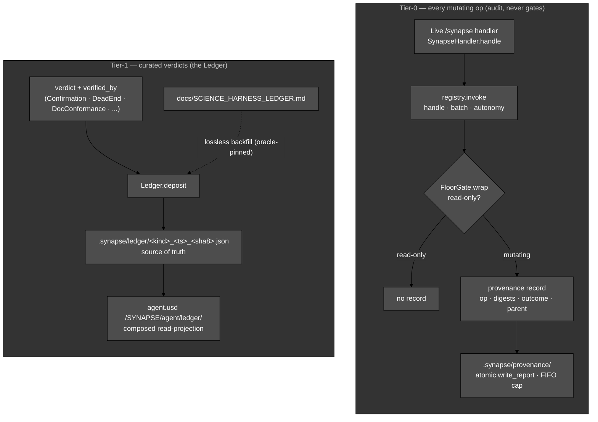
```mermaid
%%{init: {'theme':'base','themeVariables':{'primaryColor':'#4d4d4d','primaryTextColor':'#FFFFFF','primaryBorderColor':'#000000','lineColor':'#000000','textColor':'#FFFFFF','secondaryColor':'#404040','tertiaryColor':'#333333','clusterBkg':'#333333','clusterBorder':'#000000','edgeLabelBackground':'#333333','nodeTextColor':'#FFFFFF'}}}%%
flowchart TB
    subgraph T0 ["Tier-0 &mdash; every mutating op (audit, never gates)"]
        direction TB
        WS["Live /synapse handler<br/>SynapseHandler.handle"] --> INV["registry.invoke<br/>handle · batch · autonomy"]
        INV --> GATE{"FloorGate.wrap<br/>read-only?"}
        GATE -- "read-only" --> SKIP["no record"]
        GATE -- "mutating" --> REC["provenance record<br/>op · digests · outcome · parent"]
        REC --> PDIR[".synapse/provenance/<br/>atomic write_report · FIFO cap"]
    end
    subgraph T1 ["Tier-1 &mdash; curated verdicts (the Ledger)"]
        direction TB
        VERD["verdict + verified_by<br/>(Confirmation · DeadEnd · DocConformance · ...)"] --> DEP["Ledger.deposit"]
        DEP --> FILES[".synapse/ledger/&lt;kind&gt;_&lt;ts&gt;_&lt;sha8&gt;.json<br/>source of truth"]
        FILES --> LUSD["agent.usd /SYNAPSE/agent/ledger/<br/>composed read-projection"]
        MD["docs/SCIENCE_HARNESS_LEDGER.md"] -. "lossless backfill (oracle-pinned)" .-> DEP
    end
```

**Honest by construction.** A 5-agent liveness recon checked every proposed emit point *before* wiring — and found 3 of the 5 dormant `agent.usd` writers had no live producer (the MOE router runs only in tests, agent handoffs don't exist on the live path, and the bridge's `IntegrityBlock` self-asserts its anchors). Those stay **deferred**, recorded in the RFC, rather than wired to dormant code to manufacture the *appearance* of activation.

### Self-healing bridge — verified end-to-end

The MCP/WS bridge had a recurring failure: a stale Houdini holding `:9999` with a dead server left the live session's WS server failing over to a port the clients couldn't find. The server *already* tracked its real bound port (`_actual_port`); the gap was that every client was hardcoded to 9999. The fix makes the port **discoverable** — on bind, the server atomically publishes `{host, port, pid, ts}` to a home-anchored sidecar (`~/.synapse/bridge.json`, `$SYNAPSE_BRIDGE_FILE` override); every client resolves *that*, freshest-writer-wins, with a hard fallback to `9999` / `$SYNAPSE_PORT` so a no-sidecar environment behaves byte-for-byte as before. A stale-port collision can never silently strand the bridge again.

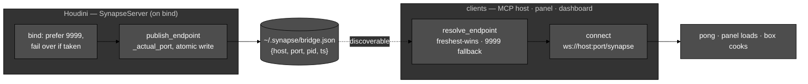
```mermaid
%%{init: {'theme':'base','themeVariables':{'primaryColor':'#4d4d4d','primaryTextColor':'#FFFFFF','primaryBorderColor':'#000000','lineColor':'#000000','textColor':'#FFFFFF','secondaryColor':'#404040','tertiaryColor':'#333333','clusterBkg':'#333333','clusterBorder':'#000000','edgeLabelBackground':'#333333','nodeTextColor':'#FFFFFF'}}}%%
flowchart LR
    subgraph SRV ["Houdini &mdash; SynapseServer (on bind)"]
        direction TB
        BIND["bind: prefer 9999,<br/>fail over if taken"] --> PUB["publish_endpoint<br/>_actual_port, atomic write"]
    end
    PUB --> SIDE[("~/.synapse/bridge.json<br/>{host, port, pid, ts}")]
    subgraph CLI ["clients &mdash; MCP host · panel · dashboard"]
        direction TB
        RES["resolve_endpoint<br/>freshest-wins · 9999 fallback"] --> CONN["connect<br/>ws://host:port/synapse"]
    end
    SIDE -. "discoverable" .-> RES
    CONN --> OK["pong · panel loads · box cooks"]
```

**Proven live (2026-06-07).** End-to-end through the running bridge: `synapse_ping` → `{"pong":true}`; the panel built in-process (real `SynapsePanel`, all three faces `Direct · Work · Review`, v5.11.0); and a box created *via the bridge* cooked to **8 points / 6 faces / 1×1×1** — with the Floor hook's provenance record landing for each mutation (`create_node … origin=handler, outcome=ok`). The whole stack, confirmed in one live scene.

### v5.9.0 — SCOUT → FORGE: 7 verified capabilities

A read-only **SCOUT** recon cross-referenced the Houdini 21.0.671 capability surface against the live tool registry, surfaced 7 opportunities, and **V1-verified every one against the exact target build** (21.0.671 `hython`) before any code was written. A **FORGE** MOE agent team then built and unit-tested them, with **CRUCIBLE** adversarial review gating the merge. Registry **104 → 108 tools**:

- `houdini_set_payload_loadstate` — USD payload load/unload + activation
- `houdini_create_point_instancer` — `UsdGeom.PointInstancer` authoring
- `houdini_shot_render_ready` — shot-template composite orchestrator
- `cops_create_copnet` — modern Copernicus `copnet` (distinct from the legacy `cop2net` the existing COPs tools build on)
- `houdini_reference_usd` + `karma_visible`/`purpose`/`kind` — non-clobbering Karma-visibility metadata on import (completes the BL-008 advisory-only partial)
- `houdini_modify_usd_prim` + `instanceable`
- branch-aware, path-keyed upstream Karma-LOP discovery in the render walk

Plus bridge/panel hardening: read-only tool failures surface as JSON-RPC errors instead of success-with-`isError`, and the panel resolves the Anthropic key through the canonical auth layer with an actionable "set it + relaunch" message.

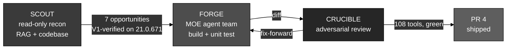
```mermaid
%%{init: {'theme':'base','themeVariables':{'primaryColor':'#4d4d4d','primaryTextColor':'#FFFFFF','primaryBorderColor':'#000000','lineColor':'#000000','textColor':'#FFFFFF','secondaryColor':'#404040','tertiaryColor':'#333333','clusterBkg':'#333333','clusterBorder':'#000000','edgeLabelBackground':'#333333','nodeTextColor':'#FFFFFF'}}}%%
flowchart LR
    S["SCOUT<br/>read-only recon<br/>RAG + codebase"] -->|7 opportunities<br/>V1-verified on 21.0.671| F["FORGE<br/>MOE agent team<br/>build + unit test"]
    F -->|diff| R["CRUCIBLE<br/>adversarial review"]
    R -->|fix-forward| F
    R -->|108 tools, green| P["PR 4<br/>shipped"]
    classDef scout fill:#3a3a3a,stroke:#000000,color:#FFFFFF
    classDef forge fill:#4d4d4d,stroke:#000000,color:#FFFFFF
    classDef cruc fill:#262626,stroke:#000000,color:#FFFFFF
    classDef gate fill:#5e5e5e,stroke:#000000,color:#FFFFFF
    class S scout
    class F forge
    class R cruc
    class P gate
```

Behavioral verification (Karma cook of `copnet`, EXR landing, USD editableStage round-trips) is deferred to a live 21.0.671 session.

### Solaris Compose Tier — 3 write/compose tools (PR #6)

The write/compose counterpart to the read-side inspector. Three MCP tools, every operation undo-wrapped + main-thread-safe, all `dir()`-confirmed-live on 21.0.671. Registry **108 → 111**:

- `synapse_solaris_shotsetup_karma_xpu` — builds a render-strongest department `sublayer` stack + camera + Karma `engine=xpu` render settings, with `synapse:*` provenance and an authored output path.
- `synapse_matlib_bind` — binds a MaterialX material to a prim set via `assignmaterial`, then verifies each binding with `ComputeBoundMaterial` and reports unmatched/unbound prims.
- `synapse_assess_render_ready` — read-only render-readiness report (rendersettings, camera, composition errors, materials bound, output path, AOVs, XPU compatibility), naming the offending prim per failed clause.

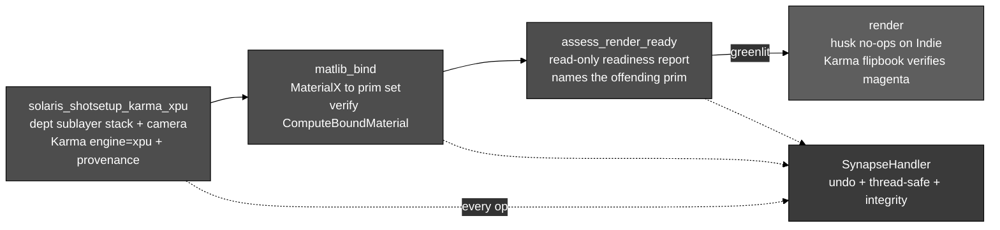
```mermaid
%%{init: {'theme':'base','themeVariables':{'primaryColor':'#4d4d4d','primaryTextColor':'#FFFFFF','primaryBorderColor':'#000000','lineColor':'#000000','textColor':'#FFFFFF','secondaryColor':'#404040','tertiaryColor':'#333333','clusterBkg':'#333333','clusterBorder':'#000000','edgeLabelBackground':'#333333','nodeTextColor':'#FFFFFF'}}}%%
flowchart LR
    SS["solaris_shotsetup_karma_xpu<br/>dept sublayer stack + camera<br/>Karma engine=xpu + provenance"]:::tool
    MB["matlib_bind<br/>MaterialX to prim set<br/>verify ComputeBoundMaterial"]:::tool
    AR["assess_render_ready<br/>read-only readiness report<br/>names the offending prim"]:::tool
    RENDER["render<br/>husk no-ops on Indie<br/>Karma flipbook verifies magenta"]:::gate
    BRIDGE["SynapseHandler<br/>undo + thread-safe + integrity"]:::bridge
    SS --> MB
    MB --> AR
    AR -->|greenlit| RENDER
    SS -.->|every op| BRIDGE
    MB -.-> BRIDGE
    AR -.-> BRIDGE
    classDef tool fill:#4d4d4d,stroke:#000000,color:#FFFFFF
    classDef gate fill:#5e5e5e,stroke:#000000,color:#FFFFFF
    classDef bridge fill:#3a3a3a,stroke:#000000,color:#FFFFFF
```

Five real bugs the SCOUT→FORGE discipline caught (the `usdrender` phantom, `sublayer` strongest-first ordering, `editableStage()`-outside-cook, the `productName` parm not authoring the prim, and an MRO name collision), plus the **BL-007 / BL-008 [REAL] close** — an end-to-end render confirm surfaced that **husk silently no-ops on Houdini Indie**, so the gold-standard EXR is license-blocked and the bound emissive material was verified via a Karma-interactive flipbook (magenta, not gray) instead. 49 standalone tests; see `forge/backlog/human_review.json` (BL-012…BL-017) and `scripts/verify_compose_render.py`.

---

### Memory substrate — Moneta vector engine (PR #14)

The inside-out thesis applied to memory. SYNAPSE's scene/decision memory carried two unreconciled stores (a JSONL entry store and a markdown scene-memory file), a metrics gauge wired to a dead accessor, and empty session stubs — a divergence *class*, not a bug list. **Moneta** — a vector-native memory engine (`deposit` / `query` / `signal_attention` / consolidation, with time-decay and durability) — is introduced behind the unchanged `MemoryStore` interface so that divergence becomes **structurally impossible**: there is one store, and `count()` reads the engine's live entity count.

It ships **shadow-first and flag-gated, default-off** (`SYNAPSE_MEMORY_BACKEND` = `jsonl` | `moneta` | `shadow`). Each SYNAPSE `Memory` is serialized whole into a Moneta deposit payload (byte-for-byte round-trip); a deterministic, dependency-free `HashEmbedder` (PYTHONHASHSEED-independent, swappable for a semantic model later) embeds the content; decision / show-tier / gate-source memories map to a `protected_floor` so pinned memories resist decay. Keyword search is **bit-identical** to the JSONL store (parity-by-construction); the shadow path dual-writes and diffs reads into a `ParityReport`, so cutover is justified by evidence, not hope.

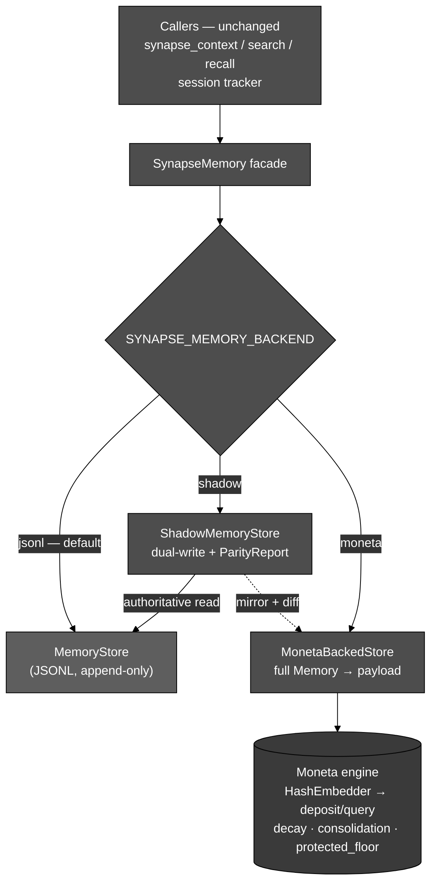
```mermaid
%%{init: {'theme':'base','themeVariables':{'primaryColor':'#4d4d4d','primaryTextColor':'#FFFFFF','primaryBorderColor':'#000000','lineColor':'#000000','textColor':'#FFFFFF','secondaryColor':'#404040','tertiaryColor':'#333333','clusterBkg':'#333333','clusterBorder':'#000000','edgeLabelBackground':'#333333','nodeTextColor':'#FFFFFF'}}}%%
flowchart TB
    C["Callers &mdash; unchanged<br/>synapse_context / search / recall<br/>session tracker"] --> SM["SynapseMemory facade"]
    SM --> SEL{"SYNAPSE_MEMORY_BACKEND"}
    SEL -->|"jsonl &mdash; default"| JS["MemoryStore<br/>(JSONL, append-only)"]:::def
    SEL -->|shadow| SH["ShadowMemoryStore<br/>dual-write + ParityReport"]:::alt
    SEL -->|moneta| MB["MonetaBackedStore<br/>full Memory &rarr; payload"]:::alt
    SH -->|"authoritative read"| JS
    SH -.->|"mirror + diff"| MB
    MB --> ENG[("Moneta engine<br/>HashEmbedder &rarr; deposit/query<br/>decay &middot; consolidation &middot; protected_floor")]:::eng
    classDef def fill:#5e5e5e,stroke:#000000,color:#FFFFFF
    classDef alt fill:#4d4d4d,stroke:#000000,color:#FFFFFF
    classDef eng fill:#3a3a3a,stroke:#000000,color:#FFFFFF
```

A four-agent **CRUCIBLE** fan-out attacked the backend and found two real defects — a protected-quota silent demotion and a corrupt-snapshot startup-killer — both fixed and pinned. A second ARCHITECT→FORGE→CRUCIBLE pass then closed the **FC4 single-writer gap by construction**: a serialization `RLock` makes the adapter thread-safe (the engine's swap-and-pop index can no longer be corrupted by concurrent deposit/iterate/prune), and because the adapter makes zero `hou.*` calls the lock is never held across the main-thread hop — so it can't deadlock the async server. Proven standalone by a concurrency stress suite; the destructive `run_sleep_pass` is now auditable (returns/logs exactly what it pruned). The production default-on flip is still staged (flag stays `jsonl`), but no longer blocked on live thread-safety verification. Full acceptance/falsifier status and the cutover procedure live in [`docs/MONETA_SYNAPSE_SHIP_REPORT.md`](docs/MONETA_SYNAPSE_SHIP_REPORT.md).

The memory store's bespoke `python/synapse/memory/evolution.py` (the charmander→charizard USD evolution) is superseded by Moneta's consolidation — it stays **dormant** under the `moneta` backend (pinned by `test_moneta_backend_never_fires_evolution`) and still fires under the default `jsonl`; physical removal is deferred to the cutover. (Distinct from `shared/evolution.py`, the MOE-orchestrator subsystem, which is unchanged.)

> **On the name "Moneta":** the vector-memory engine wired in here ([repo](https://github.com/JosephOIbrahim/Moneta)) is a Python library; it is a *distinct project* from the similarly-named "Moneta (Nuke)" entry in the Portfolio thesis above (a planned DCC host). They historically share a working name but are not the same codebase.

---

### Sprint 3 progress — Mile 4 of 6 closed (Mile 5 prestaged)

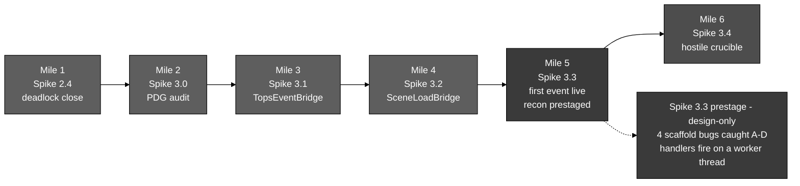
```mermaid
%%{init: {'theme':'base','themeVariables':{'primaryColor':'#4d4d4d','primaryTextColor':'#FFFFFF','primaryBorderColor':'#000000','lineColor':'#000000','textColor':'#FFFFFF','secondaryColor':'#404040','tertiaryColor':'#333333','clusterBkg':'#333333','clusterBorder':'#000000','edgeLabelBackground':'#333333','nodeTextColor':'#FFFFFF'}}}%%
flowchart LR
    M1["Mile 1<br/>Spike 2.4<br/>deadlock close"]:::closed
    M2["Mile 2<br/>Spike 3.0<br/>PDG audit"]:::closed
    M3["Mile 3<br/>Spike 3.1<br/>TopsEventBridge"]:::closed
    M4["Mile 4<br/>Spike 3.2<br/>SceneLoadBridge"]:::closed
    M5["Mile 5<br/>Spike 3.3<br/>first event live<br/>recon prestaged"]:::prestaged
    M6["Mile 6<br/>Spike 3.4<br/>hostile crucible"]:::ahead
    M1 --> M2 --> M3 --> M4 --> M5 --> M6
    P["Spike 3.3 prestage - design-only<br/>4 scaffold bugs caught A-D<br/>handlers fire on a worker thread"]:::recon
    M5 -.-> P
    classDef closed fill:#5e5e5e,stroke:#000000,color:#FFFFFF
    classDef ahead fill:#4d4d4d,stroke:#000000,color:#FFFFFF
    classDef prestaged fill:#3a3a3a,stroke:#000000,color:#FFFFFF
    classDef recon fill:#3a3a3a,stroke:#000000,color:#FFFFFF
```

**Mile 1 — Spike 2.4 deadlock closure.** The live Crucible baseline at end of Sprint 3 Day 1 surfaced a deadlock at the daemon ↔ main-thread boundary: synchronous `submit_turn` parked Houdini's main thread on a result queue while the daemon thread's `hdefereval` dispatch waited for that same main thread to pump Qt events. Spike 2.4 closes it by changing `submit_turn` to return immediately with a `TurnHandle` — a `threading.Event`-backed Future analog. The caller decides when (and on which thread) to wait. Main thread stays free to pump Qt events; daemon thread keeps the agent loop; `hdefereval` lambdas execute because main is responsive.

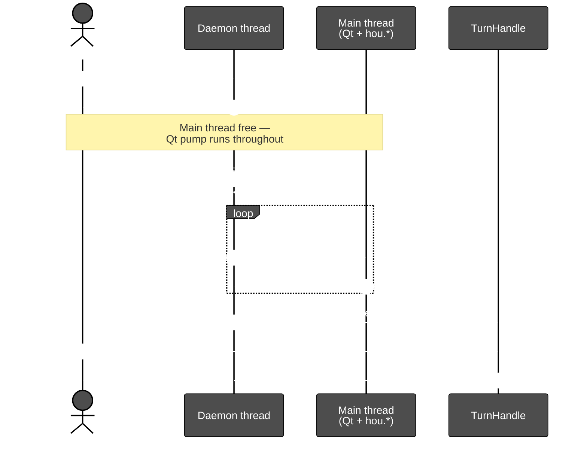
```mermaid
%%{init: {'theme':'base','themeVariables':{'primaryColor':'#4d4d4d','primaryTextColor':'#FFFFFF','primaryBorderColor':'#000000','lineColor':'#000000','textColor':'#FFFFFF','secondaryColor':'#404040','tertiaryColor':'#333333','clusterBkg':'#333333','clusterBorder':'#000000','edgeLabelBackground':'#333333','nodeTextColor':'#FFFFFF'}}}%%
sequenceDiagram
    autonumber
    actor Caller
    participant Daemon as Daemon thread
    participant Main as Main thread<br/>(Qt + hou.*)
    participant H as TurnHandle

    Caller->>Daemon: submit_turn(prompt)
    Daemon-->>Caller: TurnHandle (immediate)
    Note over Caller,Main: Main thread free —<br/>Qt pump runs throughout

    Daemon->>Daemon: run_turn (agent loop)
    loop tool calls
        Daemon->>Main: hdefereval lambda
        Main-->>Daemon: tool result
    end
    Daemon->>H: _set_result(AgentTurnResult)

    Caller->>H: done() / wait() / result()
    H-->>Caller: AgentTurnResult
```

**Mile 2 — Spike 3.0 PDG API audit.** The `pdg` module surface in Houdini 21.0.671 has known divergences from prior versions and from external-LLM training data. Mile 2 ran `dir()` introspection against live Houdini, captured the empirical surface in `docs/sprint3/spike_3_0_pdg_api_audit.md`, and refuted six wrong references in the early sketch — every `hou.pdg.*` path missing, `hou.hipFile.addEventCallback` returning `None` (not a removable handle), `pdg.PyEventCallback` being the wrong name. Each of those would have crashed first contact with Houdini if Spike 3.1 had coded against the sketch verbatim.

**Mile 3 — Spike 3.1 `TopsEventBridge` (Phase A).** In-process PDG event bridge. `warm(top_node)` registers a `pdg.PyEventHandler` against the TOP network's live `pdg.GraphContext` (acquired via `top_node.getPDGGraphContext()`, never class-instantiated — that's for fresh graphs). Surfaces 7 audit-verified event types: `CookStart`, `CookComplete`, `CookError`, `CookWarning`, `WorkItemAdd`, `WorkItemStateChange`, `WorkItemResult`. Threading defensive: handler reads `pdg.*` properties only, no `hou.*` calls inside. 47 tests across basic happy paths and an 8-case hostile suite (handler leak, double-bridge independence, callback-raising-mid-event, topnet-deleted-mid-subscription, multi-event-type-no-loss).

**Mile 4 — Spike 3.2 `SceneLoadBridge` (Phase B).** Auto-warm wire from `hou.hipFile.AfterLoad` to `TopsEventBridge`. Composes (not inherits) — constructor takes a `TopsEventBridge` instance and orchestrates its `cool_all` / `warm_all` cycle on each scene load. Mile 4's empirical scene-load audit (`docs/sprint3/spike_3_2_scene_load_audit.md`) captured all four hipFile events firing on `MainThread`, so the AfterLoad handler is a direct synchronous call — no `hdefereval`. 24 tests across basic happy paths and a 10-case hostile suite. One fix-forward cycle during CRUCIBLE: case 6 (unsubscribe-during-handler) surfaced a real defect — `warm_all` kept iterating after `unsubscribe` returned, leaving stale subs. Reconcile step added at end of `_on_after_load`: if `_subscribed` flipped to `False` mid-handler, run `cool_all` again. The hostile test pinned the contract; the fix held it.

**Mile 5 (prestage) — Spike 3.3 `dir()` recon.** Before any build, a design-only prestage ran the dir()-over-docs discipline against live 21.0.671 and produced `docs/sprint3/spike_3_3_recon.md` — a 13-agent synthesis workflow + adversarial completeness review, then one operator-authorized scratch cook to resolve the single unknowable-from-`dir()` crux. It **resolved the thread-of-delivery question**: PDG event handlers fire on a **worker thread** (the exact opposite of `hou.hipFile`, which fires on main), so the perception handler must be `pdg.*`-only + non-blocking-enqueue or it reintroduces the Spike 2.4 deadlock. And it **caught four bugs in the already-scaffolded bridges** before they could reach a live cook: **A** — `event.workItem` is phantom, so payload is silently empty; **B** — there is no `WorkItemComplete` enum, so `workitem.complete` must be derived from `WorkItemStateChange` + `currentState == CookedSuccess` (and a *static* generator emits neither — the gate demo needs a real processor); **C** — `pdg.Node` has `.name`, not `.path()`; **D** — `pdg.PyEventHandler(callback)` has no constructor, so the scaffold's handler factory hard-crashes on the first `warm()` (the correct API is a raw callable passed to `addEventHandler`, which returns the wrapper). Zero production code was touched; build starts at M1.

**Workflow — the three-role pattern.** Phase A and Phase B both ran the same MOE shape internally:


```mermaid
%%{init: {'theme':'base','themeVariables':{'primaryColor':'#4d4d4d','primaryTextColor':'#FFFFFF','primaryBorderColor':'#000000','lineColor':'#000000','textColor':'#FFFFFF','secondaryColor':'#404040','tertiaryColor':'#333333','clusterBkg':'#333333','clusterBorder':'#000000','edgeLabelBackground':'#333333','nodeTextColor':'#FFFFFF'}}}%%
flowchart LR
    A["ARCHITECT<br/>design only<br/>(spec contract)"] -->|design.md| F["FORGE<br/>implementation +<br/>basic tests"]
    F -->|system under test| C["CRUCIBLE<br/>hostile suite<br/>(adversarial posture)"]
    C -->|fix-forward| F
    C -->|all green| G["Phase Gate"]
    classDef arch fill:#3a3a3a,stroke:#000000,color:#FFFFFF
    classDef forge fill:#4d4d4d,stroke:#000000,color:#FFFFFF
    classDef cruc fill:#262626,stroke:#000000,color:#FFFFFF
    classDef gate fill:#5e5e5e,stroke:#000000,color:#FFFFFF
    class A arch
    class F forge
    class C cruc
    class G gate
```

ARCHITECT writes the design doc and never the code. FORGE implements against the spec and writes basic happy-path tests. CRUCIBLE writes hostile tests and never the implementation; when a hostile test surfaces a real defect, FORGE fixes the implementation rather than CRUCIBLE weakening the test (Commandment 7). Each role's authority is constitutionally restricted; phase boundaries gate the merge.

### Sprint 3 — load-bearing commits

```
87c4db9  Spike 3.2    SceneLoadBridge hostile suite (CRUCIBLE) + fix-forward
4cba649  Spike 3.2    SceneLoadBridge scaffold (FORGE)
ef7d5ae  Spike 3.2    SceneLoadBridge design (ARCHITECT)
9e4cc42  Spike 3.2    scene-load audit findings landed (Mile 4 audit)
a476386  Spike 3.2    scene-load API audit infrastructure
2f46590  CI repair    bump checkout/setup-python (Node.js 20 deprecation)
fcd1077  CI repair    gate test_live_capture body behind __main__
bb2713b  Spike 3.1    TopsEventBridge hostile suite (CRUCIBLE)
89da296  Spike 3.1    TopsEventBridge scaffold (FORGE)
2aa03d9  Spike 3.1    TopsEventBridge design (ARCHITECT)
07946dc  Spike 3.0    PDG API audit findings (Mile 2 audit)
6bf2f07  Spike 3.0    PDG API audit infrastructure
b1d3163  Spike 2.4    close daemon↔main-thread deadlock via TurnHandle
6e08dae  Spike 2.4    add TurnHandle (Future-shaped result envelope)
```

Sprint 2 Week 1 (`5e6fc0c`) shipped the first tool (`synapse_inspect_stage`) end-to-end through the still-outside-in WebSocket path. Sprint 3 built the inside-out substrate alongside it — one spike at a time, with an audit-first discipline (live `dir()` introspection in Houdini 21.0.671 before any code lands) and a human-in-the-loop Crucible protocol (`docs/crucible_protocol.md`) for the parts bash cannot drive. Tagged at `v5.5.0` (`4faaa3a`).

### Sprint 3 — what's next

```
Spike 3.3    First TOPS event surface live              [Mile 5 — needs GUI]
             workitem.complete → agent perception
             real .hip + real TOP cook through the bridge
Spike 3.4    Hostile TOPS Crucible                      [Mile 6]
             event flood, malformed events, cancellation
```

Mile 5 is the first time a real `pdg.Event` reaches the agent's perception layer through the two-bridge wiring in graphical Houdini. End-to-end timing target: under 50ms from `cookComplete` to `perception_callback` invocation (in-process should be sub-ms; budget is for safety margin). Mile 6 turns the heat up — event flood (10K events / 1s), malformed events (missing fields surface as typed parse errors), cancellation mid-cook with no orphaned callbacks.

Mile 5 cannot run from bash. It needs Joe at the GUI driving a real cook against the scaffolded bridges.

---
