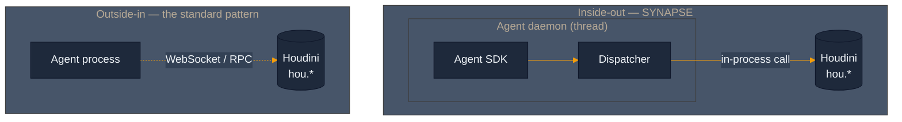
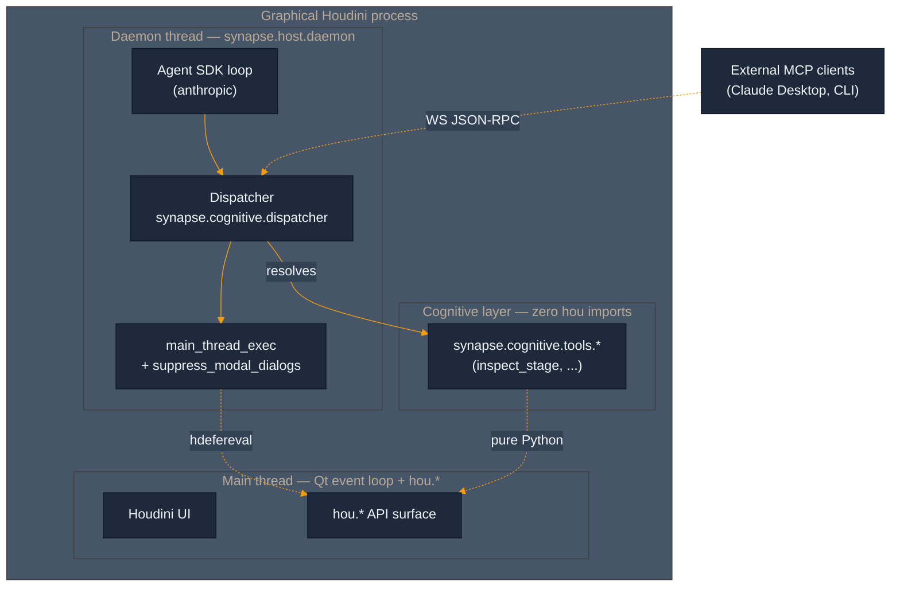
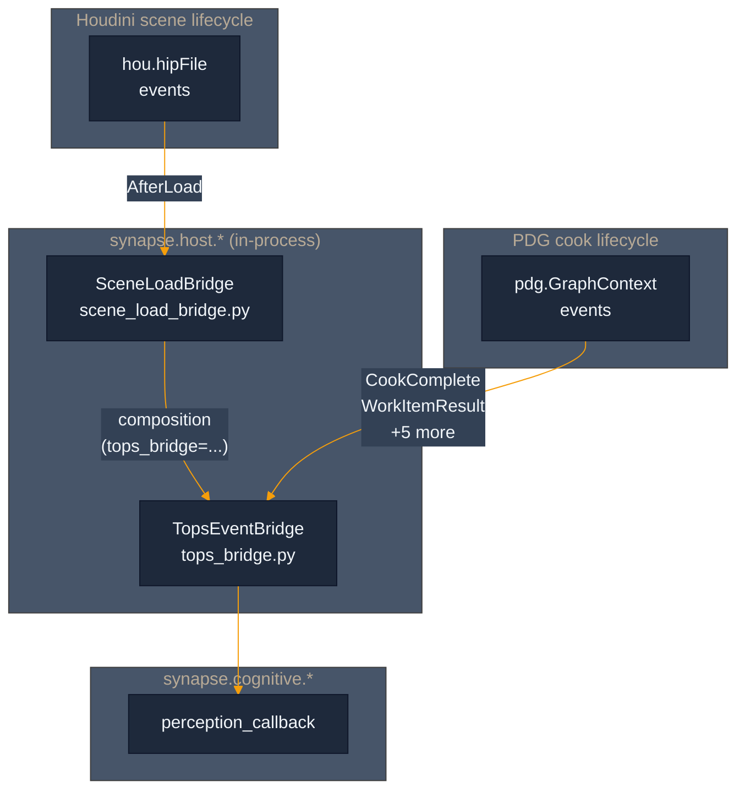
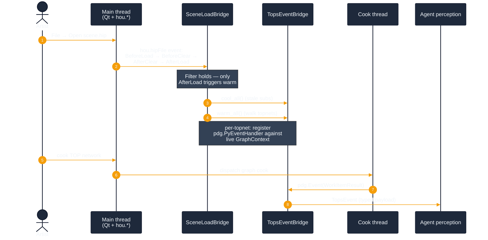
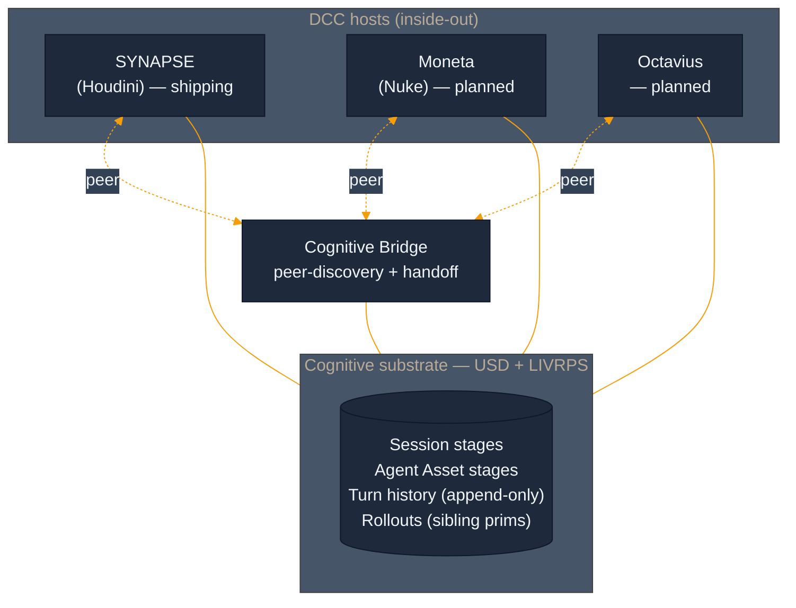
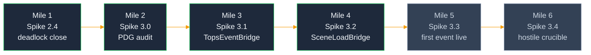
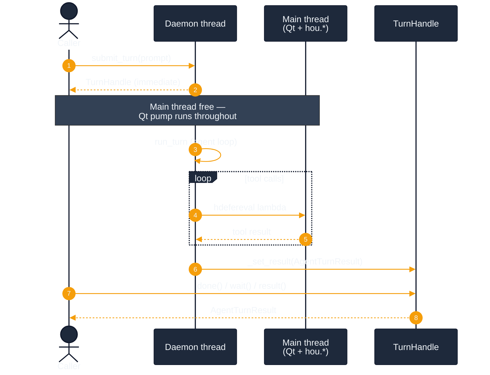
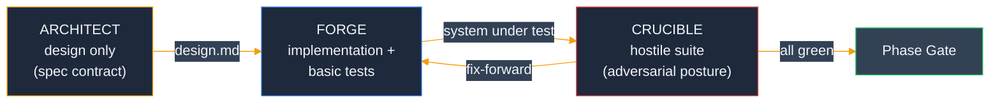

<p align="center">
  
</p>

<h3 align="center"><strong>Inside-out agent substrate for Houdini.</strong></h3>

<p align="center">
  <a href="LICENSE"></a>
  <a href="python/synapse/cognitive/dispatcher.py"></a>
  <a href="python/synapse/host/daemon.py"></a>
  <a href="python/synapse/host/tops_bridge.py"></a>
  <a href="tests"></a>
</p>

---

## The thesis: outside-in → inside-out

The standard pattern for AI-driven DCC work runs the agent in a separate process and reaches into the DCC through a bridge — WebSocket, RPC, stdio, a subprocess. The DCC is a service the agent calls. That shape has a ceiling: every interaction is a round-trip, every tool is a marshalling problem, and the agent never actually lives inside the creative environment.

SYNAPSE inverts that. The Claude Agent SDK runs **inside Houdini's own Python interpreter**, dispatching tools as direct in-process calls against `hou`. The WebSocket survives as a thin JSON-RPC adapter for external clients during migration, but the core loop is native. Same refactor pattern composes across the portfolio to **Moneta** (Nuke), **Octavius**, and the **Cognitive Bridge**.



The flip changes more than transport. Tools become direct calls. Errors keep their stack trace. And — the part Sprint 3 is wiring now — **events flow the other way**. Houdini taps the agent on the shoulder when something cooks, instead of the agent polling to ask. See [Perception channel](#perception-channel--two-bridges-scaffolded) below.

---

## Architecture

### Inside-out runtime

Once the daemon boots inside graphical Houdini, three threads are in play: **main** (Qt event loop + `hou.*`), **daemon** (the agent loop), and a **short-lived worker** for each main-thread dispatch (so the daemon thread can enforce a timeout on blocking `hdefereval` calls). Tools are pure-Python functions under `synapse.cognitive.tools.*` behind a `Dispatcher` interface. The Dispatcher composes `suppress_modal_dialogs()` around `main_thread_exec()` so every tool call gets a narrowly-scoped dialog-suppression window — the artist's own UI stays untouched outside tool dispatches.



The `cognitive/` vs `host/` code split is structural. `synapse.cognitive.*` is pure Python, zero `hou` imports, enforced by a grep-based lint test at CI time (`tests/test_cognitive_boundary.py`). `synapse.host.*` is Houdini-specific — `hou`, `hdefereval`, Qt thread marshaling — and gets swapped per DCC. The substrate composes.

### Perception channel — two bridges scaffolded

Sprint 3 is wiring the agent's first **eyes**. The Dispatcher gives the agent hands; the Agent SDK gives it a brain; the perception channel lets it see what Houdini sees, in the same heartbeat as the scheduler. Two bridges compose to deliver that:

- **`TopsEventBridge`** (Spike 3.1, Phase A) — registers `pdg.PyEventHandler` instances against each TOP network's live `pdg.GraphContext`, surfaces 7 cook + work-item events as typed `TopsEvent` payloads. The handler reads `pdg.*` properties only — no `hou.*` calls inside — because PDG events may fire on a non-main thread (cook thread, scheduler worker). That defensive shape means the bridge is thread-safe regardless of which thread fired the event.
- **`SceneLoadBridge`** (Spike 3.2, Phase B) — subscribes to `hou.hipFile.AfterLoad` and orchestrates an injected `TopsEventBridge`'s `cool_all` / `warm_all` cycle on every scene load. Mile 4's empirical audit captured all four hipFile events firing on `MainThread` (`is_main_thread=True`), so the AfterLoad handler calls `hou.*` and `tops_bridge.*` directly — **no `hdefereval` marshaling**. Adding it would be cargo-cult dispatch from main thread back to itself.

Composition, not inheritance: `SceneLoadBridge(tops_bridge=...)`. Each class keeps a single responsibility, and the relationship is testable end-to-end with mocks.



The end-to-end event flow when an artist opens a scene and cooks a TOP network:



**State today:** scaffolded and tested in standalone mode (no live Houdini). The two bridges have **71 tests passing** between them — 47 across `tests/test_tops_bridge.py` (Spike 3.1 basic + hostile) and 24 across `tests/test_scene_load_bridge.py` (Spike 3.2 basic + hostile). Live cook integration — the *first* real `pdg.Event` reaching the agent's perception layer in graphical Houdini — lands at Mile 5 (Spike 3.3).

### Portfolio thesis



Each host ships its own `synapse.host.*` layer. The cognitive substrate — USD stage layout, LIVRPS composition semantics, the Dispatcher contract, the append-only turn history — is shared. When all three are up, they coordinate through the Bridge via filesystem peer discovery.

---

## Install

Tested on **Windows 11 + Houdini 21.0.671**. Linux / macOS paths are the same shape, different separators.

### 1. Clone into a known path

```powershell
git clone https://github.com/JosephOIbrahim/Synapse.git C:\Users\%USERNAME%\SYNAPSE
cd C:\Users\%USERNAME%\SYNAPSE
```

**You're good if:** `git log -1 --oneline` shows the latest commit on `master`.
**If you see** `fatal: destination path already exists`: pick a different destination or remove the existing folder first.

### 2. Register the package with Houdini

Create `%USERPROFILE%\houdini21.0\packages\Synapse.json`:

```json
{
    "env": [
        { "PYTHONPATH": "C:/Users/YOUR_USERNAME/SYNAPSE/python" }
    ]
}
```

Replace `YOUR_USERNAME` with your actual Windows username (forward slashes in the path, not backslashes).

**You're good if:** launching Houdini and running `import synapse; print(synapse.__version__)` in the Python Shell prints a version string.
**If you see** `ModuleNotFoundError: No module named 'synapse'`: double-check the `PYTHONPATH` value in the `.json` points at the `python/` directory, not the repo root.

### 3. Set the API key

**Current primary — env var.** Set `ANTHROPIC_API_KEY` in your system environment (not just a terminal session — Houdini launches don't inherit shell-scoped vars on Windows):

```powershell
setx ANTHROPIC_API_KEY "sk-ant-..."
```

Launch a fresh Houdini after running `setx` — the new value only reaches processes started after.

**Forward-compat — `hou.secure`.** When SideFX ships a secure-credentials API in a future Houdini release, SYNAPSE's auth resolver picks it up automatically. Confirmed **not present** in Houdini 21.0.671 (`dir(hou)` only exposes `secureSelectionOption`). No action needed today.

**You're good if:** in Houdini's Python Shell, `import os; print(bool(os.environ.get('ANTHROPIC_API_KEY')))` prints `True`.
**If you see** `False`: the variable didn't land in this Houdini's environment. Close Houdini, re-open from a fresh shell, try again.

### 4. Verify the daemon boots

In Houdini's Python Shell:

```python
from synapse.host.daemon import SynapseDaemon

daemon = SynapseDaemon()
daemon.start()
print("running:", daemon.is_running)
daemon.stop()
```

**You're good if:** prints `running: True` and stops cleanly.
**If you see** `DaemonBootError: hou.isUIAvailable() returned False`: you're in headless `hython`, not graphical Houdini. The daemon refuses to boot in PDG / render-farm contexts (Fork Bomb prevention). For tests, pass `boot_gate=False`.
**If you see** `DaemonBootError: No Anthropic API key available`: step 3 didn't take. Re-launch Houdini from a fresh shell.
**If you see** `DaemonBootError: anthropic SDK is not installed`: this shouldn't happen — the SDK is vendored at `python/synapse/_vendor/` and prepended to `sys.path` on `import synapse`. If it does, confirm the vendored tree is intact on disk (`ls python/synapse/_vendor/anthropic/`).

---

## Current capability + roadmap

### What's shipping today

| Layer | State |
|---|---|
| Cognitive substrate (Dispatcher + `AgentToolError` + cognitive/host split) | Shipping. Zero-hou boundary enforced by lint. |
| Agent SDK loop (Anthropic, cancel-event-aware, serializable tool errors) | Shipping. Mocked end-to-end tests green. |
| Daemon lifecycle (boot gate, auth resolver, dialog suppression, bootstrap locks) | Shipping. Windows `WindowsSelectorEventLoopPolicy` + `PYTHONNOUSERSITE` + no-runtime-pip all baked. |
| `TurnHandle` async result envelope (Spike 2.4) | Shipping. `submit_turn` returns a handle immediately; `submit_turn_blocking` for headless / non-main-thread callers. Deadlock-pinned by 31 unit tests + regression class. |
| Vendored Anthropic SDK | Shipping. 15 MB at `python/synapse/_vendor/`, Python 3.11 / win\_amd64 ABI lock. |
| **Perception channel — `TopsEventBridge`** (Spike 3.1) | Scaffolded. 47 tests across basic + hostile. Standalone mode only. Live PDG cook lands at Mile 5. |
| **Perception channel — `SceneLoadBridge`** (Spike 3.2) | Scaffolded. 24 tests across basic + hostile. Composes a `TopsEventBridge`; auto-warm on `hou.hipFile.AfterLoad`. Live integration at Mile 5. |
| **Tools ported through the Dispatcher** | **1** — `synapse_inspect_stage` (flat `/stage` AST). |
| **Tools still on the Sprint 2 WebSocket path** | **104** — registry tools working in production, awaiting port. (Plus 6 group-info knowledge tools that don't need porting — they serve local content without Houdini.) |

The port pattern is mechanical and documented in `docs/crucible_protocol.md` + the `spike(1)` commit message. Every legacy tool gets:

1. A pure-Python function under `synapse.cognitive.tools.<name>` (zero `hou` imports).
2. A schema dict (description + JSON Schema) registered alongside the function.
3. The WS adapter branch in `mcp_server.py` swapped from `synapse_inspect_stage`-style direct dispatch to `dispatcher.execute('<name>', kwargs)`.

### Sprint 3 progress — Mile 4 of 6 closed



**Mile 1 — Spike 2.4 deadlock closure.** The live Crucible baseline at end of Sprint 3 Day 1 surfaced a deadlock at the daemon ↔ main-thread boundary: synchronous `submit_turn` parked Houdini's main thread on a result queue while the daemon thread's `hdefereval` dispatch waited for that same main thread to pump Qt events. Spike 2.4 closes it by changing `submit_turn` to return immediately with a `TurnHandle` — a `threading.Event`-backed Future analog. The caller decides when (and on which thread) to wait. Main thread stays free to pump Qt events; daemon thread keeps the agent loop; `hdefereval` lambdas execute because main is responsive.



**Mile 2 — Spike 3.0 PDG API audit.** The `pdg` module surface in Houdini 21.0.671 has known divergences from prior versions and from external-LLM training data. Mile 2 ran `dir()` introspection against live Houdini, captured the empirical surface in `docs/sprint3/spike_3_0_pdg_api_audit.md`, and refuted six wrong references in the early sketch — every `hou.pdg.*` path missing, `hou.hipFile.addEventCallback` returning `None` (not a removable handle), `pdg.PyEventCallback` being the wrong name. Each of those would have crashed first contact with Houdini if Spike 3.1 had coded against the sketch verbatim.

**Mile 3 — Spike 3.1 `TopsEventBridge` (Phase A).** In-process PDG event bridge. `warm(top_node)` registers a `pdg.PyEventHandler` against the TOP network's live `pdg.GraphContext` (acquired via `top_node.getPDGGraphContext()`, never class-instantiated — that's for fresh graphs). Surfaces 7 audit-verified event types: `CookStart`, `CookComplete`, `CookError`, `CookWarning`, `WorkItemAdd`, `WorkItemStateChange`, `WorkItemResult`. Threading defensive: handler reads `pdg.*` properties only, no `hou.*` calls inside. 47 tests across basic happy paths and an 8-case hostile suite (handler leak, double-bridge independence, callback-raising-mid-event, topnet-deleted-mid-subscription, multi-event-type-no-loss).

**Mile 4 — Spike 3.2 `SceneLoadBridge` (Phase B).** Auto-warm wire from `hou.hipFile.AfterLoad` to `TopsEventBridge`. Composes (not inherits) — constructor takes a `TopsEventBridge` instance and orchestrates its `cool_all` / `warm_all` cycle on each scene load. Mile 4's empirical scene-load audit (`docs/sprint3/spike_3_2_scene_load_audit.md`) captured all four hipFile events firing on `MainThread`, so the AfterLoad handler is a direct synchronous call — no `hdefereval`. 24 tests across basic happy paths and a 10-case hostile suite. One fix-forward cycle during CRUCIBLE: case 6 (unsubscribe-during-handler) surfaced a real defect — `warm_all` kept iterating after `unsubscribe` returned, leaving stale subs. Reconcile step added at end of `_on_after_load`: if `_subscribed` flipped to `False` mid-handler, run `cool_all` again. The hostile test pinned the contract; the fix held it.

**Workflow — the three-role pattern.** Phase A and Phase B both ran the same MOE shape internally:



ARCHITECT writes the design doc and never the code. FORGE implements against the spec and writes basic happy-path tests. CRUCIBLE writes hostile tests and never the implementation; when a hostile test surfaces a real defect, FORGE fixes the implementation rather than CRUCIBLE weakening the test (Commandment 7). Each role's authority is constitutionally restricted; phase boundaries gate the merge.

### Sprint 3 — load-bearing commits

```
87c4db9  Spike 3.2    SceneLoadBridge hostile suite (CRUCIBLE) + fix-forward
4cba649  Spike 3.2    SceneLoadBridge scaffold (FORGE)
ef7d5ae  Spike 3.2    SceneLoadBridge design (ARCHITECT)
9e4cc42  Spike 3.2    scene-load audit findings landed (Mile 4 audit)
a476386  Spike 3.2    scene-load API audit infrastructure
2f46590  CI repair    bump checkout/setup-python (Node.js 20 deprecation)
fcd1077  CI repair    gate test_live_capture body behind __main__
bb2713b  Spike 3.1    TopsEventBridge hostile suite (CRUCIBLE)
89da296  Spike 3.1    TopsEventBridge scaffold (FORGE)
2aa03d9  Spike 3.1    TopsEventBridge design (ARCHITECT)
07946dc  Spike 3.0    PDG API audit findings (Mile 2 audit)
6bf2f07  Spike 3.0    PDG API audit infrastructure
b1d3163  Spike 2.4    close daemon↔main-thread deadlock via TurnHandle
6e08dae  Spike 2.4    add TurnHandle (Future-shaped result envelope)
```

Sprint 2 Week 1 (`5e6fc0c`) shipped the first tool (`synapse_inspect_stage`) end-to-end through the still-outside-in WebSocket path. Sprint 3 built the inside-out substrate alongside it — one spike at a time, with an audit-first discipline (live `dir()` introspection in Houdini 21.0.671 before any code lands) and a human-in-the-loop Crucible protocol (`docs/crucible_protocol.md`) for the parts bash cannot drive. Tagged at `v5.5.0` (`4faaa3a`).

### Sprint 3 — what's next

```
Spike 3.3    First TOPS event surface live              [Mile 5 — needs GUI]
             workitem.complete → agent perception
             real .hip + real TOP cook through the bridge
Spike 3.4    Hostile TOPS Crucible                      [Mile 6]
             event flood, malformed events, cancellation
```

Mile 5 is the first time a real `pdg.Event` reaches the agent's perception layer through the two-bridge wiring in graphical Houdini. End-to-end timing target: under 50ms from `cookComplete` to `perception_callback` invocation (in-process should be sub-ms; budget is for safety margin). Mile 6 turns the heat up — event flood (10K events / 1s), malformed events (missing fields surface as typed parse errors), cancellation mid-cook with no orphaned callbacks.

Mile 5 cannot run from bash. It needs Joe at the GUI driving a real cook against the scaffolded bridges.

---

## Repository layout

```
python/synapse/
├── cognitive/                  # zero hou imports (lint-enforced)
│   ├── dispatcher.py           # Dispatcher + AgentToolError
│   ├── agent_loop.py           # Anthropic SDK turn runner
│   └── tools/                  # pure-Python tool implementations
├── host/                       # Houdini-specific (hou / hdefereval OK)
│   ├── daemon.py               # SynapseDaemon lifecycle
│   ├── main_thread_executor.py # tri-state GUI/headless/stock
│   ├── transport.py            # in-process execute_python
│   ├── dialog_suppression.py   # per-tool-call hou.ui guard
│   ├── auth.py                 # API key resolver (env var + hou.secure probe)
│   ├── turn_handle.py          # Spike 2.4 — Future-shaped submit_turn return
│   ├── tops_bridge.py          # Spike 3.1 — PDG event bridge (Phase A)
│   └── scene_load_bridge.py    # Spike 3.2 — auto-warm on AfterLoad (Phase B)
├── _vendor/                    # anthropic + deps, CP311 win_amd64
└── ...                         # Sprint 2 Week 1 + prior subsystems

tests/                          # 2874 passing
docs/sprint3/                   # audits + design contracts + continuation
docs/crucible_protocol.md       # manual Crucible runbook
mcp_server.py                   # Sprint 2 WebSocket adapter (still shipping)
```

---

## License

MIT. See [LICENSE](LICENSE).
