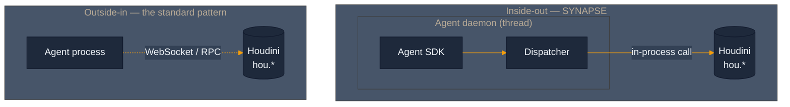
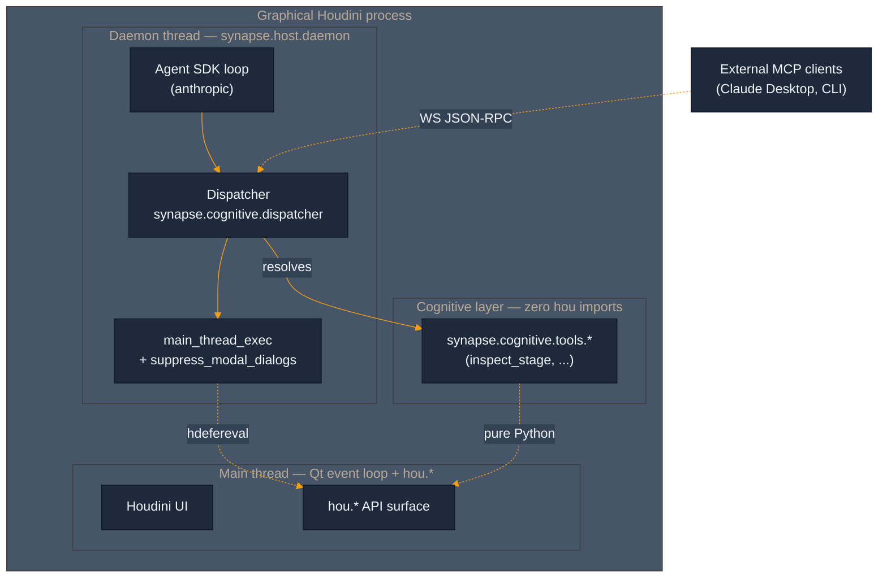
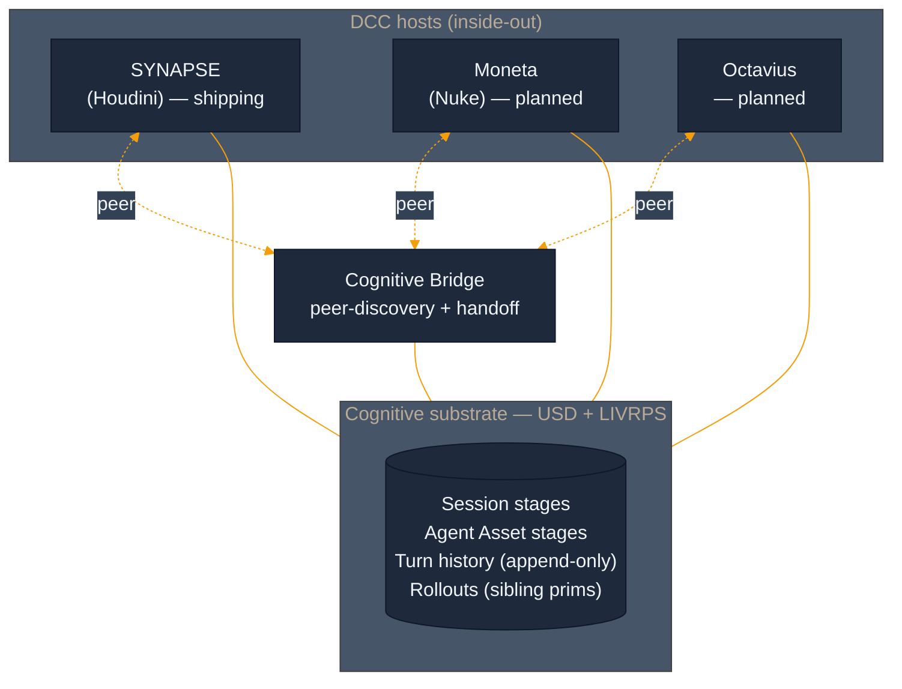
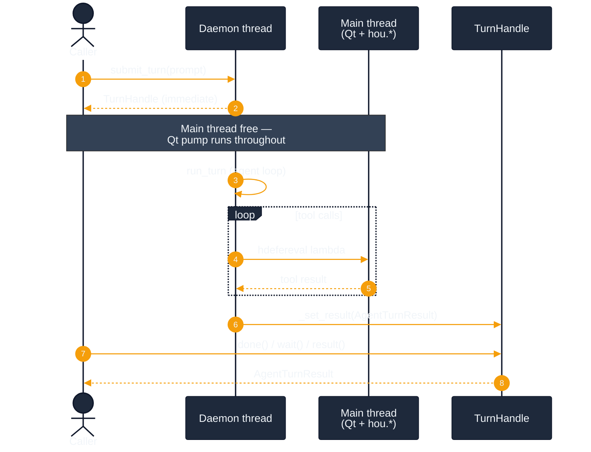

<p align="center">
  
</p>

<h3 align="center"><strong>Inside-out agent substrate for Houdini.</strong></h3>

<p align="center">
  <a href="LICENSE"></a>
  <a href="python/synapse/cognitive/dispatcher.py"></a>
  <a href="python/synapse/host/daemon.py"></a>
  <a href="tests"></a>
</p>

---

## The thesis: outside-in → inside-out

The standard pattern for AI-driven DCC work runs the agent in a separate process and reaches into the DCC through a bridge — WebSocket, RPC, stdio, a subprocess. The DCC is a service the agent calls. That shape has a ceiling: every interaction is a round-trip, every tool is a marshalling problem, and the agent never actually lives inside the creative environment.

SYNAPSE inverts that. The Claude Agent SDK runs **inside Houdini's own Python interpreter**, dispatching tools as direct in-process calls against `hou`. The WebSocket survives as a thin JSON-RPC adapter for external clients during migration, but the core loop is native. Same refactor pattern composes across the portfolio to **Moneta** (Nuke), **Octavius**, and the **Cognitive Bridge**.



---

## Architecture

### Inside-out runtime

Once the daemon boots inside graphical Houdini, three threads are in play: **main** (Qt event loop + `hou.*`), **daemon** (the agent loop), and a **short-lived worker** for each main-thread dispatch (so the daemon thread can enforce a timeout on blocking `hdefereval` calls). Tools are pure-Python functions under `synapse.cognitive.tools.*` behind a `Dispatcher` interface. The Dispatcher composes `suppress_modal_dialogs()` around `main_thread_exec()` so every tool call gets a narrowly-scoped dialog-suppression window — the artist's own UI stays untouched outside tool dispatches.



The `cognitive/` vs `host/` code split is structural. `synapse.cognitive.*` is pure Python, zero `hou` imports, enforced by a grep-based lint test at CI time (`tests/test_cognitive_boundary.py`). `synapse.host.*` is Houdini-specific — `hou`, `hdefereval`, Qt thread marshaling — and gets swapped per DCC. The substrate composes.

### Portfolio thesis



Each host ships its own `synapse.host.*` layer. The cognitive substrate — USD stage layout, LIVRPS composition semantics, the Dispatcher contract, the append-only turn history — is shared. When all three are up, they coordinate through the Bridge via filesystem peer discovery.

---

## Install

Tested on **Windows 11 + Houdini 21.0.671**. Linux / macOS paths are the same shape, different separators.

### 1. Clone into a known path

```powershell
git clone https://github.com/JosephOIbrahim/Synapse.git C:\Users\%USERNAME%\SYNAPSE
cd C:\Users\%USERNAME%\SYNAPSE
```

**You're good if:** `git log -1 --oneline` shows the latest commit on `master`.
**If you see** `fatal: destination path already exists`: pick a different destination or remove the existing folder first.

### 2. Register the package with Houdini

Create `%USERPROFILE%\houdini21.0\packages\Synapse.json`:

```json
{
    "env": [
        { "PYTHONPATH": "C:/Users/YOUR_USERNAME/SYNAPSE/python" }
    ]
}
```

Replace `YOUR_USERNAME` with your actual Windows username (forward slashes in the path, not backslashes).

**You're good if:** launching Houdini and running `import synapse; print(synapse.__version__)` in the Python Shell prints a version string.
**If you see** `ModuleNotFoundError: No module named 'synapse'`: double-check the `PYTHONPATH` value in the `.json` points at the `python/` directory, not the repo root.

### 3. Set the API key

**Current primary — env var.** Set `ANTHROPIC_API_KEY` in your system environment (not just a terminal session — Houdini launches don't inherit shell-scoped vars on Windows):

```powershell
setx ANTHROPIC_API_KEY "sk-ant-..."
```

Launch a fresh Houdini after running `setx` — the new value only reaches processes started after.

**Forward-compat — `hou.secure`.** When SideFX ships a secure-credentials API in a future Houdini release, SYNAPSE's auth resolver picks it up automatically. Confirmed **not present** in Houdini 21.0.671 (`dir(hou)` only exposes `secureSelectionOption`). No action needed today.

**You're good if:** in Houdini's Python Shell, `import os; print(bool(os.environ.get('ANTHROPIC_API_KEY')))` prints `True`.
**If you see** `False`: the variable didn't land in this Houdini's environment. Close Houdini, re-open from a fresh shell, try again.

### 4. Verify the daemon boots

In Houdini's Python Shell:

```python
from synapse.host.daemon import SynapseDaemon

daemon = SynapseDaemon()
daemon.start()
print("running:", daemon.is_running)
daemon.stop()
```

**You're good if:** prints `running: True` and stops cleanly.
**If you see** `DaemonBootError: hou.isUIAvailable() returned False`: you're in headless `hython`, not graphical Houdini. The daemon refuses to boot in PDG / render-farm contexts (Fork Bomb prevention). For tests, pass `boot_gate=False`.
**If you see** `DaemonBootError: No Anthropic API key available`: step 3 didn't take. Re-launch Houdini from a fresh shell.
**If you see** `DaemonBootError: anthropic SDK is not installed`: this shouldn't happen — the SDK is vendored at `python/synapse/_vendor/` and prepended to `sys.path` on `import synapse`. If it does, confirm the vendored tree is intact on disk (`ls python/synapse/_vendor/anthropic/`).

---

## Current capability + roadmap

### What's shipping today

| Layer | State |
|---|---|
| Cognitive substrate (Dispatcher + `AgentToolError` + cognitive/host split) | Shipping. Zero-hou boundary enforced by lint. |
| Agent SDK loop (Anthropic, cancel-event-aware, serializable tool errors) | Shipping. Mocked end-to-end tests green. |
| Daemon lifecycle (boot gate, auth resolver, dialog suppression, bootstrap locks) | Shipping. Windows `WindowsSelectorEventLoopPolicy` + `PYTHONNOUSERSITE` + no-runtime-pip all baked. |
| `TurnHandle` async result envelope (Spike 2.4) | Shipping. `submit_turn` returns a handle immediately; `submit_turn_blocking` for headless / non-main-thread callers. Deadlock-pinned by 31 unit tests + regression class. |
| Vendored Anthropic SDK | Shipping. 15 MB at `python/synapse/_vendor/`, Python 3.11 / win\_amd64 ABI lock. |
| **Tools ported through the Dispatcher** | **1** — `synapse_inspect_stage` (flat `/stage` AST). |
| **Tools still on the Sprint 2 WebSocket path** | **~103** — working in production, awaiting port. |

The port pattern is mechanical and documented in `docs/crucible_protocol.md` + the `spike(1)` commit message. Every legacy tool gets:

1. A pure-Python function under `synapse.cognitive.tools.<name>` (zero `hou` imports).
2. A schema dict (description + JSON Schema) registered alongside the function.
3. The WS adapter branch in `mcp_server.py` swapped from `synapse_inspect_stage`-style direct dispatch to `dispatcher.execute('<name>', kwargs)`.

### Recently shipped — Spike 2.4 (deadlock closure)

The live Crucible baseline at end of Sprint 3 Day 1 surfaced a deadlock at the daemon ↔ main-thread boundary: synchronous `submit_turn` parked Houdini's main thread on a result queue while the daemon thread's `hdefereval` dispatch waited for that same main thread to pump Qt events. 30s `MainThreadTimeoutError` per tool call, every tool call. Latent pre-2.3 because `TransportNotConfiguredError` short-circuited the path before it crossed the boundary; 2.3 wired the transport and the deadlock surfaced on every dispatch.

Spike 2.4 closes it by changing `submit_turn` to return immediately with a `TurnHandle` — a `threading.Event`-backed Future analog. The caller decides when (and on which thread) to wait for the result. Main thread stays free to pump Qt events; daemon thread keeps the agent loop; `hdefereval` lambdas execute because main is responsive.



Pinned by `tests/test_turn_handle.py` (31 unit tests across 8 classes) plus a deadlock-regression class in `tests/test_host_layer.py`. A `@pytest.mark.live` runbook test exercises the real scenario against graphical Houdini 21.0.671. Test floor is now **2752 passing**, +52 net from the Sprint 3 Day 1 baseline.

### Sprint 3 — commit tree

```
6bf2f07  Docs         Spike 3.0 — PDG API audit infrastructure (in flight)
582a8b1  Spike 2.4    fix stop() to drain pending handles per design §4.6
cfdb731  Spike 2.4    CRUCIBLE verification suite (TurnHandle + deadlock regression)
76ecb21  Docs         Spike 2.4 — ARCHITECT design contract committed
8aaea0e  Spike 2.4    document hou.secure env-var fallback path
b1d3163  Spike 2.4    close daemon↔main-thread deadlock via TurnHandle
6e08dae  Spike 2.4    add TurnHandle (Future-shaped result envelope)
cce7b34  Revert       revert spike(2.3) — deadlock unmasked by transport fix
43ee77f  Spike 2.3    auto-wire transport (reverted, kept for 2.4 reference)
dce8834  Spike 2.2    vendor Anthropic SDK for cross-version portability
80789fe  Spike 2 P2   agent loop + submit_turn + Crucible runbook
ed6ace6  Spike 2.1    close deferred live-transport gate (tri-state executor)
c6d232b  Spike 2 P1   daemon scaffolding + bootstrap locks
516242f  Spike 1      Dispatcher extraction + inspect_stage port
b5a2ce3  Spike 1.0    Dispatcher test-mode bypass + cognitive boundary
e6f79f9  Spike 0      SDK import gate green (hython + anthropic round-trip)
```

Sprint 2 Week 1 (`5e6fc0c`) shipped the first tool (`synapse_inspect_stage`) end-to-end through the still-outside-in WebSocket path. Sprint 3 built the inside-out substrate alongside it, one spike at a time, with a human-in-the-loop Crucible protocol (`docs/crucible_protocol.md`) for the parts bash cannot drive. Tagged at `v5.5.0` (`4faaa3a`).

### Sprint 3 — what's next

With the deadlock closed, Spike 3 opens the inside-out architecture's first **perception channel** — a `TopsEventBridge` that hooks PDG callbacks into the agent's event queue without any transport hop. The agent stops asking *"what cooked?"* and starts hearing the same events the scheduler emits, in the same heartbeat.

```
Spike 3.0    PDG API audit — live Houdini 21.0.671 dir() introspection      [in flight]
Spike 3.1    TopsEventBridge scaffold + headless tests
Spike 3.2    Auto-warm on scene load
Spike 3.3    First TOPS event surface (workitem.complete → agent perception)
Spike 3.4    Hostile TOPS Crucible (event flood, malformed events, cancel)
```

Spike 3.0's audit infrastructure (`docs/sprint3/spike_3_0_pdg_audit_script.py` + the receiving doc) is the gate for everything downstream. **No Spike 3.1 design opens until empirical PDG findings land** — hard API verification rule, anti-Gemini-assumption.

---

## Repository layout

```
python/synapse/
├── cognitive/              # zero hou imports (lint-enforced)
│   ├── dispatcher.py       # Dispatcher + AgentToolError
│   ├── agent_loop.py       # Anthropic SDK turn runner
│   └── tools/              # pure-Python tool implementations
├── host/                   # Houdini-specific (hou / hdefereval OK)
│   ├── daemon.py           # SynapseDaemon lifecycle
│   ├── main_thread_executor.py  # tri-state GUI/headless/stock
│   ├── transport.py        # in-process execute_python
│   ├── dialog_suppression.py    # per-tool-call hou.ui guard
│   └── auth.py             # API key resolver (env var + hou.secure probe)
├── _vendor/                # anthropic + deps, CP311 win_amd64
└── ...                     # Sprint 2 Week 1 + prior subsystems

tests/                      # 2752 passing, 5 pre-existing failures
docs/crucible_protocol.md   # manual Crucible runbook
mcp_server.py               # Sprint 2 WebSocket adapter (still shipping)
```

---

## License

MIT. See [LICENSE](LICENSE).
