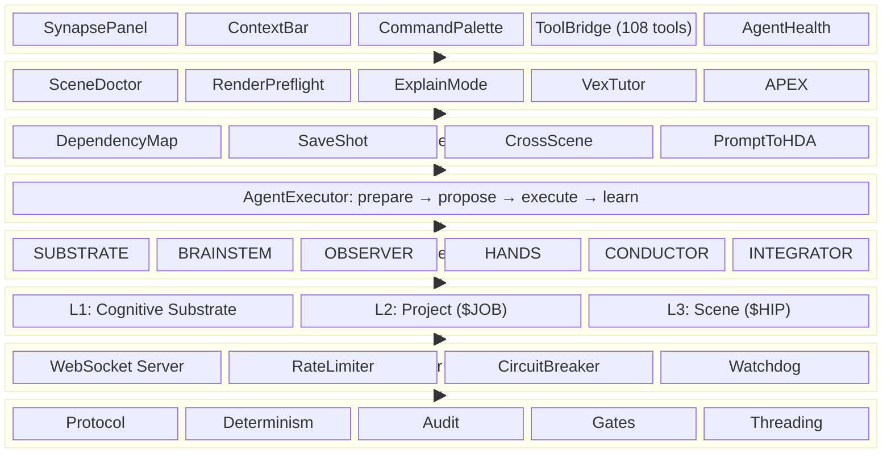
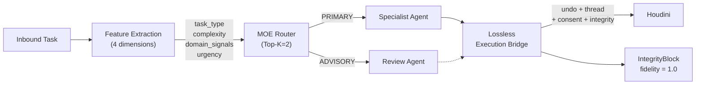
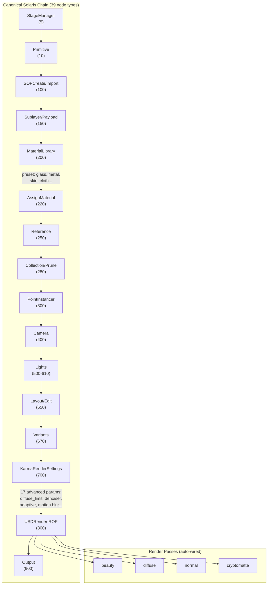
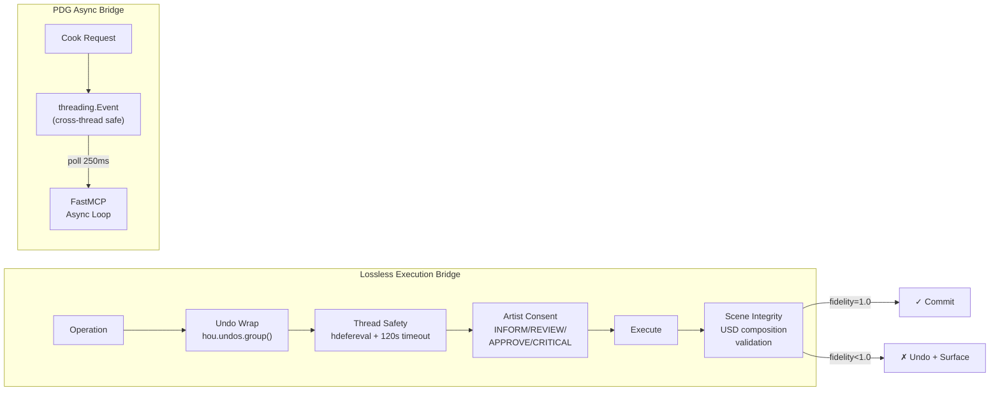
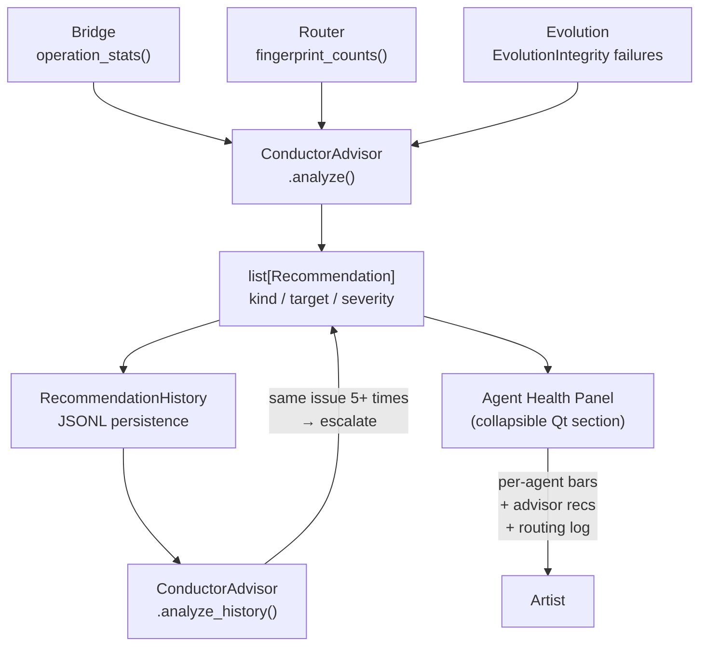
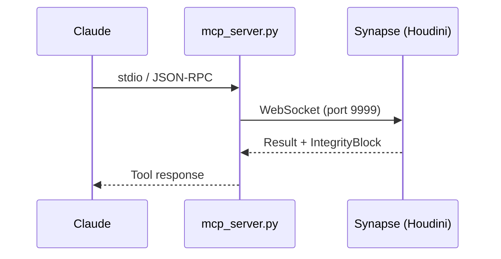
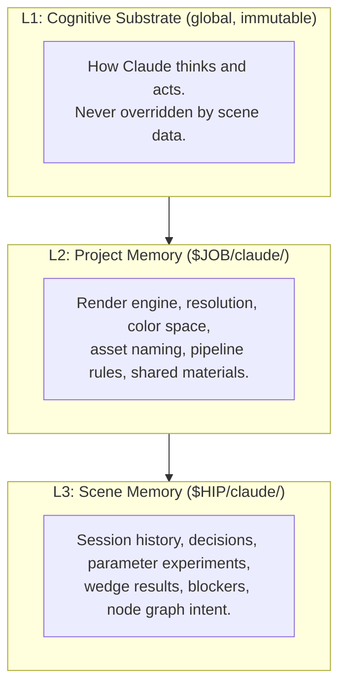
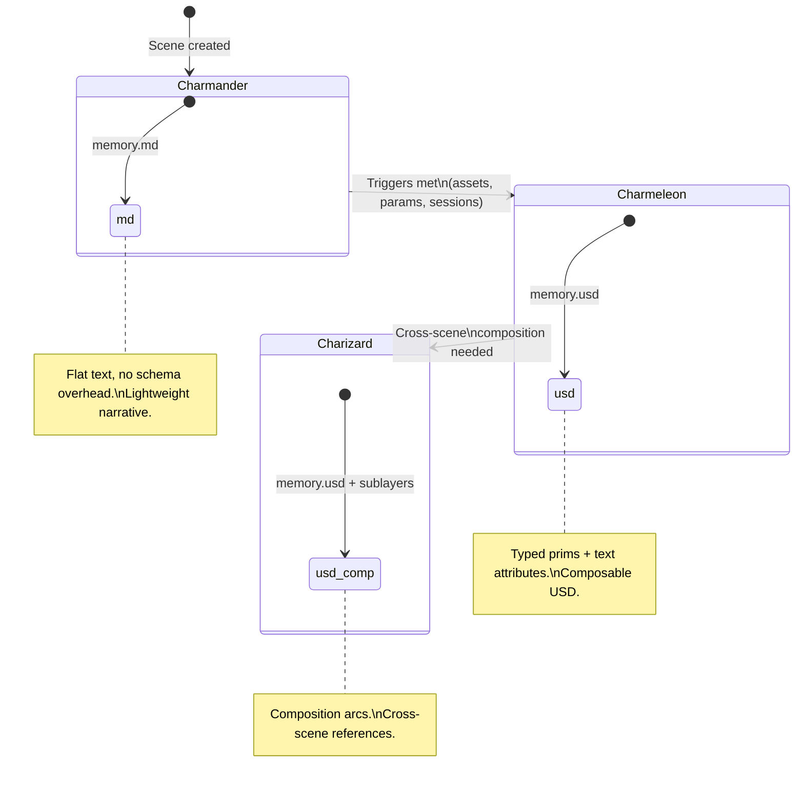

<p align="center">
  
</p>

<h3 align="center"><strong>AI-Houdini Bridge with Persistent Project Memory</strong></h3>

<p align="center">
  <a href="https://github.com/JosephOIbrahim/Synapse"></a>
  <a href="https://www.python.org/"></a>
  <a href="LICENSE"></a>
  <a href="tests"></a>
  <a href="python/synapse/core/protocol.py"></a>
  <a href="python/synapse/mcp"></a>
  <a href="shared"></a>
</p>

---

## What is Synapse?

The Mariana Trench is still deep. Now you have sonar.

Synapse doesn't make Houdini simpler. It makes Houdini's depth *accessible*. It connects an AI to your live Houdini session — not as a wrapper that hides complexity, but as a co-pilot that helps you navigate it. It can read parameters, create and wire nodes, execute Python and VEX, light and render with Karma, manipulate USD stages, diagnose scene problems, explain what your nodes are actually doing, trace data through networks, build HDAs from descriptions, pre-flight your renders before they hit the farm, profile bottlenecks, and navigate APEX rigs — all through conversation.

On top of that, Synapse keeps a persistent project memory that remembers your decisions, tracks what happened across sessions, and gives the AI full context about your project every time you reconnect. Memory starts as lightweight markdown and evolves into composable USD when the data outgrows flat text — automatically, losslessly, and without you having to think about it.

Built as a standalone package with zero required dependencies.

### Every feature passes one test

Does it do at least one of these?

| | |
|---|---|
| 🛡️ **"It caught something I would have missed"** | Safety net |
| 🎓 **"It taught me something I didn't know"** | Knowledge transfer |
| ⚡ **"It did in 30 seconds what takes me 30 minutes"** | Velocity |

If a feature can't hit at least one, it doesn't ship.

---

## Key Features

**Core Bridge** — 108 MCP tools give Claude full Houdini control: nodes, parameters, USD, materials, lighting, rendering, viewport capture, VEX execution. Material presets (glass, metal, skin, cloth, etc.) with category hierarchy. Karma advanced rendering with 17 configurable parameters including denoiser, adaptive sampling, bounce limits, and motion blur. Real-time WebSocket communication with production resilience (rate limiting, circuit breaker, port failover, watchdog, backpressure).

**Persistent Memory** — Three-layer memory system (cognitive substrate, project, scene) stored alongside your HIP file. Memory evolves from flat markdown to structured USD to composed USD with cross-scene composition arcs — automatically, when the data warrants it.

**Scene Doctor** — Full health audit with auto-fix. Checks for missing textures, broken references, unconnected inputs, out-of-range parameters, infinite cook loops, missing cameras, zero-area lights, empty merges, unused nodes, and stale caches. `/diagnose` to run, `/fix` to apply fixes.

**Render Preflight** — Pre-render checklist that catches overnight farm failures before they happen. Memory estimation, texture resolution audit, light sampling analysis, motion blur completeness, AOV verification, frame range sanity, output path validation, material binding checks. `/preflight` to run.

**Explain Mode** — Select a node or network and get a contextual explanation of what *this particular node* is *actually doing* in *your scene* — not documentation, but interpretation with real parameter values and real data counts. `/explain` to run.

**Network Trace** — Follow data from input to output with real numbers at every step. Shows point counts, cook times, attribute changes, and identifies bottlenecks. `/trace` to run.

**VEX Tutor** — Three modes: `/vex explain` (line-by-line walkthrough of a selected wrangle), `/vex help` (quick reference with practical examples), `/vex write` (generates VEX from description with explanation).

**Recipe Book** — Production-tested workflow patterns organized by context (scatter, volumes, materials, rigging, rendering, USD, VEX, motion). Each recipe can be built directly into your scene or explained step-by-step. Extensible: save your own patterns. `/recipes` to browse.

**APEX Deep Dive** — AI-assisted navigation of Houdini's APEX rigging system. Explains APEX concepts, provides production-ready rig recipes (FK chains, IK chains, FK/IK blends, autorig, facial, muscle), traces APEX graph execution step-by-step, and assists with KineFX-to-APEX migration. `/apex` with 8 subcommands.

**Performance Profiler** — Not just cook times — interpretation and actionable recommendations. Identifies bottlenecks, suggests node reordering, estimates savings, offers one-click fixes. `/profile` to run.

**Dependency Map** — Traces every external reference in your scene (textures, alembics, USD references, HDAs, OTLs) and reports status: exists, missing, modified since last render, outdated version. `/deps` to run.

**Prompt-to-HDA** — Describe what you want in natural language, get a packaged HDA with clean parameter interfaces. Six built-in recipe patterns (scatter, fracture, deform, UV layout, light rig, material setup) plus freeform creation. `/hda` to run.

**Shot Login** — One-click context hydration. Open a HIP file and Synapse loads all three memory layers, giving the AI full context about your project and scene immediately. `/login` to run.

**Command Palette** — Fuzzy search over all commands, recipes, and recent actions. Ctrl+K to open.

**Context Bar** — Information-dense status bar showing network breadcrumb path, memory evolution stage, scene health indicator, and contextual quick actions that change based on your current network type.

**Agent Health Panel** — Collapsible section showing live MOE agent telemetry: per-agent success rate bars with color coding, bridge health stats, anchor violation alerts, and ConductorAdvisor recommendations with severity. Auto-refreshes every 3 seconds. Surfaces critical recommendations in the activity log and shows which agent handled each request (e.g. "Routed to HANDS (scored)").

**Session Journal** — Automatic logging of every Synapse action with timestamps and context. Becomes part of scene memory. `/journal` to browse, `/journal search` to find.

**Cross-Scene Context** — When loading project memory, Synapse surfaces relevant knowledge from other scenes: displacement settings that worked, approved material libraries, wedge results from across the project. Institutional knowledge that normally lives in Slack threads and people's heads.

**Save Shot** — Complete context snapshot with conversation highlights, tool actions, scene state, decisions, and parameters changed. Auto-saves on HIP file save, panel close, successful renders, and after diagnostics with fixes. `/save-shot` to run.

**Error Translator** — Intercepts Houdini error messages and translates them to plain English with suggested fixes. Invisible infrastructure — no command needed.

**Human-in-the-Loop Gates** — Four levels (INFORM, REVIEW, APPROVE, CRITICAL) with batch approval. Reads auto-approve; creates batch for review; deletes require explicit approval; code execution requires full stop.

**Determinism** — Canonical ordering, tier pinning, fixed-precision rounding, content-based IDs, Kahan summation. Inspired by [He2025].

**Thread Safety** — PDG async cook bridge uses `threading.Event` for cross-thread safety. Main thread dispatch has 120s timeout to prevent indefinite hangs. All material mutations undo-wrapped. Exception logging throughout (zero bare `except: pass`).

**Geometry Introspection** — Bounding box, primitive type distribution (polygon/mesh/VDB/volume/packed), empty geometry detection, node state flags (display/render/bypass/lock). Large geometry guard skips attribute sampling above 1M points to prevent hangs.

**Houdini Optional** — All 2,500+ tests run without Houdini. Core library has zero required dependencies.

---

&nbsp;

## Installation

Two paths depending on how you want to use Synapse:

| Path | You want to... | Time |
| --- | --- | --- |
| **A. Artist** | Talk to Houdini through Claude Desktop or Claude Code | ~5 min |
| **B. Developer** | Hack on Synapse itself, run tests, add features | ~5 min |

Most artists want **Path A**. If you just want to try it, start there.

&nbsp;


---

### Path A: Connect Claude to Houdini (Artist Setup)

You'll end up with Claude talking directly to your Houdini scene. Four steps, nothing complicated.

&nbsp;

#### Step 1 — Install Synapse

Open a terminal (Command Prompt, PowerShell, or Terminal) and run:

```
pip install synapse-houdini
```

That's it. One command. This installs Synapse and everything it needs.

> **Tip:** If `pip` isn't recognized, try `python -m pip install synapse-houdini` instead.
>
> **Still stuck?** Make sure Python 3.9 or newer is installed. Run `python --version` to check.

&nbsp;

#### Step 2 — Start the server inside Houdini

Open Houdini, then open the **Python Shell** (Windows menu > Python Shell) and paste:

```python
from synapse.server.websocket import SynapseServer
server = SynapseServer(port=9999)
server.start()
```

You should see a message confirming the server started on port 9999.

> **You'll do this every time you open Houdini.** Later, you can add these lines to your Houdini startup script so it happens automatically.

&nbsp;

#### Step 3 — Tell Claude about Synapse

Pick whichever Claude app you use:

&nbsp;

**Claude Desktop** (the app most artists use)

Find your config file and open it in any text editor:

* **Windows:** `%APPDATA%\Claude\claude_desktop_config.json`
* **macOS:** `~/Library/Application Support/Claude/claude_desktop_config.json`

> **Can't find it?** In Claude Desktop, go to Settings (gear icon) > Developer > Edit Config.

Paste this as the entire file contents:

```json
{
  "mcpServers": {
    "synapse": {
      "command": "python",
      "args": ["-m", "synapse.mcp_server"]
    }
  }
}
```

> **Already have other MCP servers?** Just add the `"synapse": { ... }` block inside your existing `"mcpServers"`.

Save the file and **restart Claude Desktop**. You'll see 108 new tools appear in the tool picker (the hammer icon).

&nbsp;

**Claude Code** (terminal)

Run this once from any folder:

```
claude mcp add synapse -- python -m synapse.mcp_server
```

Done. The tools are available in every Claude Code session.

&nbsp;

#### Step 4 — Try it

With Houdini open and the server running, say something to Claude:

> *"What's in my scene right now?"*

> *"Create a sphere and a distant light, then capture the viewport so I can see it."*

> *"Diagnose my scene and fix anything critical."*

> *"Explain what this node is doing with my actual parameter values."*

> *"Build me an HDA that scatters rocks on terrain with density controls."*

Claude will use Synapse to read your scene, create nodes, adjust parameters, diagnose problems, and show you the result. Everything happens live inside your Houdini session.

&nbsp;


---

### Path B: Developer Setup

For contributing, running tests, or building on top of Synapse.

&nbsp;

#### Clone and install with all extras

```
git clone https://github.com/JosephOIbrahim/Synapse.git
cd Synapse
pip install -e ".[dev,websocket,mcp,routing,encryption]"
```

| Extra | What it adds |
| --- | --- |
| `dev` | pytest, coverage, mypy |
| `websocket` | WebSocket server for Houdini bridge |
| `mcp` | MCP server for Claude integration |
| `routing` | LLM-powered routing tier (Anthropic API) |
| `encryption` | Fernet encryption for data at rest |
| `memory` | Cross-process file locking for scene memory |

&nbsp;

#### Run the tests

```
python -m pytest tests/ -v
```

All 2,500+ tests run without Houdini. No license needed.

&nbsp;

#### Type checking

```
python -m mypy python/synapse/ --config-file pyproject.toml
```

Clean: 0 errors on 82 source files.

&nbsp;

#### Houdini shelf + panel setup (optional)

If you want the toolbar and Qt panel inside Houdini, add to your `houdini.env`:

```
HOUDINI_PATH = "/path/to/Synapse/houdini;&"
```

This loads the shelf toolbar and the Python panel with context bar, command palette (Ctrl+K), and split view for structured results.

Then in Houdini: **Windows > Python Panel > Synapse**.

&nbsp;


---

### Encryption (Optional)

Synapse supports optional Fernet (AES-128-CBC + HMAC-SHA256) encryption for all data at rest — memory, audit logs, gate proposals, and markdown files.

```
pip install synapse-houdini[encryption]
```

**Key management** (priority order):

1. `SYNAPSE_ENCRYPTION_KEY` environment variable (base64-encoded Fernet key)
2. `~/.synapse/encryption.key` file (auto-created with `0600` permissions)
3. Auto-generated on first use

Encryption is transparent: existing plaintext `.synapse/` directories load without migration. New writes are encrypted; reads auto-detect encrypted vs plaintext content.

&nbsp;


---

### Troubleshooting

| Problem | Fix |
| --- | --- |
| `pip` not found | Use `python -m pip install synapse-houdini` instead of bare `pip` |
| `ModuleNotFoundError: synapse` | Make sure you ran `pip install synapse-houdini` first |
| Server won't start in Houdini | Make sure nothing else is using port 9999. You can change it: `SynapseServer(port=9998)` |
| Claude can't connect | Check that the server is running in Houdini *before* talking to Claude |
| Tools don't appear in Claude Desktop | Restart Claude Desktop after editing the config file |
| Wrong Python version | Synapse needs Python 3.9+. Run `python --version` to check |
| Already have MCP servers configured | Add `"synapse": { ... }` inside your existing `"mcpServers"` block — don't replace the whole file |

---

## Commands

Every command is accessible through natural conversation or via slash commands in the Synapse panel.

### Production Commands

| Command | What it does |
| --- | --- |
| `/diagnose` | Full scene health audit — missing textures, broken refs, bad parameters, unused nodes |
| `/fix` | Apply auto-fixes for issues found by diagnose |
| `/preflight` | Pre-render checklist — memory, textures, sampling, AOVs, output paths |
| `/deps` | Trace all external dependencies with status (exists/missing/modified/outdated) |
| `/profile` | Performance analysis with interpretation and optimization recommendations |
| `/save-shot` | Complete context snapshot — conversation, actions, decisions, parameters |
| `/journal` | Browse the session journal. `/journal search {term}` to find specific entries |

### Learning Commands

| Command | What it does |
| --- | --- |
| `/explain` | Contextual explanation of selected node with real values, not documentation |
| `/trace` | Follow data through network — point counts, cook times, bottlenecks |
| `/vex explain` | Line-by-line walkthrough of selected VEX wrangle |
| `/vex help {topic}` | Quick VEX reference with practical examples |
| `/vex write {desc}` | Generate VEX from natural language with explanation |
| `/recipes` | Browse production workflow patterns. `/recipes add` to save your own |

### APEX Commands

| Command | What it does |
| --- | --- |
| `/apex explain` | Explain any APEX concept or selected APEX node |
| `/apex recipes` | Browse production rig setups (FK, IK, blend, autorig, facial, muscle) |
| `/apex trace` | Step-by-step narrated trace of APEX graph execution |
| `/apex migrate` | Analyze KineFX network and suggest APEX equivalent |

### Workflow Commands

| Command | What it does |
| --- | --- |
| `/hda {description}` | Build a packaged HDA from natural language description |
| `/login` | Shot login — load all memory layers for current HIP file |
| `/bookmarks` | View conversation bookmarks. Click 🔖 on any message to save |

---

## Architecture



**Core** provides the wire format, determinism primitives, tamper-evident audit, and human gates. **Server** runs the WebSocket bridge with production resilience. **Memory** persists decisions, context, and actions with automatic evolution from markdown to USD. **MOE Agent Team** decomposes tasks across 6 specialist agents with lossless execution guarantees. **Agent** orchestrates multi-step plans through the gate system with outcome-based learning. **Pipeline** handles dependency tracking, session management, HDA generation, and cross-scene context. **Knowledge** provides scene diagnosis, performance profiling, data tracing, VEX tutoring, APEX navigation, and contextual explanations. **Panel** is the Houdini Qt interface with streaming Claude integration, command palette, and split-view structured results.

---

## MOE Agent Team

Synapse decomposes VFX pipeline tasks using a Mixture-of-Experts (MOE) router that dispatches to 6 specialist agents. Every agent operation flows through the **Lossless Execution Bridge** — a structural safety layer guaranteeing undo-wrapped, thread-safe, integrity-verified execution.

### Agent Roster

| Agent | Codename | Domain |
|---|---|---|
| **SUBSTRATE** | The Substrate | Thread-safe async, MCP server, deferred execution |
| **BRAINSTEM** | The Brain | Self-healing execution, error recovery, VEX compiler feedback |
| **OBSERVER** | The Eyes | Network graphs, geometry introspection, viewport capture |
| **HANDS** | The Hands | USD/Solaris, APEX rigging, Copernicus, MaterialX |
| **CONDUCTOR** | The Conductor | PDG orchestration, memory evolution, batch determinism |
| **INTEGRATOR** | The Integrator | API contracts, type safety, tests, conflict resolution |

### MOE Routing Pipeline



Feature extraction uses word-boundary matching across 66 domain keywords covering 12 signal domains (async, MCP, error handling, VEX, geometry, USD, MaterialX, APEX, COPs, rendering, PDG, testing). Includes renderer-specific terms (xpu, mantra, ipr, denoiser, aov, lpe), SOP vocabulary (sop, volume, polygon), USD composition terms (payload, sublayer, collection), and MaterialX concepts (texture, bsdf, nodegraph). The router scores all 6 agents, selects a primary (owns the deliverable) and an advisory (reviews), with 10 hand-tuned fast paths and auto-promotion of frequent fingerprints to session fast paths.

### Solaris Pipeline



Material creation supports 10 presets (glass, mirror, rough_metal, polished_metal, skin, cloth, plastic, ceramic, wax, rubber) with category-based organization (`/materials/{category}/{name}`). Explicit parameters override preset values. Karma advanced settings cover 17 parameters including bounce depth limits, denoiser, adaptive sampling, and motion blur. Scene assembly can auto-configure AOV passes in a single call. All material mutations are undo-wrapped (`hou.undos.group`).

### Lossless Execution Bridge



Four structural anchors enforced on every operation:

| Anchor | Guarantee |
|---|---|
| **Undo Safety** | Every mutation wrapped in `hou.undos.group()` — materials, nodes, renders |
| **Thread Safety** | All `hou.*` calls on main thread via `hdefereval` with 120s timeout |
| **Artist Consent** | INFORM / REVIEW / APPROVE / CRITICAL gates with timeout-to-rejection |
| **Scene Integrity** | USD composition validation after mutation; rollback on violation; exceptions logged |

The PDG async cook bridge uses `threading.Event` (not `asyncio.Event`) for cross-thread safety between Houdini's main thread and FastMCP's async loop. Cook errors are captured and propagated rather than silently hanging.

### Self-Observability Loop

The agent team reads its own runtime telemetry and recommends substrate tuning:



The advisor is read-only by construction. Recommendations are structured proposals (never auto-applied) that route through the artist consent system. The Agent Health Panel in Houdini surfaces per-agent success rates, bridge stats, and advisor recommendations live — auto-refreshing every 3 seconds. History persists across sessions via JSONL, enabling longitudinal trend analysis.

---

## Claude Integration (MCP)

Synapse includes an MCP server that bridges Claude to Houdini with 108 tools.



### Available MCP Tools (108)

| Category | Tools |
| --- | --- |
| **System** | `synapse_ping`, `synapse_health` |
| **Scene** | `houdini_scene_info`, `houdini_get_selection` |
| **Nodes** | `houdini_create_node`, `houdini_delete_node`, `houdini_connect_nodes`, `houdini_modify_node` |
| **Parameters** | `houdini_get_parm`, `houdini_set_parm`, `houdini_set_keyframe` |
| **Execution** | `houdini_execute_python`, `houdini_execute_vex` |
| **USD / Solaris** | `houdini_stage_info`, `houdini_get_usd_attribute`, `houdini_set_usd_attribute`, `houdini_create_usd_prim`, `houdini_modify_usd_prim`, `houdini_reference_usd` |
| **Materials** | `houdini_create_material` (presets, categories, transmission/coat/IOR), `houdini_assign_material`, `houdini_read_material`, `houdini_create_textured_material` |
| **Rendering** | `houdini_render`, `houdini_render_settings` (engine detection, 17 Karma advanced params), `houdini_wedge`, `houdini_capture_viewport` |
| **Introspection** | `synapse_inspect_selection` (bbox, VDB detect, prim types, node flags), `synapse_inspect_scene`, `synapse_inspect_node` |
| **Memory** | `synapse_context`, `synapse_search`, `synapse_recall`, `synapse_decide`, `synapse_add_memory`, `synapse_memory_write`, `synapse_memory_query`, `synapse_memory_status`, `synapse_evolve_memory`, `synapse_project_setup` |
| **Diagnostics** | `synapse_diagnose`, `synapse_fix`, `synapse_preflight`, `synapse_error_translate` |
| **Knowledge** | `synapse_explain`, `synapse_trace`, `synapse_vex_explain`, `synapse_vex_help`, `synapse_vex_write`, `synapse_knowledge_lookup`, `synapse_list_recipes` |
| **APEX** | `synapse_apex_explain`, `synapse_apex_recipes`, `synapse_apex_trace`, `synapse_apex_migrate` |
| **Production** | `synapse_deps`, `synapse_profile`, `synapse_save_shot`, `synapse_journal`, `synapse_cross_scene` |
| **HDA** | `synapse_hda_build`, `synapse_hda_package` |
| **Routing** | `synapse_router_stats`, `synapse_metrics` |
| **Batch** | `synapse_batch` |

*Plus additional parameter, USD, camera, lighting, and Karma-specific tools totaling 108.*

### Configuration

| Environment Variable | Default | Description |
| --- | --- | --- |
| `SYNAPSE_PORT` | `9999` | WebSocket port to connect to |

---

## Memory System

Synapse's memory is layered and evolving.

### Three Layers



### Evolution

Memory files start as markdown and evolve to USD when the data outgrows flat text. Evolution is automatic, lossless, and one-directional.



| Stage | Codename | Format | When |
| --- | --- | --- | --- |
| **Flat** | Charmander | `memory.md` | Scene is new. Memory is lightweight narrative text. |
| **Structured** | Charmeleon | `memory.usd` | Structured data appears — asset references, parameter records, wedge results. USD prims with typed attributes. |
| **Composed** | Charizard | `memory.usd` + sublayers | Cross-scene composition needed. Scene memory sublayers project memory. Queryable across shots. |

Evolution triggers are automatic: structured data count, asset references, parameter records, wedge results, session count, file size. When the markdown outgrows flat text, it evolves. The original markdown is archived and a companion `.md` is auto-generated for human readability. Evolution verification uses per-item content hashing — if any field drifts during the round-trip, the evolution is rolled back and the original is preserved.

---

## Usage

### Memory

```python
from synapse import SynapseMemory, MemoryType

memory = SynapseMemory()

# Add typed memories
memory.note("Switched to Arnold renderer", tags=["render"])
memory.action("Created key light", node_paths=["/obj/key_light"])
memory.decision(
    decision="Use ACES color space",
    reasoning="Studio standard for color management",
    alternatives=["sRGB", "Linear"],
)

# Search
results = memory.search("color space", limit=10)

# Context summary (useful for feeding to AI)
summary = memory.get_context_summary()

# Persist to disk
memory.save()
```

### Agent Execution

Agents follow a four-phase loop: **prepare** (gather context from memory), **propose** (define steps, route through gates), **execute** (run commands or dry-run), **learn** (record outcomes as feedback memories).

```python
from synapse import AgentExecutor, AgentStep, SynapseMemory, HumanGate

executor = AgentExecutor(
    memory=SynapseMemory(),
    gate=HumanGate.get_instance(),
)

task = executor.prepare(
    goal="Set up three-point lighting for shot_010",
    sequence_id="shot_010",
    category="lighting",
    agent_id="claude",
)

plan = executor.propose(
    task=task,
    steps=[
        AgentStep(
            step_id="",
            action="create_node",
            description="Create key light",
            payload={"type": "arealight", "name": "key_light"},
            gate_level=None,
            reasoning="Primary illumination source",
            confidence=0.9,
        ),
    ],
    reasoning="Classic three-point lighting setup",
)

if plan.status.value == "approved":
    completed = executor.execute(plan)

executor.record_outcome(plan, success=True, feedback="Client approved")
```

### Human-in-the-Loop Gates

Every agent action is classified by risk level.

| Level | Behavior | Example commands |
| --- | --- | --- |
| `INFORM` | Auto-approve, log only | `get_parm`, `get_scene_info` |
| `REVIEW` | Batch for later review | `create_node`, `set_parm` |
| `APPROVE` | Block until approved | `delete_node`, `connect_nodes` |
| `CRITICAL` | Full stop, confirm twice | `execute_python`, `execute_vex` |

### Determinism

Fixed-precision arithmetic and content-based identifiers ensure reproducible workflows.

```python
from synapse.core.determinism import round_float, deterministic_uuid, DeterministicRandom

value = 0.1 + 0.2               # 0.30000000000000004
rounded = round_float(value)     # 0.3

id_a = deterministic_uuid("shot_010:key_light")
id_b = deterministic_uuid("shot_010:key_light")
assert id_a == id_b              # Same input = same ID, always

rng = DeterministicRandom(seed=42)
rng.uniform(0.0, 1.0)           # Same result every run
```

---

## Wire Protocol

Default endpoint: `ws://localhost:9999` | Protocol version: `4.0.0`

Commands are JSON messages with `type`, `id`, `payload`, `sequence`, and `timestamp` fields. Parameter names are resolved through an alias system (38+ mappings).

| Category | Commands |
| --- | --- |
| **Node** | `create_node`, `delete_node`, `modify_node`, `connect_nodes` |
| **Parameters** | `get_parm`, `set_parm` |
| **Scene** | `get_scene_info`, `get_selection`, `set_selection` |
| **Execution** | `execute_python`, `execute_vex` |
| **USD/Solaris** | `create_usd_prim`, `modify_usd_prim`, `get_stage_info`, `set_usd_attribute`, `get_usd_attribute` |
| **Memory** | `context`, `search`, `add_memory`, `decide`, `recall` |
| **Living Memory** | `project_setup`, `memory_write`, `memory_query`, `memory_status`, `evolve_memory` |
| **Utility** | `ping`, `get_health`, `get_help`, `heartbeat`, `backpressure` |

---

## Testing

```bash
# All tests (no Houdini required)
python -m pytest tests/ -v

# Individual test modules
python -m pytest tests/test_core.py -v          # Determinism, audit, gates
python -m pytest tests/test_routing.py -v       # Routing cascade
python -m pytest tests/test_agent.py -v         # Agent protocol, executor, learning
python -m pytest tests/test_resilience.py -v    # Rate limiter, circuit breaker, watchdog
python -m pytest tests/test_render.py -v        # Karma/Mantra pipeline
python -m pytest tests/test_materials.py -v     # Material tools
python -m pytest tests/test_scene_doctor.py -v  # Diagnostics
python -m pytest tests/test_knowledge.py -v     # Explain, trace, VEX tutor
python -m pytest tests/test_apex.py -v          # APEX system
python -m pytest tests/test_pipeline.py -v      # Deps, profile, save-shot

# With coverage
python -m pytest tests/ --cov=synapse --cov-report=term-missing
```

All tests import modules directly and run without a Houdini license or environment.

### Live Tests (Inside Houdini)

Some features (viewport capture, hwebserver transport) require a graphical Houdini session. Run these from the Houdini Python Shell:

```python
import runpy; runpy.run_path("tests/test_live_capture.py")
```

---

## Project Structure

```
Synapse/
├── pyproject.toml
├── LICENSE
├── CLAUDE.md
├── TONE.md
├── DEMO_SCRIPT.md
├── INVENTORY.md
├── mcp_server.py                          # MCP server (Claude bridge)
├── .mcp.json                              # Claude Code MCP config
├── houdini/
│   ├── python_panels/
│   │   └── synapse_panel.pypanel          # Qt panel (context bar, palette, split view)
│   ├── scripts/python/
│   │   └── synapse_shelf.py               # Shelf callbacks
│   └── toolbar/
│       └── synapse.shelf                  # Shelf toolbar
├── python/synapse/
│   ├── __init__.py                        # Public API surface
│   ├── core/
│   │   ├── protocol.py                    # CommandType, SynapseCommand/Response
│   │   ├── queue.py                       # DeterministicCommandQueue
│   │   ├── aliases.py                     # Parameter name resolution (38+ aliases)
│   │   ├── determinism.py                 # Fixed-precision, content IDs, seeded RNG
│   │   ├── audit.py                       # Hash-chain append-only audit log
│   │   └── gates.py                       # Human-in-the-loop gate system
│   ├── memory/
│   │   ├── models.py                      # Memory, MemoryType, MemoryTier, MemoryQuery
│   │   ├── store.py                       # SynapseMemory high-level API
│   │   ├── scene_memory.py                # Three-layer file operations
│   │   ├── evolution.py                   # flat -> structured -> composed
│   │   ├── context.py                     # ShotContext helpers
│   │   ├── markdown.py                    # MarkdownSync (human-readable export)
│   │   ├── agent_state.py                 # Agent execution state (USD)
│   │   ├── patterns.py                    # Memory pattern detection
│   │   └── sqlite_store.py               # SQLite backend
│   ├── panel/
│   │   ├── tool_bridge.py                 # 108 tools -> Anthropic API format
│   │   ├── system_prompt.py               # TONE.md + scene context + guidance
│   │   ├── tool_executor.py               # Main-thread safe tool execution
│   │   ├── claude_worker.py               # Streaming worker with tool-use loop
│   │   ├── shot_login.py                  # One-click context hydration
│   │   ├── prompt_to_hda.py               # Natural language -> HDA orchestration
│   │   ├── scene_doctor.py                # Health audit + auto-fix
│   │   ├── render_preflight.py            # Pre-render checklist
│   │   ├── error_translator.py            # Error message -> plain English
│   │   ├── session_journal.py             # Automatic action logging
│   │   ├── explain_mode.py                # Contextual node explanation
│   │   ├── network_trace.py               # Data flow tracing with real numbers
│   │   ├── vex_tutor.py                   # VEX explain / help / write
│   │   ├── recipe_book.py                 # Production workflow patterns
│   │   ├── apex_explainer.py              # APEX concept explanation
│   │   ├── apex_recipes.py                # Production rig setups
│   │   ├── apex_trace.py                  # APEX graph execution trace
│   │   ├── context_bar.py                 # Information-dense status bar
│   │   ├── command_palette.py             # Ctrl+K fuzzy search
│   │   ├── bookmarks.py                   # Conversation bookmarks
│   │   ├── dependency_map.py              # External reference tracking
│   │   ├── performance_profiler.py        # Cook time analysis + recommendations
│   │   ├── save_shot.py                   # Context snapshot with auto-save
│   │   ├── cross_scene.py                 # Cross-scene knowledge surfacing
│   │   └── agent_health.py                # Agent health data provider (MOE observability)
│   ├── routing/
│   │   ├── router.py                      # TieredRouter (Cache→Recipe→Regex→Knowledge→LLM→Agent)
│   │   ├── parser.py                      # CommandParser (regex, first-match-wins)
│   │   ├── knowledge.py                   # KnowledgeIndex (inverted keyword search)
│   │   ├── recipes.py                     # RecipeRegistry (multi-step sequences)
│   │   └── cache.py                       # ResponseCache (deterministic LRU + TTL)
│   ├── agent/
│   │   ├── protocol.py                    # AgentTask, AgentPlan, AgentStep
│   │   ├── executor.py                    # prepare -> propose -> execute -> learn
│   │   └── learning.py                    # OutcomeTracker (feedback memories)
│   ├── server/
│   │   ├── websocket.py                   # SynapseServer (WebSocket)
│   │   ├── handlers.py                    # CommandHandlerRegistry
│   │   ├── handlers_hda.py                # HDA packaging handlers
│   │   └── resilience.py                  # RateLimiter, CircuitBreaker, Watchdog, ...
│   ├── session/
│   │   ├── tracker.py                     # SynapseBridge, SynapseSession
│   │   └── summary.py                     # Session summary generation
│   ├── mcp/
│   │   └── _tool_registry.py              # 108 MCP tool definitions
│   └── ui/
│       ├── panel.py                       # SynapsePanel (Qt)
│       └── tabs/                          # Connection, Context, Decisions, Activity, Search
├── shared/                                # MOE Agent Team shared infrastructure
│   ├── types.py                           # Canonical type definitions (AgentID, enums, dataclasses)
│   ├── constants.py                       # Single source of truth for all constants
│   ├── bridge.py                          # Lossless Execution Bridge (4 safety anchors)
│   ├── router.py                          # MOE sparse routing engine (feature extraction, top-K)
│   ├── evolution.py                       # Memory evolution pipeline (md → USD, lossless verify)
│   └── conductor_advisor.py               # Self-observability loop (advisor, history, meta-analysis)
├── agents/                                # MOE agent definitions (6 specialist .md files)
├── rag/                                   # Knowledge base (21 built-in recipes)
├── design/                                # Design documents
├── docs/                                  # Documentation (MkDocs)
├── agent/                                 # Agent configurations
├── assets/                                # Logo and assets
└── tests/                                 # 2,500+ tests (no Houdini required)
```

---

## Status

Synapse is under active development. All layers are well-tested (2,500+ unit tests, mypy clean on 148 source files). The WebSocket server, viewport capture, scene diagnostics, knowledge transfer, and MOE agent infrastructure have been validated in single-user VFX workflows. The self-observability loop is tested end-to-end with 116 conformance tests pinning the recursive substrate. Use in production at your own discretion.

---

## Determinism Reference

Synapse's determinism primitives (`round_float`, `kahan_sum`, `deterministic_uuid`, `@deterministic` decorator) are inspired by [He2025] — "Defeating Nondeterminism in LLM Inference" by Horace He, Thinking Machines Lab. The key insight: batch invariance failure is the primary source of nondeterminism. Synapse applies this at the application layer: fixed-precision rounding, content-based IDs, and Kahan compensated summation ensure reproducible state across sessions.

## Related Projects

* [**Orchestra**](https://github.com/JosephOIbrahim/Orchestra) — Cognitive orchestration framework (v7.1.0, 1,500+ tests). Synapse is the Houdini bridge; Orchestra is the cognitive engine.
* **Cognitive Substrate** — Theoretical foundation for deterministic state composition.

## Patent Notice

Certain methods and systems implemented in this software are the subject of a
pending patent application. "Patent Pending" applies to, but is not limited to:

* Tiered cognitive routing cascade with confidence-based tier forwarding
* Persistent memory tier architecture with cross-tier linking
* Deterministic state composition using priority-ordered resolution semantics
* Agentic execution loop with gate-integrated outcome learning

Use of this software under the MIT License does not grant any rights under
the patent application(s). See [LICENSE](LICENSE) for details.

## License

MIT License. Copyright (c) 2025-2026 Joseph Ibrahim.
