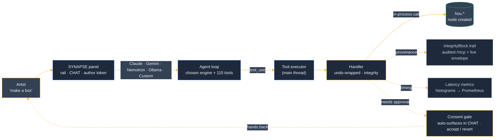
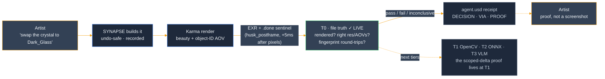
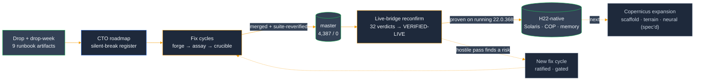
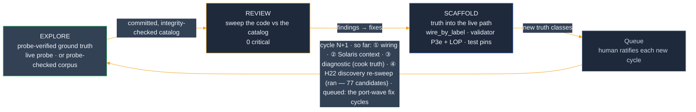
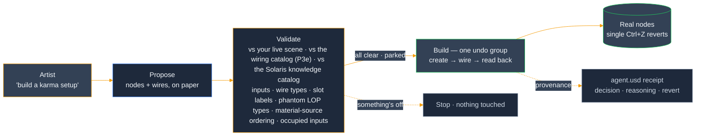
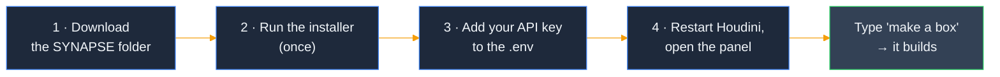
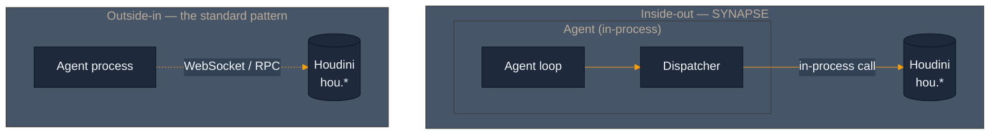

<p align="center">
  
</p>

<h3 align="center"><strong>Talk to Houdini in plain English — it builds in your live scene.</strong></h3>

<p align="center"><em>An AI copilot that lives <strong>inside</strong> Houdini — say what you want and watch it build in your scene. Everything it makes is a normal Houdini action, so <strong>Ctrl+Z</strong> takes it back.</em></p>

<p align="center">
  <a href="https://github.com/JosephOIbrahim/Synapse/actions/workflows/ci.yml"></a>
  <a href="LICENSE"></a>
  <a href="python/synapse/panel/synapse_panel.py"></a>
  <a href="python/synapse/panel/providers"></a>
  <a href="tests"></a>
  <a href="CHANGELOG.md"></a>
</p>

> ⚡ **TL;DR** — an AI panel *inside* Houdini: type **"make a box,"** get a real node. Every action is ordinary Houdini, so **Ctrl+Z** takes it back — and it's all recorded (receipts, not magic). Five engines, 115 tools. **Install ↓ in ~5 min.**

> 🧪 **The moat, in one line:** every other Houdini copilot reasons from docs and memory — SYNAPSE **probes the running Houdini and commits what it finds** (six truth catalogs and counting: wiring, Solaris context, capability, readiness, live cook behavior, and now **perception truth — the render receipt**). Docs drift. Probes don't.

---

### ✦ The idea, in plain terms

SYNAPSE lives **inside** Houdini and turns plain English into real work:

- 🧠 **It works inside Houdini, not off to the side** — the assistant runs in Houdini itself, so there's no separate app to launch and nothing to wait on; it answers right where you're working.
- 🔁 **Your words become real nodes** — every request is just a normal Houdini action. Don't like it? **Ctrl+Z** takes it back.
- 🧾 **It keeps the receipts** — every change is undo-safe *and* recorded, so you can always see what it did and why. That's the differentiator — not magic, receipts.
- 🔌 **Pick your AI · 115 tools** — choose **Claude · Gemini · NVIDIA Nemotron · Ollama (local) · Custom** in the panel and switch whenever you like.
- 📜 **Free to use (MIT license)** ([LICENSE](LICENSE)) with **patent-pending methods** ([PATENTS](PATENTS)) — the license covers the code, not the patents.

---

### ✦ Map — you are here

| You want… | Read… |
|---|---|
| **The 30-second pitch** | *The idea, in plain terms* (above) + *What it is* |
| **What's new in v5.28.0** | *New in v5.28.0* — RETINA T0: the render receipt's first tier is live |
| **How AI network-building stays safe** | *Propose → validate → build* |
| **To install it** | *Install — 5 minutes* |
| **The architecture** | *How it works — inside-out* |
| **Every release + per-tool detail** | [CHANGELOG.md](CHANGELOG.md) |

---

## ✦ What it is

A docked **SYNAPSE panel** inside Houdini. You type what you want — *"make a box"*, *"create a solaris network ending with rendersettings using karma xpu"* — and it **builds it in your live scene.** Chat in, real nodes out.

- ⚡ **In-process** — the agent runs in Houdini's own Python; tools are direct `hou.*` calls, not a slow round-trip bridge.
- ↩️ **Undo-safe** — everything it does is an ordinary Houdini action. **Ctrl+Z undoes it.** Every mutation leaves a provenance record.
- 🔌 **Multi-provider** — pick **Claude · Gemini · NVIDIA Nemotron · Ollama · Custom** right in the panel; swap engines mid-session.
- 🎬 **Built for the work** — SOPs, **Solaris / USD, Karma, COPs, PDG / TOPs, MaterialX** — 115 tools.

> ✅ *"make a box" → a real geo node, confirmed on graphical Houdini 22.0.368 (H21.0.671 dual-build supported).*



**The panel, briefly (v9.1):** a persistent rail (live state + a real **Stop**), one **CHAT** surface where the build review + **consent gate auto-surface** when a build needs approval — consent comes to you, then hands back on accept/revert — the **author token** (engine + model in one rail control), an **`Aa`** control that scales only what you *read*, a bundled **Space Grotesk / Space Mono** type system, a token-only meter, and a **`/`** command palette over every tool.

---

## ✦ New in v5.28.0 — RETINA T0: the render receipt's first tier is live

**The frame now gets a receipt. Given a render SYNAPSE asked for, T0 answers "did it actually happen, as declared" — proven against your running Houdini, not inferred. The first working tier of the perception co-processor.**

- 📄 **T0 file-truth, working** — products written and non-zero, the completion sentinel present, product count + resolution + AOV list matching what was asked, the expectation fingerprint round-tripped. It kills the class of bug where a render *silently doesn't happen* — missing AOVs, wrong resolution, an empty file — and passes as success.
- 🔬 **A perception-truth catalog, live-probed** — the render surface verified on the running 22.0.368, not guessed: the Karma object-ID AOV (`float32`, **CPU + XPU parity** — the flagship scoped-delta proof's matte source), the sentinel timing (the `.done` marker fires **+5ms after pixels**, confirming the design correction the HDK pass caught on paper), multi-part EXR with per-AOV formats read from the header, and a **free receipt** — the fingerprint travels *inside the frame it notarizes*.
- 🛑 **The crucible caught a receipt that would have lied** — the first build passed its own 4,431 tests, but its completion sentinel was *dead on the real render path* (wrong Python namespace), so it would have declared **every honest render a failure** — the single most on-the-nose bug a receipt system could ship. Caught before merge, fixed, and live-proven: a real render now drops a real receipt. Third time this cycle the "attack what you didn't build" separation stopped a plausible-looking lie.
- 🧱 **Host-safe by construction** — the perception worker lives *outside* the Houdini process (zero `hou`, zero OpenCV in-host, enforced by a collection-time lint); the whole tier is testable without Houdini running. The host hooks restore every parameter after a render, so the render is byte-identical to an un-watched one.
- 🟢 **4,436 tests passing** (+47, zero failures) — with one bounded honesty gap shipped *disclosed* (a per-check boolean edge when everything is missing; the overall verdict is still correct), deposited as a one-line ratified follow-up.



> *The full picture — the perception catalog, the dead-sentinel catch, the tier ladder, and what M2 (OpenCV + T1) brings next — is [in CHANGELOG.md](CHANGELOG.md) (top entry) and `docs/SYNAPSE_RETINA_BLUEPRINT.md`.*

---

## ✦ H22 — running, verified, expanding

**Houdini 22 isn't a milestone SYNAPSE is approaching — it's the build SYNAPSE runs on, with the core transition proven live and the generative expansion spec'd next.**

- 🔬 **Verified against a running Houdini, not just headless** — the live-bridge reconfirm converted the whole drop cycle from provisional to confirmed on the real 22.0.368 interpreter: every merged fix, the memory integrity gate, the PDG event surface, the quarantine re-pins.
- 🧩 **The Solaris wiring layer is H22-native** — a major-aware connectivity catalog (mirroring the per-major symbol-table pattern) means `wire_by_label` and the graph validator resolve H22 truth on H22 and H21 truth on H21, so proposed networks validate against the build you're actually running.
- 📋 **The port-wave plan** ([`docs/PORT_WAVE_MANIFEST.md`](docs/PORT_WAVE_MANIFEST.md)) — all 115 registry tools mapped into 11 sub-waves, each gated: gatewarden admits → forge builds in an isolated worktree → an assayer probes every symbol against the live build → a hostile crucible pass hunts for behavior drift → a human merges. The pilot wave is merged; the rest are unblocked and sequenced.
- 🌋 **The Copernicus expansion, spec'd and ratified** ([`docs/SYNAPSE_COPERNICUS_EXPANSION.md`](docs/SYNAPSE_COPERNICUS_EXPANSION.md)) — the read/analysis and node-API layers are deep and live-verified; the generative frontier (scaffold rebuilds, heightfield/terrain emission, neural COP nodes with model/GPU preflight honesty) is now a live-probed build spec, the next cycle's work.
- 🤝 **APEX MCP boundary contract** — Houdini 22 keynote-announced a rigging-scoped first-party MCP preview (not shipped in 22.0). The ratified boundary ([`docs/SYNAPSE_H22_BOUNDARY.md`](docs/SYNAPSE_H22_BOUNDARY.md)) holds: SYNAPSE never competes with it; its differentiators — in-process perception, undo-wrapped mutation, provenance, substrate memory — remain unclaimed by anything SideFX shipped.
- 🌀 **Cook-behavior diffs, live** — the diagnostic-truth catalogs are build-stamped and major-agnostic; on H22 they re-probed with zero code edits, turning *how H22 changed cook behavior* into a diffable artifact instead of forum anecdotes.

**The discipline that got here:** nothing merged on any agent's self-report — forge builds, a hostile crucible pass attacks what it didn't build, and every cycle is post-merge suite-re-verified. When a "loud-error" fix was caught only ⅓-implemented, it looped to a Pass-3 rather than shipping. Receipts, not vibes — including the agent's own.



---

## ✦ The utility flywheel — probe-verified truth on a loop

**SYNAPSE improves itself on a loop: ground the AI's Houdini knowledge in probe-verified truth → review its own code against that truth → wire the truth into the live path.** Nothing enters the live path on memory alone — memory drifts; probes don't. Every cycle runs the same **EXPLORE → REVIEW → SCAFFOLD** contract; a human ratifies each new cycle; and where a catalog and a code comment disagree, **the catalog wins**.

**Three cycles have shipped — three kinds of truth** (with capability + readiness catalogs behind them):

- 🔌 **① Wiring truth — *how* nodes connect.** `host/introspect_connectivity.py` instantiates **282 node types** headless and records their real input/output counts + slot labels → a committed, integrity-checked catalog. `wire_by_label()` (`python/synapse/core/wiring.py`) then resolves inputs by **probed label, never remembered index** (fail-loud on an unknown label/type), and the validator's **slot-semantic checks (P3e)** reject an edge into an input the type doesn't have. *Receipts: the review sweep ran **141 sites, 0 critical**; the cycle fixed **2 known miswires** (swapped solver inputs).*
- 🧭 **② Solaris context truth — *what* the nodes are.** A corpus-authored, probe-cross-checked **LOP / Solaris knowledge catalog** teaches the validator the semantics wiring truth can't see. It **hard-rejects phantom LOP types** the model reaches for out of SOP habit — there is no `grid` or `plane` LOP (use a `cube`) — and **advises** when an `assignmaterial` has no material source upstream (a `materiallibrary`, *or* a `reference`/`sublayer` layer that already authors the materials). *Receipts: **20 checks, 0 critical**; the ordering rule was hardened from a hard error to an advisory after adversarial review caught it would false-reject valid reference/sublayer material graphs.*
- 🌀 **③ Diagnostic truth — what the scene *does* when poked** *(new in v5.21.0)*. Perturbation probes catalog live **dirty-propagation, recook triggers, and time-dependence** per context (SOP/LOP/COP/DOP) — the one truth class no external LLM can hold, because it only exists as live cook-state. *Receipts: the API probe caught the track's own spec citing **H18-era phantom spellings** (the cook surface lives on `hou.OpNode`, not `hou.Node`); the catalog's first run captured a real divergence — **a COP rewire dirties upstream nodes SOP semantics say it shouldn't**. Staged next on this catalog: `synapse_explain_recook` — ask "why did this recook?" and get an answer cited to a probe trial.*



---

## ✦ Propose → validate → build — how AI network-building stays safe

**SYNAPSE never builds a network on the model's word alone.** Every plan is checked against your live scene *and* probed ground truth before a single node is created — and the build itself is one undo group.

- 📝 **Propose** — the model lays the whole network out first: every node, every wire, on paper.
- 🔎 **Validate against your live scene** — every input exists, every wire fits its input type, the parent network and every referenced node are really there, the plan is a DAG, and names don't collide. If a wire would land on an input you've *already* connected, validation **halts** — it never quietly severs your work.
- 📐 **Validate against probed truth (P3e)** — the wiring catalog rejects an edge into an input index the node type doesn't have, and a slot label that resolves to a different index. Memory doesn't get a vote; the probe does.
- 🧭 **Validate against Solaris knowledge** — a corpus-authored, probe-cross-checked catalog rejects **phantom LOP types** (there is no `grid`/`plane` LOP — use a `cube`) and flags a missing material source upstream of `assignmaterial`. Context the wiring truth can't see.
- 🔨 **Build — one undo group** — an unconditional TOCTOU re-validate first (a node deleted since propose halts with zero mutation), then create → set parms → wire → read back, all inside a single `hou.undos.group`. **One Ctrl+Z reverts the whole build.**
- 🛟 **Rollback on failure** — if the build trips mid-way, it destroys the partial nodes inside the undo group. Zero net mutation, a structured `FAILED` result, no orphan nodes.
- 🧾 **Receipts** — every build writes an `agent.usd` record: decision, reasoning, revert path.

It also wires **Solaris the way production expects** — live-probed against 21.0.671: the **Component Builder** pattern for assets, the proper **`rendersettings` → render** terminal, **layered** scene assembly, the real H21 light nodes (the per-shape light names don't exist), and the actual merge/sublayer strength rule (**higher input index wins**).

Verified end-to-end on **live Houdini 22.0.368** (originally proven on 21.0.671) — build, single-undo revert, TOCTOU halt, and forced-failure rollback all pass; the wiring catalog is now major-aware, so validation resolves against whichever build you run.



---

## ✦ Earlier releases — the short version

**Each row is one release's headline; the full record lives in [CHANGELOG.md](CHANGELOG.md).**

| Release | Headline |
|---|---|
| **v5.27.0** | **RETINA: the render receipt begins (M0)** — the governing blueprint for perception truth (truth cycle ⑤) committed and reconciled clean; a zero-cv2 host boundary pin *before* any perception code; two official-doc cross-references (HDK/HAPI) that caught a `.done`-sentinel design flaw on paper. A documentation-and-boundary foundation release. |
| **v5.26.0** | **H22 live-verified** — the whole transition proven against a *running* Houdini 22.0.368: 32 verdicts flipped provisional→verified-live, the memory integrity gate confirmed at fidelity 1.0 on the reorganized USD, and the last two silent breaks closed (Copernicus solver blocks + the major-aware wiring fold that makes Solaris network-building H22-native). A new `sidefx-cto` vendor-architect lens; an external "engineering memo" adjudicated-not-obeyed. |
| **v5.25.0** | **H22 has landed** — Houdini 22.0.368 dropped and SYNAPSE ran its own port machinery against it for the first time: the nine-step drop-week runbook complete, a three-lens CTO roadmap over 77 doc-scouted candidates, and the first two cycles merged (the Copernicus `planes()` silent-data-loss fix + the pilot Dispatcher port wave). H21 uninstalled; H22 the only live target. |
| **v5.24.0** | **The H22 drop-harness, reconciled** — a fresh drop-day blueprint arrived describing work that mostly already shipped; it was reconciled against reality (two gate-breaking conflicts caught before any write) rather than executed literally, and five genuinely-missing Phase-0 hardening gaps were built: a read-only mode guard, a new-family re-sweep spec, the scope fence extended to H22 rigging names, a theme-source seam, and the perception "before photo." No artist-facing behavior changed. |
| **v5.23.0** | **One Moneta · honest claims · the H22 blueprint harness** — the docs realigned to the code (Moneta *is* the memory substrate), the test badge dropped to its real green-floor, the local-first security posture stated plainly, and the H22 gap-closure blueprint got a one-command orchestrator that stops at every human gate. A documentation-integrity + H22-prep release; no product code changed. |
| **v5.22.0** | **The honest envelope + evidence-based anchors + the drop-day runbook** — receipts on *both* roads into Houdini (the audited `/mcp` bridge **and** the live panel path, recorded honestly, never faked); integrity flags now derived from runtime evidence instead of self-report (fidelity 1.0 = *verified*); composition validation extended to `payload` / `inherit` / `specialize` arcs; and the H22 drop compressed to one ordered, human-gated page. |
| **v5.21.0** | **Diagnostic truth + the self-protecting harness + the readiness verdict** — the scene interrogated live (dirty-propagation / recook / time-dependence cataloged per context — the truth class no external LLM can hold), the harness that guards its own green (full-suite ratchet, posture-scoped red-driver, fix-is-real probes), and an honest **READY (solo posture)** verdict with the trade-offs named instead of hidden. |
| **v5.20.0** | **H22 drop-day machine + utility flywheel + panel v9/v9.1** — the API-delta probe (proven empty on H21, caught 15 phantom spellings in our own emitters), the self-improving probe→review→wire loop, and the five-engine panel: **Claude · Gemini · NVIDIA Nemotron · Ollama · Custom**, the author token, one CHAT surface where **consent auto-surfaces** (v9.1), bundled Space Grotesk/Mono, a token-only meter. |
| **v5.19.0** | **The build half landed** — a validated proposal becomes real nodes under one undo group, with mid-build rollback. Plus the Solaris production-wiring correction (phantom per-shape lights purged, merge/sublayer strength rule live-probed). |
| **v5.18.0** | **Whole-graph validation** — every proposed node + wire checked against the live scene before anything is built; the occupied-input guard halts rather than sever artist wiring. |
| **v5.17.x** | **PDG cook-watcher fixed** (phantom event-handler idiom replaced with the real one) · **Solaris/USD parm names live-grounded** — silently-no-op'd light writes now land · **latency visibility** — the LLM turn is ~95% of each step, Houdini ops run 1–70 ms; the audit fsync moved off the hot path · license split so GitHub detects **pure MIT**. |
| **v5.16.0** | **Multi-provider selector** (first three engines) · prompt caching · one-call render-ready Solaris builds. |

---

## ✦ Install — 5 minutes

*Artists:* the steps below get you chatting — no command line beyond a copy-paste. *Developers* who want the editable install + test suite: [`docs/getting-started/installation.md`](docs/getting-started/installation.md).

Tested on **Windows 11 + Houdini 22.0.368** (H21.0.671 dual-build supported). macOS / Linux: same steps, different slashes.



**1 · Get the files** *(~1 min)* — green **Code ▸ Download ZIP**, unzip somewhere stable (e.g. `C:\Users\<you>\SYNAPSE`).
*Prefer git?* `git clone https://github.com/JosephOIbrahim/Synapse.git`
> ✅ **You should see** a `SYNAPSE` folder containing `python/`, `scripts/`, and `README.md`.

**2 · Tell Houdini about it** *(~1 min, once):*

```powershell
python scripts/install_synapse_package.py
```

The installer **auto-detects your Houdini prefs directory** and writes a package file pointing at this repo (`--pref-dir` overrides, `--dry-run` previews).
*No Python on PATH? Use Houdini's:* `& "C:\Program Files\Side Effects Software\Houdini 22.0.368\bin\hython.exe" scripts/install_synapse_package.py` *(match your installed build/version.)*
> ✅ **You should see** a success line ending in the wired `python/` path — and **no** traceback.

**3 · Add your Claude key** *(~2 min)* — make one at **console.anthropic.com** (`sk-ant-…`), then put it in a **`.env` at the repo root** (gitignored, auto-loaded). This keeps the key **scoped to SYNAPSE** — it is *not* set as a system-wide `ANTHROPIC_API_KEY`, so it can't collide with or bill other Anthropic tools on your machine.
*Other engines* go in the same `.env`. **Ollama needs no key** (it's your local server), and **Custom** is configured right in the panel (base URL · model · key).

```
ANTHROPIC_API_KEY=sk-ant-...
GEMINI_API_KEY=AIza...
NVIDIA_API_KEY=nvapi-...
```

**4 · Restart Houdini** *(~1 min)* → **New Pane Tab ▸ SYNAPSE** → type **"make a box."**
> ✅ **You should see** the **SYNAPSE** entry in the New Pane Tab menu, and *"make a box"* create a real geo node you can **Ctrl+Z**.

That's the whole loop — **start to chatting in ~5 minutes.** Everything is an ordinary Houdini action — **Ctrl+Z undoes it**.

<details>
<summary><strong>Troubleshooting</strong></summary>

| Symptom | Likely cause | Fix |
|---|---|---|
| **SYNAPSE isn't in the Pane Tab menu** | Houdini loads packages only at launch | Fully restart Houdini; confirm the installer reported success. |
| **"No API key" / won't connect** | The key line is missing from the repo-root `.env`, or Houdini was already open when you added it | Confirm the `ANTHROPIC_API_KEY` (and any `GEMINI_API_KEY` / `NVIDIA_API_KEY`) line in the `.env` at the repo root, then **relaunch Houdini from scratch** — the `.env` loads at startup. Verify in Houdini's Python Shell: `from synapse.host import auth; import os; print(bool(os.environ.get('ANTHROPIC_API_KEY')))` → `True`. |
| **`ModuleNotFoundError: No module named 'synapse'`** | The package path wasn't wired, or Houdini wasn't restarted | The installer prints the path it wired — confirm it points at the repo's `python/` directory, then restart Houdini. |
| **Panel loads but says it can't reach Houdini** | The in-process bridge server isn't up yet | Click **Connect** in the panel rail (one click force-starts it). |

</details>

---

## ✦ How it works — inside-out

Most AI-for-DCC tools run the agent in a **separate process** and reach in through a bridge — every call a round-trip, every tool a marshalling problem. **SYNAPSE inverts that:** the agent loop runs *inside* Houdini's own interpreter, dispatching tools as direct in-process calls against `hou`. The same pattern composes across the portfolio (a **Nuke** host, **Octavius**, the **Cognitive Bridge**).



The `cognitive/` layer is **pure Python** (zero `hou` imports, lint-enforced); `host/` is the Houdini-specific layer that swaps per DCC. Every mutation is undo-wrapped, main-thread-safe, and leaves a provenance receipt.

**Deeper dive + the full per-version history:** **[CHANGELOG.md](CHANGELOG.md)**.

---

## ✦ Project status

**Shipping (v5.28.0):**

- 🎛️ **Artist panel v9.1** — five engines, undo-safe, 115 tools, a single **CHAT** surface where the review + consent gate auto-surface, live observability + latency instrumentation (WCAG/usability **G3-audited on H22's Qt 6.8.3**).
- 👁️ **RETINA — the render receipt (T0 live)** — the perception co-processor's first working tier: T0 file-truth verifies a render actually happened as declared (products, resolution, AOVs, completion sentinel, fingerprint), against a live-probed perception-truth catalog (truth cycle ⑤). The worker lives outside the Houdini process (zero `hou`, zero OpenCV in-host). The dead-`.done`-sentinel bug the crucible caught pre-merge is the receipt-honesty thesis proving itself.
- 🔬 **H22 live-verified** — the whole transition proven against a running Houdini 22.0.368: 32 verdicts flipped provisional→verified-live, the memory integrity gate confirmed at fidelity 1.0 on the reorganized USD, the PDG event surface and quarantine re-pins re-confirmed on the real interpreter.
- 🧩 **H22-native network building** — a major-aware connectivity catalog: `wire_by_label` + graph validator resolve H22 wiring on H22 and H21 wiring on H21, so proposed Solaris/COP networks validate against the build you're running (the demo-critical set-dressing path, live-verified on both majors).
- 🔨 **Propose → validate → build** — the full pipeline, gated on probed wiring truth.
- 🧾 **The honest envelope** — both roads into Houdini leave `IntegrityBlock` receipts: the audited `/mcp` bridge, and path-qualified, never-faked live-path records the self-tuning advisor can see.
- 🔁 **Utility flywheel** — ratified cycles across wiring · Solaris context · diagnostic cook-truth · the H22 connectivity re-fold, self-improving on a human-ratified loop.
- 🟢 **Self-protecting harness** — full-suite green ratchet on every sprint (**4,436 / 0**), a posture-scoped red-driver, fix-is-real behavioral probes, and forge-builds-crucible-attacks separation that caught a ⅓-implemented "loud-error" fix before it shipped.
- 🕵️ **Vendor-architect lens** — the `sidefx-cto` agent surfaces the non-obvious second-order changes a major brings; its first pass caught the memory-gate gap this release then closed live.
- 🌋 **Copernicus expansion, spec'd** — read/analysis + node-API layers deep and live-verified; the generative frontier (scaffold rebuilds, terrain emission, neural COP nodes with preflight honesty) is a live-probed build spec, next up.
- 🤝 **APEX MCP boundary held** — Houdini 22 keynote-announced a rigging-scoped MCP preview (not shipped); the ratified non-competing boundary stands unchanged.
- ⚙️ **In-process substrate** — two-tier provenance (audit write off the hot path), freeze-safety, bounded autonomy + a kill switch.

SYNAPSE is honest about its gaps — scaffolds self-report instead of faking success. The per-tool capability audit + full version record live in **[CHANGELOG.md](CHANGELOG.md)**.

---

## ✦ Dependencies

**Core — works standalone.** A clean clone runs without anything exotic. Memory persists to a plain **JSONL** file (the live default), and the **Anthropic SDK is vendored** into the repo (`python/synapse/_vendor/`) — no `pip install anthropic` required. Add a provider key and go.

**Optional — Moneta.** Moneta is a private, encrypted memory substrate (repo `JosephOIbrahim/Moneta`). It's **built but default-OFF** — JSONL stays the default until you opt in:

- Flip it with the **`SYNAPSE_MEMORY_BACKEND`** env var → `moneta` (Moneta-backed) or `shadow` (JSONL primary + Moneta dual-write for parity). Any unknown value — or Moneta not being importable — **falls back to `jsonl` with a warning**, so the flag can never break startup.
- The package isn't bundled. CI checks it out via the **`MONETA_DEPLOY_KEY`** secret: when that secret is configured ~70 Moneta-gated tests run; when it's absent those steps and tests skip and **CI stays green**. Wiring details in [`docs/MONETA_FOLLOWUPS.md`](docs/MONETA_FOLLOWUPS.md).

---

## ✦ Repository layout

<details>
<summary><strong>Show the tree</strong></summary>

```
python/synapse/
├── cognitive/                  # zero hou imports (lint-enforced)
│   ├── dispatcher.py           # Dispatcher + AgentToolError
│   ├── agent_loop.py           # Anthropic SDK turn runner
│   ├── graph_validator.py      # whole-graph validation (P3/P4/P5 + P3e slot semantics)
│   ├── tools/                  # pure-Python tool implementations + committed truth catalogs
│   └── ws_passthrough.py       # H22 port wave: legacy WS handler wrapped as an in-process Dispatcher tool (2 of 11 sub-waves merged)
├── host/                       # Houdini-specific (hou / hdefereval OK)
│   ├── daemon.py               # SynapseDaemon lifecycle
│   ├── auth.py                 # API key resolver (.env + env var + hou.secure probe)
│   ├── graph_builder.py        # build half — one undo group, TOCTOU re-check, rollback
│   ├── tops_bridge.py          # PDG event bridge (perception, Phase A)
│   └── scene_load_bridge.py    # auto-warm on AfterLoad (Phase B)
├── providers/apex_mcp.py       # H22 APEX MCP truth-contract envelope (boundary-ratified)
├── memory/                     # Moneta-backed memory substrate
├── panel/                      # artist-facing copilot panel (Qt / PySide6)
│   ├── providers/              # five engines — anthropic / gemini / nemotron / ollama / custom (raw http.client, no SDK)
│   ├── synapse_panel.py        # the docked panel — rail + author token, single CHAT surface (consent auto-surfaces), "/" palette, Connect, honest Stop
│   ├── claude_worker.py        # background QThread — streams the engine + tool loop
│   ├── tool_executor.py        # main-thread tool dispatch (per-tool timeouts)
│   └── designsystem/           # vendored tokens / qss / components + bundled Space Grotesk/Mono
├── server/                     # live transport + safety wiring
│   ├── freeze_chain.py         # process-wide watchdog: 5s detect → 30s escalate → halt
│   ├── solaris_graph_templates.py  # one-call render-ready Solaris topologies
│   └── handlers*.py            # command handlers — inline undo, cross-client mutation lock
├── core/                       # canonical tables — timeouts.py (per-tool budgets) · wiring.py (wire_by_label vs the probed catalog)
└── _vendor/                    # anthropic + deps, CP311 win_amd64

host/                           # repo-root live-introspection probes (nodetypes · connectivity · runtime symbols · cook API · cook-truth perturbation trials)
scripts/                        # installer · h22_api_delta.py drop-day probe · flywheel_review_{wiring,lop}.py · mine_lop_knowledge.py
tests/                          # 4,436 passing (Moneta-gated tests skip on a clean clone)
harness/                        # the self-verifying loop — five tracks (H22 · v6 · context · studio · diagnostic), boundary guardrails, the full-suite green ratchet, the readiness verdict
docs/                           # installation · upgrade · boundary contract · coexistence · reviews
mcp_server.py                   # WebSocket adapter for external MCP clients
```

</details>

> **Security posture — local-first, single-user.** The MCP surface (`mcp_server.py` / the in-Houdini `hwebserver` `/mcp` handler in `python/synapse/mcp/server.py`) enforces Origin validation (DNS-rebinding protection) and supports Bearer-token auth, with `SYNAPSE_DEPLOY_MODE` defaulting to `local`. The design target is a single artist on localhost; a handler-layer consent gate is the documented prerequisite before any multi-user or studio deployment.

---

## License

**MIT** — see [LICENSE](LICENSE). Use, modify, and ship the source freely under copyright.

Certain methods are **patent-pending** (documented separately in [PATENTS](PATENTS)). The MIT grant covers **copyright, not patents** — the patent notice doesn't change the MIT terms, and MIT grants no license under any patent claims.
