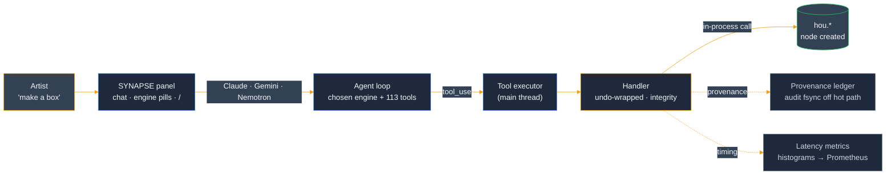
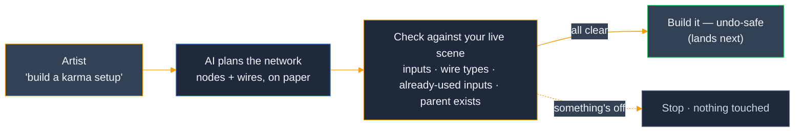
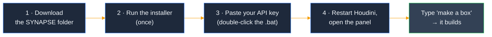
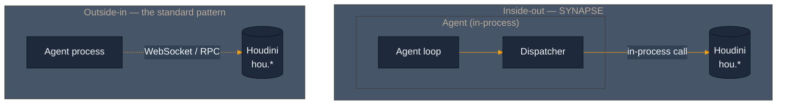

<p align="center">
  
</p>

<h3 align="center"><strong>Talk to Houdini in plain English — it builds in your live scene.</strong></h3>

<p align="center"><em>An AI copilot that lives <strong>inside</strong> Houdini — say what you want and watch it build in your scene. Everything it makes is a normal Houdini action, so <strong>Ctrl+Z</strong> takes it back.</em></p>

<p align="center">
  <a href="https://github.com/JosephOIbrahim/Synapse/actions/workflows/ci.yml"></a>
  <a href="LICENSE"></a>
  <a href="python/synapse/panel/synapse_panel.py"></a>
  <a href="python/synapse/panel/providers"></a>
  <a href="tests"></a>
  <a href="CHANGELOG.md"></a>
</p>

---

### ✦ The idea, in plain terms

SYNAPSE lives **inside** Houdini and turns plain English into real work:

- 🧠 **It works inside Houdini, not off to the side** — the assistant runs in Houdini itself, so there's no separate app to launch and no waiting on a server.
- 🔁 **Your words become real nodes** — every request is just a normal Houdini action. Don't like it? **Ctrl+Z** takes it back.
- 🧾 **It keeps the receipts** — every change is recorded, so you can always see what it did and why.
- 🔌 **Pick your AI · 113 tools** — choose **Claude · Gemini · NVIDIA Nemotron** in the panel and switch whenever you like.
- 📜 **Free to use (MIT)** ([LICENSE](LICENSE)) with **patent-pending methods** ([PATENTS](PATENTS)) — the license covers the code, not the patents.

---

## ✦ What it is

A docked **SYNAPSE panel** inside Houdini. You type what you want — *"make a box"*, *"create a solaris network ending with rendersettings using karma xpu"* — and it **builds it in your live scene.** Chat in, real nodes out.

- ⚡ **In-process** — the agent runs in Houdini's own Python; tools are direct `hou.*` calls, not a slow round-trip bridge.
- ↩️ **Undo-safe** — everything it does is an ordinary Houdini action. **Ctrl+Z undoes it.** Every mutation leaves a provenance record.
- 🔌 **Multi-provider** — pick **Claude · Gemini · NVIDIA Nemotron** right in the panel; swap engines mid-session.
- 🎬 **Built for the work** — SOPs, **Solaris / USD, Karma, COPs, PDG / TOPs, MaterialX** — 113 tools.

> ✅ *"make a box" → a real geo node, confirmed in graphical Houdini 21.0.671.*



**The panel, briefly:** a persistent rail (live state + a real **Stop**), two tabs under a same-pane law (**Direct** chat · **Work** glance), an **`Aa`** control that scales only what you *read*, typography that inherits Houdini's own UI font, and a **`/`** command palette over every tool.

---

## ✦ New in v5.18.0

**Now it checks its plan against your real scene — *before* it builds.** When you ask for a network, SYNAPSE lays the whole thing out first (every node, every wire) and **checks it against your live Houdini scene** before creating a single node. It catches the impossible before it can touch your work:

- 🔌 **No dead-end wires** — a connection into an input a node doesn't have, or a wire whose type can't fit, is caught up front.
- 🛟 **It won't unplug your work** — if a wire would land on an input you've *already* connected, SYNAPSE stops instead of quietly overwriting it.
- 🧭 **No nodes into thin air** — it confirms the parent network and every existing node it points at really exist in your scene.

Every check was verified against **live Houdini 21.0.671**. *This is the checking half of AI network-building — the step that actually creates the nodes lands next.*



---

## ✦ New in v5.17.0

Three things landed this release — all verified on **Houdini 21.0.671**:

- 🛠️ **PDG perception bug fixed.** The AI can now watch PDG / TOPs cooks. A phantom event-handler call was crashing the cook-watcher on H21; it now uses the real Houdini idiom. *(Old "crash, fix pending" note — now fixed.)*
- 🎯 **It double-checks Houdini's real parameter names instead of guessing.** Light and USD parameter spellings used to be guessed — sometimes wrong, so the value was *silently never set*. Now they're checked against live Houdini, so Solaris light and geometry params actually take. **One new tool** (set a USD *primvar*) brings the count to **113**.
- 👁️ **You can see where the time goes.** New timing readouts across the live path. It turns out the AI's own thinking is ~95% of each step and the Houdini ops are 1–70ms — so the panel can now point at a slow step instead of leaving you guessing, and the audit-write that used to sit in the way moved out of it. *This is visibility, not a speed-up — nothing here makes Houdini run faster.*

Plus forward-looking **Houdini 22 prep** — encoding clean-ups and ABI / compatibility guards so the eventual jump to H22 is less of a cliff. *(The H22 bits are prep, not yet tested on H22.)*

---

## ✦ Install — 5 minutes

*Artists:* the steps below get you chatting — no command line beyond a copy-paste. *Developers* who want the editable install + test suite: [`docs/getting-started/installation.md`](docs/getting-started/installation.md).

Tested on **Windows 11 + Houdini 21.0.671**. macOS / Linux: same steps, different slashes.



**1 · Get the files** *(~1 min)* — green **Code ▸ Download ZIP**, unzip somewhere stable (e.g. `C:\Users\<you>\SYNAPSE`).
*Prefer git?* `git clone https://github.com/JosephOIbrahim/Synapse.git`
> ✅ **You should see** a `SYNAPSE` folder containing `python/`, `scripts/`, and `README.md`.

**2 · Tell Houdini about it** *(~1 min, once):*

```powershell
python scripts/install_synapse_package.py
```

*No Python on PATH? Use Houdini's:* `& "C:\Program Files\Side Effects Software\Houdini 21.0.671\bin\hython.exe" scripts/install_synapse_package.py` &nbsp;·&nbsp; *(`--dry-run` previews.)*
> ✅ **You should see** a success line ending in the wired `python/` path — and **no** traceback.

**3 · Paste your Claude key** *(~2 min)* — make one at **console.anthropic.com** (`sk-ant-…`), then **double-click `set_anthropic_key.bat`**, paste, Enter.
*Want Gemini / Nemotron too?* Add their keys to a `.env` at the repo root (gitignored, auto-loaded):

```
ANTHROPIC_API_KEY=sk-ant-...
GEMINI_API_KEY=AIza...
NVIDIA_API_KEY=nvapi-...
```

**4 · Restart Houdini** *(~1 min)* → **New Pane Tab ▸ SYNAPSE** → type **"make a box."**
> ✅ **You should see** the **SYNAPSE** entry in the New Pane Tab menu, and *"make a box"* create a real geo node you can **Ctrl+Z**.

That's the whole loop — **start to chatting in ~5 minutes.** Everything is an ordinary Houdini action — **Ctrl+Z undoes it**.

<details>
<summary><strong>Troubleshooting</strong></summary>

| Symptom | Likely cause | Fix |
|---|---|---|
| **SYNAPSE isn't in the Pane Tab menu** | Houdini loads packages only at launch | Fully restart Houdini; confirm the installer reported success. |
| **"No API key" / won't connect** | On Windows a freshly-set key only reaches apps started *after* you set it | Re-run `set_anthropic_key.bat` (or confirm the `GEMINI_API_KEY` / `NVIDIA_API_KEY` line in `.env`), then **relaunch Houdini from scratch**. Verify in Houdini's Python Shell: `import os; print(bool(os.environ.get('ANTHROPIC_API_KEY')))` → `True`. |
| **`ModuleNotFoundError: No module named 'synapse'`** | The package path wasn't wired, or Houdini wasn't restarted | The installer prints the path it wired — confirm it points at the repo's `python/` directory, then restart Houdini. |
| **Panel loads but says it can't reach Houdini** | The in-process bridge server isn't up yet | Click **Connect** in the panel rail (one click force-starts it). |

</details>

---

## ✦ How it works — inside-out

Most AI-for-DCC tools run the agent in a **separate process** and reach in through a bridge — every call a round-trip, every tool a marshalling problem. **SYNAPSE inverts that:** the agent loop runs *inside* Houdini's own interpreter, dispatching tools as direct in-process calls against `hou`. The same pattern composes across the portfolio (**Moneta**/Nuke, **Octavius**, the **Cognitive Bridge**).



The `cognitive/` layer is **pure Python** (zero `hou` imports, lint-enforced); `host/` is the Houdini-specific layer that swaps per DCC. Every mutation is undo-wrapped, main-thread-safe, and leaves a provenance receipt.

**Deeper dive + the full per-version history:** **[CHANGELOG.md](CHANGELOG.md)**.

---

## ✦ Project status

**Shipping (v5.18.0):** the artist panel (multi-provider, undo-safe, 113 tools, live observability + latency instrumentation), the in-process substrate, two-tier provenance with the audit write off the hot path, freeze-safety, bounded autonomy + a kill switch, live-grounded Solaris / USD parameter names, and an H22-readiness harness. SYNAPSE is honest about its gaps — scaffolds self-report instead of faking success, and the per-tool capability audit + the full version record live in **[CHANGELOG.md](CHANGELOG.md)**.

---

## ✦ Dependencies

**Core — works standalone.** A clean clone runs without anything exotic. Memory persists to a plain **JSONL** file (the live default), and the **Anthropic SDK is vendored** into the repo (`python/synapse/_vendor/`) — no `pip install anthropic` required. Add a provider key and go.

**Optional — Moneta.** Moneta is a private, encrypted memory substrate (repo `JosephOIbrahim/Moneta`). It's **built but default-OFF** — JSONL stays the default until you opt in:

- Flip it with the **`SYNAPSE_MEMORY_BACKEND`** env var → `moneta` (Moneta-backed) or `shadow` (JSONL primary + Moneta dual-write for parity). Any unknown value — or Moneta not being importable — **falls back to `jsonl` with a warning**, so the flag can never break startup.
- The package isn't bundled. CI checks it out via the **`MONETA_DEPLOY_KEY`** secret: when that secret is configured ~70 Moneta-gated tests run; when it's absent those steps and tests skip and **CI stays green**. Wiring details in [`docs/MONETA_FOLLOWUPS.md`](docs/MONETA_FOLLOWUPS.md).

---

## ✦ Repository layout

<details>
<summary><strong>Show the tree</strong></summary>

```
python/synapse/
├── cognitive/                  # zero hou imports (lint-enforced)
│   ├── dispatcher.py           # Dispatcher + AgentToolError
│   ├── agent_loop.py           # Anthropic SDK turn runner
│   └── tools/                  # pure-Python tool implementations
├── host/                       # Houdini-specific (hou / hdefereval OK)
│   ├── daemon.py               # SynapseDaemon lifecycle
│   ├── auth.py                 # API key resolver (.env + env var + hou.secure probe)
│   ├── tops_bridge.py          # PDG event bridge (perception, Phase A)
│   └── scene_load_bridge.py    # auto-warm on AfterLoad (Phase B)
├── memory/                     # Moneta-backed memory substrate
├── panel/                      # artist-facing copilot panel (Qt / PySide6)
│   ├── providers/              # multi-provider engines — anthropic / gemini / nemotron (raw http.client, no SDK)
│   ├── synapse_panel.py        # the docked panel — rail + 2 tabs, engine selector, "/" palette, Connect, honest Stop
│   ├── claude_worker.py        # background QThread — streams the engine + tool loop
│   ├── tool_executor.py        # main-thread tool dispatch (per-tool timeouts)
│   └── designsystem/           # vendored tokens / qss / components (one source)
├── server/                     # live transport + safety wiring
│   ├── freeze_chain.py         # process-wide watchdog: 5s detect → 30s escalate → halt
│   ├── solaris_graph_templates.py  # one-call render-ready Solaris topologies
│   └── handlers*.py            # command handlers — inline undo, cross-client mutation lock
├── core/timeouts.py            # THE canonical per-tool timeout table
└── _vendor/                    # anthropic + deps, CP311 win_amd64

tests/                          # 3785 local (~70 Moneta-gated, skip on a clean clone)
harness/                        # H22 readiness — self-verifying loop
docs/                           # installation · upgrade · egress · reviews
mcp_server.py                   # WebSocket adapter for external MCP clients
```

</details>

---

## License

**MIT** — see [LICENSE](LICENSE). Use, modify, and ship the source freely under copyright.

Certain methods are **patent-pending** (documented separately in [PATENTS](PATENTS)). The MIT grant covers **copyright, not patents** — the patent notice doesn't change the MIT terms, and MIT grants no license under any patent claims.
