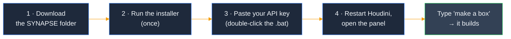
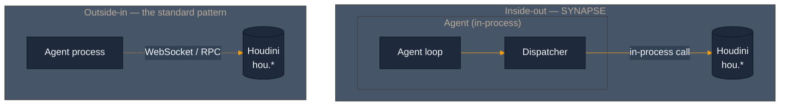

<p align="center">
  
</p>

<h3 align="center"><strong>Talk to Houdini in plain English — it builds in your live scene.</strong></h3>

<p align="center"><em>An AI copilot that lives <strong>inside</strong> Houdini. Chat in, real nodes out — undo-safe, multi-provider, in-process.</em></p>

<p align="center">
  <a href="LICENSE"></a>
  <a href="python/synapse/panel/synapse_panel.py"></a>
  <a href="python/synapse/panel/providers"></a>
  <a href="tests"></a>
  <a href="CHANGELOG.md"></a>
</p>

---

## ✦ What it is

A docked **SYNAPSE panel** inside Houdini. You type what you want — *"make a box"*, *"create a solaris network ending with rendersettings using karma xpu"* — and it **builds it in your live scene.** Chat in, real nodes out.

- ⚡ **In-process** — the agent runs in Houdini's own Python; tools are direct `hou.*` calls, not a slow round-trip bridge.
- ↩️ **Undo-safe** — everything it does is an ordinary Houdini action. **Ctrl+Z undoes it.** Every mutation leaves a provenance record.
- 🔌 **Multi-provider** — pick **Claude · Gemini · NVIDIA Nemotron** right in the panel; swap engines mid-session.
- 🎬 **Built for the work** — SOPs, **Solaris / USD, Karma, COPs, PDG / TOPs, MaterialX** — 112 tools.

> ✅ *"make a box" → a real geo node, confirmed in graphical Houdini 21.0.671.*

```mermaid
%%{init: {'theme':'base', 'themeVariables': {'primaryColor':'#1e293b','primaryTextColor':'#f1f5f9','primaryBorderColor':'#0f172a','lineColor':'#f59e0b','secondaryColor':'#334155','tertiaryColor':'#475569'}}}%%
flowchart LR
    ART["Artist<br/>'make a box'"]:::artist --> PANEL["SYNAPSE panel<br/>chat · engine pills · /"]:::panel
    PANEL -->|"Claude · Gemini · Nemotron"| LOOP["Agent loop<br/>chosen engine + 112 tools"]:::panel
    LOOP -->|"tool_use"| EXEC["Tool executor<br/>(main thread)"]:::panel
    EXEC --> BR["Handler<br/>undo-wrapped · integrity"]:::bridge
    BR -->|in-process call| HOU[("hou.*<br/>node created")]:::hou
    classDef artist fill:#334155,stroke:#f59e0b,color:#f1f5f9
    classDef panel fill:#1e293b,stroke:#3b82f6,color:#f1f5f9
    classDef bridge fill:#1e293b,stroke:#f59e0b,color:#f1f5f9
    classDef hou fill:#334155,stroke:#22c55e,color:#f1f5f9
```



**The panel, briefly:** a persistent rail (live state + a real **Stop**), two tabs under a same-pane law (**Direct** chat · **Work** glance), an **`Aa`** control that scales only what you *read*, typography that inherits Houdini's own UI font, and a **`/`** command palette over every tool.

---

## ✦ Install — 5 minutes

*Artists:* the steps below get you chatting — no command line beyond a copy-paste. *Developers* who want the editable install + test suite: [`docs/getting-started/installation.md`](docs/getting-started/installation.md).

Tested on **Windows 11 + Houdini 21.0.671**. macOS / Linux: same steps, different slashes.



**1 · Get the files** — green **Code ▸ Download ZIP**, unzip somewhere stable (e.g. `C:\Users\<you>\SYNAPSE`).
*Prefer git?* `git clone https://github.com/JosephOIbrahim/Synapse.git`

**2 · Tell Houdini about it** (once):

```powershell
python scripts/install_synapse_package.py
```

*No Python on PATH? Use Houdini's:* `& "C:\Program Files\Side Effects Software\Houdini 21.0.671\bin\hython.exe" scripts/install_synapse_package.py` &nbsp;·&nbsp; *(`--dry-run` previews.)*

**3 · Paste your Claude key** — make one at **console.anthropic.com** (`sk-ant-…`), then **double-click `set_anthropic_key.bat`**, paste, Enter.
*Want Gemini / Nemotron too?* Add their keys to a `.env` at the repo root (gitignored, auto-loaded):

```
ANTHROPIC_API_KEY=sk-ant-...
GEMINI_API_KEY=AIza...
NVIDIA_API_KEY=nvapi-...
```

**4 · Restart Houdini** → **New Pane Tab ▸ SYNAPSE** → type **"make a box."**

That's the whole loop. Everything is an ordinary Houdini action — **Ctrl+Z undoes it**.

<details>
<summary><strong>If something's not working</strong></summary>

- **SYNAPSE isn't in the Pane Tab menu** → Houdini loads packages only at launch; fully restart it, and confirm the installer reported success.
- **"No API key" / won't connect** → re-run `set_anthropic_key.bat` (or confirm the `GEMINI_API_KEY` / `NVIDIA_API_KEY` line in your `.env`), then **relaunch Houdini from scratch** — on Windows a freshly-set key only reaches apps started *after* you set it. Check in Houdini's Python Shell: `import os; print(bool(os.environ.get('ANTHROPIC_API_KEY')))` → should print `True`.
- **`ModuleNotFoundError: No module named 'synapse'`** → the installer prints the path it wired; confirm it points at the repo's `python/` directory, and that you restarted Houdini.

</details>

---

## ✦ How it works — inside-out

Most AI-for-DCC tools run the agent in a **separate process** and reach in through a bridge — every call a round-trip, every tool a marshalling problem. **SYNAPSE inverts that:** the agent loop runs *inside* Houdini's own interpreter, dispatching tools as direct in-process calls against `hou`. The same pattern composes across the portfolio (**Moneta**/Nuke, **Octavius**, the **Cognitive Bridge**).



The `cognitive/` layer is **pure Python** (zero `hou` imports, lint-enforced); `host/` is the Houdini-specific layer that swaps per DCC. Every mutation is undo-wrapped, main-thread-safe, and leaves a provenance receipt.

**Deeper dive + the full per-version history:** **[CHANGELOG.md](CHANGELOG.md)**.

---

## ✦ Project status

**Shipping (v5.16.0):** the artist panel (multi-provider, undo-safe, 112 tools, live observability), the in-process substrate, two-tier provenance, freeze-safety, bounded autonomy + a kill switch, and an H22-readiness harness. SYNAPSE is honest about its gaps — scaffolds self-report instead of faking success, and the per-tool capability audit + the full version record live in **[CHANGELOG.md](CHANGELOG.md)**.

---

## ✦ Repository layout

<details>
<summary><strong>Show the tree</strong></summary>

```
python/synapse/
├── cognitive/                  # zero hou imports (lint-enforced)
│   ├── dispatcher.py           # Dispatcher + AgentToolError
│   ├── agent_loop.py           # Anthropic SDK turn runner
│   └── tools/                  # pure-Python tool implementations
├── host/                       # Houdini-specific (hou / hdefereval OK)
│   ├── daemon.py               # SynapseDaemon lifecycle
│   ├── auth.py                 # API key resolver (.env + env var + hou.secure probe)
│   ├── tops_bridge.py          # PDG event bridge (perception, Phase A)
│   └── scene_load_bridge.py    # auto-warm on AfterLoad (Phase B)
├── memory/                     # Moneta-backed memory substrate
├── panel/                      # artist-facing copilot panel (Qt / PySide6)
│   ├── providers/              # multi-provider engines — anthropic / gemini / nemotron (raw http.client, no SDK)
│   ├── synapse_panel.py        # the docked panel — rail + 2 tabs, engine selector, "/" palette, Connect, honest Stop
│   ├── claude_worker.py        # background QThread — streams the engine + tool loop
│   ├── tool_executor.py        # main-thread tool dispatch (per-tool timeouts)
│   └── designsystem/           # vendored tokens / qss / components (one source)
├── server/                     # live transport + safety wiring
│   ├── freeze_chain.py         # process-wide watchdog: 5s detect → 30s escalate → halt
│   ├── solaris_graph_templates.py  # one-call render-ready Solaris topologies
│   └── handlers*.py            # command handlers — inline undo, cross-client mutation lock
├── core/timeouts.py            # THE canonical per-tool timeout table
└── _vendor/                    # anthropic + deps, CP311 win_amd64

tests/                          # 3665 local (~70 Moneta-gated, skip on a clean clone)
harness/                        # H22 readiness — self-verifying loop
docs/                           # installation · upgrade · egress · reviews
mcp_server.py                   # WebSocket adapter for external MCP clients
```

</details>

---

## License

MIT. See [LICENSE](LICENSE).
