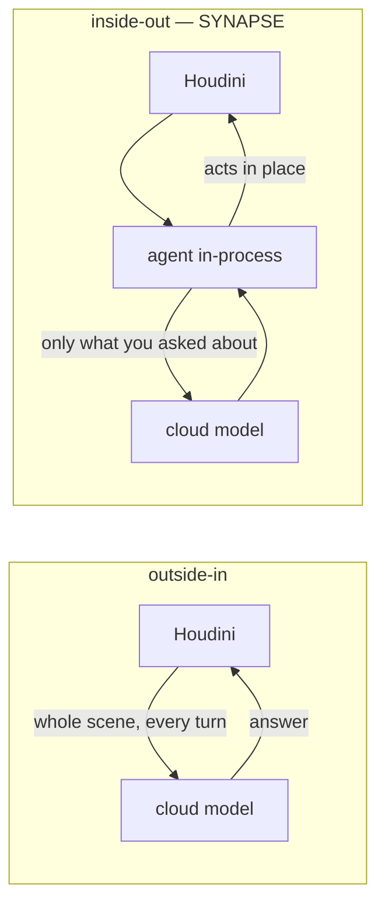
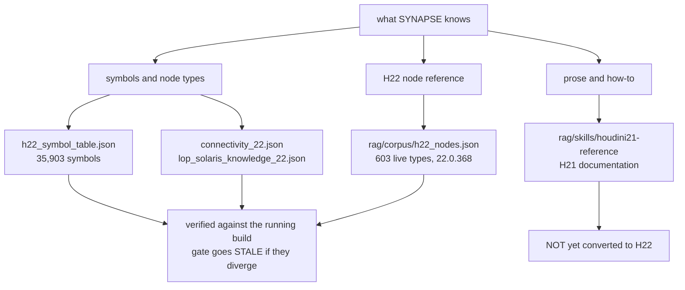
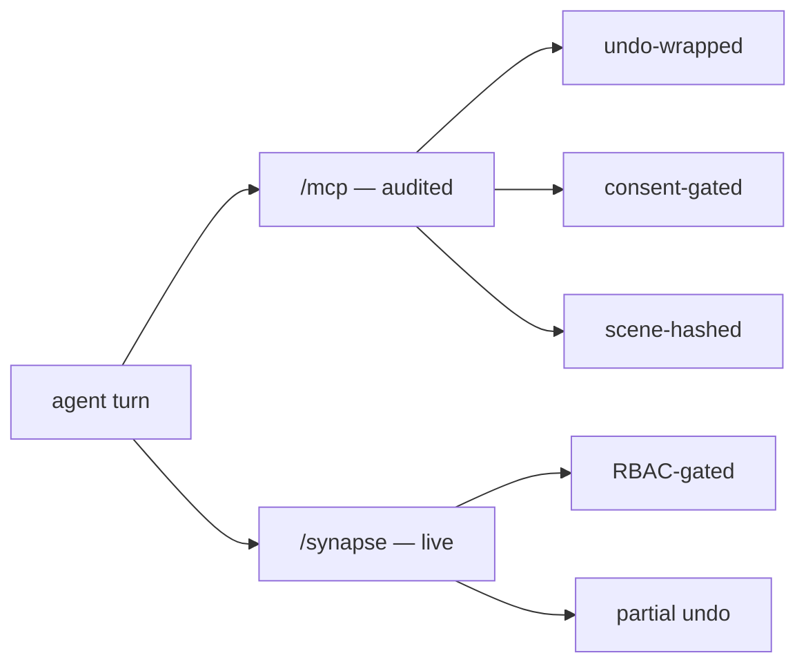

# SYNAPSE

**An AI agent that runs inside Houdini — not beside it.**

SYNAPSE lives in Houdini's own Python interpreter and calls `hou.*` directly. No external bridge, no RPC hop, no second copy of the scene.

> Houdini 22.0.368 · Python 3.13 · USD 0.26.5 · PySide6

---

## The one design choice

Everything else follows from where the agent lives.


```mermaid
flowchart LR
    subgraph OUT["outside-in"]
        H1[Houdini] -->|whole scene, every turn| C1[cloud model]
        C1 -->|answer| H1
    end
    subgraph IN["inside-out — SYNAPSE"]
        H2[Houdini] --> A[agent in-process]
        A -->|only what you asked about| C2[cloud model]
        C2 --> A
        A -->|acts in place| H2
    end
```

**Measured, not claimed.** Grounding payload across a 13 → 25,850 node ladder rises 443 → 113,411 tokens. That is **256×** — not flat. The same probe without depth bounds rises 2,788×.

The honest statement: **cost scales with what you ask about, not with the size of your scene.**

The mechanism is *bounded depth*. Single-call coverage falls to 10% on the largest scenes, with 100% completeness inside the window it reads. There is currently **no delta path** — every inspect is a full re-read.

*Producer: `harness/notes/token_bench/`, 2026-07-27. Proxy tokenizer, no live-model arm.*

---

## What it knows, and where that comes from

This matters more than the feature list, and it is the thing to check first.


```mermaid
flowchart TD
    K[what SYNAPSE knows] --> S[symbols and node types]
    K --> N[H22 node reference]
    K --> P[prose and how-to]
    S --> S1["h22_symbol_table.json<br/>35,903 symbols"]
    S --> S2["connectivity_22.json<br/>lop_solaris_knowledge_22.json"]
    N --> N1["rag/corpus/h22_nodes.json<br/>603 live types, 22.0.368"]
    P --> P1["rag/skills/houdini21-reference<br/>H21 documentation"]
    S1 --> OK["verified against the running build<br/>gate goes STALE if they diverge"]
    S2 --> OK
    N1 --> OK
    P1 --> GAP["NOT yet converted to H22"]
```

**Symbols are H22.** The table is stamped against the running build, and `phantom_gate_status` goes stale if they diverge.

**Node reference is H22.** Extracted from `nodes.zip` — the reference that ships *with the build* — and every entry validated by probing its documented type against the running catalogue. **Only matched entries are written**, so a phantom is never stored rather than filtered at read time.

**Prose is H21.** The retrieval corpus is Houdini 21 documentation, accurately labelled as such. If you ask a how-to question, SYNAPSE may answer from H21 material and tell you so.

**And the Copernicus gap is now closed on the node axis.** It was the sharpest hole in this diagram — Copernicus barely existed in H21, so prose could never cover it. Ask about `chromakey` or `grunge_rust` by name and you get a build-pinned answer. Ask *how to composite* and you still get H21 prose.

---

## What it does

**Builds networks.** Ask for a Solaris scene, a material graph, a COP chain — it wires the nodes and tells you what it chose.

**Explains itself.** Every mutation records what it did and why.

**Stays on the main thread.** All `hou.*` calls marshal to Houdini's main thread.

**Refuses to boot on a render node** — *narrowly.* `hou.isUIAvailable()` gates the daemon, the Fork Bomb guard. But it protects a component with no production callers today while other surfaces boot headless. A guard that exists, not a guarantee that holds.

---

## Install

Three steps. The third is the one people miss.

**1 — Clone**

```
git clone https://github.com/JosephOIbrahim/Synapse.git
```

**2 — Package file**

At `Documents/houdini22.0/packages/synapse.json`:

```json
{
    "name": "synapse",
    "enable": true,
    "env": [
        { "var": "SYNAPSE_ROOT", "value": "C:/path/to/Synapse" },
        {
            "var": "PYTHONPATH",
            "value": ["$SYNAPSE_ROOT/python", "$SYNAPSE_ROOT"],
            "method": "prepend"
        }
    ],
    "hpath": "$SYNAPSE_ROOT/houdini"
}
```

**3 — Verify**

```
python scripts/install_synapse_package.py --verify
```

Read-only. Prints pass/fail per requirement.

### Three things that bite

**Save the JSON without a BOM.** PowerShell's `Set-Content -Encoding utf8` writes one. Houdini's parser rejects it **silently**.

```powershell
# writes a BOM - Houdini will not load this
Set-Content synapse.json $text -Encoding utf8

# no BOM
[System.IO.File]::WriteAllText($path, $text, (New-Object System.Text.UTF8Encoding $false))
```

**`hpath`, not `path`.** On H22 the keyword is `hpath` — SideFX use it exclusively in their own packages. The deprecated `path` still works, which is why nobody notices.

**`PYTHONPATH` needs both entries.** `shared/` lives at the repo root, not under `python/`.

Get any of these wrong and `import synapse` still succeeds, the version still prints, and **the panel never appears.** No error. Just absence.

---

## The two paths


```mermaid
flowchart LR
    T[agent turn] --> M["/mcp — audited"]
    T --> S["/synapse — live"]
    M --> A1[undo-wrapped]
    M --> A2[consent-gated]
    M --> A3[scene-hashed]
    S --> B1[RBAC-gated]
    S --> B2[partial undo]
```

Connect on `ws://localhost:9999/synapse` — the path matters, a bare `host:port` returns HTTP 400.

---

## Undo, precisely

This used to say *"every mutation is reversible."* That was overstated.

`hou.undos.group()` **groups** undo entries so one Ctrl+Z reverses a whole operation.

It does **not** roll back when something raises. On the exception path a partial network survives and you undo it deliberately.

**Wrapping is not reversing.**

---

## Two test numbers, and they mean different things

| | interpreter | result |
|---|---|---|
| **Gate** | system Python 3.14 | 5,279 passed · 0 failed |
| **Shipping** | `hython3.13` — what Houdini runs | 4,048 passed · 110 failed · 771 errors |

The gate runs with the vendored SDK **inactive**; shipping runs with it **active**. They share almost no dependency surface.

**Most of that gap is environment.** Six packages close 88% of the failures:

```
websockets  mcp  pytest-asyncio  orjson  xxhash  filelock
```

Those are shipping dependencies that are not shipped.

---

## Known limitations

Read this here rather than discover it mid-shot.

**`synapse_inspect_scene` does not return over the external MCP surface.** It hangs to the idle timeout. The function itself is instantaneous when called directly — 0.08s for the whole of a 5,764-node scene — so the fault is in the main-thread marshal under MCP, not in introspection. **The panel's WebSocket path is unaffected** and is demonstrated working on that same scene.

**The retrieval corpus is Houdini 21 documentation.** Symbols and node types are H22 and verified; the prose is not yet converted. Most consequential for Copernicus.

**No delta path.** Every inspect is a full re-read. Re-asking about the same thing costs the same again.

**A render can be stopped, but not from `RopNode`.** No cancel method exists there. `hou.ActiveRender` is documented, `#status: ni`, and absent at runtime. SYNAPSE now stops renders through `rkill` (`render_stop`), with two limits worth knowing:

- Only **background** renders can be stopped — those are the only ones `rps` can see. A foreground, in-process render is not reachable.
- Only **Karma/husk** renders can be stopped *by ROP path*. A **mantra** render shows up in `rps` as the bare word `mantra` with no node identity, so SYNAPSE refuses to guess which one is yours and asks for an explicit PID instead.

**Stopping a mantra render leaves a valid-looking but empty frame.** mantra writes the EXR header to the real output path immediately and keeps pixels in a `.mantra_checkpoint` sidecar, so a stopped render leaves a ~1KB EXR that opens fine and contains no image. A "does the file exist?" check will pass it. Detect it by the leftover `.mantra_checkpoint`, or by a header missing `renderTime`. **Stopping a Karma render is safe** — husk only writes the declared output on completion, so it simply never appears.

**The PDG rollback has never executed.** `bridge.py:1718` passes `remove_files=`; the real keyword is `remove_outputs`. It raises `TypeError` every time.

**41 node types in use are deprecated** — 39 of them deprecated in the docs while the runtime says nothing, so a probe alone cannot see them.

**Emergency halt is surfaced, and the shipped mechanism alone was not enough.** It now lives in the panel's `⋯` overflow as a control distinct from Stop. Worth knowing why it is not just a button on the old function: `EmergencyProtocol.trigger_emergency_halt` walks **`/obj` only**. Probed against a real cook at `/tasks/h3b_topnet` on 22.0.368 it returned `ALL_OPERATIONS_HALTED` in 0.0s and the cook was still running three seconds later — and `/tasks` is where TOP networks live by default. The halt handler therefore does its own scene-wide sweep and reports the three results separately: what the bridge halt did, which TOP networks it then cancelled, and which background renders are **still running** (it does not kill those — `rkill *` would reach renders this session never started).

**Node grounding is uneven, and the shape of it changed.** 603 Copernicus, LOP and Cop2 types now carry build-pinned reference from `nodes.zip` — but that is *what a node is*, not *how to use it together*. Workflow prose is still H21. And 88 live types ship with no help page at all, so documentation cannot ground them by any method. 37.9% of LOP parameters are documented — the ceiling from documentation alone.

**Token figures are proxy-measured**, and no genuine outside-in comparison has been built.

---

## Verifying any of this

```
python harness/verify/version_agreement.py     # every version location
python harness/verify/bom_audit.py             # every JSON, VERSION included
python harness/heats_status.py                 # leg board
powershell harness/run_suite_shipping_python.ps1
```

Each fails on an unfixed tree. That was demonstrated before any of them was trusted.

**House rule:** no number enters a document without a producer path beside it.

---

## Licence

MIT. Patent applications pending on the USD cognitive-state substrate, digital injection, and predictive lighting.
