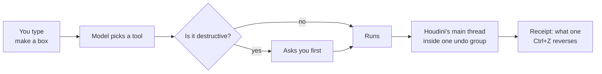
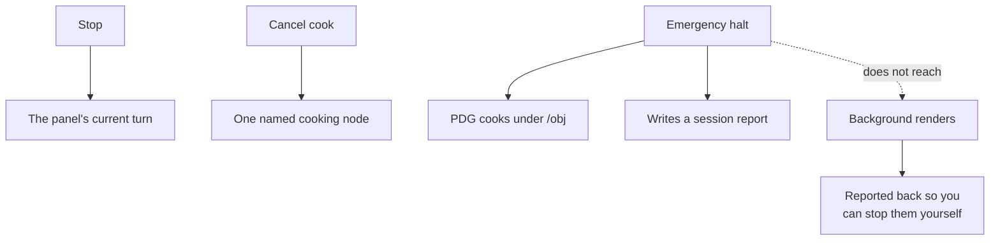
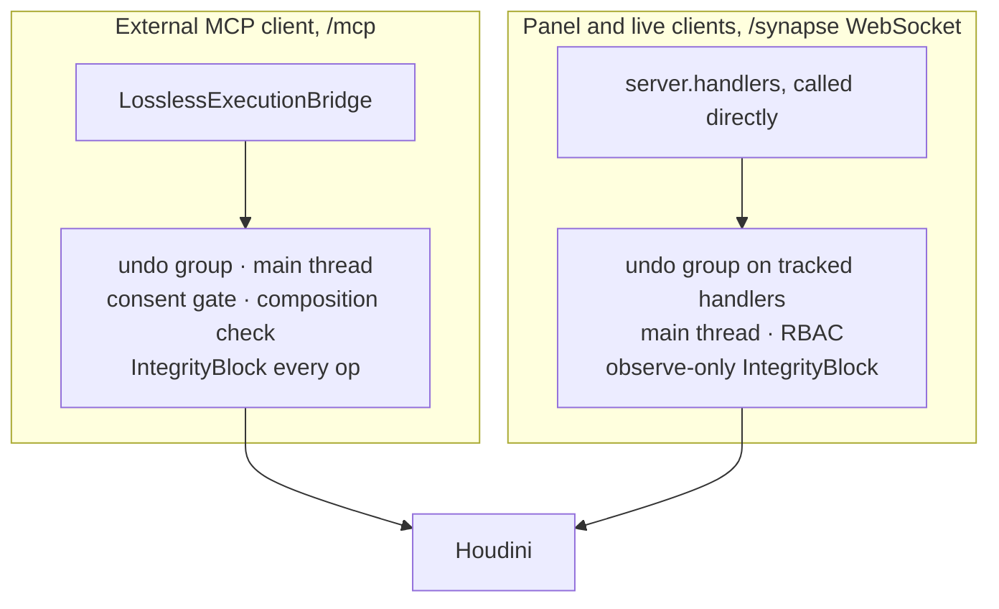

<p align="center">
  
</p>

<p align="center"><strong>Your AI assistant inside Houdini.</strong><br>Describe a task. Inspect the nodes. Keep creative control.</p>

<p align="center"><sub>v5.72.0 · Houdini 22.0.400 · Python 3.13 runtime<br>tags: v5.72.0 is Latest</sub></p>

[](https://github.com/JosephOIbrahim/Synapse/releases/latest)
[](https://github.com/JosephOIbrahim/Synapse/actions/workflows/ci.yml)
[](LICENSE)

**[Download Windows Setup](https://github.com/JosephOIbrahim/Synapse/releases/download/v5.72.0/SYNAPSE-5.72.0-Setup.exe)** · [What's new](docs/releases/v5.72.0.md) · [Help](#when-you-get-stuck)

## Start here

**You need:** Windows and Houdini **22.0.400**. Setup includes the Python dependencies.

1. Save your scene and **close Houdini**.
2. **Run Setup.** Choose your Houdini installation and its preference folder.
3. **Open Houdini → New Pane Tab → Synapse.**
4. **Connect models → choose a model → Check connection → Use this model.**

Then:

- Want node creation? Select **Build and edit networks** in the model dialog.
- Cloud model? It needs your API key.
- Ollama? Start Ollama first, then choose an installed model.

The installer is **unsigned** — verify it against the [checksums](https://github.com/JosephOIbrahim/Synapse/releases/download/v5.72.0/SHA256SUMS.txt).

[Full setup guide](docs/getting-started/installation.md) · [Source installation](docs/getting-started/installation.md#source-installation)

## Your first build

Open a scratch scene and send:

```text
make a box
```

Inspect the nodes. Change a parameter. Then try **Undo**.

Undo reverses one recorded operation. It does not reverse a whole conversation, and it does not reverse files written to disk.

### What happens when you send that


```mermaid
flowchart LR
    A["You type<br/>make a box"] --> B["Model picks a tool"]
    B --> C{"Is it destructive?"}
    C -->|"no"| D["Runs"]
    C -->|"yes"| E["Asks you first"]
    E --> D
    D --> F["Houdini's main thread<br/>inside one undo group"]
    F --> G["Receipt: what one<br/>Ctrl+Z reverses"]
```

The receipt is the part worth knowing. Every handler already worked out what a single
**Ctrl+Z** would take back — it just used to throw that away. Now it tells you, before
you need it.

**One honest limit:** the undo group *groups*. It does not roll back. If a build fails
halfway, the part that was already made stays in your scene until you undo it deliberately.

### Three controls to know

| Control | Use it for |
|---|---|
| **Connect models** | Choose the AI service and model. |
| **Connect** | Start Houdini's local SYNAPSE bridge. |
| **Doctor** | Check the setup without asking a model. |

### Three ways to stop

| Control | Reaches | Limit |
|---|---|---|
| **Stop** | The panel's current turn. | Doesn't prove a cook or render already running has finished. |
| **Cancel cook** *(overflow menu)* | The one cooking node it names. | Only offered when SYNAPSE knows the node — it says so when it doesn't. |
| **Emergency halt** *(overflow menu)* | PDG cooks under `/obj` (cancelled) and a session report (captured). | Doesn't stop background renders. They are reported back so you can stop them deliberately. |

They are not the same. Three verbs, three consequences, kept apart on purpose. The one you want when a build is running away is not the one you want when a model is rambling.


```mermaid
flowchart TB
    S["Stop"] --> S1["The panel's current turn"]
    C["Cancel cook"] --> C1["One named cooking node"]
    H["Emergency halt"] --> H1["PDG cooks under /obj"]
    H --> H2["Writes a session report"]
    H -.->|"does not reach"| R["Background renders"]
    R --> R1["Reported back so you<br/>can stop them yourself"]
```

[First-session walkthrough →](docs/getting-started/quickstart.md)

## What's ready

- **Build and inspect networks** through the panel's permitted tools.
- **Choose local or cloud models:** Claude, Gemini, NVIDIA Nemotron, Ollama, or a custom OpenAI-compatible endpoint. Tool support varies by model.
- **Recall project decisions** when the memory store is configured.
- **Use a saved lookdev suggestion** through the optional Stage 0 workflow.
- **Apply a saved scene setup** (`synapse_apply_fixture`, shipped since 5.43.0). A fixture is a setup stored as data, not a prompt: applying it twice is a no-op, and a name clash refuses instead of renaming. Details and what is proven: [BLOCKS in the changelog](CHANGELOG.md).

**New in 5.72.0** — one scale, one family, and fences that hold.

- The panel's type is one scale: 11/12/15/19, and nothing smaller.
- Verbs are told apart by weight, not by hue — one action family.
- The consent card says the phrase it already owned, not an enum tag.
- The README has diagrams: the prompt flow, the three stops, the two paths.

[Release details and limits →](docs/releases/v5.72.0.md)

**Still development work:** predictive creation, product-level Computer Use controls, recursive self-improvement. The attended operator checks in this release do not make them complete. [Artist-first intent →](INTENT.md)

## Watch it work

[](https://vimeo.com/1225720538)

**[Watch the recorded demonstration on Vimeo →](https://vimeo.com/1225720538)**

## When you get stuck

| What you see | Try this first |
|---|---|
| No Synapse pane | Restart Houdini, then [verify installation](docs/getting-started/installation.md#verify-the-installation). |
| Missing Ollama models | Start Ollama, reopen **Connect models**, then **Check connection**. |
| Connection trouble | Click **Connect**, then **Doctor**. |
| No saved suggestion | Read the card's reason; a matching experience and project memory owner are required. |
| Build running away | **Cancel cook** or **Emergency halt** in the overflow menu — see [three ways to stop](#three-ways-to-stop). |

A failed build can leave **partial nodes**. Review the result in Houdini.

**Stop** prevents further panel work. It does not prove an active cook or render has finished — the [three ways to stop](#three-ways-to-stop) are the ones that reach work already running.

[Current status](docs/status.md) · [Report a bug](https://github.com/JosephOIbrahim/Synapse/issues/new/choose)

<details>
<summary><strong>How SYNAPSE remembers</strong></summary>

Ask SYNAPSE to remember a decision. Ask about it later.

Configured memory plus scene and project notes provide the context for the answer.

With Moneta active, records can also appear in the USD inspection mirror, `cortex_root.usda`. Closing that view leaves saved memory intact.

The optional observation loop connects Moneta, Octavius and Hanish. Three things stay true inside it:

- Recalled records are **advice**. Scene changes still go through action tools.
- A missing substrate stays **visible**.
- An unknown outcome is reported as **unknown**.

[Storage and recall diagram](docs/architecture/overview.md#project-and-scene-memory) · [LOOP setup](docs/MEMORY_LOOP_REPAIR.md) · [Saved suggestions](docs/development/rsi_stage0.md)

</details>

<details>
<summary><strong>For developers: policy, evidence and source setup</strong></summary>

**137 tools, two paths.** The count is `len(TOOL_DEFS)` in `python/synapse/mcp/_tool_registry.py`, pinned by `tests/test_phase0c_doc1_toolcount.py`.

- The **external MCP bridge** and the **live WebSocket handlers** have different consent and integrity boundaries.
- **Panel workers** add their own tool restrictions on top.


```mermaid
flowchart TB
    subgraph mcp["External MCP client, /mcp"]
        M1["LosslessExecutionBridge"] --> M2["undo group · main thread<br/>consent gate · composition check<br/>IntegrityBlock every op"]
    end
    subgraph live["Panel and live clients, /synapse WebSocket"]
        L1["server.handlers, called directly"] --> L2["undo group on tracked handlers<br/>main thread · RBAC<br/>observe-only IntegrityBlock"]
    end
    M2 --> H["Houdini"]
    L2 --> H
```

The two paths are drawn apart because they **are** apart. The bridge is the audited road:
consent gates, composition validation, a fidelity verdict per operation. The live handler
path reaches the same `hou` API by its own wiring — main-thread safe and RBAC-guarded, but
it does not escalate consent, and `execute_python` / `execute_vex` run there ungated. That
is the deliberate posture for a single user on localhost, and a real handler-layer gate is
a prerequisite before any multi-user deployment.

Anything that claims otherwise is drift. Path-qualified `IntegrityBlock`s record which road
an operation took and mark the anchors that did not apply as not-applicable, never as true.

**The new `proposal` worker mode** is opt-in; the default remains `standard`. It:

- Permits registered reads, real knowledge tools and declared proposals.
- Denies the worker direct mutation and graph instantiation.
- Classifies host graph instantiation for review.
- Adds no consent gating to the separate live WebSocket path.

**Read next**

- [Architecture and diagrams](docs/architecture/overview.md)
- [Installer build and tests](installer/README.md)
- [Source installation and tests](docs/getting-started/installation.md#for-contributors)
- [MCP setup](docs/mcp/SETUP.md)
- [Release notes](docs/releases/v5.72.0.md) · [Changelog](CHANGELOG.md)

**What the CI badge proves.** GitHub CI tests stock Python on Linux and macOS.

**What it does not prove.** Native Houdini checks and the Windows installer checks are separate. A green badge does not establish a live render or a clean-machine installation.

**After a SYNAPSE version bump:** older Stage 0 experiences need matching qualification.

</details>

## License

[MIT](LICENSE). Bundled Moneta retains its separate proprietary terms.

Patent applications pending on the USD cognitive-state substrate, digital injection, and predictive lighting — see [PATENTS](PATENTS).
