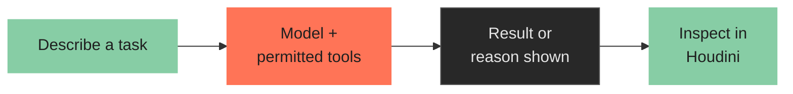

<p align="center">
  
</p>

<p align="center"><strong>Your AI assistant inside Houdini.</strong><br>Describe a task. Inspect the nodes. Keep creative control.</p>

<p align="center"><sub>v5.84.2 · Houdini 22.0.400 · Python 3.13 runtime<br>tags: v5.84.2 is Latest</sub></p>

[](https://github.com/JosephOIbrahim/Synapse/releases/latest)
[](https://github.com/JosephOIbrahim/Synapse/actions/workflows/ci.yml)
[](LICENSE)

**[Install](docs/getting-started/installation.md#source-installation)** · [First session](docs/getting-started/quickstart.md) · [JEV key setup](docs/getting-started/jev-setup.md) · [Help](#when-you-get-stuck) · [What's new](docs/releases/v5.84.2.md)

## Start here

**Current release: source installation.** The available Windows Setup is older, v5.75.2. It does not include the latest panel, JEV or SideFX library changes.

The current validation target is **Windows + Houdini 22.0.400**, using Houdini's bundled Python 3.13. See [installation requirements and steps](docs/getting-started/installation.md#source-installation).

1. Save your scene, close Houdini, and follow **[source installation](docs/getting-started/installation.md#source-installation)**.
2. Restart Houdini. Open **New Pane Tab → Synapse**.
3. Open **Connect models**. Choose a provider and model; add its key if needed.
4. For node creation, select **Build and edit networks**. Choose **Check connection → Use this model**.

Using Ollama? Start its service first. **Connect** starts the separate Houdini bridge; **Doctor** checks the setup without a model.

## Your first build

In a scratch scene, send:

```text
make a box
```

Inspect the nodes, change a parameter, then try **Undo**.


```mermaid
flowchart LR
    accTitle: From a prompt to an inspected result
    accDescr: You describe a task. Your selected model uses permitted tools. SYNAPSE shows the result or a reason it could not run. You inspect the scene.
    U["Describe a task"] --> M["Model +<br/>permitted tools"]
    M --> R["Result or<br/>reason shown"]
    R --> I["Inspect in<br/>Houdini"]
    classDef default fill:#282828,stroke:#555555,color:#E5E5E5
    classDef artist fill:#87CDA5,stroke:#87CDA5,color:#1F1F1F
    classDef synapse fill:#FF7457,stroke:#FF7457,color:#1F1F1F
    class U,I artist
    class M synapse
```

**Undo covers a recorded operation.** It does not reverse a whole conversation or files written to disk. A failed build can leave partial nodes until you deliberately undo them.

The normal panel worker blocks node deletion, arbitrary Python/VEX, rendering, exporting and PDG cooking. See [tool policy and execution boundaries](docs/architecture/overview.md#permission-and-undo-boundaries).

## Find the right control

| I want to… | Open or use… |
|---|---|
| Change the generation model | The model name at the top, or **Connect models**. |
| Add my JEV / TypeSafe key | **Connect models → JEV / TypeSafe key setup → Save session key**. [Setup guide](docs/getting-started/jev-setup.md). |
| Make more room for my prompt | Drag **Resize** above the input box. |
| Find an action | **Commands** below the input box. |
| Import a Marble world or Gaussian `.ply` | **World Labs** beside **Cloud relay**. [Import flow and limits](docs/architecture/overview.md#world-labs-import). |
| Connect the SideFX help library | Follow **[Build and connect](docs/studio/SIDEFX_LIBRARY.md#build-and-connect)**; Scout searches the published local index. |
| Check a connection | **Connect**, then **Doctor**. |

Saving a JEV key keeps it in memory until Houdini closes. **It does not enable JEV, verify the key or grant data permission.** The setup guide walks through those separate controls.

### Three ways to stop

| Control | What it reaches | Limit |
|---|---|---|
| **Stop** | The panel's current turn. | Does not prove an active cook or render has stopped. |
| **Cancel cook** · overflow menu | One known cooking node. | Unavailable when SYNAPSE cannot identify the node. |
| **Emergency halt** · overflow menu | Cooking TOP networks under `/tasks`, `/obj`, `/stage`, `/out`; captures a session report. | Background renders are reported, not stopped. |

## What's ready

- **Network work:** build and inspect through permitted tools; keep the result editable in Houdini.
- **Model choice:** Claude, Gemini, NVIDIA Nemotron, Ollama and custom OpenAI-compatible endpoints. Tool support varies.
- **Optional JEV assistance:** rank selected-network actions or measure routing. Your generation model stays selected.
- **Local knowledge:** [SideFX library](docs/studio/SIDEFX_LIBRARY.md), [project memory](docs/architecture/overview.md#project-and-scene-memory) and [checked lookdev suggestions](docs/development/rsi_stage0.md).

[Current limits](docs/status.md) · [Latest release notes](docs/releases/v5.84.2.md) · [Changelog](CHANGELOG.md)

## When you get stuck

| What you see | Try this first |
|---|---|
| No Synapse pane | Restart Houdini, then [verify installation](docs/getting-started/installation.md#verify-the-installation). |
| Missing Ollama models | Start Ollama; reopen **Connect models → Check connection**. |
| Unsure where the TypeSafe key goes | [JEV key setup](docs/getting-started/jev-setup.md#add-your-key). |
| No saved suggestion | Read its reason. A checked record, matching version and project memory owner are required. |
| Build running away | Use [Cancel cook or Emergency halt](#three-ways-to-stop), then inspect the scene. |

[Report a bug](https://github.com/JosephOIbrahim/Synapse/issues/new/choose) · [First-session walkthrough](docs/getting-started/quickstart.md)

## Watch it work

[](https://vimeo.com/1225720538)

[Watch the recorded demonstration on Vimeo →](https://vimeo.com/1225720538)

<details>
<summary><strong>For developers: architecture, checks and memory</strong></summary>

**137 tools, two paths.** The registry count comes from [`TOOL_DEFS`](python/synapse/mcp/_tool_registry.py), checked by [tool-count tests](tests/test_phase0c_doc1_toolcount.py).

Panel requests prefer HTTP `/mcp`; its ordinary mutations use the execution bridge. Reads, farm controls and Doctor route separately. The configured stdio client forwards Houdini calls over WebSocket `/synapse` to direct handlers. Those paths have different policy and evidence boundaries.

[Execution diagrams and limits](docs/architecture/overview.md#execution-paths) · [External MCP setup](docs/mcp/SETUP.md) · [Source development and tests](docs/getting-started/installation.md#for-contributors)

### How SYNAPSE remembers

Configured memory and scene/project notes supply recalled context. Recall is advice; it does not authorize a scene action. Moneta's USD mirror is an inspection view, not the storage owner. Missing services and unknown outcomes remain visible.

[Storage and recall diagram](docs/architecture/overview.md#project-and-scene-memory) · [Optional memory LOOP](docs/architecture/overview.md#memory-loop) · [Saved suggestions](docs/development/rsi_stage0.md)

**CI covers stock Python on Linux and macOS.** Native Houdini behavior and Windows installer qualification are separate checks. See each [release's evidence](docs/releases/v5.84.2.md) before relying on it.

</details>

## License

[MIT](LICENSE). Bundled Moneta retains its separate proprietary terms.

Patent applications pending on the USD cognitive-state substrate, digital injection, and predictive lighting — see [PATENTS](PATENTS).
