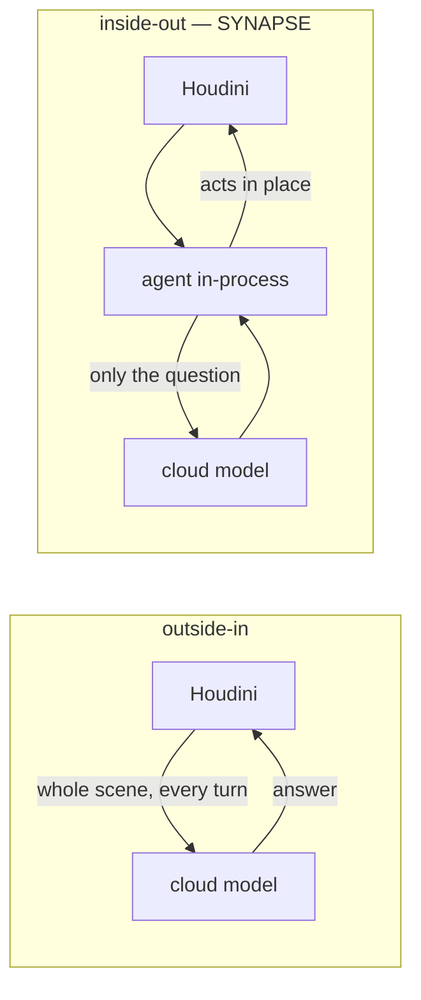
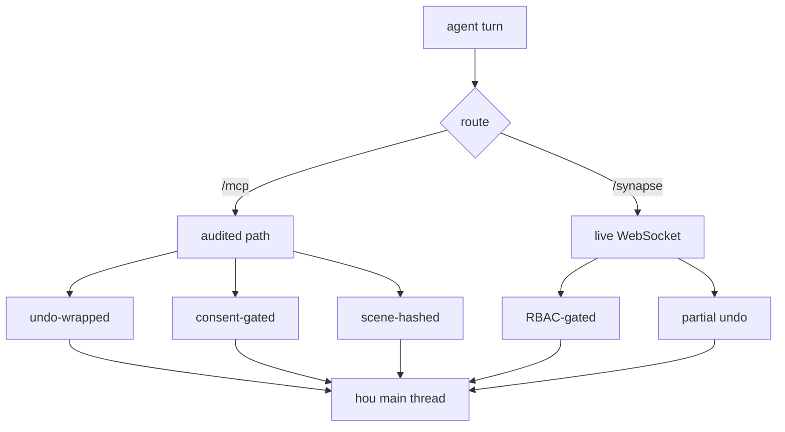

# SYNAPSE

**An AI agent that runs inside Houdini — not beside it.**

SYNAPSE lives in Houdini's own Python interpreter and calls `hou.*` directly. No external bridge, no RPC hop, no second copy of the scene.

> Houdini 22.0.368 · Python 3.13 · USD 0.26.5 · PySide6

---

## The one design choice

Everything else follows from where the agent lives.


```mermaid
flowchart LR
    subgraph OUT["outside-in"]
        H1[Houdini] -->|whole scene, every turn| C1[cloud model]
        C1 -->|answer| H1
    end
    subgraph IN["inside-out — SYNAPSE"]
        H2[Houdini] --> A[agent in-process]
        A -->|only the question| C2[cloud model]
        C2 --> A
        A -->|acts in place| H2
    end
```

**Outside-in** re-sends your scene on every message. Cost climbs with scene size.

**Inside-out** reads the scene directly and sends only what you asked about.

**Measured, not claimed.** Grounding payload across a 13 → 25,850 node ladder rises 443 → 113,411 tokens. That is **not flat** — it is 256×. The same probe run without depth bounds rises 2,788×.

The honest statement: **cost scales with what you ask about, not with the size of your scene.** And the mechanism is *bounded depth* — single-call coverage falls to 10% on the largest scenes, with 100% completeness inside the window it does read.

There is currently **no delta path**. Every inspect is a full re-read of what it looks at. "Sends only what changed" is a roadmap item, not a shipping one.

*Producer: `harness/notes/token_bench/`, C1, 2026-07-27. Proxy tokenizer — no live-model arm, see Known limitations.*

---

## What it does

**Builds networks.** Ask for a Solaris scene, a material graph, a COP chain — it wires the nodes and tells you what it chose.

**Explains itself.** Every mutation records what it did and why.

**Stays on the main thread.** All `hou.*` calls marshal to Houdini's main thread.

**Refuses to boot on a render node** — *narrowly.* `hou.isUIAvailable()` gates the daemon, which is the Fork Bomb guard. But the gate protects a component with no production callers today, while other surfaces boot headless. Treat it as a guard that exists, not a guarantee that holds.

---

## Install

Three steps. The third is the one people miss.

**1 — Clone**

```
git clone https://github.com/JosephOIbrahim/Synapse.git
```

**2 — Package file**

At `Documents/houdini22.0/packages/synapse.json`:

```json
{
    "name": "synapse",
    "enable": true,
    "env": [
        { "var": "SYNAPSE_ROOT", "value": "C:/path/to/Synapse" },
        {
            "var": "PYTHONPATH",
            "value": ["$SYNAPSE_ROOT/python", "$SYNAPSE_ROOT"],
            "method": "prepend"
        }
    ],
    "hpath": "$SYNAPSE_ROOT/houdini"
}
```

**3 — Verify**

```
python scripts/install_synapse_package.py --verify
```

Read-only. Prints pass/fail per requirement.

### Three things that bite

**Save the JSON without a BOM.** PowerShell's `Set-Content -Encoding utf8` writes one on Windows. Houdini's parser rejects it **silently** — no error, no warning, and the panel simply never appears. Cost us a working panel for a day.

```powershell
# writes a BOM - Houdini will not load this
Set-Content synapse.json $text -Encoding utf8

# no BOM
[System.IO.File]::WriteAllText($path, $text, (New-Object System.Text.UTF8Encoding $false))
```

**`hpath`, not `path`.** On H22 the keyword is `hpath` — SideFX use it exclusively in their own shipped packages, six occurrences to zero. The deprecated `path` still works, which is why nobody notices.

**`PYTHONPATH` needs both entries.** `shared/` lives at the repo root, not under `python/`. Omit the root and the handler fails to import — and it surfaces as a misleading *"hou not responding"* in the panel.

Get any of these wrong and `import synapse` still succeeds, the version still prints, and **the panel never appears.** No error. Just absence.

---

## The two paths


```mermaid
flowchart TD
    Q[agent turn] --> R{route}
    R -->|/mcp| M[audited path]
    R -->|/synapse| S[live WebSocket]
    M --> M1[undo-wrapped]
    M --> M2[consent-gated]
    M --> M3[scene-hashed]
    S --> S1[RBAC-gated]
    S --> S2[partial undo]
    M1 --> HOU[hou main thread]
    M2 --> HOU
    M3 --> HOU
    S1 --> HOU
    S2 --> HOU
```

Connect on `ws://localhost:9999/synapse` — the path matters, a bare `host:port` returns HTTP 400.

---

## Undo, precisely

This used to say *"every mutation is reversible."* That was overstated.

`hou.undos.group()` **groups** undo entries so one Ctrl+Z reverses a whole operation.

It does **not** roll back when something raises. On the exception path a partial network survives and you undo it deliberately.

**Wrapping is not reversing.**

---

## Two test numbers, and they mean different things

| | interpreter | result |
|---|---|---|
| **Gate** | system Python 3.14 | 4,989 passed · 0 failed |
| **Shipping** | `hython3.13` — what Houdini runs | 4,048 passed · 110 failed · 771 errors |

The gate runs with the vendored SDK **inactive**; shipping runs with it **active**. They share almost no dependency surface, so neither substitutes for the other.

**Most of that gap is environment.** Six packages close 88% of the failures:

```
websockets  mcp  pytest-asyncio  orjson  xxhash  filelock
```

Those are shipping dependencies that are not shipped.

---

## Known limitations

Read this here rather than discover it mid-shot.

**`houdini_network_explain` segfaults on very large scenes.** Reproducible on SideFX's own `karma_user_guide.hip` — `rc=139`, twice. It takes the interpreter with it, so there is no error and no graceful degradation. Fix in flight; do not point it at a 25,000-node scene today.

**No delta path.** Every inspect is a full re-read of what it looks at. Cost scales with what you ask about, and re-asking about the same thing costs the same again.

**A render can be stopped, but not from `RopNode`.** `hou.RopNode` has no cancel method. `rkill` works and SYNAPSE does not yet use it. `hou.ActiveRender` — the documented replacement — is `#status: ni` and absent at runtime.

**The PDG rollback has never executed.** `bridge.py:1718` passes `remove_files=` to `dirtyAllTasks`; the real keyword is `remove_outputs`. It raises `TypeError` every time.

**41 node types SYNAPSE uses are deprecated** — 39 of them deprecated in the docs while the runtime says nothing, so a probe alone cannot see them.

**Emergency halt is not surfaced in the panel.** The mechanism exists; there is no always-visible control yet.

**Node grounding is thin.** 18.3% of LOP types and 6.2% of Copernicus types carry semantic grounding. The shipped reference documents 37.9% of LOP parameters — the realistic ceiling from documentation alone.

**Token figures are proxy-measured.** No live-model arm exists — the API account has no credits, so `count_tokens` is unavailable. And no genuine outside-in comparison has been built; the numbers above profile our own grounding surface, nothing else.

---

## Verifying any of this

```
python harness/heats_status.py                    # leg board
python harness/verify/version_agreement.py        # all seven version locations
powershell harness/supply_shipping_deps.ps1       # the six missing packages
powershell harness/run_suite_shipping_python.ps1  # shipping suite
```

**House rule:** no number enters a document without a producer path beside it.

---

## Licence

MIT. Patent applications pending on the USD cognitive-state substrate, digital injection, and predictive lighting.
