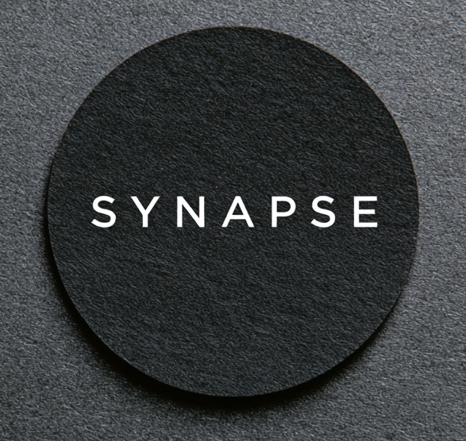
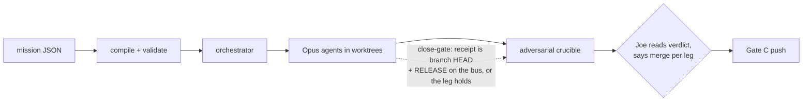
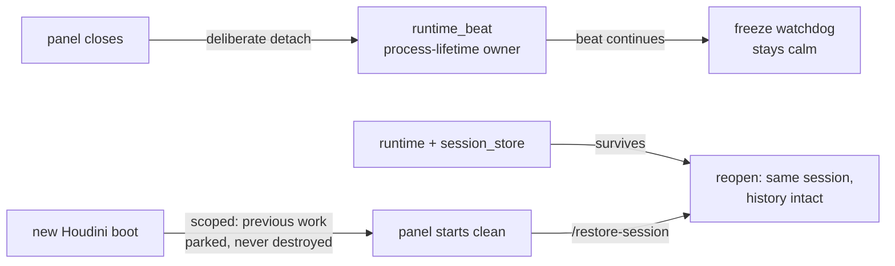
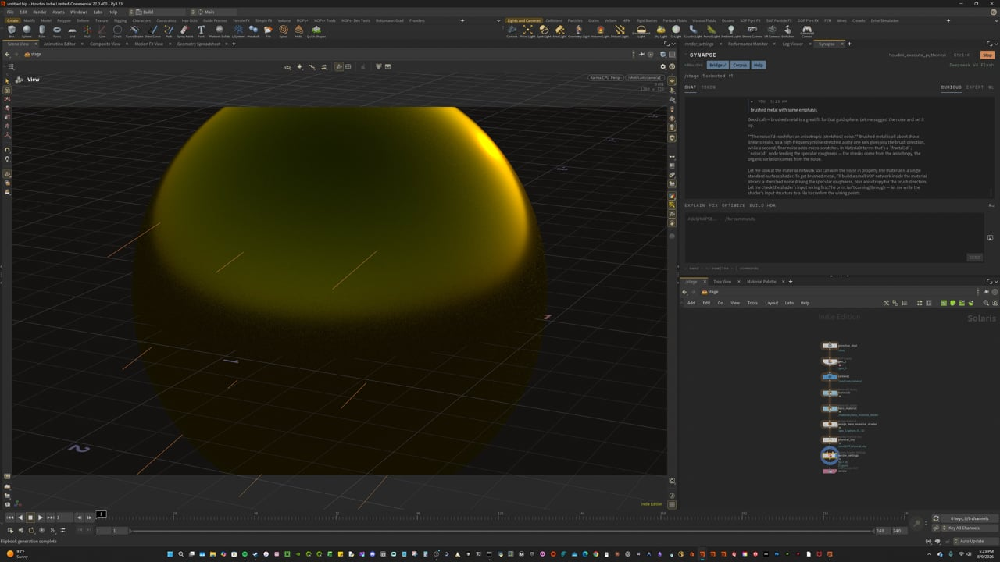
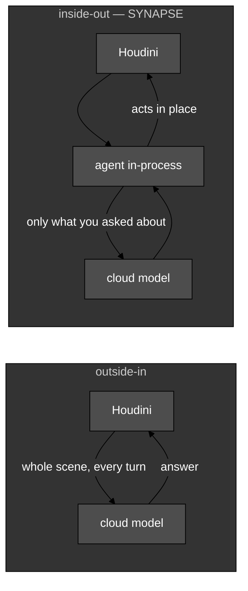
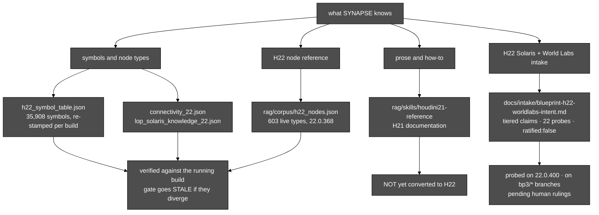
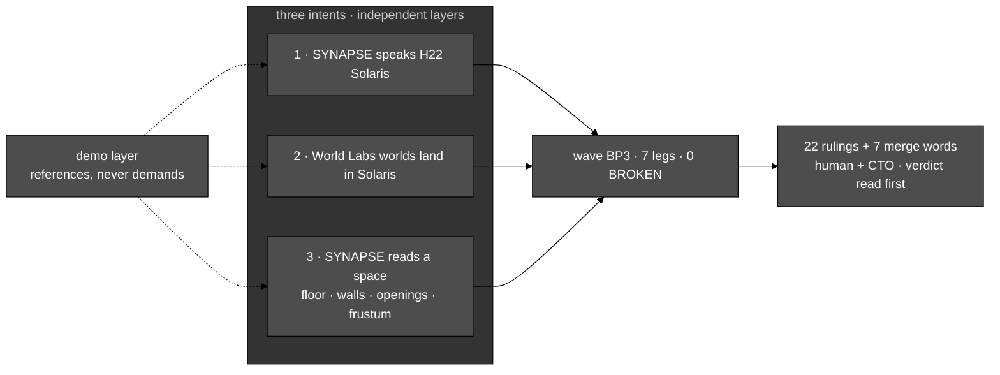
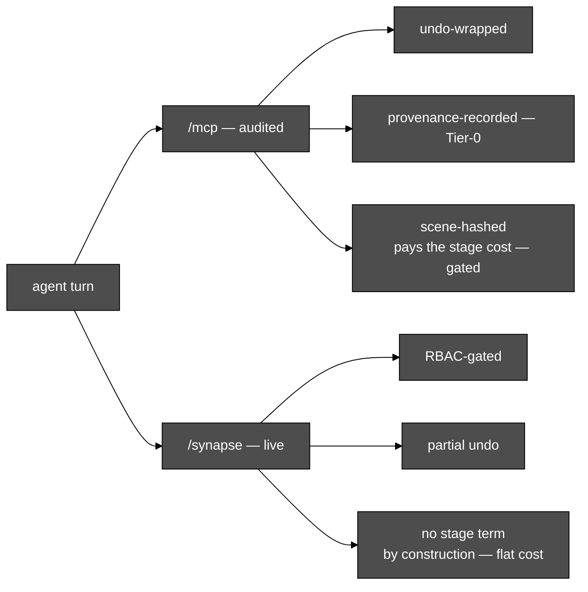
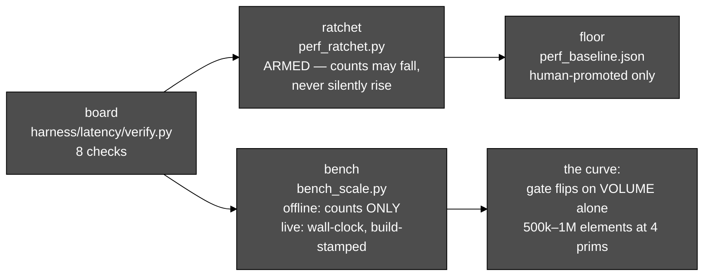
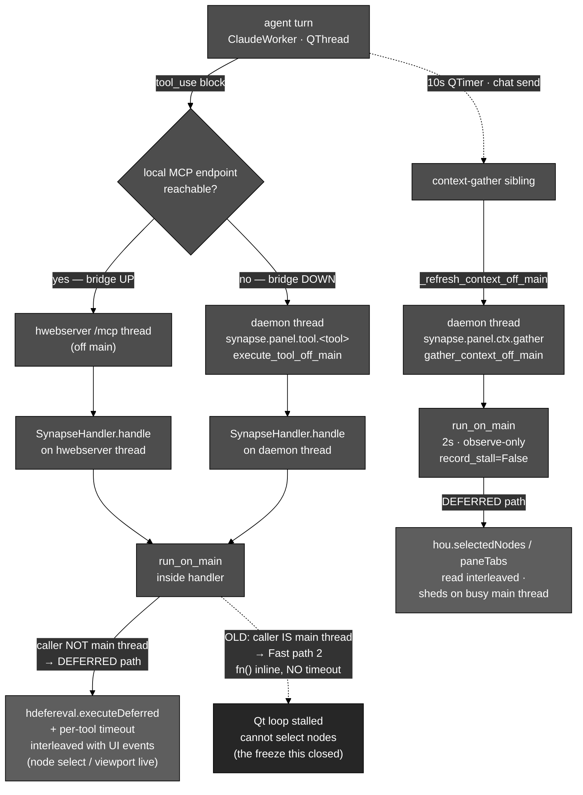

<p align="center">
  
</p>

<p align="center"><strong>An AI agent that runs inside Houdini — not beside it.</strong></p>

<p align="center">Read <a href="#known-limitations">Known limitations</a> first — this repo's habit is saying what doesn't work.</p>

<p align="center">SYNAPSE lives in Houdini's own Python interpreter and calls <code>hou.*</code> directly.<br>No external bridge, no RPC hop, no second copy of the scene.</p>

<p align="center"><sub>v5.63.0 · Houdini 22.0.400 (doc pin — the symbol gate re-stamps per running build) · Python 3.13 · USD 0.26.5 · PySide6<br>tags: v5.60.0 is Latest · vNEXT tags only via the release ritual (g-receipts are human acts)</sub></p>

---

## The 15-second version

**You type. Real nodes appear** — built, wired, named, in your open scene.
**One Ctrl+Z** reverses the whole build.
**It asks first** before anything risky, and **says UNKNOWN** instead of guessing.
**It tells you what doesn't work** — [Known limitations](#known-limitations) is the most-read section on purpose.

**Right now — 3 September 2026.** Three things to know, newest first:

- **v5.60.0 is live** — the panel breathes and the harness pays its own bill: every agent leg's token spend is metered and settled at close, or reads UNKNOWN. v5.59.0 before it was the day the numbers replaced the guesses.
- **A new wave is in the repo, not on `master` yet.** Wave BP3 took a first-principles blueprint — H22 Solaris depth from Rob Pieke's HIVE talk, a World Labs → Solaris bridge, a spatial-intelligence lane — and ran it as seven agent legs against the live build. Zero verdicts BROKEN. Results sit on `bp3/*` branches until the human reads the crucible and says merge, per leg. What they found: [Wave BP3, one picture](#wave-bp3-one-picture).
- **Read before trusting:** [Known limitations](#known-limitations). Still the most-read section on purpose.

[Release notes v5.60.0 →](https://github.com/JosephOIbrahim/Synapse/releases/tag/v5.60.0)

### The shape of it — two pictures

How a change ships (nothing merges without the crucible; nothing pushes without a human word):


```mermaid
flowchart LR
    M[mission JSON] --> C[compile + validate] --> O[orchestrator] --> L[Opus agents in worktrees]
    L --> X[adversarial crucible] --> W{Joe reads verdict,<br>says merge per leg} --> G[Gate C push]
    L -.->|close-gate: receipt is branch HEAD<br>+ RELEASE on the bus, or the leg holds| X
```

Why closing the panel is safe now:


```mermaid
flowchart LR
    P[panel closes] -->|deliberate detach| B[runtime_beat<br>process-lifetime owner]
    B -->|beat continues| F[freeze watchdog<br>stays calm]
    S[runtime + session_store] -->|survives| R[reopen: same session,<br>history intact]
    NB[new Houdini boot] -->|scoped: previous work<br>parked, never destroyed| CL[panel starts clean]
    CL -->|/restore-session| R
```

**Still on board, from v5.50.0 — the knowledge layer stops guessing:** retrieval repair lands. Scout finally sees the node corpus, ambiguous type names disambiguate by context, datasheets carry real internal parm names + channels, and the dense path can honestly say "not found" — 0/25 confident-wrong on fresh adversarial probes. Under it: a build-freshness release gate, a single-writer ingest ledger, and a parameterized help-archive pin. [Release notes →](https://github.com/JosephOIbrahim/Synapse/releases/tag/v5.50.0)

**Jump to:** [Artists](#for-artists--the-one-minute-version) · [Wave BP3](#wave-bp3-one-picture) · [Demo](#watch-it-work) · [Limitations](#known-limitations) · [Install](#install) · [First prompt](#first-prompt) · [Verify it yourself](#verifying-any-of-this)

---

## For artists — the one-minute version

**You type what you want. Real nodes appear in your scene — built, wired, and named.**
"Give me a Vellum cloth setup on this mesh" becomes actual nodes, not a chat answer.

**One Ctrl+Z undoes the whole thing.** Every operation is grouped, so a ten-node
build reverses in a single undo. You can always get your scene back.

**It asks before anything risky.** Writing files, big changes — a human clicks approve.
It never bakes gigabytes to disk on its own.

**It says "I don't know" instead of guessing.** Unmeasured things are reported as
unknown, never invented. When something isn't supported yet, it tells you so.

**It is not magic and not a render button.** Read [Known limitations](#known-limitations) —
this project's habit is saying what doesn't work before you find out mid-shot.

---

## Watch it work

[](https://vimeo.com/1216840044)

*SYNAPSE in practice: plain English in, undoable nodes out.*

---

## Runs your model

Five engines behind one seam. The roster and the producer path are the same thing: `python/synapse/panel/providers/`.

**Ollama needs no API key, and nothing leaves the machine.** SYNAPSE talks to your local server at its default address, `http://localhost:11434`.

**Your pick persists.** Engine choice is saved to `.synapse/panel_settings.json` and survives restarts.

---

## The one design choice

Everything else follows from where the agent lives.


```mermaid
%%{init: {'theme':'base','themeVariables':{'primaryColor':'#4d4d4d','primaryTextColor':'#FFFFFF','primaryBorderColor':'#000000','lineColor':'#000000','textColor':'#FFFFFF','secondaryColor':'#404040','tertiaryColor':'#333333','clusterBkg':'#333333','clusterBorder':'#000000','edgeLabelBackground':'#333333','nodeTextColor':'#FFFFFF'}}}%%
flowchart LR
    subgraph OUT["outside-in"]
        H1[Houdini] -->|whole scene, every turn| C1[cloud model]
        C1 -->|answer| H1
    end
    subgraph IN["inside-out — SYNAPSE"]
        H2[Houdini] --> A[agent in-process]
        A -->|only what you asked about| C2[cloud model]
        C2 --> A
        A -->|acts in place| H2
    end
```

**Measured, not claimed.** Grounding payload across a 13 → 25,850 node ladder rises 443 → 113,411 tokens. That is **256×** — not flat. The same probe without depth bounds rises 2,788×.

The honest statement: **cost scales with what you ask about, not with the size of your scene.**

The mechanism is *bounded depth*. Single-call coverage falls to 10% on the largest scenes, with 100% completeness inside the window it reads. There is currently **no delta path** — every inspect is a full re-read.

*Producer: `harness/notes/token_bench/`, 2026-07-27. Proxy tokenizer, no live-model arm.*

---

## Known limitations

Read this here rather than discover it mid-shot.

**The short list — the five most likely to bite:**
`synapse_inspect_scene` hangs over external MCP (panel path fine) · how-to prose is still H21 · no delta path (every inspect re-reads) · a stopped **mantra** render leaves a valid-looking empty EXR · undo groups, it does not roll back on exceptions.
Full detail on every item below.

**`synapse_inspect_scene` does not return over the external MCP surface.** It hangs to the idle timeout. The function itself is instantaneous when called directly — 0.08s for the whole of a 5,764-node scene — so the fault is in the main-thread marshal under MCP, not in introspection. **The panel's WebSocket path is unaffected** and is demonstrated working on that same scene.

**The retrieval corpus is Houdini 21 documentation.** Symbols and node types are H22 and verified; the prose is not yet converted. Most consequential for Copernicus.

**No delta path.** Every inspect is a full re-read. Re-asking about the same thing costs the same again.

**A render can be stopped, but not from `RopNode`.** No cancel method exists there. `hou.ActiveRender` is documented, `#status: ni`, and absent at runtime. SYNAPSE now stops renders through `rkill` (`render_stop`), with two limits worth knowing:

- Only **background** renders can be stopped — those are the only ones `rps` can see. A foreground, in-process render is not reachable.
- Only **Karma/husk** renders can be stopped *by ROP path*. A **mantra** render shows up in `rps` as the bare word `mantra` with no node identity, so SYNAPSE refuses to guess which one is yours and asks for an explicit PID instead.

**Stopping a mantra render leaves a valid-looking but empty frame.** mantra writes the EXR header to the real output path immediately and keeps pixels in a `.mantra_checkpoint` sidecar, so a stopped render leaves a ~1KB EXR that opens fine and contains no image. A "does the file exist?" check will pass it. Detect it by the leftover `.mantra_checkpoint`, or by a header missing `renderTime`. **Stopping a Karma render is safe** — husk only writes the declared output on completion, so it simply never appears.

**The chat-time UI grip is closed (v5.40.1).** Mid-chat node-selection freezes — the bridge-down Qt-fallback class — no longer fire; tool calls and context-gather run off the main thread. See *The chat freeze, and what fixed it* below. Distinct from the render freezes covered there.

**`execute_python` results are stringified over the live WS.** A dict comes back as its Python repr (`"result": str(result)`). Parse with `ast.literal_eval`; a handler-side fix is queued but needs a Houdini restart to go live, so the client-side parse is the current contract. *Found by the bench's first live contact, 2026-08-02.*

**The PDG rollback has never executed.** `bridge.py:1718` passes `remove_files=`; the real keyword is `remove_outputs`. It raises `TypeError` every time.

**41 node types in use are deprecated** — 39 of them deprecated in the docs while the runtime says nothing, so a probe alone cannot see them.

**Emergency halt is surfaced, and the shipped mechanism alone was not enough.** It now lives in the panel's `⋯` overflow as a control distinct from Stop. Worth knowing why it is not just a button on the old function: `EmergencyProtocol.trigger_emergency_halt` walks **`/obj` only**. Probed against a real cook at `/tasks/h3b_topnet` on 22.0.368 it returned `ALL_OPERATIONS_HALTED` in 0.0s and the cook was still running three seconds later — and `/tasks` is where TOP networks live by default. The halt handler therefore does its own scene-wide sweep and reports the three results separately: what the bridge halt did, which TOP networks it then cancelled, and which background renders are **still running** (it does not kill those — `rkill *` would reach renders this session never started).

**Node grounding is uneven, and the shape of it changed.** 603 Copernicus, LOP and Cop2 types now carry build-pinned reference from `nodes.zip` — but that is *what a node is*, not *how to use it together*. Workflow prose is still H21. And 88 live types ship with no help page at all, so documentation cannot ground them by any method. 37.9% of LOP parameters are documented — the ceiling from documentation alone.

**Token figures are proxy-measured**, and no genuine outside-in comparison has been built.

---

## What it knows, and where that comes from

This matters more than the feature list, and it is the thing to check first.


```mermaid
%%{init: {'theme':'base','themeVariables':{'primaryColor':'#4d4d4d','primaryTextColor':'#FFFFFF','primaryBorderColor':'#000000','lineColor':'#000000','textColor':'#FFFFFF','secondaryColor':'#404040','tertiaryColor':'#333333','clusterBkg':'#333333','clusterBorder':'#000000','edgeLabelBackground':'#333333','nodeTextColor':'#FFFFFF'}}}%%
flowchart TD
    K[what SYNAPSE knows] --> S[symbols and node types]
    K --> N[H22 node reference]
    K --> P[prose and how-to]
    S --> S1["h22_symbol_table.json<br/>35,908 symbols, re-stamped per build"]
    S --> S2["connectivity_22.json<br/>lop_solaris_knowledge_22.json"]
    N --> N1["rag/corpus/h22_nodes.json<br/>603 live types, 22.0.368"]
    P --> P1["rag/skills/houdini21-reference<br/>H21 documentation"]
    K --> I[H22 Solaris + World Labs intake]
    I --> I1["docs/intake/blueprint-h22-worldlabs-intent.md<br/>tiered claims · 22 probes · ratified:false"]
    I1 --> PEND["probed on 22.0.400 · on bp3/* branches<br/>pending human rulings"]
    S1 --> OK["verified against the running build<br/>gate goes STALE if they diverge"]
    S2 --> OK
    N1 --> OK
    P1 --> GAP["NOT yet converted to H22"]
```

**Symbols are H22.** The table is stamped against the running build, and `phantom_gate_status` goes stale if they diverge.

**Node reference is H22.** Extracted from `nodes.zip` — the reference that ships *with the build* — and every entry validated by probing its documented type against the running catalogue. **Only matched entries are written**, so a phantom is never stored rather than filtered at read time.

**Prose is H21.** The retrieval corpus is Houdini 21 documentation, accurately labelled as such. If you ask a how-to question, SYNAPSE may answer from H21 material and tell you so.

**And the Copernicus gap is now closed on the node axis.** It was the sharpest hole in this diagram — Copernicus barely existed in H21, so prose could never cover it. Ask about `chromakey` or `grunge_rust` by name and you get a build-pinned answer. Ask *how to composite* and you still get H21 prose.

**And the newest layer is honest about its state.** The H22 Solaris + World Labs intake is *probed*, not merged — see below.

---

## Wave BP3, one picture

The blueprint said three things must be true, each on its own layer, with the demo only borrowing from them. The wave probed the build instead of trusting docs. Nothing here is merged yet; every line has a receipt on a `bp3/*` branch.


```mermaid
%%{init: {'theme':'base','themeVariables':{'primaryColor':'#4d4d4d','primaryTextColor':'#FFFFFF','primaryBorderColor':'#000000','lineColor':'#000000','textColor':'#FFFFFF','secondaryColor':'#404040','tertiaryColor':'#333333','clusterBkg':'#333333','clusterBorder':'#000000','edgeLabelBackground':'#333333','nodeTextColor':'#FFFFFF'}}}%%
flowchart LR
    subgraph intents [three intents · independent layers]
        I1["1 · SYNAPSE speaks H22 Solaris"]
        I2["2 · World Labs worlds land in Solaris"]
        I3["3 · SYNAPSE reads a space<br/>floor · walls · openings · frustum"]
    end
    D["demo layer<br/>references, never demands"] -.-> I1
    D -.-> I2
    D -.-> I3
    I1 --> W["wave BP3 · 7 legs · 0 BROKEN"]
    I2 --> W
    I3 --> W
    W --> R["22 rulings + 7 merge words<br/>human + CTO · verdict read first"]
```

What the probes proved on 22.0.400, in six and a half seconds:

- **Rob Pieke's SOP-side `USD Create Component` exists.** The world component was built through it, not around it.
- **Splat tooling is native on this build.** The "no way to render splats" risk is clear.
- **World Labs' collider is 46,993 triangles**, not the 100–200k their docs state. Docs refuted by fixture.
- **App exports carry no scale or ground metadata.** SYNAPSE derives them — the case the blueprint planned for.
- **One black render is a probe bug, not a Karma verdict** — the camera was never assigned. It stays UNKNOWN until re-run. Written here so nobody promotes it.
- **The panel's problem is adoption, not tokens** — token system 8.5/10, panel-wide adoption 3.5/10 (492 hardcoded px, 168 off-palette colours across 34 modules). Five substitutions shipped, stylesheet byte-identical.

Blueprint: [`docs/intake/blueprint-h22-worldlabs-intent.md`](docs/intake/blueprint-h22-worldlabs-intent.md) · probes: [`harness/probes/synapse_blueprint_probes.py`](harness/probes/synapse_blueprint_probes.py) · handoff: [`harness/notes/CAPSULE_2026-09-03_EOD.md`](harness/notes/CAPSULE_2026-09-03_EOD.md)

---

## What it does

**Builds networks.** Ask for a Solaris scene, a material graph, a COP chain — it wires the nodes and tells you what it chose.

**Explains itself.** Every mutation records what it did and why.

**Stays on the main thread.** All `hou.*` calls marshal to Houdini's main thread.

**Says no when it can't.** This took four fixes in one day (2026-08-02), all the same disease — a green light that couldn't report failure. `get_health` now carries `write_plane` (it used to say *healthy* over a dead write path); `composition_valid` carries a real verdict (it had **zero** assignment sites — an integrity anchor that could never fail); operations that fail *before* validation say so instead of inheriting "ran and passed"; and value-only edits the reduced hash cannot see are **counted** as `unobservable_deltas` rather than vanishing. *Producers: commits `68ab53e`, `57c4ec6`, `73284e1`; pinned by `tests/test_write_plane_health.py` (26), `tests/test_stage_exceeds_cache_and_composition_valid.py` (13), `tests/test_r306_reduced_mode_surfacing.py` (19).*

**Writes memory on a fresh scene.** The first `memory_write` on an unsaved scene used to die with `WinError 5` — `$JOB` points into Houdini's install `bin/`, which the seat can't write. Scene memory now resolves a writable address (discovery still reads the raw `$JOB` root, so studio show-configs keep working). Verified end-to-end on the live seat, twice, against a captured cold-boot baseline. *Producer: `scripts/live_probes/probe_g1_acceptance_ws.py` → `VERDICT: PASS`.*

**Refuses to boot on a render node** — *narrowly.* `hou.isUIAvailable()` gates the daemon, the Fork Bomb guard. But it protects a component with no production callers today while other surfaces boot headless. A guard that exists, not a guarantee that holds.

<details>
<summary><strong>The full claim, unpacked</strong> — everything the one-liner compresses (115 tools, truth contract, five engines, audit trail)</summary>

### The full claim, unpacked

This is the package description in long form — everything the one-liner compresses.

**115 tools, two paths.** The full safety set (undo-wrapped, reversible, provenance-recorded) rides the audited `/mcp` bridge path. The direct `/synapse` path is RBAC-gated, main-thread-marshalled execution with observe-only provenance. Scene mutations are undo-wrapped and reversible. Filesystem and network effects of executed code are not.

**A registry-wide truth contract.** A result may not claim an outcome the handler did not observe.

**A self-improving utility flywheel.** Proposed node-graphs are validated against probe-verified Houdini truth — node wiring plus Solaris/LOP context — *before* they build.

**A five-engine chat panel.** Switch between Claude, Google Gemini, NVIDIA Nemotron, local Ollama, and any custom OpenAI-compatible endpoint. Raw-stdlib providers, no vendor SDK.

**Pipeline citizenship.** Tokens stay raw, per-frame render paths, OCIO color-managed previews, per-show config.

**Studio operability.** Rotating logs, `synapse_doctor` diagnostics + bundle, env-var conformance, bounded autonomy with a stop control that takes effect between operations, an upgrade runbook, egress + key-provisioning docs.

**A two-tier audit trail.** Tier-0 Floor hook + the agent.usd Ledger.

**Crash-atomic escrowed memory.** And a process-wide stall-detection chain (detect → breaker → emergency-halt report) that reports and degrades rather than unblocking a parked session.

Verified end-to-end on Houdini 22.0.368. 22.0.400: symbol-stamped 2026-08-09 (35,908 symbols, gate armed); e2e re-verification pending — see `docs/SUPPORT_MATRIX.md`.

</details>

---

## Install

Four steps. The third is the one people miss.

**1 — Clone**

```
git clone https://github.com/JosephOIbrahim/Synapse.git
```

**2 — Package file**

```
python scripts/install_synapse_package.py
```

Writes the package file — `Documents/houdini22.0/packages/synapse.json` — for you, correctly encoded.

SYNAPSE ships **two installers**, and the split matters: `scripts/install_synapse_package.py` installs the package file (this step); `install.py` installs the shelf, panel, and icons. Order: package file first, then `install.py`.

**3 — Verify**

```
python scripts/install_synapse_package.py --verify
```

Read-only. Prints pass/fail per requirement.

**4 — Doctor**

With the server up, run the `synapse_doctor` tool — ask the panel, or call it from any connected MCP client. Diagnostics plus a support bundle (see Studio operability, above). Registered in `mcp_server.py`; implemented in `python/synapse/server/doctor.py`.

<details>
<summary><strong>Manual install</strong> — write the package file by hand</summary>

At `Documents/houdini22.0/packages/synapse.json`:

```json
{
    "name": "synapse",
    "enable": true,
    "env": [
        { "var": "SYNAPSE_ROOT", "value": "C:/path/to/Synapse" },
        {
            "var": "PYTHONPATH",
            "value": ["$SYNAPSE_ROOT/python", "$SYNAPSE_ROOT"],
            "method": "prepend"
        }
    ],
    "hpath": "$SYNAPSE_ROOT/houdini"
}
```

### Three things that bite

**Save the JSON without a BOM.** PowerShell's `Set-Content -Encoding utf8` writes one. Houdini's parser rejects it **silently**.

```powershell
# writes a BOM - Houdini will not load this
Set-Content synapse.json $text -Encoding utf8

# no BOM
[System.IO.File]::WriteAllText($path, $text, (New-Object System.Text.UTF8Encoding $false))
```

**`hpath`, not `path`.** On H22 the keyword is `hpath` — SideFX use it exclusively in their own packages. The deprecated `path` still works, which is why nobody notices.

**`PYTHONPATH` needs both entries.** `shared/` lives at the repo root, not under `python/`.

Get any of these wrong and `import synapse` still succeeds, the version still prints, and **the panel never appears.** No error. Just absence.

</details>

---

## First prompt

Nothing to set up beyond Install. **Fresh empty scene. No OCIO. No demo scaffold. No harness runner.**

1. Open Houdini — new, empty scene.
2. Open the SYNAPSE panel.
3. Type:

> **Make me simple terrain — a grid displaced with mountain noise.**

This prompt maps to a recipe the panel ships with — `mountain_displace` in `python/synapse/panel/recipe_book.py`: a 100×100 `grid` SOP wired into a `mountain` SOP (height 1.5). Two nodes, one connection.

**What you'll see:** a terrain-like displaced surface in the viewport. That visible bump-scape is the proof the install worked — no test suite required.

Looking for the full staged walkthrough instead? That's `demo/README.md` — the staged demo, which *does* carry pipeline prerequisites (OCIO, the demo hip).

---

## Troubleshooting

**The panel didn't appear.**

Run the doctor first: the `synapse_doctor` tool, callable from any connected MCP client — no panel required (registered in `mcp_server.py`, implemented in `python/synapse/server/doctor.py`).

Why there's no error message to read: get the package file wrong — a BOM, `path` instead of `hpath`, a missing `PYTHONPATH` entry — and `import synapse` still succeeds, the version still prints, and **the panel never appears.** No error. Just absence.

So work it from the file, not the console: re-run step 3 (`python scripts/install_synapse_package.py --verify`), then check **Three things that bite** under Manual install.

---

## The two paths


```mermaid
%%{init: {'theme':'base','themeVariables':{'primaryColor':'#4d4d4d','primaryTextColor':'#FFFFFF','primaryBorderColor':'#000000','lineColor':'#000000','textColor':'#FFFFFF','secondaryColor':'#404040','tertiaryColor':'#333333','clusterBkg':'#333333','clusterBorder':'#000000','edgeLabelBackground':'#333333','nodeTextColor':'#FFFFFF'}}}%%
flowchart LR
    T[agent turn] --> M["/mcp — audited"]
    T --> S["/synapse — live"]
    M --> A1[undo-wrapped]
    M --> A2[provenance-recorded — Tier-0]
    M --> A3["scene-hashed<br/>pays the stage cost — gated"]
    S --> B1[RBAC-gated]
    S --> B2[partial undo]
    S --> B3["no stage term<br/>by construction — flat cost"]
```

Consent prompts on the /mcp path belong to the MCP host (e.g. Claude Desktop's tool-approval), not to Synapse; Synapse's guarantee is provenance.

Connect on `ws://localhost:9999/synapse` — the path matters, a bare `host:port` returns HTTP 400.

**Security posture, stated plainly.** RBAC is inactive in local mode by default. The live surface is a localhost WebSocket; origin validation is fail-safe — a connection with an unrecognized `Origin` is rejected, never waved through. No auth key is required or checked unless one is configured. The enable path: set `SYNAPSE_DEPLOY_MODE` to a non-local mode and configure an auth key — that turns RBAC enforcement and key checking on.

**Found a vulnerability?** [SECURITY.md](SECURITY.md) — private GitHub security advisories, never a public issue. It also states who patches the vendored `python/synapse/_vendor/` dependencies (we do).

The cost asymmetry on the right is **measured, both sides**: the `/mcp` path's stage hashing is where scene-scale cost lives (and where the gate below operates); the live path skips that term by construction (`integrity_envelope.py:219`) and stays flat — ping ~0.4 ms, `set_parm` ~3.7 ms whether the stage holds 100k or 4M authored elements. *Producer: `python _benchmark_latency.py --tier live`, first live rows 2026-08-02, `.claude/live_rows_v5420.json`, measured on 22.0.397.*

**One wire-contract wart worth knowing on the live path:** `execute_python` results come back **stringified** — a dict arrives as its Python repr, not JSON (`handlers.py`, `"result": str(result)`). Parse with `ast.literal_eval` client-side, never `eval`.

---

## Fast, and staying fast

Three instruments landed 2026-08-02, built on one finding.

**The finding.** Houdini-side cost was believed to be "1–70 ms per op — the 5%." True on small scenes; at scale, stage hashing on the audited path cost **6.9–7.7 s per op at 100k prims**. And the axis everyone assumed — prim count — was wrong: cost tracks **authored array volume**. A 4-prim PointInstancer at 2M instances cost 2,017.9 ms per op while the prim-keyed gate said the scene was small — a **16,677× miss**. *Producers: `98b556f` (measured floor), `harness/latency/LEDGER.md` §1 (the volume evidence, C2 crucible).*

<details>
<summary><strong>The instruments</strong> — board, ratchet, bench (diagram + producers)</summary>


```mermaid
%%{init: {'theme':'base','themeVariables':{'primaryColor':'#4d4d4d','primaryTextColor':'#FFFFFF','primaryBorderColor':'#000000','lineColor':'#000000','textColor':'#FFFFFF','secondaryColor':'#404040','tertiaryColor':'#333333','clusterBkg':'#333333','clusterBorder':'#000000','edgeLabelBackground':'#333333','nodeTextColor':'#FFFFFF'}}}%%
flowchart LR
    B["board<br/>harness/latency/verify.py<br/>8 checks"] --> R["ratchet<br/>perf_ratchet.py<br/>ARMED — counts may fall,<br/>never silently rise"]
    R --> F["floor<br/>perf_baseline.json<br/>human-promoted only"]
    B --> C["bench<br/>bench_scale.py<br/>offline: counts ONLY<br/>live: wall-clock, build-stamped"]
    C --> K["the curve:<br/>gate flips on VOLUME alone<br/>500k–1M elements at 4 prims"]
```

**The gate now keys on both terms** — prim count *and* authored volume — so the bypass class is closed. **The ratchet pins it**: a deterministic counted proxy (stage traversals, prims visited — never wall-clock, because CI has no `pxr` and a timer would flake), floor read at `merge-base(origin/master)` so a branch cannot gate against its own doctored floor. **The bench maps it**: the offline tier emits counts only — a CI-runnable tier that reported latency numbers would be the exact dishonesty this guards against, and that rule is enforced in code, not prose.

*Producers: board `harness/latency/verify.py` → 8 PASS · ratchet `harness/verify/perf_ratchet.py` → 8 PASS · curve `python scripts/bench_scale.py --axis volume` · all re-runnable.*

</details>

---

## The chat freeze, and what fixed it

A third freeze class — distinct from the render freeze and the marshal self-deadlock.

**The symptom.** Mid-chat, Houdini's UI grips. You can't select nodes, the viewport won't update, and it stays that way until the tool call finishes. No render is running — just a chat turn.

**The cause.** Chat turns run on a background thread, but every tool call has to reach `hou.*` on the main thread. With the local bridge **up**, the call rides the hwebserver `/mcp` thread and marshals cleanly. With the bridge **down**, the call fell back to a Qt signal that ran the *whole handler inline on the main thread* — so every internal marshal hit the no-timeout inline path and the GUI stalled for the handler's full duration. A lying "connected" SessionStart signal made this fire in ordinary sessions, not just broken ones.

**The fix (v5.40.1).** Tool calls and the panel's own context-gather now spawn a daemon thread *off* the main thread, so the marshal takes the deferred path — the same path the bridge-up call takes, with a per-call timeout and UI events interleaved. Node selection and the viewport stay live mid-chat.

<details>
<summary><strong>The wiring diagram</strong> — old inline path vs. the deferred path, and what this fix does not cover</summary>


```mermaid
%%{init: {'theme':'base','themeVariables':{'primaryColor':'#4d4d4d','primaryTextColor':'#FFFFFF','primaryBorderColor':'#000000','lineColor':'#000000','textColor':'#FFFFFF','secondaryColor':'#404040','tertiaryColor':'#333333','clusterBkg':'#333333','clusterBorder':'#000000','edgeLabelBackground':'#333333','nodeTextColor':'#FFFFFF'}}}%%
flowchart TB
    TURN["agent turn<br/>ClaudeWorker &middot; QThread"]:::panel
    TURN -->|"tool_use block"| BR{"local MCP endpoint<br/>reachable?"}:::obs
    BR -->|"yes — bridge UP"| WS["hwebserver /mcp thread<br/>(off main)"]:::obs
    WS --> HDLR1["SynapseHandler.handle<br/>on hwebserver thread"]:::panel
    BR -->|"no — bridge DOWN"| DAEMON["daemon thread<br/>synapse.panel.tool.&lt;tool&gt;<br/>execute_tool_off_main"]:::panel
    DAEMON --> HDLR2["SynapseHandler.handle<br/>on daemon thread"]:::panel
    HDLR1 --> ROM["run_on_main<br/>inside handler"]:::obs
    HDLR2 --> ROM
    ROM -->|"caller NOT main thread<br/>→ DEFERRED path"| DEF["hdefereval.executeDeferred<br/>+ per-tool timeout<br/>interleaved with UI events<br/>(node select / viewport live)"]:::ok
    ROM -.->|"OLD: caller IS main thread<br/>→ Fast path 2<br/>fn() inline, NO timeout"| FROZEN["Qt loop stalled<br/>cannot select nodes<br/>(the freeze this closed)"]:::hot
    TURN -.->|"10s QTimer &middot; chat send"| CTX["context-gather sibling"]:::panel
    CTX -->|"_refresh_context_off_main"| GATHER["daemon thread<br/>synapse.panel.ctx.gather<br/>gather_context_off_main"]:::panel
    GATHER --> ROMCTX["run_on_main<br/>2s &middot; observe-only<br/>record_stall=False"]:::obs
    ROMCTX -->|"DEFERRED path"| DEFCTX["hou.selectedNodes / paneTabs<br/>read interleaved &middot;<br/>sheds on busy main thread"]:::ok
    classDef panel fill:#4d4d4d,stroke:#000000,color:#FFFFFF
    classDef obs fill:#4d4d4d,stroke:#000000,color:#FFFFFF
    classDef hot fill:#262626,stroke:#000000,color:#FFFFFF
    classDef ok fill:#5e5e5e,stroke:#000000,color:#FFFFFF
```

**What it does not fix.** The residual in-process render freeze is a separate class (out-of-process husk is Indie-blocked). The websocket read loop's cancel gap is still open. The 2026-07-27 latency report's "Houdini-side is milliseconds" verdict still holds for the bridge-up path but is stale for the bridge-down case this closed. CI is red on an unrelated `mcp`-library drift on the runners, not this fix — the local suite is green.

*Producers: `6f354ae` (tool dispatch off-main) + `bf74ed7` (context-gather off-main) · PR #50, merge `d15d9b2` · pinned by `tests/test_offmain_fallback.py` (8) + `tests/test_context_poll_offmain.py` (6) + `tests/test_chat_panel.py::TestStaleContextGather` (4).*

</details>

---

## Undo, precisely

This used to say *"every mutation is reversible."* That was overstated.

`hou.undos.group()` **groups** undo entries so one Ctrl+Z reverses a whole operation.

It does **not** roll back when something raises. On the exception path a partial network survives and you undo it deliberately.

**Wrapping is not reversing.**

---

## Two test numbers, and they mean different things

| | interpreter | result |
|---|---|---|
| **Gate** | system Python 3.14 | 5,551 passed · 0 failed *(2026-08-02)* |
| **Shipping** | `hython3.13` — what Houdini runs | 4,048 passed · 110 failed · 771 errors |

The gate runs with the vendored SDK **inactive**; shipping runs with it **active**. They share almost no dependency surface.

**Most of that gap is environment.** Six packages close 88% of the failures:

```
websockets  mcp  pytest-asyncio  orjson  xxhash  filelock
```

Those are shipping dependencies that are not shipped.

---

## Verifying any of this

```
python harness/progress.py                     # every harness, every live wave
python harness/latency/verify.py               # the latency board (8 checks)
python harness/verify/perf_ratchet.py          # the armed speed floor
python harness/verify/version_agreement.py     # every version location
python harness/verify/bom_audit.py             # every JSON, VERSION included
powershell harness/run_suite_shipping_python.ps1
```

(`heats_status.py` is retired — it rendered real receipts into a hardcoded layout, which is the failure mode these tools exist to avoid. `progress.py` discovers; it does not list.)

Each fails on an unfixed tree. That was demonstrated before any of them was trusted.

**House rule:** no number enters a document without a producer path beside it.

---

## Licence

MIT. Patent applications pending on the USD cognitive-state substrate, digital injection, and predictive lighting.
