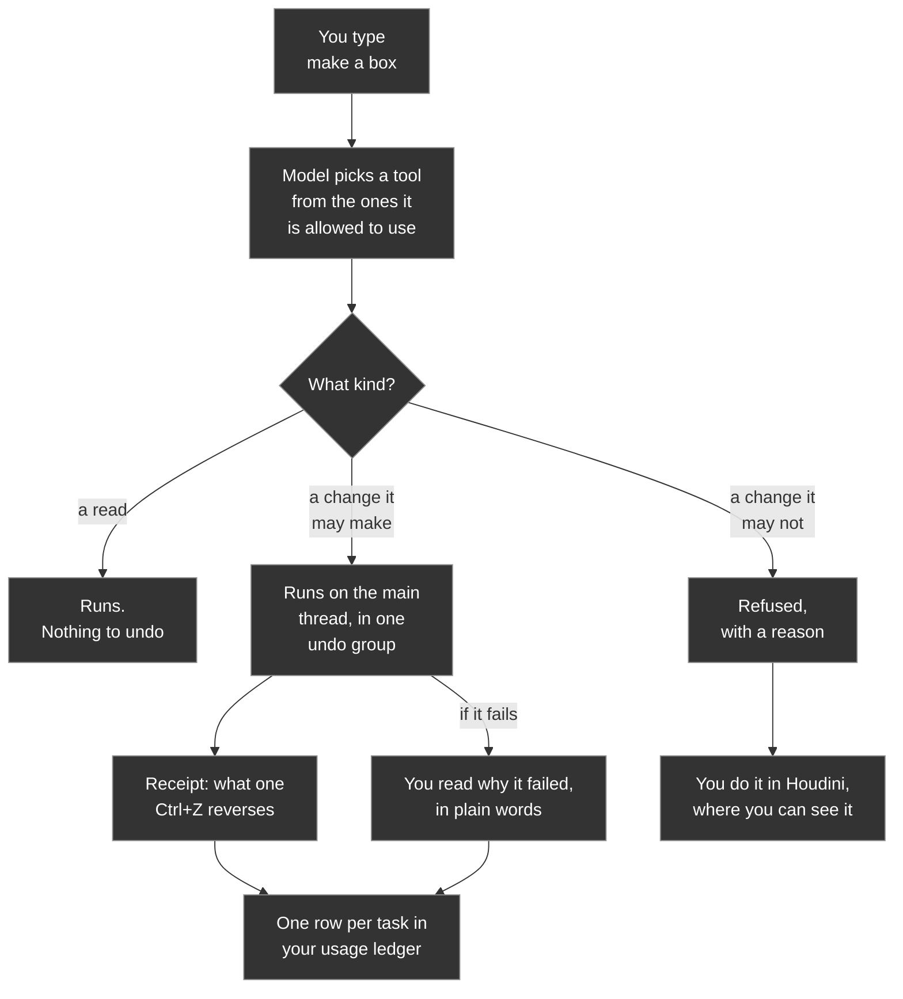
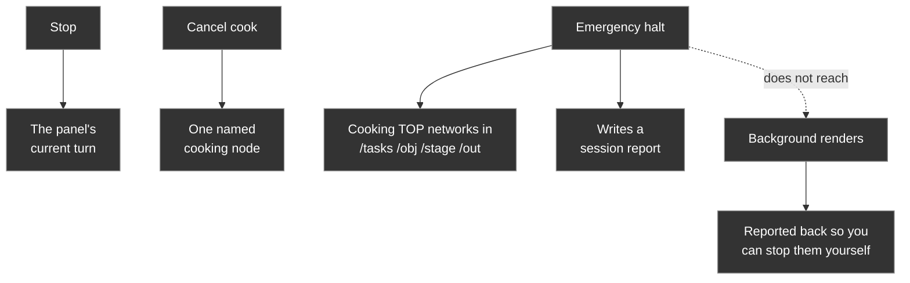
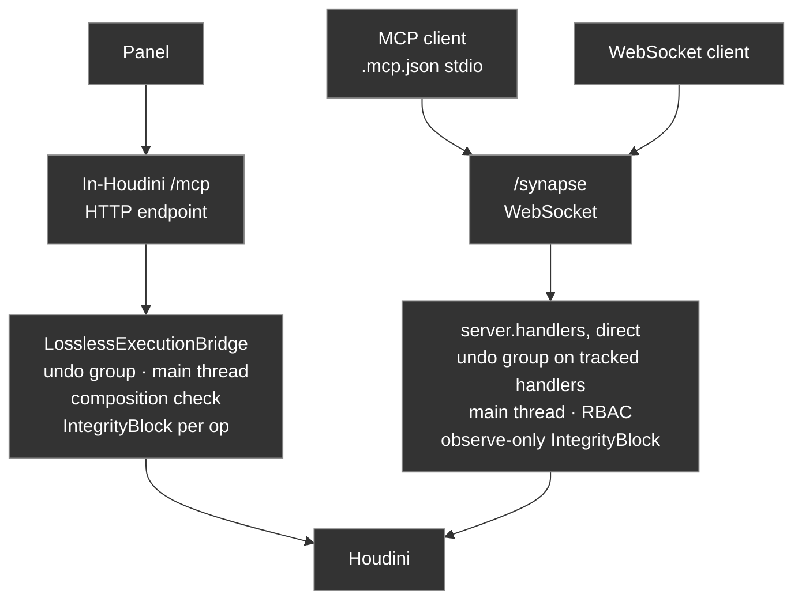

<p align="center">
  
</p>

<p align="center"><strong>Your AI assistant inside Houdini.</strong><br>Describe a task. Inspect the nodes. Keep creative control.</p>

<p align="center"><sub>v5.84.1 · Houdini 22.0.400 · Python 3.13 runtime<br>tags: v5.84.1 is Latest</sub></p>

[](https://github.com/JosephOIbrahim/Synapse/releases/latest)
[](https://github.com/JosephOIbrahim/Synapse/actions/workflows/ci.yml)
[](LICENSE)

**[Windows Setup v5.75.2](https://github.com/JosephOIbrahim/Synapse/releases/download/v5.75.2/SYNAPSE-5.75.2-Setup.exe)** · [What's new in v5.84.1](docs/releases/v5.84.1.md) · [Help](#when-you-get-stuck)

For **v5.84.1**, follow [source installation](docs/getting-started/installation.md#source-installation). The older Windows Setup does not contain the latest changes.

## Start here

**You need:** Windows and Houdini **22.0.400**. Setup includes the Python dependencies.

1. Save your scene and **close Houdini**.
2. **Run Setup.** Choose your Houdini installation and its preference folder.
3. **Open Houdini → New Pane Tab → Synapse.**
4. **Connect models → choose a model → Check connection → Use this model.**

Then:

- Want node creation? Select **Build and edit networks** in the model dialog.
- Cloud model? It needs your API key.
- Ollama? Start Ollama first, then choose an installed model.

The installer is **unsigned** — verify it against the [checksums](https://github.com/JosephOIbrahim/Synapse/releases/download/v5.75.2/SHA256SUMS.txt).

[Full setup guide](docs/getting-started/installation.md) · [Source installation](docs/getting-started/installation.md#source-installation)

## Your first build

Open a scratch scene and send:

```text
make a box
```

Inspect the nodes. Change a parameter. Then try **Undo**.

```
Undo reverses one recorded operation.
It does not reverse a whole conversation.
It does not reverse files written to disk.
```

### What happens when you send that


```mermaid
flowchart TD
    A["You type<br/>make a box"] --> B["Model picks a tool<br/>from the ones it<br/>is allowed to use"]
    B --> C{"What kind?"}
    C -->|"a read"| R["Runs.<br/>Nothing to undo"]
    C -->|"a change it<br/>may make"| D["Runs on the main<br/>thread, in one<br/>undo group"]
    C -->|"a change it<br/>may not"| X["Refused,<br/>with a reason"]
    D --> G["Receipt: what one<br/>Ctrl+Z reverses"]
    D -->|"if it fails"| F["You read why it failed,<br/>in plain words"]
    X --> P["You do it in Houdini,<br/>where you can see it"]
    G --> L["One row per task in<br/>your usage ledger"]
    F --> L
    classDef dark fill:#333333,stroke:#8C8C8C,stroke-width:1px,color:#FFFFFF
    class A,B,C,R,D,X,G,F,P,L dark
```

The receipt is the part worth knowing.

Every handler already worked out what a single **Ctrl+Z** would take back. It just used to throw that away. Now it tells you, before you need it.

**What it will not do by itself.** Deleting a node, running Python or VEX, rendering, exporting and cooking a PDG graph are off the panel worker's list. It is told so in the tool result and re-plans; those you do in Houdini. Unknown tools fail closed. The list is derived from gate levels, not hand-maintained — `python/synapse/panel/worker_policy.py`.

**One honest limit:** the undo group *groups*. It does not roll back. If a build fails halfway, the part that was already made stays in your scene until you undo it deliberately.

**When a tool fails, you see why.** The panel used to show you the tool's input. Now it shows the reason in plain words (no model chosen, nothing selected, bridge down, node locked). The raw input stays in the tooltip.

**Every task leaves one row** in `~/.synapse/usage/turns.jsonl`: model, turns, tool calls, tokens, how it ended. That file is the answer key for every routing decision that comes later. Nothing reads it yet.

### Three controls to know

| Control | Use it for |
|---|---|
| **Connect models** | Choose the AI service and model. |
| **Connect** | Start Houdini's local SYNAPSE bridge. |
| **Doctor** | Check the setup without asking a model. |

### Three ways to stop

| Control | Reaches | Limit |
|---|---|---|
| **Stop** | The panel's current turn. | Doesn't prove a cook or render already running has finished. |
| **Cancel cook** *(overflow menu)* | The one cooking node it names. | Only offered when SYNAPSE knows the node — it says so when it doesn't. |
| **Emergency halt** *(overflow menu)* | Cooking TOP networks under `/tasks`, `/obj`, `/stage` and `/out` (cancelled) and a session report (captured). | Doesn't stop background renders. They are reported back so you can stop them deliberately. |

They are not the same.

Three verbs, three consequences, kept apart on purpose. The one you want when a build is running away is not the one you want when a model is rambling.


```mermaid
flowchart TB
    S["Stop"] --> S1["The panel's<br/>current turn"]
    C["Cancel cook"] --> C1["One named<br/>cooking node"]
    H["Emergency halt"] --> H1["Cooking TOP networks in<br/>/tasks /obj /stage /out"]
    H --> H2["Writes a<br/>session report"]
    H -.->|"does not reach"| R["Background renders"]
    R --> R1["Reported back so you<br/>can stop them yourself"]
    classDef dark fill:#333333,stroke:#8C8C8C,stroke-width:1px,color:#FFFFFF
    class S,S1,C,C1,H,H1,H2,R,R1 dark
```

[First-session walkthrough →](docs/getting-started/quickstart.md)

## What's ready

- **Build and inspect networks** through the panel's permitted tools.
- **Choose local or cloud models:** Claude, Gemini, NVIDIA Nemotron, Ollama, or a custom OpenAI-compatible endpoint. Tool support varies by model.
- **Recall project decisions** when the memory store is configured.
- **Use a saved lookdev suggestion** through the optional Stage 0 workflow.
- **Apply a saved scene setup** (`synapse_apply_fixture`, shipped since 5.43.0). A fixture is a setup stored as data, not a prompt: applying it twice is a no-op, and a name clash refuses instead of renaming. Details and what is proven: [BLOCKS in the changelog](CHANGELOG.md).

**Staged, not yet served:** `rag/corpus/guides` holds 31 workflow guides from [fxhoudinimcp](https://github.com/healkeiser/fxhoudinimcp) @ 29b6695b (MIT), gate-checked against 22.0.400. The product does not consult this directory yet; it is listed here so the provenance is public before the serving wiring lands.

**New in 5.84.1** — the resize handle now reads **Resize**, completing the latest panel refinements. This patch includes the SideFX help library and prompt controls introduced in 5.84.0.

Scout can query a local SideFX library built from installed Houdini help and the official Markdown index. Downloads resume, search generations publish atomically, and each result retains its source and build provenance. See [build and connection instructions](docs/studio/SIDEFX_LIBRARY.md).

The prompt box starts taller, with a visible **Resize** control and saved sizing. The footer is simpler after removing its Render shortcut. Focus and selection outlines now use the footer's dark gray, with coral identity and action colors retained.

This is a **source release**. The Windows Setup linked above remains v5.75.2 and does not include these changes. Documentation caches are built locally and are not bundled. See [source installation](docs/getting-started/installation.md#source-installation) and the [v5.84.1 release notes](docs/releases/v5.84.1.md), including validation and current limits.

## Watch it work

[](https://vimeo.com/1225720538)

**[Watch the recorded demonstration on Vimeo →](https://vimeo.com/1225720538)**

## When you get stuck

| What you see | Try this first |
|---|---|
| No Synapse pane | Restart Houdini, then [verify installation](docs/getting-started/installation.md#verify-the-installation). |
| Missing Ollama models | Start Ollama, reopen **Connect models**, then **Check connection**. |
| Connection trouble | Click **Connect**, then **Doctor**. |
| No saved suggestion | Read the card's reason; a matching experience and project memory owner are required. |
| Build running away | **Cancel cook** or **Emergency halt** in the overflow menu — see [three ways to stop](#three-ways-to-stop). |

A failed build can leave **partial nodes**. Review the result in Houdini.

**Stop** prevents further panel work. It does not prove an active cook or render has finished — the [three ways to stop](#three-ways-to-stop) are the ones that reach work already running.

[Current status](docs/status.md) · [Report a bug](https://github.com/JosephOIbrahim/Synapse/issues/new/choose)

<details>
<summary><strong>How SYNAPSE remembers</strong></summary>

Ask SYNAPSE to remember a decision. Ask about it later.

Configured memory plus scene and project notes provide the context for the answer.

With Moneta active, records can also appear in the USD inspection mirror, `cortex_root.usda`. Closing that view leaves saved memory intact.

The optional observation loop connects Moneta, Octavius and Hanish. Three things stay true inside it:

- Recalled records are **advice**. Scene changes still go through action tools.
- A missing substrate stays **visible**.
- An unknown outcome is reported as **unknown**.

[Storage and recall diagram](docs/architecture/overview.md#project-and-scene-memory) · [LOOP setup](docs/MEMORY_LOOP_REPAIR.md) · [Saved suggestions](docs/development/rsi_stage0.md)

</details>

<details>
<summary><strong>For developers: policy, evidence and source setup</strong></summary>

**137 tools, two paths.** The count is `len(TOOL_DEFS)` in `python/synapse/mcp/_tool_registry.py`, pinned by `tests/test_phase0c_doc1_toolcount.py`.

Which path a call takes is decided by **how the client connected**, not by what the tool is called.

- The **in-Houdini `/mcp` HTTP endpoint** routes mutating tools through `LosslessExecutionBridge` — `python/synapse/mcp/tools.py`, `dispatch_tool`. Reads skip it; farm-control calls and the doctor are routed separately and say so in their own path field.
- The **`/synapse` WebSocket** calls `server.handlers` directly — no bridge routing. Mutations there still leave an observe-only, path-qualified `IntegrityBlock` in the shared trail (`python/synapse/server/integrity_envelope.py`).
- The **panel's own tool calls take the bridge path** — its executor POSTs to that local `/mcp` endpoint (`python/synapse/panel/tool_executor.py`).
- The **stdio MCP server this repo configures** (`.mcp.json` → `mcp_server.py`) forwards over WebSocket to the live handlers. It is *not* bridge-routed, despite the name.
- **Panel workers** add their own tool restrictions on top of whichever road they are on.


```mermaid
flowchart TB
    P["Panel"] --> E["In-Houdini /mcp<br/>HTTP endpoint"]
    M["MCP client<br/>.mcp.json stdio"] --> W["/synapse<br/>WebSocket"]
    C["WebSocket client"] --> W
    E --> B["LosslessExecutionBridge<br/>undo group · main thread<br/>composition check<br/>IntegrityBlock per op"]
    W --> L["server.handlers, direct<br/>undo group on tracked handlers<br/>main thread · RBAC<br/>observe-only IntegrityBlock"]
    B --> H["Houdini"]
    L --> H
    classDef dark fill:#333333,stroke:#8C8C8C,stroke-width:1px,color:#FFFFFF
    class P,M,C,E,W,B,L,H dark
```

The two roads are drawn apart because they **are** apart.

The bridge is the audited road: undo grouping, composition validation, a fidelity verdict per operation. Its gate levels are real code — and **no shipped path arms them.** There is one bridge per process, built gate-less with an auto-approve callback (`shared/bridge.py`, `get_process_bridge`), and the panel re-asserts that posture on first use (`python/synapse/panel/bridge_adapter.py`). That is deliberate: the blocking approval poll sleeps on the GUI thread, and the only thread that can draw the approval card is the one it would be sleeping on. Wiring a real gate there re-arms a confirmed Houdini deadlock. Pinned by `tests/test_panel_consent_no_freeze.py`.

The live handler path reaches the same `hou` API by its own wiring — main-thread safe and RBAC-guarded, but it does not escalate consent either, and `execute_python` / `execute_vex` run there ungated.

So consent today is **structural, not interactive**: the panel worker is refused the gated tools outright rather than asked about them. That is the posture for a single user on localhost. A real gate — one that asks without freezing — is a prerequisite before any multi-user deployment.

Anything that claims otherwise is drift. Path-qualified `IntegrityBlock`s record which road an operation took and mark the anchors that did not apply as not-applicable, never as true.

**The new `proposal` worker mode** is opt-in; the default remains `standard`. It:

- Permits registered reads, real knowledge tools and declared proposals.
- Denies the worker direct mutation and graph instantiation.
- Classifies host graph instantiation for review.
- Adds no consent gating to the separate live WebSocket path.

**Read next**

- [Architecture and diagrams](docs/architecture/overview.md)
- [Installer build and tests](installer/README.md)
- [Source installation and tests](docs/getting-started/installation.md#for-contributors)
- [MCP setup](docs/mcp/SETUP.md)
- [Release notes](docs/releases/v5.84.1.md) · [Changelog](CHANGELOG.md)

**What the CI badge proves.** GitHub CI tests stock Python on Linux and macOS.

**What it does not prove.** Native Houdini checks and the Windows installer checks are separate. A green badge does not establish a live render or a clean-machine installation.

**After a SYNAPSE version bump:** older Stage 0 experiences need matching qualification.

</details>

## License

[MIT](LICENSE). Bundled Moneta retains its separate proprietary terms.

Patent applications pending on the USD cognitive-state substrate, digital injection, and predictive lighting — see [PATENTS](PATENTS).
