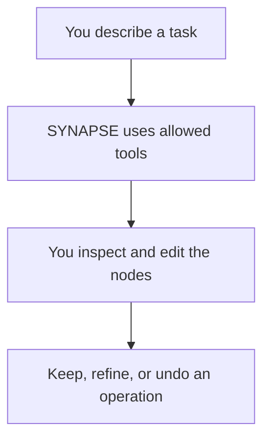
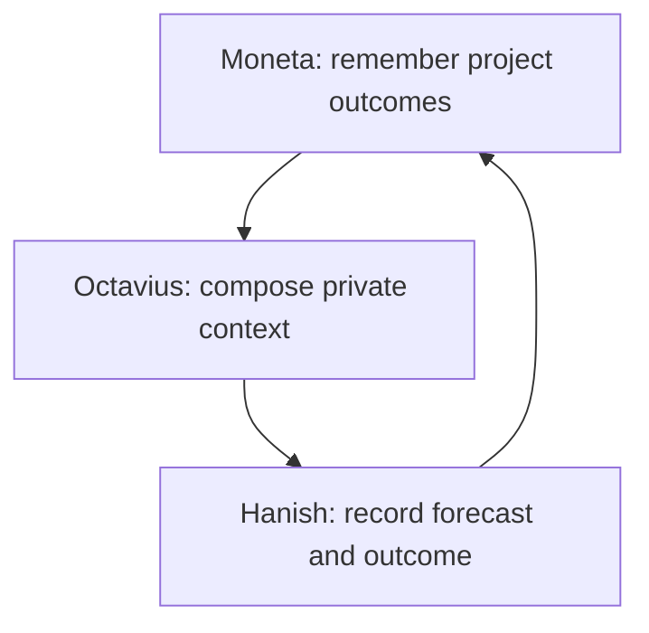

<p align="center">
  
</p>

<p align="center"><strong>Artist-controlled AI assistance inside Houdini.</strong><br>Describe a task. Build editable nodes. Keep the creative decisions.</p>

<p align="center"><sub>v5.67.4 · Houdini 22.0.400 · Python 3.13 runtime<br>tags: v5.67.4 is Latest</sub></p>

[](https://github.com/JosephOIbrahim/Synapse/releases/latest)
[](https://github.com/JosephOIbrahim/Synapse/actions/workflows/ci.yml)
[](LICENSE)

**Start here:** [Install](#start-here) · [First build](#your-first-build) · [What's ready](#whats-ready) · [Help](#when-you-get-stuck)

## The idea

SYNAPSE helps with the routine work of building and inspecting Houdini networks,
so you can spend more attention on the parts that make a shot yours.

Think **cruise control**: you decide when help is useful and what you want to make.
That is our [artist-first intent](INTENT.md). Full predictive creation and Computer
Use are future capabilities; today's starting point is explicit requests and a
small, optional checked-suggestion scaffold.

## Start here

**Current validation target:** Windows with Houdini **22.0.400** and its bundled
Python **3.13**. Other builds need their own checks.

1. Obtain the reviewed **SYNAPSE-5.67.4-Setup.exe**, save your scene, and close Houdini.
2. Open Setup, choose the Houdini build and preference folder, then click **Install**.
3. Launch Houdini. Open **New Pane Tab → Synapse** and run **Doctor**.
4. Click **Connect models**, choose an engine and model, select **Build and edit networks**, then **Check connection → Use this model**.

The wizard is an unsigned local review build on this branch; it has not been
published as a new release. Installation requires no terminal or system Python.
[Source installation and full instructions →](docs/getting-started/installation.md)

For cloud engines, enter the API key in the connection dialog. For a local model,
start Ollama first and choose an installed model. The connection check reads
metadata; it does not test a build. Tool support varies by model.

**Two different controls:** **Connect models** chooses your AI service.
**Connect** starts Houdini's local bridge. **Doctor** checks SYNAPSE without asking
a model. [Full setup and troubleshooting →](docs/getting-started/installation.md)

## Your first build

Start in a scratch scene. Send:

```text
make a box
```

Inspect the result in Houdini, then try **Undo**. Undo operates on a recorded
operation; it does not reverse an entire conversation or external file writes.

For the Solaris demo, start with **“create a solaris network”**, then specify your
geometry, HDRI, lights, MaterialX material, camera and Karma XPU settings. Check
the resulting nodes and render configuration before treating it as shot-ready.

[First-session walkthrough →](docs/getting-started/quickstart.md)


```mermaid
flowchart TD
    A["You describe a task"] --> B["SYNAPSE uses allowed tools"]
    B --> C["You inspect and edit the nodes"]
    C --> D["Keep, refine, or undo an operation"]
```

[](https://vimeo.com/1216840044)

*Recorded demonstration; the current panel and feature limits are described below.*

## What's ready

| Feature | Current state |
|---|---|
| **Build and inspect** | Explicit requests through the panel's permitted tools; editable Houdini nodes. |
| **Choose your model** | Claude, Gemini, NVIDIA Nemotron, Ollama and a custom OpenAI-compatible endpoint. Capabilities vary by model. |
| **Doctor and panel controls** | Direct diagnostics, visible Connect / Doctor controls, and installed Ollama model discovery. |
| **Saved lookdev suggestion** | Optional Stage 0 scaffold for one checked workflow. It prepares an editable prompt; you decide whether to send it. |
| **Memory LOOP** | Optional observation and recall across Moneta, Octavius and Hanish. Requires configured substrates. |
| **Predictive creation + Computer Use** | Product direction in [INTENT.md](INTENT.md); independent artist controls are planned. |
| **Recursive self-improvement** | A development direction. Stage 0 is a starting scaffold, not a self-maintaining system. |

<details>
<summary><strong>How the three memory substrates work together</strong></summary>


```mermaid
flowchart TD
    M["Moneta: remember project outcomes"] --> O["Octavius: compose private context"]
    O --> H["Hanish: record forecast and outcome"]
    H --> M
```

SYNAPSE coordinates this optional loop around requested operations. Recalled
records remain advice; they do not choose the next scene action. Unavailable
substrates and unknown outcomes remain visible.

Saved suggestions require an initialized project store and a compatible,
developer-imported record. Use **lightning tools menu → Saved lookdev suggestion…**
or `/lookdev-suggestion`. **Use in prompt** prepares text without sending it.
Exact version matching means an older checked experience needs a new rehearsal
and import after a SYNAPSE version change.

[LOOP setup](docs/MEMORY_LOOP_REPAIR.md) · [Stage 0 setup](docs/development/rsi_stage0.md) · [Detailed diagrams](docs/architecture/overview.md#memory-loop)

</details>

## When you get stuck

| What you see | First thing to try |
|---|---|
| No Synapse pane | Restart Houdini, then follow [installation verification](docs/getting-started/installation.md#verify-the-installation). |
| Missing Ollama models | Start Ollama at the configured address, reopen **Connect models**, then **Check connection**. |
| Houdini connection trouble | Click **Connect**, then **Doctor**. |
| No saved suggestion | Read the card's reason. A matching imported experience and an available project memory owner are required. |

**Know the limits:** a failed build can leave partial nodes; undo grouping does
not guarantee rollback. Stop prevents further panel work, but does not prove that
a running cook or render has finished. The external bridge has broader permissions
than normal panel chat and is intended for a single-user local machine.

[Current limits and verification](docs/status.md) · [Report a bug](https://github.com/JosephOIbrahim/Synapse/issues/new/choose)

<details>
<summary><strong>For developers: architecture, evidence and contribution</strong></summary>

**128 tools, two paths.** The [registry](python/synapse/mcp/_tool_registry.py) is the
authority. HTTP MCP and WebSocket execution have different policy boundaries;
the panel's worker adds its own tool restrictions and model-data permissions.

- [Architecture and Mermaid diagrams](docs/architecture/overview.md)
- [Developer installation and tests](docs/getting-started/installation.md#source-installs-and-contributors)
- [Windows installer build instructions](installer/README.md) and [verification record](docs/getting-started/windows-installer-verification.md)
- [MCP client setup](docs/mcp/SETUP.md)
- [Changelog](CHANGELOG.md) and [release notes](https://github.com/JosephOIbrahim/Synapse/releases)
- [Contribution rules](AGENTS.md) and [execution contracts](CLAUDE.md)

GitHub CI runs the stock-Python suite on Linux and macOS. Native Houdini checks
are a separate qualification; a green CI badge is not a live render or demo pass.
Release tags are created after version agreement and published after their
exact commit passes CI. [Release process →](docs/architecture/overview.md#release-process)

</details>

## License

[MIT](LICENSE). Patent applications pending on the USD cognitive-state substrate,
digital injection, and predictive lighting.
