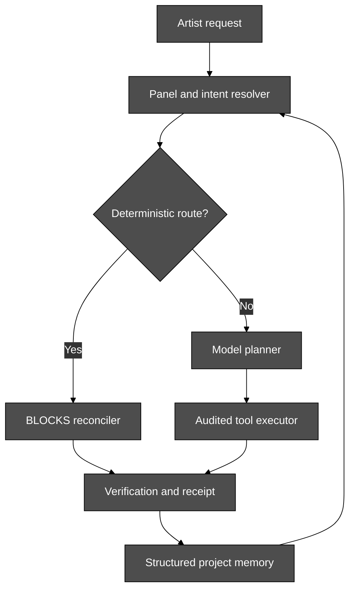

# SYNAPSE Next-System Blueprint

## From an in-Houdini agent to a deterministic, persistent production collaborator

| Field | Value |
|---|---|
| Status | Adopted 2026-08-08 with five review amendments (see §14) |
| Baseline | SYNAPSE `v5.44.0`, commit `df60f6393eab89990dbfd6b01bbf5d550a2c199f` |
| Baseline date | 2026-08-08 |
| Initial runtime pin | Houdini `22.0.368` · Python `3.13` · OpenUSD `0.26.5` |
| Intended sequence | `v5.44.1` release repair → `v5.44.x` memory recovery → `v5.45` deterministic recipes → `v5.46` captured network memory |
| Primary owner | Joseph Ibrahim |
| Specification ID | `SYN-NEXT-001` |

---

## 0. Executive directive

SYNAPSE should stop optimizing for the number of tools and finish four complete production loops:

1. **Release truth** — the repository, installed package, documentation, tag, and CI must agree about what shipped.
2. **Memory truth** — the selected memory backend must either open and serve the expected store or fail visibly. It may never impersonate success through a silent empty fallback.
3. **Deterministic intent** — a known artist request must resolve to a known fixture before a model is called, then reconcile the live scene to an evidenced target.
4. **Structural recall** — an artist must eventually be able to capture a real network, restart Houdini, ask for it again, and reproduce the same graph on a supported build.

The governing rule is:

> **A claim requires an observation. An unobserved state renders `UNKNOWN`; a failed subsystem renders failed; a deterministic request never depends on sampling.**

This blueprint deliberately stages two different products:

- **Track A — deterministic recipes:** a phrase invokes a curated, committed fixture. This is the near-term product and should ship first.
- **Track B — captured network memory:** SYNAPSE serializes the artist's actual graph into a fixture and recalls it later. This is the literal memory promise and follows after the storage substrate is trustworthy.

Track A must not be marketed as Track B.

---

## 1. Product definition from first principles

### 1.1 The product promise

SYNAPSE is an AI-assisted production system inside Houdini that can understand bounded scene context, propose or execute changes, preserve artist ownership, verify observable outcomes, and carry useful project state across sessions.

For a supported deterministic workflow, the artist should be able to say:

> "Create my standard Karma XPU shot setup."

SYNAPSE should then:

1. Resolve the phrase without a model call.
2. Preview the exact intended graph and any collisions.
3. Apply or reconcile the graph in the live Houdini scene.
4. Preserve unrelated artist work.
5. Report scene mutations, disk writes, build pin, undo coverage, and verification status.
6. Repeat the same request as a no-op when the graph already matches.

For captured memory, the artist should be able to say:

> "Remember this network as my hero-shot lighting setup."

After a restart, the same project should resolve that phrase to the captured structural fixture and reproduce it on the supported Houdini build.

### 1.2 What makes the problem hard

The product has six independent sources of uncertainty:

1. **Language is ambiguous.** Similar phrases may represent different operations.
2. **Model output is sampled.** The same prompt is not an executable specification.
3. **Houdini is mutable.** Names collide, defaults drift, cooks have side effects, and UI work can block the main thread.
4. **Ownership is ambiguous.** SYNAPSE must distinguish its nodes from artist nodes before deleting or replacing anything.
5. **Memory has multiple failure planes.** Data may be written but not durable, durable but unopenable, open but searched under the wrong record type, or recalled in nondeterministic order.
6. **"Houdini 22" is not one runtime.** Node types, parameter schemas, Python ABI, help content, and composed USD can change by point build.

The architecture must therefore convert ambiguity into explicit state before mutation.

### 1.3 Non-negotiable system laws

| Law | Requirement |
|---|---|
| Truth | Never render pass, healthy, remembered, deterministic, or verified without an observation that supports it. |
| Fail-visible | A requested backend that cannot serve must surface a blocking status in the panel and diagnostics. |
| Artist sovereignty | Unowned nodes are never deleted, renamed, rewired, or absorbed silently. |
| Determinism | A deterministic route contains no model decision after the route resolves. |
| Reversibility | Houdini mutations are undo-grouped where supported; irreversible disk/network effects are separately declared. |
| Build pinning | Runtime claims name the exact verified Houdini build and evidence tier. |
| Boundedness | Scene reads, UI rendering, memory queries, retries, and tool execution have measured limits. |
| One authority | Version, backend state, fixture identity, and memory-store identity each have one canonical source. |

---

## 2. Current-state assessment

| Capability | Current state at v5.44.0 | Required state |
|---|---|---|
| In-process Houdini execution | Exists and directly calls `hou.*` | Preserve; keep main-thread boundaries explicit |
| H22 symbols and node reference | Build-pinned for `22.0.368` | Add repeatable re-stamp/rebaseline workflow per supported build |
| Workflow prose | Primarily Houdini 21 | Build a provenance-labelled H22 corpus, prioritizing Solaris and Copernicus |
| Deterministic graph construction | BLOCKS reconciler exists and is oracle-pinned | Connect phrase → fixture → panel → receipt |
| Fixture inventory | One fixture: `solaris.basic` | Ship a small, high-value production registry |
| Prompt-to-fixture routing | Absent | Deterministic pre-model resolver |
| Network-to-fixture capture | Absent | LOP capture, round-trip verification, project storage |
| Memory backend | Moneta selected by the Houdini package | Open reliably or fail visibly; no silent JSONL substitution |
| Persisted Moneta store | Existing `256`-dim store conflicts with `384`-dim embedder | Manifest-driven compatible open or explicit backup-first migration |
| Recall semantics | DECISION-only substring scan | Typed, normalized, deterministic cross-kind retrieval |
| Memory durability | Snapshot timer and clean-exit assumptions; abrupt-exit gaps | Explicit durability contract with crash and real-Houdini shutdown evidence |
| Fidelity UI | Unmeasured now renders `UNKNOWN` | Preserve and unify across every receipt surface |
| Freeze diagnosis | Result-path instrumentation exists | Run the live protocol, attribute, then optimize the measured owner |
| CI | Stock Python lane excludes Houdini tests; Moneta may skip | Mandatory release evidence from stock, Moneta, hython, and GUI lanes |
| Release identity | `VERSION=5.44`, package/runtime `5.43`, README `5.42` | One canonical version propagated and tested before tag creation |

---

## 3. Target architecture



### 3.1 Experience plane

Owns:

- Chat and recipe palette.
- Deterministic-route preview.
- Collision and risk disclosure.
- Backend/build health.
- Approval, rejection, Stop, and emergency controls.
- Human-readable execution receipts.

It does not invent health or fidelity values. Every displayed state is derived from a structured producer.

### 3.2 Intent plane

Owns:

- Prompt normalization.
- Exact aliases and deterministic recipe selection.
- Ambiguity detection.
- Route provenance.
- Model fallback only after deterministic routes miss.

The intent plane is pure Python and imports neither `hou` nor Qt.

### 3.3 Execution plane

Contains two explicitly labelled modes:

- **Deterministic execution:** BLOCKS fixture reconciliation.
- **Generative execution:** model-selected tools through the existing audited bridge.

The UI and receipts must never blur these modes. "Deterministic" is reserved for fixture-backed execution with a valid oracle.

### 3.4 Memory plane

Owns:

- Store identity and health.
- Durable records and structural fixture references.
- Exact alias retrieval, semantic retrieval, and deterministic ranking.
- Backend migrations.
- Project identity across unsaved and saved scene transitions.

### 3.5 Verification plane

Owns:

- Before/after scene hashes.
- Fixture oracle verdicts.
- Mutation and disk-write manifests.
- Undo coverage.
- Fidelity and UNKNOWN semantics.
- RETINA render receipts where pixels are relevant.
- Main-thread and result-render telemetry.

### 3.6 Operations plane

Owns:

- Version synchronization and release state machine.
- Stock Python CI.
- Moneta-enabled CI.
- Hython and Houdini-GUI acceptance receipts.
- Build-pinned corpus and fixture regeneration.
- Publicly discoverable critical issues.

---

## 4. Canonical data contracts

These contracts should be versioned independently. A schema change is explicit and migratable; it is not inferred from whichever code happens to read the file.

### 4.1 Intent route

```json
{
  "schema": "synapse.intent_route/v1",
  "route_id": "uuid",
  "raw_prompt": "Create my standard Karma XPU shot setup",
  "normalized_prompt": "create my standard karma xpu shot setup",
  "route_kind": "fixture",
  "target": "solaris.karma_xpu_shot",
  "matched_alias": "create my standard karma xpu shot setup",
  "resolution": "exact_alias",
  "model_calls": 0,
  "status": "resolved"
}
```

Allowed `route_kind` values:

- `fixture`
- `model`
- `clarify`
- `refuse`

An alias collision produces `clarify`; insertion order never decides.

### 4.2 Fixture registry record

```json
{
  "schema": "synapse.fixture_registry/v1",
  "fixture": "solaris.karma_xpu_shot",
  "fixture_version": "1.0.0",
  "target_build": "22.0.368",
  "canonicalizer": "c3",
  "aliases": [
    "create my standard karma xpu shot setup",
    "build the standard karma shot"
  ],
  "ownership": "network_box",
  "gate": "review",
  "baseline_sha256": "...",
  "evidence_tier": "verified-runtime",
  "status": "active"
}
```

The fixture body continues to own node definitions, wiring, authored parameters, positions, display state, and oracle provenance. The registry owns discovery and product policy.

### 4.3 Memory store manifest

```json
{
  "schema": "synapse.memory_store/v2",
  "store_id": "uuid",
  "project_id": "uuid",
  "backend": "moneta",
  "embedder": {
    "id": "hash-ngram-v1-d256-n1_3",
    "dimension": 256
  },
  "snapshot": {
    "schema": 1,
    "row_count": 355,
    "sha256": "..."
  },
  "wal": {
    "path_class": "store_relative",
    "last_seq": 0,
    "sha256_at_snapshot": "..."
  },
  "migration": {
    "state": "none",
    "last_successful_version": null
  },
  "created_at": "ISO-8601",
  "updated_at": "ISO-8601"
}
```

The persisted embedder identity is authoritative for opening an existing index. A configured embedder may propose a migration; it cannot silently reinterpret stored vectors. The `wal` block exists because recovery and compatible-open cover both artifacts, not the snapshot alone (Amendment A2).

### 4.4 Memory record

```json
{
  "schema": "synapse.memory_record/v2",
  "id": "valid-uuid4",
  "kind": "recipe",
  "summary": "Hero-shot lighting setup",
  "content": "Artist-facing description",
  "structured_payload": {
    "fixture_ref": "project.hero_shot_lighting@1.0.0"
  },
  "content_fingerprint": "sha256",
  "created_at": "ISO-8601",
  "updated_at": "ISO-8601",
  "protected": true,
  "provenance": {
    "source": "captured_network",
    "houdini_build": "22.0.368"
  }
}
```

Identity and deduplication are separate concerns:

- `id` is unique and WAL-compatible.
- `content_fingerprint` supports duplicate detection or deliberate versioning.

### 4.5 Execution receipt

```json
{
  "schema": "synapse.execution_receipt/v2",
  "receipt_id": "uuid",
  "route": "intent-route-id",
  "execution_mode": "deterministic_fixture",
  "fixture": "solaris.karma_xpu_shot@1.0.0",
  "target_build": "22.0.368",
  "before_scene_hash": "...",
  "after_scene_hash": "...",
  "operations": 12,
  "collisions": [],
  "ejected": [],
  "disk_writes": [],
  "undo_wrapped": true,
  "oracle": {
    "status": "pass",
    "canonicalizer": "c3",
    "observed_sha256": "..."
  },
  "fidelity": {
    "status": "observed",
    "value": 1.0
  },
  "prompt_provenance": {
    "turns_composed": 1,
    "raw_turn_ids": ["uuid"]
  },
  "timing": {
    "dispatch_wait_ms": null,
    "main_thread_hold_ms": null,
    "stream_ms": null,
    "finalize_ms": null
  },
  "status": "pass"
}
```

If no fidelity-producing operation ran, `fidelity.status` is `unmeasured` and no numeric value is present. The `prompt_provenance` block records which raw user turns composed the provider request (Amendment A1); `timing` is the persistent carrier for W8 phase attribution and budget regression, and unmeasured phases render `null`, never `0` (Amendment A3).

### 4.6 Health snapshot

The panel and `synapse_doctor` should consume the same producer:

```json
{
  "schema": "synapse.health/v1",
  "synapse_version": "5.45.0",
  "version_consistent": true,
  "houdini_build": "22.0.368",
  "build_verified": true,
  "memory_backend_requested": "moneta",
  "memory_backend_active": "moneta",
  "memory_store_status": "open",
  "memory_row_count": 356,
  "transport_status": "connected",
  "deterministic_fixture_count": 5,
  "degraded_reasons": []
}
```

---

## 5. Required workstreams

## W0 — Release integrity hotfix

**Priority:** P0  
**Target:** `v5.44.1`  
**Purpose:** Make release identity a mechanically enforced fact.

### Required changes

1. Declare root `VERSION` as the sole canonical version source.
2. Add `scripts/sync_version.py` to update:
   - `pyproject.toml`
   - `python/synapse/__init__.py` docstring
   - `python/synapse/__init__.py::__version__`
   - `CLAUDE.md` current-version banner
   - `README.md` current-version banner
   - install/demo metadata that represents the current release
3. Do not rewrite historical baseline strings or archived receipts.
4. Make `--check` non-mutating and nonzero on drift.
5. Replace ad hoc `Set-Content VERSION ...` release logic with:

```text
set canonical version
→ synchronize derived surfaces
→ run version and release-state tests
→ run required suites
→ commit
→ create tag at that exact commit
→ push
→ verify remote tag and release
```

6. Update `CHANGELOG.md` through v5.44.1 and make release notes link to a current record.
7. Refuse tag creation when the working tree is dirty, derived versions differ, tests fail, or the target tag already points elsewhere.

### Acceptance gates

- `VERSION`, package metadata, runtime `__version__`, installer stamp, README, and current banner all report `5.44.1`.
- `pytest tests/test_phase0c_doc1_version_conformance.py -q` passes after the version change and after tag creation.
- A mutation control changing any derived version makes CI fail.
- `import synapse; print(synapse.__version__)` reports the tagged version inside Houdini.

---

## W1 — Moneta recovery and fail-visible open

**Priority:** P0  
**Target:** `v5.44.x` before any new memory feature  
**Purpose:** Preserve existing deposits and eliminate false-working memory.

### Required changes

1. **Preserve before mutation.** Provide a read-only recovery command that:
   - Locates the active snapshot and WAL.
   - Copies them to a durable, user-selected recovery directory.
   - Records byte size and SHA-256.
   - Never constructs a writable store against the original.
2. Add `memory/manifest.py` and persist the store contract described in §4.3.
3. On open:
   - Read persisted embedder identity/dimension first.
   - Instantiate a compatible embedder when available.
   - Otherwise return a typed migration-required result.
   - Never hydrate a `256`-dim index through a `384`-dim configuration.
4. Add explicit backend policy values:
   - `auto`: an unavailable optional backend may select the documented default, with a visible degraded status.
   - `moneta`: Moneta must serve or the memory subsystem is failed.
   - `jsonl`: JSONL must serve.
   - `shadow`: both stores must serve or shadow mode is degraded and visible.
5. Eliminate the current "requested Moneta, silently served JSONL" behavior.
6. Surface failure in:
   - Panel health row.
   - `synapse_doctor`.
   - Memory tool responses.
   - Logs and telemetry.
7. Provide an explicit, backup-first migration command for re-embedding. Migration never runs during normal panel startup.

### Acceptance gates

- The preserved production snapshot opens using its compatible `256`-dim embedder with all existing rows intact.
- The original bytes remain unchanged during recovery verification.
- One deposit followed by a fresh-process open and recall succeeds.
- Forced embedder mismatch produces a visible failed/migration-required state and never returns an empty healthy store.
- A negative control reintroducing fallback-as-success fails tests.
- The operator can identify requested backend, active backend, embedder ID, dimension, store path class, and row count from one health response.

---

## W2 — Memory identity, durability, and lifecycle

**Priority:** P0/P1  
**Dependency:** W1  
**Purpose:** Make "stored" mean uniquely identified, reopenable, and bounded by an explicit loss contract.

### Required changes

1. Replace content-derived entity IDs with valid UUIDs. Use `content_fingerprint` for duplicate detection.
2. Migrate or map legacy `mem_*` IDs before any code writes them into a UUID-only WAL.
3. Stop `signal_attention` from poisoning the WAL with incompatible IDs.
4. Make `reset_synapse_memory` close the existing store and release the URI lock before constructing another.
5. Add idempotent `close()` semantics and lifecycle tests.
6. Resolve the pending durability ruling separately from W1:
   - Define whether acknowledgement means "in memory," "snapshotted," or "journalled."
   - State the maximum data-loss window in the UI and docs.
   - Prefer an append-only deposit journal or transactional WAL over full snapshot fsync per deposit.
7. Test all shutdown shapes:
   - Normal interpreter exit.
   - `sys.exit()`.
   - `os._exit()`.
   - `hou.exit()` under hython.
   - Closing the Houdini GUI.
   - Native crash simulation where safe.
8. Give unsaved scenes a durable seat-scoped project identity rather than treating a temp directory as the project.
9. When the HIP is first saved, transactionally bind or migrate the unsaved project memory to the saved project without creating two active authorities.

### Acceptance gates

- Same-content records created concurrently receive distinct IDs.
- Search followed by abrupt exit does not prevent the next open.
- Reset/reload never produces a resource-lock fallback.
- The durability test matrix reports exactly which records survive each shutdown shape.
- An unsaved-scene record remains discoverable after the HIP is saved and Houdini is restarted.
- No durability claim exceeds the evidence of the tested shutdown path.

---

## W3 — Unified, deterministic recall

**Priority:** P1  
**Dependency:** W1  
**Purpose:** Make recall find what the artist actually asked SYNAPSE to remember.

### Required changes

1. Introduce explicit record kinds including `note`, `decision`, `recipe`, `observation`, and `preference`.
2. Replace DECISION-only recall with a typed query API:

```python
recall(query, kinds=None, project_scope="current", limit=5)
```

3. Normalize queries with one shared pure function:
   - Unicode NFC.
   - Case folding.
   - Whitespace collapse.
   - Terminal punctuation normalization.
   - No lossy removal of path or node-name characters when the query is technical.
4. Retrieval order:
   - Exact registered alias.
   - Exact normalized title/summary.
   - Token/phrase match.
   - Semantic vector retrieval.
   - Stable tiebreak by score, freshness, and ID.
5. Reuse the same normalizer for deterministic fixture aliases. Recall and M6 are one addressing problem, not parallel implementations.
6. Return backend health and evidence with results.
7. A recipe record stores a fixture reference, not prose pretending to be a network.

### Acceptance gates

- The original remembered Solaris request and all approved punctuation/case variants resolve to the same record.
- A NOTE or RECIPE is discoverable without being mislabeled as a DECISION.
- Same store and same query produce byte-stable ordered result IDs across fresh processes.
- A failed store cannot return `found=false`; it returns a store failure.
- Semantic fallback never outranks an exact alias.

---

## W4 — Deterministic intent router

**Priority:** P1  
**Target:** `v5.45`  
**Purpose:** Make known requests deterministic and zero-token.

### Required changes

1. Add a pure intent package:

```text
python/synapse/intent/
    __init__.py
    normalize.py
    resolver.py
    registry.py
    models.py
```

2. Route before constructing a provider request.
3. Resolve only explicit registered aliases in v1. Do not use model-generated similarity to claim deterministic routing.
4. Detect aliases mapping to multiple active fixtures and return `clarify`.
5. Preserve the raw and normalized prompt in the route receipt.
6. On deterministic match:
   - Produce zero model calls.
   - Preview fixture, build pin, expected ownership, collisions, and disk effects.
   - Apply only after the relevant gate.
7. On miss, pass the original request to the ordinary model path with a route receipt that says `model`.
8. Use `panel/hda_controller.py::_select_recipe` as an implementation precedent, while replacing keyword scoring with explicit registry semantics for deterministic routes.
9. The generative path crosses the turn-boundary seam that the deterministic path bypasses; W7's `prompt_provenance` receipt field and its pinned one-turn-one-request test are the required control for that seam (Amendment A1).

### Acceptance gates

- A registered phrase invokes the expected fixture with `model_calls=0`.
- Repeating it on an applied graph returns a no-op receipt.
- Alias collisions cannot be resolved by file order.
- A model provider outage does not affect registered deterministic recipes.
- The panel visually distinguishes deterministic and generative execution.

---

## W5 — Fixture registry and initial production recipes

**Priority:** P1  
**Dependency:** W4  
**Purpose:** Turn the BLOCKS engine into a small, useful product surface.

### Initial fixture set

The release target is five evidenced fixtures, not fifty speculative ones:

1. `solaris.basic` — existing basic LOP chain.
2. `solaris.karma_xpu_shot` — camera, render settings, render product, resolution, and safe output tokens.
3. `solaris.materialx_lookdev` — Material Library plus a documented MaterialX surface skeleton.
4. `solaris.aov_package` — cryptomatte/ID and production render-var starter configuration.
5. `cops.texture_process` — a compact Houdini 22 Copernicus image-processing starter graph.

Exact names may change during live assay; runtime truth decides.

### Fixture requirements

Every fixture must include:

- Exact supported Houdini build.
- Canonicalizer version.
- Baseline hash.
- Live producer command and receipt.
- Ownership boundary.
- Collision policy.
- Remove semantics.
- Authored parameter representation using unexpanded strings where relevant.
- Cross-`$HIP` portability test.
- No undocumented destructive disk behavior.
- An explicit upgrade/rebaseline status.

### Product features

- Searchable recipe palette.
- "What will change?" preview.
- Apply/reconcile/remove actions.
- Build compatibility indicator.
- Receipt history per project.
- Clear label when a recipe is curated rather than learned from the current artist.

### Acceptance gates

- Each fixture passes clean apply, remove/reapply, no-op, collision, artist-node preservation, and cross-machine canonical tests.
- Every node type and parameter name is live-verified on the target build.
- No recipe is visible in the panel until its runtime receipt is current.
- An unsupported build refuses or enters an explicit migration/rebaseline flow; it does not claim deterministic parity.

---

## W6 — Capture current network into structural memory

**Priority:** P1/P2  
**Target:** `v5.46`  
**Dependencies:** W1, W2, W3, W5  
**Purpose:** Deliver the literal "remember this network" promise.

### V1 scope

- LOP networks only.
- A selected network box, explicit node selection, or explicit `/stage` subtree.
- Same Houdini build replay only.
- No automatic cross-build migration.
- No capture of arbitrary Python callbacks or external side effects as executable code.

### Proposed API

```python
capture_fixture(
    network_path: str,
    fixture_name: str,
    selection: list[str] | None = None,
    parm_mode: str = "authored_delta",
) -> CaptureResult
```

### Capture representation

V1 should store:

- Exact node names.
- Version-aware type identity.
- Connections and input indices.
- Positions and display state.
- Network-box ownership.
- Non-default authored parameters.
- Raw/unexpanded string values.
- Build pin and default-signature fingerprint.
- External references as references, never copied silently.
- Unsupported dynamic expressions or callbacks as declared capture warnings.

`authored_delta` is recommended over dumping every parameter. Exactness is guaranteed on the pinned build; a build change is a migration event. This avoids treating volatile defaults and internal parameters as portable authored intent.

### Capture workflow

```text
select graph
→ observe and validate scope
→ generate draft fixture
→ show unsupported data and external effects
→ round-trip in a scratch context
→ compare canonical hash
→ artist approves name and aliases
→ persist fixture and recipe memory
```

Draft fixtures live under a project-owned path such as:

```text
$HIP/.synapse/fixtures/
```

For an unsaved scene, use the durable unsaved-project identity from W2, not `$HOUDINI_TEMP_DIR/untitled`.

### Acceptance gates

- Capture → remove → apply reproduces the same canonical graph hash on the same build.
- Unsupported features appear in the result and prevent a false full-fidelity claim.
- Unselected artist nodes remain byte-equivalent.
- Restarting Houdini and invoking an approved alias resolves to the captured fixture without a model call.
- Captured fixture and memory record survive the tested durability contract.
- Build mismatch refuses deterministic replay until migrated or re-verified.

---

## W7 — Unified verification and receipts

**Priority:** P1  
**Purpose:** Make every action answer: what was intended, what changed, and what was proven?

### Required changes

1. Make `execution_receipt/v2` the common result contract for deterministic and generative paths.
2. Record:
   - Intent route.
   - Execution mode.
   - Requested and active build.
   - Before/after scene hashes.
   - Planned versus observed operations.
   - Node ownership and collisions.
   - Undo coverage.
   - Disk and network effects.
   - Oracle/fidelity status.
   - Error or degraded state.
   - Prompt provenance: which raw user turns composed the provider request (Amendment A1).
   - Phase timing where measured; unmeasured phases render null (Amendment A3).
3. Persist receipts atomically under the project `.synapse` directory.
4. Keep raw operational evidence available without flooding the panel.
5. Render one concise artist-facing verdict with an expandable technical detail view.
6. Connect relevant render operations to RETINA T0/T1 receipts.
7. Preserve `UNKNOWN` when pixels, fidelity, or runtime facts were not observed.
8. Add one pinned test asserting one-turn-one-request at the turn boundary: two consecutive user messages plus a verb click may never compose into a single provider request without an explicit `turns_composed > 1` receipt (Amendment A1).

### Acceptance gates

- A disk write outside Houdini undo is named separately.
- An apply that partially fails cannot render pass.
- A no-op receipt proves the observed graph already matched.
- A deterministic receipt contains the fixture oracle and route showing zero model calls.
- Generative execution never inherits the deterministic visual token.
- A receipt whose `prompt_provenance.turns_composed` exceeds 1 renders that fact in the panel detail view (Amendment A1).

---

## W8 — Freeze attribution and performance budgets

**Priority:** P1  
**Purpose:** Protect Houdini interactivity using measured ownership rather than speculative rewrites.

### Required sequence

1. Run the existing `FRZ_REPRO.md` protocol in the real Houdini GUI.
2. Capture at least three representative turns:
   - Small read-only query.
   - Medium node operation.
   - Large reply/review rendering path.
3. Attribute time among dispatch wait, Houdini main-thread hold, panel streaming, finalization, HTML insertion, and Review rebuild.
4. Optimize only the measured dominant phase.

### Initial budgets

| Surface | Budget |
|---|---:|
| Deterministic alias resolution, 1,000 aliases | p95 `< 5 ms` |
| Pure fixture planning, 500 nodes | p95 `< 25 ms` |
| Streaming UI result phase | p95 `< 16.7 ms` |
| End-of-turn finalization | p95 `< 50 ms` |
| Any single panel result phase | Warn at `≥ 250 ms` |
| Health snapshot | `< 50 ms`, no network |
| Exact memory lookup, 10k records | p95 `< 20 ms` |
| Local semantic lookup, 10k records | p95 `< 100 ms` on the reference workstation |

These are product targets, not claims. Each becomes binding only after a repeatable benchmark records the reference hardware and dataset. Phase durations persist in the execution receipt `timing` block so budgets can regression-test (Amendment A3).

### Likely remediation classes

- Bounded/virtualized chat document history.
- Batched token rendering rather than per-token rich-text relayout.
- Background formatting with minimal main-thread insertion.
- Incremental Review updates rather than full widget reconstruction.
- Chunked Houdini mutations that yield to the event loop where safe.

### Acceptance gates

- The original freeze has an attributed layer and producer trace.
- The remediation lowers the attributed metric in both benchmark and GUI reproduction.
- Off-main work is never counted as a GUI stall.
- Instrumentation overhead is separately measured and bounded.

---

## W9 — H22 knowledge and build lifecycle

**Priority:** P1/P2  
**Purpose:** Make "knows Houdini 22" precise and maintainable.

### Required changes

1. Keep separate knowledge classes:
   - Runtime symbols.
   - Node/parameter reference.
   - Workflow prose.
   - Live fixture evidence.
2. Attach provenance to every retrieval chunk:
   - Source version/build.
   - Extraction date.
   - `verified-runtime`, `verified-doc`, or `inferred` tier.
3. Build a Houdini 22 workflow corpus with priority order:
   - Solaris/USD composition.
   - Karma XPU/render products/AOVs.
   - MaterialX.
   - Copernicus.
   - Main-thread and render lifecycle APIs.
4. On a new Houdini point build:
   - Re-stamp symbols.
   - Assay node types and relevant parameters.
   - Run fixture invariants.
   - Rebaseline only with an explained canonical change.
   - Publish a support-matrix row.
5. Do not label H21 prose as H22 merely because the concept still appears valid.
6. A re-stamp is complete only when stale prior-build pins are zeroed or explicitly declared historical. Baseline at adoption: 18 in-tree references to `22.0.397` and 2 to `22.0.382` against a `22.0.368` doc pin (Amendment A4).

### Acceptance gates

- Every answer can report the provenance tier of its grounding.
- Copernicus "what is this node?" and "how do I build this workflow?" both have H22-labelled sources.
- A build drift changes health/support state before it changes fixture behavior silently.
- Support claims name exact tested builds.
- A completed re-stamp leaves zero undeclared stale build pins in `python/`, `fixtures/`, and `docs/` (Amendment A4).

---

## W10 — CI, packaging, and installation

**Priority:** P1  
**Purpose:** Test the environments users actually run and make installation diagnosable.

### CI lanes

| Lane | Environment | Required evidence |
|---|---|---|
| Stock | Linux/macOS Python `3.11`, `3.13`, `3.14` | Pure logic, packaging, provider, source pins |
| Moneta | Same matrix with pinned Moneta installed | Store, migration, recall, crash harness |
| Hython | Windows, supported Houdini build | `hou`, `pxr`, fixture invariants, handlers |
| GUI | Houdini GUI | Panel registration, main-thread behavior, freeze protocol, visible health |
| Release | Exact tagged commit | Version consistency, required receipts, changelog/release notes |

### Required changes

1. Add Python `3.13` to stock CI because it is the H22 host ABI.
2. Make the Moneta deploy key and active-backend tripwire mandatory for release branches.
3. Keep ordinary contributor CI able to explain why Moneta is unavailable, but do not call that run complete memory coverage.
4. Use a dedicated, isolated Windows Houdini runner or a signed local acceptance receipt. Do not expose a primary production workstation directly as an unbounded public runner.
5. Install `websockets` and pinned `mcp` into the hython test environment so collection gaps are intentional rather than accidental.
6. Keep the package installer authoritative about:
   - `hpath` for H22.
   - Both repository root and `python/` on `PYTHONPATH`.
   - Vendored ABI support.
   - Active Moneta location.
7. Add a one-screen install/health report suitable for attaching to a GitHub issue.

### Acceptance gates

- A release cannot be green when the selected production memory backend was not tested.
- All deselected/skipped tests have machine-readable reasons and a bounded count.
- The GUI panel is discovered from a clean install on the supported H22 build.
- `synapse_doctor --json` and the panel health snapshot agree.

---

## W11 — Safety and destructive-operation policy

**Priority:** P1/P2

### Required changes

1. Route `run_sleep_pass` through an APPROVE human gate before it is exposed as a tool.
2. Treat fixture removal as an explicit artist command, never an automatic cleanup side effect.
3. Keep collision detection before creation because Houdini silently auto-renames.
4. Reject unresolved relative filesystem paths at the write site.
5. Include disk writes and network effects in receipts because Houdini undo cannot reverse them.
6. Prevent captured fixtures from embedding arbitrary executable Python as replayable data.
7. Store API keys outside HIP files, fixture files, receipts, and model context.
8. Make Emergency Halt report separate outcomes for bridge operations, TOP cooks, and external renders.

### Acceptance gates

- Rejection of a destructive gate yields zero destructive effects.
- A fixture cannot delete a node outside its ownership boundary.
- A captured fixture with executable callbacks is refused or stores them as inert, declared text.
- Path-policy negative controls cover Windows rooted, drive-relative, UNC, tokenized, and URI paths.

---

## W12 — Repository governance and public product state

**Priority:** P2  
**Purpose:** Keep the evidence system from obscuring the product state it exists to clarify.

### Required changes

1. Mirror critical known defects into GitHub Issues with severity, affected release, and evidence links.
2. Generate a concise `STATUS.md` from canonical state:
   - Current version.
   - Supported Houdini builds.
   - Active critical issues.
   - Latest suite receipts.
   - Memory/backend status.
   - Panel tool inventory, including `capture_viewport`, each with a one-line documented purpose (Amendment A5).
3. Keep release-critical receipts in-tree; archive bulky campaign intermediates outside the shipped Python package.
4. Separate product code, verification harness, generated evidence, and temporary orchestration state through explicit directory and packaging rules.
5. Replace raw test-count marketing with derived suite results tied to a commit and environment.
6. Require every new subsystem to identify its product surface and live caller. A dormant implementation is not a shipped feature.

### Acceptance gates

- A new contributor can identify the actual P0 blockers without reading `harness/NEXT_SESSION.md` or hundreds of receipts.
- The built wheel excludes orchestration scratch state and large evidence runs.
- Release notes and public issue state do not contradict the repository's known limitations.
- No panel-exposed tool lacks a documented purpose line in `STATUS.md` (Amendment A5).

---

## 6. Recommended repository additions

```text
python/synapse/
    health/
        snapshot.py
    intent/
        models.py
        normalize.py
        registry.py
        resolver.py
    blocks/
        capture.py
        registry.py
    memory/
        manifest.py
        migrations/
            v1_to_v2.py

fixtures/
    registry.json
    solaris.basic.json
    solaris.karma_xpu_shot.json
    solaris.materialx_lookdev.json
    solaris.aov_package.json
    cops.texture_process.json

scripts/
    sync_version.py
    recover_memory_store.py
    migrate_memory_store.py

docs/
    STATUS.md
    support/
        houdini_builds.md
```

Existing modules should be reused where they already own the behavior. The proposed layout is for missing authorities, not permission to duplicate `blocks.runtime`, panel health logic, or existing store adapters.

---

## 7. Release sequence and dependency gates

### Phase 0 — `v5.44.1`: release truth

Ship only when:

- W0 is complete.
- Current documentation is coherent.
- The exact release commit passes version conformance.

No memory migration is bundled into this hotfix.

### Phase 1 — `v5.44.x`: memory recovery

Ship only when:

- The original store has a verified durable backup.
- W1 passes against a copy and then the operator-approved real-store proof.
- No explicit Moneta request can serve JSONL as healthy.
- Fresh-process deposit/recall passes.

W2 durability posture may ship in a following patch if its human ruling remains unresolved, but the release must state the surviving loss window precisely.

### Phase 2 — `v5.45`: deterministic recipes

Ship only when:

- W3, W4, W5, and the deterministic subset of W7 are complete.
- At least five fixtures have current live H22 receipts.
- Exact aliases route before the model.
- The panel exposes preview, apply, no-op, collision, and receipt states.

### Phase 3 — `v5.46`: captured network memory

Ship only when:

- W2 durability and lifecycle are closed.
- W6 round-trips a real LOP graph across restart.
- Captured fixtures are structurally stored and recallable.
- Build mismatch behavior is explicit.

### Phase 4 — production hardening

Complete:

- Measured freeze remediation from W8.
- H22 workflow corpus and build lifecycle from W9.
- Full release lanes from W10.
- Public status/governance from W12.

---

## 8. Acceptance matrix

| Test surface | Must prove |
|---|---|
| Pure Python | Normalization, route collision, fixture planning, schemas, stable ranking, version sync |
| Stock CI | Package import, providers, safety source pins, documentation consistency |
| Moneta-enabled CI | Open, migration, add/query, UUID/WAL compatibility, lock lifecycle, abrupt-exit recovery |
| Hython | Node types, parameters, fixture invariants, USD canonical hashes, handler behavior |
| Houdini GUI | Panel discovery, health status, pre-model routing, gates, main-thread behavior, freeze attribution |
| Fresh process | Store reopen, deterministic recall ordering, captured-fixture recall |
| Cross-`$HIP` | Fixture canonical portability |
| Unsupported build | Refusal/migration state rather than false deterministic pass |
| Release/tag | Version agreement, required evidence present, tag points to tested commit |

Every acceptance check needs a negative control or mutation demonstrating that it can fail.

---

## 9. Risk register

| Risk | Severity | Mitigation |
|---|---:|---|
| Existing memory overwritten during repair | P0 | Read-only copy, hashes, explicit approval, migration never on startup |
| Failed Moneta silently appears healthy | P0 | Typed failure, no explicit-backend fallback, shared health producer |
| Fixture deletes artist work | P0 | Ownership boundary, preflight collisions, deletion scope tests |
| Captured fixture claims unsupported fidelity | P0 | Unsupported-field list, round-trip oracle, `UNKNOWN`/incomplete status |
| Release tag outruns code metadata | P0 | Canonical version sync and pre-tag gate |
| Deterministic request reaches model | P1 | Pre-provider interception and `model_calls=0` receipt |
| Houdini point-build drift changes graph | P1 | Exact build pins, re-assay, rebaseline gate |
| Qt rendering freezes UI | P1 | FRZ attribution, budgets, bounded document rendering |
| Memory path splits when HIP is first saved | P1 | Durable project ID and transactional rebind |
| Moneta tests silently skip | P1 | Active-backend release tripwire |
| Harness growth hides product gaps | P2 | Public STATUS, live-caller requirement, package exclusions |

---

## 10. Explicit architecture decisions

This blueprint recommends the following rulings:

1. **Curated recipes ship before captured memory.** They create a complete near-term product loop from the proven BLOCKS engine.
2. **Deterministic recipes use pre-model interception.** A model-callable tool cannot guarantee selection.
3. **Captured fixtures use authored-delta parameters plus an exact build pin.** Cross-build portability requires migration, not optimistic replay.
4. **An explicitly selected Moneta backend fails visibly.** Silent JSONL substitution is prohibited.
5. **Memory identity uses unique UUIDs; deduplication uses a separate fingerprint.** Content-derived IDs must not serve both purposes.
6. **Fixture data stores structure; memory stores address, context, preference, and provenance.** Prose is not a network.
7. **A new Houdini build is a support event.** Symbols, fixtures, and critical workflows must be reassayed before deterministic support is claimed.

### Decisions still requiring human authority

- Exact acknowledgement/durability contract and fsync/WAL posture.
- Whether a dedicated Houdini runner is available for release gating.
- When Moneta moves from shadow burn-in to default production backend.
- Which five initial fixtures best match the intended public demonstration.
- Whether captured fixture aliases are project-only by default or may be promoted to a global library.

---

## 11. Immediate implementation board

| Order | Suggested branch | Bounded outcome |
|---:|---|---|
| 1 | `hotfix/v5.44.1-release-truth` | One canonical version, synchronized surfaces, current changelog, safe release gate |
| 2 | `fix/memory-store-recovery` | Backup/read-only recovery, manifest-aware compatible open, preserved deposits |
| 3 | `fix/memory-fail-visible-health` | No false-working fallback; panel and doctor share backend health |
| 4 | `fix/memory-identity-recall` | UUID records, WAL compatibility, typed cross-kind recall, stable ordering |
| 5 | `feat/deterministic-intent-router` | Exact alias pre-model route and route receipt |
| 6 | `feat/fixture-registry-panel` | Five evidenced recipes, preview/apply/no-op/collision UI |
| 7 | `feat/capture-lop-fixture` | Approved LOP capture and same-build restart round-trip |
| 8 | `ops/h22-release-lane` | Hython/GUI acceptance receipt required for releases |

Branches 5–6 may develop after release truth is restored, in parallel with memory repair, but memory remains the P0 merge/release priority. Do not merge branch 7 until W1–W3 establish a trustworthy structural-memory substrate.

---

## 12. Definition of done

The next system is not done because modules exist. It is done when these end-to-end statements are true:

1. **Release:** A clean install, runtime import, README, package metadata, tag, and CI all name the same version.
2. **Backend:** The panel truthfully names the requested and active memory backend; an open failure cannot masquerade as an empty working store.
3. **Durability:** The documented restart/crash matrix matches observed record survival.
4. **Recall:** A remembered recipe is retrievable by its approved phrase variants after restart.
5. **Deterministic recipe:** A registered phrase makes zero model calls, applies the evidenced fixture, and repeats as a no-op.
6. **Artist safety:** Collisions and unowned nodes cause refusal or explicit ejection, never silent deletion.
7. **Capture:** A real LOP network can be captured, removed, recalled, and reproduced to its pinned-build oracle.
8. **Verification:** Every operation produces a receipt that separates observed pass, fail, degraded, and unmeasured states.
9. **H22 support:** Every deterministic fixture and workflow claim names the tested point build and provenance tier.
10. **Interactivity:** The original UI freeze has a measured owner and the accepted fix meets the recorded performance budget.

Anything less is an intermediate subsystem, not the completed product promise.

---

## 13. Baseline evidence

- Repository: <https://github.com/JosephOIbrahim/Synapse>
- v5.44.0 release commit: <https://github.com/JosephOIbrahim/Synapse/commit/df60f6393eab89990dbfd6b01bbf5d550a2c199f>
- v5.43.0 → v5.44.0 comparison: <https://github.com/JosephOIbrahim/Synapse/compare/v5.43.0...v5.44.0>
- v5.43 BLOCKS release note: <https://github.com/JosephOIbrahim/Synapse/blob/master/harness/notes/RELEASE_v5.43.0.md>
- v5.44 hardening release note: <https://github.com/JosephOIbrahim/Synapse/blob/master/harness/notes/RELEASE_v5.44.0.md>
- BLOCKS runtime: <https://github.com/JosephOIbrahim/Synapse/blob/master/python/synapse/blocks/runtime.py>
- First fixture: <https://github.com/JosephOIbrahim/Synapse/blob/master/fixtures/solaris.basic.json>
- Network persistence report: <https://github.com/JosephOIbrahim/Synapse/blob/master/harness/notes/PRST_SEAM_A_REPORT.md>
- Capture and addressing design note: <https://github.com/JosephOIbrahim/Synapse/blob/master/harness/notes/PRST_DESIGN.md>
- CI environment boundary: <https://github.com/JosephOIbrahim/Synapse/blob/master/docs/CI_TWO_WORLDS.md>
- Version conformance test: <https://github.com/JosephOIbrahim/Synapse/blob/master/tests/test_phase0c_doc1_version_conformance.py>

---

## 14. Adopted amendments (2026-08-08 review)

Adopted with the blueprint on 2026-08-08. The received specification text above is preserved as written; each amendment is folded inline at its target section and marked with its amendment ID. Live verification performed against `master` @ `df60f639` on the reference workstation.

**A1 — Turn-boundary seam ownership** *(targets W4.9, W7.2, W7.8, §4.5)*
The generative path crosses the `self._messages` turn-boundary accumulation seam that deterministic pre-model routing bypasses. Receipts gain `prompt_provenance` (which raw user turns composed the provider request); one pinned test asserts one-turn-one-request at the boundary. Origin: the four-lights incident class. `ari-01` passing proves the fixture path, not the seam.

**A2 — WAL in the store manifest** *(targets §4.3)*
W1 recovery copies snapshot and WAL; the manifest previously described only the snapshot. A `wal` block (path class, last sequence, hash at snapshot) makes compatible-open cover both artifacts.

**A3 — Timing carrier in receipts** *(targets §4.5, W7.2, W8)*
W8 defines budgets; receipts are the persistent carrier for per-phase durations (dispatch wait, main-thread hold, stream, finalize). Unmeasured phases render `null`, never `0`, consistent with the governing rule.

**A4 — Stale-pin cleanup gate** *(targets W9.6, W9 acceptance)*
A re-stamp is complete only when stale prior-build pins are zeroed or declared historical. Baseline at adoption: 18 in-tree `22.0.397` references and 2 `22.0.382` against the `22.0.368` doc pin, measured across `python/synapse`, `fixtures/`, `docs/`.

**A5 — Panel tool inventory in STATUS** *(targets W12.2, W12 acceptance)*
`STATUS.md` carries the panel tool inventory with a one-line purpose per tool, closing the `capture_viewport` documentation gap and preventing recurrence for future tools.

**Verification record (2026-08-08, mobile DC session):**
- Version split confirmed live: `VERSION`=5.44.0, `__version__`=5.43.0, README banner v5.42.0.
- Build-pin distribution measured: 422× `22.0.368`, 18× `22.0.397`, 2× `22.0.382`.
- Persisted Moneta store state: UNKNOWN from this session; `C:\Users\User\Moneta` is the backend source repository, not the store. W1 step 1 locates and verifies the store before any mutation.
