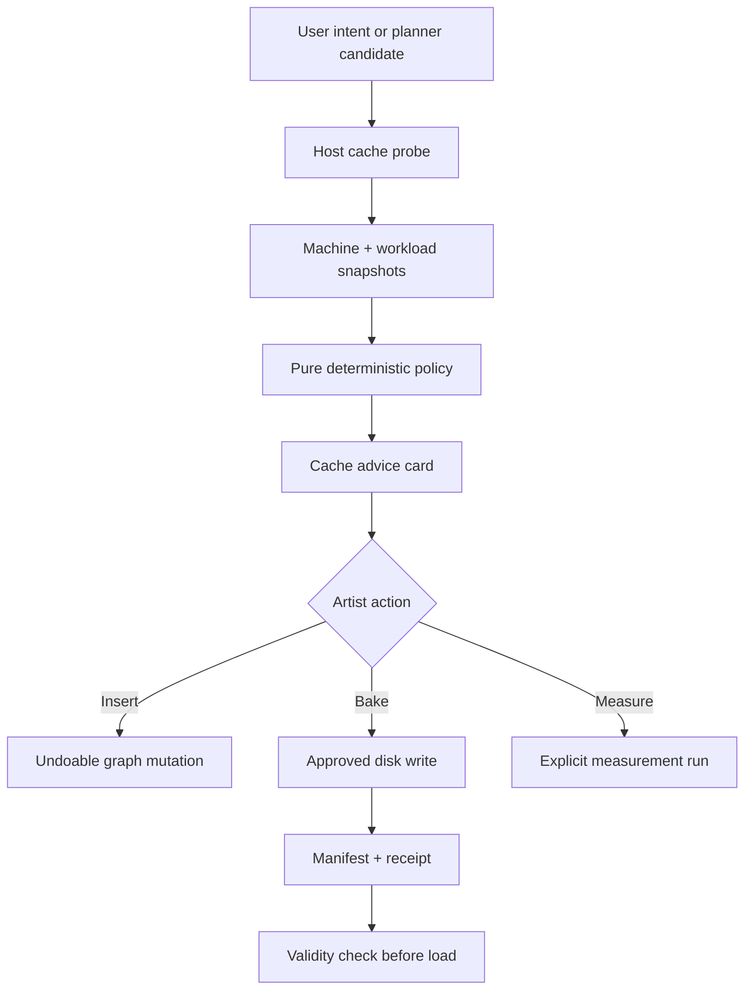

# SYNAPSE Resource-Aware Cache Intelligence Blueprint

**Purpose:** A self-contained, implementation-ready specification that can be given to another LLM or coding agent.

**Repository:** [JosephOIbrahim/Synapse](https://github.com/JosephOIbrahim/Synapse)  
**Audited baseline:** [`de8c5edd20bc322cd69f2b47aa4e85ab97162e00`](https://github.com/JosephOIbrahim/Synapse/tree/de8c5edd20bc322cd69f2b47aa4e85ab97162e00)  
**Observed release/build metadata:** SYNAPSE 5.44.1, Houdini 22.0.400, Python 3.13, USD 0.26.5, PySide6  
**Blueprint status:** Proposed architecture; not yet implemented  
**Primary audience:** An implementation LLM, SYNAPSE maintainers, technical directors, and Houdini pipeline engineers

> If the repository HEAD differs from the audited commit, re-audit the named integration points before editing. Do not assume line numbers, APIs, node parameters, or test expectations are unchanged.

---

## 0. Copy/paste operating prompt for another LLM

Give the other LLM this Markdown file together with the repository, then paste the following prompt:

```text
You are the implementation engineer for SYNAPSE's Resource-Aware Cache Intelligence system.

Repository: https://github.com/JosephOIbrahim/Synapse
Audited baseline commit: de8c5edd20bc322cd69f2b47aa4e85ab97162e00
Target Houdini contract: 22.0.400 unless the current repository explicitly pins another build.

Read SYNAPSE_RESOURCE_AWARE_CACHE_BLUEPRINT.md completely before acting.

TASK MODE: REVIEW_AND_IMPLEMENT_PHASE_0_1

Mission:
1. Re-audit the current repository HEAD against the blueprint's Current-System Baseline.
2. Preserve the existing architecture: pure intent/policy code must not import hou or Qt.
3. Implement Phase 0 and Phase 1 only: trustworthy observation plus a read-only cache advisor.
4. Do not make cache baking automatic.
5. Do not let an LLM choose the cache verdict. The verdict must come from deterministic local policy using typed evidence.
6. Never force a Houdini cook during passive assessment. If evidence is missing, return measure_first or unknown.
7. Treat cache insertion and cache baking as separate operations. Baking writes to disk and must require the repository's approval gate.
8. Add unit tests, negative controls, and a Houdini 22.0.400 live-contract assay. Do not claim the live assay passed unless it actually ran in Houdini.
9. Preserve unrelated user changes. Do not perform destructive Git operations.
10. Report every assumption, changed file, test command, result, and remaining uncertainty.

Before editing, return:
- the current HEAD and detected SYNAPSE/Houdini versions;
- a concise gap table against this blueprint;
- the exact files you intend to add or modify;
- any conflict between this blueprint and newer repository behavior.

If TASK MODE is REVIEW_ONLY, stop after that report.
If TASK MODE is REVIEW_AND_IMPLEMENT_PHASE_0_1, proceed after the report unless a material design conflict requires user input.
Do not implement later phases unless TASK MODE explicitly authorizes them.
```

Available task modes:

| Mode | Expected behavior |
|---|---|
| `REVIEW_ONLY` | Re-audit and produce a gap report; make no edits. |
| `REVIEW_AND_IMPLEMENT_PHASE_0_1` | Build observation and the read-only advisor; safest first increment. |
| `IMPLEMENT_THROUGH_PHASE_2` | Also add controlled cache insertion and baking after Phases 0–1 pass. |
| `IMPLEMENT_ALL_PHASES` | Continue through learning, calibration, and advanced context support. |

---

## 1. Product outcome

SYNAPSE should be able to say:

> “This operation is expensive and likely to be reused. On this machine, the estimated cache fits in memory and on the selected disk, and reading it should be faster than recomputing it. I recommend a cache boundary here. Baking will write approximately 180–240 GB across frames 1001–1120. Review the path and approve before writing.”

It should also be able to say:

> “A File Cache will not solve this failure. The estimated peak working set exceeds available RAM/VRAM before a frame can complete. Optimize or partition the simulation first.”

The feature is not “put a File Cache after particles.” It is a local decision system that distinguishes:

1. **Topology:** Should the graph contain a cache boundary?
2. **Execution:** Should this machine bake that cache now?
3. **Validity:** Is an existing cache safe to load?

Those are different questions and must remain different in code, UI, tests, and audit receipts.

---

## 2. First-principles derivation

### 2.1 What caching actually trades

A cache trades four resources:

- compute time;
- read/write time;
- persistent storage;
- operational complexity, including invalidation and cleanup.

Caching is useful when the avoided future computation and improved interactivity outweigh the write, read, storage, and management costs.

Machine specifications alone cannot answer this. “RTX 4090 + 128 GB RAM” does not reveal:

- how long this node cooks;
- whether this solver uses the GPU;
- whether frames are stateful or independent;
- output size per frame;
- cache-volume throughput;
- free space;
- how often the result will be replayed or reused;
- whether an existing cache is stale.

Therefore, the decision must combine **machine evidence**, **workload evidence**, **project policy**, and **cache lifecycle state**.

### 2.2 The two decision axes

| Axis | Question | Typical evidence |
|---|---|---|
| Cache value | Will caching save meaningful time or enable a required workflow? | Cook time, read/write time, statefulness, fan-out, expected replays, downstream iteration, handoff need. |
| Cache feasibility | Can this machine and target volume safely produce and retain it? | Available RAM/VRAM, working-set estimate, free disk, output-size interval, path class, write throughput, frame range. |

A high-value cache can still be infeasible. A feasible cache can still be pointless.

### 2.3 The break-even model

For a completed frame or sequence, define:

- \(T_c\): compute time without a cache;
- \(T_w\): time to write the cache;
- \(T_r\): time to read the cache;
- \(R\): expected number of future recomputations that the cache would replace.

The initial computation is required in either case, so it cancels. Caching becomes time-positive when:

\[
R(T_c - T_r) > T_w
\]

and, when \(T_c > T_r\):

\[
R_{break-even} = \frac{T_w}{T_c - T_r}
\]

Use measured sequence totals when available. For stateful simulations, add a restart/scrub penalty to the no-cache path because seeking a later frame may require replaying earlier state.

If \(T_c \leq T_r\), the cache has no speed benefit, but it may still be justified for handoff, reproducibility, checkpointing, or fault recovery. The decision explanation must name that non-performance reason.

### 2.4 The memory law

A File Cache stores output **after** a frame or step has been computed. It does not make an impossible frame fit into RAM or VRAM.

Therefore:

```text
if the predicted peak working set cannot safely fit:
    verdict = optimize_first
    do not claim that caching fixes the problem
```

Checkpoint/restart facilities can reduce recovery cost for some solvers, but they do not erase the memory needed to advance a step.

### 2.5 Unknown is a valid result

SYNAPSE must never manufacture certainty. Missing cook time, unknown GPU use, unclassified storage, a dirty node that would need a forced cook, or an unrecognized context should produce `measure_first`, `unsupported`, or `unknown`.

This is a core safety property, not a failure of the feature.

---

## 3. Current-system baseline at the audited commit

The implementation agent must verify these findings against current HEAD.

| Area | Current behavior | Consequence |
|---|---|---|
| Routing | The router cascades through response cache, recipes, workflow planner, and later tiers in [`router.py`](https://github.com/JosephOIbrahim/Synapse/blob/de8c5edd20bc322cd69f2b47aa4e85ab97162e00/python/synapse/routing/router.py). | Prompt phrasing can change whether a cache is inserted. |
| Generic File Cache recipe | [`pipeline_recipes.py`](https://github.com/JosephOIbrahim/Synapse/blob/de8c5edd20bc322cd69f2b47aa4e85ab97162e00/python/synapse/routing/recipes/pipeline_recipes.py) creates a File Cache SOP, sets a `$HIP/cache/...$F4.bgeo.sc` path, wires it, and sets flags. | This creates topology but is not a cache lifecycle or machine-aware decision. |
| FX recipes/planner | Cloth, RBD, Pyro, and wire paths may add caches; planner behavior is not uniform across contexts. See [`fx_recipes.py`](https://github.com/JosephOIbrahim/Synapse/blob/de8c5edd20bc322cd69f2b47aa4e85ab97162e00/python/synapse/routing/recipes/fx_recipes.py) and [`planner.py`](https://github.com/JosephOIbrahim/Synapse/blob/de8c5edd20bc322cd69f2b47aa4e85ab97162e00/python/synapse/routing/planner.py). | “Needs a cache” is presently encoded as recipe/template convention, not evidence. |
| Performance profiler | [`performance_profiler.py`](https://github.com/JosephOIbrahim/Synapse/blob/de8c5edd20bc322cd69f2b47aa4e85ab97162e00/python/synapse/panel/performance_profiler.py) calls `node.cookTime() * 1000`, catches failure as zero, and uses rough bytes-per-element estimates. Repository documentation reports it as orphaned from the live panel. | On Houdini 22, cook-time evidence may silently become zero; memory estimates are too weak for a bake decision. |
| Render preflight | [`render_preflight.py`](https://github.com/JosephOIbrahim/Synapse/blob/de8c5edd20bc322cd69f2b47aa4e85ab97162e00/python/synapse/panel/render_preflight.py) optionally uses `psutil`; without it, it assumes 64 GB. | An assumed capacity must not be reused for cache safety. Missing evidence must remain unknown. |
| Cook truth | [`spec-D-diagnostic-truth.md`](https://github.com/JosephOIbrahim/Synapse/blob/de8c5edd20bc322cd69f2b47aa4e85ab97162e00/harness/notes/spec-D-diagnostic-truth.md) is proposal/unratified; an artist-facing recook explanation handler is absent. | Cache advice should use the verified H22 contract but must not pretend the larger diagnostic surface is complete. |
| Approval gates | [`bridge_adapter.py`](https://github.com/JosephOIbrahim/Synapse/blob/de8c5edd20bc322cd69f2b47aa4e85ab97162e00/python/synapse/panel/bridge_adapter.py) distinguishes read-only, mutation, and disk-writing tools. Disk writes elevate to approval. | Cache assessment, insertion, and baking naturally map to separate gates. |
| Architecture | [`SYNAPSE_NEXT_SYSTEM_BLUEPRINT.md`](https://github.com/JosephOIbrahim/Synapse/blob/de8c5edd20bc322cd69f2b47aa4e85ab97162e00/docs/SYNAPSE_NEXT_SYSTEM_BLUEPRINT.md) defines Experience, Intent, Execution, Memory, Verification, and Operations planes. | Cache intelligence should extend this architecture, not create a parallel transport or second executor. |

Baseline verification observed outside Houdini:

- version conformance passed across the primary version surfaces;
- latency harness: 8 pass, 0 fail, 0 pending;
- performance ratchet: 8 pass, 3 explicitly pending/unpinned;
- progress: clear 3/8, latency 8/8, RSI 8/9;
- full `pytest` did not run in the review environment because the module was unavailable.

These observations are not a substitute for rerunning the repository’s current verification commands.

---

## 4. Non-negotiable system laws

1. **The LLM does not choose the verdict.** It may explain a deterministic verdict and ask for missing intent, but it may not convert raw specs into an action.
2. **No forced cook during passive assessment.** Read last-known evidence or return `measure_first`.
3. **Topology, bake, and validity are separate.** They have different permissions and failure modes.
4. **Disk writes require explicit approval.** Inserting a node is undoable; writing hundreds of gigabytes is not.
5. **No fake hardware values.** Missing RAM, VRAM, throughput, or path classification is `unknown`, not a guessed default.
6. **Observed workload behavior outranks marketing specifications.** Measured cook/read/write times are more useful than CPU/GPU model names.
7. **GPU specs count only when the workload is proven GPU-relevant.** Otherwise, GPU and VRAM are explanatory metadata, not decision inputs.
8. **Use ranges for estimates.** File compression, topology changes, sparse volumes, and solver state make single-point size estimates misleading.
9. **A stale cache is visible.** Never silently load a cache whose source signature cannot be validated.
10. **Every recommendation is explainable.** Return the decisive facts, blockers, confidence, and missing evidence.
11. **Policy is local and deterministic.** No network call is required to make the cache decision.
12. **Pure code remains pure.** Policy and data models must not import `hou`, Qt, or panel modules.
13. **No silent cleanup.** File Cache does not remove old files; deletion is a distinct, manifest-scoped, explicitly approved operation.
14. **Build claims need receipts.** Tests that do not run in Houdini cannot prove Houdini behavior.

---

## 5. Target architecture



Plane ownership:

| Plane | Cache responsibility |
|---|---|
| Experience | Advice card, evidence, estimates, path/range preview, override controls. |
| Intent | Pure `CacheCandidate` and policy request; no `hou` or Qt imports. |
| Execution | Houdini observation, node insertion, bake invocation, cancellation, progress, and receipts. |
| Memory | Local preferences and summarized decisions; never raw high-frequency telemetry by default. |
| Verification | Unit tests, negative controls, golden decisions, live H22 assays, manifest validation. |
| Operations | Build pins, feature flags, schema migration, telemetry retention, incident/rollback behavior. |

The LLM is outside the policy boundary:

```text
natural-language request
    -> candidate intent
    -> host evidence
    -> deterministic policy verdict
    -> LLM explanation of that verdict
```

Never use:

```text
machine specs + prompt -> LLM opinion -> bake
```

---

## 6. Decision model

### 6.1 Public verdicts

```python
class CacheVerdict(str, Enum):
    USE_VALID_CACHE = "use_valid_cache"
    CACHE_NOW = "cache_now"
    INSERT_BOUNDARY_ONLY = "insert_boundary_only"
    MEASURE_FIRST = "measure_first"
    OPTIMIZE_FIRST = "optimize_first"
    NOT_WORTH_IT = "not_worth_it"
    INSUFFICIENT_DISK = "insufficient_disk"
    UNSUPPORTED = "unsupported"
    UNKNOWN = "unknown"
```

Meaning:

| Verdict | Meaning | Allowed next action |
|---|---|---|
| `use_valid_cache` | A complete existing cache matches the current source and policy. | Load/reuse it; do not rebake without another reason. |
| `cache_now` | Valuable and feasible with sufficient confidence. | Preview, then approve bake. |
| `insert_boundary_only` | A boundary is architecturally useful, but baking now is not justified or not yet feasible. | Insert under undo; do not bake. |
| `measure_first` | One bounded measurement would materially resolve the decision. | Run an explicit sample/benchmark, then reassess. |
| `optimize_first` | The workload is unlikely to complete safely; caching does not solve the constraint. | Reduce resolution, partition, change solver/settings, or move compute. |
| `not_worth_it` | Expected savings do not exceed cost or policy threshold. | Continue without cache; allow documented override. |
| `insufficient_disk` | Cache is valuable but target volume lacks required headroom. | Choose another volume, reduce range/data, or clean via separate approved workflow. |
| `unsupported` | Context has no validated cache strategy. | Explain scope; do not insert a generic File Cache blindly. |
| `unknown` | Evidence is contradictory or cannot be obtained safely. | Show missing/contradictory evidence. |

### 6.2 Preserve the three underlying decisions

The public verdict is a summary. The returned object must also expose:

```python
class BoundaryAction(str, Enum):
    NONE = "none"
    INSERT = "insert"
    REUSE_EXISTING = "reuse_existing"

class BakeAction(str, Enum):
    DO_NOT_BAKE = "do_not_bake"
    BAKE_AFTER_APPROVAL = "bake_after_approval"
    MEASURE_THEN_REASSESS = "measure_then_reassess"
    OPTIMIZE_FIRST = "optimize_first"

class CacheValidity(str, Enum):
    NOT_PRESENT = "not_present"
    VALID = "valid"
    STALE = "stale"
    PARTIAL = "partial"
    CORRUPT = "corrupt"
    UNVERIFIABLE = "unverifiable"
```

This prevents a valid existing cache from being confused with permission to bake, or a useful boundary from being confused with immediate feasibility.

### 6.3 Confidence

Use `high`, `medium`, `low`, or `unknown`. Confidence is computed from evidence provenance and completeness, not prose sentiment.

Suggested confidence rules:

- **High:** required fields measured on the current node, frame range, machine, and target volume; cache context recognized; no contradictions.
- **Medium:** at least one critical quantity is a calibrated estimate, but the decision is robust across its low/high interval.
- **Low:** critical evidence is inferred from node class or generic defaults; only non-destructive advice is allowed.
- **Unknown:** provenance is absent, stale, contradictory, or unsafe to collect.

`cache_now` should normally require high or medium confidence. Low confidence should degrade to `measure_first` unless an explicit project rule creates a boundary for workflow reasons.

---

## 7. Typed data contracts

Implement these as versioned, serializable, pure-Python dataclasses or Pydantic-style models according to the repository’s existing conventions. Do not place `hou` objects inside them.

### 7.1 Evidence wrapper

Every decision-critical value should preserve provenance:

```json
{
  "value": 6.18,
  "unit": "seconds_per_frame",
  "source": "hou.OpNode.lastCookTime",
  "observed_at": "2026-08-09T12:00:00Z",
  "scope": "node:/obj/geo1/solver1 frame:1042",
  "confidence": "high"
}
```

Minimum provenance sources:

- `measured_current`;
- `measured_historical`;
- `calibrated_estimate`;
- `node_class_inference`;
- `project_override`;
- `user_override`;
- `unknown`.

### 7.2 `MachineProfile`

Required fields:

| Field | Type | Notes |
|---|---|---|
| `schema_version` | string | Begin with `1.0`. |
| `profile_id` | opaque local ID | Do not derive from serial number, username, or MAC address. |
| `captured_at` | timestamp | Required for staleness. |
| `os_family` | enum/unknown | Windows, Linux, macOS, unknown. |
| `cpu_logical_threads` | integer/unknown | Use a safe local probe. |
| `houdini_thread_cap` | integer/unknown | Reflect `HOUDINI_MAXTHREADS` when set. |
| `ram_total_bytes` | integer/unknown | Never assume 64 GB or any fallback value. |
| `ram_available_bytes` | integer/unknown | Snapshot, not a guarantee. |
| `process_rss_bytes` | integer/unknown | Optional but useful. |
| `gpu_devices` | list | Name is informational; include VRAM only if measured. |
| `cache_volume` | object | Selected path, free/total bytes, path class, throughput evidence. |
| `houdini_version` | string | Exact version/build. |
| `synapse_version` | string | Exact version. |

`cache_volume.path_class` is one of:

- `local_ssd`;
- `local_hdd`;
- `network`;
- `cloud_synced`;
- `removable`;
- `unknown`.

Do not infer path class from drive letters alone. Support project overrides and report provenance.

Throughput fields should be intervals when estimated:

```json
{
  "read_mib_s": {"low": 420, "high": 610, "source": "observed_cache_reads"},
  "write_mib_s": {"low": 310, "high": 480, "source": "observed_cache_writes"}
}
```

Hardware probing order:

1. standard-library/read-only OS facilities;
2. declared optional provider such as `psutil`, with explicit unavailable state;
3. vendor GPU tool only when present and relevant;
4. project/user override;
5. `unknown`.

Do not run an automatic disk benchmark during passive assessment. A benchmark writes data and must be an explicit calibration action. Prefer learning from real approved cache reads/writes.

### 7.3 `WorkloadSnapshot`

Required fields:

| Field | Meaning |
|---|---|
| `schema_version` | Contract version. |
| `node_path` | Houdini path, local to the session. |
| `node_type` | Fully qualified node type and version where available. |
| `context` | SOP, DOP, LOP/Solaris, COP/Copernicus, TOP, unknown. |
| `cache_strategy_id` | Resolved strategy ID, not merely node type. |
| `strategy_support` | Supported/unsupported/unknown plus resolver evidence. |
| `frame_range` | Start, end, increment, frame count, FPS. |
| `time_dependent` | Value plus provenance. |
| `needs_to_cook` | Current dirty state plus provenance. |
| `last_cook_seconds` | Last completed cook; include frame and age. |
| `state_model` | `static`, `independent_frames`, `sequential_stateful`, `unknown`. |
| `substeps` | Measured/configured/unknown. |
| `geometry_memory_bytes` | Exact intrinsic when safely observable. |
| `point_count`, `primitive_count`, `voxel_summary` | Supporting evidence, not memory truth. |
| `peak_working_set_bytes` | Measured or interval estimate; often unknown initially. |
| `gpu_relevance` | `required`, `optional`, `not_used`, `unknown`, with evidence. |
| `estimated_output_bytes_per_frame` | Low/high interval and method. |
| `fanout_count` | Number of downstream consumers or a bounded estimate. |
| `expected_future_reads` | User/project/history estimate with provenance. |
| `existing_cache` | Path, manifest state, files present, validity. |
| `upstream_signature` | Stable digest or `unverifiable`. |
| `external_dependencies` | Files/assets that affect validity. |
| `warnings` | Observation failures and contradictions. |

Do not treat point/primitive counts multiplied by fixed constants as exact memory. Houdini geometry, attributes, packed data, VDBs, and solver state vary too much.

### 7.4 `CachePolicy`

Project-configurable fields:

```json
{
  "schema_version": "1.0",
  "minimum_seconds_saved": 30,
  "minimum_expected_future_reads": 1,
  "ram_safety_fraction": 0.80,
  "vram_safety_fraction": 0.85,
  "cache_size_safety_multiplier": 1.25,
  "minimum_free_disk_after_bytes": 21474836480,
  "minimum_free_disk_after_fraction": 0.10,
  "allow_low_confidence_bake_recommendation": false,
  "allow_unmanifested_cache_load": false,
  "preferred_cache_root": "$HIP/cache",
  "network_cache_policy": "measure_or_override",
  "retention_policy": "manual_manifest_scoped"
}
```

These values are conservative starting policy, not universal physical laws. Make them named, documented, validated, and overridable at project level. Never scatter magic thresholds through handlers or UI code.

### 7.5 `CacheDecision`

```json
{
  "schema_version": "1.0",
  "decision_id": "opaque-id",
  "verdict": "cache_now",
  "boundary_action": "insert",
  "bake_action": "bake_after_approval",
  "cache_validity": "not_present",
  "strategy_id": "sop_filecache_geometry_v1",
  "confidence": "medium",
  "headline": "Cache recommended after the solver",
  "reasons": [
    "Observed cook time is 6.18 s/frame",
    "Two expected downstream replays exceed break-even",
    "Estimated sequence size fits the selected volume with policy headroom"
  ],
  "blockers": [],
  "missing_evidence": ["No measured read throughput; calibrated range used"],
  "estimates": {
    "compute_seconds": {"low": 1350, "high": 1620},
    "write_seconds": {"low": 420, "high": 690},
    "read_seconds": {"low": 80, "high": 140},
    "cache_bytes": {"low": 193273528320, "high": 257698037760},
    "break_even_future_reads": {"low": 0.31, "high": 0.55}
  },
  "proposed_path": "$HIP/cache/particles_v003/particles_v003.$F4.bgeo.sc",
  "frame_range": {"start": 1001, "end": 1240, "step": 1},
  "policy_version": "1.0",
  "evidence_digest": "sha256:..."
}
```

The `reasons` list is generated from rule IDs and structured facts, not free-form model reasoning. The LLM may restate it in artist-friendly language without altering the verdict.

### 7.6 `CacheManifest`

Write a manifest adjacent to each managed cache:

```json
{
  "schema_version": "1.0",
  "cache_id": "opaque-id",
  "status": "complete",
  "strategy_id": "sop_filecache_geometry_v1",
  "created_at": "2026-08-09T12:45:00Z",
  "completed_at": "2026-08-09T13:20:00Z",
  "houdini_version": "22.0.400",
  "synapse_version": "5.44.1",
  "scene_identity": "sha256:...",
  "source_node_path": "/obj/geo1/solver1",
  "upstream_signature": "sha256:...",
  "external_dependency_digest": "sha256:...",
  "frame_range": {"start": 1001, "end": 1240, "step": 1},
  "format": "bgeo.sc",
  "files": {
    "expected": 240,
    "written": 240,
    "total_bytes": 221190815744,
    "listing_digest": "sha256:..."
  },
  "interrupted": false
}
```

Write lifecycle states atomically:

```text
planned -> writing -> complete
                  -> partial
                  -> failed
                  -> cancelled
```

Only `complete` plus matching signatures is automatically loadable. A partial cache may be resumable if the strategy supports it, but it is not equivalent to valid.

### 7.7 `CacheReceipt`

Every mutating or disk-writing action should record:

- decision ID and evidence digest;
- user-approved path and range;
- graph mutation result;
- files intended and files actually written;
- bytes, duration, observed throughput, cancellation/failure;
- manifest ID;
- override reason when policy was bypassed.

This extends the repository’s audited execution model; it must not create a second receipt system.

---

## 8. Safe Houdini observation protocol

### 8.1 Verified Houdini 22 API surface

At the target build, validate these contracts in a live Houdini assay:

- `hou.OpNode.lastCookTime()` returns the last cook time in milliseconds;
- `hou.OpNode.needsToCook()` reports dirty/cook-needed state;
- `hou.OpNode.isTimeDependent(for_last_cook=True)` reports time dependence using the last cook;
- `hou.OpNode.cookCount()` exposes cook count;
- `hou.Geometry.intrinsicValue("memoryusage")` exposes geometry memory use.

Authoritative references:

- [SideFX `hou.OpNode`](https://www.sidefx.com/docs/houdini/hom/hou/OpNode.html)
- [SideFX `hou.Geometry`](https://www.sidefx.com/docs/houdini/hom/hou/Geometry.html)

Do not preserve the current `node.cookTime() * 1000` behavior. At the audited commit it can fall into an exception path and silently emit zero. Normalize `lastCookTime()` from milliseconds to seconds once, in the host adapter, and test the unit conversion.

### 8.2 Passive assessment algorithm

```python
def observe_node_passively(node, last_observation_store):
    dirty = safe_call(node.needsToCook, default=None)
    time_dependent = safe_call(
        lambda: node.isTimeDependent(for_last_cook=True),
        default=None,
    )
    last_cook_ms = safe_call(node.lastCookTime, default=None)
    cook_count = safe_call(node.cookCount, default=None)

    if dirty is True:
        # Critical: node.geometry() can cause a cook.
        geometry = None
        geometry_evidence = last_observation_store.lookup(node.path())
        observation_status = "dirty_not_forced"
    else:
        geometry = safe_call(node.geometry, default=None)
        geometry_evidence = inspect_geometry_without_explicit_cook(geometry)
        observation_status = "clean_snapshot"

    return typed_snapshot(...)
```

Required negative control:

> Given a fake node whose `needsToCook()` returns true and whose `geometry()` raises if called, `synapse_assess_cache` must complete without calling `geometry()` and return `measure_first` or a decision based on valid historical evidence.

### 8.3 Explicit measurement mode

When the artist chooses “Measure,” SYNAPSE may perform a bounded action under a clear preview:

- cook one representative frame or a small representative range;
- record cook time and geometry memory;
- optionally write/read a disposable or named sample only with disk-write approval;
- state whether a stateful sim makes isolated-frame measurement invalid;
- reassess with the new evidence;
- retain the measurement locally with build, node signature, frame, and timestamp.

Never pretend one frame represents a topology-changing sequence without an uncertainty range.

---

## 9. Cache strategy resolver

Do not select a cache solely from keywords. Resolve the Houdini context and data class first.

| Context | Strategy | Format/settings | Notes |
|---|---|---|---|
| SOP particle or mesh geometry | File Cache SOP | `.bgeo.sc`; Time Dependent for animated output | General safe default for mixed Houdini geometry. |
| SOP VDB-only output | File Cache SOP | `.vdb` when verified VDB-only | Mixed/unknown data should remain `.bgeo.sc`. |
| SOP-level Vellum, RBD, Pyro, FLIP, MPM result | File Cache after solver/result output | Time Dependent on; Simulation on for sequential state | Boundary after the expensive solver, not inside an arbitrary upstream setup branch. |
| Independent procedural frames | File Cache SOP | Time Dependent on; Simulation off | Independent frames can be scheduled in parallel. |
| Classic DOP simulation | Separate result-cache and checkpoint/restart strategies | Solver-specific | Do not reduce both to one generic SOP cache. |
| Solaris/LOP | LOP File Cache / USD strategy | USD-aware path and layer policy | Validate stage composition and external dependencies. |
| Copernicus/COP | Deferred v1 or dedicated strategy | Context-specific | Return `unsupported` until a tested resolver exists. |
| Unknown/custom HDA | Registry match, project override, or unknown | Never guess destructive parameters | Allow custom strategy providers with versioned contracts. |

SideFX File Cache behavior to preserve:

- place it after a slow network section;
- save first, then load from disk;
- use `.vdb` only for VDB-only data; `.bgeo.sc` is safe for mixed/unknown Houdini geometry;
- enable Time Dependent for animated output;
- enable Simulation for sequential simulation frames;
- leave Simulation off for independent frames so they can be parallelized;
- account for higher memory use during background save because output may remain resident;
- never assume the node deletes old files.

Reference: [SideFX File Cache SOP](https://www.sidefx.com/docs/houdini/nodes/sop/filecache.html).

Implement strategy knowledge as a versioned registry. A strategy must declare:

```python
class CacheStrategy(Protocol):
    strategy_id: str
    supported_contexts: tuple[str, ...]

    def matches(self, descriptor: NodeDescriptor) -> MatchResult: ...
    def estimate(self, snapshot: WorkloadSnapshot) -> Estimate: ...
    def propose_boundary(self, candidate: CacheCandidate) -> BoundaryPlan: ...
    def propose_bake(self, candidate: CacheCandidate) -> BakePlan: ...
    def validate_manifest(self, manifest: CacheManifest) -> ValidationResult: ...
```

The policy engine consumes a strategy result; it does not contain Houdini parameter names.

---

## 10. Deterministic policy algorithm

### 10.1 Evaluation order

Order matters. Safety and validity must short-circuit performance enthusiasm.

```python
def decide_cache(machine, workload, strategy, policy):
    if not strategy.supported:
        return unsupported(...)

    validity = validate_existing_cache(workload.existing_cache, workload)
    if validity == VALID:
        return reuse_valid_cache(...)
    if validity in {STALE, PARTIAL, CORRUPT, UNVERIFIABLE}:
        record_visible_validity_problem(validity)

    boundary = decide_boundary_value(workload, policy)

    if passive_evidence_is_unsafe_or_missing(workload):
        return measure_first_or_unknown(boundary, ...)

    if predicted_peak_ram_exceeds_safe_available(machine, workload, policy):
        return optimize_first(boundary, reason="per-frame RAM")

    if workload.gpu_relevance == REQUIRED:
        if vram_is_unknown(machine):
            return measure_first_or_unknown(boundary, reason="VRAM unknown")
        if predicted_peak_vram_exceeds_safe_available(machine, workload, policy):
            return optimize_first(boundary, reason="per-frame VRAM")

    size = estimate_sequence_size(workload)
    if not size.robust_enough:
        return measure_first(boundary, reason="output size unknown")

    required_headroom = disk_headroom(size.high, machine.cache_volume, policy)
    if machine.cache_volume.free_bytes < required_headroom:
        return insufficient_disk(boundary, ...)

    value = evaluate_break_even(machine, workload, size, policy)
    if value.is_unknown:
        return measure_first(boundary, ...)
    if not value.is_worthwhile and not workflow_requires_persistence(workload):
        return not_worth_it(boundary, ...)

    if boundary.should_exist and value.feasible:
        return cache_now(...)
    if boundary.should_exist:
        return insert_boundary_only(...)
    return not_worth_it(...)
```

### 10.2 Boundary value signals

Positive signals:

- stateful solver output with downstream scrubbing/iteration;
- expensive cleanly separable upstream section;
- multiple downstream consumers;
- repeated viewport/playback reads;
- cross-department handoff or reproducibility requirement;
- checkpoint/recovery requirement;
- nondeterministic or externally expensive source that must be frozen.

Negative signals:

- static or cheap computation;
- result changes on almost every edit and is rarely replayed;
- cache read is not faster than recompute;
- output is extremely large relative to its compute cost;
- no stable boundary or no validated strategy.

### 10.3 Feasibility calculations

Use high estimates for safety checks:

```text
estimated_sequence_bytes_high
    = estimated_output_bytes_per_frame_high * expected_frame_count

required_free_before_bake
    = estimated_sequence_bytes_high * cache_size_safety_multiplier
      + max(minimum_free_disk_after_bytes,
            volume_total_bytes * minimum_free_disk_after_fraction)
```

For variable topology, sample or historical sizes should produce low/high or percentile bounds. Do not assume the first frame is the largest.

RAM check:

```text
safe_available_ram
    = min(ram_available_now,
          ram_total * ram_safety_fraction)
```

If peak working set is unknown, do not claim it fits. A background-save mode may need an additional residency allowance.

### 10.4 Policy precedence

From strongest to weakest:

1. safety invariants;
2. explicit project policy;
3. validated cache strategy requirements;
4. current measured evidence;
5. calibrated historical evidence from the same machine/volume/context;
6. generic estimates;
7. user preference.

A user may override a recommendation, but not make SYNAPSE report false evidence. The receipt should say “user override” and preserve the original verdict.

---

## 11. Cache size and performance estimation

### 11.1 Estimation ladder

Prefer the strongest available method:

1. existing matching cache manifest;
2. observed files from the same signature/version family;
3. approved sample-frame write;
4. calibrated relationship between geometry memory and serialized size for the same data class;
5. conservative generic interval;
6. unknown.

`hou.Geometry.intrinsicValue("memoryusage")` measures in-memory geometry, not `.bgeo.sc` size. Compression and data type can move disk size substantially. Treat it as an input to an estimator, never a direct equality.

### 11.2 Stateful ranges

For sequential solvers:

- do not sample an arbitrary later frame without the required preceding state;
- use a short sequential window after warm-up when explicitly authorized;
- account for growth over time;
- model checkpoint data separately from result-cache data;
- do not propose frame-level parallelism when the strategy requires sequential cooking.

### 11.3 Independent frames

For independent procedural frames:

- estimate per-frame compute and output distributions;
- allow parallel scheduling when the File Cache Simulation mode is off;
- account for concurrent RAM and write bandwidth when choosing worker count;
- do not assume all logical CPU threads should be saturated if disk becomes the bottleneck.

### 11.4 Learning without opaque behavior

After an approved bake, update local calibration buckets keyed by:

- machine profile ID;
- cache volume ID/class;
- Houdini build;
- strategy ID;
- coarse data class;
- approximate scale bucket.

Store aggregates such as count, median, p10/p90, and last-observed timestamp. The next decision must still explain which aggregate it used. Do not train an opaque model as the first implementation.

---

## 12. Cache validity and invalidation

### 12.1 Why file existence is insufficient

A file can exist while representing:

- an older parameter value;
- a different upstream connection;
- an older HDA definition;
- a changed external texture, geometry, volume, or USD layer;
- a different frame range or FPS;
- an interrupted bake;
- a different Houdini/build behavior.

Therefore, “files exist” must never equal “cache valid.”

### 12.2 Upstream signature

Create a canonical, versioned serialization containing, as available:

- ordered upstream topology;
- node type names and versions;
- relevant parameter values and expressions;
- input ordering and connection identities;
- HDA/operator definition identity;
- frame range, step, FPS, and context options that affect output;
- external dependency identities;
- strategy version;
- Houdini build and compatibility policy.

Hash the canonical bytes with SHA-256. The signature algorithm version belongs in the manifest.

Do not rely only on Houdini session data IDs for persistent validity. They are useful within a session but cannot prove a cache after restart or handoff.

### 12.3 External dependency policy

Offer explicit levels:

| Level | Evidence | Tradeoff |
|---|---|---|
| `path_only` | Canonical path | Fast, weak. |
| `stat` | Path, size, modification time | Practical default, can miss edge cases. |
| `content_hash` | File content digest | Strong, potentially expensive. |
| `provider_digest` | Asset/version system identity | Preferred when a trusted provider exists. |

If a dependency cannot be inspected, validity is `unverifiable`, not valid.

### 12.4 Load rules

- `valid`: offer/load according to user preference and existing execution rules;
- `stale`: show the changed evidence and offer rebake;
- `partial`: show available/missing frames; do not present complete playback;
- `corrupt`: block automatic load and preserve evidence;
- `unverifiable`: require explicit override or rebake according to project policy;
- unmanifested legacy cache: treat as `unverifiable` unless an import/adoption workflow creates a manifest.

---

## 13. SYNAPSE integration plan

### 13.1 Proposed repository layout

```text
python/synapse/cache_policy/
    __init__.py
    models.py
    decision.py
    estimator.py
    strategies.py
    signatures.py
    policy_loader.py

python/synapse/server/
    cache_probe.py
    handlers_cache.py

python/synapse/panel/
    cache_advice_card.py

host/
    introspect_cache_capability.py

tests/
    test_cache_policy.py
    test_cache_estimator.py
    test_cache_signatures.py
    test_cache_handlers.py
    test_cache_bridge_gates.py
    test_cache_no_forced_cook.py
    test_cache_h22_contract.py
```

Adapt names to current repository conventions after audit. Do not duplicate an equivalent model, handler, or test facility already added after the baseline commit.

### 13.2 Import boundaries

Allowed:

```text
server/cache_probe.py -> imports hou -> returns WorkloadSnapshot
cache_policy/*        -> imports stdlib and approved pure dependencies only
panel/*               -> renders CacheDecision; requests tools through bridge
handlers_cache.py     -> calls existing audited executor and receipt facilities
```

Forbidden:

```text
cache_policy/* -> hou
cache_policy/* -> Qt
planner.py     -> hou
LLM prompt     -> direct file-cache parameter mutation
panel widget   -> direct unapproved disk bake
```

### 13.3 Tool contracts

#### `synapse_assess_cache`

- **Class:** read-only;
- **Input:** node path or selected node, optional target path/range, optional expected replays;
- **Behavior:** passive observation only; no forced cook and no disk benchmark;
- **Output:** `MachineProfile` summary, `WorkloadSnapshot` summary, and `CacheDecision`;
- **Gate:** automatic/read-only under existing bridge policy.

#### `synapse_insert_cache`

- **Class:** graph mutation;
- **Input:** decision ID, resolved strategy, boundary plan, node name/path preview;
- **Behavior:** insert and wire the correct cache node in a Houdini undo block;
- **Output:** mutation receipt, created node path, parameter summary;
- **Gate:** Review/undoable according to the existing executor.

#### `synapse_bake_cache`

- **Class:** disk-writing and potentially long-running;
- **Input:** decision ID, approved absolute/resolved path, frame range, overwrite policy, strategy parameters;
- **Behavior:** preflight again immediately before bake, mark manifest writing, stream progress, support cancellation, finalize manifest;
- **Output:** disk-write receipt and manifest;
- **Gate:** Approve. Add it to the existing disk-writing tool registry.

#### Future `synapse_validate_cache`

- **Class:** read-only by default;
- **Input:** cache node/path/manifest;
- **Behavior:** compare signatures, frame listing, status, and optional integrity data;
- **Output:** `CacheValidity` with changed evidence.

#### Future `synapse_clean_cache`

- **Class:** destructive disk operation;
- **Input:** exact manifest-scoped files only;
- **Behavior:** preview exact paths/bytes; never use a broad unresolved directory or glob;
- **Gate:** explicit destructive approval; prefer recoverable trash where practical.

### 13.4 Planner change

The pure planner should emit a candidate, not an unconditional bake:

```json
{
  "kind": "cache_candidate",
  "after_step_id": "build_solver",
  "reason": "expensive_stateful_boundary",
  "context_hint": "sop_simulation_result",
  "user_intent": {
    "expected_future_reads": null,
    "handoff_required": false
  }
}
```

Runtime flow:

1. deterministic recipe/planner identifies a candidate boundary;
2. host adapter resolves actual Houdini context and safely observes it;
3. pure policy produces a decision;
4. panel previews the decision;
5. artist chooses measure, insert, bake, dismiss, or override;
6. existing audited executor performs the authorized action;
7. receipts and manifest close the loop.

Do not remove useful recipe caches all at once. Migrate them behind candidates and keep regression coverage for current workflows.

---

## 14. Artist experience

### 14.1 Advice card

The card should answer six questions without requiring a technical drill-down:

1. What does SYNAPSE recommend?
2. Where is the boundary?
3. Why?
4. What will it cost in time and disk?
5. What is uncertain or blocked?
6. What action requires approval?

Example:

```text
CACHE RECOMMENDED — MEDIUM CONFIDENCE

After: /obj/geo1/vellumsolver1
Range: 1001–1240
Estimated disk: 180–240 GB
Estimated bake: 22–31 min
Expected savings over 2 replays: 34–43 min
Target free space after bake: 1.2–1.3 TB

Why
• Last cook: 6.18 s/frame
• Sequential solver; scrubbing requires replay without a cache
• Two downstream consumers

Uncertainty
• Read speed is calibrated from prior caches, not this exact data

[Measure] [Insert Boundary] [Review & Bake] [Dismiss]
```

Blocked example:

```text
OPTIMIZE FIRST — HIGH CONFIDENCE

Estimated peak GPU memory: 27–31 GB
Available VRAM under safety policy: 20.4 GB

A File Cache cannot make a frame fit. Reduce voxel/particle load,
partition the solve, or move it to a larger worker before baking.

[Show evidence] [Create optimization plan] [Dismiss]
```

### 14.2 ADHD-friendly interaction rules

- lead with one verdict;
- show at most three decisive reasons before “More details”;
- display ranges, not false precision;
- separate a red blocker from yellow uncertainty;
- make the disk-writing button say what it will do;
- retain the path and range in the approval view;
- never bury `stale`, `partial`, or `unverifiable` status;
- let the artist dismiss advice per node/session/project without repeated nagging.

### 14.3 Overrides

Allowed override examples:

- cache despite poor time break-even because a department handoff requires it;
- choose a different volume;
- accept an unverifiable legacy cache;
- insert a boundary without baking.

An override must capture a short reason and preserve both the original policy verdict and the selected action.

---

## 15. Local storage, privacy, and telemetry

Recommended storage:

| Data | Location | Rationale |
|---|---|---|
| Machine profile and calibration | `$HOUDINI_USER_PREF_DIR/synapse/` | Machine-local and user-local. |
| Project cache policy | `$HIP/.synapse/cache_policy.json` | Versionable with project if desired. |
| Cache manifest | Adjacent to managed cache or project manifest directory | Travels with the cache. |
| High-frequency timing samples | Local bounded aggregate store | Avoid semantic-memory noise and privacy leakage. |
| Artist preference/override | Existing SYNAPSE memory/receipt layer | Useful durable intent, low volume. |

Privacy rules:

- do not upload raw usernames, hostnames, serial numbers, MAC addresses, scene paths, or full machine profiles;
- if cloud reasoning receives capabilities, send coarse anonymous buckets and the already-computed verdict, not raw identifying data;
- keep the deterministic policy usable offline;
- make telemetry opt-in/consistent with existing SYNAPSE policy;
- define retention and migration for every local schema.

---

## 16. Implementation phases

### Phase 0 — Trustworthy foundation

Goal: make evidence correct before making recommendations.

Tasks:

1. Re-audit current HEAD and version pins.
2. Introduce pure typed models and serialization tests.
3. Implement a host probe using `lastCookTime()`, not `cookTime()`.
4. Use `memoryusage` when geometry can be read without forcing a cook.
5. Implement machine/disk-free-space detection with explicit unknowns.
6. Add the no-forced-cook negative control.
7. Add a Houdini 22.0.400 contract assay for API ownership, units, and behavior.
8. Either reconnect the orphaned performance profiler to a supported surface or keep cache probing independent and mark the old profiler deprecated; do not silently maintain two truths.

Exit gate:

- pure tests pass;
- fake-node negative controls pass;
- missing `psutil` or GPU provider yields unknown, never a fake number;
- live H22 assay has a separate, truthful result status;
- no user-facing cache recommendation yet depends on unverified evidence.

### Phase 1 — Read-only advisor

Goal: ship value without mutating a scene or disk.

Tasks:

1. Implement the strategy registry for SOP geometry/VDB and SOP-level simulations.
2. Implement the deterministic policy and structured reasons.
3. Implement `synapse_assess_cache` as passive/read-only.
4. Add the cache advice card.
5. Add policy loading from defaults plus project/user overrides.
6. Add golden decision scenarios and UI snapshots/contracts.
7. Feature-flag the advisor.

Exit gate:

- assessment cannot increase `cookCount()` on a dirty node;
- every verdict includes provenance, confidence, and missing evidence;
- changing prompt wording without changing graph/evidence does not change the policy verdict;
- `optimize_first` is returned for per-frame memory failure;
- no disk file or node is created by assessment.

### Phase 2 — Controlled insertion and bake

Goal: turn trusted advice into authorized action.

Tasks:

1. Implement `synapse_insert_cache` through the audited undoable executor.
2. Implement preflighted `synapse_bake_cache` through the disk-write approval gate.
3. Write atomic manifests and receipts.
4. Support progress, cancellation, partial status, and failures.
5. Recheck free space, signatures, path, and range immediately before writing.
6. Add a validity check before switching to load-from-disk.
7. Keep cleanup out of this phase unless separately designed and approved.

Exit gate:

- insertion is undoable;
- bake cannot start without approval;
- a cancelled bake is never marked complete;
- stale/partial/corrupt caches cannot be silently loaded;
- exact written files and bytes appear in the receipt;
- no path escapes approved cache roots under project policy.

### Phase 3 — Passive learning and calibration

Goal: improve estimates from real local outcomes while remaining explainable.

Tasks:

1. Record approved-bake sizes, timings, and throughput.
2. Aggregate by machine/volume/strategy/data class.
3. Add staleness and sample-count rules.
4. Show which calibration bucket informed a decision.
5. Add a user-triggered disk calibration only if real telemetry is insufficient.

Exit gate:

- learned data never overrides safety invariants;
- every learned estimate exposes sample count, range, and age;
- deleting calibration resets behavior to conservative deterministic defaults;
- no opaque model is required.

### Phase 4 — Advanced contexts

Possible additions after the foundation is proven:

- classic DOP checkpoints and result caches;
- Solaris/USD dependency-aware caching;
- farm/worker capability profiles;
- remote or network cache policy;
- resumable partial sequences;
- safe manifest-scoped cleanup;
- Copernicus-specific strategies;
- project-wide cache health dashboard.

Each context needs its own strategy contract and live Houdini tests.

---

## 17. Verification matrix

### 17.1 Pure policy scenarios

| Scenario | Expected verdict | Critical assertion |
|---|---|---|
| Static 0.05 s SOP, one read, 2 GB output | `not_worth_it` | No “fast machine” heuristic overrides economics. |
| 6 s/frame particle sequence, 240 frames, two future reads, ample SSD | `cache_now` | Break-even and disk headroom are visible. |
| Stateful solver, unknown output size, no prior samples | `measure_first` or `insert_boundary_only` | No fabricated size. |
| Per-frame working set above safe RAM | `optimize_first` | File Cache is not described as a memory fix. |
| GPU-required workload above safe VRAM | `optimize_first` | GPU evidence is used only because relevance is proven. |
| CPU-only workload on RTX 4090 | Same as without RTX metadata | GPU name cannot sway verdict. |
| Valuable 960 GB cache, 600 GB free | `insufficient_disk` | Uses high estimate plus reserve. |
| Existing matching complete manifest | `use_valid_cache` | No unnecessary rebake. |
| Existing files with changed upstream signature | stale | File existence cannot equal validity. |
| Existing unmanifested cache | unverifiable | Requires explicit project rule/override. |
| Unknown context | `unsupported` | No generic node mutation. |
| Dirty node with no prior observation | `measure_first` | Geometry accessor is never invoked. |

### 17.2 Boundary tests

- `cache_policy` imports without Houdini or Qt installed;
- planner output is deterministic for identical inputs;
- host probe converts milliseconds to seconds exactly once;
- exceptions produce typed warnings, not zero-valued fake evidence;
- policy JSON rejects invalid fractions, negative sizes, and unknown enum values;
- decisions serialize deterministically for evidence hashing;
- an LLM-generated explanation cannot alter the structured verdict passed to execution.

### 17.3 Gate tests

- assess tool is registered read-only;
- insert tool uses the mutation/Review path and Houdini undo;
- bake tool is registered in the disk-writing/Approve set;
- bake rejects expired or mismatched decision IDs;
- bake repeats free-space and signature checks immediately before execution;
- overwrite requires explicit policy and preview;
- cleanup, when added, cannot receive unresolved globs or broad roots.

### 17.4 Live Houdini 22.0.400 assays

Run in real Houdini/hython, not a Python mock:

1. build a cheap static SOP and a time-dependent SOP;
2. verify API availability and `hou.OpNode` ownership;
3. verify `lastCookTime()` units with a known cook;
4. verify `needsToCook()` state transitions after parameter changes;
5. verify `isTimeDependent(for_last_cook=True)` behavior;
6. verify passive assessment does not change `cookCount()`;
7. verify `memoryusage` is positive and handled when unavailable;
8. verify File Cache parameter names and modes on the pinned build;
9. verify sequential Simulation behavior versus independent frames;
10. verify manifest completion/partial state around cancellation.

Record build number, platform, command, exit status, and artifact path. If Houdini is unavailable, report the assay as **not run**, never passed.

### 17.5 Existing regression suites

Rerun the repository’s current:

- version-conformance checks;
- latency harness;
- performance ratchet;
- progress/contract checks;
- focused unit tests;
- full test suite when dependencies are available.

Any existing pending/unpinned ratchet must remain explicitly pending or be pinned with real evidence; do not convert it into a synthetic pass.

---

## 18. Worked reference case

Reference workstation:

- AMD Threadripper Pro 7965WX, 24 cores / 48 threads;
- NVIDIA RTX 4090, 24 GB VRAM;
- 128 GB RAM.

What SYNAPSE may infer safely:

- the machine has substantial general capacity if detected values confirm it;
- CPU thread count may help independent tasks;
- 24 GB VRAM matters only for a workload known to use GPU/OpenCL memory;
- a stateful simulation is still sequential unless its validated strategy says otherwise;
- cache value still depends on cook time, output size, reuse, disk throughput, and free space.

Example A:

```text
Observed cook = 6 s/frame
Observed or estimated read = 0.5 s/frame
Range = 240 frames
Expected future reads = 2

No cache future recompute = 6 * 240 * 2 = 2,880 s = 48 min
Cache future reads        = 0.5 * 240 * 2 = 240 s = 4 min
```

If write time and storage headroom fit, caching is strongly valuable.

Example B:

```text
Estimated output = 4 GB/frame * 240 = 960 GB
Free target space = 600 GB
```

Even on the powerful workstation, the correct result is `insufficient_disk` or a smaller/alternate plan—not `cache_now`.

Example C:

```text
Estimated peak working set = 142 GB RAM
Safe available memory = 102 GB under current policy/load
```

The correct result is `optimize_first`. The operation must complete before a File Cache can store its result.

---

## 19. Failure modes to avoid

| Anti-pattern | Why it fails | Required alternative |
|---|---|---|
| “If RAM < 64 GB, cache particles.” | RAM does not determine value, and caching does not repair per-frame OOM. | Evaluate value and feasibility separately. |
| “RTX card means GPU cache.” | Many Houdini operations are CPU-only. | Require evidence of GPU relevance. |
| Silent exception -> `0 ms` cook | Converts broken observation into a confident false negative. | Return unknown plus warning. |
| Call `geometry()` to inspect a dirty node | Can trigger the expensive cook being assessed. | Use last observation or `measure_first`. |
| Let prompt keywords insert/bake caches | Wording changes topology and cost. | Planner candidate + deterministic host policy. |
| Treat `.bgeo.sc` file existence as valid | Source may have changed or sequence may be partial. | Manifest and upstream signature. |
| Benchmark disk automatically | Passive advice unexpectedly writes data. | Learn from approved writes or explicit calibration. |
| Bake immediately after insertion | Graph mutation and disk write have different risk. | Separate tools and gates. |
| Assume `psutil` exists; otherwise invent 64 GB | Hidden dependency changes safety behavior. | Declare provider or return unknown. |
| Delete old cache folders automatically | File Cache retains old files; paths may contain unrelated data. | Exact manifest-scoped cleanup with approval. |
| Put `hou` inside planner/policy | Breaks headless purity and makes testing brittle. | Host adapter returns serializable facts. |
| Claim mocks prove H22 behavior | Mocks only prove SYNAPSE logic. | Run and record a live contract assay. |

---

## 20. Non-goals for the first release

- fully automatic cache baking;
- solving simulation memory failures merely by adding File Cache nodes;
- a universal cache strategy for every Houdini context/HDA;
- cloud hardware fingerprinting;
- opaque ML-based recommendations;
- automatic deletion of old caches;
- farm scheduling or cost optimization;
- guaranteeing byte-perfect cache portability across arbitrary Houdini builds;
- replacing SideFX solver-specific checkpoints with a generic SOP cache;
- rewriting the existing SYNAPSE router, bridge, or executor.

---

## 21. Definition of done

The first production-capable release is done only when all statements below are true:

- SYNAPSE distinguishes boundary, bake, and load validity.
- The read-only assessment never forces a dirty node to cook.
- A missing measurement remains unknown; no hardware capacity is invented.
- Policy is pure, deterministic, versioned, and unit tested.
- The LLM explains a structured verdict but cannot author or change it.
- The advisor reports `optimize_first` for an operation that cannot fit per frame.
- Disk feasibility uses the target volume, high size estimate, and reserved headroom.
- GPU data affects only workloads with evidence of GPU relevance.
- Cache insertion is undoable and separate from baking.
- Baking requires explicit approval and an immediate preflight.
- Complete, partial, stale, corrupt, and unverifiable caches are distinguishable.
- A complete bake produces a manifest and audited receipt.
- Existing SYNAPSE verification remains green or truthfully reports pre-existing pending items.
- Houdini-specific claims have a recorded live assay on the pinned build.
- User documentation explains why a File Cache does not fix per-frame OOM.

---

## 22. Expected implementation-agent handoff

At the end of each authorized phase, the implementation LLM must return:

1. current HEAD and build/version detected;
2. files added and modified;
3. behavior implemented, mapped to blueprint sections;
4. policy decisions added or changed;
5. exact test commands and results;
6. live Houdini assays: pass, fail, or not run;
7. unresolved unknowns and risks;
8. migration/rollback notes;
9. the next smallest safe phase.

It must not say “all tests pass” if only a focused subset ran. It must not report live Houdini correctness based only on mocks.

---

## 23. Compact implementation checklist

```text
[ ] Re-audit current HEAD against de8c5edd20bc322cd69f2b47aa4e85ab97162e00
[ ] Verify current SYNAPSE and Houdini build pins
[ ] Add versioned pure data models
[ ] Add machine profile with explicit unknowns
[ ] Add passive Houdini workload probe
[ ] Replace cookTime behavior with lastCookTime ms -> seconds
[ ] Guard geometry access when needsToCook is true
[ ] Add strategy registry
[ ] Add deterministic decision engine
[ ] Add read-only synapse_assess_cache
[ ] Add cache advice card
[ ] Add policy configuration and validation
[ ] Add no-forced-cook negative control
[ ] Add pure scenario matrix
[ ] Add H22 live contract assay
[ ] Re-run existing harnesses
[ ] Stop and review Phase 1 before enabling mutation
[ ] Add undoable synapse_insert_cache
[ ] Add approved synapse_bake_cache
[ ] Add atomic cache manifest and action receipt
[ ] Add validity checks before load
[ ] Add progress/cancel/partial handling
[ ] Add explainable local calibration only after real bakes
```

---

## 24. Source index

SYNAPSE baseline:

- [Repository at audited commit](https://github.com/JosephOIbrahim/Synapse/tree/de8c5edd20bc322cd69f2b47aa4e85ab97162e00)
- [Router](https://github.com/JosephOIbrahim/Synapse/blob/de8c5edd20bc322cd69f2b47aa4e85ab97162e00/python/synapse/routing/router.py)
- [Pipeline recipes](https://github.com/JosephOIbrahim/Synapse/blob/de8c5edd20bc322cd69f2b47aa4e85ab97162e00/python/synapse/routing/recipes/pipeline_recipes.py)
- [FX recipes](https://github.com/JosephOIbrahim/Synapse/blob/de8c5edd20bc322cd69f2b47aa4e85ab97162e00/python/synapse/routing/recipes/fx_recipes.py)
- [Workflow planner](https://github.com/JosephOIbrahim/Synapse/blob/de8c5edd20bc322cd69f2b47aa4e85ab97162e00/python/synapse/routing/planner.py)
- [Performance profiler](https://github.com/JosephOIbrahim/Synapse/blob/de8c5edd20bc322cd69f2b47aa4e85ab97162e00/python/synapse/panel/performance_profiler.py)
- [Render preflight](https://github.com/JosephOIbrahim/Synapse/blob/de8c5edd20bc322cd69f2b47aa4e85ab97162e00/python/synapse/panel/render_preflight.py)
- [Bridge adapter](https://github.com/JosephOIbrahim/Synapse/blob/de8c5edd20bc322cd69f2b47aa4e85ab97162e00/python/synapse/panel/bridge_adapter.py)
- [Diagnostic truth proposal](https://github.com/JosephOIbrahim/Synapse/blob/de8c5edd20bc322cd69f2b47aa4e85ab97162e00/harness/notes/spec-D-diagnostic-truth.md)
- [SYNAPSE Next System Blueprint](https://github.com/JosephOIbrahim/Synapse/blob/de8c5edd20bc322cd69f2b47aa4e85ab97162e00/docs/SYNAPSE_NEXT_SYSTEM_BLUEPRINT.md)

SideFX contracts:

- [`hou.OpNode`](https://www.sidefx.com/docs/houdini/hom/hou/OpNode.html)
- [`hou.Geometry`](https://www.sidefx.com/docs/houdini/hom/hou/Geometry.html)
- [File Cache SOP](https://www.sidefx.com/docs/houdini/nodes/sop/filecache.html)

---

## Final directive

Build the first release as a **read-only, deterministic advisor**. Trustworthy unknowns are more valuable than confident guesses. Once the advisor proves it can observe without cooking, explain its decision, and survive Houdini 22.0.400 live assays, connect it to SYNAPSE’s existing undoable mutation and approved disk-write paths.

That order is the safety boundary.
