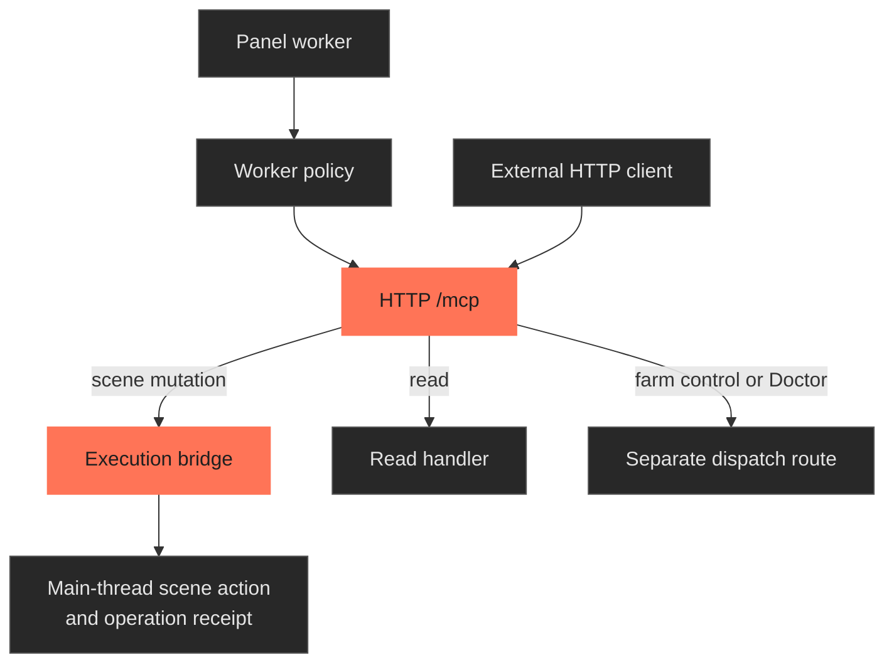
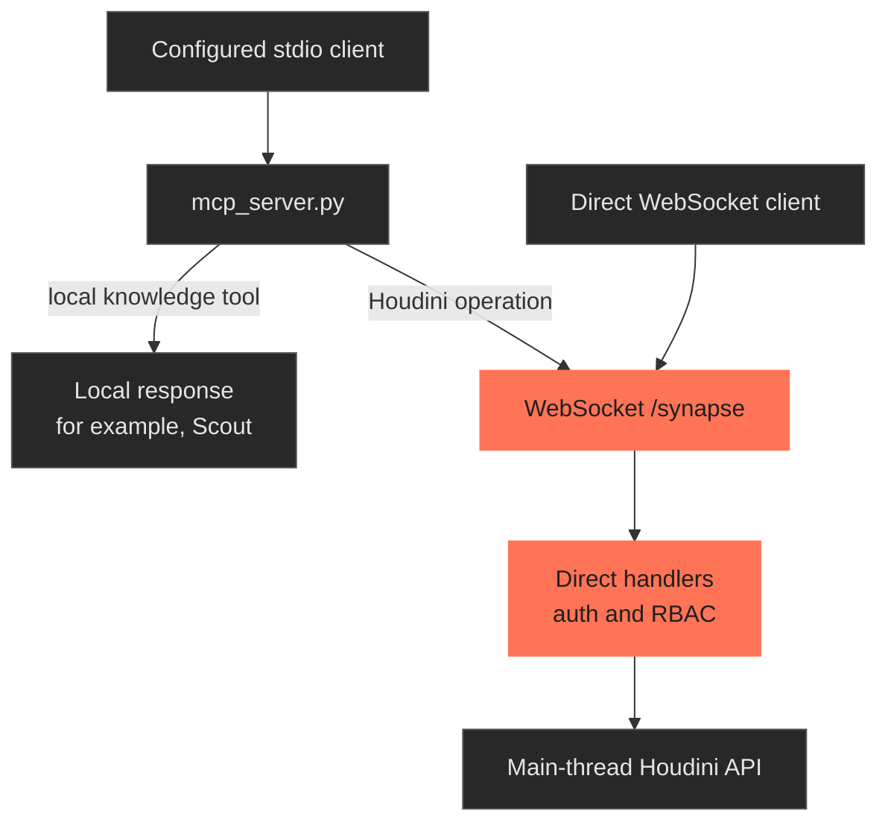
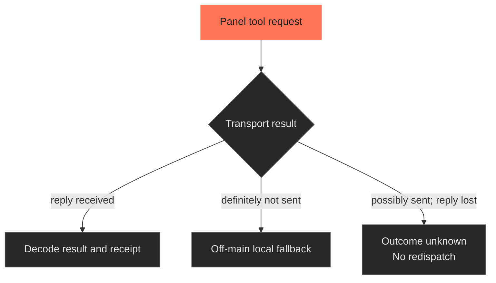
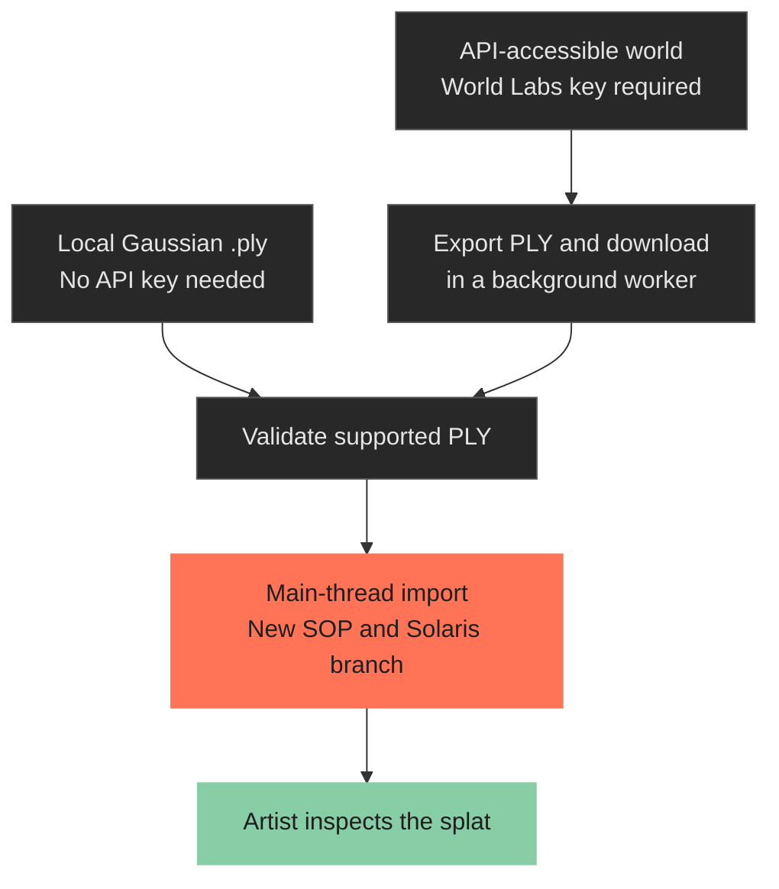
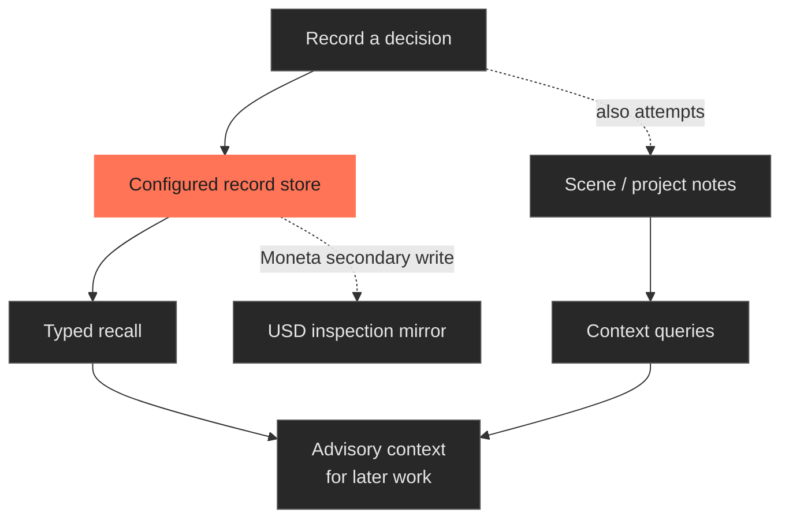
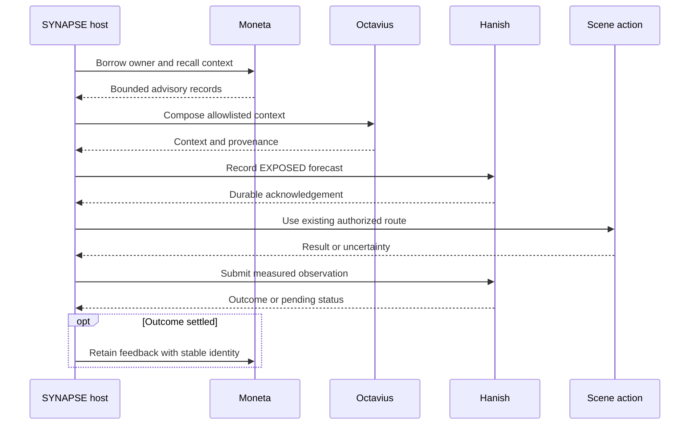
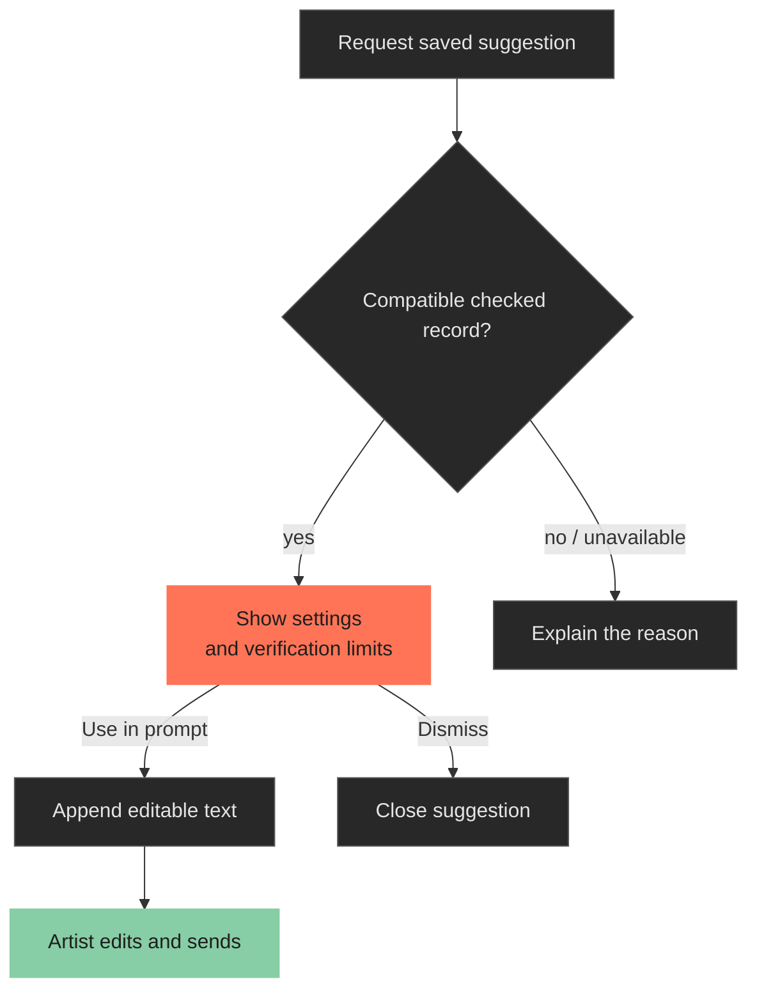
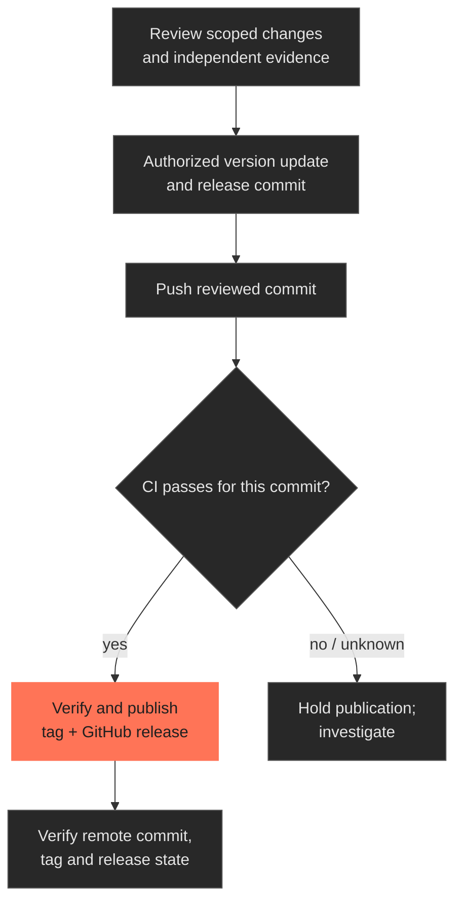

# How SYNAPSE works

[Back to README](../../README.md) · [Current limits](../status.md) · [Artist intent](../../INTENT.md)

These diagrams describe implemented behavior. Each section links to its source. Future modes in `INTENT.md` are not implied by an arrow here.

| Follow a workflow | Start here |
|---|---|
| A model calls a tool | [Execution paths](#execution-paths) |
| JEV offers advice | [JEV assistance](#jev-assistance) |
| A Marble world enters Houdini | [World Labs import](#world-labs-import) |
| Scout searches SideFX help | [Library ingestion and lookup](../studio/SIDEFX_LIBRARY.md#ingestion-and-lookup) |
| A project decision is remembered | [Memory](#project-and-scene-memory) |
| A build becomes a release | [Publication](#release-process) |

## Artist workflow

The artist chooses a model, a task and the permitted data destination. The panel worker applies its tool policy, then shows results, refusals or uncertainty. The artist inspects and edits the resulting scene.

Sources: [panel](../../python/synapse/panel/synapse_panel.py), [connections](../../python/synapse/panel/connections.py), [worker policy](../../python/synapse/panel/worker_policy.py).

## Execution paths

HTTP `/mcp` and WebSocket `/synapse` share one local Houdini server. **The connection determines the dispatch path.** Being inside Houdini does not remove the transport.

### Panel and HTTP clients

Read-classified tools skip the mutation bridge. Farm controls use their own admission and job I/O; Doctor uses its own off-main handler path. Houdini API access still belongs on the main thread.

If bridge imports are unavailable, non-farm handlers can fall back to direct dispatch without bridge wrapping. Farm controls fail closed in that case.

**Cancel cook** and **Emergency halt** are direct artist actions. They dispatch off the UI thread without asking a model. Their re-entry guards are per tool, so one does not silently swallow the other.

Sources: [HTTP dispatch](../../python/synapse/mcp/tools.py), [HTTP server](../../python/synapse/mcp/server.py), [bridge adapter](../../python/synapse/panel/bridge_adapter.py), [direct safety controls](../../python/synapse/panel/direct_tool.py).

### Configured stdio and WebSocket clients

These handlers do not inherit the panel worker's restrictions or bridge consent. Tracked mutations produce path-qualified, observe-only `IntegrityBlock` evidence; an unavailable check is not recorded as a passed check.

Sources: [configured client](../../.mcp.json), [stdio adapter](../../mcp_server.py), [handlers](../../python/synapse/server/handlers.py), [integrity envelope](../../python/synapse/server/integrity_envelope.py).

### A missing reply is not permission to repeat

Source: [panel tool executor](../../python/synapse/panel/tool_executor.py).

### Permission and undo boundaries

| Boundary | What it controls |
|---|---|
| Model-data permission | Which provider may receive permitted task data. |
| Standard panel worker | Allows classified reads and edits; refuses higher-risk tools and unknown tools. |
| Optional `proposal` worker | Allows reads, knowledge tools and declared proposals; blocks direct mutation and graph instantiation. Default remains `standard`. |
| Production bridge | Uses nonblocking auto-approval at its admission layer. No interactive approval card is attached. |
| Direct WebSocket handlers | Their own authentication, RBAC and handler rules. They do not inherit panel policy. |
| Undo grouping | Groups supported scene edits. It does not reverse file/network effects or guarantee exception rollback. |

The bridge has a `HumanGate` API, but attaching its blocking approval poll to the GUI thread would deadlock the panel. Panel worker refusals are a separate control. External direct handlers can still execute Python/VEX under their own rules.

If construction fails halfway, inspect the partial scene before undoing. Native Undo/Redo traverse existing history outside a new undo group. Composition checks and operation receipts do not guarantee a rollback.

Use the external bridge on a **single-user local machine**. [MCP setup and authentication](../mcp/SETUP.md).

Sources: [worker policy](../../python/synapse/panel/worker_policy.py), [bridge construction](../../shared/bridge.py), [nonblocking consent tests](../../tests/test_panel_consent_no_freeze.py).

## JEV assistance

JEV is an optional adviser. A saved TypeSafe key, enabled preferences and the required permission are separate conditions. **Saving the key does not validate it or enable assistance.**

- **Rank selected-network actions** reorders available local suggestions. Selecting one appends editable prompt text; the artist decides when to send.
- **Measure routing** records shadow judgments. It does not switch the generation model or change its input.

Neither mode grants scene permission. If assistance is unavailable, its status must remain explicit.

[Key setup and flow diagram](../getting-started/jev-setup.md) · [action ranking](../../python/synapse/jev/selection_suggestions.py) · [routing measurement](../../python/synapse/jev/panel_routing.py) · [credentials](../../python/synapse/jev/credentials.py)

## World Labs import

Open **World Labs** beside **Cloud relay**. This imports an existing world or a supported local Gaussian `.ply`; it does not generate a world.

For remote import, enter a key in the masked field, choose **Connect World Labs**, then supply a world ID/Marble URL or select an API world. Choose a resolution and **Import world**. The list does not represent all Marble-app history.

The native route is File SOP → Bake GSplats → SOP Import LOP. It creates a separate branch and an undo group; it does not merge into existing stage wiring. On failure it attempts to remove its own new nodes and reports cleanup errors.

**Format limits:** Gaussian PLY supports constant color (DC-only) or a complete degree-3 spherical-harmonic layout. Partial harmonic layouts, ordinary point PLY, direct SPZ and mesh GLB are unsupported. Coordinates and units are preserved; metric scale, grounding and rendered appearance need inspection.

Closing the dialog prevents a late scene import; it does not abort a download already running. Authenticated remote access and a Karma beauty render were not established by the [v5.83.0 validation](../releases/v5.83.0.md#world-labs-import).

Sources: [dialog](../../python/synapse/panel/worldlabs_dialog.py), [API client](../../python/synapse/worldlabs/client.py), [native importer](../../python/synapse/worldlabs/importer.py).

## Project and scene memory

Recording a decision retains context for later recall. It does not reconstruct a network or authorize a scene change.

| Normal saved-project location | Role |
|---|---|
| `.synapse/memory.jsonl` | Default JSONL records; also a secondary copy with Moneta. |
| `.synapse/.moneta/snapshot.json` | Persistent source for the Moneta-backed record store. |
| `.synapse/.moneta/cortex_root.usda` | Inspectable USD mirror when Moneta and USD authoring are available. |
| `$HIP/claude/memory.md`, `$JOB/claude/project.md` | Human-readable scene and project notes. |

Unsaved scenes or unwritable projects can use fallback locations. `SYNAPSE_MEMORY_BACKEND=moneta` selects Moneta; initialization failure falls back to JSONL with the reason recorded. Closing the USD view does not control persistence.

`synapse_recall` retrieves typed records, defaulting to decisions. `synapse_memory_query` searches loaded scene/project content. `synapse_project_setup` loads starting context.

**An ID alone does not prove durability.** Snapshot, mirror and note writes are independent. Reopen the project and retrieve the record before claiming cross-session persistence. Ordinary saved decisions do not require the optional LOOP.

Sources: [recording and recall](../../python/synapse/session/tracker.py), [store selection](../../python/synapse/memory/store.py), [Moneta persistence](../../python/synapse/memory/moneta_store.py), [scene notes](../../python/synapse/memory/scene_memory.py), [context queries](../../python/synapse/server/handlers_memory.py).

## Memory LOOP

The optional LOOP observes eligible operations. **It does not choose the scene action.**

| Substrate | Role |
|---|---|
| Moneta | Recall project records; retain settled feedback. |
| Octavius | Compose allowlisted context in a private USD stage. |
| Hanish | Retain a pre-action forecast and terminal evidence. |

Enable with `SYNAPSE_LOOP_ENABLED=1`. The main-thread host borrows the existing memory owner; workers carry data, not handles. Octavius and Hanish run in bounded subprocesses.

The forecast concerns whether a synchronous handler returns without explicit failure. It does not predict an artist's next node or image quality.

- Missing Octavius can yield narrower local context, with the limit named.
- Missing Moneta ownership can leave the action uninstrumented.
- Recovery cannot invent a pre-action forecast after dispatch.
- Unknown stays unknown. Recovery retries observations, never scene actions.

[Configuration and evidence](../MEMORY_LOOP_REPAIR.md) · [Host observer](../../python/synapse/host/memory_loop.py) · [Coordinator](../../python/synapse/loop/coordinator.py)

## Checked suggestions and future assistance

Stage 0 supports a fixed lookdev procedure with a developer-imported checked record and an existing Moneta owner. It is distinct from JEV's action ranking.

A record does not replay node paths or authorize a build. Compatibility includes the exact SYNAPSE version; upgrading requires a matching rehearsal/import. [Stage 0 guide](../development/rsi_stage0.md).

Predictive network generation, frontier-model Computer Use and recursive improvement remain later stages described in [INTENT.md](../../INTENT.md).

The [staged workflow guides](../../rag/corpus/guides) retain upstream provenance; that corpus is not yet served by the product. It is separate from the connected SideFX library.

## Release process

[Version agreement](../../scripts/sync_version.py), [tag gate](../../scripts/tag_release.py) and [CI publication gate](../../scripts/release_ci_gate.py) support this workflow. Historical tags retain their original commits.

Stock-Python [CI](../../.github/workflows/ci.yml), native Houdini qualification and Windows installer checks prove different things. A source release does not imply a new Setup executable. Read the release's recorded limits.

[Repository metadata](../../.github/repository-metadata.json) records desired GitHub topics and description; a maintainer must apply them. The file does not configure GitHub automatically.
