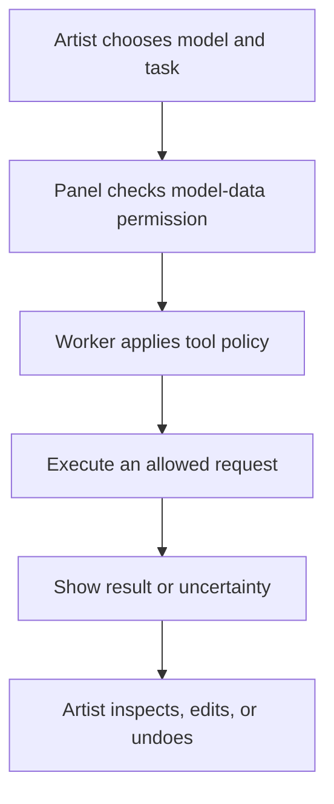
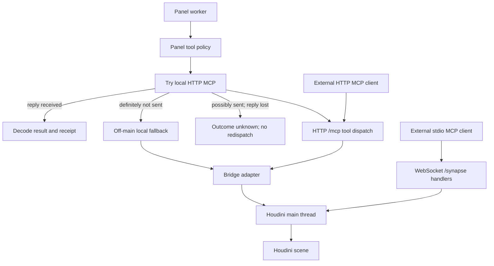
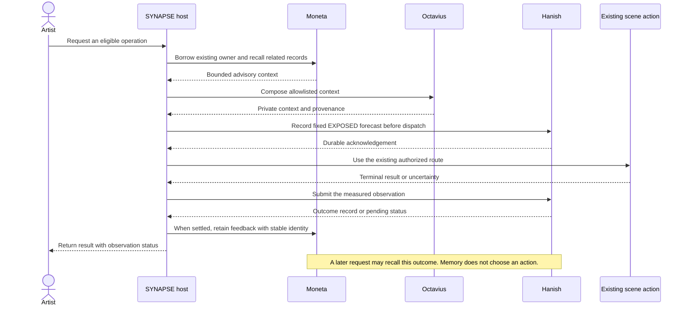
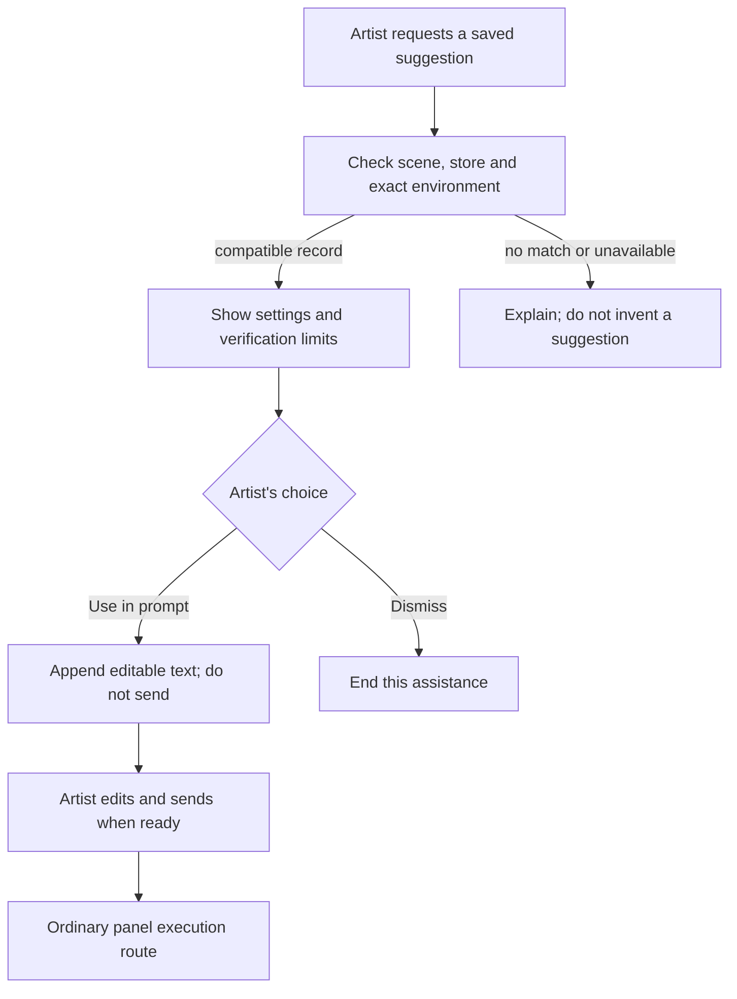
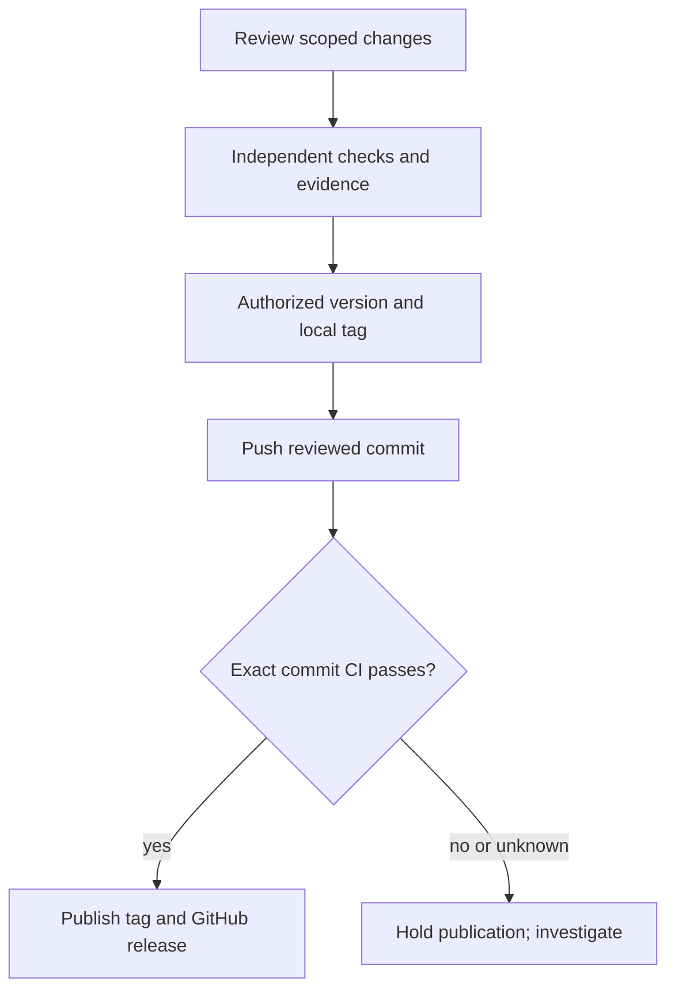

# How SYNAPSE works

[Back to README](../../README.md) · [Current limits](../status.md) · [Artist intent](../../INTENT.md)

This page describes the implemented paths carried forward from v5.67.3. The
predictive and Computer Use modes in INTENT.md are product direction.

## Artist workflow

The panel owns the conversation. The artist chooses a model connection, a task,
and the permitted data destination. The normal chat worker also limits which
tools can run. Neither permission is a substitute for inspecting the result.

Sources: [panel](../../python/synapse/panel/synapse_panel.py),
[connections](../../python/synapse/panel/connections.py),
[worker policy](../../python/synapse/panel/worker_policy.py).

## Execution paths

The agent runs inside Houdini's Python interpreter. The preferred panel tool
route still uses the local HTTP MCP endpoint; in-process does not mean there
is no transport. HTTP and WebSocket share the local hwebserver.

Sources: [worker](../../python/synapse/panel/claude_worker.py),
[MCP client](../../python/synapse/panel/tool_executor.py),
[HTTP tools](../../python/synapse/mcp/tools.py),
[bridge adapter](../../python/synapse/panel/bridge_adapter.py),
[stdio adapter](../../mcp_server.py), [main-thread dispatcher](../../python/synapse/server/main_thread.py).

### Permission and undo boundaries

| Boundary | What it actually controls |
|---|---|
| Model connection and task permission | Which checked provider may receive permitted task data. |
| Normal panel worker policy | Reads, allowed edits and permitted builder categories. It blocks arbitrary Python/VEX and several destructive or long-running tools in standard mode. |
| Bridge `HumanGate` API | Supports operation-consent enforcement when configured. The current production panel bridge singleton does not attach this gate. |
| Direct WebSocket handlers | Follow their own auth, RBAC and handler rules; they do not inherit the panel worker's policy. |
| Undo grouping | Groups supported scene edits into an operation. It does not undo file/network effects or guarantee exception rollback. Native Undo/Redo traverse existing history outside a new group. |

**Source contradiction recorded:** older prose in [CLAUDE.md](../../CLAUDE.md)
calls `/mcp` universally consent-gated. The current
[adapter construction](../../python/synapse/panel/bridge_adapter.py) and
[bridge consent implementation](../../shared/bridge.py) show a gate-less production
singleton with auto-approval at that layer. The normal panel worker has separate
restrictions. Documentation must not turn the available `HumanGate` API into a
claim that it is wired on every production route. This update changes no policy.

The bridge attempts guarded rollback on some failures; grouping alone does not
ensure that rollback succeeds. See [bridge implementation](../../shared/bridge.py).

Use the external bridge on a single-user local machine. See
[MCP setup and authentication](../mcp/SETUP.md) before connecting a client.

## Project and scene memory

The [README diagram](../../README.md#how-synapse-remembers) follows a saved
decision from recording to inspection and recall. Memory retains information
about the work; retrieving a decision returns context rather than a Houdini
network reconstruction.

**Recording.** `synapse_decide` creates a decision record with an ID, choice,
reasoning and alternatives. Its handler also attempts a scene-memory note.
`synapse_memory_write` can write entries at scene or project scope.

These are the normal locations for a saved project; path resolution can select
a fallback location for an unsaved scene or an unwritable project.

| Storage | Role |
|---|---|
| `.synapse/memory.jsonl` | Persistent records for the JSONL backend; also a secondary copy when the Moneta adapter is configured. |
| `.synapse/.moneta/snapshot.json` | Persistent source for the Moneta-backed record store. |
| `.synapse/.moneta/cortex_root.usda` | Inspectable USD mirror when Moneta and USD authoring are available. Each record has a kind, ID and serialized payload under `/MonetaMemory`. |
| `$HIP/claude/memory.md` and `$JOB/claude/project.md` | Human-readable scene and project notes in the normal Markdown-backed configuration. |

The store selector uses JSONL when no backend is configured.
`SYNAPSE_MEMORY_BACKEND=moneta` selects Moneta; import or initialization failures
fall back to JSONL and record the reason. The USD mirror is a secondary write
target. Opening or closing an inspection view does not control record persistence.

**Recall has different routes.** `synapse_recall` retrieves matching typed records
from the configured store, defaulting to decisions. `synapse_memory_query`
searches loaded scene/project content, while `synapse_project_setup` loads
starting context. The USD inspection view is not required for these routes.
Reopen the same project and retrieve the saved choice to check cross-session recall.

**Write limits.** Legacy decision writes attempt persistence, but a returned ID
alone is not a durable receipt. Snapshot, USD-mirror and note writes are not one
transaction; secondary writes can fail independently. Verify the stored record
before claiming it survived a restart.

The optional LOOP below adds observation around scene actions. Ordinary saved
decisions do not require Octavius or Hanish.

Sources: [decision recording and recall](../../python/synapse/session/tracker.py#L494),
[store selection](../../python/synapse/memory/store.py#L1075),
[Moneta persistence and mirrors](../../python/synapse/memory/moneta_store.py#L158),
[USD record authoring](../../python/synapse/memory/moneta_runtime.py#L868),
[scene/project notes](../../python/synapse/memory/scene_memory.py#L520),
[context loading and queries](../../python/synapse/server/handlers_memory.py#L190).

## Memory LOOP

Three substrates scaffold one another. SYNAPSE owns coordination and the artist's
existing execution route owns the scene action.

| Substrate | Responsibility |
|---|---|
| **Moneta** | Recall prior project records and retain protected feedback capsules. |
| **Octavius** | Compose allowlisted context into a private, anonymous USD stage. |
| **Hanish** | Record a pre-action forecast, accept terminal evidence and retain its outcome. |

This diagram shows a complete, configured observation cycle around an eligible
operation. The forecast concerns whether the synchronous handler returns without an explicit failure;
it is not a prediction of the artist's next node or the quality of an image.

The LOOP is **opt-in** (`SYNAPSE_LOOP_ENABLED=1`). Workers carry data, not memory
handles. The main-thread host borrows the existing project owner. Hanish and
Octavius run in bounded subprocesses.

- If Octavius is unavailable, the host may return narrower allowlisted local context with the limitation named.
- If Moneta cannot supply its owner/snapshot, the action can proceed without LOOP instrumentation.
- If Hanish could not durably author a forecast before dispatch, later recovery cannot invent that forecast after the action.
- Unknown outcomes stay unknown. Delivery recovery retries observation records, never the scene action.

[Configuration, recovery and evidence](../MEMORY_LOOP_REPAIR.md) ·
[Host observer](../../python/synapse/host/memory_loop.py) ·
[Coordinator](../../python/synapse/loop/coordinator.py)

## Checked suggestions and future assistance

Stage 0 supports one fixed lookdev procedure in a matching environment. It
requires a developer-imported checked record and an existing Moneta owner.

The record does not replay old node paths or authorize a new build. The exact
SYNAPSE version is part of compatibility, so release upgrades require a matching
rehearsal/import. [Stage 0 developer guide](../development/rsi_stage0.md).

Predictive network generation, frontier-model Computer Use and recursive
improvement remain later stages. [INTENT.md](../../INTENT.md) defines independent,
artist-engaged controls; the diagram above is the smaller scaffold shipped today.

## Release process

[Version agreement](../../scripts/sync_version.py),
[clean-tree tag gate](../../scripts/tag_release.py) and
[CI publication gate](../../scripts/release_ci_gate.py) support this workflow.
The [CI matrix](../../.github/workflows/ci.yml) tests stock Python separately from
native Houdini qualification. Historical release tags retain their original commits.

The desired GitHub description and topics are recorded in
[repository metadata](../../.github/repository-metadata.json). A maintainer applies
that metadata during publication; the file does not configure GitHub automatically.
