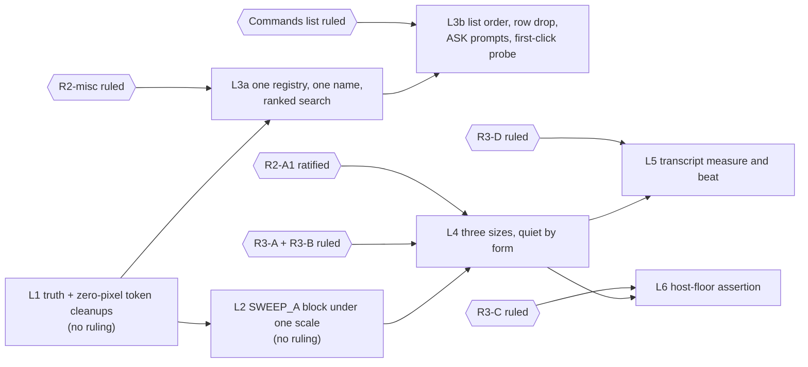

# Panel typography and the Commands surface: a refinement spec

Date: 2026-09-21 · HEAD 845da18e (v5.78.0) · authored by the CTO seat (Fable 5.1) on Joe's word
Lens: the working rules of J. Abbott Miller (Pentagram), stated below as rules, not quotations.

**How it was produced.** One dynamic workflow: three read-only cartographers (a typography census of the token file, the stylesheet, the transcript and the test pins; a census of every "/" and command road; the ruling backlog in `harness/design_review/RANKED.md`), one designer composing a single spec from the three maps, one crucible attacking the spec against the code. The crucible's verdict was SOUND-WITH-NITS with ten findings; every one is folded into the text below and listed in section 8. Nothing here changed a line of panel code. Producer: workflow run `wf_b828ff70-b09`; parsed result `Claude outputs/panel_design_scout.json`.

**What this document is.** A build plan of seven worktree legs and a recommendation, with its measured basis, for each open ruling the backlog already marks as yours. Two legs need no ruling. Five do not open until the named ruling is recorded. Nothing in it settles a ruling.

---

## 0. The thesis

The panel already owns one type file and one palette. What it lacks is a single gesture.

Value cannot carry hierarchy: both quiet greys are pinned at the AA floor. Size cannot carry it below 15: 11 and 12 share a six-row x-height, and on the measured host both render at about 25 and 27 pixels. So every quiet role has to be carried by form. Sans for words. Mono for data. Caps plus tracking for the eyebrow. Weight 700 only at 15 and 19.

The same rule names the "/" surface. One list. One name, Commands. Rows written as what happens, not as slash tokens. Ranked by prefix before substring. The things the panel answers itself come first.

## 1. The six rules, applied

| Rule | Applied here |
|---|---|
| Typography is the design; type carries hierarchy before any colour, box or rule does. | Three forms at one body size (sans words, mono data, caps-plus-tracked eyebrow) plus 700 at 15 and 19. No new colour, no new box. The Doctor yellow (R2-B1) comes off because hue is not a hierarchy carrier here, and the hue-bucket guard is already red at four buckets. |
| Design is writing: structure is legible before a word is read, and a control says what happens. | Palette rows renamed by outcome ("Open the render workspace", "Show updates") while their send strings stay pinned. One name for the surface in placeholder, tooltip, footer and overflow. The search placeholder stops counting rows. |
| Contrast of scale beats a ladder of sizes. | Recommend R3-A: the ramp becomes 12 / 15 / 19, three sizes with real steps (1.25, 1.27). One pin moves by declaration (the "at least four sizes" assertion); the "at most five" pin is untouched. Off-ramp text folds onto the ramp or is declared a non-text glyph box. |
| The grid and the measure are the reader's rhythm. | The transcript reads 28.6 characters per line because of Space Mono plus 0.15 em tracking, not the pane. Untracked sans measures 45.9 at zero width cost. The measure constant drops from 90 to 66. The turn beat gets its own gap keys so six shared surfaces do not move. |
| One system across scales. | The legacy block below the SWEEP_A marker in `qss.py` (about 25 rules) comes under the same scale function, the same weight tokens, and loses its inert letter-spacing, so an 11 px pill and the 19 px hero obey one ramp at 1.0 and at the 2.25× host. |
| Restraint: one gesture, everything else quiet. | The wordmark stays the one gesture. Removed: the second command registry's 20 raw "/word" sends, the unranked substring search, the "Palette" name, the inert QSS letter-spacing, the arithmetic 700s. |

## 2. What the census found (the facts the spec stands on)

**Type.** The ramp at HEAD is 11 / 12 / 12 / 15 / 19, four distinct sizes (`tokens.py:390-400`). Two bundled families: Space Grotesk variable (sans) and Space Mono 400/700. Tracking and family travel by QFont only; Qt stylesheets have no letter-spacing, so every QSS letter-spacing declaration is inert (`fontload.py:4-7`). Seven type roles (`tokens.py:516-529`); nine tracking entries. The rhythm module borrows the SEND and DATA tracking values for labels and tags because the token file is frozen (`rhythm.py:75-76`). Most rail and footer chrome is mono at the small size while the role doctrine reserves mono for data (8 of the 10 tracked-font calls in `synapse_panel.py`; `tokens.py:509-515`). The transcript targets 90 characters per line (`chat_display.py:298`), above the 45 to 75 band. The formatter computes 15 / 14 / 13 px headings off the ramp and a 10 px "signed" note under the floor (`message_formatter.py:158, 278-279`). The formatter's scale function has no floor (`:94-96`); the display's does (`chat_display.py:176`).

**The panel scales to the host, and the token file says it does not.** `synapse_panel.py:552-554` seeds a chrome scale of host pixel size over body size (`_host_font_scale`, `:1622-1638`), 27 / 12 = 2.25 on the measured host, into the stylesheet, every chrome font and the transcript. Authored 11 / 12 / 15 / 19 render at about 25 / 27 / 34 / 43. The provenance string at `tokens.py:464` ("nothing in the panel scales to the host") and READABILITY.md:74-76 are both wrong at HEAD. The Aa ladder is already host-floored: `tokens.next_font_scale` (`:601-615`) calls `host_floored_steps` and is invoked at `synapse_panel.py:2987`. What does not exist is an assertion that the smallest rendered chrome pixel size clears the host pixel size. And `_host_font_scale` itself states "no readability floor" (`:1626`): on a 12 px host (scale 1.0) an authored 11 renders below the Houdini default today.

**"/" roads.** Three roads end in one sink: "/" on an empty composer (`synapse_panel.py:387-389`), Ctrl+K (`:675`) and the footer "Commands" link (`:2549`) all open the same ToolPalette (`:2989`); the overflow menu calls the same surface "Palette" (`:2770`). A pick emits one string into `_send` (`:3058-3060`). `_send` intercepts four literal slash strings to local views before the worker check (`/render`, `/events`, `/saved-recipes`, `/lookdev-suggestion`, `:3158-3170`); `/restore-session` is intercepted after the busy check (`:3175-3177`) and on a fresh session emits a system message ("No parked previous session to restore.", `:3288`), not a view. A second, hard-coded 25-entry slash list exists in `command_palette.py:87-113`; all 25 flow through the palette builder as category "command", so 20 of them go to the model as raw "/word" text (`tool_palette.py:162`). A second palette class with fuzzy ranking exists and is unwired (`command_palette.py:300-369`). The palette search is unranked substring, and its sort is context rank, verb, title (`tool_palette.py:201`). The FR-3 and U3 artist findings were measured on the deleted legacy pill row (`artist_findings.json:196-210, 361-375`), so the shipped first click has not been measured.

**Pins that constrain every change.** At most five distinct sizes (`tests/test_panel_typography.py:118-127`) and at least four (`tests/panel/test_type_scale_native.py:27-29`). No literal font size, weight or family in `qss.py`; token interpolations only. `qss.py` is append-only against the git baseline; edits go through exact (old, new) amendment tuples applied by `tests/test_panel_sweep_a.py:305`. Below the SWEEP_A marker the builders are invoked with no arguments (`qss.py:556-557`), so the scale function is not in scope there. Mono draws 400 and 700 only. AA floors: body 4.5, large 3.0, seeded sweep 3.5 on any grey; both quiet greys cannot move. J3 speaker colours are pinned. The overflow "Palette" label is asserted at `tests/panel/test_bc_wave.py:209`. The `/render` send is pinned at `tests/native_render_workspace.py:475-478` and `test_farm_integration.py:383`. Verify only via hython offscreen. Joe's law: fonts consistent and no smaller than the Houdini default; `FONT_FLOOR_PX = 11` is absolute on authored tokens.

## 3. The type system

**Ramp.** If R3-A is YES: `SIZE_SMALL = SIZE_UI = SIZE_BODY = SIZE_LABEL = 12`, `SIZE_TITLE = 15`, `SIZE_HERO = 19`. Three distinct sizes. If NO: today's 11 / 12 / 15 / 19. Either way the five-size ceiling and the absolute floor are untouched; YES moves the four-size floor in `test_type_scale_native.py:29` from 4 to 3 by declaration, citing the ruling id. `GLYPH_SM` 14 and `GLYPH_MD` 18 stay named glyph boxes for dots and chevrons, not text. Off-ramp text folds in: formatter headings to title 700 / body 700 / body 500; the 10 px "signed" note to the small size; the 21 px in `face_review.py:227` to the hero size and its 11 px literals (`:326, :370, :380`) to tokens. No 13 px rung.

**Families.** Space Grotesk for everything that is a word: display, title, body, label, caption, speaker names, pills and buttons that read as words, palette row titles and group heads. Space Mono for everything that is data: code, node paths and chips, cook and meter numbers, timestamps, status values, palette hint keys. No role asks a face for a weight it cannot draw: the speaker row currently asks mono for 500 and renders 400.

**Quiet by form.** Three forms at body size carry three states. LOUD is weight 700 at title and hero sizes only. QUIET is sans 500, all caps, tracked (EYEBROW 0.22 em for heads, LABEL_SM 0.12 em inline). DATA is mono 400 with DATA 0.03 em. Mono is not a synonym for quiet. The rhythm module's borrowed tracking values become named entries with the same numbers, so zero pixels move.

**Transcript.** Sans body, tracking 0, authored 12, host-scaled, floored at 11 in both the display and the formatter. Measure 66 characters. Speaker rows sans 500, caps, LABEL_SM tracking, colours untouched; both tracking owners fold, the formatter's inline 1.2 px letter-spacing (`message_formatter.py:391`) and the display's re-font (`chat_display.py:218-220`), and the thinking indicator's inline 1 px (`chat_display.py:733`) goes the same way. Turn beat: transcript-own gap keys at 24 / 8, the ratio the formatter already passes into `_ruled_turn` (`:423, :443`) and the display overrides on the top margin only (`chat_display.py:206`).

**Relation to the host.** Authored 12 is the Houdini default exactly; the Aa steps only scale up and are already host-floored; the 11 px floor is a guard on authored tokens against the readability audit, not a live pixel claim. On a 12 px host today, authored 11 renders below the default. That is why R3-A is a Joe's-law question, not a taste question. The provenance string is corrected in leg 1; R3-C is decidable after that.

## 4. The Commands surface

**Roads.** Three roads, one surface, one name. "/" on an empty composer, Ctrl+K and the footer link open the same palette. The overflow action is renamed from "Palette" to "Commands" and kept, because a hidden label is its live reader and hidden-widget deletion is a separate ruling. The rename is R2-misc territory and is not build work (RANKED.md:76: "a crit is not a ruling"). No new road.

**The one list, in this order (this order is itself a ruling, see section 5).**
1. PANEL: the things the panel answers itself, named by outcome, sends pinned. Open the render workspace. Show updates. Saved networks. Saved lookdev suggestion. Restore last session (a system message when nothing is parked).
2. ASK: Explain, Fix, Optimize, with sends that state the empty-scene fallback ("... the selected node, or the whole scene if nothing is selected").
3. RECIPES, with the pinned prefix.
4. TOOLS by context (SOP, LOP, COP, Karma, USD), destructive rows keeping their warning.
5. PRESETS: ten materials, three render tiers.

Of the twenty former slash rows with no handler, each either gets a real prompt as its send or is dropped. None ships as a raw "/word".

**Execution.** A pick emits one string into `_send`. The four local intercepts before the worker check and the fifth after it stay as pinned. Search: the DO × WHERE chips first, then the ranking ported from the unwired palette class (prefix, word boundary, substring, subsequence) over title, description and send, so "/re" surfaces Render before recipes. Popups stay styled at the live font scale (`tool_palette.py:282, :311`).

**First click.** Empty scene, empty composer, the artist types "/". Commands opens anchored to the input with the PANEL group at the top; four of its rows open a view without a node in the scene and the fifth says, in a system line, that there is nothing to restore. Below it the three ASK verbs read as sentences that say what happens with nothing selected. Enter picks the first row; Escape returns focus. The shipped first click gets an offscreen probe in leg 3a, since the old measurement was of a surface that no longer exists.

**Removed.** The "Palette" name; the second registry and its raw sends; the unranked search; the row-count placeholder; the group heads' borrowed tracking. Not removed: any road, the footer buttons, the unwired palette class (its ranking is imported; its widget waits for a gated delete), any hidden widget.

## 5. Recommendations on the open rulings

These are yours. Each carries its measured basis; none is settled here. Grouped so they can be answered in five words.

**Group 1, the ramp: R2-A1, R3-A, R3-B (rule in one breath).**

| Ruling | Recommendation | Basis |
|---|---|---|
| **R2-A1** "airy is a spec, not a target" | **Ratify first**, via `scripts/ingest_rulings.py`. | One word unsticks four items; RANKED.md's own order puts it first (`:67, :97-113`). |
| **R3-A** retire 11 px | **Yes.** Alias small to body; caption and status carried by form. Ramp 12 / 15 / 19. | This is the only ramp that satisfies Joe's law on a 12 px host: `_host_font_scale` applies no readability floor (`synapse_panel.py:1626`), so authored 11 renders below the Houdini default there. On the measured 2.25× host it is about 25 versus 27 rendered pixels, a step nobody sees; the letter x occupies six pixel rows at both sizes (RANKED.md:50). Cost: one pixel on one widget, the four-size floor at `test_type_scale_native.py:29` moved to three by declaration, and a partial reversal of PR #100. |
| **R3-B** what carries quiet | **Caps plus tracking in sans 500 at body size.** Mono is data, not quiet. Weight 700 is 15 and 19 only. | Both quiet greys are two levels apart and pinned at the AA floor (RANKED.md:51). Most rail chrome is mono at the small size while the doctrine reserves mono for data; mono cannot draw 500. |

**Group 2, the transcript: R3-D, R3-E.**

| Ruling | Recommendation | Basis |
|---|---|---|
| **R3-D** transcript measure | **Yes.** Untracked sans body, mono only for code and paths, measure 90 → 66. | 28.6 cpl comes from Space Mono plus 0.15 em (8.05 px per glyph); untracked sans measures 45.9 at zero pane-width cost; a third is already banked by R3-2 (RANKED.md:53, :36). |
| **R3-E** speaker spacing | **Yes to transcript-own gap keys** at 24 / 8, re-measured offscreen. | 16 versus 12 is a quarter of an 18 px line; the 3.0× ratio already travels into the formatter's turn rule and is overridden on the top margin by the display, which reads the shared keys six surfaces use (RANKED.md:54). |

**Group 3, the floor: R3-C (coupled to R3-A).**

| Ruling | Recommendation | Basis |
|---|---|---|
| **R3-C** absolute floor vs a host that moves | **Yes, host-derived, after the premise is corrected.** Keep the 11 px floor on authored tokens; add an offscreen assertion that the smallest rendered chrome pixel size is at or above the host pixel size. | The ladder is already host-floored (`tokens.py:601-615` → `synapse_panel.py:2987`); the missing piece is the assertion. On a 12 px host that assertion fails while authored 11 exists, so this ruling only holds together with R3-A YES. The provenance string is corrected in leg 1 (no value change). |

**Group 4, the Commands surface: R2-misc plus one new ruling.**

| Ruling | Recommendation | Basis |
|---|---|---|
| **R2-misc** naming | Rename the overflow action to "Commands". Delete no hidden widget. Leave "Connect" → "Bridge" unruled here. | One surface, three names; three of six hidden widgets have live readers, one feeding this very action (RANKED.md:76). The live pin is the assertion at `tests/panel/test_bc_wave.py:209`, amended by declaration. |
| **NEW: the Commands list** | Adopt the order PANEL / ASK / RECIPES / TOOLS / PRESETS, drop or rewrite the 20 raw slash rows, and give the three ASK verbs empty-scene prompts. | Today's sort is context rank, verb, title (`tool_palette.py:201`); the 20 rows have no handler (`command_palette.py:87-113`); the ASK prompts are unpinned (`synapse_panel.py:178-182`). The crucible was right that this is a design decision presented as build work, so it is recorded here as yours. |

**Group 5, the accent: R2-B1.**

| Ruling | Recommendation | Basis |
|---|---|---|
| **R2-B1** Doctor yellow | **Drop it.** Doctor takes the shipped SIGNAL action family. No new tint. | The hue-bucket guard is red at HEAD with four buckets (`test_bc_wave.py:329`; RANKED.md:68); the three-source accent trap forbids fixing it by unification. |

## 6. The build, as a graph

| Leg | Ruling | Targets | Shell-checkable acceptance (abridged) |
|---|---|---|---|
| L1 Truth and zero-pixel token cleanups | none | `tokens.py`, `rhythm.py`, `message_formatter.py`, READABILITY.md | `grep -c 'nothing in the panel scales' tokens.py` → 0 and the string still starts with "measured"; no borrowed SEND/DATA tracking in `rhythm.py`; `grep -c '_scale(10,' message_formatter.py` → 0; `_scale` floored; `audit_panel.py --strict` exits 0 offscreen |
| L2 SWEEP_A block under one scale | none | `qss.py`, a NEW named amendment tuple in `tests/test_panel_sweep_a.py` | scale threaded through every `_sweep_a_builders` entry (signature change, `qss.py:556-557`); no `{t.SIZE_*}px`, no `letter-spacing`, no arithmetic 700 in `qss.py`; pairs in a new tuple, never appended to the 2026-09-15 one; no test file deleted; 340×760 renders clean in every profile |
| L3a One registry, one name, ranked search | R2-misc | `synapse_panel.py`, `tool_palette.py`, `command_palette.py`, `tests/panel/test_bc_wave.py:209` by declaration | `grep -c '"Palette' synapse_panel.py` → 0; the palette builder has one source; ranking imported; `grep -c 'Search %d' tool_palette.py` → 0; `/render` pins survive |
| L3b List order, row drop, ASK prompts, first-click probe | the Commands-list ruling | `tool_palette.py`, `command_palette.py`, `synapse_panel.py:178-182`, a new offscreen `probe_first_click.py` | exactly five sends begin with "/"; group order PANEL / ASK / RECIPES / TOOLS / PRESETS; probe exits 0 with four views opened and one system message, three prompts sent, no dead end |
| L4 Three sizes, quiet by form | R2-A1 + R3-A + R3-B | `tokens.py`, tracked-font call sites, `face_work.py`, `face_review.py`, `test_type_scale_native.py:29` and other pins by declaration | distinct sizes = 3; every role ≥ the floor; no 21 / 11 literals in `face_review.py`; seeded contrast sweep green; no colour token moves |
| L5 Transcript measure and beat | R3-D (R3-E rider) | `chat_display.py`, `message_formatter.py:391`, `rhythm.py` if R3-E, a new measure probe | `_MEASURE_CHARS = 66`; probe reports 45 ≤ cpl ≤ 75 at 340 px and 1100 px at Aa 1.0 and 1.6; speaker block sans 500; no inline letter-spacing left in the formatter or the display |
| L6 Host-floor assertion | R3-C (needs R3-A) | `probe_ui_font.py` (may print the verdict), `tests/panel/test_font_scale.py` by declaration | probe prints host px and min chrome px with min ≥ host, exit 0; `FONT_FLOOR_PX == 11` and the provenance starts with "measured" |

Whole-spec acceptance: the strict offscreen audit exits 0 after every leg; every profile renders at 340×760 with nothing clipped and group heads exactly 48 tall; the contrast sweep holds and no colour token moves; every touched pin appears as an amended declaration, never a deletion; px greps are scoped to `font-size:` so margins and paddings do not trip them; pytest is never run inside the design workflow.

## 7. Deliberately not doing

- Deleting `styles.py` (four test files still import it).
- Direction B (host font, host greys, Houdini yellow): it supersedes J1 and J3 pins and re-baselines every audit number. This spec assumes Direction A.
- Touching the quiet greys, the speaker colours, any accent tint, or the 18 px line height.
- Removing any road to Commands or the footer buttons: the duplicate-road cost has not been measured on the shipped panel.
- Deleting the unwired palette class, the six hidden widgets, or the dead header margin rules: each needs a by-declaration exemption and is ruling territory.
- Adding a 13 px rung.
- Changing the shared group and row gaps.
- Settling any ruling.

## 8. Crucible verdict

**SOUND-WITH-NITS.** The thesis, the principles, the families and the three-form hierarchy stood; every census number the crucible could reach traced to RANKED.md or a file. Ten findings, all folded in above:

1. R3-A YES reds the "at least four sizes" pin (`tests/panel/test_type_scale_native.py:27-29`); the spec had not named it. Now named as L4's declaration.
2. `_send` keeps four intercepts before the worker check, not five; `/restore-session` sits after it and emits a system message on a fresh session. First-click acceptance rewritten to four views plus one system line.
3. The 10 px grep in L1 tripped on padding and margin values and missed the real target `_scale(10, ...)`. Replaced; px greps scoped to `font-size:`.
4. `host_floored_steps` is not unwired: `next_font_scale` calls it and is invoked at `synapse_panel.py:2987`. R3-C re-based on the missing assertion, and coupled to R3-A on 12 px hosts.
5. R3-A is a Joe's-law question, not a taste question: `_host_font_scale` applies no readability floor, so authored 11 renders below the default on a 12 px host. Reframed.
6. L3 carried four decisions under "no ruling": the rename is R2-misc, and the list order, row drop and ASK prompts are an unrecorded design decision. Split into L3a (R2-misc) and L3b (a new recorded ruling).
7. Below the SWEEP_A marker the builders take no arguments, so the scale function is out of scope; L2 must thread it through. Amendment pairs go in a new named tuple, not the 2026-09-15 one.
8. The formatter's margin constants are live inputs overridden on the top margin, not dead. Wording fixed; the second tracking owner on the speaker row and the thinking indicator's inline tracking added to L5.
9. Citation drift of a few lines in `synapse_panel.py` and `tool_palette.py`; the "12 of 14 mono" count was not reproducible (10 calls, 8 mono). Corrected.
10. Verified true: the rhythm module's borrowed tracking, the wrong provenance string, the unfloored formatter scale, the 15 / 14 / 13 headings, the 21 and 11 literals, the 90-character measure, the `/render` pins, and the red hue-bucket guard.
