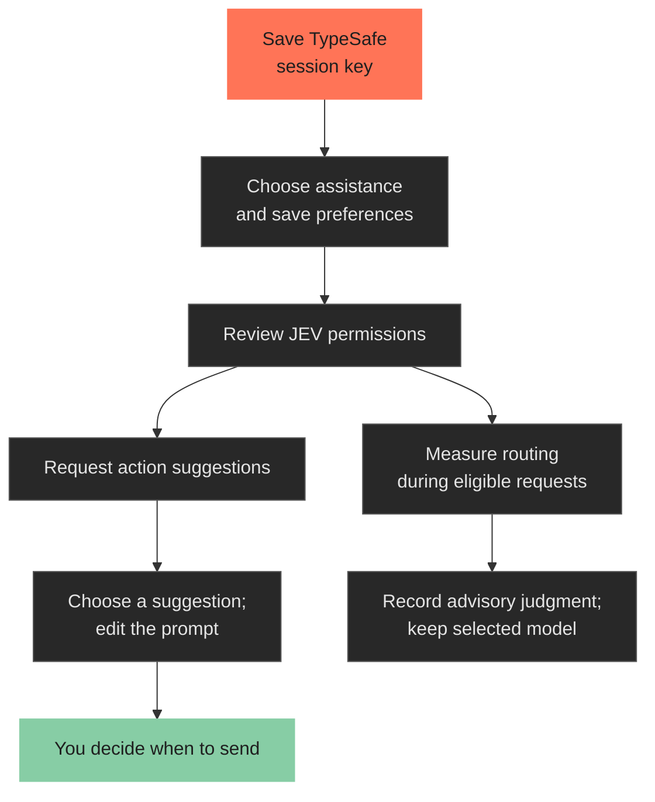

# Set up JEV assistance

[Back to README](../../README.md) · [Architecture](../architecture/overview.md#jev-assistance)

JEV is optional assistance for SYNAPSE. It uses a **TypeSafe API key**, separate from your generation model's credentials.

## Add your key

1. Open **Connect models → JEV / TypeSafe key setup**.
2. Paste the key into the masked **TypeSafe API key** field.
3. Choose **Save session key**.

The saved key stays in memory **until Houdini closes**. Closing the dialog or refreshing the panel keeps it. Closing the dialog discards any unsaved text.

Saving does **not** verify the key, enable JEV or grant permission. The status explicitly says **Validity has not been checked**.

## Enable the assistance you want

Choose an option, then **Save JEV preferences**:

| Option | What it does |
|---|---|
| **Rank selected-network actions** | When you request suggestions, ranks available actions. Choosing one prepares editable prompt text. |
| **Measure routing** | Records advisory routing judgments. It does not switch your generation model. |

Open **JEV permissions…** to review TypeSafe access for the current project. Your selected generation model stays in place.

## What leaves the panel

Both modes can send the latest request text. Requests over 4,096 characters are skipped rather than truncated. They omit scene snapshots, conversation history and attachments. Only use them with text you permit TypeSafe to receive.

Filters skip detected code and credentials. Action ranking also checks for scene/file paths; routing measurement does not use that extra path filter. These heuristics cannot recognize every secret.

Sources: [action ranking](../../python/synapse/jev/selection_suggestions.py), [routing projection](../../python/synapse/jev/panel_routing.py), [TypeSafe adapter](../../python/synapse/jev/adapter.py).

## Clear or replace a key

**Clear session key** removes the override saved in this dialog. To replace it, paste a new key and save again.

Credential lookup uses this order:

1. Saved session key.
2. `TYPESAFE_API_KEY` in the process environment.
3. `TYPESAFE_API_KEY` in the Windows user environment.

Clearing a session key leaves environment configuration intact. SYNAPSE reports when it falls back to that configuration. The key is never written into panel settings or prefilled into the field.

Implementation: [credentials](../../python/synapse/jev/credentials.py), [connection dialog](../../python/synapse/panel/connection_dialog.py), [TypeSafe API documentation](https://docs.typesafe.ai/api).
