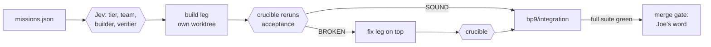

# v5.78.0 -- the artist sees why, and Jev routes the work

**Product change.** Eleven files under `python/synapse/`, +535/-1702 (`python scripts/product_surface.py --diff v5.77.1 HEAD`). Three changes you will notice in the panel, two you will not, and one deletion.

**No new installer in this release.** The `SYNAPSE-5.75.2-Setup.exe` the README links is the last built installer and does **not** carry these changes. An installer build is a separate, later act.

## What you will notice

**A failed tool tells you why.** Before, the panel showed a failed tool's *input* (the first 120 characters of its JSON) as the failure detail, and the translator that turns raw errors into plain words had zero callers. Now the four error branches in the worker emit the translated reason, the Work face renders it, and the raw input moves to the tooltip. Pinned so the error detail can never equal the input again. (`python/synapse/panel/claude_worker.py`, `activity.py`, `face_work.py`; `tests/test_tool_failure_reason.py`.)

**Each API call carries only the tools the worker may use.** The send path handed the worker all 143 tool schemas although the worker's own default already filters to the 103 the dispatch gate allows. Measured with tiktoken: 23,970 to 15,290 prompt tokens per cold call, about a third. Warm iterations were cache reads either way. (`python/synapse/panel/synapse_panel.py`; `tests/test_worker_tool_policy.py` builds the worker exactly as the send path does under all five tool modes.)

**Every task writes one row to a usage ledger.** `~/.synapse/usage/turns.jsonl` gets one JSON row per panel task: provider, model, turns, tool calls with per-tool errors, token fields, wall milliseconds per stream, stop reason, and how it ended (completed, stopped, error, cap hit). The write sits in a `finally` so all five loop exits produce a row, and it is fenced so a disk error can never surface to you. Nothing reads it yet. It is the answer key every routing threshold in the 2026-09-21 scout report is measured against. (`tests/test_turn_usage_ledger.py`; override path `SYNAPSE_USAGE_LEDGER`.)

## What you will not notice

**The fenced Jev door exists, with no callers.** `python/synapse/jev/adapter.py` implements the six conditions the amended invariant 5 demands: an 800 ms wall-clock timeout on a daemon thread, None on any failure, `SYNAPSE_JEV` off by default and short-circuiting before any import, the key resolved once and never logged, a ledger under `~/.synapse/jev/`, refusal on the Houdini main thread, and shadow mode recorded on every row. 22 tests, all against a mocked client. Nothing under `python/synapse` imports the build-time harness (`tests/test_jev_product_boundary.py`).

**The legacy chat surface is gone.** `chat_panel.py`, `quick_actions.py`, `synapse_chat.pypanel` and the `route_chat` command are deleted. The shipped panel is the only one, pinned by `tests/test_single_pypanel.py`. Tier 2/3 of the tiered router stay until the code-first prefilter lands; that is step B of ruling 3.

## What changed in the build harness

**Jev routed this release.** Ten legs each got a tier, a team size, a builder and a referee from the shipped ROUTE and TEAM guards plus two new pick Choices, every call ledgered under `harness/jev/ledger/bp9.*`. Each leg was built in an isolated worktree branch and attacked by a crucible that reran its acceptance lines in its own throwaway worktree before anything merged. One leg came back BROKEN (the legacy retirement left a handler behind and tripped a ratchet); a fix leg on top of it turned it SOUND. Mission files, routing, rulings and every receipt and verdict are under `harness/notes/bp9/`.

- **Rails has a `none` tier.** A probe leg runs inside the orchestrator with no model: the command travels by file so quotes survive PowerShell 5.1, stdout `ACCEPT:` lines become receipt rows, and a probe that exits 0 with no ACCEPT line fails. ROUTE can never choose `none`. (`harness/battleplan/probe_receipt.py`, `tests/test_rails_none_tier.py`.)
- **The 70M wave cap is cost-weighted.** Input x1, cache create x1.25, cache read x0.1, output x5. BP8 recomputes to 20,118,147 on that basis against 79.8M on the rails basis; both totals are in the ledger. (`tests/test_cap_cost_basis.py`.)
- **Claude Code hooks fail closed.** The edit guard denies on any exception, guards `~/houdini22.0`, and fences a worktree agent out of the main checkout while leaving `~/.claude` writable. Every hook fire lands in `~/.synapse/hooks.jsonl`. Stop and TaskCompleted exit 2 while a cook error is unresolved; only a successful cook for that node or an explicit "cook errors resolved" / "resolved:" phrase clears it. (`tests/test_hooks_guard_edit.py`, `tests/test_hooks_stop_gate.py`.)
- **The `codebase-transition` skill exists.** The global CLAUDE.md named it on nine lines; nothing installed it. It now lives in the repo and in `~/.claude/skills`, sourced from that document's own sections.
- **H22 stamps are read, not typed.** The probe runner and the three doc-intel workflows read the live build and symbol count at run time instead of the 22.0.368 / 35,903 literals. A `checks.py` verb is RED until `scripts/author_lop_knowledge_22.py` re-authors the packaged Solaris knowledge on 22.0.400.

## Rulings that shaped this release

Recorded in `harness/notes/bp9/RULINGS.md`, 2026-09-21: the panel may pick a cheaper or local model per turn, downgrade-only, shadow first, once the usage ledger holds 100 rows; rails gains `none`; the legacy surface retires in two steps; Stop hard-blocks on unresolved cook errors; the cap is cost-weighted. The "about 12M" figure in the scout report was wrong; the corrected number is above.

## Not in this release

- No caller of the Jev adapter. The intent router, the escalation cascade and the tool shortlist wait for 100 ledger rows.
- Tier 2/3 of the tiered router and the code-first prefilter (ruling 3, step B).
- The packaged Solaris knowledge re-author on 22.0.400 (the new check is RED on purpose until it runs).
- An installer.
