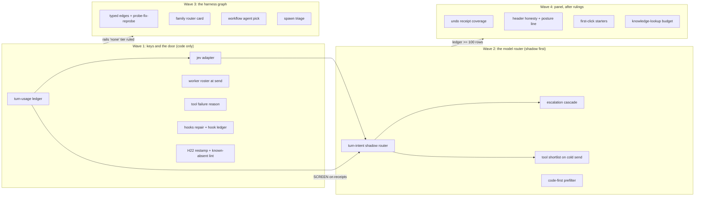

# SYNAPSE improvement scout: Jev as the router for models and agents

Date: 2026-09-21 · HEAD b24ee20b (v5.77.1) · authored by the CTO seat (Fable 5.1) on Joe's word

**Question asked.** Use Jev to improve SYNAPSE's usability generally, with Jev as a router for models and agents; cover panel design, token savings, Solaris hardening and H22 ground truth, hooks, and graph engineering with subagents and dynamic workflows. Start with a scouting team.

**How it was answered.** One dynamic workflow: seven read-only cartographers, one per lens (model router, agent router, panel design, token economy, Solaris and H22 truth, hooks and graph, artist-flow evidence), each capped at about 25 file reads. Code ranked the 34 proposals by impact, evidence and effort. A crucible attacked the top eight. All eight came back SOUND-WITH-NITS, every one with a correction that matters. The 26 below the cut are listed unattacked and say so.

Producer paths: workflow run `wf_027c1289-060`; parsed result `Claude outputs/scout_result.json`; agent transcripts under the session's `subagents/workflows/wf_027c1289-060/`.

| Run accounting | This run | Prior run (2026-09-20) |
|---|---|---|
| Agents | 15 | 30 |
| Tool calls | 372 | 806 |
| Subagent tokens | 1.49M | 4.13M |
| Wall time | 9 min | 29 min |
| Bisect probes to get past the Fable safeguard | 10 agents, 0.38M tokens | none |

Producer: the workflow task notifications' `usage` blocks. The bisect cost is real and is charged to this run; the cause is recorded in memory (schema field descriptions trip the safeguard, not the prompt).

---

## 0. The answer in one screen

**The model router does not exist yet, and the reason is not Jev.** The shipped panel picks one provider per session and holds it for the whole tool loop (`synapse_panel.py:2023-2041`, `claude_worker.py:141,259`). The tiered ladder in `routing/router.py` is reachable only from the legacy `route_chat` command, which the installed panel never sends. Per-turn token spend is never written anywhere: `UsageSink` is in memory, `synapse.log` has zero token lines. So there is no answer key for any routing threshold. Condition (f) of the amended invariant 5 cannot be met until one exists.

**The agent router half-exists.** Jev already sits on the wave edge (ROUTE, SHAPE, TEAM, EDGE). What nobody routes by code is the layer above (which harness family runs an objective), the layer inside workflows (which subagent fences a call; 14 scout sites run unfenced `general-purpose`), and the layer after receipts (`spawn[]` proposals have zero consumers).

**Order of work, as a graph, not a list.** Wave one builds the answer keys and the door. Wave two builds the router on top of the keys. Wave three engineers the harness graph. Wave four is the panel work that waits on your design rulings. Section 6 draws it.

**Wave one, all code, no ruling needed, about a week:**

1. **Turn-usage ledger.** One JSON row per panel task to `~/.synapse/usage/turns.jsonl` from a `finally` in the worker loop. Zero tokens. Everything in wave two is graded against it.
2. **The Jev adapter.** `python/synapse/jev/adapter.py`, about 150 lines, implementing conditions (a) to (f). No caller yet. The fence test already forbids the wrong import.
3. **Worker roster at send.** `synapse_panel.py:3410` hands the worker all 143 tool schemas although the worker's own default already filters to 103. Measured with tiktoken: 23,970 tokens to 15,290 on every cold call, 36 percent. Delete one keyword argument.
4. **Tool failure reason reaches the artist.** Four error branches emit the tool's input JSON as the "reason"; `translate_tool_error` has zero callers. Code only, three files.
5. **Hooks repair.** Three of four Claude Code hooks are dead or fail-open, and the bridge hook fires four no-op subprocesses per tool call at about 100 ms each.
6. **H22 restamp.** Every doc-intel artifact says 22.0.368 while the drop is 22.0.400; the probe runner would mislabel a fresh run. Two literals and one default.

**Five decisions only you can make** are in section 7.

---

## 1. Where the artist actually hurts (the evidence spine)

The artist-flow lens ranked measured pain, with the lens that owns the fix and whether a Jev judgment is on the path. Producer: `~/.synapse/logs/synapse.log` tail (84 percent of lines are pytest-authored, so counts are floors), `harness/notes/closeout-2026-09-15/artist_findings.json`, `docs/reviews/synapse-review-2026-09-18.md`.

| Rank | Pain | Evidence | Owner | Jev on path |
|---|---|---|---|---|
| 1 | Builds trip the 25-round cap | 3 cap lines on 2026-09-20 (25 turns / 47 calls, 25 / 30, WARN 47 calls) | agent router + panel | classify, shadow |
| 2 | Chat cannot start or stop a render | 40 of 137 tools denied, every render and stop tool among them | panel | the consent card (prior report) |
| 3 | Foreground render freezes the GUI | `system_prompt.py:184` teaches `soho_foreground=1` | Solaris + hooks | none, code |
| 4 | One knowledge lookup eats ~23k tokens | 91,373 B for "karma xpu", uncapped by contract | token economy | rerank, shadow |
| 5 | Recall scores stopwords at 0.90 | review :555 | model router | the recall oracle (prior report) |
| 6 | Undo receipt on 7 of 92 mutating tools | 45 of 91 handlers unwrapped | hooks / handlers | none, code |
| 7 | "Ready" header is a false green | HealthStrip never instantiated; header reads bridge only | panel | none, code |

Two of these are already owned by the prior report. The rest map onto this one.

---

## 2. The model router: what the map shows and what to build

### 2.1 Terrain

- `_prepare_connection` builds one provider from settings (`synapse_panel.py:2023-2041`). `_route_connection` runs `model_routing.choose_route` per send (`:2177-2203`, called at `:3188`), which swaps only on probed capability facts and locality, never on what the turn asks for. Default is `chosen_model`. The live setting is an Ollama relay to `deepseek-v4-flash:cloud` with no known price.
- `ClaudeWorker` holds that provider for up to 25 iterations. Each iteration re-sends tools, system prompt and the whole session history; `anthropic_provider.py:103-162` stamps three cache breakpoints so warm iterations are cache reads.
- `_route_connection` runs on the Qt main thread at send. Any 800 ms judgment placed there freezes the panel. The judgment belongs on the worker thread before iteration 0.
- Mid-loop model swaps are net negative: the prompt cache is per model, so a swap forfeits the ~18k-token cached prefix unless four or more iterations remain.
- The scout dropped "Jev ranks cloud models by quality" (no answer key exists and `model_routing.py:109` says metadata never claims quality) and "Jev over the Ollama discovery list" (a catalogue answers it).

### 2.2 The build, in dependency order

**2.2.1 Turn-usage ledger (attacked, SOUND-WITH-NITS).** Wrap `_conversation_loop` in try/finally; in the finally, on the worker thread, append one row: provider id, model identity, turns, tool calls with per-tool ok/fail, `UsageSink.snapshot()` fields (None stays None), per-stream wall ms via `perf_counter` around `:259-266`, stop reason, outcome in {completed, stopped, error, cap_hit}. The whole append inside try/except. The crucible found five exit paths (`:255`, `:302`, `:371`, `:373`, raises from `:340`/`:259`), so a row written anywhere but a finally loses the aborted and cap-hit rows, which are exactly the ones the router needs. It also found that a disk-write raise inside the loop would surface to the artist as `stream_error`, so the append must swallow. Drop the `live_metrics.py:445` citation: that field is server-side router latency, not stream time.

**2.2.2 The adapter (unattacked, jev_role none).** `python/synapse/jev/adapter.py`: `judge(state, questions, *, lane) -> dict | None`. Daemon thread plus `future.result(timeout=0.8)`; every exception returns None; `SYNAPSE_JEV=off` (default off) short-circuits before any I/O; key via a providers-style `resolve_key`, never logged; JSONL ledger under `~/.synapse/jev/<lane>.jsonl` with request hash, answers, ms, mode; returns None when called on the Houdini main thread. Pin with a socket-mocked test for each condition. Every product item below calls this and nothing else.

**2.2.3 Turn-intent shadow router (unattacked).** Before iteration 0, on the worker thread: code first (the `_CONVERSATIONAL` regex, `has_images`, task need), then one adapter request. Shadow: ledger the answers beside the usage row. Arm only after at least 100 keyed rows and a measured agreement.

Questions (one request):
- `intent` Choice: `chit_chat` / `answer_question` / `inspect_scene` / `build_or_edit` / `render_or_export` / `run_code`. Criteria name what each needs from the scene.
- `complexity` Score, four levels: one read or a greeting; one node or one parm; several nodes in one context; multi-context (SOP plus LOP, materials plus render).
- `destructive` Noul: deletes, overwrites, or writes outside the scene.
- `needs_tools`, `needs_scene_state` Nouls.

Policy: a new routing mode `auto_per_turn`, downgrade-only. `intent` in {chit_chat, answer_question} with complexity at the lowest level and confidence at or above the measured floor routes to the connection's cheap model (default = session model, so offline is byte-identical). `destructive` above threshold never downgrades. Model access scope (`model_access.py:454`) still gates cloud. The tier-route proposal (P28) is the same request read a second way: `work_shape` at `read_or_explain` maps to the mechanical model the rails already name. One Jev call, two consumers.

**2.2.4 Escalation cascade (unattacked).** After `end_turn` on a cheap-routed turn: code first, a regex of `hou.*` and `pdg.*` tokens in the reply against the symbol table (a phantom escalates with no Jev); then one adapter request with Nouls framed true = escalate: `answer_incomplete`, `contradicts_tool_results`, `claims_unperformed_action`. Any above 0.7 re-runs the same messages on the strong model and replaces the reply, ledgering both. Worth it only when escalation rate times strong cost is below the cheap-turn savings, which the ledger measures. Without this net, auto-routing trades cost for silent quality loss.

**2.2.5 Code-first prefilter (unattacked).** Lift the deterministic tiers into the panel send path before any model: conversational replies, recipe match, exact-repeat cache keyed on text plus scene hash. A match answers in milliseconds with no worker and ledgers as `tier=instant`. Mark `_handle_route_chat` and Tier 2/3 legacy pending your ruling (decision 3).

### 2.3 What it costs

Jev state for the router is about 700 tokens, about $0.00003 per turn. A cheap-routed Anthropic turn reads the cached prefix at 0.10 instead of 0.30 $/Mtok and outputs at 5 instead of 15. Producer: `model_facts.py:64-68`. Latency adds 330 to 575 ms before the first stream on the worker thread; the LLM turn is seconds.

---

## 3. The agent router: the layers nobody routes

### 3.1 Terrain

Three agent families, none routed by code. BATTLEPLAN waves: a CTO seat hand-writes missions, `orchestrate.ps1:565` launches a bare `claude` on a brief with one manifest-wide effort and a rails-tier model; the 34 charters in `.claude/agents/` never reach a leg. Workflows: each orchestrator hard-codes exactly one workflow name, and every `agent()` names its type by literal or omits it; only `memory-loop.js:163-247` has a code-listed roster with fallbacks. Roster census: crucible referenced 52 times, cartographer 10, eight agents zero. Receipt `spawn[]` proposals are held for Joe by prose in `_template.md:97`; no code consumes them.

### 3.2 The build

**3.2.1 Program wave graph (attacked, SOUND-WITH-NITS).** Run this program as wave BP9 authored from the scouts' structured output, not as a to-do list. The crucible corrected the mechanism: the existing RANK guard parses a symptom-and-hypotheses markdown and cannot be reused; its fallback is fail-open (Jev absent sets spawn=True for every item, so 25 proposals become 25 legs against a cap of 8). Surviving shape: code dedupes by file refs against the prior report's items and ranks by the existing score; Jev judges only the grey band via a new rank spec whose fallback is `manual`; missions come from a new `workflows.json` template KEY → BUILD → CRUX → TIDY; `joe_ruling_needed` legs are authored `held` and flip only on your manifest edit, never on a file watch. Cap math: two survivors per wave under the 8-leg cap. Probe-only legs need a `none` tier in rails before they can run (JEV_HELM open ruling 3).

**3.2.2 Typed edges on the wave graph (unattacked).** Extend `jev-workflows/v1` with `edges: [{from, to, guard: {kind: exit_code | receipt_status | jev, question_id, threshold, max_loops}, on_fail: hold | repair | manual}]`. The orchestrator evaluates exit code and receipt status itself; `kind: jev` calls `jev_edge.py` once per receipt; None routes to `on_fail`; an unlisted edge is `manual`. Add the template the repo lacks: PROBE → FIX → REPROBE with a loop guard. Memory solaris-harden says isolated green hides composed regressions, always on the second action; nothing today loops back after a fix. Blocked on the same rails `none` tier.

**3.2.3 Harness family router (unattacked).** `harness/jev/families.json` catalogues the 18 workflows, 5 shapes, rope and manual, each with a one-line charter and the gates it halts at. One Choice over ~25 plus Nouls `needs_gui` (routes to manual) and `closed_already` (run the closure predicates first). Output is a card the CTO seat reads, never a launch. Confidence below 0.6 routes to manual. SHAPE runs only when the family is battleplan. This is the skill-suggestion cookbook one layer up.

**3.2.4 Workflow agent pick (unattacked).** `harness/jev/jev_pick.py`: request 1 is one wide Choice over the 34-charter roster plus Nouls `needs_write` / `needs_bash` / `needs_live_houdini`; code gates at 0.30 and drops candidates whose tool fence contradicts the Nouls; request 2 reads the top three charters in full with a per-candidate `fits` Noul that can reject all, falling back to `general-purpose` with the charter inline. The author's literal stays the byte-identical fallback. Moves ~14 unfenced scout sites onto read-only fences.

**3.2.5 Spawn triage (unattacked).** Run at TIDY: gather `spawn[]` and `for_ruling[]` across a wave's receipts; per item a plausibility Score plus Nouls `duplicate` (against the backlog and missions) and `refuted` (against the CRUX rows). In-class, not duplicate, not refuted becomes a candidate skeleton via `jev_shape.expand`; everything else is a ranked held queue for you. Nothing appends to `missions/` without your word.

**3.2.6 Leg charter pick (unattacked, lower impact).** For a mission carrying `"charter": "auto"`, a Choice over referee-shaped or forge-shaped charters by class, with a `readonly_fit` Noul; the winner's charter body is appended to the brief like `team_lines`. Retires the STD_CRUX block re-copied per wave.

---

## 4. Panel design and usability

### 4.1 Terrain

Two panels exist. The shipped one is `python/synapse/panel/synapse_panel.py` (4,083 lines). The legacy `chat_panel.py` is loaded only by an uninstalled `.pypanel`. The 2026-09-15 artist lens measured the legacy file, and FR-1 was then fixed there. The design backlog in `harness/design_review/RANKED.md` has 31 of 40 calls open on your ruling in the stated order R2-A1 → R3-A/B → R2-B1 → R2-C1/C3. `GateWidget` is mounted at `:1604` for cards no shipped path raises.

### 4.2 The build

**4.2.1 Tool failure reason reaches the artist (attacked, SOUND-WITH-NITS).** The crucible corrected the artist-visible half: `activity.py:111-120` drops non-receipt detail, so the Work face shows "Failed: label" with nothing, and the input surfaces only in the Review flag at 70 chars. The fix touches three files: emit `translate_tool_error(...)[:120]` at the four input-emitting branches (`claude_worker.py:436/509/520/568`), render the detail in `activity.tool_status` for the error phase, carry the input in the `face_work.py:266` tooltip. Pin that the error detail never equals `json.dumps(tool_input)[:120]`. The Jev half is decoration: the 21 regex categories already map every hit, so there is nothing for a shadow to disagree with. Dropped.

**4.2.2 Header sentence honesty (unattacked).** The one visible state sentence derives from Houdini reachability alone (`synapse_panel.py:3751-3770`), so it reads Ready while memory is degraded or no model is chosen. Make it the minimum over bridge, model (chosen and checked) and memory (not degraded) with three strings. A 25-test pin exists only on a local worktree branch (decision 5 asks whether to salvage it).

**4.2.3 Consent posture line from live state (unattacked).** One health-strip cell sourced from the live bridge (`_gate is None`, consent callback identity) and `worker_policy.resolve_mode()`: "Auto-approve, standard tools" / "Strict, read only" / "Unrestricted", UNKNOWN when the bridge cannot be read. The words are yours (RANKED.md territory); the derivation is code.

**4.2.4 First-click starters by scene state (unattacked, ruling).** On an empty scene every shipped affordance is a dead end; "make a box" from the README appears nowhere. Code derives `scene_empty` and network kind from the existing 10 s context poll; when empty, the palette leads with three starters. Which three, and whether they replace or precede Explain / Fix / Optimize, is your call. A Jev shadow can later pick which single starter to pin first from network kind and selection.

**4.2.5 Retarget the artist findings to the shipped panel (unattacked, ruling).** FR-1, FR-2, FR-3, FR-5 and U3 cite the legacy file. Delete or quarantine `chat_panel.py`, `quick_actions.py` and `synapse_chat.pypanel` under the one-source-of-UI-truth rule with a test that exactly one pypanel is installable, then re-run the two lenses on `synapse_panel.py` only. Decision 3.

**4.2.6 Undo receipt coverage (attacked twice, both SOUND-WITH-NITS).** Two scouts found it independently. The crucible corrected the counts (7 call sites, 5 labels, of 50 group sites; 92 of 132 registered commands mutate) and killed the "single opener" mechanism because three shipped pins forbid it (`tests/test_undo_receipt.py:131-145, 170-177`). Surviving shape: keep every literal `with hou.undos.group("X")`, merge `undo_receipt("X", rolls_back_on_failure=<True iff that handler calls performUndo>)` at each success return, and add two pins: every literal group label has a same-file receipt, and the rollback flag is true only where `performUndo` is in the enclosing handler (14 verified sites). Disk-touching groups (render, HDA package, texture bake, TOPs sequence, insert cache) go on a named exempt list or get a distinct "file on disk is not reversed" sentence. `render_settings` mints a receipt only when overrides are non-empty. About 55 tokens per mutating result, not 15.

---

## 5. Token economy

### 5.1 Terrain, measured

| Item | Number | Producer |
|---|---|---|
| Full tool roster per call | 143 tools, 88,819 JSON chars, 23,970 tokens (tiktoken cl100k) | `get_anthropic_tools()` |
| Worker roster the dispatch gate actually allows | 103 tools, 15,290 tokens (strict 51, ~5k) | `get_anthropic_tools_for_worker()` |
| System prompt | 7,167 chars, ~1.8k tokens (tone 2,754, tool guidance 2,803) | `build_system_prompt` |
| Session history | restored from disk at `:3279`, never compacted | `synapse_panel.py` |
| Cache breakpoints | 3 (last tool, system, last message) | `anthropic_provider.py:103-162` |
| Conversations ending in 1 turn, 1 tool | 24 of 74 | `synapse.log` |
| Gaps between conversations over the 5-minute cache TTL | 37 of 73 | `synapse.log` |
| BP8 spend that was cache reads | 93 to 97 percent (fresh+create 0.69M / 0.72M / 2.16M per leg) | three leg transcripts |
| BP8 context per call | 234k to 373k, 119 to 135 calls per leg | `ledger_orch_20260920-131709.json` |

The scout dropped the system-prompt trim (cached after the first call; the tone file is your voice), the memory block (does not exist on the panel path), and output-token tuning (1.6M of 79.8M).

### 5.2 The levers, ranked by tokens saved per artist turn

1. **Worker roster at send (attacked, SOUND-WITH-NITS).** The crucible found the fix is a dedupe of shipped code: `claude_worker.py:119-121` already defaults to the filtered roster when `tools` is None; `synapse_panel.py:3410` overrides it with the full 143. Delete the keyword argument, or add the filtered getter to the guarded import at `:113`. Add a test that builds the worker the way the send path does and asserts the roster under all five `SYNAPSE_WORKER_TOOL_MODE` values. Saves 8,680 tokens per cold call; warm iterations are cache reads either way.
2. **Tool-result history compaction (unattacked, evidence NONE FOUND on the panel).** Per-result cap at ~12k chars with an "elided, re-call narrower" tail, images exempt; at turn end, stub tool results older than two turns before the history is stored. The harness analogue (234k to 373k context per call) is the only measurement; the usage ledger makes the panel number real.
3. **Knowledge-lookup section budget (attacked, SOUND-WITH-NITS).** Recomputed at HEAD: 92,829 bytes served for "karma xpu"; 65 percent is `parameters[].description`. Code alone: drop descriptions on the panel path, 92.8k to 27.7k; answer-only 10.3k. Fold by `heading` (the corpus has no `folder` field; id-prefix gives 153 groups, over the Noul cap). Shape the result at `claude_worker.py:452`, never in `handlers.py`, because `/mcp` and the panel share `mcp/tools.py:128` and Target 5 stays uncapped there. Jev rerank stays shadow: one Noul per heading (at most 32) ordering the non-matching headings. Note that on Claude the re-send is a cache read; the full price repeats only on Ollama, Gemini and Nemotron.
4. **Harness cap on a cost basis (unattacked, ruling).** `meter_transcript.py:15` weighs cache reads at 1x, so BP8's 79.8M was a metering halt, not a spend halt: cost-weighted it is about 12M. Record the four usage fields separately, enforce the cap on the field you name, and add prompt token counts to the Jev ledger rows (169 rows, zero token fields).
5. **Tool shortlist on cold send (unattacked).** On a cold send only, one Jev Choice over the `tool_bridge` group names picks a fixed-order ~25-tool subset plus the read core, and the roster is held for the whole conversation so warm iterations stay cache reads. Cold sends are half of all sends. About 10k tokens fewer per cold send. Shares the single request with the intent router.

---

## 6. Solaris hardening and H22 truth

### 6.1 Terrain

Hardening is mostly landed: of the 2026-07-21 gap ledger's items, B1 to B6, B9, M1, M3, M7 to M10, M14, M25, M40, C6 and C10 read closed in today's tree. Still open: M23 (`solaris_guardrails` has zero callers), M31 (the order-dependent table in `handlers_usd.py:1631` carries three phantom types and misses `graftstages`, `graftbranches`, `layerreplace`), M41 (two lighttype vocabularies unprobed), B8 residue (nine `createNode("rectlight" | "spherelight")` sites in `lighting.md`), C7 (`layoutChildren` unadjudicated), M50 (no 22-catalogue behaviour pins). H22 truth moved to 22.0.400 (catalogue 222 types, symbol table 36,472) but every doc-scout artifact, probe result and the packaged knowledge file still say 22.0.368 / 35,903.

### 6.2 The build

**6.2.1 Solaris parm truth (attacked, SOUND-WITH-NITS, impact raised to 4).** The crucible found three of the four proposed hython probes are already answered by the committed catalogue `rag/catalog/h22.0.400/Lop.json` (lighttype menu tokens, sublayer defaults, `max_inputs` for all 218 types), and that both lighttype vocabularies are phantom: the real token is `UsdLuxDistantLight`; `recipe_book.py:434` says `distantlight`, `hda_recipes.py:113` and `prompt_to_hda.py:111,120` say `distant`. It also found the "regenerate from max_inputs > 1" rule unsafe (43 types qualify, including every karma node). Surviving shape: (A) code now from committed evidence: curate `_ORDER_DEPENDENT_TYPES = {merge, sublayer, graftstages, graftbranches, layerreplace, reference, addvariant}`, fix the three lighttype sites, add `tests/test_solaris_tables_vs_catalog.py` pinning both against the catalogue; (B) a two-item hython probe only: `hou.undos.areEnabled / undoLabels` on 22.0.400 and `layoutChildren` after `karmarendersettings` on an unsaved scene.

**6.2.2 Restamp to 22.0.400 (unattacked).** `h22_probe_candidates.py:156` defaults `against_build` to 22.0.368; `h22-doc-scout.js:95,108,115`, `h22-probe-adjudicate.js:52` and `phantom-sweep.js:142` hard-code "35903 symbols, 22.0.368". Stamp from `hou.applicationVersionString()` and read the symbol table header at run time. Then re-author the packaged knowledge with `scripts/author_lop_knowledge_22.py`, add a `checks.py` verb asserting the newest packaged stamp equals `drop.json`, and add 22-catalogue behaviour goldens. Commands are in the proposals `probe-runner-live-build-stamp` and `knowledge-22-restamp-and-behaviour-pin`.

**6.2.3 Known-absent corpus lint (unattacked).** Extend `tests/test_corpus_lop_conformance.py` with a regex sweep over `rag/skills/**/*.md` for `createNode("<known_absent>")` driven by the catalogue's `known_absent` keys, then rewrite the nine `lighting.md` sites to the `light` LOP. The memory note that says B8 is closed should read "B8 partial".

**6.2.4 Citation head in adjudication (unattacked).** The first doc-intel pass mislabelled 15 of 42 candidates that were probe-authoring bugs. A deterministic pre-pass (eval literal True/False in code; SyntaxError is NOT_RUNNABLE; empty stdout is INCONCLUSIVE) then one Jev request per candidate: `claim_support` Choice (supports / contradicts / unrelated) plus `needs_live_node` Noul. Confidence below 0.6 goes to an agent as today. Replaces three 12k-token agent reads with one request at about $0.0014. Shadow against the 42 stamped `probe_verdict` values.

**6.2.5 Render prompt stops teaching foreground (unattacked, pain rank 3).** `system_prompt.py:184` tells the model to set `soho_foreground=1`, the one render mode no shipped stop control reaches. The log on 2026-09-21 09:29:33 shows a background render running 2,002 ms on a worker thread with Qt not stalled. Swap the line, align the `_tool_registry.py:1461` description, add a conformance test over prompt and corpus (memory: fix both).

---

## 7. Hooks and graph engineering

### 7.1 Terrain

`.claude/settings.json` wires four scripts on eight events. `guard-edit-targets.py` is a substring deny list, about 95 ms per fire, fail-open on exception, guards `houdini21.0` but not `~/houdini22.0`. `check-python.sh` always exits 0. `synapse_hooks_bridge.py` fires on seven events at about 100 ms each and reads an events file whose writer is never auto-loaded, so every fire but the SessionStart ping is a no-op; its Stop cook-error gate exits 1, which Claude Code treats as advisory (only exit 2 blocks). Wave graphs have deps but no typed edges; 18 workflow scripts hand-code gates as `if`s, 12 use `parallel` where `pipeline` would do, 5 have no crucible stage. The global CLAUDE.md names a `codebase-transition` skill on nine lines; it does not exist anywhere under `~/.claude`.

### 7.2 The build

**7.2.1 Hooks fail-closed repair (unattacked, ruling).** Stop and TaskCompleted exit 2 on a cook error so the gate is real; guard-edit adds `houdini22.0/`, denies any path outside the project dir when cwd is under `.claude/worktrees/` (memory: worktree-absolute-path-hits-main-tree), and denies on parse error; check-python exits 2 on a compile failure; until the writer is auto-loaded, remove the four no-op bridge fires. Saves about 100 ms per Bash, Edit or Write.

**7.2.2 Hook-fire ledger (unattacked).** One shared `_ledger.py` appending `{ts, event, script, decision, ms, session}` to `~/.synapse/hooks.jsonl`. Zero decisions. The producer path for every hook number above and the answer key for 7.2.3.

**7.2.3 Prompt-intent router hook (unattacked, ruling).** On UserPromptSubmit: layer A regex for release acts, family exits and wave names, no Jev; layer B only when A is silent: one Jev request with `intent` Choice (`codebase_transition` / `release_act` / `family_exit` / `wave` / `ordinary`), `needs_skill` Noul, `stop_now` Noul, over the first 500 chars of the prompt, cwd, branch, last tool and the skill roster. Emit at most 40 tokens of `additionalContext` only when confidence is at or above 0.6 and `stop_now` is below 0.5. Never a block. This is the first place the CLAUDE.md protocols get routed by something other than the model's memory of a 40k document.

**7.2.4 Typed edges** are in 3.2.2 and the **program wave graph** in 3.2.1.

### 7.3 The program as a graph

Every edge is a guard the harness already has (SCREEN on receipts, ROUTE on tier) or one this report proposes (typed edges). Wave 1 needs no ruling. Wave 2 needs decision 1. Wave 3 needs decision 2. Wave 4 needs decisions 3 to 5 and the RANKED.md calls.

---

## 8. Five decisions only you can make

1. **May the panel pick a cheaper or local model per turn?** A third routing mode, `auto_per_turn`, downgrade-only, local first, inside the permission you already granted, armed only after the shadow ledger clears a measured agreement. Yes unblocks wave 2. No leaves one model per session as a product promise, and the router work stops at the ledger and the prefilter.
2. **Does rails gain a `none` tier so probe legs can run inside the orchestrator?** JEV_HELM open ruling 3. Yes unblocks typed edges, the probe-fix-reprobe template and the program wave graph. No means probe legs stay outside the orchestrator and wave 3 loses its loop.
3. **Retire the legacy surface?** `chat_panel.py`, `quick_actions.py`, `synapse_chat.pypanel`, `route_chat` and Tier 2/3. Yes lets the artist findings be re-run on the shipped panel and lets the prefilter lift the deterministic tiers cleanly. No keeps them as a documented legacy surface and the findings stay half-measured.
4. **Should Stop hard-block on an unresolved Houdini cook error?** Exit 2 makes the gate real; today it is stderr nobody reads. Same ruling covers whether a `codebase-transition` skill gets written, since CLAUDE.md names one that does not exist.
5. **Which basis does the 70M wave cap mean?** Rails (cache reads at 1x), cost-weighted (reads at 0.1x), or a per-leg context ceiling. BP8 halted TIDY on the first; on the second it was at about 12M.

Two smaller rulings sit inside wave 4 and are RANKED.md territory: the three starter labels on an empty scene, and the exact posture words in the header.

---

## 9. What the crucible corrected, in one place

- Usage ledger: five loop exits, not one; write in a `finally`; swallow disk errors.
- Tool failure reason: the Work face shows nothing, not the input; fix needs `activity.py` and `face_work.py` too; the Jev half is decoration.
- Worker roster: the worker already defaults to the filtered roster; the panel overrides it. Real saving 8,680 tokens per cold call, not 8,148.
- Program wave graph: RANK is not reusable and fails open; fallback must be `manual`; cap math is two survivors per wave.
- Undo receipts: 7 sites of 50, not 8 of 52; the single-opener mechanism contradicts three shipped pins; ~55 tokens per result, not 12 to 15; the rollback flag is a static claim and needs a pin.
- Solaris parm truth: three of four probes are already answered by the committed catalogue; both lighttype vocabularies are phantom; the regenerate rule would flag every karma node.
- Knowledge-lookup budget: 65 percent of the payload is parameter descriptions; the grouping key must be `heading`; shape at the worker, never in the shared handler; on Claude the re-send is a cache read.

## 10. What was not attacked

Twenty-six proposals sat below the cut and are reported as the scouts wrote them, with their file references, in `Claude outputs/scout_result.json` (`proposals` array, ranks 9 to 34). Three of them carry impact 4 and deserve an attack before they are built: `turn-intent-shadow-router`, `wave-edges-typed-guards`, `cap-hit-stall-card`. `tool-result-history-compaction` scored impact 4 with no panel measurement; the usage ledger produces one.
