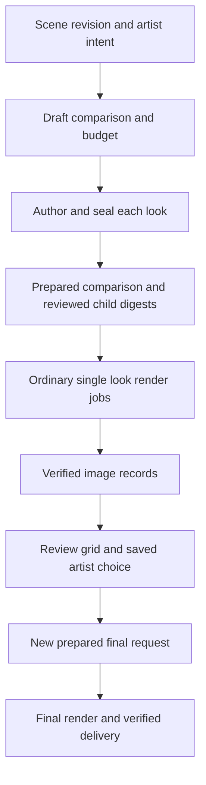

# SYNAPSE TRIAGE FARM blueprint

Artist first rendering and look review with Houdini TOPs

For Joe Ibrahim · 8 September 2026

## 1 Product decision

Build TRIAGE FARM's useful creative loop inside **SYNAPSE Render**: preview a shot, compare deliberate alternatives, then render the chosen look. Retain yesterday's durable rendering service and design the experience around the artist's task. The old panel, scripts and visual design remain research references.

This proposal replaces the 7 September blueprint's implementation ordering and the discovery document's tentative migration plan. It brings a small comparison trial forward while preserving the original requirements for portable inputs, exact outputs, resource control and a qualified two-machine farm. It is a design proposal; it does not extend the measured capabilities of the current code or ratify a release.

| Approach | Benefit | Consequence |
| --- | --- | --- |
| Extend SYNAPSE Render with comparison jobs | Preserves tested job handling and one artist workflow | Recommended; requires explicit variant and review contracts |
| Rebuild the old standalone panel around its scripts | Familiar location and a small initial surface | Retains a second workflow and requires replacing its execution assumptions |
| Build a general farm administration product first | Broad operational coverage | Delays the visual workflow and exceeds the demonstrated need |

Keep **Render** as the front door through the existing button, Commands and `/render`. Preview, comparison and final rendering are activities within that workspace. TRIAGE FARM can remain the initiative's name; exact product naming is a later usability decision.

## 2 What already exists

The implementation qualified on 7 September is commit `52a79c536dde9576806a9e75efbf516bb152f3bd`, based on v5.67.1. Later commits through `c867f61f` changed documentation. The feature remains local to `feature/tops-renderfarm-20260907` at this review; this planning work does not merge, push or install it.

| Existing capability | Evidence and useful limit |
| --- | --- |
| Direct modeless Render view | Works without a model and preserves the chat draft; native Qt checks covered six interaction suites and five layouts |
| Prepared immutable requests and durable history | Exact reviewed digest, duplicate-request handling, lost-acknowledgement recovery and cancellation fencing |
| Detached local TOPs execution | Owned Windows process supervision; frozen per-frame USD; file-mode USD Render Scene on Houdini 22.0.400 |
| Verified render results | Sixteen native images across one-frame, animated and sparse-frame fixtures; 256 by 256, eight samples, Karma CPU, one RGBA EXR product |
| Integration verification | 197 focused tests passed; full suite had 8515 passes, nine failures and 392 skips; all nine failures reproduced on the unchanged baseline |

Current profile admission caps are two CPU threads and one task per job, 120 frames, 2048 pixels per dimension, 128 samples and 60 seconds per frame. These are caps, not measurements proving production quality or performance at every setting. There is no machine-wide capacity queue, qualified XPU profile or working HQueue deployment. Job-level verification does not yet provide incremental verified thumbnails. [Implementation evidence](C:/Users/User/OneDrive/Documents/ChatGPT/SYNAPSE_Refactor/checks/tops-implementation/README.md), [profile limits](C:/Users/User/OneDrive/Documents/ChatGPT/SYNAPSE_Refactor/worktrees/tops-renderfarm/python/synapse/farm/backend.py:37), [current final verification](C:/Users/User/OneDrive/Documents/ChatGPT/SYNAPSE_Refactor/worktrees/tops-renderfarm/python/synapse/farm/native_driver.py:544).

Retain the current request service, store, package checks, output verifier, process ownership and transport authorization as the foundation. Preserve their existing behavior while adding versioned interfaces. No historical test result qualifies the new comparison or remote features.

## 3 The artist journey

The workspace opens on the current render context and the most relevant recent job. Show the shot/source revision, camera, frame scope, quality and destination in one readable summary. For the current saved-HIP boundary, make the included save revision clear and surface unsaved changes. A future capture-current-scene action needs its own native qualification before replacing that boundary.

1. **Preview.** Render the current frame with a qualified preview preset. Keep an ordinary sequence render available for artists who already know what they want.
2. **Compare.** Choose one supported property and a small explicit set of alternatives. Keep the original as a reference. Show the exact resulting count before preparation: the pilot is one original plus three alternatives at one frame, producing four images.
3. **Prepare and render.** Preparation resolves the actual scene packages and budget. The primary action then names the reviewed scope. Changed values invalidate the prepared revision; already authorized scope uses the existing permission policy without per-image approval prompts.
4. **Review.** Add each independently verified result to its stable grid position. Keep failed or pending slots visible. Offer a larger side-by-side view with synchronized framing and consistent display settings.
5. **Choose.** Store the selected variant identity and the image used to make the decision. Creating a final render uses that record. Selection itself changes no parameter in the artist's scene.
6. **Finish.** Prepare a new final request, render the exact selected look and scope, and open verified outputs. Applying the selected look back to the editable scene is a separate, explicit, undoable action with conflict checking.

Use one primary next action in each state. Keep recent jobs, the original image, selected alternatives and collapsed sections stable through close/reopen. Persist comparison selections separately from job completion. Avoid resorting thumbnails as results arrive. Provide keyboard navigation, visible focus, text labels alongside color and responsive layout at the already-tested narrow width and large text settings.

Keep farm addresses, account setup and device diagnostics in a setup view. Ordinary artists choose an available destination such as This computer or Render farm and see a concrete reason when it cannot run. Technical graph and log details remain available on demand. Closing the view only closes that view.

AI may suggest a typed variation plan or explain a failure. The artist can inspect and edit that plan before submission. Job execution, polling, cancellation and result retrieval remain usable with the model disconnected or busy. Free-text suggestions do not become arbitrary Python in the farm.

## 4 Workflow and ownership

This is a product workflow spanning separate jobs. A TOP cook must finish and release its resources when the preview work is done. Human review lives in durable application records; it must not hold a Houdini process or license open while the artist decides.

SYNAPSE owns intent, preparation, request identity, admission, observations and acceptance. TOPs owns dependency execution within each qualified recipe. Local scheduling or HQueue assigns the eligible tasks. Image review consumes accepted artifacts and produces review records; it cannot declare unverified render work successful.

Use a durable **comparison parent with single-look child jobs**. The existing v1 plan rejects unsupported request fields, while completion verification expects the exact frame set for one look. Retain historical v1 jobs and their operations. New variant children use the versioned source/preparation entry described below while preserving the same single-look, exact-frame acceptance model.

Persist the parent intent, variant identities, authoring operation and child request IDs before the first external preparation launch; current preparation already starts native work. Bind the resulting sealed sources and reviewed child digests before render admission. Recovery reconciles those recorded operations instead of preparing or submitting the whole comparison again. A UI-only group, raw wedge index or several untracked submissions cannot serve as the parent.

Keep one durable store owner. Comparison records and admission state extend that owner through versioned tables or interfaces; they must not create a second conflicting job registry. Render, comparison and final submission pass through the existing consent and ownership checks on every supported transport. [Current plan schema](C:/Users/User/OneDrive/Documents/ChatGPT/SYNAPSE_Refactor/worktrees/tops-renderfarm/python/synapse/farm/models.py:131), [request service](C:/Users/User/OneDrive/Documents/ChatGPT/SYNAPSE_Refactor/worktrees/tops-renderfarm/python/synapse/farm/service.py:25).

## 5 Make each variation real

Start with one allowlisted numeric binding in a disposable Solaris fixture. Its descriptor identifies the exact parameter or USD property, type, range, base value and authoring recipe. Record explicit values and any random seed. Prefer one deliberate dimension in the pilot; do not make fifty random combinations the default.

The new authoring stage works from a frozen source revision in an isolated native process. For every variant, apply the typed override, read back the intended scene property, export to an owned package and seal the complete required inputs. The original is a distinct baseline with no overrides. Never mutate one shared USD file between concurrent renders.

SideFX's Wedge documentation describes attribute generation and supported pull/push binding. Merely putting a value on a work item does not ensure a separate wrapper applies it to a USD file. The Wedge selection-preview option can modify the interactive HIP; keep that behavior out of ordinary result browsing. Qualify the actual chosen export node's override handling with native readback and image evidence. [Wedge binding behavior](https://www.sidefx.com/docs/houdini/nodes/top/wedge.html).

Two implementation routes are possible: a qualified Wedge-to-export recipe that consumes target bindings, or an explicit typed authoring stage producing sealed variant packages. Begin with whichever makes the one-binding fixture easiest to inspect and prove. Both must supply the same variant manifest and ordinary child render request. Do not import the old scripts as libraries; they call their command-line entry points during import. [Legacy findings](C:/Users/User/OneDrive/Documents/ChatGPT/SYNAPSE_Refactor/worktrees/tops-renderfarm/docs/tops/TRIAGE_FARM_MIGRATION.md).

The pilot acceptance test checks four distinct authored values and the intended effect on rendered appearance. Distinct hashes alone cannot prove the correct material or camera changed. Include a control where an override is logged but deliberately not applied; that result must fail qualification.

## 6 Records and final render provenance

| Record | Essential content |
| --- | --- |
| Comparison plan | Version, parent ID, frozen base identity, authoring recipe, explicit variants, exact frames/camera/products, quality, destination and total budget |
| Variant manifest | Stable variant ID, base digest, typed overrides, authored-property readback, sealed source/package identity and child request IDs |
| Image receipt | Parent and variant IDs, child request/digest, attempt ID, frame/product key, path/hash, decode result, required schema and writer-finalization evidence |
| Review record | Verified image identities, view transform/configuration identity, thumbnail version, advisory measurements and explicit unavailable states |
| Artist selection | Chosen variant IDs and reviewed image receipts, selection revision and provenance into the new final request |

Each single-look child owns its frame outputs. The parent owns the full key `(comparison, variant, camera, frame, product)` through the mapping above. New variant children carry the versioned source descriptor; existing v1 records remain unchanged. Do not overload `verified_frames` with variant indexes or assume PDG work-item IDs remain stable after regeneration.

Yesterday's package contains the requested frames and their discovered dependencies. **A one-frame preview package does not qualify an arbitrary final sequence.** The first comparison-to-final test stays on that same frame and uses an independently qualified higher-quality profile. A sequence requires preparation covering its exact frames, time samples, shutter interval and frame-dependent textures/caches.

For expanded final scope, use a base snapshot whose required inputs can be independently resolved and sealed. Otherwise request an explicitly reviewed new source revision and carry the selected typed overrides into that revision. Never silently read the artist's latest scene under the old selection identity. A changed binding, source or environment requires revalidation; an unavailable original asset is a visible preparation failure.

Selecting a thumbnail, preparing a final render and applying changes back to the current shot are distinct operations. Before applying, compare the current target identity/value with the captured base. Show conflicts and preserve intervening artist edits; use SYNAPSE's existing scene-operation and undo discipline.

## 7 Review verified results

For the first four-look trial, each child contains one frame. Populate a partial parent grid as each child passes its existing complete-job verification. This preserves the proven acceptance boundary. Publishing individual frames from a still-running multi-frame child is a later native/service extension, requiring per-image finalization, ordered observations, cancellation fences and invalidation rules.

Show verified images, running work and failed slots separately. Two ready images out of four are useful partial results. They do not complete the comparison. Cancelling the comparison preserves previously completed child outputs and the explicit cancelled/partial state. A subsequent final request may use an explicitly selected verified subset; that is new work with its own reviewed scope.

Retain the linear EXRs. Generate thumbnails and contact sheets from the exact accepted image manifest, using a packaged, qualified OCIO configuration and dependent LUTs. Record input color space, display/view/look, exposure and denoising policy. The unchanged-look baseline uses the same preview settings as the alternatives. A separate high-quality reference is optional, explicitly budgeted work for evaluating the preview preset.

Missing color configuration means review is unavailable until repaired. Do not silently substitute the prototype's tone curve. View adjustments create a new review revision without changing the raw render. Label any viewport or lower-quality approximation honestly and verify its suitability for the intended decision.

Technical file acceptance and aesthetic judgment are separate. Missing/corrupt outputs or mismatched schemas fail acceptance. Luminance, noise and sharpness can become optional observations after validation against intentional dark, soft and stylized scenes. Keep valid images visible and selectable. No fixed rejection percentage, automatic beauty score or automatic final render belongs in the pilot.

A contact sheet is an export of the review manifest. Check its writer result, decode and membership before offering it. Failure leaves the underlying completed renders intact and offers **Retry review**. Changed or deleted source images invalidate dependent review availability and selection readiness; a stale thumbnail cannot conceal that change.

## 8 TOPs graph and package discipline

Preserve the qualified file-mode USD Render Scene path for ordinary children. The new comparison layer prepares its variants before those child graphs execute. In each child, expand frames exactly once, verify the native work-item/output keys against the manifest and route outputs to owned attempt paths. A later single graph containing all variants is an optimization requiring a versioned matrix-aware verifier.

Use native TOP nodes where their behavior is qualified. ROP Fetch or ROP USD Output can support controlled export, and Wedge can describe alternatives when its downstream consumer is proven. Wait for All gathers dependencies; it does not prove artifact validity. Static versus dynamic item generation and in-process versus out-of-process/service execution are different decisions. The initial recipes use a small explicit key set, avoiding dynamic graph completeness as an additional unknown. [Local node references](C:/Users/User/OneDrive/Documents/ChatGPT/SYNAPSE_Refactor/checks/tops-research/help-sources.json), [USD Render Scene](https://www.sidefx.com/docs/houdini/nodes/top/usdrenderscene.html), [Wait for All](https://www.sidefx.com/docs/houdini/nodes/top/waitforall.html).

Separate creative authoring from quality and output routing. The current exporter rewrites render settings and products; a new variation must not accidentally target a property that these later overrides replace. Reopen the exported stage and verify the composed value after all relevant edits. A USD edit cannot substitute for recooking a procedural Houdini/Copernicus change that needs evaluation and texture export.

The source contract must explicitly distinguish a saved HIP from a sealed package and bind the original resolution context, source bytes, authoring recipe, environment, declared frame scope and dependency manifest. Today's API does not accept generic USD packages simply by changing a filename. Add a versioned preparation entry while retaining v1 readers and operations. A child digest must include its actual source/variant identity, not merely an editable UI label.

Package the required USD layers, textures, UDIMs, caches, HDAs and color configuration for the admitted scope, or pin qualified immutable shared assets. Reject unresolved live references and mutable external dependencies. Flattened USD captures a composed result; it does not preserve all alternate USD variant selections or collect every external asset. Create requested alternatives before flattening or retain a separately qualified authoring source. The existing texture fixture does not establish arbitrary-scene portability. [USD export reference](https://www.sidefx.com/docs/houdini/nodes/out/usd.html), [Copernicus material export](https://www.sidefx.com/docs/houdini/nodes/cop/usdmaterial.html).

PDG services are a later optimization for repeated Houdini startup, with process lifetime and reset behavior to qualify. They are not a substitute for persistent job records or farm admission. Measure startup cost first and prove that one look's state cannot leak into the next service task. [SideFX PDG services](https://www.sidefx.com/docs/houdini/tops/services.html).

## 9 Shared capacity and farm operation

Add one admission owner covering ordinary renders, comparison children, native preparation and review processing. Persist queued intent and resource reservations before launching work. Enforce CPU, memory, renderer slots and actual concurrent license capacity across requests. A per-graph one-slot scheduler cannot prevent another detached graph from using the same device.

The artist sees exact planned image counts and configured limits. Preparation consumes resources too. Budgets include preparation, previews and permitted retries; final rendering is a separately reviewed scope. A budget threshold stops further admission and requests bounded cancellation according to the profile. Release capacity only after the consumer's exit is confirmed; otherwise keep the affected worker or device excluded from allocatable capacity. Fencing late outputs prevents acceptance but does not stop a process consuming CPU, GPU or a license.

Show measured elapsed usage. Offer time ranges only from comparable observations with their conditions and uncertainty. An unmeasured ETA stays unknown. A spending estimate additionally needs an actual rate source. Do not label local processing free or promise a fixed GPU speedup.

Qualify an artist-workstation profile with measured interactive headroom. External applications also consume resources, so reservations among SYNAPSE jobs alone cannot guarantee an idle GPU. A future XPU profile records actual devices, driver/runtime, scene compatibility, memory pressure and cancellation behavior. Device selection, exclusive admission and memory eligibility are distinct checks. Keep CPU and XPU output qualification separate.

For a small farm, begin with an always-available controller, two compatible workers and shared storage. HQueue remains the machine scheduler. Its standalone mode runs a TOP Cook driver using the graph's default scheduler; set and verify the actual child scheduler and explicit output TOP. Record backend IDs, callbacks/MQ configuration, process lifetime and reconnectable observations. [HQueue standalone behavior](https://www.sidefx.com/docs/houdini/nodes/top/hqueuescheduler.html).

Keep the journal on controller-local disk with one owner and a tested backup. Use worker-readable immutable packages and service-account access to shared output roots. Qualify UNC paths on Windows; OneDrive synchronization is not a package-ready signal. Reserve controller/MQ capacity so control jobs cannot consume every slot required by their own children. Count headless driver, authoring and renderer license use, rather than assuming the old project's machine or license inventory.

The HQueue adapter must prove actual worker participation, storage and callback reachability, detachment, cancellation and restart recovery. A submitted parent ID alone cannot establish successful remote frame execution. Shared studio access also requires authenticated user/job ownership; the current shared transport key does not supply it.

## 10 Failure and recovery behavior

| Situation | Artist result and execution rule |
| --- | --- |
| One alternative fails | Keep its slot and explanation; compare verified siblings; parent remains partial |
| Child or final submit reply is lost | Reconcile durable IDs; expose uncertainty when unresolved; never resend blindly |
| Panel or service restarts | Recover parent membership, known children and selections before any new admission |
| Review generation fails | Preserve completed renders; retry review from verified inputs |
| Output changes after review | Invalidate its dependent review availability and require a fresh valid result |
| Comparison is cancelled | Fence the parent, stop queued starts, cancel owned running children and retain earlier valid results |
| Worker or TOP driver disappears | Reconcile descendants and fence old writers before a replacement attempt |
| License, storage or environment is unavailable | Explain the actual cause and preserve scope; no silent quality or renderer substitution |

Choose one logical retry authority and a total retry budget. Each replacement has a distinct attempt identity and output directory. If native scheduler retries are enabled, account for them explicitly; do not let nested retry policies multiply work. Reading status must not become an alternative submission path.

Keep automatic rerendering disabled in the first pilot. An explicit retry prepares a new child request ID linked to the same variant and the previous failed attempt, with its additional resource scope reviewed. The current service does not launch an attempted request a second time. Preserve prior child records and reconcile any uncertain or live predecessor before admitting its replacement.

Retain logs, manifests, review records and selected results under a declared retention policy. Cleanup operates only on owned, unreferenced artifacts after retention checks. A request to retry, dirty or cancel is not permission to delete accepted images.

## 11 Execution milestones

Each milestone ends with an independent review, concrete artifacts and an artist-use checkpoint. Existing successful behavior remains covered. Pure tests cannot qualify Houdini execution or a farm; use disposable native fixtures for those claims.

| Milestone | Deliverable | Acceptance evidence |
| --- | --- | --- |
| M0 Shared admission | One durable capacity owner used by existing jobs and preparation | Two competing requests obey the total budget; restart, unknown process state and cancellation cannot leak or double-allocate capacity |
| M1 Four-look local trial | Versioned authoring/source contract, durable comparison parent and stable results grid with a qualified common display transform | Original plus three actual alternatives at one frame; exact readback, image membership and consistent view/exposure; verified children appear independently; model disconnected |
| M2 Selected look to final | Durable selection and a newly prepared same-frame render at qualified higher quality | Correct selected property and lineage survive reopen; changed source/image cannot silently enter final; review failure never rerenders good images |
| M3 Two-worker farm | HQueue adapter, shared packages, worker/license/identity admission and controller operations | Both workers contribute exact expected outputs; sparse frames and comparison children recover from lost replies, worker loss, driver failure and cancellation |
| M4 XPU and production trial | Measured device profile, intended production quality and broader frame/dependency coverage | Bounded CPU/XPU comparison where applicable, memory/concurrency controls, preview-to-final fidelity and one scoped real-shot trial |

Provisioning research and the operator runbook can proceed alongside M1 and M2. The product's farm claim waits for M3. If real hardware or licensing prevents M3, deliver the accurately labeled local workflow and record that constraint without advertising a completed farm. Arbitrary procedural edits, automatic search/ranking, multi-shot generalization, distributed simulation and cloud bursting remain later scope.

The first artist trial is deliberately concrete: open Render with chat busy; prepare four looks; compare a completed child while another waits; select a look; close and reopen; recover the selection; prepare a final for the same frame; verify that final against the selected authored value. Include a failed child and a failed review artifact in separate runs.

## 12 Implementation seams and checks

| Area | Intended work |
| --- | --- |
| `farm/models.py`, `store.py`, `service.py` | Preserve v1 jobs; add versioned source/comparison/selection records through one durable owner |
| `farm/backend.py`, `native_driver.py`, `package.py` | Separate qualified authoring, packaging and graph construction where required; preserve existing supervision and acceptance |
| Proposed admission component | Shared preparation/render/review reservations, queue recovery and accountable retry policy |
| Proposed comparison and review components | Stable child membership, display artifacts, selection provenance and final preparation |
| `panel/render_presenter.py`, `render_workspace.py` | Extend the existing view with stable results, selection and recovery; reuse SYNAPSE design-system controls |
| Farm handlers and tool transports | Apply the same scoped authorization and ownership to parent, child, review and final actions |

The proposed component names describe responsibilities, not new registered APIs. Avoid a second standalone application, a second vendored design system, UI-owned scheduling or an unqualified bridge to the installed TRIAGE panel. If a dockable Python Panel becomes useful later, extract an embeddable view and test it as another host of the same service. Reusing yesterday's `QDialog` unchanged as a Python Panel widget is not a verified integration.

Required negative controls include omitted authoring, swapped variant labels, duplicate frame expansion, source change between branches, output tampering, corrupt thumbnails, missing OCIO assets, lost submission acknowledgement and cancellation during exhausted capacity. The controlled fixture should catch four differently labeled but unvaried images. Intentional darkness or a subtle real edit in an arbitrary scene must not be misclassified as a failed render merely because two images look similar.

For farm qualification, add missing worker dependencies, inaccessible service-account paths, license exhaustion, callback failure, saturated controller slots, driver death and restart reconciliation. Compare local/remote images under an explicitly chosen tolerance. Test the actual close/disconnect behavior on a disposable authorized session; yesterday's offscreen Qt tests did not establish that live-application case.

Track time to first verified preview, the artist's interventions needed to reach a selected final, recovered decisions after interruption, total renderer usage and delivery correctness. Set usability and performance targets from measured trials. No delivery date, throughput gain or budget estimate is established by this proposal.

## 13 Sources and document status

This revision combines the [7 September blueprint](C:/Users/User/OneDrive/Documents/ChatGPT/SYNAPSE_Refactor/blueprints/2026-09-07-tops-renderfarm-blueprint.md), [qualified implementation record](C:/Users/User/OneDrive/Documents/ChatGPT/SYNAPSE_Refactor/checks/tops-implementation/README.md), [TRIAGE concept and source findings](C:/Users/User/OneDrive/Documents/ChatGPT/SYNAPSE_Refactor/worktrees/tops-renderfarm/docs/tops/TRIAGE_FARM_MIGRATION.md), and independent [artist](C:/Users/User/OneDrive/Documents/ChatGPT/SYNAPSE_Refactor/checks/tops-refactor/artist-review.md), [architecture](C:/Users/User/OneDrive/Documents/ChatGPT/SYNAPSE_Refactor/checks/tops-refactor/architecture-review.md) and [TOPs](C:/Users/User/OneDrive/Documents/ChatGPT/SYNAPSE_Refactor/checks/tops-refactor/tops-review.md) reviews.

The supplied panel's actual path is [python_panels/tops_farm.pypanel](C:/Users/User/OneDrive/Documents/houdini22.0/python_panels/tops_farm.pypanel). It loads `G:/KARMA_TRIAGE_FARM/panel/tops_farm_panel.py`. The July prototype was documented against 22.0.368 and was inspected statically. Its existence is not a new render or farm qualification.

Relevant user-cache entries and installed 22.0.400 help were consulted; the TOPs review records byte matches against the current archive. Official SideFX Wedge, USD, HQueue and services documentation was checked on 8 September 2026. Documented behavior, inspected source and yesterday's actual native execution are kept distinct. This is a CG-supervision design recommendation, not a statement on behalf of SideFX.
