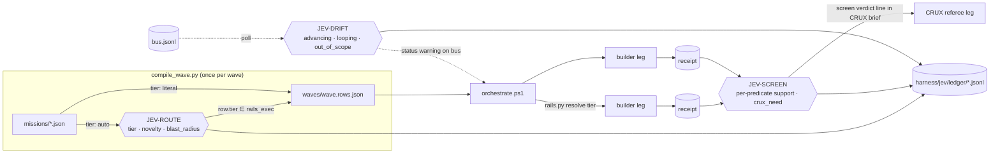

# JEV BLUEPRINT — typed guard nodes on the wave graph

Status: DRAFT v0.1 · 2026-09-19 · authored by the CTO seat (Fable 5.1) on Joe's word
Source of truth for the mission `BP6-JEV`. Update this card; don't multiply it.

## 0. One paragraph

A BATTLEPLAN wave is already a graph. Missions are nodes, `deps` are edges, receipts
are the tokens that flow along the edges, and `orchestrate.ps1` is the scheduler.
Jev (TypeSafe's System One model) does not join that graph as another agent. It becomes
three **typed guard nodes** sitting on three edges. Each guard takes text state the harness
already has, asks a fixed set of questions, and returns typed answers with calibrated
probabilities. **Code owns every decision.** Jev supplies the judgment; the policy that
turns a judgment into an action is a plain Python function you can read, and every
judgment is written to a sidecar ledger so the wave can grade the guard afterwards.

Jev never writes a file, never edits a mission, never touches the panel, never sees an
artist's scene. It is a build-time instrument, like the crucible is, and like the crucible
its verdicts are recorded, not trusted.

## 1. Why this, why now

The wall is tokens. BP5's plan came to ~141M against a 90M ceiling: three Opus legs at
~32M plus a CRUX pass at ~45M. The cheapest place to cut is not inside a leg — a leg is
one Claude Code session and its size is what it is — but at the **edges**, where the
harness decides which model runs a leg and how deep the referee reads.

Today both of those decisions are literals typed by the CTO seat while authoring the
wave (`author_bp4.py: "tier": "mechanical"`) or fixed by the mission shape (CRUX reads
every receipt in full). Jev makes them judgments with a probability attached, at
$0.042 per million input tokens, output free, in ~150 ms per call. A whole wave of
routing plus screening costs well under one cent.

## 2. The graph, with the guards on it

Solid edges are built in mile 1. The dotted DRIFT edge is defined (questions exist) but
not wired to the orchestrator; it is mile 2.

## 3. The three guards

### 3.1 JEV-ROUTE — edge: mission → row (compile time)

**State**: the mission JSON (`id, band, class, name, note, targets, acceptance,
crucible_criteria, touches, readonly, deps`) plus the tier table from `rails_exec.json`.
Under 3k tokens. Well inside the 32k state limit.

**Questions** (one request, run in parallel):
- `tier` — Choice over the tier names that exist in `rails_exec.json`. Criteria are
  structured (`what / not_for / examples`) and live in `questions.json`; the *names* come
  from `rails_exec.json` at runtime, so Jev can never choose a tier the harness can't resolve.
- `novelty` — Score: reproduce-from-sources / apply-known-pattern / design-new.
- `blast_radius` — Score: notes-and-docs / harness-and-tests / product-and-contracts.

**Policy** (`jev_route.decide`, plain code):
1. `band == TRUST and class == crucible` → `referee`, no call. The crucible seat is a
   design decision, not a judgment.
2. Else ask. If `tier.confidence < 0.60` → `reasoning` (round up; a wrong cheap route
   costs a failed leg plus a re-run).
3. If Jev says `mechanical` but `novelty.score ≥ 1.5` or `blast_radius.score ≥ 1.5`
   → `reasoning`. Two independent judgments have to agree before Haiku gets a leg.
4. Any exception, missing key, network error → `reasoning`, logged as `fallback`.

**Trigger**: a mission with `"tier": "auto"`. A literal tier is passed through untouched
and byte-identical to today. `SYNAPSE_JEV=off` makes `auto` behave as `reasoning`.

**Shadow mode**: `python harness/jev/jev_route.py --wave bp4 --shadow` routes every
mission of a wave *without* writing rows and prints Jev's tier beside the author's tier.
Run this for one wave before flipping any mission to `auto`.

### 3.2 JEV-SCREEN — edge: builder receipts → CRUX brief

**State**: the mission's `acceptance` and `crucible_criteria` and the `note`'s stated
expectations, plus the receipt's `status`, `acceptance[{predicate, verdict, evidence}]`,
`findings`, `for_ruling`. Under 6k tokens per leg.

**Questions**:
- `acc_<i>` for each acceptance row — Choice: does the receipt's *evidence text*
  support the *predicate*? `supports / partial / does_not_support / claims_unknown`.
  One question per row; independent, so they run in parallel.
- `self_contradiction` — Noul: does any finding, for_ruling entry, or evidence cell
  contradict a `pass` verdict elsewhere in the same receipt?
- `crux_need` — Score: clear-pass-with-reproducible-numbers / pass-asserted-with-vague-evidence / evidence-contradicts-or-UNKNOWN.

**Policy** (`jev_screen.decide`):
- Any `acc_i` with `does_not_support ≥ 0.60` → verdict `FLAG`, and the row number.
- All rows `supports` at `confidence ≥ 0.80`, `self_contradiction ≤ 0.20`,
  `crux_need.score ≤ 0.50` → verdict `CLEAR`.
- Otherwise `REFEREE`.

**What the verdict does.** It never removes the crucible. "The crucible trusts no
builder's proved_it_bites" stays the rule. The verdict becomes **one line in the CRUX
brief** per leg: `screen: CLEAR (spot-check 2 rows)` or `screen: FLAG row 1 (count line
21 vs expected 22)` or `screen: REFEREE (full read)`. The referee still authors its own
mutations; it just starts where the evidence is thin instead of reading everything at the
same depth. That is where the 45M shrinks.

Worked example from BP4: the RULINGS receipt claimed pass on "table row count equals
the recount" while its own count line read 21 against an expected 22 stated in the
mission note. That is an `acc_0: does_not_support` at high probability; the screen would
have flagged it before CRUX spent a full read discovering it.

**Shadow mode**: `python harness/jev/jev_screen.py --wave bp4` screens every receipt of
a finished wave and prints the verdict beside CRUX's actual verdict from
`BP<n>-CRUX_verdicts.md`. Agreement on the BROKEN leg and the SOUND-WITH-NITS legs is
the calibration evidence. Run this before the brief line goes live.

### 3.3 JEV-DRIFT — edge: bus events → orchestrator (poll time) — mile 2

**State**: the last N bus events from one leg (`claim / finding / progress / status`),
the mission's `targets` and `touches`, elapsed wall time.

**Questions**: `advancing` (Noul), `looping` (Noul), `out_of_scope` (Noul).

**Policy**: shadow only in mile 2. When live, two consecutive polls with
`looping ≥ 0.80 and advancing ≤ 0.20` post a `status` warning to the bus. The budget
rails still do the stopping; drift only makes the stop happen at minute 10 instead of at
the token cap.

## 4. Invariants (the crucible checks these)

1. **rails_exec.json stays the only place a model is named.** Jev chooses among its
   tier names; it never emits a model string.
2. **A literal tier is byte-identical to today.** Only `"tier": "auto"` invokes Jev.
3. **Fail closed.** No key, no network, SDK error, malformed answer → the pre-Jev
   behaviour (`reasoning`; full CRUX read; no drift warning), and a `fallback` row in the ledger.
4. **Every call is ledgered.** `harness/jev/ledger/<wave>.route.jsonl`,
   `<wave>.screen.jsonl`: state hash, question ids, raw probabilities, decision, reason.
   UNKNOWN stays UNKNOWN: a fallback row never carries a fabricated probability.
5. **Jev is never on the product path.** Nothing under `panel/`, `synapse/`, or the
   package imports `harness/jev`. Jev is a build instrument, like the crucible.
6. **Questions are data.** `harness/jev/questions.json` is the whole "prompt". Editing a
   criterion is a text edit with a diff, not a code change.

## 5. Where it lives

    harness/jev/questions.json         the question graph (Jev's "prompt")
    harness/jev/jev_client.py          key, SDK call, fail-closed wrapper, ledger writer
    harness/jev/jev_route.py           ROUTE guard + shadow CLI
    harness/jev/jev_screen.py          SCREEN guard + shadow CLI
    harness/jev/ledger/                append-only judgment ledger, per wave
    harness/jev/mission.BP6-JEV.json   the mission that hardens this (move into
                                       battleplan/missions/ on Joe's word)
    harness/battleplan/compile_wave.py resolves tier:auto via jev_route (4 lines)
    harness/battleplan/mission_schema.py accepts tier ∈ rails tiers ∪ {auto}

## 6. Miles

    M0  this card + questions.json + route + screen + shadow CLIs        (tonight)
    M1  shadow run over BP4 (8 missions, 7 receipts); agreement table    (tonight, needs key)
    M2  one mission on tier:auto in the next authored wave; CRUX brief carries the
        screen line; ledger compared to rails ledger after the wave
    M3  DRIFT wired to the orchestrator poll, shadow first
    M4  screen results fed back as features: which evidence shapes predict BROKEN

## 7. What Jev is not for here

Anything a regex or a catalog lookup answers: phantom node names, hardcoded px values,
off-palette hexes, missing count lines, `gui_required` flags, dependency gating. Those
stay exact checks in code. Jev only earns a call where the question is semantic —
"does this evidence support that predicate" — and where the answer changes what the
harness does next.

## 8. Cost and limits (TypeSafe docs, 2026-09-19)

Jev 1.13 · `jev-latest` · $0.042 / M input tokens, output free · 64k context, 32k state ·
1,200 req/min · text only · hosted API (no local engine). Prices and limits are theirs,
not measured here; the ledger records real token counts per call.
